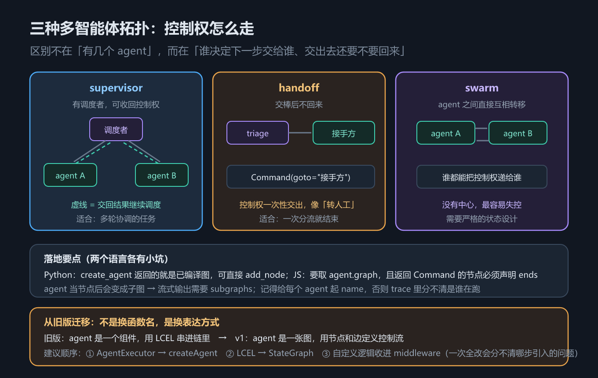

# 第 18 章 多智能体、迁移与部署：三种拓扑、一张映射表与上线前检查

## 一、这一章要解决的问题

前面 13 章讲的都是「一个 agent 怎么搭」。真实系统里常常不止一个：查库的、发邮件的、管账单的，各管一摊。这一章处理三个收尾问题：

1. **多个 agent 怎么组织**——谁调度谁？交出去的控制权还要不要收回来？三种拓扑各有适用场景，也各有失控风险。
2. **老代码怎么迁过来**——很多团队手上是 LCEL / `AgentExecutor` 写的 agent。v1 不是换个函数名，而是换了一套控制流的表达方式。
3. **上线前要确认什么**——本地跑通不等于能上生产，有三件事必须在上线前定死。

> 版本锚点：本章结论在 `langchain` **1.4.2** / `langgraph` **1.2.12**（Python）与 `langchain` **1.5.11** / `@langchain/langgraph` **1.4.17**（JS）上实测；示例源码见 `code/python/18_multiagent.py` 与 `code/typescript/18_multiagent.ts`。

## 二、机制与原理

### 2.1 三种拓扑

先给结论：**拓扑不是「哪个更高级」，而是「控制权怎么流动」**。这张表回答「我该选哪种」。

| 拓扑 | 控制权怎么流 | 适合 | 风险 |
|---|---|---|---|
| **supervisor** | 有一个中心**调度者**，反复决定下一步交给谁，**交出去还能收回来** | 需要多轮协调的任务 | 调度者成为瓶颈 / 单点；调度逻辑写不好会来回踢皮球 |
| **handoff** | 交棒后**不回来**，接手的 agent 负责到底 | 一次分流就结束的场景（像「转人工」） | 交错了没人兜底；链路一长就难追 |
| **swarm** | **没有中心**，agent 之间互相转移，谁接手谁往下传 | 任务边界模糊、需要互相接力的场景 | 最容易失控：可能循环转圈、可能没人收尾 |



*图 32　多智能体拓扑：supervisor 有调度者、handoff 交棒不回头、swarm 互相转移*

三者的关系可以这样理解：**handoff 是 supervisor 去掉「收回来」这一步，swarm 是 handoff 去掉「中心」。** 去掉的东西越多，越省事，也越难管。

> 本章示例实现了 supervisor 与 handoff 两种（`code/python/18_multiagent.py`）；**swarm 没有实现**——它需要更严格的状态设计才能避免转圈，本章只讲机制与风险，不贴不可信的代码。

### 2.2 把 agent 当节点：supervisor 的搭法

`create_agent` / `createAgent` 返回的就是**一张已编译的图**。在 LangGraph 里，**已编译的图可以直接当节点**塞进父图——于是「一个 agent」和「一个普通节点」在图里没有区别。

supervisor 拓扑于是就是：父图里放一个 `supervisor` 节点做路由，再放若干 agent 节点做具体工作，用条件边把调度结果连过去。实测两个结论：

- **agent 当节点后就变成了子图**。子图的内部输出默认不透传——要流式看到里面的 token，父图 `stream` 时必须加 `subgraphs=True`（第 12 章那条坑，在多智能体里会原样重演）。
- **一定要给每个 agent 起 `name=`**。否则 trace 里所有 agent 都叫同一个默认名，你分不清是哪一路在跑——这正是上一章 trace 的用途。

两边的写法有一处硬差异：**Python 侧可以直接 `add_node("db", db_agent)`；JS 侧 `createAgent` 返回的是包装对象，必须取 `.graph`**（差异清单第 9 条）。

### 2.3 handoff：用 `Command` 交棒

handoff 不需要调度者节点反复介入，交棒动作发生在**节点内部**：节点返回 `Command(goto=...)`，控制权直接跳到目标节点，且**不会再回来**。

- Python：`from langgraph.types import Command`，节点返回 `Command(goto=target, update={...})`。
- TypeScript：`import { Command } from "@langchain/langgraph"`，返回 `new Command({ goto: target, update: {...} })`。

这里有一条 JS 侧特有的硬约束：**返回 `Command` 的节点必须在 `addNode` 的第三个参数里用 `ends` 声明可能的去向**，否则**编译期**就报 `UnreachableNodeError`。Python 侧靠类型注解 `Command[Literal[...]]` 表达同一件事（差异清单第 8 条）。

还有一个容易混的点：**`Command(goto=...)` 只能在节点内部返回，不能当 `invoke` 的输入**；能当输入用的只有 `Command(resume=...)`（第 12 章）。handoff 属于前者。

### 2.4 从 LCEL / AgentExecutor 迁移到 v1：一张映射表

很多团队手上是旧版代码。下面这张表回答「我以前那样写，现在该怎么写」。旧版指 LCEL 编排 + `AgentExecutor`（Python）/ 旧版 JS 写法。

| 能力 | 旧版写法 | v1（Python） | v1（TypeScript） |
|---|---|---|---|
| 建 agent | `AgentExecutor(agent=..., tools=...)` | `create_agent(model, tools)` | `createAgent({ model, tools })` |
| 调用 | `executor.invoke({"input": "..."})` | `agent.invoke({"messages": [...]})` | `agent.invoke({ messages })` |
| 输入形态 | 字符串 `input` | 消息列表 `messages` | 消息列表 `messages` |
| 输出形态 | `{"output": "..."}` | `{"messages": [...]}`，取 `messages[-1]` | 同左，取 `messages.at(-1)` |
| 提示词 | prompt 模板字符串 | `system_prompt=` + middleware | `prompt` / `systemPrompt` + middleware |
| 记忆 | `memory=ConversationBufferMemory()` | checkpointer + `thread_id` | checkpointer + `thread_id` |
| 工具错误 | `handle_tool_error` / `ToolException` | `@wrap_tool_call` 或 `ToolErrorMiddleware` | `wrapToolCall` 或 `toolErrorMiddleware` |
| 运行时注入 | `InjectedState` / `InjectedStore` | `runtime: ToolRuntime` | `runtime` 参数 |
| 链式拼装 | LCEL 的 `|` 管道 | `StateGraph` 的 `add_node` / `add_edge` | `StateGraph` 的 `addNode` / `addEdge` |
| 扩展点 | 自定义 Agent / 继承 | middleware 的六个钩子 | middleware 的六个钩子 |

这张表里有两行是**机制替换**，不是「换了个名字」：**工具错误**（v1 的 agent 路线**不再推荐** `ToolException` / `handle_tool_error`——注意这两个 API **仍在包里**，只是入口换成了中间件，差异清单第 13 条）与**运行时注入**（`InjectedState` / `InjectedStore` 统一收口到 `runtime: ToolRuntime`，差异清单第 14 条）。这两处照抄旧代码在 v1 上都不成立，得改写法。

> ⚠️ **「旧版写法」一列未在本机重跑**：本机只装了 v1（`langchain` 1.4.2 / `langgraph` 1.2.12），旧版 LCEL / `AgentExecutor` 环境没有安装，这一列来自官方迁移文档与示例中的对照表，**不是实测结论**；v1 侧那一列是实测。

### 2.5 迁移的心智转变与三步顺序

比记 API 更重要的是**心智模型换了**：

- **旧版：agent 是一个「组件」**。你有一个 executor，用 LCEL 的 `|` 把它串进一条链里，链的形状是**线性的**。
- **v1：agent 是一张「图」**。你用节点和边定义控制流，用 middleware 扩展行为，图可以**有分支、有循环、有并行**。

所以「迁移」不是换函数名，而是**把控制流从「链式表达」改成「图表达」**。这也是为什么迁移完代码结构往往要变——旧版表达不了的东西（条件分支、循环、人工审批），新版才表达得了。

**三步建议顺序**（一次全改，出了问题分不清是哪一步引入的）：

1. **先换 `AgentExecutor` → `create_agent`**。这一步**只动构造与调用形态，不动流程结构**——但**不是「行为等价」**：对照 2.4 的映射表，输入从 `input` 变成 `messages`、输出不再有 `output` 字段、hook 要搬进 middleware、state 必须改成 `TypedDict`。把它当成一次**接口迁移**来做，改完先确认功能没变，再往下走。
2. **再改 LCEL → `StateGraph`**。这一步才真正动结构，是风险最大的一步。
3. **最后把自定义逻辑收进 middleware**。前两步稳定之后，再把横切逻辑（日志、限流、错误处理）从业务代码里抽出来。

### 2.6 两种部署形态

agent 最终要跑到某个地方。这张表回答「托管还是自托管」。

| | 托管（Agent Server） | 自托管 |
|---|---|---|
| 持久化 | 服务端自动提供（checkpointer / store 不用自己配） | 自己接 Postgres 等 |
| 可观测 | 自带 trace、评测、人工审批 UI | 自己接观测后端 |
| 自由度 | 受平台约束 | 最高 |
| 代价 | 绑定平台，本地与线上差异要自己盯 | 持久化必须**一开始就做对** |

自托管里最要命的是最后那句。**中途从 `InMemorySaver`（JS `MemorySaver`）换成 `PostgresSaver`，历史数据是搬不过去的**——两种 saver 的存储结构不同，已经产生的会话找不回来。这不是「换个类」就完事，而是**上线前就要定死**的事。

### 2.7 上线前必查三件事

不管选哪种形态，这三条必须在上线前确认。这张表回答「上线前还有哪些坑没堵」。

| # | 检查项 | 不做的后果 |
|---|---|---|
| 1 | **检查点有没有持久化** | 进程一重启，所有会话丢失；多副本部署时同一用户请求落到不同副本，上下文对不上 |
| 2 | **有没有调用次数上限** | agent 可能陷入循环，模型调用和工具调用都要设上限，否则账单和延迟同时失控 |
| 3 | **高风险操作有没有人在回路** | 扣款、发邮件、删文件这类不可逆操作，必须有 `interrupt()` 审批（第 12 章） |

## 三、代码：Python 与 TypeScript

### 3.1 supervisor：把 agent 当节点

Python 侧直接把两个编译好的 agent 当节点加进父图，用条件边做路由。

```python
from langchain.agents import create_agent
from langgraph.graph import END, START, StateGraph, add_messages

db_agent = create_agent(model=ScriptedChatModel(script=[...]), tools=[query_db], name="db_agent")
mail_agent = create_agent(model=ScriptedChatModel(script=[reply("邮件已发。")]),
                          tools=[send_email], name="mail_agent")

class TopState(TypedDict):
    messages: Annotated[list, add_messages]
    route: str

def supervisor(state: TopState) -> dict:
    """极简路由：真实项目里这里通常是一次模型调用。"""
    last = str(state["messages"][-1].content)
    return {"route": "mail" if "邮件" in last else "db"}

top = (
    StateGraph(TopState)
    .add_node("supervisor", supervisor)
    .add_node("db", db_agent)      # ← 已编译的 agent 直接当节点
    .add_node("mail", mail_agent)
    .add_edge(START, "supervisor")
    .add_conditional_edges("supervisor", lambda s: s["route"], {"db": "db", "mail": "mail"})
    .add_edge("db", END).add_edge("mail", END)
    .compile()
)
out = top.invoke({"messages": [{"role": "user", "content": "帮我查一下数据库"}]})
print(out["route"], out["messages"][-1].content)     # db 查到 3 行。
```

TypeScript 侧唯一的结构差异：**`createAgent` 返回的是包装对象，要当节点必须取 `.graph`**。

```typescript
import { createAgent, HumanMessage } from "langchain";
import { Annotation, END, START, StateGraph } from "@langchain/langgraph";

const dbAgent = createAgent({ model: model1 as any, tools: [queryDb], name: "db_agent" });
const mailAgent = createAgent({ model: model2 as any, tools: [sendEmail], name: "mail_agent" });

const TopState = Annotation.Root({
  messages: Annotation<any[]>({ reducer: (a, b) => a.concat(b), default: () => [] }),
  route: Annotation<string>({ default: () => "" }),
});

const top = new StateGraph(TopState)
  .addNode("supervisor", (s: any) => ({
    route: String(s.messages[s.messages.length - 1].content).includes("邮件") ? "mail" : "db",
  }))
  // ⚠️ JS 侧要把 agent 的 .graph 拿出来当节点（Python 侧可直接传 agent）
  .addNode("db", (dbAgent as any).graph)
  .addNode("mail", (mailAgent as any).graph)
  .addEdge(START, "supervisor")
  .addConditionalEdges("supervisor", (s: any) => s.route, { db: "db", mail: "mail" })
  .addEdge("db", END).addEdge("mail", END)
  .compile();
const out: any = await top.invoke({ messages: [new HumanMessage("帮我查一下数据库")] });
console.log(out.route, out.messages.at(-1).content);
```

### 3.2 handoff：用 `Command` 交棒

Python 侧接待员节点返回 `Command(goto=...)`，直接跳到目标，不再回来。

```python
from langgraph.types import Command

class HandState(TypedDict):
    messages: Annotated[list, add_messages]
    owner: str

def triage(state: HandState) -> Command:
    """接待员：判断该谁处理，然后交棒。"""
    text = str(state["messages"][-1].content)
    target = "billing" if "账单" in text else "tech"
    return Command(goto=target, update={"owner": target})     # 交棒后不回来

hand = (
    StateGraph(HandState)
    .add_node("triage", triage)
    .add_node("billing", lambda s: {"messages": [{"role": "assistant", "content": "[账单组] 已处理"}]})
    .add_node("tech",    lambda s: {"messages": [{"role": "assistant", "content": "[技术组] 已处理"}]})
    .add_edge(START, "triage").add_edge("billing", END).add_edge("tech", END)
    .compile()
)
print(hand.invoke({"messages": [{"role": "user", "content": "我要问账单"}]})["owner"])   # billing
```

TypeScript 侧必须**在 `addNode` 里声明 `ends`**，否则编译期报错。

```typescript
const triage = (s: any): Command => {
  const target = String(s.messages.at(-1).content).includes("账单") ? "billing" : "tech";
  return new Command({ goto: target, update: { owner: target } });
};

const hand = new StateGraph(HandState)
  // ⚠️ 返回 Command 的节点必须声明 ends，否则编译期报 UnreachableNodeError
  //    Python 侧靠类型注解 Command[Literal["billing","tech"]] 表达同一件事
  .addNode("triage", triage, { ends: ["billing", "tech"] })
  .addNode("billing", () => ({ messages: [{ role: "assistant", content: "[账单组] 已处理" }] }))
  .addNode("tech", () => ({ messages: [{ role: "assistant", content: "[技术组] 已处理" }] }))
  .addEdge(START, "triage").addEdge("billing", END).addEdge("tech", END)
  .compile();
const out: any = await hand.invoke({ messages: [{ role: "user", content: "我要问账单" }] });
console.log(out.owner);        // billing
```

> 完整可跑版本（含迁移映射表的打印、部署形态说明）：`code/python/18_multiagent.py`、`code/typescript/18_multiagent.ts`。

## 四、常见坑与边界条件

1. **agent 当节点后就是子图**，流式要加 `subgraphs=True`，否则「图能跑、结果也对，但打字机不动」（第 12 章的坑在这里重演）。
2. **忘了给 agent 起 `name=`**，trace 里分不清谁在跑——多智能体下这个问题比单 agent 严重得多。
3. **JS 侧 agent 不能直接当节点**，必须取 `.graph`；Python 侧可以直接传。
4. **JS 侧返回 `Command` 的节点必须声明 `ends`**，否则是**编译期**报 `UnreachableNodeError`，不是运行期。
5. **`Command(goto=...)` 不能当 `invoke` 输入**，只有 `Command(resume=...)` 可以——handoff 属于节点内部行为。
6. **swarm 最容易失控**：没有中心就没人保证收尾。要用就先把「终止条件」和「最大转移次数」设计死。
7. **`ToolException` / `handle_tool_error` / `InjectedState` / `InjectedStore` 在 v1 都不是推荐写法**（差异清单第 13、14 条）——前两者的 API 仍在包里、只是 agent 路线换了入口；后两者被 `runtime: ToolRuntime` 取代。迁移时这两处是机制替换，不是改名。
8. **别一次全改**。三步顺序（executor → 图 → 中间件）是为了让每一步都可单独验证；跳过第一步直接改结构，出问题会同时面对两套变量的干扰。
9. **`InMemorySaver` → `PostgresSaver` 搬不了历史数据**，持久化方案必须在上线前定死。

## 五、关键结论

1. **三种拓扑的差别是「控制权怎么流」**：supervisor 有调度者、交完能收回；handoff 交棒不回头；swarm 没有中心、互相转移。
2. **`create_agent` 返回的就是已编译的图，可以直接当节点**——agent 与普通节点在图里没有区别。副作用是它变成子图，流式需 `subgraphs=True`。
3. **务必给每个 agent 起 `name=`**，否则 trace 分不清是谁在跑。
4. **迁移的 10 行映射表**里，有两处是机制替换而非改名：工具错误（走中间件）与运行时注入（统一 `ToolRuntime`）。
5. **迁移的心智转变**：旧版 agent 是一个组件、用 LCEL 串进链；v1 agent 是一张图、用节点和边定义控制流。
6. **三步顺序**：先 `AgentExecutor` → `create_agent`（**接口迁移，非行为等价**），再 LCEL → `StateGraph`（动结构），最后收进 middleware。
7. **部署两形态**：托管省持久化与 UI，代价是绑定平台；自托管自由但持久化必须一开始就做对。
8. **上线前必查三件事**：检查点持久化、调用次数上限、高风险操作的人在回路。

## 全书回顾

到这里 18 章走完，主线其实只有一条：**把「模型 + 循环」做成一个可控、可观测、能上生产的系统**。按章顺序串起来是：

- **第 1 章**先立坐标：**基础层**（模型、消息、提示词、结构化输出）是三件套的共同地基；其上 LangChain 是构建块、LangGraph 是运行时、Deep Agents 是成品 harness——分层决定了后面每一章在讲哪一层。
- **第 2–4 章**是地基：模型怎么造（第 2 章）、话怎么说（第 3 章）、结果怎么收（第 4 章）——它们不碰循环，但决定了循环里每句话的形态。
- **第 5–9 章**在 LangChain 层：先用 `create_agent` 拿到 **agent loop**（第 5 章），再用 **middleware** 把循环各阶段打开成插槽（第 6 章），接着把**工具与上下文注入**接上（第 7 章），用 **RAG 全链路**把外部知识接进来（第 8 章），最后系统化地做**上下文工程**（第 9 章）。
- **第 10–12 章**下沉到 LangGraph：**图与状态**定义控制流（第 10 章），**持久化**让状态存得下来、能续跑（第 11 章），**人在回路与流式**建立在检查点之上（第 12 章）。
- **第 13–16 章**升到 Deep Agents：**全景**看预装了哪些能力（第 13 章），再逐块展开**虚拟文件系统与执行环境**（第 14 章）、**规划与委派**（第 15 章）、**技能与记忆**（第 16 章）。
- **第 17–18 章**是公共的工程话题：**可观测与评测**回答「它好不好、坏在哪」（第 17 章），**多智能体、迁移与部署**回答「多个怎么组织、老的怎么过来、上线的边界在哪」（第 18 章）。

一句话概括：**第 5–9 章教你把一个 agent 搭出来，第 10–12 章教你把它的状态与中断管住，第 13–16 章给你一套开箱的成品，第 17–18 章把它送进生产。**

## 本章要点回顾

- **三种拓扑**：supervisor（有调度者、交完能收回）/ handoff（交棒不回头，像转人工）/ swarm（无中心、最易失控）。
- **agent 当节点**：`create_agent` 返回已编译的图，可直接 `add_node`；JS 侧要取 `.graph`。
- **两个副作用**：变成子图（流式需 `subgraphs=True`）、trace 里需要 `name=` 才分得清。
- **迁移 10 行映射**：建 agent / 调用 / 输入 / 输出 / 提示词 / 记忆 / 工具错误 / 运行时注入 / 链式拼装 / 扩展点。
- **两处机制替换**：工具错误走中间件；运行时注入统一 `ToolRuntime`。
- **心智转变**：组件 + LCEL → 图 + 节点 / 边 + middleware。
- **三步顺序**：`AgentExecutor` → `create_agent`；LCEL → `StateGraph`；逻辑收进 middleware。
- **部署**：托管（自动持久化 + UI，绑定平台）vs 自托管（自由，但 `InMemorySaver` → `PostgresSaver` 搬不了历史数据）。
- **上线三查**：检查点持久化 / 调用次数上限 / 高风险操作的人在回路。
- **全书主线**：搭出来（2–5）→ 管住状态（6–8）→ 开箱成品（9–12）→ 送进生产（13–14）。
