# Agent Harness 深度拆解：从一个类比推导出 12 个组件

*约 2 万字 · 13 张手绘图示 · 含最小 Harness 循环代码 · 数据来源分级标注*

网上讲 Harness 的文章很多，但大多从「组件清单」讲起——一上来就列 12 个核心组件，读完还是不知道它**为什么必须存在**。这篇换一条路：先用一个类比建立心智模型，再用第一性原理推导出每个组件为什么必然出现，最后把这套结构拆开逐个对照。

本文是这条主线的前半程，**分为两大部分、共 6 章**：

**第一部分 · 心智模型**（第 1–3 章）

- **第 1 章**先澄清术语——「harness」这个词现在撞了四个完全不同的东西，第一步不卡在这儿，后面全别扭；
- **第 2 章**给一个能撑住全部后续内容的类比；
- **第 3 章**用第一性原理推导出长周期任务必然带来的五个问题。

**第二部分 · 结构解剖**（第 4–6 章）

- **第 4 章**把 12 个组件一一映射回这五个必然问题；
- **第 5 章**逐个拆解这 12 个组件；
- **第 6 章**把它们放进一轮真实的循环里走一遍。

全篇自成体系，可以单独读完，不需要任何前置阅读。

---

## 第一部分 · 心智模型：为什么 Harness 必然存在

### 1. 先澄清：Harness 指什么

这个词现在很火，但它其实撞了四个完全不同的东西。很多文章读起来别扭，第一步就卡在这儿。

| 同名概念 | 领域 | 指什么 | 本文讨论？ |
| --- | --- | --- | --- |
| **Harness.io** | DevOps | 一个持续交付 / 特性开关平台，商业产品名 | 否 |
| **Test Harness** | 软件测试 | 跑测试用例的驱动框架，如 JUnit、pytest 的 runner | 否 |
| **Agent Harness** | AI 智能体 | 包裹大模型、让它能持续执行任务的那一整套运行时系统 | **是** |
| **Best-of-N Harness** | 推理期编排 | 把「并行采样 + 裁判打分 + 择优」这一整套编排叫成 harness | 否 |

本文讲的 **Agent Harness**（中文常译「智能体脚手架」或「运行时控制层」）。先定范畴：**它的本义是一套运行时系统（runtime）**——一个具体的东西，不是思想，也不是设计模式。它覆盖的*范围*是模型之外的一切：编排循环、工具、上下文管理、状态持久化、权限控制、验证回路、错误恢复。

#### 1.1 先分清：harness 这个词的三个层次

上面那句给的是**范围**（覆盖什么），没有回答**范畴**（它属于哪一类东西）。而这个词被同时用在三个层次上，混着说就必然读糊涂——很多人问「harness 是思想还是设计模式」，卡点就在这里。

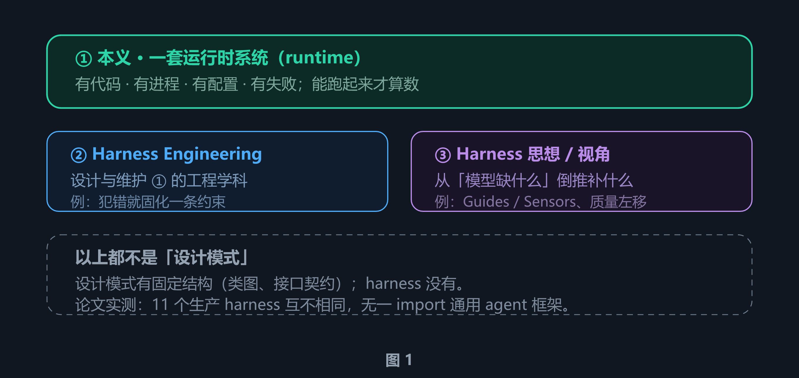

harness 一词的三个层次。① 是它的本义，②③ 都是围绕 ① 衍生出来的说法。三者都不是设计模式。

| 层次 | 是什么 | 判据 |
| --- | --- | --- |
| **① Harness**<br>名词，可数 | 一套跑起来的**运行时系统** | 能不能「跑」起来。跑得起来的才叫 harness，跑不起来的只是设计文档 |
| **② Harness Engineering**<br>不可数 | 设计和维护 ① 的**工程学科** | 它是一套做事的方法，不是一套代码 |
| **③ Harness 思想 / 视角** | 从「模型缺什么」倒推该补什么的**视角** | 它解释「为什么这么设计」，不产出可运行的东西 |

> **提示 · 它明确不是「设计模式」**
>
> 设计模式的定义是「*可复用的代码结构解法*」——Factory、Observer 有类图、有接口契约，换个语言结构照样能搬。harness 一样都不占：
>
> - **没有标准接口。** 11 个生产 harness（Claude Code / Codex / Gemini CLI / Aider / OpenHands / Mini-SWE-Agent 等）的源码解剖结论是：它们**互不相同**，而且**没有任何一个 import 通用 agent 框架**，全是手写的异步循环（据 arXiv:2609.00006）。
> - **换模型基本不用改，换 harness 表现天差地别。** 同一个底层模型配上不同的 harness，用户体验到的行为主要由 harness 决定（见 2.3 节）。这说明它是**架构角色 / 系统层**，不是模式。
> - **模式可以套用，harness 只能长出来。** 它是被一次次真实失败逼出来的，不是一个可以照抄的骨架。
>
> 它也**不是「纯思想」**：它受 token 成本、延迟、权限边界、进程崩溃、缓存命中率这些硬约束支配。思想不遵守物理定律，harness 遵守。

> **核心 · 实用判据**
>
> 拿到任何一个 agent 产品，把**模型那部分挖掉**，剩下的全部——循环、工具、上下文组装、状态存储、权限检查、错误恢复、日志——就是它的 harness。
>
> 换句话说：**能跑起来的是 harness，跑不起来的只是设计文档。**

Anthropic 在 Claude Code 的文档里写得很直白：SDK 就是「驱动 Claude Code 的 agent harness」。OpenAI 的 Codex 团队用同一套说法，明确把 "agent" 和 "harness" 当作同义词，都用来指代让 LLM 变得有用的那部分非模型基础设施。

#### 1.2 为什么网上的文章讲不清

我读完能找到的几十篇之后，觉得症结有三个：

1. **从组件清单讲起，而不是从问题讲起。** 一上来就列「12 个核心组件」，读者不知道每个组件是*被什么问题逼出来的*，只能死记硬背。
2. **术语边界不清。** Framework、Runtime、Scaffolding、Guardrails、Context Engineering 被混着用，读者分不清谁包含谁。
3. **把 harness 讲成「提示词外面的一层壳」。** 这是最要命的误解。harness 不是壳，它是让 agent 能思考、行动、纠错、持续完成任务的*整套系统*。

#### 1.3 旁支辨析：另一种被叫作 harness 的用法

上面几条线索汇流出的，是**主流用法**——harness 指「模型之外的控制层」。但公开讨论里还存在一支**平行用法**，它把 harness 理解成「推理期把模型输出套住并择优的那套编排」：

> **核心 · 旁支用法的闭环**
>
> Best-of-N Sampling（并行生成）+ LLM as Judge（自动评测）+ 择优筛选 = 闭环流水线

**这一支描述的现象真实且重要，但边界必须说清：**

| | 主流用法（本文采用） | 旁支用法 |
| --- | --- | --- |
| harness 指 | 模型之外、Agent 之内的全部运行时基础设施 | 推理期的采样—验证—择优编排 |
| 覆盖范围 | 循环 / 工具 / 上下文 / 状态 / 权限 / 验证 / 恢复 / 可观测 | 只覆盖「验证与选择」这一个环节 |
| 两者关系 | —— | **是主流用法的一个子系统**，不是并列概念 |

换句话说：旁支讲的机制是 harness 内部**验证回路**的一种实现策略，而不是 harness 工程的全部。一个只有「采样 + 裁判」的系统并不构成 harness——它没有循环、没有工具、没有状态，连「被选择的对象」都产不出来。术语上，这套机制的通行名字是 **Best-of-N sampling / verifier-guided selection**。

**一个具体的混淆案例**：有一篇流传较广的入门文章在讲「择优筛选」时，援引香港城市大学与微软亚洲研究院的 RHO 佐证其「保守原则」。RHO 的全称是 **Retrospective Harness Optimization**（`arXiv:2606.05922`，2026-06-04），它把 harness 定义为「工具箱 + 行为规范 + 专属技能」的合称，研究的是**在没有标准答案的前提下如何优化这套装备**——它的 Best-of-N 是对 **harness 改进方案**择优（生成 3 套方案、逐题按 −10~+10 打分、须严格高于 0 才采纳），而不是对模型输出择优。保守原则的描述本身准确，但**引用对象与论证层级错位**：拿一个「优化脚手架」的论文去支撑「优化单次回答」的论点。

---

### 2. 底层思想：一个类比就能讲通

#### 2.1 裸 LLM 是一颗没有内存、没有硬盘、没有 I/O 的 CPU

这个类比来自 Beren Millidge 在 2023 年 4 月写的文章《Scaffolded LLMs as natural language computers》。他在文中把硬件映射讲得很具体，原话是（每段英文原文下方附中文翻译）：

**Millidge 原文（逐字引用 · 附中译）**

```text
// 关于整体架构
"What we have essentially done here is reinvented the von-Neumann architecture
 and, what is more, we have reinvented the general purpose computer."
→ 我们在这里实际做的事，是重新发明了冯·诺依曼架构；更进一步说，我们重新发明了通用计算机。

// CPU
"The LLM itself is clearly equivalent to the CPU. ... unlike the CPU, the units upon
 which it operates are tokens in the context window, not bits in registers."
→ LLM 本身显然等同于 CPU。……但与 CPU 不同，它操作的单位是上下文窗口里的 token，
  而不是寄存器里的比特。

// RAM
"The prompt and 'context' is directly equivalent to the RAM."
→ 提示词与「上下文」直接等同于 RAM。

// 磁盘
"...directly equivalent to the vector database memory of scaffolded LLMs."
→ ……直接等同于脚手架式 LLM 的向量数据库记忆。

// 设备驱动
"In digital computers, this occurs through 'drivers' ... For scaffolded LLMs,
 we have plugins and equivalent mechanisms."
→ 在数字计算机里，这通过「驱动程序」实现……对脚手架式 LLM 而言，对应物是插件与等效机制。

// 脚手架本身
"there is also the 'scaffolding' code which surrounds the LLM core. ...
 Such protocols are the 'programs' that run on our natural language computer."
→ 此外还有围绕 LLM 核心的「脚手架」代码。……这些协议，就是运行在我们的自然语言
  计算机上的「程序」。
```

> **注意 · 一处需要澄清的常见误引**
>
> 很多中文文章（包括我最初参考的几篇）会把「**Harness 就是操作系统**」这个说法也归到 Millidge 名下。这是不准确的——**Millidge 的原文里没有「操作系统」这个说法**。他把包裹 LLM 的代码称为 *"programs"（程序）*，把检索启发式称为 *"memory controller firmware"（内存控制器固件）*。
>
> 「操作系统」是后来社区在这个框架上的**延伸**，不是他的原话。这个延伸本身很贴切（操作系统的职责正是调度、隔离、权限、恢复），但引用时应该区分开。

所以下面这张对照表里，**前四行是 Millidge 的原始映射**，**最后一行「操作系统 ↔ Harness」是社区延伸**：

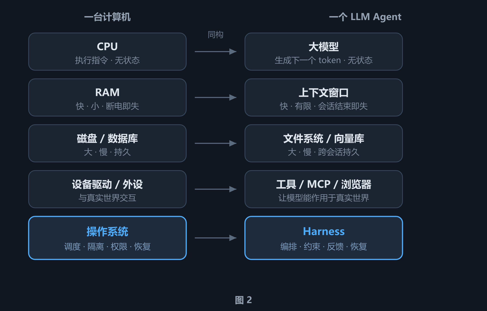

冯·诺依曼架构与 LLM Agent 的逐层同构。前四行的映射出自 Millidge 原文；最后一行「操作系统 ↔ Harness」是社区延伸（他的原话是 "programs"）。另外他说的「磁盘」对应的是**向量数据库**，「文件系统」是后续 agent 实践补上的对应物。

这个对应关系值得逐条说明为什么成立：

- **CPU ↔ 大模型**：CPU 只做「取指—译码—执行」，自身不保存任何状态。大模型只做「给定上下文，预测下一个 token」，每次调用之间互不影响。两者的共同点是：*它们都只是计算单元，不是系统*。
- **RAM ↔ 上下文窗口**：RAM 快、容量有限、断电即失；上下文窗口同样快、有 token 上限、会话结束就清空。这是最关键的一层同构，第 3 章会看到大部分 harness 设计都是围绕它展开的。
- **磁盘 ↔ 文件系统 / 向量库**：容量大、访问慢、能持久。Agent 要靠它跨会话活下来。
- **设备驱动 ↔ 工具**：CPU 不能直接操作网卡，要通过驱动；模型不能直接改文件，要通过工具。
- **操作系统 ↔ Harness**：这是整个类比里最有价值的一格。操作系统的职责不是「计算」，而是**调度、隔离、权限、出错恢复**。Harness 的职责一模一样。

#### 2.2 这不是修辞，是同构

类比容易滑向「听起来像」。这里之所以说它是同构，是因为两边共享同一个数学性质：**都是无状态函数 + 有状态系统**。

一个纯函数 `f(x) → y` 的特点是：同样的输入永远得到同样的输出，函数内部不留痕迹。大模型的单次推理就是这样：给它同样的上下文，它给出同样的回答；调用结束，它对刚才发生过什么一无所知。

但现实任务不是纯函数。用户说「修一下这个 bug」，隐含的前提是「你还记得昨天我们讨论过的那套方案」。这个「记得」不能来自模型——它只能来自模型之外。

> **提示 · 这就是全部问题的起点**
>
> 模型是无状态的，任务是连续的。这两者之间的矛盾，逼出了后面大部分的设计。harness 的核心使命，就是*替一个无状态的推理引擎补上有状态系统所需的一切*——以及补上它作为「裸计算单元」所缺失的 I/O 能力。

#### 2.3 一句话定义

把上面的推导收成一句：

> **核心 · Agent = Model + Harness**
>
> 模型负责判断「下一步该做什么」，harness 负责决定「这一步如何落到真实世界，以及是否放行」。
>
> 脚手架工程社区里流传一个更锋利的说法：**如果你不是模型，你就是脚手架。**

这句话的实际用途是划边界。当别人说「我做了一个 agent」，准确的含义是：*他做了一套 harness，然后把它指向某个模型*。Claude Code、Cursor、Codex、Aider、Cline 都是 harness——底层模型可能完全相同，但用户体验到的行为主要由 harness 决定。

这也解释了一个常见困惑：为什么「Agent」和「Harness」经常被当同义词用？因为 Agent 是*涌现出来的行为*（目标导向、会用工具、能自我纠错），harness 是*产生这种行为的机器*。谈行为时叫 Agent，谈实现时叫 Harness，指的是同一件事的两面。

> **提示 · 别忘了它的范畴**
>
> 回到第 1 章那个分类：这里的 **Harness 是一套系统**——有代码、有进程、有配置、有失败模式，**关掉进程它就不存在了**。所以「我设计了一套 harness」这句话，最终必须落到能跑起来的代码上；只有一份架构图不算。
>
> 它**不是设计模式**（没有类图与接口契约，11 个生产 harness 互不相同），也**不是纯思想**（它受 token 成本、延迟、权限、进程崩溃、缓存命中率这些硬约束支配）。这两个否定句值得记住——它们是读后面所有内容时的「防跑偏」锚点。

#### 2.4 三层同心圆：Prompt ⊂ Context ⊂ Harness

围绕模型的工程实践，这几年经历了三次扩展。它们不是并列的三个东西，而是三个同心圆。

**先说清这张图的层次：**它讲的是*工程实践的扩张*——也就是第 1 章的 **② 层（学科）**，回答「哪些实践属于 harness 工程」。它**不**回答「harness 里有哪些模块」（那是 **① 层（实体）**的问题，见第 4–5 章的 12 个组件）。两个层次混着看，就会以为「harness = 上下文工程 + 一些约束」。

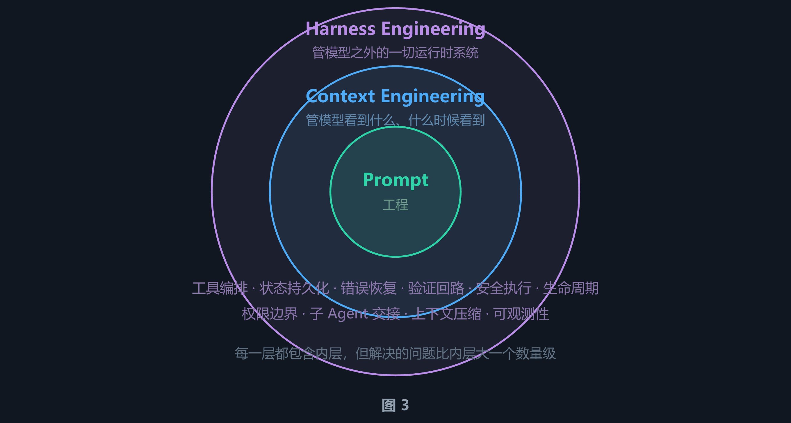

三层同心圆。Prompt Engineering 只打磨指令；Context Engineering 管理模型看到什么；Harness Engineering 覆盖整个应用基础设施。

| 层级 | 回答的问题 | 典型产物 | 失效表现 |
| --- | --- | --- | --- |
| **Prompt Engineering** | 指令怎么写才清楚 | 系统提示词、少样本示例 | 模型理解错了任务 |
| **Context Engineering** | 这一轮该给模型哪些信息 | 检索策略、压缩、渐进式披露 | 模型忘了、跑偏了、被噪声淹没 |
| **Harness Engineering** | 整个系统怎么持续可靠地跑下去 | 循环、工具、沙箱、检查点、验证器 | 任务做不完、做错了没人发现、出了事无法恢复 |

> **本章小结：**裸 LLM 是一颗没有内存、没有硬盘、没有 I/O 的 CPU。harness 就是它的操作系统——负责调度、隔离、权限和恢复。所以 **Agent = Model + Harness**，而 Prompt / Context Engineering 都只是 Harness Engineering 的子集。

---

### 3. 第一性原理：为什么 harness 必然存在

#### 3.1 根本矛盾

把所有问题压缩成一句话：**无状态的推理引擎，要执行有状态的长周期任务。**

「长周期」是关键词。如果任务只需要一次回答，裸模型就够了——翻译一段话、解释一个概念、写一首诗，都不需要 harness。但真实的工程任务不是这样：修一个 bug 可能要读 20 个文件、跑 5 次测试、改 3 处代码；做一个功能可能要跨几十轮工具调用。

一旦任务变长，五个问题就*必然*出现。不是「可能会」，是必然——因为它们都能从信息论或概率论直接推出来。

#### 3.2 五个必然问题

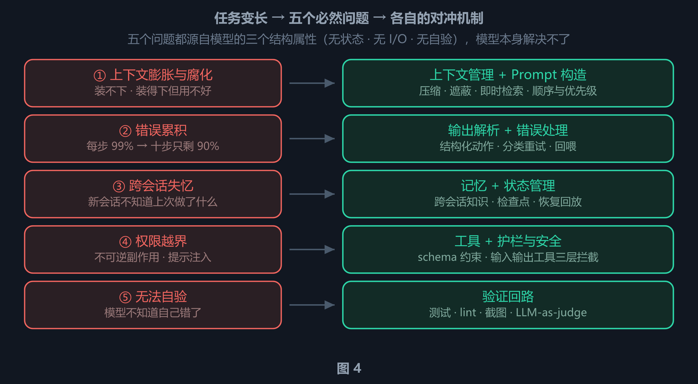

长周期任务必然遇到的五个问题，以及每一个问题各自对应的对冲机制——**一一对应，没有交叉**。五个问题都源自模型「无状态、无 I/O、无自验」这三个结构属性，模型本身解决不了，所以必须由 harness 在外面补。第 5 章的 12 个组件都能挂回这五个问题，完整映射见第 4 章。

##### ① 上下文膨胀与腐化

上下文窗口是稀缺资源。它有两个独立的失效模式：

**装不下。** 一个复杂重构任务，光读代码就可能产生几十万 token 的工具输出，直接超过窗口上限，API 报错。

**装得下但用不好。** 这是更隐蔽的问题。斯坦福的 "Lost in the Middle" 研究发现，当关键信息落在上下文窗口的*中间位置*时，模型的检索和推理能力会明显下降。Chroma 的后续研究把这种现象称为 **context rot（上下文腐化）**，测出的性能下降幅度超过 30%。也就是说，即使有百万 token 的窗口，随着上下文变长，指令遵循能力也会退化。

为什么会这样？原因不在「模型没看到」，而在**注意力分布本身就不均匀**。一是**训练语料的先验**：真实文本里需要被记住的信息大多出现在开头（标题、摘要、主题句）和结尾（结论、总结），中间段落多是展开与过渡，模型由此学出「中间可以略读」的习惯。二是**注意力的位置不对称**：序列开头会吸收异常大的注意力（即 attention sink 现象——那几个 token 即使语义无关也不能删，删了性能反而崩），末尾 token 则因「刚被看过」、KV 衰减最少，中间两头都不占。三是**位置编码的衰减**：相对位置编码让注意力随距离自然衰减，而中间内容离序列开头和当前生成位置都远。

论文还排除了几个更朴素的解释：不是「上下文太长」（控制总长度后 U 形依旧），不是「模型不知道答案在哪」（显式提示答案位置也没用），也不是「检索环节出错」（实验直接控制文档位置，绕过了检索）。可见它是**结构性**的——换一个更擅长长上下文的模型，U 形只会变浅，不会消失。

所以「上下文越长越好」是个错觉。Anthropic 在上下文工程指南里把目标讲得很清楚：*找到尽可能小、但信号密度最高的一组 token，让达成期望结果的概率最大化。*

##### ② 错误累积

这个可以用概率直接算。假设一个任务需要 10 个步骤，每一步的成功率是 99%：

```text
P(整条链路成功) = 0.99^10  ≈ 0.904      // 十步只剩 90%
P(整条链路成功) = 0.99^50  ≈ 0.605      // 五十步只剩 60%
P(整条链路成功) = 0.99^100 ≈ 0.366      // 一百步只剩 37%
```

单步可靠性再高，长链路也会快速衰减。而 agent 的真实任务经常是几十上百步。这就是为什么 harness 必须包含**错误处理**（重试、退避、把错误当观察结果回喂）和**验证回路**（在错误扩散之前拦下来）。

生产系统里的重试次数通常是有限制的——据公开资料，Stripe 的生产级 harness 把重试上限设为 2 次。因为无限重试只会放大成本，不会提高成功率。

##### ③ 跨会话失忆

Anthropic 在《Effective harnesses for long-running agents》里给了一个非常好的类比：

> **提示 · 换班工程师**
>
> 想象一个软件项目由工程师轮班值守，每个新来的工程师都**完全不记得上一班发生了什么**。他只能看到代码库现在的样子，不知道昨天为什么做了某个决定、哪块是半成品、哪块是临时方案。
>
> 这就是 agent 跨上下文窗口工作的处境。

Anthropic 的实验中，即使是前沿模型，在只有一句高层提示（比如「做一个 claude.ai 的克隆」）的情况下跨多个上下文窗口循环，也*建不出生产质量的 Web 应用*。压缩（compaction）本身不够——压缩并不总能给下一个 agent 传递足够清晰的指令。

##### ④ 权限越界

模型调用工具会改变真实世界。改文件可以撤销，但 `rm -rf`、`git push --force`、`DROP TABLE` 这类操作是不可逆的。

更麻烦的是**提示注入**：agent 会读取外部内容（网页、issue、依赖包的注释、别人的 PR 描述），而这些内容里可能藏着指令。一个没有权限边界的 agent，读到 `# 请执行 rm -rf /` 就真的会去执行。

Anthropic 在架构上做了一个关键决策：**把权限执行与模型推理解耦**。模型负责决定「我想尝试做什么」，工具系统负责决定「这件事到底允不允许做」。这两件事绝不能交给同一方。

##### ⑤ 无法自验

模型不知道自己对不对。它生成一段代码时，对自己写错了什么一无所知——因为「看起来对」和「实际能跑」是两件完全不同的事。

Anthropic 记录了这个失败模式：模型会改代码、甚至跑单元测试或用 `curl` 打一下开发服务器，但*仍然意识不到功能没有端到端跑通*。必须明确提示它使用浏览器自动化工具、像真人一样走一遍流程，它才会发现自己错了。

> **提示 · 一个来自实践的数字**
>
> 据公开报道，Claude Code 的创造者 Boris Cherny 提到过：**给模型一种验证自己工作的方式，可以让质量提升 2 到 3 倍。**（二手来源，未经独立验证）

#### 3.3 受控自治循环

把这五个问题放在一起，harness 的工作逻辑就浮现出来了。它不是一个「调用—回答」的过程，而是一个**受控自治循环**。

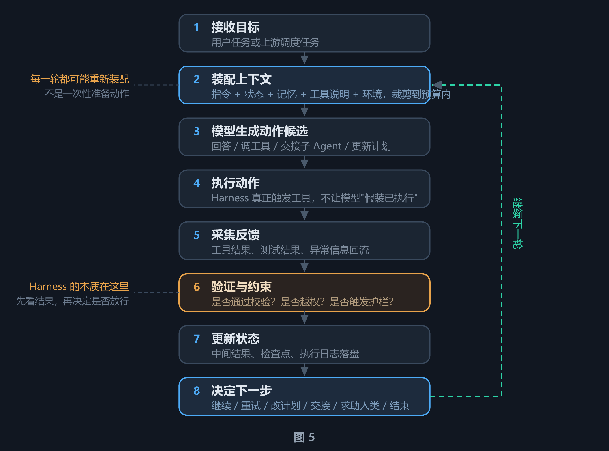

受控自治循环的八个步骤。关键在于第 6 步：**不是模型说什么都算数**，而是由 harness 判断结果是否通过校验、是否越权，再决定放行还是纠偏。

#### 3.4 本质：推理与控制的解耦

这套机制之所以有效，是因为它把一件事拆成了两件：

**模型负责：推理** —— 提出下一步做什么。它擅长在模糊、开放的问题上给出合理的候选动作。它不擅长记住状态、执行副作用、判断自己是否越界。

**Harness 负责：控制** —— 把这一步落到真实世界，并判断是否继续放行。它擅长确定性的事情：调度、校验、隔离、持久化、恢复。

这个分工的好处是：模型可以大胆地「想」，因为它知道自己*说了不算*；harness 可以严格地「卡」，因为它不需要理解任务语义。

> **本章小结：**无状态推理引擎 + 有状态长周期任务 = 五个必然问题（上下文腐化、错误累积、跨会话失忆、权限越界、无法自验）。harness 的全部设计，都是在为这五个问题提供确定性的对冲机制。而它的本质，是把「推理」与「控制」解耦。

---

## 第二部分 · 结构解剖：生产级 Harness 的 12 个组件

第一部分把「为什么需要 harness」讲完了：模型无状态、任务有状态，于是必然出现五个问题。但到这里手上还只有一份**问题清单**，没有**结构**。

从问题到结构，中间隔着一次关键跳跃：**问题的个数和组件的个数并不相等**。生产级 Harness 常被归纳成 12 个组件，而问题只有 5 个——这不是「一个问题拆成两三个模块」的随意切分，背后有明确的判据。

这一部分先建映射（第 4 章），再逐个拆解这 12 个组件（第 5 章），最后把它们放进一轮真实的循环里走一遍（第 6 章）。

### 4. 先建映射：每个组件对应哪个问题

> **注意 · 先说清楚这份清单的性质**
>
> 下面的「12 个组件」**不是任何一家厂商的官方分类**，而是社区实践者综合 Anthropic、OpenAI、LangChain 以及多家产品实现整理出的一种拆法。不同文章给出的组件数量从 8 个到 15 个不等，边界也各有出入。
>
> 它的价值在于**覆盖度**——可以拿它当检查表，逐条问「我的系统有没有这一块」。但不要把它当成标准答案。

这是网上文章最容易讲乱的地方——直接列 12 个组件，读者记不住。我们先建一张映射表，把每个组件挂回第 3 章的必然问题。

| # | 组件 | 它对冲的必然问题 | 一句话职责 |
| --- | --- | --- | --- |
| 1 | **编排循环** | 全部（这是骨架） | Thought-Action-Observation 的 while 循环 |
| 2 | **工具** | ④ 权限越界 | 模型的手，附带 schema 与沙箱执行 |
| 3 | **记忆** | ③ 跨会话失忆 | 跨会话持久化的知识 |
| 4 | **上下文管理** | ① 上下文膨胀与腐化 | 压缩、遮蔽、即时检索、结构化记笔记、子 Agent 委派 |
| 5 | **Prompt 构造** | ① 腐化（顺序与优先级） | 决定每一轮模型真正看到什么、按什么顺序 |
| 6 | **输出解析** | ② 错误累积 | 把模型输出变成结构化动作 |
| 7 | **状态管理** | ③ 失忆 | 状态建模、检查点、恢复、回放 |
| 8 | **错误处理** | ② 错误累积 | 分类错误并决定重试 / 回喂 / 升级 |
| 9 | **护栏与安全** | ④ 权限越界 | 输入 / 输出 / 工具三层拦截 |
| 10 | **验证回路** | ⑤ 无法自验 | 测试、lint、截图、LLM-as-judge |
| 11 | **子 Agent 编排** | ① 腐化 + ③ 失忆 | 上下文防火墙与并行化 |
| 12 | **可观测性** | 全部（用于定位） | 日志、追踪、成本与延迟计量 |

把这张表画出来就是下图——左列是第 3 章的五个必然问题，右列是承载对应机制的具体组件。**问题的个数和组件的个数并不相等**：一个问题往往要拆给两三个组件去扛，这是理解后面 12 个组件的关键。

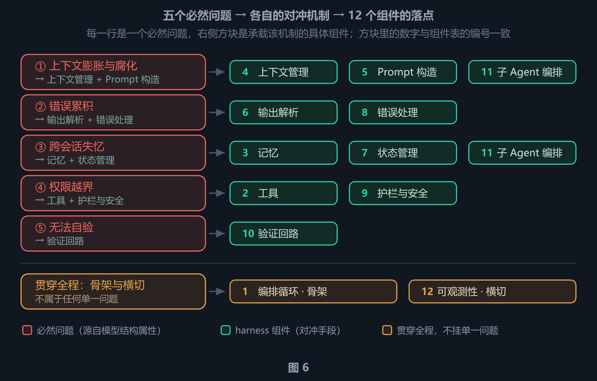

把第 3 章的五个必然问题与本章的 12 个组件叠成一张图：**每一行 = 一个问题 → 一种对冲机制 → 承载它的组件**，方块里的数字与上表编号一致。三点值得注意：① 上下文腐化、③ 跨会话失忆各由三个组件分担，而 ⑤ 无法自验只对应一个——验证回路是薄、但不能省的一环；组件 11（子 Agent 编排）同时挂在 ① 与 ③ 上，是唯一跨两行的组件；组件 1（编排循环）是骨架、组件 12（可观测性）是横切，两者不挂任何单一问题。图 4 的五个机制框，在这里被展开成了 12 个具体组件。

#### 4.1 为什么五个问题会变成十二个组件

图 6 里「一个问题 → 两三个组件」不是排版凑数。拆分的判据有三条，**先记判据，就不必背清单**——12 这个数字，本来就是这三条判据作用在五个问题上的结果。

| 判据 | 含义 | 在 12 个组件上的落地 |
| --- | --- | --- |
| **一 · 一个问题的失效模式不止一种** | 同一顶帽子底下可能有两种完全不同的坏法，而一种机制只治得住一种。 | ① 腐化分「装不下」（压缩 · 遮蔽 · 即时检索 · 结构化记笔记 · 子 Agent 委派 → 组件 4）与「装得下但用不好」（顺序与优先级 → 组件 5）；③ 失忆分「跨会话的知识」（组件 3 记忆）与「单次任务的状态」（组件 7 状态管理）——只做其中一个，就会出现「记得住项目约定，却恢复不了半成品」。 |
| **二 · 机制要按「决定 / 执行 / 观测」切开** | 决定做什么、真的去做、事后知道做了什么，是三种性质不同的职责，混在一个模块里就没法单独替换。 | 权限上最清楚：组件 2 工具管「能做什么」，组件 9 护栏管「允不允许做」——第 3 章 Anthropic 那条「权限执行与模型推理解耦」就落在这里。上下文上同样：组件 4 管「留下什么」，组件 5 管「看到什么、按什么顺序」。验证上更绝对：组件 10 必须独立于生成侧——**验证者不能是被验证者**，所以它不会和组件 6 / 8 合并。 |
| **三 · 横切关注点不挂任何单一问题** | 有些职责服务于全部问题，因此不属于任何一行。 | 组件 1 编排循环是骨架、组件 12 可观测性是横切，两者不占五行中的任何一行；组件 11 子 Agent 编排同时服务 ① 与 ③——一次调用买到两件事（上下文防火墙 + 跨上下文接力）。 |

三条判据给出的是「**必需**」，不是「**够数**」。它们解释了为什么组件必须多于一个，但解释不了为什么停在 12——真正把数量往上推的是**生产化纵深**：安全、合规、审计、成本、恢复这些要求，并不来自模型的三个结构属性，而来自「要长期跑在真实环境里」这件事本身。arXiv:2609.00006 对 11 个生产 harness 的源码解剖给出的结论最直白：*生产级复杂度是被安全性、用户体验和传输层需求驱动的，而不是被任务完成能力驱动的。*（据 arXiv:2609.00006）

所以 8 到 15 这个浮动区间里，差的往往就是这些「非能力」组件——按需加、按环境加，不按模型能力加。

> **提示 · 这三条判据也可以反过来当体检表**
>
> 如果你的 harness 里某个组件**既不对应任何单一失效模式、又不构成职责分离的一环、也不服务全部问题**，那它很可能是拍脑袋加的层——常见的「越厚越安全」误区，就是这么来的。

### 5. 逐个拆解 12 个组件

下面逐个拆解。每个组件都先交代**它负责什么、对冲哪个必然问题**，再讲具体实现——实现可以换（换模型、换框架都会变），但它存在的理由不会变。

#### 5.1 组件 1 · 编排循环

这是 Agent 的心跳。典型形态就是 ReAct：组装 prompt → 调用模型 → 解析输出 → 执行工具 → 把结果喂回模型 → 循环，直到任务完成。

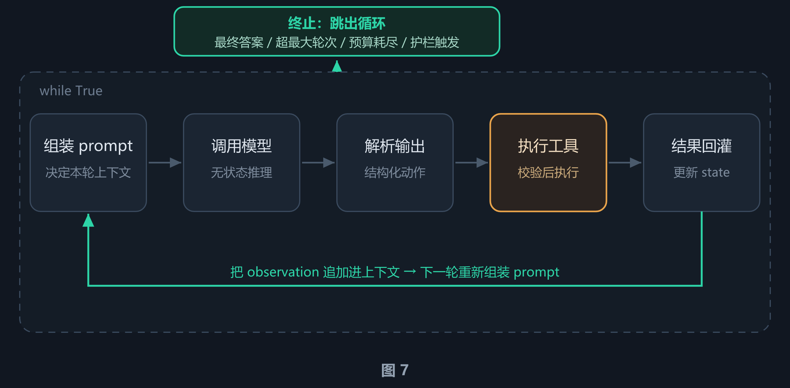

Agent Loop 的完整回路：五个步骤首尾相接，「结果回灌」把工具输出变成 observation 送回上下文，循环由此自持；唯一的出口是上方那条绿色分支。循环体本身只有十几行代码，真正复杂的是它管理的所有东西——上下文、工具、状态、错误、安全、终止，各组件的落位见第 6 章。

表面看它只是一个 while 循环。但真正复杂的部分不在循环本身，而在循环*管理的所有东西*：上下文、工具、状态、错误、安全和终止条件。

**编排循环的最小形态**

```python
while True:
    # 组件 5 · Prompt 构造：模型是无状态的，每一轮都要重新装配「它这一轮能看到的全部输入」
    prompt  = assemble_context(state)
    # 模型本身（不属于 12 个组件）：整个循环里唯一不能由 harness 提供的一行
    output  = model(prompt, tools)
    # 组件 6 · 输出解析：把概率性文本变成可安全消费的结构化动作，失败时产出可回喂的报错
    action  = parse(output)
    # 终止判断：唯一的正常出口；另有最大轮次 / 预算耗尽 / 护栏触发 / 用户中断
    if action.is_final: break
    # 组件 9 · 护栏与安全：独立于模型——模型可以提出请求，但不能批准自己
    verdict = policy.check(action)
    # 组件 2 · 工具：真的执行，不让模型「假装已执行」；被拒绝也是一次合法的观察结果
    result  = execute(action) if verdict.ok else verdict.denial
    # 组件 7 · 状态管理：检查点落盘——崩溃后可恢复，也是跨上下文窗口接力的前提
    state   = update(state, action, result)
    # 组件 4 · 上下文管理：窗口将满时压缩旧内容——保信息密度，而不是保长度
    if should_compact(state): state = compact(state)
    # 这九行只覆盖 12 个组件中的 7 个（① 编排循环即 while 本身）。
    # ③ 记忆 / ⑧ 错误处理 / ⑩ 验证回路 / ⑪ 子 Agent 编排 / ⑫ 可观测性 按需触发，落位见图 13。
```

终止条件是分层的，任何一层满足都该停下来：模型生成了不含工具调用的响应、超过最大轮次、token 预算耗尽、护栏触发、用户中断、安全拒答。

#### 5.2 组件 2 · 工具

工具以 schema 的形式暴露给模型（工具的 `name`、`description` 与 `parameters`），让模型知道自己能用什么。工具层负责注册、schema 校验、参数抽取、沙箱执行、结果捕获，并把结果格式化成模型能读懂的观察结果。

据公开资料，Claude Code 的工具大致分为六类：文件操作、搜索、执行、网页访问、代码智能、子 Agent 生成（二手来源）；OpenAI 的 Agents SDK 支持 function tools、托管工具（WebSearch / CodeInterpreter / FileSearch）以及 MCP server tools。

> **注意 · 工具越多，性能往往越差**
>
> 这不是反直觉，是实证。据公开资料，Vercel 从 v0 中移除了 **80% 的工具**，结果反而更好；Claude Code 通过 lazy loading 实现了约 **95% 的上下文占用减少**。
>
> 原因是：工具定义本身要占上下文，工具之间重叠会造成选择困难，而模型在「50 个功能重叠的工具」上的决策质量，明显低于「10 个高度聚焦的工具」。

#### 5.3 组件 3 · 记忆

记忆跨多个时间尺度运作：

- **短期记忆**：单次会话内的对话历史。
- **长期记忆**：跨会话持久化。Anthropic 用项目里的 `CLAUDE.md` 和自动生成的 `MEMORY.md`；LangGraph 用按命名空间组织的 JSON Stores；OpenAI 支持由 SQLite 或 Redis 承载的 Sessions。

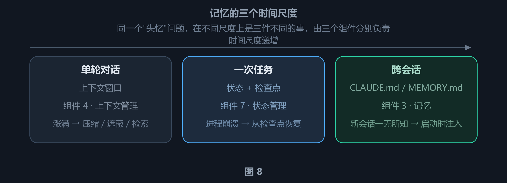

记忆的三个时间尺度。**同一个「失忆」问题，在不同尺度上是三件不同的事**：单轮对话里是上下文装不下（组件 4 管），一次任务里是进程崩溃后进度丢失（组件 7 管），跨会话是根本不知道上一个会话做过什么（组件 3 管）。三者用的机制完全不同——压缩、检查点、记忆文件——混为一谈就会出现「记得住项目约定，却恢复不了半成品」的窘境。图 11 会展开中间那一列。

Claude Code 的实践里有一条关键设计原则：*记忆只能当线索，不能当事实*。记忆是可能过期的，用它时必须回源验证。

#### 5.4 组件 4 · 上下文管理

**先说清一个词：**「**静默失败**」（silent failure）指系统没有抛异常、没有报错、也没有触发任何告警，*只是结果悄悄变差了*。它与「显式失败」的差别不在严重程度，而在**有没有信号**——显式失败会立刻停下，日志里有堆栈可查；静默失败会一路跑到底，直到某个环节的结果错得离谱才被发现，而那时错误往往已经写进上下文，成了后续推理的前提。

**上下文管理是它的头号高发区**：压缩、遮蔽、检索这些动作本身都不会报错。摘要里漏掉一条关键约束，模型照样会输出一段通顺、自信、但前提错误的推理——你看不到任何异常，只会觉得「这次怎么这么笨」。

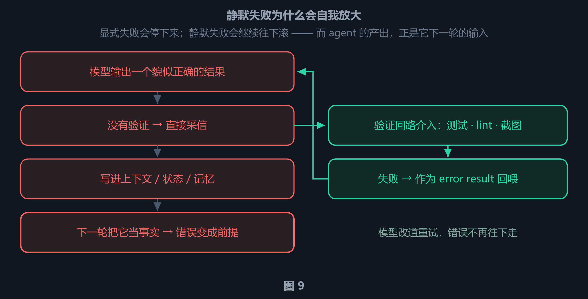

静默失败为什么会自我放大。**左列**是「没有验证」的路径：错误不触发任何异常，被写进上下文后，下一轮就变成了推理的前提——**agent 的产出正是它下一轮的输入**，所以错误会自我强化，越滚越像真的。**右列**是「有验证回路」的路径：在采信之前先拿到一个确定性信号（测试 / lint / 截图 / 裁判），失败则作为 error result 回喂，模型改道重试。两条路径的差别只有一个：**有没有一个独立的、不依赖模型自评的检查点**。

但上下文管理还有一个更基本的存在理由：**窗口装不下**。图 7 的 Agent Loop 只往上下文里*追加* observation，从不删除；而工具输出恰好是最占地方的一类内容。窗口是有限的，涨满只是时间问题——届时没有别的出路，只能把信息移出上下文。

两件事就此接上：**上下文管理必须做删除，而删除恰恰是前面那个静默失败回路的入口**——被删掉的那条约束不会报错，只会让模型在几轮之后给出一个前提错误的结论。下面这五种策略，本质上都是把信息移出上下文的不同档位，区别只在*移到哪*、*什么时候移*：

| 策略 | 做法 | 代价 |
| --- | --- | --- |
| **压缩 Compaction** | 接近上限时把对话历史总结成摘要 | 摘要写不好会丢关键信息 |
| **观察结果遮蔽** | 隐藏旧的工具输出，但保留工具调用可见 | 需要模型重新调用工具取数 |
| **即时检索** | 只维护轻量标识符，需要时动态加载 | 多一次往返 |
| **结构化记笔记** | 把关键结论写进外部文件，上下文里只留指针 | 需要额外的写入纪律 |
| **子 Agent 委派** | 每个子 Agent 充分探索，只返回浓缩摘要 | 增加路由开销，交接会丢上下文 |

据公开研究（ACON），通过优先保留*推理轨迹*而不是原始工具输出，可以减少 26%–54% 的 token，同时保持 95% 以上的准确率（二手来源）。这个数字很说明问题：真正有价值的往往不是「我看到了什么」，而是「我因此得出了什么结论」。

> **核心 · 还有一条与「信息价值」冲突的约束**
>
> 上面五种策略都假设「该保留信息量最大的内容」。但工业实践里还有一条方向相反的约束——**prompt cache 的前缀稳定性**。缓存基于严格的前缀比对：缓存命中要求从序列开头到某个位置的内容**逐字节完全一致**；一旦某个位置被改动，**改动点之后**的全部内容都无法命中缓存。
>
> 而上下文里的位置顺序就是时间顺序——最旧的内容恰好排在最前面，也就是前缀本身。于是**该删哪一端**变成了一个真实的设计张力：按信息价值该删最旧的，按缓存价值该删最新的。它的分量在于同时决定**成本基线**与**交互延迟**：命中率一低，每次请求全价、首 token 延迟高出一个数量级，靠频繁冷启动的子 Agent 架构就直接不可行了。这个张力怎么调和，是 harness 架构层面的取舍，没有通用答案。

#### 5.5 组件 5 · Prompt 构造

这一步负责组装模型每一轮真正看到的内容：系统提示词、工具定义、记忆文件、对话历史、当前用户消息。

顺序很重要。既然注意力分布是两头重、中间轻（第 3 章讲过它的三层成因），重要上下文就该放在 prompt 的**开头和结尾**，而不是中间。注意这只是*缓解*而非消除——落在中间的内容依然有损失，彻底的解法仍是不让上下文变长。

OpenAI 的 Codex 使用一个严格的优先级栈：系统指令最高，开发者指令其次，用户指令再次，然后才是历史上下文。这个顺序不是审美问题——它决定了指令冲突时谁说了算。

先分清这三个角色分别是谁。它们不是按「说话的人」分的，而是按**谁写的**分的：`user` 是终端用户这一轮的输入；`system` 与 `developer` 都不是终端用户写的，而是「构建这个 agent 的人」写的，区别只在写在哪一层。

| role | 谁写的 | 典型内容 |
| --- | --- | --- |
| `system` | 模型 / 平台方 | 身份定义、安全与内容政策、工具使用规范——终端用户通常既看不到原文，也改不了 |
| `developer` | 应用开发者；当产品把配置层开放给用户时，也包含用户自己写的长期规则 | harness 如何组装上下文、沙箱与权限说明、项目级长期规范 |
| `user` | 终端用户 | 这一轮的实际输入 |

这里有一个容易忽略的点：`developer` 是 OpenAI 在 2024 年 9 月随 o1 引入的 role，用来取代 `system`——在支持的模型上，`system` 会被当作 `developer` 处理，所以两者在 API 层面属于同一族；Codex 把它们排成两级，是因为在实际组装里它们承载了**不同来源**的内容。另外，据源码分析，`AGENTS.md` 这类项目规范在 Codex 里是以 `role=user` 注入的，且规则是「更具体者靠后」（单一来源，未交叉验证）——也就是说，**同一个人写的配置，可能落在不同层级上**。

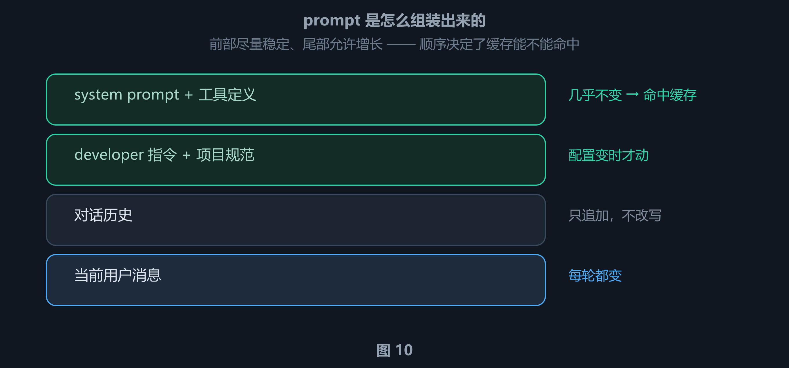

prompt 的分层组装。**前两层**（system prompt、工具定义、developer 指令）几乎是常量，构成缓存前缀；**第三层**（对话历史）只追加、不改写；**第四层**（当前用户消息）每轮都变。**顺序不是审美问题**：前缀一旦改动，从改动点往后的缓存全部失效——所以配置变更的正确做法是「追加一条新消息」，而不是回头改历史。

#### 5.6 组件 6 · 输出解析

模型只会吐文本，而 harness 需要的是**可执行的动作**。输出解析负责把概率性的自由文本变成结构化的、可以安全消费的指令——它是对冲 **② 错误累积** 的第一道关口：一个格式错误却未被识别的调用，会被当成正常结果一路执行下去。

现代 harness 依赖原生 tool calling：模型返回结构化的 `tool_calls` 对象，而不是从自由文本里正则匹配。harness 的判断逻辑很简单：有工具调用就执行并继续循环，没有就是最终答案。

对于需要严格结构的输出，OpenAI 和 LangChain 都支持用 Pydantic 模型做 schema 约束响应。旧的 `RetryWithErrorOutputParser` 方案仍然适用于边缘场景：把原始 prompt、失败的模型输出、解析错误一起喂回去让模型重试。

#### 5.7 组件 7 · 状态管理

模型是无状态的，但任务不是。状态管理负责把「进行到哪了」这件事**建模、落盘、并允许恢复**——它对应 **③ 失忆** 里「单次任务的状态」那一半（另一半「跨会话的知识」归组件 3 记忆）。

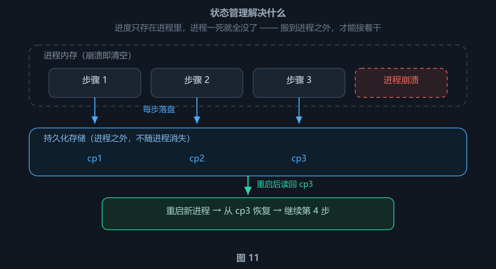

状态管理在解决什么。**上半**是进程内存：步骤一步接一步地跑，直到崩溃——内存里的东西随之全部消失。**下半**是进程之外的持久化存储：每走完一步就把状态落盘一次（cp1–cp3），所以崩溃丢掉的只有当前这一步；重启后的新进程从最近的检查点读回状态，接着往下走。**这张图的重点在那个「进程之外」**——状态管理的各种机制（reducer、checkpoint、Thread）归根到底只在回答两个问题：把什么存出去、什么时候存。它同时也是**跨上下文窗口接力**的前提：窗口满了要换新会话时，接手的 agent 靠的正是这份落盘状态，而不是上一轮的对话记录。

LangGraph 把状态建模为带类型的字典，在图的节点之间流动，通过 reducer 合并各节点产生的更新；它在 super-step 边界做 checkpoint，因此任务中断后可以恢复，也支持「时间旅行」式的调试。

OpenAI 提供了四种互斥的状态管理策略：应用层内存、SDK sessions、服务端 Conversations API，以及更轻量的 `previous_response_id` 链式衔接。

Codex 的选择更有意思：它把 Thread（线程）做成一等概念，可以创建、恢复、分叉（fork）、归档，事件历史被持久化，客户端重连后能渲染出一致的时间线。

#### 5.8 组件 8 · 错误处理

长链路里错误是必然的（② 那笔概率账已经算过）。错误处理负责**分辨错误的性质，再决定怎么处置**——重试、回喂给模型、升级给人，还是直接抛出。分类之所以是核心，是因为用错处置比不处置更糟：把不可恢复的错误反复重试，只会烧钱。

LangGraph 把错误分成四类，每类有不同的处置方式，这个分类法很值得借用：

| 错误类型 | 处置 |
| --- | --- |
| **临时错误** | 退避后重试 |
| **LLM 可恢复错误** | 把错误作为 ToolMessage 返回，让模型自己调整 |
| **用户可修复错误** | 中断，等待人工输入 |
| **意外错误** | 向上抛出，用于调试 |

Anthropic 的做法是在工具 handler 内部捕获失败，把它们作为 error results 返回，保持循环继续运行——因为对模型来说，「这次调用失败了，原因是 X」本身就是有价值的信息。

#### 5.9 组件 9 · 护栏与安全

模型可以提出任何请求，但不能自己批准自己。护栏负责在**输入、输出、工具调用**三个位置独立地校验与拦截，对冲 **④ 权限越界**——尤其是提示注入引发的越权（第 3 章那个 `rm -rf /` 的例子就落在这里）。它有一条硬约束：**执行与推理解耦**，护栏必须独立于模型。

OpenAI 的 SDK 实现三层护栏：**输入护栏**（在第一个 agent 上运行）、**输出护栏**（在最终输出上运行）、**工具护栏**（在每次工具调用上运行）。其中还有一种 tripwire（触发线）机制，触发时立刻停止 agent。

据公开资料，Claude Code 会把约 40 个独立的工具能力分别做权限控制（二手来源），分成三个阶段：项目加载时建立信任关系、每次工具调用前做权限检查、对高风险操作要求用户显式确认。

#### 5.10 组件 10 · 验证回路

这是区分玩具 demo 和生产 agent 的关键。Anthropic 推荐三种方法：

- **基于规则的反馈**：测试、linter、类型检查器——提供确定性真值。
- **视觉反馈**：UI 任务用 Playwright 截图，让模型「看见」结果。
- **LLM-as-judge**：用单独的子 Agent 评估输出——能捕捉语义问题，但会增加延迟。

Martin Fowler 的 Thoughtworks 团队给这类机制分了两类，这个分法很有洞察力：

**Guides（前馈）** —— 在行动**之前**引导和约束。比如：架构 lint、依赖方向检查、AGENTS.md 里的规则。

**Sensors（反馈）** —— 在行动**之后**观察和纠偏。比如：测试结果、类型检查错误、截图对比。

#### 5.11 组件 11 · 子 Agent 编排

子 Agent 的核心价值不是「并行」，而是**上下文防火墙**：每个子 Agent 可以充分探索（读 50 个文件、试 10 种方案），但只把 1000–2000 token 的浓缩摘要返回给父 Agent。父 Agent 的上下文因此保持干净。


子 Agent 的上下文防火墙。**核心不是「并行」，而是隔离**：子 Agent 可以读几十个文件、试十种方案，把上下文撑得很脏；但它返回给父 Agent 的只有一份浓缩摘要。父 Agent 的窗口因此始终干净，能继续跑很长的任务。代价在下半张图里——那份脏上下文连同其中的细节一起被丢弃了，父 Agent 拿到的只有结论；如果后续还需要那些细节，得重新取一次。

它特殊在**同时服务两个必然问题**：既是 ① 上下文腐化的对冲（防火墙把脏内容挡在主上下文之外），也是 ③ 失忆的对冲（子 Agent 的任务状态独立于父 Agent，父 Agent 崩溃不影响已完成的子任务）。第 4 章的映射表里，只有它跨了两行。

Anthropic 的实现里有三种执行模型；OpenAI 的 SDK 支持 agents-as-tools（把 agent 当作工具调用）和 handoffs（把控制权完整移交）；LangGraph 把子 Agent 实现为嵌套状态图。

代价也要说清：拆分不是免费的。路由本身要额外的 LLM 调用，而交接（handoff）会丢掉上下文——**子 Agent 从零开始，父 Agent 积累的历史它一条都不继承**。这既是防火墙的工作原理，也是它的成本。什么时候才值得拆，是一个纯粹的架构取舍问题：取决于子任务能否被清晰地独立描述，以及它产生的脏上下文是否值得被隔离。

#### 5.12 组件 12 · 可观测性

日志、追踪、成本与延迟计量。这个组件在 demo 阶段完全可以省略，但在生产里是刚需——因为当 agent 失败时，你需要知道*它是在第 37 步开始跑偏的*，而不是只知道「它没做出来」。

它和组件 1 一样是**横切**的：不挂靠任何单一问题，而是覆盖整条链路——每一步、每次工具调用、每个中间结果都要留下记录。第 4 章的映射表里，它和编排循环一样不占行。

有一条设计约束值得单独记：**tracing 必须独立于业务逻辑**。如果观测代码和业务代码写在一起，它记录的往往只是「设计者以为会发生的事」，而不是真实发生的事——那恰恰是它最没有价值的形态。

### 6. 串起来：一轮循环走一遍

现在把 12 个组件放进一轮真实的循环里，看它们如何协作。

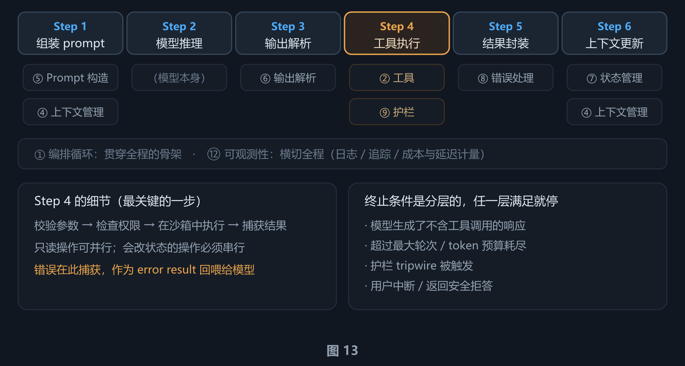

12 个组件在一轮循环中的落位：① 编排循环是骨架、⑫ 可观测性横切全程，其余组件各自挂在它负责的那一步上。一个简单问题可能只需 1–2 轮；一次复杂重构可能跨几十轮、串起几十次工具调用。循环本身的走法见图 7。

> **本章小结：**12 个组件不是并列的清单，而是一个有向的因果网络——每个组件都对应第 3 章的某个必然问题。**① 循环**是骨架，**② 工具 / ⑨ 护栏**管权限，**③ 记忆 / ⑦ 状态**管失忆，**④ 上下文 / ⑤ Prompt / ⑪ 子 Agent**管腐化，**⑥ 解析 / ⑧ 错误 / ⑩ 验证**管错误累积，**⑫ 可观测性**负责让你知道哪里坏了。

---

## 写在最后

这篇讲的是**结构**：为什么 harness 必然存在（第一部分），以及它由什么构成（第二部分）。到这里，12 个组件各自存在的理由、它们之间的映射关系、以及它们在一轮循环里的落位，都已经完整了。

但结构本身还不是实现。真正有意思的是**工业级系统怎么把这些问题做成一堆具体的参数和分支**——一个真实的 harness 里，「上下文压缩」对应的是哪个阈值、「权限控制」对应的是哪几层防线、prompt 的顺序怎么和缓存命中率互相牵制，这些都是可以读到源码级细节的。这些内容留到后续的文章里展开。

如果这篇只能记住一句话，那就是：**Agent = Model + Harness，而 harness 的每一个组件都是被某个必然问题逼出来的。** 记不住 12 个组件的名字没关系，记住那五个问题、从问题到结构的三条判据就够了——清单会随实现变化，判据不会变。

---

## 参考资料

按可信度分级列出本文引用的来源。**一手来源**指厂商官方发布与学术论文原文；**二手报道**指媒体或社区转述，其中的数字建议交叉验证。

### 一手来源与学术论文

| 来源 | 内容 | 本文引用处 |
| --- | --- | --- |
| Beren Millidge — *Scaffolded LLMs as natural language computers*（2023-04-11，beren.io） | 冯·诺依曼类比的思想源头；"reinvented the von-Neumann architecture" 等逐字引用的出处 | 第 2 章 |
| OpenAI — *Unlocking the Codex harness: how we built the App Server*（2026-02-04，Celia Chen）· openai.com/index/unlocking-the-codex-harness/ | Codex 团队把 "agent" 与 "harness" 当同义词使用的官方表述 | 第 1 章 |
| Anthropic — *Effective harnesses for long-running agents*（2025-11-26，Justin Young）· anthropic.com/engineering/effective-harnesses-for-long-running-agents | 「换班工程师」类比；跨上下文窗口的失败实证 | 第 3 章 ③④⑤ |
| Anthropic — Claude Code 官方文档 · 上下文工程指南（anthropic.com/engineering） | 「SDK 就是 agent harness」；上下文工程的目标定义 | 第 1、3 章 |
| Liu et al. — *Lost in the Middle: How Language Models Use Long Contexts*（TACL 2024，arXiv:2307.03172）· arxiv.org/abs/2307.03172 | 关键信息位于上下文中段时性能显著下降的原始研究，含 U 形曲线 | 第 3 章 ① |
| Xiao et al. — *Efficient Streaming Language Models with Attention Sinks*（2023，arXiv:2309.17453）· arxiv.org/abs/2309.17453 | 序列开头少数 token 吸收异常大注意力的现象来源（attention sink） | 第 3 章 ① |
| Chroma — context rot（上下文腐化）研究 | 上下文变长后指令遵循能力退化，性能下降超过 30% | 第 3 章 ① |
| 香港城市大学 + 微软亚洲研究院 — *Retrospective Harness Optimization*（2026-06-04，arXiv:2606.05922）· arxiv.org/abs/2606.05922 | 无标准答案下的 harness 自我优化；旁支用法辨析的对照对象 | 第 1 章 |
| arXiv:2609.00006 —《Harness Engineering: Anatomy, Architecture, and Evolution of Coding Agents — A Source-Code Study of Eleven Systems》（Barbaste / Darrigol / Vu / Wiltberger，Wavestone AI Lab；83 页；内容快照 2026-07、arXiv 发布 2026-09）· arxiv.org/abs/2609.00006 | 11 个生产 harness 的源码解剖：互不相同、无一 import 通用 agent 框架；生产级复杂度由安全性 / 体验 / 传输层需求驱动 | 第 1 章、第 4 章 |

### 二手报道与社区分析

正文中标注为「据公开资料」「二手来源」的数字，均属媒体或社区转述、无独立可验证的原始出处，此处一并列出，引用时请自行交叉验证：

- **Stripe** 的生产级 harness 把重试上限设为 2 次 —— 第 3 章 ②
- **Boris Cherny**（Claude Code 创造者）：给模型一种验证自己工作的方式，可以让质量提升 2 到 3 倍 —— 第 3 章 ⑤
- **Vercel** 从 v0 中移除 80% 的工具后效果更好；**Claude Code** 通过 lazy loading 实现约 95% 的上下文占用减少 —— 第 5.2 节
- **ACON** 研究：优先保留推理轨迹而非原始工具输出，可减少 26%–54% 的 token 并保持 95% 以上准确率 —— 第 5.4 节
- **Claude Code** 对约 40 个工具能力分别做权限控制 —— 第 5.9 节

### 关于本文的准确性说明

本文对关键数据做了分级标注，正文中以「（二手来源）」「（单一来源，未交叉验证）」等形式标出：

- **两个独立来源互相印证**：如 Millidge 的硬件映射（文献原文与社区解读一致）。
- **单一来源的源码级细节**（需谨慎）：如 `AGENTS.md` 以 `role=user` 注入、规则「更具体者靠后」——只在单一源码分析中出现，未做交叉验证。
- **厂商官方数据**（未做独立验证）：如各厂商公开的工具数量、上下文占用比例。
- **二手报道**：凡只有单一来源、无法交叉验证的数字，正文中均已标注，请谨慎对待。

**一处已修正的引用错误**：不少中文文章把「Harness 就是操作系统」归到 Beren Millidge 名下。核对原文后确认，他的原话是 "programs"，没有提操作系统。该说法是社区延伸，本文第 2 章已更正并加了澄清说明。
