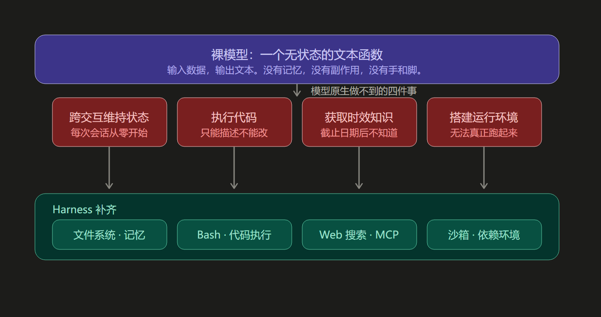
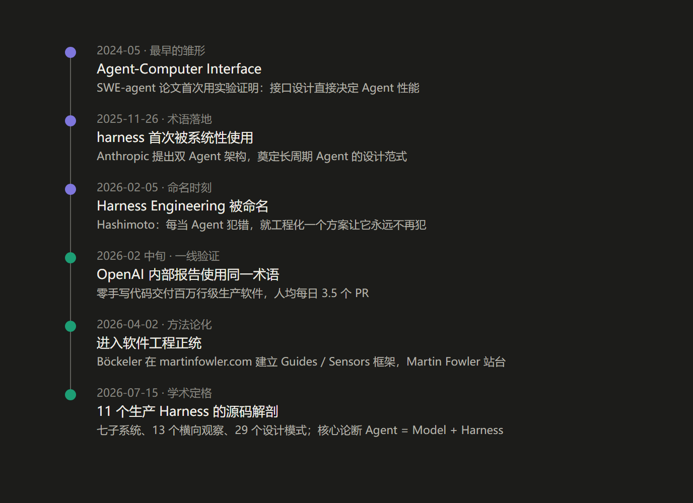
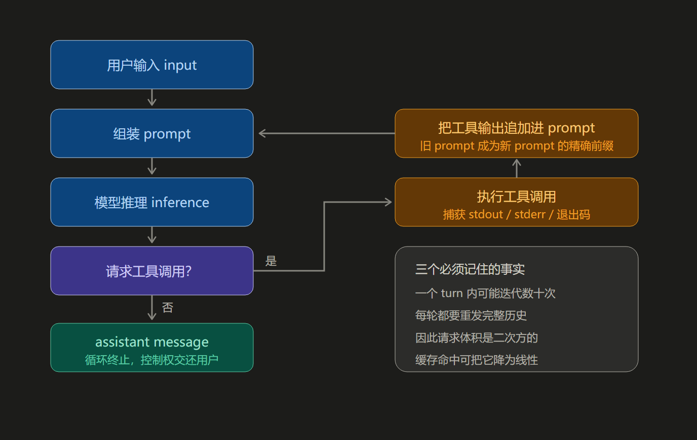
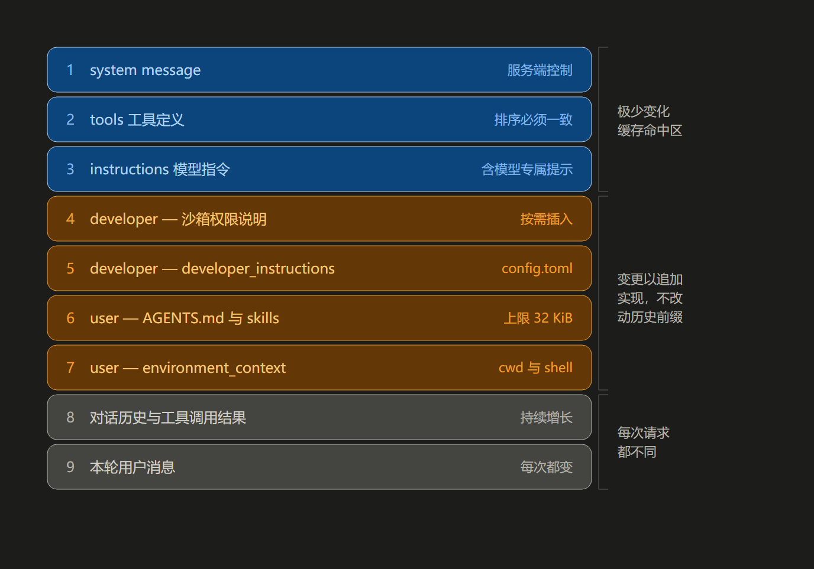
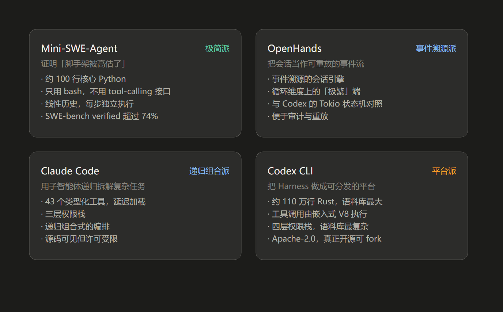

# Harness：从底层思想到 Codex 实现

> 一份从第一性原理出发的完整讲解。所有关键事实标注了来源，并区分"官方一手披露"与"第三方转述"。

---

## 目录

1. [一句话结论](#1-一句话结论)
2. [底层思想：为什么 Harness 必然出现](#2-底层思想为什么-harness-必然出现)
3. [术语谱系：Harness 从哪里来](#3-术语谱系harness-从哪里来)
4. [原理：Harness 到底在解决什么](#4-原理harness-到底在解决什么)
5. [实现：Codex 的答案](#5-实现codex-的答案)
6. [经典案例：四种截然不同的 Harness 哲学](#6-经典案例四种截然不同的-harness-哲学)
7. [两种视角：Inner Harness 与 Outer Harness](#7-两种视角inner-harness-与-outer-harness)
8. [常见误解澄清](#8-常见误解澄清)
9. [可操作结论](#9-可操作结论)
10. [生产化纵深：从能跑到跑得稳](#10-生产化纵深从能跑到跑得稳)
11. [参考来源](#11-参考来源)
12. [附录：可视化源文件](#附录可视化源文件原始-html--svg-片段)

---

## 本文图表索引

五张图均已导出为独立图片文件，位于 `images/` 目录：

| 图 | 所在章节 | PNG | SVG | 内容 |
| --- | --- | --- | --- | --- |
| 图 1 | § 2.1 | `fig1-principle.png` | `fig1-principle.svg` | 第一性原理：模型能力缺口与 Harness 补位 |
| 图 2 | § 4.1 | `fig2-agent-loop.png` | `fig2-agent-loop.svg` | 核心机制：Codex agent loop |
| 图 3 | § 3.8 | `fig3-timeline.png` | `fig3-timeline.svg` | 术语谱系：演进时间轴 |
| 图 4 | § 5.4 | `fig4-prompt-cache.png` | `fig4-prompt-cache.svg` | Codex 实现：prompt 组装顺序与缓存边界 |
| 图 5 | § 6 | `fig5-comparison.png` | `fig5-comparison.svg` | 案例对比：四种设计哲学 |

**关于格式选择：**

- **PNG** —— 2 倍分辨率（1360px 宽），由无头浏览器从 SVG 渲染。兼容所有 Markdown 渲染器与编辑器，是本分档正文采用的引用格式。
- **SVG** —— 矢量源文件，可无损缩放，便于二次编辑配色与文案。若你的编辑器支持 SVG 引用，可将上表对应路径替换引用。
- 图 3、图 5 另附**可搜索的文本版表格**（分别位于 § 3.8 与 § 6），便于检索与复制。
- 原始 HTML / SVG 代码片段保留在文末[附录](#附录可视化源文件原始-html--svg-片段)。

---

## 1. 一句话结论

**Harness 是"模型之外的一切"——把无状态的文本生成器变成能在真实世界里持续做事的智能体，所需的那套运行层代码、配置与执行逻辑。**

业界最流行的公式（LangChain，2026-03）：

```
Agent = Model + Harness
```

并有一句更锋利的说法：

> "If you're not the model, you're the harness."
> —— Vivek Trivedy, LangChain《The Anatomy of an Agent Harness》

这个概念的爆发时间线非常集中：**2026 年 2 月 5 日被命名，6 天后 OpenAI 用同一个词发布内部工程报告，两个月内被 Martin Fowler 收录为工程方法论，半年内出现了对 11 个生产级 Harness 的源码级解剖论文。** 它不是营销词，而是一批一线团队在同一个问题上撞墙后，对同一个答案的独立命名。

---

## 2. 底层思想：为什么 Harness 必然出现

### 2.1 第一性原理：模型是一个无状态函数

剥掉所有产品外壳，一个大语言模型做的事情只有一件：

```
f(text, image, audio) → text
```

输入数据，输出文本。仅此而已。它**没有**以下任何能力（这是从模型结构本身推导出来的，不是产品缺陷）：

| 模型原生做不到的事 | 后果 |
| --- | --- |
| 跨交互维持持久状态 | 每次会话从零开始，像失忆的工程师轮班 |
| 执行代码 | 只能"描述"怎么改，不能真的改 |
| 访问训练截止后的知识 | 不知道最新的库版本、API 变更 |
| 搭建环境、安装依赖 | 无法把工作真正跑起来 |

这四件事**必然**需要模型之外的机制来补。这个机制就是 Harness。



*图 1：从模型能力缺口推导 Harness 组件。上层是模型原生做不到的四件事，下层是 Harness 的对应补位机制。*

### 2.2 一个精确的历史类比：冯·诺依曼计算机

Beren Millidge 在 2023 年的文章《Scaffolded LLMs as Natural Language Computers》里给出了至今最准确的类比：

| 计算机部件 | Harness 对应物 | 特性 |
| --- | --- | --- |
| CPU | 模型本体 | 算力强，但没内存就什么都做不了 |
| RAM | 上下文窗口 | 快，但容量有限且昂贵 |
| 磁盘 | 外部数据库 / 文件系统 | 容量大，但慢 |
| 设备驱动 | 工具集成 | 让 CPU 能触碰外部世界 |
| **操作系统** | **Harness** | **调度、隔离、持久化、错误恢复** |

Millidge 的结论是："我们重新发明了冯·诺依曼架构。" 这不是巧合——任何需要"计算 + 存储 + I/O"的系统，都会收敛到相似的分层。

### 2.3 关键洞察：瓶颈的转移

早期（2023）人们以为瓶颈是"提示词写得不够好"。后来发现瓶颈是"上下文组装得不对"。到 2026 年，一线团队形成的新共识是：

> **决定 Agent 产出质量的最大变量，往往不是模型有多聪明，而是模型被放在了一个什么样的环境里。**

有两个被反复引用的实验证据：

1. **LangChain 编码 Agent 在 Terminal Bench 2.0 上的排名，仅通过优化模型外部的环境（文档结构、验证回路、追踪系统），从全球第 30 位升到第 5 位，得分 52.8% → 66.5%。底层模型一个参数都没改。**（LangChain 官方博客自述）
2. 据报道，安全研究员 Can Boluk 仅改变 Agent 的**代码编辑格式**，Grok Code Fast 1 的基准得分从 6.7% 跃升至 68.3%。（第三方转述，未见于官方一手材料，引用时需注明）

这个洞察解释了为什么 Harness 会成为一门独立的工程学科：**当模型能力趋同时，差异全部来自 Harness。**

---

## 3. 术语谱系：Harness 从哪里来

很多人误以为 Harness 是新造词。实际上它有三条独立的历史线索汇流。

### 3.1 线索一：软件测试的 test harness（很早就存在）

软件工程里，**test harness**（测试夹具）指"在受控条件下运行被测代码的一整套脚手架"——驱动、桩、测试数据、断言、报告。语义上完全一致：**包住被测对象、提供环境、驱动执行、收集结果。**

Harness 一词借用到 Agent 领域，是因为要描述的东西在结构上同构。

### 3.2 线索二：SWE-agent 的 Agent-Computer Interface（2024，最早的雏形）

2024 年 NeurIPS 的 SWE-agent 论文（arXiv:2405.15793）提出了一个后来被公认是 Harness 雏形的概念：**Agent-Computer Interface（ACI，智能体-计算机接口）**。

论文的核心主张非常有前瞻性：

> 就像人类从强大的软件应用（IDE）中获益一样，语言模型代表了一类**新的终端用户**，它们有自己独特的需求和能力，因此会从**专门为它们设计的界面**中获益。

论文用实验证明：**接口设计直接决定 Agent 性能。** SWE-agent 通过定制 ACI（专门的文件查看器、带 lint 检查的编辑命令、上下文管理机制）达到当时 SOTA：SWE-bench pass@1 12.5%，HumanEvalFix 87.7%。

**这里埋下了 Harness 思想最核心的一条原则：不要让人去适应模型，也不要让模型去适应人的接口，而要设计一个专门为模型优化的接口。**

### 3.3 线索三：Anthropic 的首批系统性实践（2025-11）

2025 年 11 月 26 日，Anthropic 工程师 Justin Young 发表《Effective harnesses for long-running agents》，这是**首批系统性使用 harness 这一术语**的权威技术文章。它提出的双 Agent 架构（见第 6 节）直接奠定了长周期 Agent 的设计范式。

### 3.4 命名时刻：Mitchell Hashimoto（2026-02-05）

HashiCorp 联合创始人、Terraform 和 Ghostty 的作者 Mitchell Hashimoto 在《My AI Adoption Journey》中，把自己采用 AI 的过程分为六个阶段，**第五阶段**被他命名为 "Engineer the Harness"。

他对 Harness Engineering 的定义只有一句话，却是整个领域最实用的定义：

> "It is the idea that anytime you find an agent makes a mistake, you take the time to engineer a solution such that the agent never makes that mistake again."
>
> **每当你发现 Agent 犯了一个错误，你就花时间去工程化一个解决方案，让这个 Agent 再也不会犯同样的错误。**

他给出的两类具体做法极具操作性：

- **简单问题** → 更新 `AGENTS.md`。他以 Ghostty 项目为例："那个文件里的每一行，都来自一次真实的坏行为，写进去之后几乎全部得到了解决。"
- **复杂问题** → 编写专用工具脚本（截图工具、过滤测试运行器），并同步更新文档告知 Agent 其存在，让 Agent 有能力**验证自己的工作**。

**这个定义的价值在于：它把 Harness 从"架构设计"降维成了"日常工程习惯"。** 你不需要一开始就设计完美架构，只需要在每次 Agent 犯错时，把这次错误固化为一条永久约束。Harness 是长出来的，不是设计出来的。

### 3.5 方法论化：Böckeler / Martin Fowler（2026-04）

2026 年 4 月 2 日，Thoughtworks 杰出工程师 Birgitta Böckeler 在 martinfowler.com 发表《Harness Engineering for Coding Agent Users》。Martin Fowler 本人在 Twitter 上为它站台：

> "Harness Engineering 是对 AI 使能软件开发关键部分的有价值框架。Harness 包括上下文工程、架构约束和垃圾回收。"

至此，Harness 从一个实践命名，变成了一门有框架、有术语、有边界的方法论。

### 3.6 学术定格：11 个生产 Harness 的源码解剖（2026-07）

2026 年 7 月（内容快照期；该编号对应 2026 年 9 月的 arXiv 发布，系 2026 年 4 月版的大幅扩充第二版），arXiv 论文《Harness Engineering: Anatomy, Architecture, and Evolution of Coding Agents — A Source-Code Study of Eleven Systems》（arXiv:2609.00006，83 页）对 11 个生产级编码 Harness 做了源码级解剖：

> Claude Code、Codex CLI、Gemini CLI、Mistral Vibe、OpenHands、Aider、Mini-SWE-Agent、Hermes、Pi、OpenCode、OpenClaw
> 外加 Omnigent 作为**第一个元 Harness（meta-harness）**对比样本。

论文给出了两个最反直觉的发现（约 400 万行 Python/TypeScript/Rust 代码中）：

1. **没有任何一个 Agent 运行时 import 通用 Agent 框架。** 全部是手写的异步循环。
2. **没有任何一个系统用向量嵌入检索代码。** 全部是确定性检索。

也就是说：**这个领域跑在朴素的手写循环 + 确定性的检索之上，而不是跑在框架和 RAG 之上。**

论文的核心论断：

> **An agent is a model plus a harness.**
> 2026 年上半年，编码 Harness 完成了**从工具到平台**的转变。

### 3.7 认知升级的三级台阶

| 阶段 | 时间 | 关注问题 | 核心技能 |
| --- | --- | --- | --- |
| Prompt Engineering | 2023 | 说什么 | 写好一条指令：few-shot、CoT、角色扮演 |
| Context Engineering | 2025 中 | 知道什么 | 设计一个动态系统来组装上下文 |
| **Harness Engineering** | **2026** | **在什么环境里做事** | **设计环境、反馈回路与控制系统** |

Karpathy 在 2025 年 6 月推动了 "context engineering" 这个词的流行（"这是一门精微的艺术与科学，用恰到好处的信息填充上下文窗口"）。但到 2025 年下半年，一线实践者发现：**光有好的上下文，Agent 依然会失控。**

一个被反复引用的悖论：**上下文窗口的扩大不等于 Agent 性能的线性提升**——即便模型理论上支持 100 万 token，性能衰减在约 25.6 万 token 处就已出现（第三方转述数据，供参考）。另一个被记录的教训是一起约 5 万美元的事故：一个无人监控的 Agent 陷入无限循环，API 账单累积到被发现时已经来不及了。

**上下文能告诉 Agent "知道什么"，但无法阻止 Agent "做不该做的事"。** 后者需要的是权限、沙箱、循环检测、成本熔断——这些全部属于 Harness。

### 3.8 演进时间轴（速查）

从最早的雏形到被学术界定格，整个过程不到两年：



*图 3：Harness 概念的演进时间轴。前三个阶段是三条平行线索，2026 年春集体汇流。下表为同一内容的可搜索文本版。*

| 时间 | 阶段 | 事件 |
| --- | --- | --- |
| **2024-05** | 最早的雏形 | **Agent-Computer Interface** —— SWE-agent 论文（NeurIPS 2024）首次用实验证明：接口设计直接决定 Agent 性能。核心主张是"模型是一类新的终端用户，需要为它专门设计的界面"。 |
| **2025-11-26** | 术语落地 | **harness 首次被系统性使用** —— Anthropic《Effective harnesses for long-running agents》提出双 Agent 架构，直接奠定长周期 Agent 的设计范式。 |
| **2026-02-05** | **命名时刻** | **Harness Engineering 被命名** —— Mitchell Hashimoto 给出最实用的定义：每当 Agent 犯错，就工程化一个方案让它永远不再犯同样的错。它把架构设计降维成了日常习惯。 |
| **2026-02 中旬** | 一线验证 | **OpenAI 内部报告使用同一术语** —— 记录一个刻意设定的极端约束实验：零手写代码交付百万行级生产软件。作者原话：最难的部分是设计环境、反馈回路与控制系统。 |
| **2026-04-02** | 方法论化 | **进入软件工程正统** —— Böckeler 在 martinfowler.com 建立 Guides / Sensors 框架，Martin Fowler 站台。Harness 从此有了分类学与设计原则。 |
| **2026-07-15** | 学术定格 | **11 个生产 Harness 的源码解剖** —— arXiv 论文给出七子系统、13 个横向观察、29 个设计模式。核心论断：*An agent is a model plus a harness.* |

*图 3：Harness 概念的演进时间轴。前三个阶段是三条平行线索，2026 年春集体汇流。*

---

## 4. 原理：Harness 到底在解决什么

### 4.1 核心循环：唯一不可省略的机制

剥掉所有外壳，Harness 的核心就是一个循环。OpenAI 在官方博客《Unrolling the Codex agent loop》中把它讲得最清楚：

```
接收用户输入 input
      ↓
构造成 prompt（文本指令集）
      ↓
模型推理 inference → 输出 output tokens
      ↓
   ┌─ 分支判断 ─┐
   ↓            ↓
产出终态回复    请求 tool call
（assistant        ↓
  message）      执行工具，捕获输出
   ↓              ↓
 循环结束      把工具输出追加到 prompt
                 ↓
              重新查询模型 ──→ 回到"模型推理"
```

几个必须精确理解的术语：

- **turn（回合）**：从一次 user input 到一次 agent response 的完整过程。在 Codex 中称为 **thread**。
- **一个 turn 内部可以包含多次推理与工具调用的迭代。** 这是最常见的理解错误——很多人以为"一问一答 = 一次模型调用"，实际上可能是几十次。
- **每个 turn 必然以一条 assistant message 结束**（例如"我已添加你要求的 architecture.md"）。这是循环的**终止状态信号**。
- **Agent 的主要产物往往不是那条消息，而是被修改的代码。** 但 assistant message 始终是"控制权交还用户"的标志。

这个循环在文献里有多个名字，指的是同一件事：

- **ReAct loop**（Reason + Act）——源自 2022 年 Shunyu Yao 等人的论文《ReAct: Synergizing Reasoning and Acting in Language Models》
- **TAO cycle**（Thought-Action-Observation）
- **agentic loop**
- Anthropic 自述它是一个 **"dumb loop"**——所有智能都在模型里，循环本身只负责管理轮次

**一个关键的工程事实：循环本身往往就是一个 while 循环，复杂度全在它管理的东西上。**



*图 2：Codex 的 agent loop。注意回路是从"追加输出"回到"组装 prompt"，这正是"精确前缀"特性的来源。*

**三个必须记住的事实：**

1. 一个 turn 内可能迭代数十次工具调用
2. 每轮都要重发完整历史
3. 因此请求体积是二次方的——缓存命中才能把它降为线性

### 4.2 三个问题域：所有 Harness 组件都能被推导出来

这是理解 Harness 最有效的方法——**不要背组件清单，要从"模型缺什么"倒推**。LangChain 的《Anatomy》一文正是用这种"倒推叙事"组织的。归纳起来，所有组件都服务于三个问题域：

#### 问题域一：上下文（Context）—— 装不下

模型的记忆就是上下文窗口，而真实任务的信息量远超窗口。

| Harness 机制 | 解决什么 |
| --- | --- |
| **Compaction（压缩）** | 窗口将满时，智能地卸载并总结现有上下文 |
| **Tool call offloading（工具输出卸载）** | 大体积工具输出塞满窗口却不提供有用信息——保留头尾，完整输出卸载到文件系统，按需读取 |
| **Just-in-time retrieval（即时检索）** | 只维护轻量标识符，运行时动态加载数据 |
| **Sub-agent delegation（子智能体委派）** | 每个子 Agent 大量探索，但只返回压缩后的摘要 |
| **Skills（技能，渐进式披露）** | 启动时不把所有工具/MCP 定义塞进上下文，只加载 front-matter 摘要 |

Anthropic 对上下文工程的目标给出了最凝练的表述：**找到"最小可能的高信号 token 集合"，以最大化期望结果出现的概率。**

#### 问题域二：动作（Action）—— 碰不到

模型只能输出文本，真实世界需要副作用。

| Harness 机制 | 解决什么 |
| --- | --- |
| **文件系统** | 给 Agent 一个工作区，读写数据、代码、文档；也是多 Agent 协作的共享面 |
| **Bash + 代码执行** | 通用工具。与其为每种操作预定义工具，不如给模型一台计算机——它能用代码**动态合成自己的工具** |
| **沙箱（Sandbox）** | 安全隔离地运行 Agent 生成的代码；可横向扩展（按需创建、派发、销毁） |
| **Git** | 在文件系统之上加版本控制，让 Agent 能追踪工作、回滚错误、分支实验 |
| **浏览器 / 日志 / 截图 / 测试运行器** | 让 Agent **看见自己工作的结果**，形成自我验证循环 |

**"Bash + 代码"是有分水岭意义的决策。** 今天主流 Harness 的默认策略是：不再手工设计大量窄工具，而是给 Agent 一个通用执行面，让它自己解决问题。Databricks 也观察到了同样的趋势。

#### 问题域三：状态与约束（State & Guardrails）—— 记不住 / 管不住

| Harness 机制 | 解决什么 |
| --- | --- |
| **记忆文件（AGENTS.md / CLAUDE.md）** | 会话启动时注入上下文；Agent 编辑它时，Harness 加载更新——**一种持续学习机制** |
| **Web 搜索 / 时效性 MCP** | 突破知识截止日期 |
| **权限与审批** | 分层授权：每条命令都批准 / 只批写操作 / 沙箱内完全自主 |
| **成本与步数熔断** | 防止无限循环烧钱 |
| **可观测性（tracing）** | 记录每一步、每次工具调用、每个中间结果，使失败可诊断 |

### 4.3 反面案例：`context rot` 与"熵管理"

两个必须知道的反模式：

**Context rot（上下文腐烂）**：随着上下文窗口被填满，模型在推理和完成任务方面**变得更差**。上下文是稀缺资源，不是越多越好。这直接解释了为什么 OpenAI 团队把巨型 `AGENTS.md` 拆成分层文档（见 5.5 节）。

**Harness 自身的腐化**：这是 Böckeler 框架里最有洞察力的一点。**Harness 本身也是代码和文档，它同样会腐化。** 随着代码库增长，规则文件会变得冗长、过时、自相矛盾。如果 Harness 腐化了，Agent 就会因为读到混乱指令而输出混乱代码。

所以她主张把"熵管理 / 垃圾回收"作为 Harness 的独立维度：**约束系统本身不能随时间退化。**（OpenAI 团队部署了专门的清理 Agent，定期扫描文档漂移、模式违规与依赖问题。）

### 4.4 七个子系统：学术界的标准切分

arXiv:2609.00006 把所有 Harness 映射到同一套七子系统，每个子系统都有"极简实现"和"极繁实现"两端。**这张表是理解 Harness 设计空间的最好工具**：

| 子系统 | 极简实现 | 极繁实现 |
| --- | --- | --- |
| Agent Loop | Mini-SWE-Agent：线性 while 循环 | OpenHands：事件溯源的会话引擎 |
| LLM Integration | 单次 LiteLLM 调用 | Hermes：5 套自有传输层、29 种 provider 配置 |
| Tools & Actions | 只有 bash（1 个工具） | OpenClaw：通过网关委派 109+ 工具 |
| Memory & Context | 无界线性历史 | Codex：Agent 自维护的跨会话记忆管线 |
| Safety & Permissions | 仅成本/步数限制 | **Codex：四层栈** |
| Orchestration | Aider：刻意不做编排 | Claude Code：递归组合 |
| Extensibility | Python 结构化类型 | Pi：一切皆扩展的运行时 |

论文的第一个观察值得所有人记住：

> **循环的复杂度并不预测基准性能。** Mini-SWE-Agent 用线性 while 循环 + bash 作为唯一工具 + 无安全层（只有成本和步数限制），取得了与体量大得多的系统相当的 SWE-bench 分数。
>
> **生产级复杂度是被安全性、用户体验和传输层需求驱动的，而不是被任务完成能力驱动的。**

---

## 5. 实现：Codex 的答案

### 5.1 Codex 明确采用了 Harness 思想

**答案很直接：不只是采用了，OpenAI 是这个词的核心推动者之一。**

证据有三：

1. **术语对齐**：Anthropic 称 Claude Agent SDK 是 "the agent harness that powers Claude Code"；OpenAI 的 Codex 团队使用完全相同的框架，**明确把 "agent" 和 "harness" 视为同一件事**——指使 LLM 变得有用的非模型基础设施。
2. **官方技术博客**：《Unrolling the Codex agent loop》（2026-01-23，作者 Michael Bolin，OpenAI Technical Staff）开篇即定义词表："Codex" 指 Codex CLI / Codex Cloud / Codex VS Code 扩展的产品套件；**本文聚焦 Codex harness——为所有 Codex 体验提供核心 agent loop 与执行逻辑，并通过 Codex CLI 暴露。**
3. **内部实验报告**：OpenAI 在 2026 年 2 月发布的内部报告，标题直接使用 "Harness Engineering"，记录了 5 名工程师、5 个月、0 行手写代码、交付 100 万行以上生产级软件的实验（第三方转述，具体数字建议以 OpenAI 原报告为准）。

值得注意的是，论文还把 Codex 标定为多个子系统的"极繁端"样本：**约 110 万行 Rust，是语料库中最大的单体代码库**；拥有最复杂的四层权限栈；也是唯一采用"V8 执行工具调用"的系统。（数据来自 arXiv:2609.00006 的分析）

### 5.2 循环层：Tokio 异步状态机

Codex 的循环实现方式，与极简派的 while 循环完全不同：

- 它是一个 **Tokio 异步状态机**——不是阻塞式顺序循环，不是事件溯源引擎，而是**可并发的 Rust 异步运行时，能在不串行化的情况下批量执行工具调用**。
- 这使 `codex agents`（v0.149.0+）的**多 Agent 扇出**成为可能：独立子会话并行执行，不会争抢单一事件队列。（来自 arXiv:2609.00006 的分析）

对照一下极简派：Mini-SWE-Agent 用 `subprocess.run` 执行每一个动作（而不是维持一个有状态的 shell 会话），**每个动作完全独立**，因此换成 `docker exec` 就是沙箱化，天然可扩展。

两种选择反映不同的目标：**Codex 追求并发能力与平台化；Mini-SWE-Agent 追求可审计性与可复现性。**

### 5.3 模型接入层：Responses API

Codex CLI 通过向 **Responses API** 发送 HTTP 请求来驱动 agent loop。端点**可配置**，任何实现了 Responses API 的端点都能用：

| 认证方式 | 端点 |
| --- | --- |
| ChatGPT 登录 | `https://chatgpt.com/backend-api/codex/responses` |
| API Key（OpenAI 托管模型） | `https://api.openai.com/v1/responses` |
| `--oss` + gpt-oss（ollama 0.13.4+ / LM Studio 0.3.39+） | `http://localhost:11434/v1/responses` |
| Azure 等云厂商托管 | 各自的 Responses API 端点 |

服务端以 **Server-Sent Events（SSE）**流式返回，事件 `data` 为 JSON，`"type"` 以 `"response"` 开头，例如：

```
data: {"type":"response.reasoning_summary_text.delta","delta":"ah ", ...}
data: {"type":"response.output_text.delta", "delta":"forty-", ...}
data: {"type":"response.completed","response":{...}}
```

**设计含义：把"模型接口"做成可替换的适配器，而不是硬编码依赖。** 这是所有成熟 Harness 的共同特征——它让同一套工具逻辑可以跑在 GPT、Claude、Gemini 或本地开源模型上。

### 5.4 Prompt 组装层：最容易被低估的一层

用户不直接指定 prompt，而是提供输入，由服务端结构化为模型可消费的提示。Prompt 被视为一个 **item 列表**，每项带 `role`。

**角色优先级（递减）：`system` > `developer` > `user` > `assistant`**

Responses API 的三个核心 JSON 参数：

| 参数 | 内容 | 谁控制 |
| --- | --- | --- |
| `instructions` | system / developer 消息 | 客户端（Codex 从 `~/.codex/config.toml` 的 `model_instructions_file` 读，否则用模型自带的 `base_instructions`，如 `gpt-5.2-codex_prompt.md`） |
| `tools` | 工具定义列表 | 客户端 |
| `input` | 文本/图像/文件输入列表 | 客户端 |

**Codex 在用户消息之前插入的前置项（顺序很重要）：**

1. **`role=developer` 沙箱消息** —— 只适用于 Codex 提供的 `shell` 工具（MCP 工具不受此沙箱约束）。内容模板来自 `workspace_write.md` 与 `on_request.md`，包含 `<permissions instructions>`：文件权限、网络访问、何时请求许可、可写文件夹列表。
2. **（可选）`role=developer`** —— 来自 `config.toml` 的 `developer_instructions`。
3. **（可选）`role=user` 用户指令** —— 聚合多个来源，**更具体者靠后**：
   - `$CODEX_HOME` 下的 `AGENTS.override.md` 与 `AGENTS.md`
   - 从 Git / 项目根目录向上到 `cwd`，逐级查找 `AGENTS.override.md`、`AGENTS.md` 或 `project_doc_fallback_filenames` 指定的文件
   - **大小上限默认 32 KiB**
   - 若配置了 skills：短前言 + 各 skill 的 metadata + 如何使用 skills 的说明段
4. **`role=user` 环境上下文**：

```xml
<environment_context>
  <cwd>/Users/mbolin/code/codex5</cwd>
  <shell>zsh</shell>
</environment_context>
```

用户消息本身的 JSON 结构：

```json
{ "type": "message", "role": "user",
  "content": [{"type": "input_text", "text": "..."}] }
```

**注意最后一项：前三项的顺序由服务端决定（system message 内容由服务端控制，tools 与 instructions 由客户端提供），之后接 `input` 完成整个 prompt。**



*图 4：Codex 的 prompt 组装顺序与缓存边界。前三个 item 由服务端/客户端固定，构成稳定前缀；中间四个是配置层，**只追加、不修改**；最后两项每次都变。*

### 5.5 工具层

`tools` 字段符合 Responses API schema，包含三类来源：**Codex CLI 内置、Responses API 提供、用户通过 MCP server 提供**。

官方博客给出的真实示例：

```javascript
// Codex 默认 shell 工具
{ "type": "function", "name": "shell",
  "description": "Runs a shell command and returns its output...",
  "strict": false,
  "parameters": { "type": "object", "properties": {
      "command":   {"type": "array", ...},
      "workdir":   {...},
      "timeout_ms":{...} },
    "required": ["command"] } }

// 内置计划工具
{ "type": "function", "name": "update_plan",
  "description": "Updates the task plan...",
  "parameters": { "properties": {"plan":..., "explanation":...},
                  "required": ["plan"] } }

// Responses API 提供的联网搜索
{ "type": "web_search", "external_web_access": false }

// MCP 示例
{ "type": "function", "name": "mcp__weather__get-forecast", ... }
```

**Codex 的架构标志之一：工具调用以 V8 执行的代码形式运行。** （据 arXiv:2609.00006）

不是分派到离散的类型化函数，而是把工具调用打包成 JavaScript，在嵌入的 V8 引擎里执行。这让**动态工具组合**成为可能——工具可以在 JavaScript 层有条件地委派给另一个工具，然后才返回 Rust Harness。语料库中没有任何其他系统采用这一方法；对照点是 Claude Code 的 43 个类型化工具的延迟加载，用惰性静态分派实现了类似的灵活性。

这个模式的实际收益是：**服务端可以动态下发工具 schema，而不必在构建期硬编码。**

### 5.6 上下文层：Codex 最有教学价值的三个设计决策

这是整篇文章技术密度最高的部分。

#### 决策一：精确前缀不变性 → 最大化 prompt caching

**核心事实：旧的 prompt 是新 prompt 的 exact prefix（精确前缀）。**

这不是巧合，而是刻意的设计意图——**为了启用 prompt caching**。

为什么这如此重要？官方博客给出了两个关键判断：

1. **Agent loop 在发送给 Responses API 的 JSON 体积意义上是二次方（quadratic）的。** 因为每一轮都要重新发送完整历史。
2. **采样模型成本主导网络成本。缓存命中时，采样成本变为线性（linear）而非二次方。**

正因为如此，官方给出了明确的 prompt 缓存准则：**静态内容（指令、示例）放前面，变量内容（用户特定）放后面；images 和 tools 也必须在请求间保持一致。**

**在 Codex 中会导致 cache miss 的操作：**

- 对话中途改变 `tools`
- 改变 `model`（会改变原 prompt 第三项——模型特定指令）
- 改变沙箱配置、approval mode、cwd

**于是 Codex 采取了一个非常优雅的设计：所有中途的配置变更，都通过"追加新消息"而非"修改早期消息"来实现。**

| 变更 | 实现方式 |
| --- | --- |
| 沙箱 / approval 变化 | 插入新的 `role=developer` 消息（复用同样的 `<permissions instructions>` 格式） |
| cwd 变化 | 插入新的 `role=user` 消息（复用同样的 `<environment_context>` 格式） |

**这是一个可以直接迁移到任何 Agent 系统的工程原则：把"配置"变成"追加到对话里的消息"，而不是"改变请求的外层参数"。** 代价是 prompt 稍长，收益是缓存持续命中。

还有一个真实踩坑案例：Codex 最初支持 MCP 时，因为没有对工具做**一致排序**而导致 cache miss（PR #2611）；另外 `notifications/tools/list_changed` 这类中途通知也可能引发昂贵的 miss。

#### 决策二：放弃 `previous_response_id`，换取无状态与 ZDR

Responses API 支持用 `previous_response_id` 缓解二次方问题，但 **Codex 当前没有使用它**。原因是要保持请求完全 **stateless（无状态）**，从而支持 **Zero Data Retention（ZDR，零数据保留）**。

ZDR 客户并没有因此牺牲专有推理消息：通过关联 `encrypted_content`，可以在服务端解密。（相关 PR：#642、#1641）

**这体现了一条价值排序：合规性与可移植性 > 请求体积优化。** 值得注意——它同时也简化了多 provider 支持的复杂度。

#### 决策三：压缩（Compaction）的演进

Agent 在一个 turn 里可能做出数百次工具调用，耗尽上下文窗口。所以上下文窗口管理是 Agent 的**核心职责之一**。

Codex 的压缩机制经历了明显演进：

| 阶段 | 机制 |
| --- | --- |
| 早期（PR #1527） | 手动 `/compact` 命令：用现有对话 + `SUMMARY.md` 指令生成总结，把 assistant 总结消息作为新的 `input` |
| 现在 | Responses API 提供 **`/responses/compact` 端点**，返回含 `type=compaction` 与 `encrypted_content` 的 item 列表（`encrypted_content` 是不透明的，**保存了模型对原对话的潜在理解**）。Codex 在超出 `auto_compact_limit` 时自动调用 |

**从"让模型写一份人类可读的摘要"进化到"把 latent understanding 编码成不透明载荷"，这是压缩机制的一个质变。**

#### 第一轮迭代的真实结构

假设首次响应包含两个 `response.output_item.done`：`type=reasoning` 与 `type=function_call`。再次查询时，`input` 必须包含：

```json
// 1. 推理摘要（含加密载荷）
{ "type": "reasoning",
  "summary": [...],
  "encrypted_content": "gAAAAABpaDWNMxMeLw..." }

// 2. 工具调用请求
{ "type": "function_call", "name": "shell",
  "arguments": "{\"command\":\"cat README.md\",\"workdir\":\"/Users/mbolin/code/codex5\"}",
  "call_id": "call_8675309..." }

// 3. 工具执行结果
{ "type": "function_call_output", "call_id": "call_8675309...",
  "output": "<p align=\"center\"><code>npm i -g @openai/codex</code>..." }
```

### 5.7 安全层：四层栈（语料库中最复杂）

据 arXiv:2609.00006 的源码分析，Codex 的权限栈是四层，**且顺序有严格含义**：

```
第 1 层  Starlark 执行策略        ← 声明式规则（注意：不是 TOML 配置）
   ↓  工具调用必须先通过策略门
第 2 层  Lifecycle Hooks          ← PreToolUse / PostToolUse / Interrupt
   ↓  再通过任何匹配的钩子
第 3 层  Guardian                  ← LLM 审批审查者（需要审批时）
   ↓  再满足 Guardian
第 4 层  原生 OS 沙箱              ← macOS profile / Linux seccomp / Windows AppContainer
   ↓  最后承受操作系统级强制
```

对照：Claude Code 是三层；Gemini CLI 是四种审批模式 + 跨平台沙箱。

**"第 3 层 Guardian 是一个 LLM 审批审查者"这一点特别值得注意**——它意味着 AI 在 Harness 内部承担了安全角色：用一个模型去审查另一个模型的动作。这与 Anthropic 三 Agent 架构中"Evaluator"的思路异曲同工（见 6.3）。

论文还给出了一个有意思的补充：Pi 刻意**把"缺少安全基础设施"文档化**，并作为安全论证——因为它本地运行且不联网。

### 5.8 Codex 的三条架构标志（小结）

| 标志 | 内容 | 唯一性 |
| --- | --- | --- |
| V8 执行的工具调用 | 工具调用作为 JavaScript 在嵌入式 V8 中执行 | 语料库中唯一 |
| Agent 自维护的记忆管线 | Agent 自己写摘要并持久化存储（区别于 11 个系统中 7 个采用的"阈值触发压缩"） | 极繁端 |
| 四层权限栈 | Starlark 策略 → Hooks → Guardian → OS 沙箱 | 语料库中最复杂 |

第三项尤为重要：**Claude Code 只有三层，Codex 有四层，且顺序不可交换。**

---

## 6. 经典案例：四种截然不同的 Harness 哲学



*图 5：四个代表性 Harness 的设计哲学对比。数据来源：arXiv:2609.00006 对 11 个生产 Harness 的源码解剖。下表为同一内容的可搜索文本版。*

先给一张全景对比。**注意代码量跨越了三个数量级，但性能并不随复杂度线性提升**——这是理解 Harness 设计空间的关键：

| | Mini-SWE-Agent | OpenHands | Claude Code | Codex CLI |
| --- | --- | --- | --- | --- |
| **哲学标签** | 极简派 | 事件溯源派 | 递归组合派 | 平台派 |
| **一句话** | 证明"脚手架被高估了" | 把会话本身当作可重放的事件流 | 用子智能体把复杂任务递归拆开 | 把 Harness 做成可分发的平台 |
| **Agent Loop** | 线性 while 循环 | 事件溯源的会话引擎（极繁端） | 递归组合 | Tokio 异步状态机 |
| **工具** | 只有 bash，甚至不用 tool-calling 接口 | — | 43 个类型化工具，延迟加载 | V8 执行工具调用（语料库唯一） |
| **安全层** | 仅成本与步数限制 | — | 三层权限栈 | 四层权限栈（语料库最复杂） |
| **规模** | 约 100 行核心 Python | − | − | 约 110 万行 Rust（语料库最大） |
| **许可** | 开源 | 开源 | 源码可见但许可受限 | Apache-2.0，真正开源可 fork |
| **代表成绩** | SWE-bench verified 超过 74% | − | − | − |

*图 5：四个代表性 Harness 的设计哲学对比。数据来源：arXiv:2609.00006 对 11 个生产 Harness 的源码解剖。*

**这张表最重要的读法**：Mini-SWE-Agent 用约 100 行代码取得了与体量大得多的系统相当的分数。论文的结论是——

> **循环复杂度不预测基准性能。生产级复杂度是被安全性、用户体验和传输层需求驱动的，而不是被任务完成能力驱动的。**

### 6.1 Mini-SWE-Agent：证明"脚手架被高估了"

由 SWE-bench 和 SWE-agent 的原班人马（Princeton & Stanford）构建。

| 维度 | 实现 |
| --- | --- |
| 代码量 | **约 100 行**核心 Python（+100 行用于 env、model、script） |
| 工具 | **只有 bash——一个工具**。甚至不使用 LMs 的 tool-calling 接口 |
| 历史 | 完全线性：每一步只是 append 到 messages，没有别的 |
| 执行 | `subprocess.run`——每个动作完全独立，不维持有状态的 shell 会话 |
| 模型 | 通过 LiteLLM 支持任何模型 |
| 成绩 | **SWE-bench verified >74%** |

**为什么这个案例如此重要？** 团队自己的解释：

> "SWE-agent 在 2024 年开启了 AI Agent 的发展。当时我们把大量重心放在工具和为 Agent 定制的特殊接口上。但一年之后，这些东西对于构建一个有用的 Agent 来说**大多不再需要了**。"

它的三个设计选择都是刻意的工程收益：

1. **无 tool-calling 接口** → 可以用任意模型跑，包括不支持 tool-calling 的
2. **`subprocess.run` 而非有状态 shell** → 沙箱化就是替换一个函数调用（换成 `docker exec`），可扩展性极好
3. **完全线性历史** → trajectory 与传给 LM 的 messages 完全一致，对调试和微调极友好

它已成为评测领域的事实标准 Harness（被 Meta、NVIDIA、Essential AI、Anyscale 等使用）。

**结论：Harness 的价值不在复杂度，而在"恰好补齐模型缺口"的精确度。**

### 6.2 Anthropic 双 Agent：解决"一次做太多"与"过早宣布完成"

**背景问题**（一个极好的比喻）：长周期 Agent 的根本挑战是，它们必须在离散会话中工作，**每次新会话开始时对之前发生的事情毫无记忆——就像一个由工程师轮班的项目，每位新工程师上班时对上一班发生的事一无所知。**

关键事实：即使 Opus 4.5 这样的前沿模型，配上 Claude Agent SDK（具备 compaction 能力），如果只给一句 "build a clone of claude.ai" 这样的高层提示，跨多个上下文窗口也**无法**构建出生产级 Web 应用。

**观察到的两种失败模式：**

1. **一次性尝试（one-shotting）**：Agent 试图一次做完整个应用，结果在实现到一半时耗尽上下文，留给下一个会话一个**没有文档的半成品**。下一个 Agent 必须猜测发生了什么，花大量时间先让基础应用重新跑起来。**即使有 compaction 也会发生，因为压缩不一定传递完美清晰的指令。**
2. **过早宣布完成**：项目后期，新的 Agent 实例环顾四周、看到已有进展，就宣布工作完成。

**双 Agent 解决方案：**

| Agent | 职责 | 关键产出 |
| --- | --- | --- |
| **Initializer（初始化）** | 只在第一次会话运行，用专门的提示词搭建环境 | `init.sh`（如何启动开发服务器）、`claude-progress.txt`（跨会话进度日志）、初始 git commit、**功能列表文件** |
| **Coding（编码）** | 每次后续会话做增量进展，留下清晰的交接物 | 每次只做一个功能；完成后提交 git 并更新进度文件；保持代码处于"可合并到主分支"的干净状态 |

**功能列表文件是最巧妙的 prompt engineering。** 它把用户的原始提示扩展成数百条具体、可测试的需求（对 claude.ai 克隆的案例是 **200+ 条功能**，如"用户可以打开新对话、输入查询、按回车、看到 AI 回复"），初始状态全部标记 `passes: false`。团队发现 **JSON 结构比 Markdown 更稳健**——模型更不容易不恰当地修改或删除 JSON 条目。

**另一条关键指令：必须使用浏览器自动化工具（Playwright MCP 等）像真实用户一样做端到端测试。** 仅靠单元测试或 `curl` 无法验证交互功能。这条要求显著提升了性能。

### 6.3 Anthropic 三 Agent：对抗自我评估偏差与上下文焦虑

第二代 Harness 解决的是两个新发现的问题：

**问题一：Self-evaluation bias（自我评估偏差）**
> 当被要求评估自己产出的作品时，Agent 倾向于自信地称赞自己的作品并通过验证——**即使在人类观察者眼中质量明显平庸**。这个问题在界面设计等主观任务上尤为突出。

**问题二：Context anxiety（上下文焦虑）**
> Claude Sonnet 4.5 表现出强烈的上下文焦虑——当它认为自己快要达到上下文窗口极限时，**开始提前收尾结束工作**。

**三 Agent 方案（灵感来自生成式对抗网络 GAN）：Planner + Generator + Evaluator**

| Agent | 职责 |
| --- | --- |
| **Planner** | 把用户的 1~4 句提示扩展为完整产品规格。**刻意停留在高层设计，避免指定实现细节**——防止细节错误级联传导到下游 |
| **Generator** | 继承第一代"每次只做一个功能"原则，以迭代冲刺（sprint）方式工作。每轮先自评，再交给 Evaluator |
| **Evaluator** | 拥有涵盖产品深度、功能性、视觉设计、代码质量的评分标准。每项有硬性阈值，任一项低于阈值则该轮失败，Generator 收到详细反馈 |

**为什么分离 Generator 和 Evaluator 有效？** 作者的推理很关键：

> 分离本身不会立即消除 LLM 的宽容倾向——Evaluator 依然是一个 LLM，天然倾向于对 LLM 生成的输出宽容。**但把独立的 Evaluator 调教得"怀疑"要远比让 Generator 批判自己来得可行。** 而且一旦有了外部反馈，Generator 就有了具体可迭代的对象。

**Context Reset vs Compaction**——这是文档中最有区分度的一节：

| | Compaction | Context Reset |
| --- | --- | --- |
| 做法 | 就地总结更早的对话，同一个 Agent 在缩短的历史上继续 | **完全清空上下文窗口，启动一个全新的 Agent**，配合结构化交接（携带前一个 Agent 的状态与后续步骤） |
| 保留 | 连续性 | **干净的白板** |
| 问题 | 上下文焦虑依然存在 | 需要交接物包含足够状态，且增加编排复杂度、token 开销与延迟 |

**Sprint Contract（冲刺契约）**：每轮 sprint 开始前，Generator 和 Evaluator 协商"完成"的定义——Generator 提出要构建什么、如何验证成功，Evaluator 审查提案，双方达成共识后才开始编码。Agent 间通信以文件保存，保证工作始终向协商的契约靠拢，同时避免过早约束实现细节。

**对比实验（2D 复古游戏引擎）**，据第三方转述：

| 配置 | 耗时 | 成本 | 结果 |
| --- | --- | --- | --- |
| 单 Agent | 20 分钟 | $9 | 严重缺陷，游戏**根本无法运行** |
| 三 Agent 完整架构 | 6 小时 | $200 | 包含关卡编辑器、精灵编辑器、实体行为系统，**完全可玩** |

**最有意思的后续发现：随着 Opus 4.5 / 4.6 发布，模型本身已能覆盖部分过去需要 Harness 补齐的能力**——Context reset 的 token 开销、sprint 结构的协调成本，在更强的模型上反而成了新的摩擦。

**这引出了 Harness 工程的一条根本规律：Harness 是在"修补模型当下的缺陷"，因此它会随着模型变强而需要被裁撤。Harness 不是永久资产，是需要持续重新评估的负债。**

### 6.4 工程组织级案例：Stripe 与 OpenAI

**Stripe 的 Minions**（据第三方转述）：

- 每周合并超过 **1,300 个**由 AI 完全编写、人类仅负责审查的 PR
- 每个 Agent 任务在独立的**预热 devbox** 中运行，与 Stripe 工程师使用的机器完全相同，约 10 秒内启动，内置代码库与服务，**与生产系统及互联网完全隔离**
- 工具访问通过名为 **Toolshed** 的中心化 MCP 服务器，托管近 500 个工具，涵盖内部系统与外部 SaaS
- **Agent 与人类开发者享有完全一致的工具访问权限**
- pre-push hooks 基于启发式运行相关 linter，强调 "shift feedback left"

**OpenAI 内部实验**（据第三方转述，建议核对原报告）：

- 从 3 名工程师起步，最终 7 名；5 个月构建并交付内部测试版产品
- **零行人类手写代码**；人均每日 3.5 个 PR 的合并吞吐量
- 团队明确声明这是一个**刻意设定的极端约束实验（forcing function）**——设置"零人类代码"规则的目的就是倒逼团队构建能让 Agent 大规模可靠工作的工程基础设施
- 报告作者 Ryan Lopopolo 的话被反复引用："**我们目前最困难的挑战，集中在设计环境、反馈回路和控制系统上。**"

**最有实操价值的踩坑记录——AGENTS.md 的进化：**

早期团队犯的经典错误是**把所有信息塞进一个庞大的 AGENTS.md**（系统说明、架构规范、代码风格、边界条件全堆在一起），结果 **Agent 被信息淹没，性能反而下降**。

最终演化出**渐进式披露模型**：`AGENTS.md` 精简为约 100 行的"目录"，指向结构化的 `docs/` 目录：

```
项目根目录/
├── AGENTS.md            ← 精简目录（~100 行），指向 docs/
├── AGENTS.override.md   ← 子目录级覆盖规则
└── docs/
    ├── ARCHITECTURE.md  ← 分层架构与依赖流向
    ├── DESIGN.md        ← 设计原则与模式
    ├── PLANS.md         ← 执行计划
    ├── PRODUCT_SENSE.md ← 产品意图与用户旅程
    ├── QUALITY_SCORE.md ← 质量评分标准
    ├── RELIABILITY.md   ← 可靠性要求
    └── SECURITY.md      ← 安全约束
```

发现机制是逐级读取（全局 → 项目根 → 子目录，就近优先）。例如 `services/payments/` 下可以放一份 `AGENTS.override.md`，用 `make test-payments` 覆盖根目录的 `npm test` 规则。**大小上限默认 32 KiB。**

> 核心假设：**Agent 不需要一开始就知道所有事情，它需要在正确的时机获得正确粒度的信息。** 跟人类工程师入职的逻辑一样——没有人第一天就读完公司所有文档。

**另一项激进实践：让 Agent 看见运行时。**
日志、指标、追踪信息通过本地可观测性栈（每个工作树独立实例化）向 Codex Agent 开放。Agent 可以用 **LogQL 和 PromQL** 查询来验证服务启动时间和关键用户旅程的性能指标。更进一步，Agent 可以通过 **Chrome DevTools Protocol** 操作浏览器：重现 Bug、验证修复、直接对 UI 行为进行推理。

**机械化架构围栏：**
定义严格的依赖流向 `Types → Config → Repo → Service → Runtime → UI`，任何违反方向的代码都被拦截。两种机制：

1. **确定性 Linter** —— 有一个极具教学意义的细节：工程师**花了数小时重写 Linter 的错误输出格式**，唯一目的是让 Agent 能"读懂"出了什么问题并自动修复。**Linter 输出的受众从人类变成了 AI——这本身就是 Harness Engineering 思维的典型体现。**
2. **基于 LLM 的审计 Agent** —— 检查难以用形式化规则捕捉的语义违规

**其思路是：每当 Agent 犯一个新类型的错误，就回头加一条约束。日积月累，Harness 越来越健壮，Agent 能犯的错越来越少。** 这正是 Hashimoto 所说的"让 Agent 永远不再犯同样的错误"。

---

## 7. 两种视角：Inner Harness 与 Outer Harness

这是初学者最容易混淆的地方。**"Harness" 在不同语境下含义不同，且两种理解都是对的——它们描述的是系统边界的不同位置。**

| | 视角一：Harness 在 Agent 内部 | 视角二：Harness 在 Agent 外部 |
| --- | --- | --- |
| 代表 | LangChain、OpenAI（工程视角） | Mitchell Hashimoto、Böckeler/Fowler |
| 公式 | `Agent = Model + Harness` | Agent 已是完整实体（模型 + 推理循环），Harness 是围绕它的外部环境 |
| Harness 指 | 模型之外、Agent 之内的一切基础设施 | 你为自身用例构建的外部控制层 |
| 内容包括 | 系统提示词、工具/Skills/MCP 及描述、捆绑基础设施（文件系统/沙箱/浏览器）、编排逻辑（子 Agent 派生、交接、模型路由）、钩子/中间件（压缩、续写、lint 检查） | `AGENTS.md` 文档、Lint 规则、沙箱、自检脚本、模块边界约束 |
| 使用者 | Harness 的作者（平台方） | Harness 的用户（应用团队） |

Böckeler 的切分更加精细：

- **内置 Harness（built-in harness）**：由 Agent 自身提供——system prompt、代码检索机制、复杂的编排系统
- **外层 Harness（outer harness）**：**用户针对自身用例和系统构建的外部控制层**（她的文章重点）

### 7.1 Böckeler 的核心框架：Guides 与 Sensors

这是她最有价值的贡献。把 Harness 的控制机制按两个维度切开：

**维度一：时间向度**

| 类型 | 中文 | 作用 | 时机 |
| --- | --- | --- | --- |
| **Guides** | 引导 | **前馈控制（feedforward）**：行动前预判并引导行为，提高一次做对的概率 | 行动前 |
| **Sensors** | 传感器 | **反馈控制（feedback）**：行动后观察并帮助自我纠正 | 行动后 |

特别强大的一种 Sensor 是**为 LLM 消费优化的信号**——例如包含纠正指令的定制 linter 消息，她称之为 **"一种积极的提示注入（a positive kind of prompt injection）"**。

**维度二：执行类型**

| 类型 | 运行载体 | 速度/成本 | 确定性 | 典型实现 |
| --- | --- | --- | --- | --- |
| **Computational（计算型）** | CPU | 毫秒到秒 | **确定性、可靠** | 测试、linter、类型检查器、结构分析 |
| **Inferential（推理型）** | GPU/NPU | 慢、贵 | **非确定性，但语义判断丰富** | 语义分析、AI 代码审查、LLM as judge |

**两条必须协同的原则：**

> - 仅有 feedback → Agent 会重复犯同样的错误
> - 仅有 feedforward → 你写了规则，但不知道是否有效

### 7.2 组合矩阵与三类监管目标

**Guides / Sensors × Computational / Inferential 的实例矩阵：**

| 方向 | 执行类型 | 示例 |
| --- | --- | --- |
| Coding conventions | feedforward / Inferential | `AGENTS.md`、Skills |
| 引导启动新项目 | feedforward / Both | 带指令的 Skill + bootstrap 脚本 |
| Code mods | feedforward / Computational | 可访问 OpenRewrite recipes 的工具 |
| Structural tests | feedback / Computational | pre-commit hook 运行 ArchUnit 测试 |
| Review 指令 | feedback / Inferential | Skills |

**三类监管目标：**

1. **Maintainability harness（可维护性）** —— 调节内部代码质量。Computational sensors 可靠捕捉重复代码、圈复杂度、架构漂移；LLM 概率性地处理语义重复与过度工程。**目前最容易实现。**
2. **Architecture fitness harness（架构适配）** —— 定义并检查架构特征（Fitness Functions）：性能需求 skill + 性能测试反馈、可观测性编码规范 + debugging 指令。
3. **Behaviour harness（行为）** —— 功能行为引导。目前主要靠功能规格（前馈）+ AI 生成测试通过（反馈）+ 手动测试，**信任度仍不足**。

### 7.3 几条关键原则

- **质量左移（Keep quality left）**：检查应尽可能靠近生产路径左侧。越早发现问题，修复成本越低。反馈传感器需要分布在全生命周期。
- **Steering loop（转向循环）**：人类通过迭代 Harness 来引导 Agent——某个问题多次出现，就改进对应的控制机制。
- **Ashby 定律（Law of Requisite Variety）**：**调节器必须至少具有与其所治理系统一样多的多样性。** LLM Agent 能产生几乎任何东西，因此承诺特定的代码拓扑（topology）是一种**"减少多样性"的举措（variety-reduction move）**，它使构建完整的 Harness 成为可能。这解释了为什么强架构约束能显著提升 Agent 可靠性。
- **人类的角色**：Harness 试图外化人类开发者的隐含经验，但**好的 Harness 不应旨在完全消除人类输入，而是把人类引导到最重要的输入点。**
- **Harnessability（可挽具性）**：代码库易于被 Harness 的程度因语言、架构而异。强类型语言、清晰的模块边界、成熟框架天然提供 Sensor。**Greenfield（绿地项目）可以从第一天就嵌入 Harness；Legacy（遗留系统）最难构建。**
- **Ambient affordances（环境可及性）**：使环境更易于被 Harness 利用的结构属性——"环境自身的、使在其中运作的 Agent 能够理解、导航和处理的那些结构性属性"。

### 7.4 一个重要的边界提醒

Böckeler 明确指出：**OpenAI 的报告主要关注代码的内部质量与可维护性，但对功能性和行为验证的覆盖不足。**

> **能通过所有 Linter 和架构测试的代码，不等于做了用户真正需要的事情。**

这个提醒非常实在，也指出了 Harness 工程当前最大的空白。

---

## 8. 常见误解澄清

| 误解 | 事实 |
| --- | --- |
| "Harness 就是 Agent 框架（LangChain / LangGraph）" | **框架是构建 Harness 的工具箱，Harness 是你实际组装并投入生产的那套系统。** arXiv 论文实证：11 个生产 Harness 中没有任何一个 import 通用 Agent 框架。你可以不用框架构建 Harness；用框架也不会免除你的设计工作——上下文策展、工具工效学、错误恢复这些难的部分永远是你的。 |
| "Harness 越复杂越好" | Mini-SWE-Agent 用约 100 行达到 SWE-bench verified >74%。论文的观察是：**循环复杂度不预测基准性能；生产级复杂度是被安全性、UX 和传输需求驱动的。** |
| "Harness 就是提示词工程换了个名字" | 提示词工程是 Harness 的一个子集（Böckeler 甚至把它进一步细分为上下文工程 + 架构约束 + 熵管理三个维度）。Harness 还包含工具执行、沙箱、状态持久化、权限、编排、可观测性、错误恢复。 |
| "上下文窗口变大了就不需要 Harness 了" | 恰恰相反。**上下文窗口扩大不等于性能线性提升**，性能衰减在远低于理论上限处就会出现（context rot）。而且上下文解决不了"不该做的事"——权限、成本熔断、循环检测只能靠 Harness。 |
| "Harness 是永久架构资产" | Anthropic 的实践表明：随着 Opus 4.5/4.6 发布，部分 Harness 机制（context reset 的 token 开销、sprint 结构的协调成本）在更强模型上反而成了摩擦。**Harness 需要随模型能力演进而持续裁撤。** |
| "用了向量检索效果更好" | arXiv 论文的实证：**11 个系统中没有任何一个用向量嵌入检索代码**——全部是确定性检索。 |
| "MCP 是当前最主流的扩展方式" | 论文数据：**`SKILL.md` 形式的 skills 在采用率上领先 MCP（9/11 vs 8/11）**；ACP 在 6 个系统中出现，并带来一个新角色——**Harness hosting**。 |

---

## 9. 可操作结论

如果你要动手，按这个顺序：

### 第一步：建立"错误 → 约束"的固化习惯（Hashimoto 方法）

不要一开始设计架构。每次 Agent 犯错，问一个问题：**这个错误能不能被工程化地永久消除？**

- 能 → 写进 `AGENTS.md`（每行对应一次真实坏行为），或写一个专用验证脚本
- 不能 → 记录下来，观察是否形成模式

### 第二步：先补最短的短板

按这个顺序检查你的 Harness：

1. **有文件系统吗？** 没有 → 这是最基础的 Harness 原语，先加它（它解锁记忆、状态、多 Agent 协作）
2. **有验证回路吗？** Agent 能看见自己工作的结果吗？（测试、日志、浏览器、截图）
3. **有上下文管理吗？** 窗口满了会发生什么——报错，还是优雅压缩？
4. **有权限与熔断吗？** 一个失控循环能烧掉多少钱，多久能发现？
5. **有跨会话状态吗？** 新会话开始时，Agent 需要多久才能搞清楚"现在是什么状况"？

### 第三步：给 Agent 设计接口，而不是给人设计接口

- Linter 的输出受众是**模型**，不是人。**花时间重写错误信息的格式，让模型能读懂并自我修复。**
- 工具描述的质量决定路由准确度。**模糊的 description 产生错误的工具调用。**
- 优先给通用能力（bash / 代码执行），而不是大量窄工具。

### 第四步：把配置变更变成"追加消息"，保护缓存

如果你在做自己的 Harness 并且用 prompt caching：

- 静态内容前置，变量内容后置
- **中途不要改变 `tools`、`model` 或外层配置参数**——改为插入新的 developer/user 消息
- 工具列表必须跨请求**一致排序**

### 第五步：区分失败模式，对症下药

| 症状 | 对应 Harness 手段 |
| --- | --- |
| Agent 一次做太多，做到一半没上下文 | 初始化 Agent + 功能列表 + 强制"每次只做一个功能"（Anthropic 双 Agent） |
| Agent 过早宣布完成 | 结构化功能清单 + 硬性阈值评分（Evaluator） |
| Agent 自我评价过于宽容 | 分离生成者与评估者 |
| Agent 快到窗口上限时草率收尾 | Context Reset（而非 compaction） |
| Agent 重复犯同一类错 | 加一条机械化约束（linter / 结构测试） |
| Harness 自身规则腐化 | 熵管理：定期扫描文档漂移与规则冲突 |

### 第六步：接受"Harness 会被淘汰"

定期重新评估：**这条约束现在还需要吗，还是模型已经能原生做到了？** Anthropic 的实践表明，这应该是常态化的审查，而不是一次性的设计。

---

## 10. 生产化纵深：从能跑到跑得稳

> 前九节回答的是"harness 是什么、怎么设计"。本节回答另一个问题：**当它要长期跑在生产里，还缺哪几块？**
>
> 这七块不是产品细节，而是 harness 思想在工程侧的延伸——它们共同决定一个 harness 是"演示可用"还是"可长期运营"。
>
> **来源纪律**：本节严格沿用全文分级——事实标注一手 / 学术 / 源码分析 / 二手；凡属本文推演的工程设计，显式标注"（以下为本文推演）"。

### 10.1 评测与回归：harness 的改动必须可被度量

**问题**：代码有编译器和单元测试兜底，harness 没有。改一行 prompt 组装顺序、换一个压缩策略，测试全绿，但任务成功率可能已经掉了几个百分点——而且没人会发现。

**已有的学术基础**：harness 优化本身已被做成可度量的能力。**HarnessOpt-Bench**（Scale AI，`arXiv:2608.06301`）把"优化器"（一个 LLM 配一套 coding harness）放进受控环境：它拿到目标 agent 的种子 harness、分级评测反馈与固定评测预算，编辑 harness 并提名最终候选，得分 = 在**全程不可访问的留出测试集**上相对种子的归一化增益。其三项设计约束对自建评测极有参考价值：

| HarnessOpt-Bench 的约束 | 解决的问题 | 可迁移到自建回归的做法 |
|---|---|---|
| 留出测试集在搜索期间不可访问 | 防止把分数"拟合"成过拟合 | 回归集与调优集物理分离 |
| 分级披露（开发集给逐例 trace，验证集只给聚合分，测试集不开放） | 防止用测试集反推 | 三层可见性 |
| 受信执行环境：计量资源、限制模型白名单、按域配额、为每个候选保留不可变 Git 提交 | 让预算与审计成为环境属性，而非"自觉遵守" | 评测跑在受控环境里，候选版本可追溯 |

该基准同时给出一个反直觉结论：**改变优化器模型带来的增益（0.142）约为改变 coding harness 带来的增益（0.079）的 1.8 倍**，且原生 harness 并不稳定优于共享 harness——这再次印证第 8 节的判断：比较单位应是 Model + Harness，且模型侧的杠杆更大。（据 `arXiv:2608.06301`）

**自建最小套件（以下为本文推演）**：

1. 固定任务集 + 固定种子输入 + 确定性判定（正是第 4 节 v0–v5 对照的形态）；
2. 三类信号并列输出：成功率 / token 成本 / 失败模式分类——只看总数不看失败类型，会把"验证缺失"误判成"模型不行"；
3. 把它做成 CI 门禁：harness 的改动必须先跑回归再放行。

与第 5 节的验证门形成互补：**验证门管"这一次任务是否完成"，回归套件管"这一代 harness 是否退化"。**

### 10.2 成本与 token 预算治理

**为什么它是架构问题而非账单问题**：成本基线决定可行性边界。当一次任务的成本高出一个数量级，某些架构（多 Agent 扇出、全量重读上下文）在设计阶段就已经出局了。

**量化骨架**：

```
单任务成本 ≈ 输入 token 成本 + 输出 token 成本
输入 token ≈ (系统提示 + 工具定义 + 上下文 + 历史) × 轮次 × 缓存命中修正
```

其中"字节 → token"的工程估算常用固定比值（例如 `BYTES_PER_TOKEN_ESTIMATE = 4.0`，见 5.4 节的源码分析），够做预算预警，不足以做结算。

**三档治理（以下为本文推演）**：

1. **per-task 上限**：单任务超预算即中止并回报，而不是让它继续烧；
2. **per-turn 熔断**：单轮上下文逼近窗口阈值时强制压缩或降级（阈值与 5.4 节的压缩触发一致）；
3. **全局配额**：按租户 / 项目 / 时段分配，对应 HarnessOpt-Bench 里的"按域预算"设计。

**Prompt Cache 是可行性条件而非优化项**（见 5.4 / 5.5 节）：缓存命中率直接改变单位成本，而缓存要求"前缀稳定"——这反过来约束了 harness 的组装顺序。**成本纪律会反向塑造架构**，而不是等架构定完再算账。

**另一个反直觉点**：推理预算不是越高越好。LangChain 的实测显示，全程 xhigh 推理（53.9%）反而**差于** baseline（52.8%），有效方案是按阶段分配（规划 xhigh / 执行 high / 验证 xhigh）。（据二手报道，具体数字建议核对原始出处）

### 10.3 安全攻击面与防御纵深

5.7 节讲的是**某一家具体怎么实现安全**（四层权限栈）。本节补的是**跨实现通用的攻击面分类**。

**业界标准**：OWASP GenAI Security Project 于 2025-12-09 发布 **OWASP Top 10 for Agentic Applications 2026**，由 100+ 安全专家参与，条目来自真实事故而非推演，编号 ASI01–ASI10：

| 编号 | 风险 | 与 harness 的关系 |
|---|---|---|
| ASI01 | Agent Goal Hijack（目标劫持） | 指令与数据未分离 → harness 的输入通道设计 |
| ASI02 | Tool Misuse & Exploitation（工具滥用） | 工具作用域过宽 → 见第 7 节"工具作用域"决策 |
| ASI03 | Identity & Privilege Abuse（身份与权限滥用） | 凭证继承与委派链 → 权限层设计 |
| ASI04 | Agentic Supply Chain（供应链） | 插件 / skill / MCP 来源不可信 |
| ASI05 | Unexpected Code Execution（意外代码执行，RCE） | 沙箱与 egress 控制 |
| ASI06 | Memory & Context Poisoning（记忆与上下文投毒） | 长期记忆与检索内容的完整性 |
| ASI07 | Insecure Inter-Agent Communication（Agent 间通信不安全） | 多 Agent 信任边界 |
| ASI08 | Cascading Failures（级联失败） | 与 10.4 的故障恢复直接相关 |
| ASI09 | Human-Agent Trust Exploitation（利用人机信任） | 审批疲劳 → 见第 7 节"权限"决策 |
| ASI10 | Rogue Agents（失控 Agent） | 终止条件与 kill switch |

其防御主张可归纳为五族控制：约束目标并"不信任检索到的内容"、按 agent 分配短时效凭证、供应链溯源（AIBOM）、沙箱化执行与爆炸半径隔离、持续行为监控与 kill switch。（据 OWASP 标准）

**与既有章节的边界**：本条只给分类与原则，不重复实现细节——Codex 四层权限栈的顺序、`sandbox-exec` 硬编码路径、`.git/hooks` 提权防护等实证锚点见 5.7 节；权限决策的设计取舍见第 7 节。

**一个值得记住的量化事实**：当五个 MCP server 接到同一个 agent 时，单个被攻陷的 server 可达 **78.3% 攻击成功率**，并向其他 server 的操作级联 **72.4%**。连接即风险放大。（据二手报道）

**设计原则（以下为本文推演）**：攻击面随"能力开放度"单调递增——工具越多、网络越通、凭证越长效，攻击面越大。因此最小权限不是一次性配置，而是**随任务动态收缩**的过程。

### 10.4 故障恢复与事务语义

**现实**：`apply_patch` 是**非事务**的。源码分析明确指出：部分失败时，已应用的前几处不会自动回滚。（据 5.3 节源码分析）

这不是缺点，而是**分工**：patch 只负责"改"，"改坏了怎么办"属于 harness 的职责。模型没有事务概念，工具调用又天然带副作用——**兜底只能由 harness 层做**。

**四类语义（以下为本文推演）**：

| 语义 | 含义 | 在 harness 里的落点 |
|---|---|---|
| 幂等 | 同一动作重复执行不产生额外副作用 | 文件写入、分支创建、外部 API 调用 |
| 可重试 | 失败可安全重放 | 工具调用包装层，需配合幂等 |
| 补偿 | 无法回滚时执行反向操作（saga） | 跨系统副作用（已推送的分支、已发起的部署） |
| 回滚 | 恢复到已知良好状态 | 以 git 作为事实基线（见 6.1 节 resume 实践） |

**设计不变量**：**"每一步都应可撤销"**。它比"出错再想办法"便宜得多——因为后者要求 agent 在受损状态下做规划，而这恰恰是它最不擅长的场景。

**与标准的对应**：OWASP 把"级联失败"（ASI08）单列为风险——一条链路上某个工具失败，若没有恢复语义，会把整个长任务带偏。

### 10.5 长时运行的运维

**崩溃恢复**：长任务会跨越进程生命周期。Anthropic 的实践是让 agent 把进度写入文件，并在重启后依据 `git log` 与会话记录 resume（见 6.1 节）。要点不是"记得存盘"，而是**把恢复变成契约**：任何时刻进程被杀，重启后都能从上一个检查点继续。

**并发与冲突（以下为本文推演）**：

- 多 Agent 并行写同一仓库 → 文件级锁 / 分片工作区 / 单写者仲裁；
- 同一文件被两条链路修改 → 以"谁后写"决定结果必然出错，需要显式冲突检测；
- 子 Agent 的上下文损失 → handoff 时传递结构化状态，而非对话摘要。

**可观测性**：日志 / trace / 回放。HarnessOpt-Bench 的做法可直接借鉴——为每个候选保留不可变版本、所有模型调用经网关计量，使"事后复盘一次失败"成为可能。（据 `arXiv:2608.06301`）

**多日自主运行的现状**：已有研究提出 `Harness-of-Harness` 这类框架，把既有 coding harness 组织成"规划—编码—测试"的迭代闭环，在多日部署中持续改进（据二手报道，称一次演示中经 70+ 轮迭代自主开发了一个 FPS 游戏、基准增益最高 82.86%；本文未核验一手数据）。

### 10.6 合规 · 多租户 · 审计 · 数据留存

这块常被当成"上线前补一下"，但它属于**非功能需求**，必须在架构早期注入——事后加装通常意味着重写权限层与存储层。

- **审计**：动作级日志（谁、在哪个会话、调用了什么工具、碰了哪些文件）+ 不可篡改存储 + 可回溯。已有系统把"LLM 审计 Agent"作为一层（见 6.4 节）。
- **多租户隔离（以下为本文推演）**：工作区、凭证、配额三者需同时隔离——只隔离工作区而不隔离凭证，等于没隔离。
- **数据留存与删除**：留存期限、PII 处理、可删除性（GDPR 语境下的被遗忘权），以及被索引进向量库 / 记忆的副本如何同步删除。
- **供应链溯源**：OWASP 主张以 AIBOM 记录 agent 可触达的组件与权限；OWASP GenAI 亦于 2026-07-30 发布《State of Agentic AI Security and Governance 2.01》更新基线，把"权限边界""知识源完整性""工具 / 插件供应链"列为治理控制项。（据 OWASP 标准）

**一个现实的判断**：合规要求往往先于技术方案到达——它决定的是"哪些能力根本不能开放"，而这个问题最好在设计 harness 能力边界时就回答。

### 10.7 与 RL / 微调的闭环

> **本节整体为设计推演，非已证实事实。** 它是这七块里最前瞻、也最少一手证据的一块。

**为什么放在最后**：前面六节都在讲"怎么把现有模型用好"，本节讲"harness 如何反过来改进模型"。

**起点**：harness 每天产生的**轨迹**（状态 → 动作 → 结果）就是天然的训练数据。HarnessOpt-Bench 已把"优化 harness"本身确立为可度量能力，说明这个方向正在从直觉走向可测量。（据 `arXiv:2608.06301`）

**闭环形态（推演）**：

```
线上运行 → 收集成败轨迹 + 失败模式标注
        → 离线训练（SFT / RL，或仅做提示与工具改进）
        → 新模型或新 harness 上线 → 回到第一步
```

**三条风险（推演）**：

1. **隐私**：轨迹里含真实代码与数据，训练前必须脱敏；
2. **分布偏移**：线上任务分布会漂移，昨日的最优策略会成为今天的过拟合；
3. **奖励黑客**：若奖励信号是"测试通过"，agent 会学会绕过测试而非修好代码——这也是为什么 10.1 的评测设计必须先于训练闭环建立。

**与第 8 节的关系**：第 8 节讲"模型与脚手架共同演化"；本节把这句话推进到工程闭环——**演化可以是被动适应，也可以被主动设计**。

---

## 11. 参考来源

### 一手官方材料（可靠性最高）

| 来源 | 时间 | 说明 |
| --- | --- | --- |
| Michael Bolin (OpenAI),《Unrolling the Codex agent loop》 | 2026-01-23 | **Codex Harness 实现的最权威一手披露**：agent loop、prompt 组装、工具、prompt caching、compaction |
| Justin Young (Anthropic),《Effective harnesses for long-running agents》 | 2025-11-26 | 首批系统性使用 harness 术语的权威文章；双 Agent 架构 |
| Anthropic,《Harness design for long-running application development》 | — | 三 Agent 架构（Planner / Generator / Evaluator）、Context Reset、Sprint Contract |
| Anthropic,《Managing context on the Claude Developer Platform》 | — | Context editing + memory tool；实测性能提升 39% / 29%，100 轮搜索减少 84% token |
| Vivek Trivedy (LangChain),《The Anatomy of an Agent Harness》 | 2026-03-10 | 「Agent = Model + Harness」公式来源；从模型缺口倒推组件 |
| Birgitta Böckeler (Thoughtworks),《Harness Engineering for Coding Agent Users》 | 2026-04-02 | martinfowler.com；Guides/Sensors 框架、Ashby 定律、三类监管目标 |
| Mitchell Hashimoto,《My AI Adoption Journey》 | 2026-02-05 | **Harness Engineering 的命名来源**；六阶段模型 |
| Microsoft Learn,《Agent Harness》 | — | Agent Framework 的 Harness 能力矩阵 |
| OWASP GenAI Security Project,《OWASP Top 10 for Agentic Applications 2026》 | 2025-12-09 | 面向 agentic 系统的风险框架，100+ 专家评审；ASI01–ASI10 十类风险（本文 10.3 节引用） |
| OWASP GenAI Security Project,《State of Agentic AI Security and Governance 2.01》 | 2026-07-30 | 治理基线更新；把权限边界 / 知识源完整性 / 工具与插件供应链列为治理控制项（本文 10.6 节引用） |

### 学术论文

| 论文 | 说明 |
| --- | --- |
| **arXiv:2609.00006** —《Harness Engineering: Anatomy, Architecture, and Evolution of Coding Agents — A Source-Code Study of Eleven Systems》(Barbaste / Darrigol / Vu / Wiltberger, Wavestone AI Lab) | 内容快照 2026-07（arXiv 发布 2026-09）；83 页，11 个生产 Harness + 1 个元 Harness 的源码解剖；七子系统、13 个横向观察、29 个设计模式；含 90 行最小可行 Harness 脚手架 |
| **arXiv:2608.06301** —《HarnessOpt-Bench: Evaluating LLMs at Harness Optimization》(Scale AI) | 把"优化 harness"确立为可度量能力：留出测试集、分级披露、受信执行环境（计量资源 / 模型白名单 / 按域预算 / 候选不可变 Git 提交）；111 次计分运行（本文 10.1、10.2、10.5 节引用） |
| `Harness-of-Harness`（arXiv 论文，多日自主开发框架） | 把既有 coding harness 组织成"规划—编码—测试"的迭代闭环；**本文据二手报道转述，未核验一手数据**（本文 10.5 节引用） |
| **arXiv:2405.15793** —《SWE-agent: Agent-Computer Interfaces Enable Automated Software Engineering》 | NeurIPS 2024；ACI 概念的最早雏形；SWE-bench pass@1 12.5%，HumanEvalFix 87.7% |
| arXiv:2210.03629 —《ReAct: Synergizing Reasoning and Acting in Language Models》 | 2022；ReAct 循环的原始论文 |

### 项目

- `openai/codex`（Apache-2.0，真正开源可 fork）— 注意：Claude Code 是 source-available（可读但许可受限），二者法律姿态不同
- `SWE-agent/mini-swe-agent` — 约 100 行的极简 Harness

### 二手汇总材料（用于交叉验证，具体数字建议核对原始出处）

- 《提示词工程、上下文工程都过时了，现在是 Harness Engineering 的时代》— 包含 OpenAI 内部实验、Stripe Minions、LangChain 基准数据的汇总转述
- 《What Is an Agent Harness? The Architecture Behind Claude Code, Codex, and Cursor》(mindstudio.ai)
- Databricks Blog,《What is an AI Agent Harness?》
- parallel.ai,《What is an agent harness in the context of large-language models?》

---

## 附：一页速记

```
Harness = 模型之外的一切（Agent = Model + Harness）

为什么需要：
  模型 = 无状态文本函数  →  缺状态 / 缺动作 / 缺时效知识 / 缺环境

核心机制：
  一个循环（ReAct / TAO）+ 三个问题域（上下文 / 动作 / 状态约束）

七个子系统：
  Agent Loop · LLM Integration · Tools · Memory&Context
  · Safety · Orchestration · Extensibility

Codex 的实现要点：
  Rust/Tokio 异步状态机
  Responses API（端点可配置）
  prompt 组装：system > developer > user > assistant
  AGENTS.md 逐级查找，上限 32 KiB
  精确前缀不变性 → prompt caching（二次方 → 线性）
  配置变更 = 追加消息，而非修改历史
  无状态 + ZDR（放弃 previous_response_id）
  /responses/compact + auto_compact_limit
  四层安全栈：Starlark → Hooks → Guardian → OS 沙箱
  V8 执行工具调用

生产化纵深（第 10 节 · 七块）：
  评测与回归 · 成本与 token 预算 · 安全攻击面与防御纵深
  · 故障恢复与事务语义 · 长时运行运维 · 合规/多租户/审计 · 与 RL 的闭环

一句话方法论（Hashimoto）：
  每当 Agent 犯错，就工程化一个方案让它永远不再犯同样的错。
```

---

## 附录：可视化源文件（原始 HTML / SVG 片段）

正文中的图 1 至图 5 已用 Mermaid 与表格重绘，可在任意 Markdown 渲染器中直接显示。

以下保留原始片段：它们包含精确的配色与布局，但需要支持内联 HTML / SVG 的渲染环境（浏览器、Typora、Obsidian 等）才能正常显示；在 GitHub 或 VS Code 默认预览中会以代码形式呈现。

### 图 1 · 第一性原理：模型能力缺口与补位

来源：`C:\Users\Administrator\Downloads\Harness_第一性原理_模型能力缺口与补位.html`

````html
<svg viewBox="0 0 680 316" width="100%" role="img" xmlns="http://www.w3.org/2000/svg">
<title>从模型能力缺口推导 Harness 组件</title>
<desc>裸模型是无状态文本函数，无法维持状态、执行代码、获取时效知识、搭建环境；Harness 用文件系统、Bash 执行、Web 搜索、沙箱环境分别补齐这四项缺口。</desc>
<defs>
<marker id="arrow" viewBox="0 0 10 10" refX="8" refY="5" markerWidth="6" markerHeight="6" orient="auto-start-reverse">
<path d="M2 1L8 5L2 9" fill="none" stroke="context-stroke" stroke-width="1.5" stroke-linecap="round" stroke-linejoin="round"/>
</marker>
</defs>

<rect x="40" y="40" width="600" height="56" rx="12" fill="#3C3489" stroke="#CECBF6" stroke-width="0.5"/>
<text x="340" y="62" text-anchor="middle" dominant-baseline="central" font-family="system-ui, sans-serif" font-size="14" font-weight="500" fill="#CECBF6">裸模型：一个无状态的文本函数</text>
<text x="340" y="80" text-anchor="middle" dominant-baseline="central" font-family="system-ui, sans-serif" font-size="11" font-weight="400" fill="#AFA9EC">输入数据，输出文本。没有记忆，没有副作用，没有手和脚。</text>

<path d="M340 96L340 110" fill="none" stroke="#888780" stroke-width="1.5" marker-end="url(#arrow)"/>
<text x="356" y="104" dominant-baseline="central" font-family="system-ui, sans-serif" font-size="11" fill="#B4B2A9">模型原生做不到的四件事</text>

<rect x="60" y="112" width="131" height="56" rx="8" fill="#791F1F" stroke="#F7C1C1" stroke-width="0.5"/>
<text x="125" y="134" text-anchor="middle" dominant-baseline="central" font-family="system-ui, sans-serif" font-size="13" font-weight="500" fill="#F7C1C1">跨交互维持状态</text>
<text x="125" y="152" text-anchor="middle" dominant-baseline="central" font-family="system-ui, sans-serif" font-size="11" fill="#F09595">每次会话从零开始</text>

<rect x="203" y="112" width="131" height="56" rx="8" fill="#791F1F" stroke="#F7C1C1" stroke-width="0.5"/>
<text x="268" y="134" text-anchor="middle" dominant-baseline="central" font-family="system-ui, sans-serif" font-size="13" font-weight="500" fill="#F7C1C1">执行代码</text>
<text x="268" y="152" text-anchor="middle" dominant-baseline="central" font-family="system-ui, sans-serif" font-size="11" fill="#F09595">只能描述不能改</text>

<rect x="346" y="112" width="131" height="56" rx="8" fill="#791F1F" stroke="#F7C1C1" stroke-width="0.5"/>
<text x="411" y="134" text-anchor="middle" dominant-baseline="central" font-family="system-ui, sans-serif" font-size="13" font-weight="500" fill="#F7C1C1">获取时效知识</text>
<text x="411" y="152" text-anchor="middle" dominant-baseline="central" font-family="system-ui, sans-serif" font-size="11" fill="#F09595">截止日期后不知道</text>

<rect x="489" y="112" width="131" height="56" rx="8" fill="#791F1F" stroke="#F7C1C1" stroke-width="0.5"/>
<text x="554" y="134" text-anchor="middle" dominant-baseline="central" font-family="system-ui, sans-serif" font-size="13" font-weight="500" fill="#F7C1C1">搭建运行环境</text>
<text x="554" y="152" text-anchor="middle" dominant-baseline="central" font-family="system-ui, sans-serif" font-size="11" fill="#F09595">无法真正跑起来</text>

<path d="M125 168L125 216" fill="none" stroke="#888780" stroke-width="1.5" marker-end="url(#arrow)"/>
<path d="M268 168L268 216" fill="none" stroke="#888780" stroke-width="1.5" marker-end="url(#arrow)"/>
<path d="M411 168L411 216" fill="none" stroke="#888780" stroke-width="1.5" marker-end="url(#arrow)"/>
<path d="M554 168L554 216" fill="none" stroke="#888780" stroke-width="1.5" marker-end="url(#arrow)"/>

<rect x="40" y="222" width="600" height="76" rx="12" fill="#04342C" stroke="#5DCAA5" stroke-width="0.5"/>
<text x="60" y="240" dominant-baseline="central" font-family="system-ui, sans-serif" font-size="12" font-weight="500" fill="#9FE1CB">Harness 补齐</text>

<rect x="60" y="252" width="131" height="34" rx="8" fill="#085041" stroke="#5DCAA5" stroke-width="0.5"/>
<text x="125" y="269" text-anchor="middle" dominant-baseline="central" font-family="system-ui, sans-serif" font-size="12" fill="#9FE1CB">文件系统 · 记忆</text>

<rect x="203" y="252" width="131" height="34" rx="8" fill="#085041" stroke="#5DCAA5" stroke-width="0.5"/>
<text x="268" y="269" text-anchor="middle" dominant-baseline="central" font-family="system-ui, sans-serif" font-size="12" fill="#9FE1CB">Bash · 代码执行</text>

<rect x="346" y="252" width="131" height="34" rx="8" fill="#085041" stroke="#5DCAA5" stroke-width="0.5"/>
<text x="411" y="269" text-anchor="middle" dominant-baseline="central" font-family="system-ui, sans-serif" font-size="12" fill="#9FE1CB">Web 搜索 · MCP</text>

<rect x="489" y="252" width="131" height="34" rx="8" fill="#085041" stroke="#5DCAA5" stroke-width="0.5"/>
<text x="554" y="269" text-anchor="middle" dominant-baseline="central" font-family="system-ui, sans-serif" font-size="12" fill="#9FE1CB">沙箱 · 依赖环境</text>
</svg>
````

### 图 2 · 核心机制：Codex agent loop

来源：`C:\Users\Administrator\Downloads\Harness_核心机制_Codex_agent_loop.html`

````html
<svg viewBox="0 0 680 388" width="100%" role="img" xmlns="http://www.w3.org/2000/svg">
<title>Codex 的 agent loop 结构</title>
<desc>用户输入进入 prompt 组装，模型推理后判断是否请求工具调用；若是则执行工具并把输出追加进 prompt 形成回路，若否则产出 assistant message 结束本轮。</desc>
<defs>
<marker id="arrow2" viewBox="0 0 10 10" refX="8" refY="5" markerWidth="6" markerHeight="6" orient="auto-start-reverse">
<path d="M2 1L8 5L2 9" fill="none" stroke="context-stroke" stroke-width="1.5" stroke-linecap="round" stroke-linejoin="round"/>
</marker>
</defs>

<rect x="50" y="40" width="200" height="48" rx="8" fill="#0C447C" stroke="#B5D4F4" stroke-width="0.5"/>
<text x="150" y="64" text-anchor="middle" dominant-baseline="central" font-family="system-ui, sans-serif" font-size="13" font-weight="500" fill="#B5D4F4">用户输入 input</text>

<path d="M150 88L150 104" fill="none" stroke="#888780" stroke-width="1.5" marker-end="url(#arrow2)"/>

<rect x="50" y="108" width="200" height="48" rx="8" fill="#0C447C" stroke="#B5D4F4" stroke-width="0.5"/>
<text x="150" y="132" text-anchor="middle" dominant-baseline="central" font-family="system-ui, sans-serif" font-size="13" font-weight="500" fill="#B5D4F4">组装 prompt</text>

<path d="M150 156L150 172" fill="none" stroke="#888780" stroke-width="1.5" marker-end="url(#arrow2)"/>

<rect x="50" y="176" width="200" height="48" rx="8" fill="#0C447C" stroke="#B5D4F4" stroke-width="0.5"/>
<text x="150" y="200" text-anchor="middle" dominant-baseline="central" font-family="system-ui, sans-serif" font-size="13" font-weight="500" fill="#B5D4F4">模型推理 inference</text>

<path d="M150 224L150 240" fill="none" stroke="#888780" stroke-width="1.5" marker-end="url(#arrow2)"/>

<rect x="50" y="244" width="200" height="48" rx="8" fill="#3C3489" stroke="#CECBF6" stroke-width="0.5"/>
<text x="150" y="268" text-anchor="middle" dominant-baseline="central" font-family="system-ui, sans-serif" font-size="13" font-weight="500" fill="#CECBF6">请求工具调用？</text>

<path d="M150 292L150 316" fill="none" stroke="#888780" stroke-width="1.5" marker-end="url(#arrow2)"/>
<text x="160" y="304" dominant-baseline="central" font-family="system-ui, sans-serif" font-size="11" fill="#B4B2A9">否</text>

<rect x="50" y="320" width="200" height="48" rx="8" fill="#085041" stroke="#5DCAA5" stroke-width="0.5"/>
<text x="150" y="338" text-anchor="middle" dominant-baseline="central" font-family="system-ui, sans-serif" font-size="13" font-weight="500" fill="#9FE1CB">assistant message</text>
<text x="150" y="356" text-anchor="middle" dominant-baseline="central" font-family="system-ui, sans-serif" font-size="11" fill="#5DCAA5">循环终止，控制权交还用户</text>

<path d="M250 268H320V200H386" fill="none" stroke="#888780" stroke-width="1.5" marker-end="url(#arrow2)"/>
<text x="262" y="258" dominant-baseline="central" font-family="system-ui, sans-serif" font-size="11" fill="#B4B2A9">是</text>

<rect x="390" y="176" width="240" height="48" rx="8" fill="#633806" stroke="#EF9F27" stroke-width="0.5"/>
<text x="510" y="194" text-anchor="middle" dominant-baseline="central" font-family="system-ui, sans-serif" font-size="13" font-weight="500" fill="#FAC775">执行工具调用</text>
<text x="510" y="212" text-anchor="middle" dominant-baseline="central" font-family="system-ui, sans-serif" font-size="11" fill="#EF9F27">捕获 stdout / stderr / 退出码</text>

<path d="M510 176L510 158" fill="none" stroke="#888780" stroke-width="1.5" marker-end="url(#arrow2)"/>

<rect x="390" y="108" width="240" height="48" rx="8" fill="#633806" stroke="#EF9F27" stroke-width="0.5"/>
<text x="510" y="126" text-anchor="middle" dominant-baseline="central" font-family="system-ui, sans-serif" font-size="13" font-weight="500" fill="#FAC775">把工具输出追加进 prompt</text>
<text x="510" y="144" text-anchor="middle" dominant-baseline="central" font-family="system-ui, sans-serif" font-size="11" fill="#EF9F27">旧 prompt 成为新 prompt 的精确前缀</text>

<path d="M390 132H256" fill="none" stroke="#888780" stroke-width="1.5" marker-end="url(#arrow2)"/>

<rect x="390" y="244" width="240" height="124" rx="12" fill="#2C2C2A" stroke="#B4B2A9" stroke-width="0.5"/>
<text x="410" y="266" dominant-baseline="central" font-family="system-ui, sans-serif" font-size="12" font-weight="500" fill="#D3D1C7">三个必须记住的事实</text>
<text x="410" y="290" dominant-baseline="central" font-family="system-ui, sans-serif" font-size="11" fill="#B4B2A9">一个 turn 内可能迭代数十次</text>
<text x="410" y="312" dominant-baseline="central" font-family="system-ui, sans-serif" font-size="11" fill="#B4B2A9">每轮都要重发完整历史</text>
<text x="410" y="334" dominant-baseline="central" font-family="system-ui, sans-serif" font-size="11" fill="#B4B2A9">因此请求体积是二次方的</text>
<text x="410" y="356" dominant-baseline="central" font-family="system-ui, sans-serif" font-size="11" fill="#B4B2A9">缓存命中可把它降为线性</text>
</svg>
````

### 图 3 · 术语谱系：演进时间轴

来源：`C:\Users\Administrator\Downloads\Harness_术语谱系_演进时间轴.html`

````html
<style>
.sr-only{position:absolute;width:1px;height:1px;padding:0;margin:-1px;overflow:hidden;clip:rect(0,0,0,0);white-space:nowrap;border:0}
.tl{position:relative;padding-left:26px}
.tl::before{content:"";position:absolute;left:5px;top:8px;bottom:14px;width:1px;background:var(--color-border-secondary)}
.tl-item{position:relative;padding-bottom:18px}
.tl-dot{position:absolute;left:-26px;top:5px;width:11px;height:11px;border-radius:50%;background:#7F77DD;box-sizing:border-box}
</style>
<h2 class="sr-only">Harness 概念从 2024 到 2026 的演进时间线：从 SWE-agent 的 ACI 雏形，到 Anthropic 首次系统使用术语，到 Hashimoto 命名 Harness Engineering，再到学术界的源码解剖。</h2>
<div style="display:flex;flex-wrap:wrap;gap:0 32px;">
<div class="tl" style="flex:1;min-width:280px;">
<div class="tl-item">
<span class="tl-dot"></span>
<div style="font-size:12px;color:var(--color-text-tertiary);margin-bottom:2px;">2024-05 · 最早的雏形</div>
<div style="font-size:13px;font-weight:500;margin-bottom:2px;">Agent-Computer Interface</div>
<div style="font-size:13px;color:var(--color-text-secondary);line-height:1.6;">SWE-agent 论文（NeurIPS 2024）首次用实验证明：<span style="color:var(--color-text-primary);">接口设计直接决定 Agent 性能</span>。核心主张是"模型是一类新的终端用户，需要为它专门设计的界面"。</div>
</div>
<div class="tl-item">
<span class="tl-dot"></span>
<div style="font-size:12px;color:var(--color-text-tertiary);margin-bottom:2px;">2025-11-26 · 术语落地</div>
<div style="font-size:13px;font-weight:500;margin-bottom:2px;">harness 首次被系统性使用</div>
<div style="font-size:13px;color:var(--color-text-secondary);line-height:1.6;">Anthropic《Effective harnesses for long-running agents》提出双 Agent 架构，直接奠定长周期 Agent 的设计范式。</div>
</div>
<div class="tl-item">
<span class="tl-dot"></span>
<div style="font-size:12px;color:var(--color-text-tertiary);margin-bottom:2px;">2026-02-05 · 命名时刻</div>
<div style="font-size:13px;font-weight:500;margin-bottom:2px;">Harness Engineering 被命名</div>
<div style="font-size:13px;color:var(--color-text-secondary);line-height:1.6;">Mitchell Hashimoto 给出最实用的定义：<span style="color:var(--color-text-primary);">每当 Agent 犯错，就工程化一个方案让它永远不再犯同样的错。</span>它把架构设计降维成了日常习惯。</div>
</div>
</div>
<div class="tl" style="flex:1;min-width:280px;">
<div class="tl-item">
<span class="tl-dot" style="background:#1D9E75;"></span>
<div style="font-size:12px;color:var(--color-text-tertiary);margin-bottom:2px;">2026-02 中旬 · 一线验证</div>
<div style="font-size:13px;font-weight:500;margin-bottom:2px;">OpenAI 内部报告使用同一术语</div>
<div style="font-size:13px;color:var(--color-text-secondary);line-height:1.6;">记录一个刻意设定的极端约束实验：零手写代码交付百万行级生产软件。作者原话：最难的部分是设计环境、反馈回路与控制系统。</div>
</div>
<div class="tl-item">
<span class="tl-dot" style="background:#1D9E75;"></span>
<div style="font-size:12px;color:var(--color-text-tertiary);margin-bottom:2px;">2026-04-02 · 方法论化</div>
<div style="font-size:13px;font-weight:500;margin-bottom:2px;">进入软件工程正统</div>
<div style="font-size:13px;color:var(--color-text-secondary);line-height:1.6;">Böckeler 在 martinfowler.com 建立 Guides / Sensors 框架，Martin Fowler 站台。Harness 从此有了分类学与设计原则。</div>
</div>
<div class="tl-item">
<span class="tl-dot" style="background:#1D9E75;"></span>
<div style="font-size:12px;color:var(--color-text-tertiary);margin-bottom:2px;">2026-07-15 · 学术定格</div>
<div style="font-size:13px;font-weight:500;margin-bottom:2px;">11 个生产 Harness 的源码解剖</div>
<div style="font-size:13px;color:var(--color-text-secondary);line-height:1.6;">arXiv 论文给出七子系统、13 个横向观察、29 个设计模式。核心论断：<span style="color:var(--color-text-primary);">An agent is a model plus a harness.</span></div>
</div>
</div>
</div>
````

### 图 4 · Codex 实现：prompt 组装顺序与缓存边界

来源：`C:\Users\Administrator\Downloads\Codex实现_prompt组装顺序与缓存边界.html`

````html
<svg viewBox="0 0 680 434" width="100%" role="img" xmlns="http://www.w3.org/2000/svg">
<title>Codex 的 prompt 组装顺序与 prompt cache 边界</title>
<desc>prompt 由 system message、tools、instructions 三个稳定前缀，加上 developer 与 user 消息组成的配置层，最后是本轮对话组成；前三层极少变化可命中缓存，配置变更通过追加消息而非修改历史实现。</desc>

<rect x="40" y="40" width="460" height="38" rx="8" fill="#0C447C" stroke="#B5D4F4" stroke-width="0.5"/>
<text x="56" y="59" dominant-baseline="central" font-family="system-ui, sans-serif" font-size="12" fill="#85B7EB">1</text>
<text x="76" y="59" dominant-baseline="central" font-family="system-ui, sans-serif" font-size="12" font-weight="500" fill="#B5D4F4">system message</text>
<text x="484" y="59" text-anchor="end" dominant-baseline="central" font-family="system-ui, sans-serif" font-size="11" fill="#85B7EB">服务端控制</text>

<rect x="40" y="82" width="460" height="38" rx="8" fill="#0C447C" stroke="#B5D4F4" stroke-width="0.5"/>
<text x="56" y="101" dominant-baseline="central" font-family="system-ui, sans-serif" font-size="12" fill="#85B7EB">2</text>
<text x="76" y="101" dominant-baseline="central" font-family="system-ui, sans-serif" font-size="12" font-weight="500" fill="#B5D4F4">tools 工具定义</text>
<text x="484" y="101" text-anchor="end" dominant-baseline="central" font-family="system-ui, sans-serif" font-size="11" fill="#85B7EB">排序必须一致</text>

<rect x="40" y="124" width="460" height="38" rx="8" fill="#0C447C" stroke="#B5D4F4" stroke-width="0.5"/>
<text x="56" y="143" dominant-baseline="central" font-family="system-ui, sans-serif" font-size="12" fill="#85B7EB">3</text>
<text x="76" y="143" dominant-baseline="central" font-family="system-ui, sans-serif" font-size="12" font-weight="500" fill="#B5D4F4">instructions 模型指令</text>
<text x="484" y="143" text-anchor="end" dominant-baseline="central" font-family="system-ui, sans-serif" font-size="11" fill="#85B7EB">含模型专属提示</text>

<path d="M514 40H506V162H514" fill="none" stroke="#5F5E5A" stroke-width="0.5"/>
<text x="522" y="94" dominant-baseline="central" font-family="system-ui, sans-serif" font-size="11" fill="#B4B2A9">极少变化</text>
<text x="522" y="110" dominant-baseline="central" font-family="system-ui, sans-serif" font-size="11" fill="#B4B2A9">缓存命中区</text>

<rect x="40" y="166" width="460" height="38" rx="8" fill="#633806" stroke="#EF9F27" stroke-width="0.5"/>
<text x="56" y="185" dominant-baseline="central" font-family="system-ui, sans-serif" font-size="12" fill="#EF9F27">4</text>
<text x="76" y="185" dominant-baseline="central" font-family="system-ui, sans-serif" font-size="12" font-weight="500" fill="#FAC775">developer — 沙箱权限说明</text>
<text x="484" y="185" text-anchor="end" dominant-baseline="central" font-family="system-ui, sans-serif" font-size="11" fill="#EF9F27">按需插入</text>

<rect x="40" y="208" width="460" height="38" rx="8" fill="#633806" stroke="#EF9F27" stroke-width="0.5"/>
<text x="56" y="227" dominant-baseline="central" font-family="system-ui, sans-serif" font-size="12" fill="#EF9F27">5</text>
<text x="76" y="227" dominant-baseline="central" font-family="system-ui, sans-serif" font-size="12" font-weight="500" fill="#FAC775">developer — developer_instructions</text>
<text x="484" y="227" text-anchor="end" dominant-baseline="central" font-family="system-ui, sans-serif" font-size="11" fill="#EF9F27">config.toml</text>

<rect x="40" y="250" width="460" height="38" rx="8" fill="#633806" stroke="#EF9F27" stroke-width="0.5"/>
<text x="56" y="269" dominant-baseline="central" font-family="system-ui, sans-serif" font-size="12" fill="#EF9F27">6</text>
<text x="76" y="269" dominant-baseline="central" font-family="system-ui, sans-serif" font-size="12" font-weight="500" fill="#FAC775">user — AGENTS.md 与 skills</text>
<text x="484" y="269" text-anchor="end" dominant-baseline="central" font-family="system-ui, sans-serif" font-size="11" fill="#EF9F27">上限 32 KiB</text>

<rect x="40" y="292" width="460" height="38" rx="8" fill="#633806" stroke="#EF9F27" stroke-width="0.5"/>
<text x="56" y="311" dominant-baseline="central" font-family="system-ui, sans-serif" font-size="12" fill="#EF9F27">7</text>
<text x="76" y="311" dominant-baseline="central" font-family="system-ui, sans-serif" font-size="12" font-weight="500" fill="#FAC775">user — environment_context</text>
<text x="484" y="311" text-anchor="end" dominant-baseline="central" font-family="system-ui, sans-serif" font-size="11" fill="#EF9F27">cwd 与 shell</text>

<path d="M514 166H506V330H514" fill="none" stroke="#5F5E5A" stroke-width="0.5"/>
<text x="522" y="236" dominant-baseline="central" font-family="system-ui, sans-serif" font-size="11" fill="#B4B2A9">变更以追加</text>
<text x="522" y="252" dominant-baseline="central" font-family="system-ui, sans-serif" font-size="11" fill="#B4B2A9">实现，不改</text>
<text x="522" y="268" dominant-baseline="central" font-family="system-ui, sans-serif" font-size="11" fill="#B4B2A9">动历史前缀</text>

<rect x="40" y="334" width="460" height="38" rx="8" fill="#444441" stroke="#B4B2A9" stroke-width="0.5"/>
<text x="56" y="353" dominant-baseline="central" font-family="system-ui, sans-serif" font-size="12" fill="#B4B2A9">8</text>
<text x="76" y="353" dominant-baseline="central" font-family="system-ui, sans-serif" font-size="12" font-weight="500" fill="#D3D1C7">对话历史与工具调用结果</text>
<text x="484" y="353" text-anchor="end" dominant-baseline="central" font-family="system-ui, sans-serif" font-size="11" fill="#B4B2A9">持续增长</text>

<rect x="40" y="376" width="460" height="38" rx="8" fill="#444441" stroke="#B4B2A9" stroke-width="0.5"/>
<text x="56" y="395" dominant-baseline="central" font-family="system-ui, sans-serif" font-size="12" fill="#B4B2A9">9</text>
<text x="76" y="395" dominant-baseline="central" font-family="system-ui, sans-serif" font-size="12" font-weight="500" fill="#D3D1C7">本轮用户消息</text>
<text x="484" y="395" text-anchor="end" dominant-baseline="central" font-family="system-ui, sans-serif" font-size="11" fill="#B4B2A9">每次都变</text>

<path d="M514 334H506V414H514" fill="none" stroke="#5F5E5A" stroke-width="0.5"/>
<text x="522" y="366" dominant-baseline="central" font-family="system-ui, sans-serif" font-size="11" fill="#B4B2A9">每次请求</text>
<text x="522" y="382" dominant-baseline="central" font-family="system-ui, sans-serif" font-size="11" fill="#B4B2A9">都不同</text>
</svg>
````

### 图 5 · 案例对比：四种设计哲学

来源：`C:\Users\Administrator\Downloads\Harness_案例对比_四种设计哲学.html`

````html
<style>
.sr-only{position:absolute;width:1px;height:1px;padding:0;margin:-1px;overflow:hidden;clip:rect(0,0,0,0);white-space:nowrap;border:0}
</style>
<h2 class="sr-only">四个代表性 Harness 的设计哲学对比：Mini-SWE-Agent 的极简派、OpenHands 的事件溯源派、Claude Code 的递归组合派、Codex CLI 的平台派，数据来自 arXiv 2609.00006 的源码研究。</h2>
<div style="display:grid;grid-template-columns:repeat(auto-fit,minmax(260px,1fr));gap:12px;">

<div style="background:var(--color-background-secondary);border-radius:var(--border-radius-lg);padding:1rem 1.25rem;">
<div style="display:flex;align-items:center;gap:8px;margin-bottom:6px;">
<span style="font-size:13px;font-weight:500;">Mini-SWE-Agent</span>
<span style="font-size:12px;color:var(--color-text-success);background:var(--color-background-success);border-radius:var(--border-radius-md);padding:1px 6px;">极简派</span>
</div>
<div style="font-size:13px;color:var(--color-text-secondary);line-height:1.6;margin-bottom:8px;">证明"脚手架被高估了"</div>
<div style="font-size:12px;color:var(--color-text-secondary);line-height:1.7;">· 约 100 行核心 Python<br>· 只用 bash，甚至不用 tool-calling 接口<br>· 线性历史，每步独立执行<br>· SWE-bench verified 超过 74%</div>
</div>

<div style="background:var(--color-background-secondary);border-radius:var(--border-radius-lg);padding:1rem 1.25rem;">
<div style="display:flex;align-items:center;gap:8px;margin-bottom:6px;">
<span style="font-size:13px;font-weight:500;">OpenHands</span>
<span style="font-size:12px;color:var(--color-text-info);background:var(--color-background-info);border-radius:var(--border-radius-md);padding:1px 6px;">事件溯源派</span>
</div>
<div style="font-size:13px;color:var(--color-text-secondary);line-height:1.6;margin-bottom:8px;">把会话本身当作可重放的事件流</div>
<div style="font-size:12px;color:var(--color-text-secondary);line-height:1.7;">· 事件溯源的会话引擎<br>· 循环维度上的"极繁"端<br>· 与 Codex 的 Tokio 状态机形成对照<br>· 便于审计与重放</div>
</div>

<div style="background:var(--color-background-secondary);border-radius:var(--border-radius-lg);padding:1rem 1.25rem;">
<div style="display:flex;align-items:center;gap:8px;margin-bottom:6px;">
<span style="font-size:13px;font-weight:500;">Claude Code</span>
<span style="font-size:12px;color:var(--color-text-info);background:var(--color-background-info);border-radius:var(--border-radius-md);padding:1px 6px;">递归组合派</span>
</div>
<div style="font-size:13px;color:var(--color-text-secondary);line-height:1.6;margin-bottom:8px;">用子智能体把复杂任务递归拆开</div>
<div style="font-size:12px;color:var(--color-text-secondary);line-height:1.7;">· 43 个类型化工具，延迟加载<br>· 三层权限栈<br>· 递归组合式的编排<br>· 源码可见但许可受限</div>
</div>

<div style="background:var(--color-background-secondary);border-radius:var(--border-radius-lg);padding:1rem 1.25rem;">
<div style="display:flex;align-items:center;gap:8px;margin-bottom:6px;">
<span style="font-size:13px;font-weight:500;">Codex CLI</span>
<span style="font-size:12px;color:var(--color-text-warning);background:var(--color-background-warning);border-radius:var(--border-radius-md);padding:1px 6px;">平台派</span>
</div>
<div style="font-size:13px;color:var(--color-text-secondary);line-height:1.6;margin-bottom:8px;">把 Harness 做成可分发的平台</div>
<div style="font-size:12px;color:var(--color-text-secondary);line-height:1.7;">· 约 110 万行 Rust，语料库最大<br>· 工具调用由嵌入式 V8 执行<br>· 四层权限栈，语料库最复杂<br>· Apache-2.0，真正开源可 fork</div>
</div>

</div>
<div style="font-size:12px;color:var(--color-text-tertiary);margin-top:12px;line-height:1.6;">数据来源：arXiv:2609.00006《Harness Engineering: Anatomy, Architecture, and Evolution of Coding Agents》对 11 个生产 Harness 的源码解剖。</div>
````
