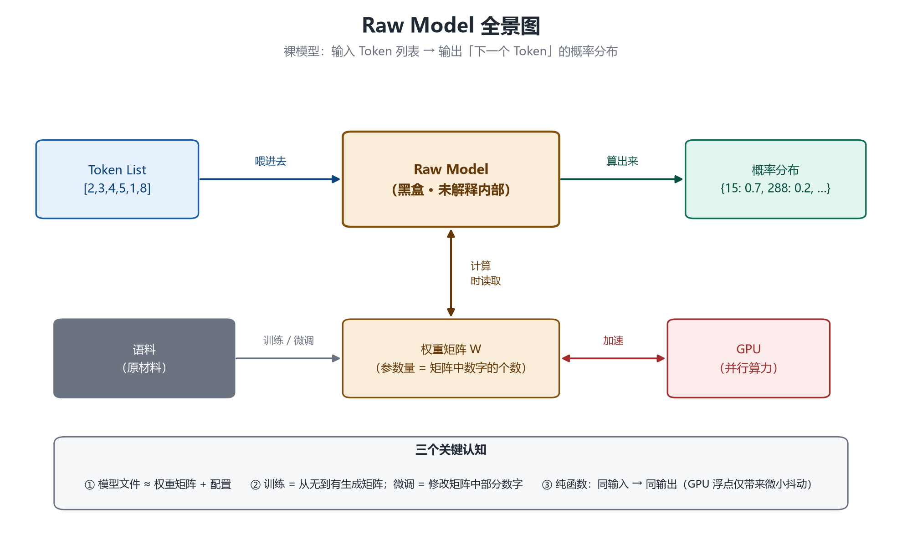
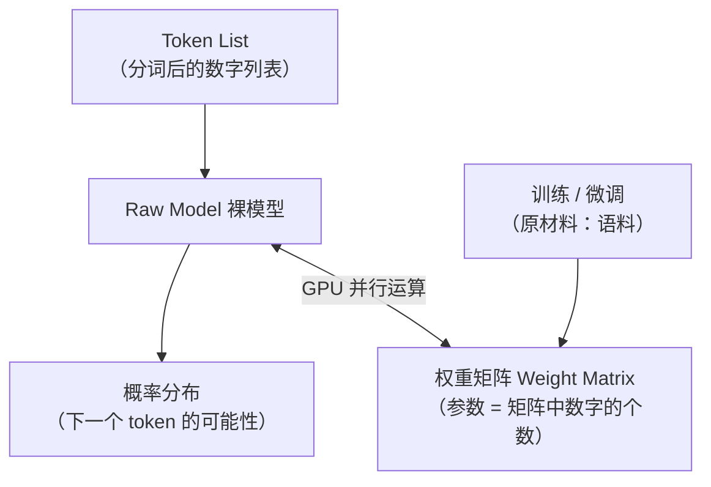

# 第 1 章 裸模型 Raw Model：大模型的最底层真相

## 一、概念

**Raw Model（裸模型，也译作基础模型 / 原始模型）** 是整个 AI 技术体系的最底层。无论上层用什么 AI 技术，最终都落在它上面。

- **一句话定义**：裸模型就是一个**函数**——接收一个 Token（词元）列表，输出下一个 Token 的**概率分布（probability distribution）**。
- **为什么叫"裸"**：它没有任何花哨功能，是被上层（模型服务、AI 应用）包装的基座，能看到 AI 最本质的真相。
- **稳定性**：这套原理与知识体系**长期未变**——往上可追溯到 2017 年 Transformer 架构确立，2022 年底 ChatGPT 发布后成为业界共识，至今没有本质变化。

## 二、原理推导

### 2.1 从文字到数字：分词（Tokenization）

模型的输入不是文字，而是自然语言换算成数字后的结果：

| 语言 | 经验换算 |
|---|---|
| 中文 | 1 个字 ≈ **1.5 个 token**（有的字 1 个、有的 2~3 个，平均 1.5；**视分词器而定**，Qwen / DeepSeek 等中文词表大的模型接近 1 字 ≈ 1 token） |
| 英文 | 1 个单词 ≈ **1.3 个 token**（含词根、前后缀的切分） |

给模型发一条消息 → 先分词 → 形成一串数字（token 列表）→ 传给模型。

### 2.2 模型输出：下一个 token 的概率分布

模型拿到 token 列表后，做一整套数学计算，输出"下一个 token 的可能性"：

```text
输入: [3, 6, 12, 767665, 7878]   （"您好"，示意值，非真实分词结果）
输出: {
    15:  0.7,
    288: 0.2,
    ...
}
```

这就是裸模型的全部——**没有对话、没有情感，只有概率分布**。上层产品（聊天助手等）都是在这上面玩出的花样。

### 2.3 上下文窗口（Context Window）

上下文窗口 = 上面那个 token 列表（数组）的**最大长度**：

| 标称 | token 数 | 约合中文（÷1.5） |
|---|---|---|
| 128K | 12.8 万 | ≈ 8.5 万字 |
| 256K | 25.6 万 | ≈ 17 万字 |
| 1M | 100 万 | ≈ 66 万字 |

> 注意：K/兆 这里指 token 数量，**与磁盘空间无关**。

两个关键特性：
1. **API 层超限直接报错**：超出上下文窗口，服务端返回 400（`maximum context length is X tokens...`）。**应用层（聊天工具）通常会先"丢旧留新"**——把最早的历史消息丢掉再发，所以用户往往感觉不到报错。
2. **能容纳 ≠ 能处理好**：上下文越长模型能力越下降——这就是"AI 聊久了变傻、忘了之前定的规则"的原因。
   - **实践建议**：相对独立的任务**新开上下文窗口**去做；AI 编码工具大量使用子代理（subagent）也是在规避这个问题。

### 2.4 打开黑盒：权重矩阵（Weight Matrix）

模型"函数"内部调用的是**权重矩阵（weight matrix）**：

- **模型文件** = 权重矩阵 + 若干配置文件。本地部署下载的几个 G / 几百 G，主要就是矩阵。
- **参数量 = 矩阵中数字的个数**：7B（B=10 亿）= 70 亿个数字；当前商用大模型已达**万亿级（约 1T 上下）**。
- **训练（training）**：从无到有得到这个矩阵的过程。
- **微调（fine-tuning）**：矩阵已存在，通过二次训练改动其中的部分数字。
- 两者的原材料都是**语料（corpus）**——模型见过的 token 越多，预测越准。编程模型强，正因为开源代码语料庞大。
- **架构匹配**：用 HuggingFace 等库调用模型；用什么架构训练（当前主流 **Transformer**），就用什么架构调用；**换架构通常需要重新训练**，同架构换实现（如各家权重格式互转）只需做格式转换。这套模式属于**神经网络 / 深度学习**技术路线。

### 2.5 本质是纯函数，但 GPU 让它"不那么纯"

- **理论上**：大模型是一个数学函数，甚至是**纯函数（pure function）**——输入不变，输出一定不变。输入 `1+2` 永远得 `3`，只是公式比加法复杂得多。
- **实际上**：参数量太大，必须靠 **GPU 并行运算**，把公式拆解后并行计算。而计算机使用**浮点数（floating point）**，浮点数**不满足结合律**：

```text
(0.1 + 0.2) + 0.3  ≠  0.1 + (0.2 + 0.3)   ← 存在误差差异
```

拆解位置不同 → 结果可能有细微不同。所以"理论纯函数，实际略有抖动"。

### 2.6 多模态（Multimodal）的本质：一切皆数字

模型**不知道**什么叫中文、英文、图片、视频——它的输入输出都是数字数组。所谓多模态，只是：
- 训练时喂了对应模态的 token；
- 输出 token 后，**由人来判断**它落在词表的哪个区间（例如 image file 区间），再转码还原成图像/音频。

对模型而言，音频、视频、图像、文字没有任何区别——**喂什么，就能算什么**。



## 三、白板演示步骤（按讲解顺序还原）

1. **画出黑盒**：白板中央先画一个框，写上 `Raw Model`——先不解释内部。（图见上方全景图）
2. **补全数据流与分词换算**：左侧接 `Token List`、右侧接 `概率分布`；便签写下 `[2,3,4,5,1,8]`、`中文 1 字 = 1.5 token`、`英文 1 单词 = 1.3 token`。
3. **填入概率分布示例**：输入"您好"对应的 token 列表，输出 `{15: 0.7, 288: 0.2, …}`。
4. **打开黑盒：接上权重矩阵**：在 Raw Model 下方用双向箭头连接"权重"框——"我们把它叫做权重矩阵"。
5. **控制台实测浮点误差**：切到浏览器 DevTools，现场输入 `0.1+0.2+0.3` 演示浮点数不满足结合律——结果如下（实测值）：

```js
0.1 + 0.2 + 0.3        // 0.6000000000000001
0.1 + (0.2 + 0.3)      // 0.6
0.1 + 0.2 + 0.3 === 0.1 + (0.2 + 0.3)   // false ← 拆解位置不同，结果不同
```

6. **全图总结**：补上 GPU（双向箭头）与"训练/微调 + 语料 → 权重矩阵"，红框圈出全图收束本章。

## 四、关键结论 / 公式

1. **核心公式**：`Raw Model(token 列表) → 下一个 token 的概率分布`。
2. **参数量 = 权重矩阵中数字的个数**；模型文件 ≈ 权重矩阵 + 配置文件。
3. 上下文窗口换算：`中文字数 ≈ token 数 ÷ 1.5`。
4. 训练与微调的区别：**训练从无到有生成矩阵；微调修改已有矩阵的部分数字**；原材料都是语料。
5. 纯函数性质：相同输入 → 相同输出；GPU 浮点并行使结果存在**微小**抖动，但不改变本质。
6. 多模态本质：**一切皆数字**，模态差异只存在于"人如何解读输出"。

用 Mermaid 还原白板总结图（竖向）：



## 本节要点回顾

- Raw Model（裸模型）= AI 技术体系最底层，本质是 `token 列表 → 概率分布` 的函数。
- 分词经验值：中文 1 字 ≈ 1.5 token，英文 1 词 ≈ 1.3 token。
- 上下文窗口是 token 列表的长度上限；**超限截断不报错**；**装得下 ≠ 处理得好**。
- 模型文件的核心是权重矩阵；**参数量 = 矩阵中数字的个数**（7B = 70 亿）。
- 训练 = 生成矩阵；微调 = 改动矩阵部分数字；原材料都是语料。
- 大模型理论上是纯函数；GPU 并行 + 浮点不满足结合律带来微小差异。
- 多模态对模型而言没有区别——一切皆数字。
- Transformer 架构自 2017 年确立至今无本质变化，变的只是训练方法与语料。
