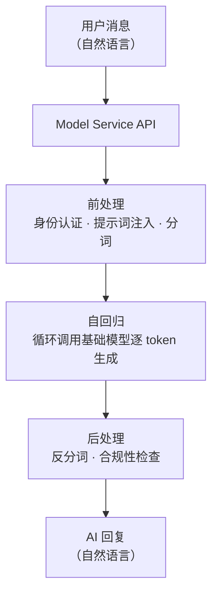
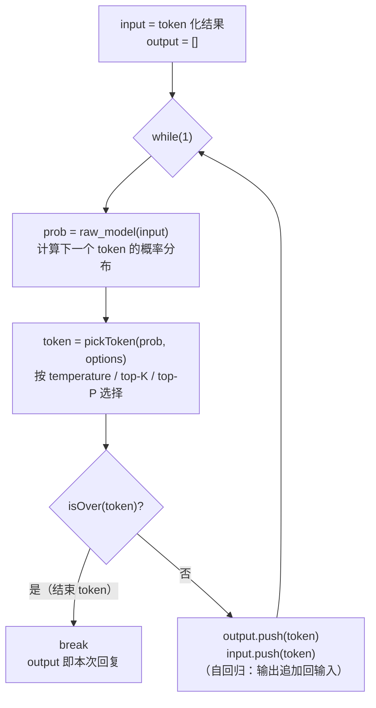

# 第 2 章 模型服务 Model Service：基础模型之上玩出的花样

## 一、概念

**Model Service（模型服务）** 是基础模型的上一层：模型服务商在 Raw Model 基础上做的**二次封装**，以 **API 接口**形式对外发布。

- **一句话定义**：用户传入一段自然语言消息 → 经过模型服务的处理 → 得到一段自然语言回复。这就是模型服务的核心能力。
- 服务商除核心能力外还会附带大量周边功能（文件上传、Skill 创建、tool 调用等）——这些**变动快、非核心**，需要时查官网文档即可。

> **学习方法论**：接口变化非常快，不同厂商能做的事也不一样。学东西**抓核心、放细节**——只看各家服务的"交集"（100% 都会做的事），细枝末节用到时再查文档。

## 二、原理推导

### 2.1 接口规格：事实上的三大类

目前没有权威机构统一接口规格，形成的是**事实标准（de facto standard）**：

| 接口规格                  | 地位   | 说明                                             |
| --------------------- | ---- | ---------------------------------------------- |
| **OpenAI 格式**         | 事实标准 | 模型能力虽已不是第一，但历史地位决定多数国内外大模型（含国内厂商）都按它的 API 格式发布 |
| **Anthropic（Claude）** | 独立规格 | 自有接口格式                                         |
| **Google Gemini**     | 独立规格 | 自有接口格式                                         |

**实操要点**：对接新模型时，先看官网文档声明兼容哪种规格——

- 兼容 OpenAI → 直接用 OpenAI 的请求格式 / SDK；
- 部分厂商甚至**同时兼容多家**（课程案例：KIMI 既兼容 OpenAI 格式，又提供另一个 base\_url 兼容 Anthropic 格式）。

### 2.2 两种调用方式

1. **原生 HTTP 请求**：需要看得懂**请求行 / 请求头 / 请求体**与**响应行 / 响应头 / 响应体**。老师强调：网络层面是基础中的基础，看不懂先补网络课程，不用谈 AI。
2. **SDK（Software Development Kit，软件开发工具包）**：如 OpenAI SDK，把网络请求封装好——只需创建 Client、填入 **API Key**（用于计费鉴权）、**base\_url**（基地址）、**model**（模型名）。
   - **换厂商三步**：换基地址 → 换 API Key → 换模型名，请求路径/请求头/请求体完全一样。

### 2.3 计费：为什么输出的 token 更贵

| 项目 | 定价示例（OpenAI 官网，**课程录制时价格，实际请以官网实时报价为准**） |
| -- | ---------------------------------------- |
| 输入 | **\$2.5 / 百万 token**                     |
| 输出 | **\$15 / 百万 token**                      |

普遍规律：**输入 token 便宜，输出 token 贵**（国内更便宜，也有包月制——限时限量、超限降级或排队）。原因藏在"自回归"的实现里，见 2.4.2。

#### 2.3.1 缓存命中：输入的"第二栏价格"

> ⚠️ 本小节为**课程外补充**（课程未涉及），与发布稿《大模型三层架构拆解》的 §4.4 同源，**两侧对同一事实的表述必须一致**。

打开任意一家厂商的价目表，输入 token 往往不是一栏，而是**两栏**：

| 计费项 | 相对标准输入价 | 说明 |
| -- | -- | -- |
| 输入 · **未命中**（cache miss） | **1×** | 按标准输入价计费 |
| 输入 · **命中**（cache hit） | **0.1×** | 约等于打一折，省 90% |
| 输入 · **缓存写入**（cache write） | **1.25×** | 首次把这段内容存进缓存时的一次性加价 |

倍率取自 Anthropic 与 OpenAI 官方文档的当前口径（两家一致）；更早的模型可能不收写入费，各家最小长度门槛也不同，**以官网实时报价为准**。

- **机制**：服务端收到请求后，要先对输入整段做一次 prefill（前向计算），过程中产生每层注意力的 Key / Value。这批中间结果**只取决于输入内容本身**，与要输出什么无关。所以下次请求的开头若仍是同一段 token，直接取用即可、不必重算——这就是**前缀缓存（prefix caching）**，取用成功即**缓存命中**，取不到即**缓存未命中**。
- **为什么便宜**：命中意味着这段 token 的 prefill 计算根本没发生，省下的算力以折扣形式返还。折扣只出现在**输入**这一栏——输出是逐 token 串行生成的，没有"重复"可省。
- **命中条件**：前缀必须**逐 token 完全一致**，从第一个 token 起一个字符都不能差；第 N 个 token 变了，其后缓存全部作废。所以工程写法是**静态内容在前（系统提示词、工具定义、参考资料）、动态内容在后（用户问题、时间戳）**。
- **与 KV Cache 的区别**：底层同为复用 Key / Value，差别在作用域——KV Cache 在**一次请求内部**（省重复计算），缓存命中**跨请求**（省重复计算 + 计费打折）。
- **两个推论**：① 长会话不是线性变贵——稳定的前缀从第二次请求起按 0.1× 计费；② 缓存有寿命（常见几分钟到几十分钟，被复用时免费续期），隔太久的第一句话要全价重算 + 按 1.25× 重新写入。
- **怎么验证**：响应的 `usage` 字段单独列出缓存 token 数（OpenAI 是 `cached_tokens`，Anthropic 是 `cache_read_input_tokens` / `cache_creation_input_tokens`）；一直是 0 说明前缀没稳定过。

### 2.4 内部三步：前处理 → 自回归 → 后处理

用户消息进入模型服务后，大致分三步得到结果。

#### 2.4.1 前处理（Pre-processing）

一定会有的事：

1. **身份与权限认证**：验证 API Key 的有效性、余额、有无权限调用该模型。
2. **系统提示词注入（system prompt injection，指服务商把系统提示词拼进请求）**：
   - 用户消息**不会直接**传给大模型，而是先追加一段系统提示词（system prompt）。
   - 课程案例：注入"你是 XX 大模型，版本是 XX""当用户询问你是什么模型时，你要怎么回答"——这就是为什么问不同厂商的模型"你是什么模型"，答案五花八门。
   - **提示词的本质**：它不是模型层的概念，是**模型服务商层面的概念**。对基础模型而言，系统提示词、用户提示词、用户问题统统被转成**同一个 token 数组**，没有任何区别；"提示词"只是我们在含义上的分类。系统提示词与用户提示词冲突时：一般性内容听用户的，重要规则听系统的（训练数据与后训练对齐让模型对 system / user 这类 role 标记形成偏好）。
   - ⚠️ **术语辨析**：本节说的是"服务商往请求里**注入系统提示词**"。安全领域常说的 **prompt injection（提示词注入攻击）** 恰恰相反——指**用户在自己的输入里夹带恶意指令去劫持模型**。两者同名但方向相反，不要混淆。
3. **分词（tokenization）**：把所有自然语言转成 token 列表，准备传给模型。

#### 2.4.2 自回归（Auto-regression）

老师用一段伪代码讲透（这正是本章最重要的一张白板）：

```javascript
const input  = [...,...];   // 之前 token 化的结果（含提示词 + 用户消息）
const output = [];
while(1){
  const prob  = raw_model(input);           // 根据输入计算下一个 token 的概率分布
  const token = pickToken(prob, options);   // 按配置从概率分布中挑一个 token
  if(isOver(token)){
    break;                                  // 是结束 token 就终止
  }
  output.push(token);                       // 加入输出
  input.push(token);                        // 同时追加回输入 → 下一轮
}
```

- **"自回归"的含义**：模型的输出不断追加回输入，再喂给模型拿下一个 token，循环直到出现结束 token（结束符由各家模型自定义）。
- **输出为什么更贵**：输出 1000 个 token = 调用模型 1000 次，且**每生成一个新 token 都要把"原始输入 + 已生成输出"整段走一次前向传播**——而输入是一次性并行处理完的。这就是输出 token 定价更高的原因。
- **技术补充（KV Cache）**：工程上会把前面已算好的注意力 Key/Value 缓存复用（**KV Cache**），并不会每步从零重算全部上下文；但每生成一个 token 仍要再走一次网络，且上下文越长注意力计算越贵、缓存占用显存越大——成本依然随输出长度上升。

**KV Cache 展开：`raw_model` 里面发生了什么**

上面那段伪代码里看不见 KV Cache，因为它藏在 `raw_model` 内部。把它打开一层，里面其实是两件事：

```javascript
function raw_model(input) {
  const kv   = computeKV(input);   // ① 为 input 里的每个 token 算出 Key / Value
  const prob = attention(kv);      // ② 用这批 KV 算出下一个 token 的概率分布
  return prob;
}
```

**KV Cache 改的就是 ① 这一步。** 主循环一个字不动，只换 `raw_model` 的实现：

```javascript
// ── 朴素实现：每轮把 input 全部重算 ────────────────
function raw_model(input) {
  const kv = computeKV(input);     // 整个 input 都算一遍
  return attention(kv);
}
```

```javascript
// ── 带 KV Cache：只算新增的那几个 ──────────────────
const kvCache = [];    // ★ 跨调用保留：已经算过的 Key / Value
let computed  = 0;     // ★ 跨调用保留：已经算到第几个 token

function raw_model(input) {
  const fresh = input.slice(computed);    // ★ 只取「还没算过」的 token
  kvCache.push(...computeKV(fresh));      // ★ 只算这几个，追加进池子
  computed = input.length;                // ★ 游标跟上

  return attention(kvCache);              // 用的仍是「全部 token 的 KV」
}
```

**两版唯一的差别**是 `computeKV` 的入参：前者传整个 `input`，后者只传 `fresh`。而 `attention` 拿到的 KV 集合**完全相同**——所以结果一模一样，只是有一部分不再重复计算。

逐轮跑一遍（第 1 轮 `kvCache` 是空的，只能全算）：

| 轮次 | `input` | 这一轮真算的 | `kvCache` 累计 |
| -- | -- | -- | -- |
| 第 1 轮 | `[t1, t2, t3]` | `[t1, t2, t3]` ← 整个 prompt | 3 个 |
| 第 2 轮 | `[t1, t2, t3, A]` | `[A]` | 4 个 |
| 第 3 轮 | `[t1, t2, t3, A, B]` | `[B]` | 5 个 |

三个容易忽略的点：

1. **`kvCache` 与 `computed` 必须定义在函数外面**——它们要跨调用活下来，这正是"复用"能成立的前提。
2. **第 1 轮是特例**：`fresh` 是整个 prompt（可能几千个 token），而且是**并行**算的；从第 2 轮起 `fresh` 永远只有 1 个，只能**串行**算。这个分界就是 prefill 与 decode，也是"输入便宜、输出贵"的根源。
3. **它不在别的步骤里**：前处理（认证 / 注入 / 分词）还没进模型，后处理（反分词 / 合规）已经出模型，都碰不到 Key / Value。KV Cache 只可能发生在自回归这个循环内部。

> ⚠️ **真实实现不是数组**：上面是为讲清逻辑而简化的写法。真实实现里，KV Cache 是一块按「层 × 注意力头」组织的显存，用长度游标索引，`fresh` 也不会真的做切片。但**逻辑就是那三行**。

**和 2.3.1 的关系**：2.3.1 讲的**前缀缓存**复用的是**上一次请求**（prefill 阶段）算好的 KV，作用域是**跨请求**；这里的 KV Cache 复用**同一次请求内前几轮**算好的 KV，作用域是**一次请求内**。两者底层是同一件事——复用 Key / Value，差别只在"复用范围到哪为止"。

#### 2.4.3 后处理（Post-processing）

一定会有的事：

1. **反分词（detokenization）**：把 token 序列还原成自然语言（总不能给用户看数字）。
2. **合规性检查**：国内外都有（严格程度不同），检查不过就加提示词重新生成，总之不能把不合适的内容给到用户。

### 2.5 采样三参数：temperature / top-K / top-P

这些配置由**用户调用 API 时传入**，决定"如何从概率分布中挑出下一个 token"：

| 参数                              | 机制                                                                              | 取值建议                                                             |
| ------------------------------- | ------------------------------------------------------------------------------- | ---------------------------------------------------------------- |
| **temperature（温度）**             | 控制选择的**随机性**：0 = 完全确定（取概率最大者）；2 = 分布被大幅拉平（低概率 token 也有较大机会被选中；真正的"完全随机"要温度趋于无穷） | 代码/科研：**0\~0.2**（错了可用提示词纠偏重试）；普通问答：**0.7 左右**（共识值）；创意写作：**1 以上** |
| **top-K**                       | 按概率**从高到低排序取前 K 个**，候选集外绝对不出现；再用 temperature 在候选内随机选                            | 视需求定 K 值                                                         |
| **top-P（核采样，nucleus sampling）** | 按概率**从高到低累加到 P 为止**截断候选集。例：P=0.8，候选概率 0.3+0.25+0.2+0.15=0.9 ≥ 0.8 → 取前 4 个      | OpenAI 接口目前只保留了 top-P                                            |

几个重要认知：

- **模型本身理论上没有随机性**（第 1 章的纯函数结论）——AI 的"随机性"来自 temperature 采样（以及 GPU 浮点运算的微小抖动）。
- **不要图省事把 temperature 恒置 0**：确定是确定了，但可能"确定地错"、一错到底甚至死循环。留一点随机性 + 提示词纠偏更实用。
- top-K 与 top-P 作用类似（先截断候选集），细节有别；两者常与 temperature 配合使用：**先截断、再随机**。

## 三、白板演示步骤（按讲解顺序还原）

1. **画出核心流程图**：白板上方画 `Model Service API` 大框，内含 `前处理 → 自回归 → 后处理` 三个子框；左侧接"用户消息（自然语言）"，右侧接"AI 回复（自然语言）"。（流程图见下方 Mermaid）
2. **切到 IDE 写自回归伪代码**：新建 index.js，逐行写出 while 循环——`raw_model(input)` 算概率分布、`pickToken(prob, options)` 挑 token、`isOver` 判终止、`output.push` 与 `input.push` 双追加。（伪代码见下方代码块）
3. **用伪代码反推计费逻辑**：指着循环讲解"输出 N 个 token = 调用模型 N 次（每生成一个 token 都要再走一次完整前向；已算好的 Key/Value 由 KV Cache 复用，无需从零重算）"——输出贵的原因不言自明。
4. **查 OpenAI 文档讲采样参数**：现场搜 temperature（0–2）、top-P 等字段，结合白板上的概率分布讲 temperature=0 时"直接取概率最大"的行为。

**自回归伪代码骨架**：

```js
while (true) {
  const prob = raw_model(input);            // ① 基础模型算概率分布
  const token = pickToken(prob, options);   // ② 按 temperature / topK / topP 采样
  if (isOver(token)) break;                 // ③ 终止判断
  output.push(token);                       // ④ 追加到输出
  input.push(token);                        // ⑤ 追加回输入（下一轮再走一次前向，KV Cache 复用）
}
```

## 四、关键结论 / 公式

1. 模型服务 = 基础模型的二次封装，核心流程：**前处理 → 自回归 → 后处理**。
2. 接口规格认准**事实标准 OpenAI 格式**；换厂商 = 换 base\_url + API Key + model。
3. **输出 token 比输入贵**的根源：自回归循环中，每生成一个 token 都要再走一次完整前向传播（KV Cache 复用已算好的 Key/Value，无需从零重算，但上下文越长注意力计算越贵）。
4. 自回归伪代码骨架：`while(1){ prob = raw_model(input); token = pickToken(prob); if(isOver) break; output.push; input.push; }`。
5. 提示词是**服务商层概念**；对基础模型而言系统提示词/用户消息/用户提示词都是同一个 token 数组。
6. 采样三参数：**temperature 管随机性，top-K / top-P 管候选截断**；模型理论无随机性，随机性来自采样配置。

用 Mermaid 还原核心流程（竖向）：



自回归循环（竖向）：



## 本节要点回顾

- Model Service = 基础模型的二次封装，以 API 对外发布；核心 = 自然语言进、自然语言出。
- 接口三大规格：OpenAI（事实标准）、Anthropic、Gemini；对接前先查文档看兼容哪种。
- 调用方式两种：原生 HTTP（要懂报文结构）与 SDK（配 base\_url / API Key / model 即可换厂商）。
- 计费按 token：输入便宜、输出贵——根源在自回归"每生成一个 token 就要再走一次完整前向"（KV Cache 复用中间结果，但不减少调用次数）。
- 缓存命中：前缀逐 token 一致则复用已算的 Key / Value，输入按 **0.1×** 计费（省 90%）、首次写入 **1.25×**；**静态内容在前、动态内容在后**是命中的前提（见 2.3.1）。
- **KV Cache 不是独立步骤**：它是 `raw_model` 的内部实现，让自回归每轮只对新增的那 1 个 token 做计算；前处理与后处理都碰不到 Key / Value（见 2.4.2 的代码展开）。
- 前处理三件事：身份认证、提示词注入、分词；提示词是服务商层概念，对模型都是 token。
- 自回归 = 输出不断追加回输入的循环，直到结束 token。
- 后处理两件事：反分词（token → 自然语言）、合规性检查。
- temperature 管随机性（0 = 取最大概率；2 = 分布大幅拉平；真正的完全随机需温度趋于无穷），top-K 取前 K 个，top-P 按累计概率截断；先截断、再随机。
- 学接口抓核心（各家交集），细枝末节用时再查——接口一定会变，核心不会。

