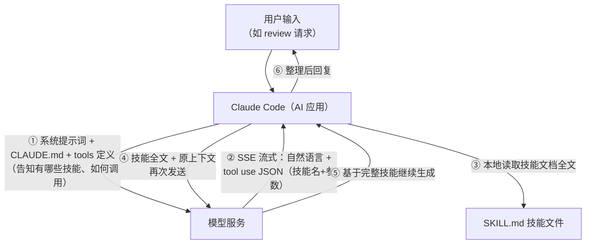

# 第 3 章 AI 应用层与概念分析方法论：抓核心、放细节

## 一、概念

**AI Application（AI 应用）** 是第三层：**封装模型服务**（正如模型服务封装基础模型，每一层封装下一层）。

- **应用层玩两件事**：
  1. **应用开发**：调用模型服务商的接口，做一个有价值的 AI 工具（如 AI 编程工具）；
  2. **工具使用**：不写代码，用现成 AI 效能工具提升效率（本课后续主角是 AI 编程工具）。
- 需要认识的概念：**tools（工具）**、**MCP（Model Context Protocol，模型上下文协议）**、**RAG（Retrieval-Augmented Generation，检索增强生成）**、\*\*Skills（技能）\*\*等；
- 应用开发常见框架：**LangChain**、**LangGraph**、Deep Agents 等。

> ⚠️ **两层界限其实不清晰**：很多概念会"流动"——**Skills / MCP / Tools** 这类能力会在应用层与服务层之间来回迁移——既可能由服务商在接口里内置，也可能由应用自己实现。分工逻辑很简单：**服务商做了你就不用做，服务商没做你就必须做——总有一方要做**。

## 二、原理推导

### 2.1 稳定性规律：越底层越稳定，越上层越不稳定

| 层            | 稳定性      | 说明                                                         |
| ------------ | -------- | ---------------------------------------------------------- |
| 基础模型          | **非常稳定** | 调用方式（token 列表 → 概率分布）自 Transformer 以来未变；训练方式、性能、参数会变，但接口不变 |
| 模型服务 / AI 应用 | **最不稳定** | 自媒体天天"上蹿下跳"大呼小叫的，就是对这两层的变动                                 |

这符合技术领域的一般规律——**越底层越稳定，越上层越不稳定**。所以学技术要先扎稳底层认知，上层变动才不慌。

### 2.2 为什么现在几乎没人玩微调（fine-tuning）

微调的本质是改动权重矩阵的部分参数，但**从成本上算不过来**：

1. 过去做法：基于 GPT-3.5 的权重矩阵微调，注入公司内部知识——训练本身花不了多少时间，**麻烦在验证**（验证微调结果是否符合预期），动辄两三个月，搞不好更久；
2. 致命问题：好不容易微调完，**GPT-4 发布了**——不微调、只写提示词，上下文更大、识别更准、幻觉更少，效果比微调结果还好；
3. 结论：人力成本巨大，成果却被基础模型迭代碾压。**除极少数极端场景外，现在没人玩微调**；要玩就玩上面两层。

> 注：这是课程的判断，针对的是"**全量微调 + 两三个月验证**"这套传统玩法。业界仍在使用 **LoRA / PEFT** 这类低成本的参数高效微调（格式对齐、垂直领域适配等），只是它已不是首选方案。知识蒸馏（knowledge distillation）严格说不是微调，属另一类技术。

### 2.3 全课核心方法论：基础模型之上，只能玩两件事

> **论点：在基础模型基础上折腾的所有东西（模型服务 + AI 应用），只能玩两个东西——
> ① 给模型输入什么；② 如何处理模型的输出。**

这是由模型本质（输入 → 数学运算 → 输出）决定的，玩不出第三件事：

| 层     | ① 输入什么                | ② 如何处理输出            |
| ----- | --------------------- | ------------------- |
| 模型服务  | 前处理：提示词注入、分词          | 后处理：反分词、合规检查        |
| AI 应用 | 决定给模型发什么消息（甚至会自动追加消息） | 拿到结果做后续处理（甚至再发起新请求） |

- 这个模式与 **HTTP 请求/响应**、操作系统调用等一脉相承：规定"我发什么、你回什么"。
- 自媒体永远不告诉你：新概念玩来玩去就这么简单。

**由此得到分析任何 AI 新概念的万能方法**：只看三件事——
**它给模型传了什么？模型吐出来什么？它接下来又是怎么处理的？**

### 2.4 实战：用代理服务器拆解 Claude Code 的 Skill 机制

课程用 Skill（技能）做完整示范，方法：**在 AI 应用与模型服务之间加一层代理服务器（proxy server）**，让 Claude Code 把消息发给代理、代理转发给模型服务并记录全部请求/响应日志——即可看清所有消息传递。

**实战步骤**：

1. 准备代理服务器（仅实现"接收 → 转发 → 记录日志"）；配置 `.env`：端口 + 转发目标地址；
2. 让 AI 编程工具走代理：几乎所有 AI 开发工具都支持配置请求地址（课程用 cc-switch 配置 Claude Code → 代理 → KIMI 模型）；
3. 抓取并分析请求/响应日志。

**三个关键发现**：

1. **用户不说话，AI 应用也在自动给模型发消息**：请求体里有 tools 定义（Skill 等工具）、工程里的 **CLAUDE.md** 文件内容（每次发消息都会带上）、以及 **system reminder（系统提醒）**——告诉模型当前有哪些技能可用、每个技能的描述与使用时机。
2. **Skill 就是提示词**：tools 数组里 Skill 工具的 description 明确告诉模型——什么是技能、何时该用（用户输入斜杠命令 `/xxx` 即指技能）、调用时要返回什么 JSON 格式。如此简单，毫无神秘。

   **注**：此处原有「tools 里 Skill 的定义」抓包截图，因原始抓包目录 `2026-09-07 12-15-43_doc/` 不在仓库中，配图已缺失。
3. **技能调用的完整流程**（见下方流程图）：
   - 用户输入触发（如 review 请求）→ 模型已知技能清单 → 决定调用技能；
   - 模型响应为 **SSE（Server-Sent Events，服务器单向流式传输）**：先流式输出自然语言（"我将使用 web-design-guidelines 技能"），再输出 **tool use JSON**（工具名 + 技能名 + 参数）；
   - Claude Code 拿到 JSON → **在本地读取技能文档全文**（SKILL.md）→ 把技能全文连同原上下文**再传给模型** → 模型基于完整技能内容继续处理 → 结果经 Claude Code 返回用户。
   **注**：此处原有「SSE 流式输出」抓包截图，因原始抓包目录不在仓库中，配图已缺失。

> **再次强调**：这节课讲的不是 Skill 本身，而是**分析方法**。以后遇到任何新概念（哪怕今天火的工具等你看视频时已经消失），都用"输入什么 / 输出什么 / 如何处理"三问拆解，几分钟搞清楚。

## 三、白板 / 演示步骤（按讲解顺序还原）

1. **画出三层封装关系**：模型服务封装基础模型；AI 应用封装模型服务；以 Skills 概念"从应用层流进服务层"说明两层界限模糊。
2. **算微调的成本账**：白板推演"改参数 → 验证 2-3 个月 → 基础模型发布 → 全部白干"。
3. **写出核心论点**："只能玩两个东西：输入什么给模型 / 如何处理模型的输出"，对照模型服务的"前处理/后处理"验证。
4. **搭代理服务器**：现场让 AI 写一个转发+记日志的代理，配置 Claude Code 走代理。（抓包证据见 2.4 发现 2）
5. **触发技能调用并抓包**：发送 review 请求，观察 SSE 流式响应与 tool use JSON。（抓包证据见 2.4 发现 3）
6. **还原完整调用链**：白板串起"用户 → Claude Code → 模型 → 读技能全文 → 再传模型 → 回复用户"。

## 四、关键结论 / 公式

1. **三层封装链**：基础模型 ← 模型服务 ← AI 应用；越底层越稳定，越上层越不稳定。
2. **微调式微**：训练便宜、验证昂贵，且成果被基础模型迭代碾压——除极端场景外不做微调。
3. **万能分析法**：任何 AI 新概念 = 分析「给模型输入什么 / 模型输出什么 / 如何处理输出」。
4. **Skill = 提示词 + 本地文件读取**：系统提示词告知技能清单与调用格式；模型按格式返回 tool use JSON；AI 应用读取技能全文再传给模型。
5. 概念会在层间流动（Skills/MCP/Tools 被服务商吸收）——**总有一方要做，你只需知道自己这层做不做**。

用 Mermaid 还原 Skill 调用完整链路（竖向）：

## 本节要点回顾

- AI Application = 封装模型服务，分「应用开发」与「工具使用」两个玩法。
- 概念会在层间流动（Skills/MCP/Tools 被服务商吸收进服务层）——总有一方要做。
- **越底层越稳定**：基础模型的调用方式（token 列表 → 概率分布）自 Transformer 以来未变；上层变动快不必焦虑。
- 微调没人玩的原因：验证贵 + 基础模型迭代碾压；玩就玩上两层。
- **核心方法论**：基础模型之上只能玩「输入什么 / 如何处理输出」两件事；新概念用三问拆解。
- 代理服务器是透视 AI 应用的利器：记录请求/响应，一切"魔法"看得见。
- **Skill = 提示词 + 本地文件读取**；调用链 = 系统提示词告知 → 模型返回 JSON → 应用读全文 → 再传模型。
- 抓核心、放细节——避免陷入知识的海洋。

