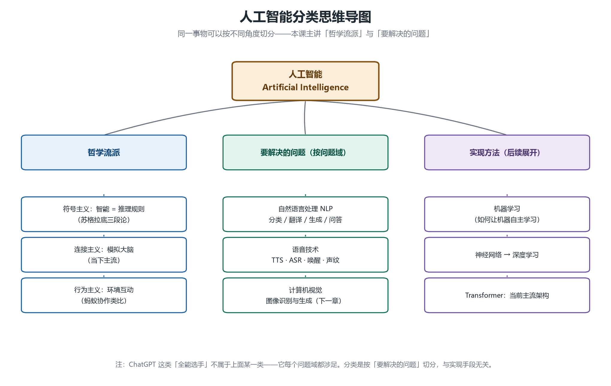
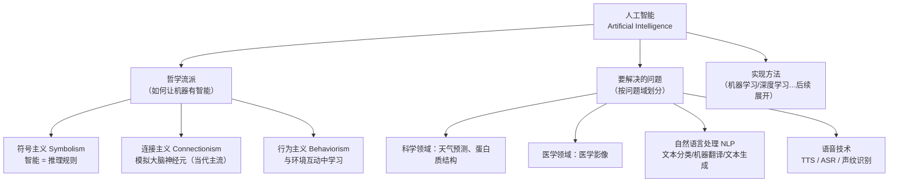

# 第 4 章 概念辨析与智能本质：AI 的分类

## 一、概念

本章进入 AI 技术认知的"概念梳理"部分。老师先说明**为什么要在编程课里讲概念**：

1. **交流需要**：面试或与同行交流时，别人蹦概念不至于懵——这些概念不懂**完全不影响**开发，但影响交流；
2. **听课需要**：后续讲课难免引用概念，知道老师在说什么即可。

**目标设定**：以"易懂"为目标，不写学术论文；讲的概念 99% 无偏差，偶尔一点点小偏差也不影响学习、工作、面试。

## 二、原理推导

### 2.1 工科思维 vs 理科思维：虚 ≠ 没意义

- 工科思维信条：**Talk is cheap, show me the code**（能谈的廉价，放码过来）——一切要落地、要能运行；
- 但这不是唯一的思维：初高中做题全是抽象推理，没有"落地"一说，那也是正经理科思维；
- **思想实验**（假设世界从来没有 AI，老板要求你实现"输入一句话自动生成视频"）：

```text
怎么让计算机自动产生视频？
  └─ 视频就是一帧帧画面 → 问题转化为：如何生成图像？
      └─ 图像要根据用户输入生成 → 如何理解用户的话？
          └─ 要理解用户的话 → 如何让计算机理解语言？
              └─ 如何理解语言 → 如何让计算机有智能？
                  └─ 什么是智能？ → 进入哲学领域（哲学都只能讨论、无法回答）
```

关键洞察：

- 这条追问链上**没有任何一行代码，全是思想、方法、模式**；
- **思想是有抽象层级（abstraction level）的**——必须搞清楚上一层问题，才能搞定下一层问题；
- 学术界探讨这些"虚"的东西，恰恰因为它们是根本问题——根本问题解决了，**什么都能做**；
- 甚至"计算机"都可以换成任何机器——这个层级的问题里没有机器，只有思想。

### 2.2 什么是人工智能？——靠共识

| 词  | 解释                    |
| -- | --------------------- |
| 人工 | 人造物、人造出来的（好理解）        |
| 智能 | **哲学家都答不清**的问题，没有清晰定义 |

结论：**人工智能的定义完全靠共识**——

- 现在的文生视频、AI 聊天、GPT 实时语音通话（会接话、会思考），表现得像人 → 大家有共识 → 叫智能 → 人造的 → 人工智能；
- **共识会随时间漂移**：
  - 二十年前 3A 游戏里会起床、工作、吃饭、睡觉、打架的 NPC，曾被认为很智能；现在觉得稀松平常；
  - 给十万个数字排序，放在过去算智能，现在只是平常事；
  - 自动泊车算不算？开始有争议了；
- 网上各种博主给 AI 下的定义没有意义——**广大人民群众说它智能，它就智能**。不必纠结定义。

### 2.3 三大哲学流派：如何让机器有智能

上世纪四五十年代（计算机刚诞生不久）就在讨论"如何让机器有智能"，形成三大学术流派（纯思想探讨，当时不可能落地）：

| 流派                      | 核心思想                                                                      | 经典例子    | 现实延伸                        |
| ----------------------- | ------------------------------------------------------------------------- | ------- | --------------------------- |
| **符号主义（Symbolism）**     | 智能 = **推理规则**。人类在世界中学习了大量逻辑规则（例：人固有一死，苏格拉底是人 → 苏格拉底会死），把这些逻辑规则告诉计算机，它就有智能 | 逻辑推理    | 游戏 NPC、迷宫寻路小车（规则 + 算法 + 逻辑） |
| **连接主义（Connectionism）** | 世界规则太复杂，逻辑理不清——那就**把机器造得像大脑**。大脑里有很多神经元互相连接，就在机器里模拟这个结构。提出者中不乏神经科学家       | 模拟大脑神经元 | **现在的神经网络就是连接主义的时代**        |
| **行为主义（Behaviorism）**   | 光有大脑不够，**智能来自与环境的互动**。蚂蚁没有大脑皮层，却能分工协作——靠探索环境、获得反馈、慢慢学习                    | 蚂蚁的群体智能 | 强化学习的思想源头                   |

**现代 AI 属于哪派？——都有，且并不互斥**：

- Transformer 这类架构里，模型结构是连接主义，推理环节可能有符号主义的影子，训练反馈是行为主义；
- 各流派可以**交融**；
- 实际工作中**没有人讨论**产品属于哪个主义（老师戏称只剩"KPI 主义"）——纯学术了解即可。

### 2.4 AI 的分类：角度不同，分法不同

分类角度本身就是多样的（类比人可以按性别/年龄/职业/道德分类）。本课程介绍两种主流分类：

**分类一：哲学流派**（见 2.3）。

**分类二：按要解决的问题划分**（它不管你用什么方法实现——同一个问题可以用不同 AI 能力解决）：

| 问题域                                          | 说明                                              | 具体任务举例                                                                              |
| -------------------------------------------- | ----------------------------------------------- | ----------------------------------------------------------------------------------- |
| **科学领域**                                     | 用 AI 解决科学问题                                     | 天气预测、蛋白质分子结构预测                                                                      |
| **医学领域**                                     | 医学相关 AI                                         | 医学影像分析                                                                              |
| **自然语言处理（NLP, Natural Language Processing）** | 让机器**拥有理解语言的能力**；研究语言本身的特点（词与真实世界的关系），不管用什么手段实现 | 文本分类（垃圾信息识别）、机器翻译（中英互译）、文本生成（写文章/邮件）、问答系统                                           |
| **语音技术**                                     | 研究语音的特点与特性                                      | **TTS**（Text To Speech，文字转语音）、**ASR**（Automatic Speech Recognition，语音转文字）、语音唤醒、声纹识别 |
| **计算机视觉**（下一章展开）                             | 图像/视频相关                                         | 图像识别、生成                                                                             |

> 注意：ChatGPT 这类全能选手不属于上面某一类——它每个问题域都涉足。分类是"按要解决的问题"切分的，与实现手段无关。

## 三、白板演示步骤（按讲解顺序还原）



1. **画出中心主题**：白板中央一个黑框——「人工智能 Artificial Intelligence」。（图见上方）
2. **拉出三个分支**：哲学流派、要解决的问题、实现方法——说明"分类角度是多样的，本课讲前两个，实现方法（机器学习/深度学习等）后续展开"。
3. **逐流派展开**：结合苏格拉底三段论讲符号主义，类比蚂蚁协作讲行为主义，点明"现在是连接主义的时代"。
4. **列问题域清单**：科学领域、医学、NLP、语音技术，各举其典型任务（不涉及实现）。

## 四、关键结论 / 公式

1. 思想有**抽象层级**：顶层的"什么是智能"没有代码，但不解决它，下面全做不了。
2. **人工智能没有权威定义，靠共识**；共识随时代漂移（NPC、数字排序的例子）。
3. 三大哲学流派一句话版：**符号主义 = 推理规则；连接主义 = 模拟大脑；行为主义 = 环境互动**；现代 AI 是三者的交融。
4. 分类角度多样：主流是「哲学流派」与「要解决的问题」两种；NLP 研究语言本身，语音技术研究声音特性——它们**不管用什么手段实现**。

用 Mermaid 还原白板思维导图（竖向）：



## 本节要点回顾

- 学概念的目的：交流无障碍、不被新概念吓到——不写论文，易懂优先。
- 工科思维（show me the code）不是唯一思维；**思想有抽象层级**，顶层问题没有代码但必须先想清楚。
- **"智能"没有定义，只有共识**，且共识随时代漂移。
- 三大流派：**符号主义（规则）、连接主义（大脑）、行为主义（环境）**；现代 AI 三者交融，无需纠结归属。
- 分类角度决定分类结果；「按问题域」分类时，NLP/语音技术等**只关心问题本身，不关心实现手段**。
- ChatGPT 类全能模型不属于某一问题域——它哪类都沾。

