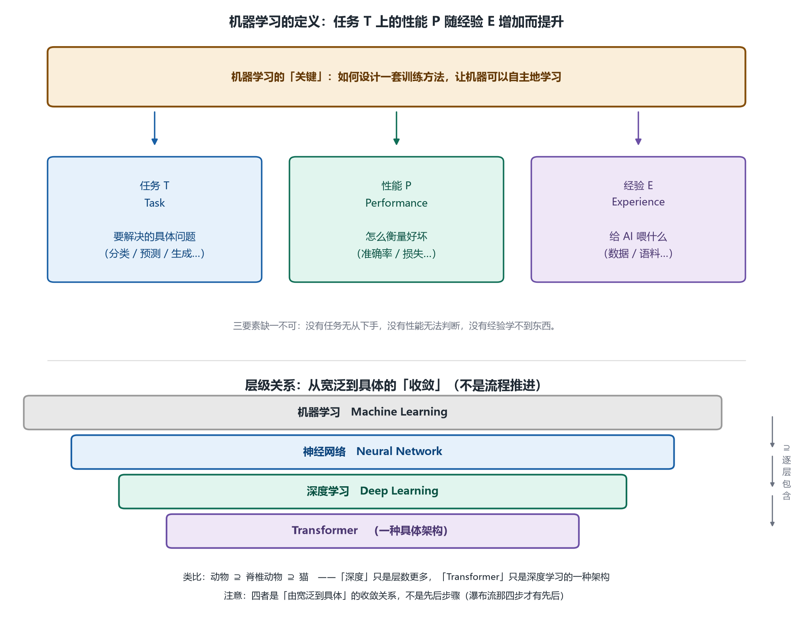
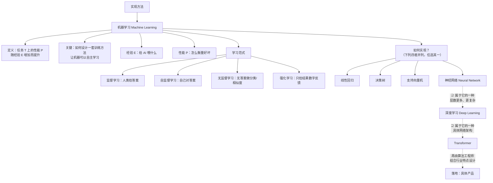

# 第 5 章 AI 应用全景与机器学习：从问题域到落地范式

## 一、概念

本章接续第 4 章的分类框架，讲两块内容：**计算机视觉等其余问题域**，以及目前实现智能的主流方法——**机器学习（Machine Learning, ML）**，包括它的定义与四大学习范式，并理清 **机器学习 ⊇ 神经网络 ⊇ 深度学习 ⊇ Transformer** 的**包含关系**（四者是"大小包含"，不是"前后推进"，详见 2.5）。

## 二、原理推导

### 2.1 计算机视觉（Computer Vision, CV）问题域

| 任务 | 说明 | 例子 |
|---|---|---|
| **图像分类** | 判断图像内容 | 猫还是狗 |
| **目标检测** | 定位并识别画面中的对象 | 摄像头统计商场人流量、进出人数、年龄段分布 |
| **语义分割（semantic segmentation）** | 把每个像素归类——把人物的像素全部框出来才能"抠图" | B 站"防弹幕遮挡人物"功能 |
| **人脸识别 / 文字提取（OCR）** | 身份与文字信息提取（声纹识别严格属语音技术，见第 4 章） | 截图工具自带的文字识别 |

**领域 vs 实现手段，必须分清**：

- 一家公司说"我们做 NLP"，指的是做这个**领域**的事情（细化为文本生成 / 文本分类 / 智能客服），不是"NLP 是一个模型"；
- 领域有**共性问题**——类比 Web 开发：语言随便选（Java / Go / Python / Node.js 都行），但数据库存取（ORM）、三层架构等共性问题每个 Web 应用都有；NLP / 语音 / CV 领域也各有自己的特性问题（如语音如何数字化、压缩、切分）；
- **实现手段多样且会过时**：
  - 文字识别以前靠 OCR（与 Transformer 无关）；现在把截图丢给大模型也能识别；
  - TTS 现在基本靠 Transformer 合成语音——但**不是唯一途径**，只是当前效果最好、最流行；
- **结论：场景永远在，实现手段会轮转**（Transformer 哪天不流行了，问题域还在，自然会有新手段）。

> 补充一个常见误区：GPT 属于 Transformer 架构，有人以为它只能做语言——**错**。Transformer 啥都能做：文生视频、文生图、语音合成等都是用它做的，GPT 只是把它做成了语言类产品而已。

### 2.2 实现方法的谱系

实现智能的落地讨论（比哲学流派贴近落地，但仍没有代码）：

| 方法 | 思路 |
|---|---|
| **知识工程** | 把人类已有知识总结成数据结构（如知识树），让计算机探索知识树学习 |
| **演化计算** | 类比达尔文演化论：做得差的淘汰，做得好的"繁衍下一代"；背后有数学原理支撑 |
| **机器学习** | **当前绝对主流**——实现智能这件事，现在全靠它。本课后续概念都围绕它展开 |

### 2.3 机器学习的定义

> **经典定义**：对于一个计算机程序，如果它在**任务 T**（Task）上的**性能 P**（Performance）随着**经验 E**（Experience）的增加而提升，那么我们就称这个程序为机器学习。

| 要素 | 含义 | 注意点 |
|---|---|---|
| **任务 T** | 要做什么（写文章、识别图片、下棋……随便什么任务） | 机器学习不挑领域——NLP / Speech / CV 各有问题，但解决它们都要靠"智能" |
| **性能 P** | 怎么衡量好坏 | 如下棋看输赢；写文章靠人类打分——把衡量标准说清楚即可 |
| **经验 E** | 给 AI 喂什么 | 需要**大数据量训练**（写好文章要先"见过"很多文章） |

两个关键认知：
1. **看得越多不一定学得越好**：程序不是人——知识若不融会贯通、没有内化，就像背历史政治一样"学得越多越傻"（书呆子化）；
2. **核心关键点是训练方法的设计**：机器学习的核心是"让它学"——**如果机器没有自主学习能力，喂再多数据也没有意义**（把棋谱打一百遍，也不会让它会下棋）。

### 2.4 四大学习范式（paradigm）

| 范式 | 机制 | 类比 | 典型场景 |
|---|---|---|---|
| **监督学习（Supervised Learning）** | **人类给正确答案**（数据标注：框出卡车/轿车、标注文本正确答案、标注"第 1–2 秒是 speaker2 在说话"） | 老师批改作业，告诉你对错 | 图片分类、有标注的各类任务 |
| **自监督学习（Self-supervised Learning）** | 人类不给答案，**自己找答案自己核对**——把满分卷子给你，你自己做、自己对答案，不需要人参与 | 自己对答案 | 大模型预训练的常见思路 |
| **无监督学习（Unsupervised Learning）** | **连答案都没有**，一般做分类/聚类——课程两个例子：<br>① 工厂质检：次品样本太少没法训练 → **只训练"良品长什么样"**，与良品不像的直接踢出（训练相似度）；<br>② 鉴宝：面对历史上从没出现过的瓷器 → 看纹理、质地与哪个朝代的特征**最匹配** | 自己归类 | 异常检测、相似度匹配 |
| **强化学习（Reinforcement Learning）** | **不给过程、只给结果信号（数字反馈）**：围棋下输了，告诉它"输了、差多少"，它自己回去调整是哪步出了问题——不是扇巴掌（程序对感觉无感，只认数字） | 只报成绩，不给讲解 | 游戏竞技类 AI 特别适合 |

> 还有半监督学习等变体，不一一列举。所有范式**都不落地**——它们是方法论，但又把问题往前推进了一步。

### 2.5 从范式到落地：层级关系（本章最重要的一张图）

先看**并列的四种可选实现手段**——它们是"菜单上的四道菜"，彼此**没有先后依赖**，不是一步步推进的流水线：

```text
如何实现机器学习？（四选一，并列关系，非流程）
    ├── 线性回归（Linear Regression）
    ├── 决策树（Decision Tree）
    ├── 支持向量机（SVM, Support Vector Machine）
    └── 神经网络（Neural Network）   ← 本课往下走的是这一条

注（线性回归的数学原理）：在散点中拟合出一条线，
"得到这条线的过程"就是学习——四种手段中它最直观。
```

再看**包含关系**——神经网络、深度学习、Transformer 之间是 **is-a（属于/被包含）** 关系，**不是流程推进**，所以不能用 `→` 表达，要用 **`⊇`（或嵌套方框）** 表达"外层包含内层"：

```text
机器学习 Machine Learning          ← 最外层：讨论"怎么实现学习"
│
└─⊇ 神经网络 Neural Network        ← 机器学习的一种具体实现方案
   │
   └─⊇ 深度学习 Deep Learning      ← 层数更多、结构更复杂的那一类神经网络
      │
      └─⊇ Transformer             ← 深度学习的一种具体网络架构

读法：机器学习 ⊇ 神经网络 ⊇ 深度学习 ⊇ Transformer
      （⊇ = 外层包含内层，每一层都是上一层的"一种"）
```

> ⚠️ **为什么不能画成 `神经网络 → 深度学习 → Transformer`？**
> `→` 表达的是**时间或流程上的先后推进**（先做完 A 再做 B）。但"深度学习"不是"神经网络做完之后的下一步"——它**本身就是**一种（层数更多的）神经网络；Transformer 也**本身就是**一种深度学习架构。三者是**同一种东西在不同抽象层级上的叫法**，是**粗细粒度**的差别，不是**前后步骤**的差别。
> 类比：不能画成 `动物 → 脊椎动物 → 猫`，正确画法是 `动物 ⊇ 脊椎动物 ⊇ 猫`。

**必须理清的三句话**：

- **深度学习（Deep Learning）⊂ 神经网络（Neural Network）**：深度学习是神经网络的一个**子集/实现方式**——在神经网络基础上把**层变得更多、更复杂**。两个词不要混用（有"深度"二字只是因为它层数多）；
- **Transformer ⊂ 深度学习**：它是深度学习的一种**具体网络架构**（本身仍未落地，后来由工程师落地成 GPT、文生图、语音合成等产品）；
- **收敛方向而非推进顺序**：`机器学习 ⊇ 神经网络 ⊇ 深度学习 ⊇ Transformer` 这条链，是**从宽泛到具体、一层层收敛**的过程（类比瀑布流：需求分析 → 架构设计 → 详细设计 → 编码，每一步都在把方案变具体——注意瀑布流那四步**确实**有先后，而这里的四层**没有**，只是粒度变细）；最后由算法工程师结合行业特点具体设计 → **落地**。

> **连接主义的历史注脚**：连接主义当年被打入"死牢"——大学研究这个方向拿不到经费，甚至有人从数学上"证明"它不可行。**那个数学证明至今仍然正确，但前提变了**（算力、数据规模等条件发生巨大变化）。历史总是轮回的，说不定哪天老方法又被翻出来用。

## 三、白板演示步骤（按讲解顺序还原）



1. **思维导图延伸：机器学习节点**——在"实现方法"分支下展开"机器学习"，先写**定义**（任务 T / 性能 P / 经验 E 三要素），再写**关键**："如何设计一套训练方法，让机器可以自主地学习"。（图见上方）
2. **展开经验（E）与性能（P）追问**："经验 E：给 AI 喂什么？""性能 P：怎么衡量好坏？"
3. **列出四大范式**：监督学习（人类给答案）、自监督、无监督、强化学习，并逐个举生活化例子（批改作业 / 自己对答案 / 工厂质检 / 围棋输赢）。
4. **列出四种可选实现手段**（并列写在白板上，不是链式箭头）：线性回归、决策树、支持向量机、神经网络；然后单独框出**神经网络**，在其内部嵌套框出"深度学习"，再嵌套框出"Transformer"——用**方框套方框**表达包含关系，并口头强调"这不是流程顺序，是大小包含"。

## 四、关键结论 / 公式

1. 机器学习定义：**任务 T 上的性能 P 随经验 E 增加而提升**——三要素缺一不可。
2. 机器学习不挑领域；每个问题域（NLP/语音/CV）有自己的特性问题，但共同卡点是"智能"。
3. **场景恒在，手段轮转**：Transformer 只是当前最流行的实现，不是唯一。
4. 四大范式：监督（人给答案）、自监督（自己核对）、无监督（无答案做相似度/聚类）、强化（只给结果数字反馈）。
5. **层级关系（包含，非流程推进）**：机器学习 ⊇ 神经网络 ⊇ 深度学习 ⊇ Transformer；深度学习 = 层数更多、结构更复杂的那一类神经网络；Transformer = 深度学习的一种具体架构。四者是从宽泛到具体的**收敛**，不是从先到后的**步骤**。
6. 无监督学习的巧思：次品样本太少时，反过来**只学良品的相似度**。

用 Mermaid 还原白板思维导图（竖向）：



> **图例**：实线 `-->` = 思维导图分支 / 并列选项；虚线 `-.->` 且标注 `⊇` = **包含关系（is-a）**，外层包含内层，**不是流程推进**。

## 本节要点回顾

- CV 问题域四件套：图像分类、目标检测、语义分割、识别提取；场景恒在，手段会轮转。
- 一家公司说"做 NLP"是指做领域事情，不是"NLP 是一个模型"。
- 实现智能的方法谱系：知识工程、演化计算、**机器学习（当前主流）**。
- 机器学习定义三要素：**任务 T、性能 P、经验 E**；核心是设计让机器**自主学习**的训练方法。
- 喂得多 ≠ 学得好：没有内化的知识只会"书呆子化"。
- 四大范式一句话：**监督=人给答案；自监督=自己对答案；无监督=没答案看相似度；强化=只给结果分**。
- **层级关系必背（画成嵌套方框，别画成箭头链）**：机器学习 ⊇ 神经网络 ⊇ 深度学习 ⊇ Transformer；深度学习 = 层数更多的神经网络，Transformer = 深度学习的一种架构。
- **两条线别混**：① **落地路径**（范式 → 方案 → 具体设计 → 落地）**确实有先后**；② **概念层级**（机器学习 ⊇ 神经网络 ⊇ 深度学习 ⊇ Transformer）只是**粗细粒度收敛，没有先后**。
