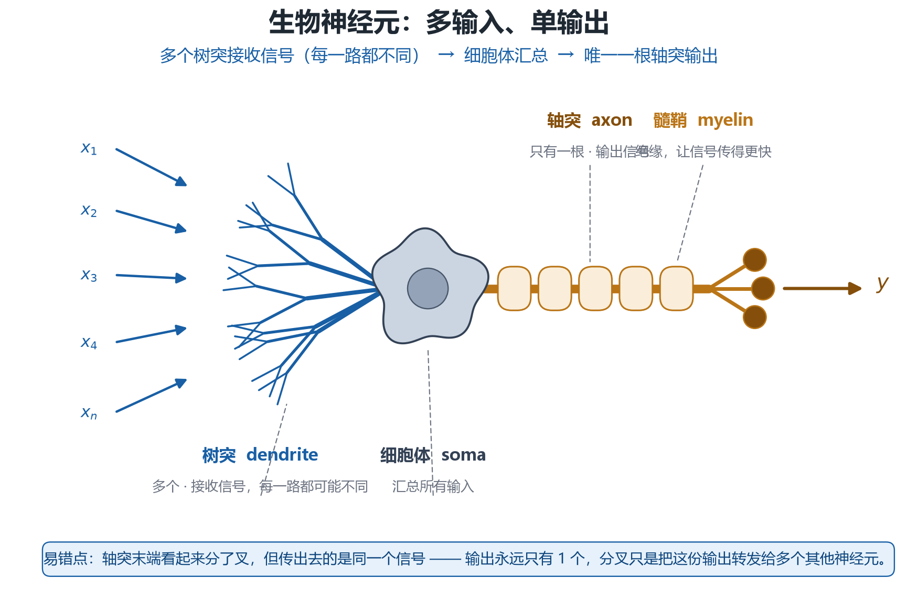
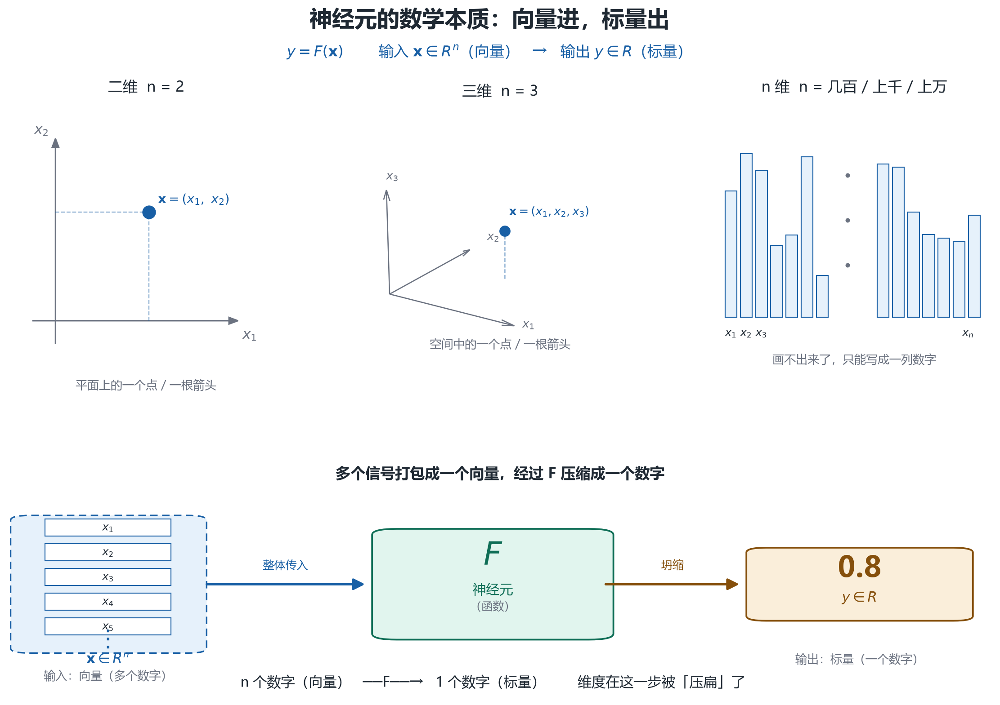
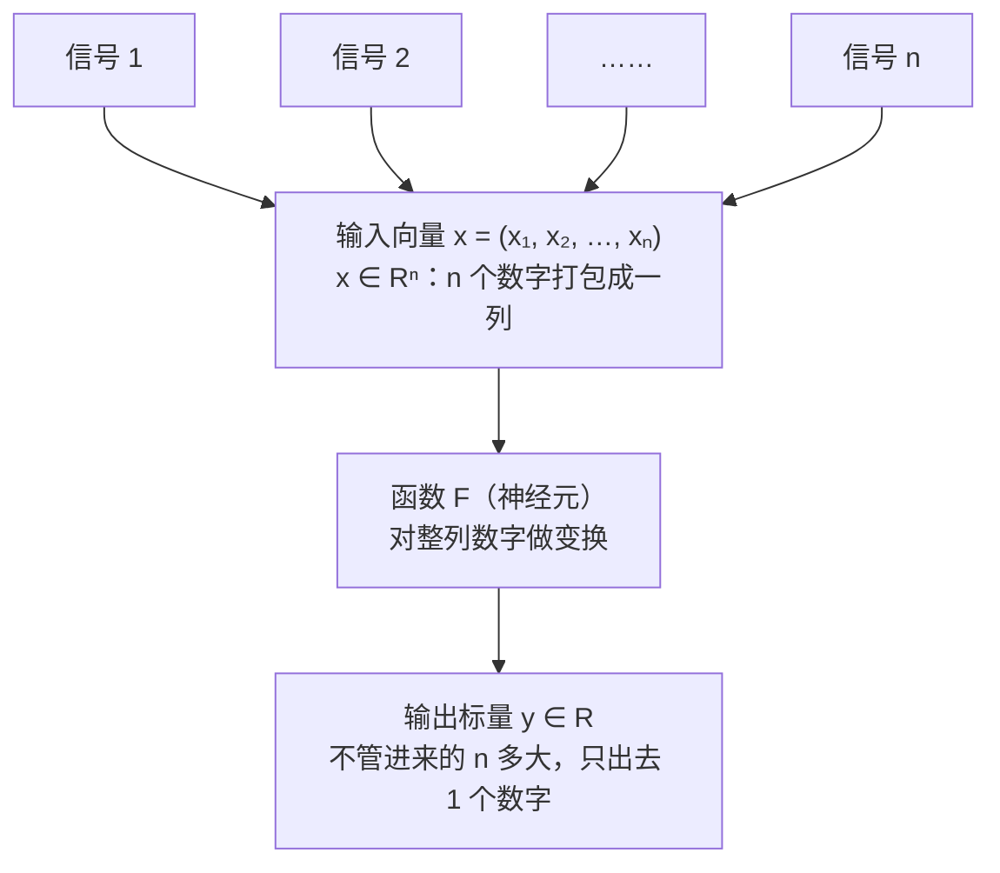
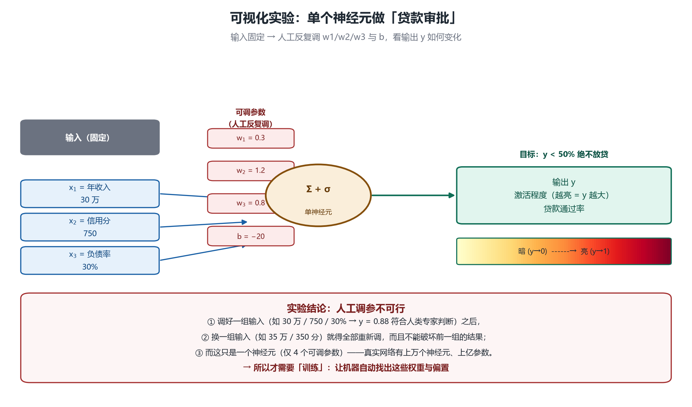
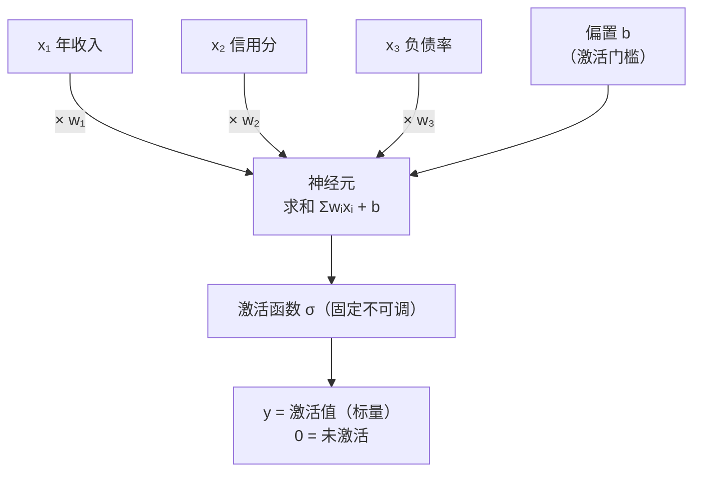

# 第 6 章 神经元：从生物结构到数学模型（MP 模型）

## 一、概念

**为什么学神经网络？** 因为我们的目标是理解 Transformer——而 **Transformer 本身就是神经网络的一种实现形式**；同时，神经网络是当前机器学习领域最常见的实现方式。学神经网络，必须**先认识一个神经元（neuron）**——神经网络就是很多很多个神经元组合而成的。

**学习目标定位**：建立概念与知识体系，**不深究数学原理**。反向传播（backpropagation）后面会涉及微积分、偏导数——那不是公式复杂，而是**数学素养（数学思维）**的问题（类比：编程初学者学循环/数组时，语法不复杂，难在缺乏程序思维）。遇到复杂数学原理的地方会做模糊化处理，保证听得懂。

## 二、原理推导

### 2.1 生物神经元：多输入、单输出

生物学上，每个神经元有两个结构特征：

| 结构 | 数量 | 功能 |
|---|---|---|
| **树突（dendrite）** | **多个** | 接收信号——各种信号通过树突传进神经元内部，**每一路信号可能都不一样** |
| **轴突（axon）** | **单个** | 输出信号。（图上看似分叉，实际只有一个输出——分叉只是把**同一个输出**传递给多个其他神经元） |

   

> 图中四个结构要认全：**树突（dendrite，多个→接收）** → **细胞体（soma，汇总）** → **轴突（axon，只有一根→输出）**，轴突外包裹的**髓鞘（myelin）**负责绝缘、让信号传得更快。
> **最容易记错的一点**：轴突末端看着分了叉，但那只是把**同一个输出**转发给多个下游神经元——输出始终只有 1 个。

### 2.1.1 用数学表达：向量进，标量出

把上面"多输入、单输出"翻译成数学语言：

> **Y = F(树突传进来的多个信号)**
>
> 写成规范记法：**y = F(x)**，其中输入 **x = (x₁, x₂, …, xₙ) ∈ Rⁿ** 是一个**向量（vector）**——n 个数字打包成的一列；输出 **y ∈ R** 是一个**标量（scalar）**——单个数字。

**维度的直觉**（n 是多少，就在多少维空间里）：

| n | 空间 | 几何直观 |
|---|---|---|
| 2 | 二维 | 平面上的**一个点**（或一根箭头），画得出来 |
| 3 | 三维 | 空间中的**一个点**，还勉强能画 |
| 4 及以上 | 高维 | **画不出来了**——只能写成一列数字，靠想象和代数 |
| 几百 / 上千 / 上万 | 超高维 | 真实神经元的输入规模，见下表 |

**"上万维"到底多大？** 几个真实例子找找感觉：

| 任务 | 输入维度 n | 直观感受 |
|---|---|---|
| 房价预测 | 3 ~ 10 | 面积、位置、房龄……几根数轴就装下了 |
| 手写数字识别（MNIST） | 784（28×28 像素） | 一张小图拉平，就是 784 个数字 |
| 彩色图片识别 | 150,528（224×224×3） | 高维到完全无法在脑中成像 |
| 大模型里的一个字 | 896（Qwen2.5-0.5B 实测） | 之前《token 全流程详解》里验证过：一个"爱"字 = 896 维向量 |

一句话总结：**无论 n 是 3 还是 15 万，函数 F 一律把这一整列数字压缩成 1 个数字输出——向量进，标量出。**



用 Mermaid 再画一遍数据流（竖向）：



### 2.2 MP 模型：神经元的数学模型（1943）

1943 年，**Warren McCulloch（神经科学家）** 与 **Walter Pitts（逻辑学家）** 为神经元建立了数学模型（MP 模型），经几十年发展演化为今天的形态：

> **y = σ(Σᵢ wᵢxᵢ + b) = σ(w₁x₁ + w₂x₂ + … + wₙxₙ + b)**

| 符号 | 名称 | 说明 |
|---|---|---|
| x₁…xₙ | 输入值 | 构成输入向量，每个分量表示某个特征 |
| w₁…wₙ | **权重（weight）** | 每个权重表示**该维特征的重要程度** |
| b | **偏置（bias）** | 调节激活的门槛 |
| σ(·) | **激活函数（activation function）** | 对求和结果做处理；**设计时定死，不可调** |
| y | 输出值 / **激活值（activation）** | 一个标量 |

综合起来，单个神经元的计算就是一个「加权求和 → 过激活函数」的两步过程：

```text
y = σ( w₁x₁ + w₂x₂ + … + wₙxₙ + b )
    └─────── 加权求和（线性）───────┘
```

### 2.3 输入的含义是人定的——模型自己一无所知

- 例：三维输入 `[x₁=2, x₂=5, x₃=33]`，人赋予它含义——"2 = 职业编号（程序员）"、"5 = 行业（前端开发）"、"33 = 年薪 33 万"；
- 神经元**不知道也不需要知道**这些含义：一通运算算出 y=0.8，它自己也不知道 0.8 是啥意思——**含义由人来解释**（在薪资预测领域，它就是"下一年薪资涨幅"的预测；在图像识别领域，输入是每个像素点的 RGB 值，**第 2 个输出神经元最亮**，而人类事先规定"第 2 个位置代表猫"——于是判定为猫）;
- 你平时用的聊天模型也一样：喂对话、喂图片、夸它骂它，**它都不知道你在干啥**——它的世界里只有数字。世界上就有这么神奇的事：它啥都不知道，算出来却恰好符合预期。

### 2.4 权重：每个信息维度的重要程度

- **输入不可调控**（是外界给的），**可调控的只有权重 w₁…wₙ 和偏置 b**；
- 例（薪资预测）：`w₁=0.3`（职业编号不太重要）、`w₂=1.2`（行业很重要）、`w₃=0.8`（之前薪资水平比较重要）——调大调小，就调控了该维度对输出的影响；
- **神经元能否输出正确结果，很大程度上取决于权重调得对不对**。

### 2.5 偏置与激活：0 = 未激活

- 输出 y 要求 **≥ 0**（**以 ReLU 这类"负数砍成 0"的激活函数为例**——换 sigmoid 则落在 0~1，换 tanh 则可为负，输出范围由激活函数决定；背后的数学原理不展开，用生物学直观理解）；
- **激活（activation）/ 未激活**：你在听课——语言逻辑相关的神经元疯狂工作；而"饥饿相关""游戏相关"的神经元在**休眠**：它们**接收到了信息**（声音传过去了），但**不输出、不工作**——这就是未激活；
- 激活值 = 输出值：**算出 0 = 未激活**；0.2 有一点激活、0.5 比较激活、100 就非常激活；
- **偏置 b 的作用 = 阈值（像一道闸门）**：有些神经元"必须算出 > 10 我才激活"。直观例子：刚吃完饭你还能再吃一点（有一点点激活），但饥饿感超过某个阈值，才真正感觉"要吃东西了"。通过调偏置，可以抬高/降低激活门槛。

### 2.6 激活函数：把负数砍掉

- 激活函数对最终求和结果做简单处理，**种类非常多**；
- 最常用的激活函数：**与 0 取最大值**（即 ReLU 的思想）——小于 0 的结果没有意义，直接取 0；它结构极简、效果稳定，至今仍是多数网络的首选；
- 完整流程一句话：**权重 × 每个输入求和 + 偏置 → 过激活函数 → 得到输出**。这就是单个神经元的模型。

### 2.7 可视化实验：贷款审批神经元（人工调参的极限）

老师做了一个 React 网页（单神经元可视化）演示"贷款智能审批"：



- **输入**：x₁ = 年收入 30 万、x₂ = 信用分 750、x₃ = 负债率 30%；
- **可调**：w₁/w₂/w₃ 与偏置 b（激活函数固定）；亮度表示激活程度（y 越大越亮）；
- **目标**：y 表示"贷款审批通过率/可贷额度"——小于 50% 绝不放贷；
- **实验过程**：人工调 w₁、w₂、w₃、b（如调到 y=0.88 符合人类专家的审批结果）→ **换一组输入（35 万/350 分）又得重新调**，而且不能破坏之前调好的结果；
- **结论：人工调参不可行**——而这只是**单个**神经元（几个参数）。

### 2.8 参数（parameter）：权重 + 偏置

> **参数 = 权重 + 偏置** 的统称。

- 神经元能影响输出的**只有参数**：输入是外界传来的、与你无关；激活函数定死不可调；
- "训练模型 / 训练神经网络"的本质 = **调控参数**，让任意输入都能得到符合预期的输出；
- 规模感受：一个简单神经网络就有 **2.6 万多个参数**——人工根本调不过来；大模型参数达**万亿级**。必须让机器自己调（这就是后续"训练/梯度下降"要讲的内容）。

## 三、白板 / 演示步骤（按讲解顺序还原）

1. **画生物神经元**：左侧画多根树突（多输入、各不相同）→ 中间细胞体汇总 → 右侧画**唯一一根**轴突（单输出），末端分叉只是把同一份输出转发给多个下游神经元。

2. **写出 MP 模型公式**：`y = σ(Σ wᵢxᵢ + b)`，逐个标注输入向量、权重、偏置、激活函数、输出标量。（公式笔记见 2.2）

3. **给输入编含义**：职业编号/行业/年薪的例子——强调"含义是人定的，模型不知道"。
4. **讲激活与阈值**：听课例子（语言神经元活跃、饥饿神经元休眠）→ 引出偏置 = 门槛。
5. **打开可视化网页调参**：贷款审批场景，现场调权重/偏置，观察亮度与 y 值变化，验证"人工调参不可行"。（网页截图见 2.7）

## 四、关键结论 / 公式

1. **核心公式**：`y = σ(Σᵢ wᵢxᵢ + b)`——输入向量、输出标量。
2. **参数 = 权重 + 偏置**；这是神经元唯一可调的东西，激活函数定死。
3. 权重的语义：**该维特征的重要程度**；偏置的语义：**激活的门槛**。
4. 输出 = 激活值；**0 = 未激活**，值越大越活跃；负数被激活函数砍为 0（ReLU 思想）。
5. 输入的含义由人赋予——**模型永远不知道数字的现实意义**。
6. 人工调参在单神经元层面已不可行 → 训练（机器自己调参数）是必然选择。

用 Mermaid 还原神经元结构（竖向）：



## 本节要点回顾

- 学神经网络是为了理解 Transformer（它就是神经网络的一种实现）。
- 生物神经元：**多树突进、单轴突出**；数学上 = 向量进、标量出。
- MP 模型（1943）：`y = σ(Σ wᵢxᵢ + b)`。
- **权重 = 特征重要程度；偏置 = 激活门槛；两者合称参数**——神经元唯一可调的东西。
- 激活函数设计时定死；最常用的是"与 0 取最大"（负数砍零）。
- 输入的含义由人赋予，模型一无所知——一切皆数字。
- 单神经元几个参数人工调都顾此失彼；真实网络数万亿参数 → **必须机器自己调（训练）**。
