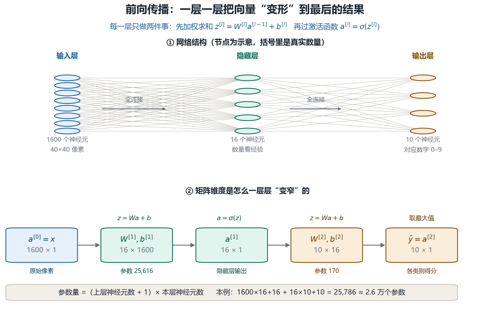
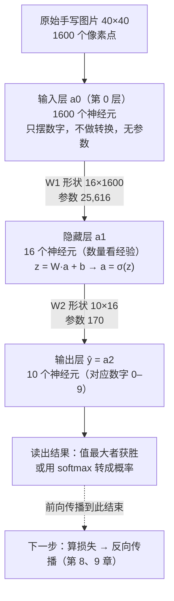

# 第 7 章 神经网络结构：分层、全连接与前向传播

> **时间轴** 02:18 – 02:40 ｜ 时长约 22 分钟

## 一、概念

单个神经元（第 6 章）太简单，也不符合人类大脑的结构——**神经网络就是很多神经元连接起来**。本章讲清：这些神经元**怎么分层、怎么连接、信号怎么从输入流到输出（前向传播，forward propagation）**。

本章的推导路线是：**分层结构 → 记号约定 → 单神经元公式 → 整层矩阵化 → 参数量精算 → 为什么必须非线性 → 手算一遍 → 全连接的代价**。其中「矩阵化」和「非线性」是理解后续章节的地基：第 9 章的反向传播用的就是同一套 `W^[l] / b^[l] / z^[l]` 记号。

老师为此做了一个可视化网页（React + Vite，「神经网络·交互实验室」：神经元详解 / 前向传播 / 权重视角三个标签页），边讲边演示。

   

## 二、原理推导

### 2.1 网络的分层结构

| 层 | 别名 | 数量 | 职责 |
|---|---|---|---|
| **输入层（input layer）** | 第 0 层 | **固定只有一层** | 提供用户的输入信息——**不做任何转换**，只展示原始输入的数字化结果；输入层神经元**没有权重和偏置** |
| **隐藏层（hidden layer）** | 第 1、2、3…层 | **不固定**，看架构 | 中间运算过程——"输入，刷刷刷，输出" |
| **输出层（output layer）** | 最后一层 | **固定只有一层** | 产生最终结果，含义由人为规定 |

关于隐藏层的关键事实：
- **层数不是越多越好**：太多、太少都会出问题——设多少合适**看工程经验**，没有严格的数学论证，还与训练数据集有关。（例：某经典架构有 60 多个隐藏层；GPT 是闭源模型看不到，业界猜测有 100 多层。）
- **每层神经元数量也不一定**：有的架构每个隐藏层有 7000 多个神经元；有的架构各隐藏层数量还不一致。
- 整个神经网络可以看作一个大函数：输入一个向量 → 一系列运算 → 输出结果。

### 2.1.1 层编号与记号约定（看懂公式的前提）

后面推导要用一套统一记号，先约定好（**上标方括号 `[l]` 表示"第几层"，不是次方**）：

| 记号 | 含义 | 形状（维度） |
|---|---|---|
| `L` | 网络总层数（输出层编号） | 标量 |
| `nₗ` | 第 l 层的神经元个数 | 标量 |
| `x` / `a^[0]` | 输入向量，也就是输入层的值 | `(n₀ × 1)` |
| `W^[l]` | 第 l 层的**权重矩阵** | `(nₗ × nₗ₋₁)` |
| `b^[l]` | 第 l 层的**偏置向量** | `(nₗ × 1)` |
| `z^[l]` | 加权和（**激活之前**的中间量） | `(nₗ × 1)` |
| `a^[l]` | 第 l 层的**输出 / 激活值** | `(nₗ × 1)` |
| `ŷ` | 网络最终输出（`ŷ = a^[L]`） | `(n_L × 1)` |

一眼看懂权重矩阵的形状：**`W^[l]` 的行数 = 本层神经元数，列数 = 上一层神经元数**。行是"我这一层有几个神经元"，列是"每个神经元要接几根线"——这正是"权重数 = 上一层输出数"的矩阵说法。

> **输入层为什么没有参数？** 它只是把原始数字摆出来（`a^[0] = x`），不做 `Wx+b` 运算，所以既没有权重也没有偏置——第 9 章反向传播会提到"输入层没有期望可言"，根子就在这里。

### 2.2 实例：手写数字识别（贯穿案例）

需求：让神经网络识别手写数字图片（2、3、4……）。

**第 1 步：图片数字化**
- 神经网络**只能接受数字**，不能接受图片；
- 最简单的方式：40×40 的图片 = **1600 个像素点** → 输入层设计 **1600 个神经元**（白板上画不下，画 8 个示意）；
- 每个像素点的颜色是 RGB 三个数字，可以合成一个数（如十六进制色值）——一个像素一个数字，共 1600 个。

**第 2 步：输入层点亮**
- "点亮" = 激活值高就亮；输入层显示的就是训练数据的数字化结果，**不做任何转换**；
- 每个输入层神经元向后传递一个 y（1600 个输出）。

**第 3 步：隐藏层逐层计算（全连接）**
- 隐藏层设多少个神经元可以随意/看经验；工程上会根据经验增减层；
- **每个隐藏层神经元在"负责什么"？——没有人知道**。谁都不知道某个神经元负责什么，智能是它自己产生的，人为规定不了；
- **全连接（fully connected）**：这一层的每个神经元与**前面一层的所有神经元**都有连接（现在很多 GPT 类模型是**非全连接**，但理解了全连接，非全连接只是"少算一些"）；
- 隐藏层第一个神经元的计算（与第 6 章单神经元公式完全一样）：

```text
y = σ(w₁x₁ + w₂x₂ + … + wₙxₙ + b)
```

- 权重 w：**随机初始化**（通过正态分布采样），不用管具体怎么采；
- 输入 x：来自**上一层的输出**；
- 偏置 b：也是随机的；
- 激活函数 σ：固定的，多种实现任选。

> 老师的原话：这里面没有任何魔法，全是数学运算——"一个小学生来算也能算完，可能要算五六天"。数量大而已。

**关键规律：权重的数量 = 上一层输出的数量**
- 上一层有 16 个输出 → 这一层每个神经元就要有 16 个权重；
- 上一层 8 个输出 → 每个神经元 8 个权重。

   

**同层神经元的异同**：
- 同一层每个神经元收到的 x₁…xₙ **完全一样**（都是上一层的输出）；
- 但每个神经元有**自己的权重和自己的偏置** → 算出的结果各不相同；
- 这层算完 → 下一层重来一次 → 直到输出层。

**活跃度的直观展示**：亮着的神经元 = 传递的数字大 = 活跃；暗的 = 传递的数字小 = 不活跃。

### 2.3 前向传播的矩阵形式（本章核心公式）

一个一个神经元地写 `y = σ(w₁x₁ + … + b)` 太啰嗦。**把整层的神经元摞成向量，把整层的权重摞成矩阵，一层只需要两行公式**：

```text
z^[l] = W^[l] · a^[l-1] + b^[l]      ← 加权求和（线性部分）
a^[l] = σ( z^[l] )                   ← 过激活函数（非线性部分）
```

维度自检（矩阵乘法为什么对得上）：

```text
(nₗ×1)  =  (nₗ × nₗ₋₁)  ×  (nₗ₋₁×1)  +  (nₗ×1)
  z^[l]        W^[l]          a^[l-1]        b^[l]
```

从输入到输出，**把这两行重复 L 次**就是完整的前向传播：

```text
a^[0] = x
a^[1] = σ(W^[1] a^[0] + b^[1])
a^[2] = σ(W^[2] a^[1] + b^[2])
   …
a^[L] = σ(W^[L] a^[L-1] + b^[L])   →  ŷ
```

| 视角 | 单神经元写法（第 6 章） | 整层矩阵写法（本章） |
|---|---|---|
| 计算单位 | 一个神经元 | 一层的所有神经元 |
| 公式 | `y = σ(Σᵢ wᵢxᵢ + b)` | `a^[l] = σ(W^[l] a^[l-1] + b^[l])` |
| 参数 | n 个权重 + 1 个偏置 | `W^[l]`（矩阵）+ `b^[l]`（向量） |
| 关键约束 | 每个神经元接上层**全部**输出 | 所以 `W^[l]` 的列数 = `nₗ₋₁` |

**为什么矩阵形式重要？** 因为矩阵乘法是**高度并行**的——一次矩阵运算就把整层成千上万个神经元的加权和全算完，GPU 最擅长的就是这件事。如果按"一个神经元一个 for 循环"写，几万个参数要算到天荒地老；写成矩阵，丢给 GPU 一次算完。**这就是"工业界能用得起大模型"的工程前提**（呼应第 1 章的 GPU 并行）。

**一次算一批样本（batch）**：把 m 个样本摞成矩阵 `A^[l-1]`（形状 `nₗ₋₁ × m`），公式不变：

```text
Z^[l] = W^[l] · A^[l-1] + b^[l]     形状：(nₗ × m)
```

偏置 `b^[l]` 会自动**广播（broadcast）**到每一列。batch 越大，GPU 的并行效率越高（显存够的前提）。

> **一句话记住"前向"**：信号**只朝输出方向**走一遍，得到预测值 `ŷ`；至于 `ŷ` 好不好、怎么往回调整参数，那是第 8 章损失 + 第 9 章反向传播的事。**前向传播 = 用当前参数算出预测值**。

### 2.4 输出层：数量由问题决定，含义由人规定

- 课程案例：识别 0–9 手写数字 → 输出层设计 **10 个神经元**（训练数据有多少类，就设多少个）；
- **输出含义是人为规定的**：哪个输出值最大，就认为识别结果是哪个数字（如第 7 个神经元值最大 → 判定为 7）；
- 单个神经元自己不知道输出的含义——"智能"这个解释永远是人赋予的；
- 想把这个"最大者"进一步变成"有多大把握"，就在输出层再加一个 **softmax**——见 2.7 的手算示例。

**分辨率与输入层规模**：
- 若要直接训练 1920×1080 的图片，输入层就得有 **207 万个神经元**——太大了；
- 业界做法：**把图片切分成小块训练（tile 化）**，或压缩/裁剪到固定分辨率——所以输入层规模基本是固定的。

### 2.5 参数规模精算（含矩阵运算）

**参数量公式**（记住这个，随时能估网络大小）：

```text
第 l 层参数量 = (nₗ₋₁ + 1) × nₗ  =  nₗ₋₁ × nₗ  +  nₗ
                                     ↑权重        ↑偏置
```
（"+1" 是每个神经元多一个偏置 b。）

**精算课程里的手写数字网络**（1600 → 16 → 10，即 `n₀=1600, n₁=16, n₂=10`）：

| 层 | 权重数 | 偏置数 | 小计 |
|---|---|---|---|
| 隐藏层 `W^[1], b^[1]` | 1600 × 16 = 25,600 | 16 | **25,616** |
| 输出层 `W^[2], b^[2]` | 16 × 10 = 160 | 10 | **170** |
| **合计** | | | **25,786 ≈ 2.6 万个参数** |

这正好对上老师说的"**一个简易神经网络就有 2 万多个参数**"——不是随口说的，是按上面这个公式算出来的。

如果按网页演示的四层结构（1600 → 16 → 16 → 10）：

| 层 | 计算 | 小计 |
|---|---|---|
| `W^[1]` | 1600×16 + 16 | 25,616 |
| `W^[2]` | 16×16 + 16 | 272 |
| `W^[3]` | 16×10 + 10 | 170 |
| **合计** | | **26,058** |

> 注意规律：**参数量几乎全被第一层吃掉了**（25,616 / 26,058 ≈ 98%）。因为输入维度 1600 太大。所以业界才要想办法降低输入规模（切块、压缩），或者不用全连接（见 2.8）。

**计算量顺带算一下**：一次前向传播大约需要 `2 × 参数量` 次浮点运算（一次乘法 + 一次加法），本例约 **5 万次 FLOPs（floating point operations，浮点运算次数）**/每张图。看着不多——但真实模型是**万亿参数 × 每张图**，没有 GPU 并行根本跑不动：

- 为什么工业界能用？**矩阵运算性能非常高**（可充分利用 GPU 并行）——第 1 章提过 GPU 并行与浮点误差，这里呼应；
- 参数量大到人工调不动 → 这才引出第 8 章的损失函数和第 9 章的反向传播（让机器自己调）。



### 2.6 为什么激活函数必须是"非线性"的（关键补充）

课程里只说"激活函数固定、种类很多"，但没说**为什么非它不可**。答案是：**没有非线性，叠多少层都白叠。**

推导一下——假设把激活函数去掉（或者用线性函数，比如 `σ(z) = 2z`），两层网络会变成：

```text
a^[1] = W^[1] x + b^[1]
a^[2] = W^[2] a^[1] + b^[2]
      = W^[2](W^[1] x + b^[1]) + b^[2]
      = (W^[2] W^[1]) x + (W^[2] b^[1] + b^[2])
      =        W'      x +        b'
```

两个矩阵相乘还是矩阵，两个向量相加还是向量——**两层直接塌缩成一层**。推而广之，100 层线性层叠在一起，仍然等价于一层 `y = W''x + b''`。

> **结论**：深度之所以有意义，全靠激活函数在每一层之间"掰弯"一次。第 6 章讲的 ReLU（负数砍成 0）之所以好用，正是因为它足够简单又有明确的**非线性**（在 0 处折了一下）。这是"深度学习"名字里"深度"二字的立足点。

### 2.7 手算一遍完整的前向传播（迷你网络）

公式看着抽象，用一个 **3 → 2 → 2** 的迷你网络从头算到尾（激活函数取 ReLU：负数归 0、正数不变）。

**给定参数**（真实网络里这些是随机初始化后训练出来的，这里直接给数）：

```text
输入   x = a^[0] = (0.5, 0.8, 0.2)

第 1 层  W^[1] = [ 0.4  -0.2   0.7 ]    b^[1] = ( 0.1, -0.2)
                [ 0.1   0.5  -0.3 ]

第 2 层  W^[2] = [ 0.9  -0.2 ]          b^[2] = ( 0.05, 0.0 )
                [-0.3   0.8 ]
```

**第 1 步：算隐藏层**（先加权求和 z，再过激活函数 a）

| 神经元 | 加权求和 z = Wx + b | 激活 a = ReLU(z) |
|---|---|---|
| 第 1 个 | 0.4×0.5 + (−0.2)×0.8 + 0.7×0.2 + 0.1 = **0.28** | 0.28 |
| 第 2 个 | 0.1×0.5 + 0.5×0.8 + (−0.3)×0.2 + (−0.2) = **0.19** | 0.19 |

→ `a^[1] = (0.28, 0.19)`，它成为第 2 层的输入。

**第 2 步：算输出层**（拿 a^[1] 再重复一次同样的动作）

| 神经元 | 加权求和 z = W a^[1] + b | 激活 a = ReLU(z) |
|---|---|---|
| 第 1 个 | 0.9×0.28 + (−0.2)×0.19 + 0.05 = **0.264** | 0.264 |
| 第 2 个 | (−0.3)×0.28 + 0.8×0.19 + 0.0 = **0.068** | 0.068 |

→ `ŷ = a^[2] = (0.264, 0.068)`

**第 3 步：读出结果**

- 按课程规则"**谁最大就是谁**" → 第 1 个神经元最大 → 判定为**第 1 类**；
- 工程上常在多分类的输出层再加一个 **softmax**（归一化指数函数），把得分压成概率：
  `e^0.264 = 1.302`，`e^0.068 = 1.070`，总和 2.372 → 概率 `(1.302/2.372, 1.070/2.372) = (0.549, 0.451)`。
  结论不变（第 1 类概率更高），但现在能说"**它有 54.9% 的把握**"——这就是置信度。

> 整个过程**没有任何魔法**：只是乘法、加法、比大小。老师那句"一个小学生来算也能算完，可能要算五六天"说的就是这件事——真实网络只是把上面这张表放大到几万行、几千列而已。

### 2.8 全连接的代价：为什么现在的模型不再全连接

全连接很好懂，但它有个致命缺点——**参数量 = 两层神经元数的乘积**，随宽度呈平方级膨胀：

| 场景 | 第一层参数量 | 可行性 |
|---|---|---|
| 40×40 图（1600）→ 16 个隐藏神经元 | 25,616 | 轻松 |
| 1920×1080 图（207 万）→ 1000 个隐藏神经元 | **约 20.7 亿** | 单层就要几十 GB 显存，**不可行** |

这就是为什么 2.3 说"输入层规模基本是固定的"，以及业界想出的三条出路：

| 路子 | 做法 | 代表 |
|---|---|---|
| **降输入规模** | 切块（tile）训练、压缩/裁剪分辨率 | 早期图像处理的通用做法 |
| **局部连接 + 权重共享** | 每个神经元只看一小块（**感受野 receptive field**），且同一套权重在整张图上滑窗复用 | **CNN（Convolutional Neural Network，卷积神经网络）** |
| **按需连接** | 不固定连谁，由输入动态决定"该看谁、看多重" | **Attention（注意力）** / Transformer |

老师的原话是：**"现在很多 GPT 类模型是非全连接，但理解了全连接，非全连接只是少算一些。"** ——全连接是"基准形态"，其他连接方式都是在它基础上做减法或做动态化。

**顺带解释"层数不是越多越好"**（2.1 留的尾巴），工程上有三个硬约束：

1. **梯度消失 / 爆炸（vanishing / exploding gradient）**：层数太多，误差信号传回前面时会被反复相乘而衰减到 0（或飙到无穷大）——第 9 章会展开；
2. **过拟合（overfitting）**：参数太多而数据不够，网络把训练样本的噪声也背下来了，换个新样本就废——第 10 章会展开；
3. **训练成本**：层数翻倍，算力与显存近似翻倍，边际收益却递减。

所以隐藏层的层数和宽度，最终还是要回到老师那句话：**看工程经验，没有严格的数学论证**。

## 三、白板 / 演示步骤（按讲解顺序还原）

1. **展示四层结构**：可视化网页中标出输入层（8 个）→ 隐藏层 1（16 个）→ 隐藏层 2 → 输出层（8 个），箭头指示信号向前流动。（结构图见 2.1）

2. **讲分层命名**：输入层=第 0 层，隐藏层第 1/2/3 层，输出层最后；输入输出层固定一层、隐藏层不定。
3. **引入手写数字案例**：40×40 图片 → 1600 像素 → 1600 个输入神经元；RGB 合成一个数。
4. **逐步推演一个神经元的计算**：W 随机初始化、X 取上层输出、加偏置、过固定激活函数——"小学生也能算，只是算得慢"。
5. **切到权重视角**：展示隐藏层 1 第 1 个神经元连接的 16 条线——权重数 = 上层输出数。（权重视角截图见 2.2）

6. **定义输出层**：10 个神经元对应数字 0–9；输出值最大者 = 识别结果。

## 四、关键结论 / 公式

1. 网络三段式：**输入层（第 0 层，不转换、无参数）→ 隐藏层（数量看经验）→ 输出层（数量=类别数，含义人为规定）**。
2. **前向传播的矩阵形式**（本章核心）：`z^[l] = W^[l] a^[l-1] + b^[l]`，`a^[l] = σ(z^[l])`，从 `a^[0]=x` 一路算到 `ŷ=a^[L]`；`W^[l]` 形状 = `nₗ × nₗ₋₁`。
3. 隐藏层层数/每层神经元数：**看工程经验，无数学论证**；不是越多越好（梯度消失、过拟合、算力成本三座大山）。
4. **全连接**：下层每个神经元连接上层所有输出；**权重数 = 上一层输出数**；**参数量 =（nₗ₋₁ + 1）× nₗ**。
5. 每个神经元计算仍是第 6 章的公式：`y = σ(Σ wᵢxᵢ + b)`；同层共享输入、各持权重，结果各异。
6. 隐藏层神经元"负责什么"**无人知晓**——智能是网络自己涌现的。
7. 输入层规模由图片分辨率决定（40×40→1600；1920×1080→207 万，需切块/压缩）。
8. **激活函数必须是非线性**：否则 `W^[2]W^[1]x` 仍是一次线性变换，叠多深都塌缩成一层——"深度"的意义全靠它。
9. 输出层读数：课程规则是**值最大者获胜**；工程上常用 **softmax** 转成概率（能说"有多大把握"）。
10. **矩阵化 + GPU 并行**是工程可行性的前提；一次前向约 `2×参数量` 次浮点运算。
11. 课程示例网络（1600→16→10）参数量 **25,786 ≈ 2.6 万**；其中第一层占了 98%——所以才要降输入规模或改用 CNN / Attention。

用 Mermaid 还原网络结构与信号流（竖向，含维度与参数量）：



## 本节要点回顾

**结构与记号**

- 网络三段式：**输入层（第 0 层，不转换、无参数）→ 隐藏层（数量看经验）→ 输出层（数量=类别数，含义人为规定）**。
- 记号：`[l]` 是层号不是次方；`W^[l]` 形状 = `nₗ × nₗ₋₁`（行=本层神经元数，列=上层神经元数）。
- **全连接**：下层每个神经元连接上层所有输出；**权重数 = 上一层输出数**；参数量 =（上层数 + 1）× 本层数。

**前向传播**

- 每层只有两步：**`z = W·a + b`（加权求和）→ `a = σ(z)`（过激活函数）**，重复 L 遍就到输出。
- 每个神经元算的还是第 6 章那一条：`y = σ(Σ wᵢxᵢ + b)`；同层共享输入、各持权重，所以结果各不相同。
- **前向 = 用当前参数算出预测值**：只朝输出方向走一遍，不回头（回头是第 9 章的事）。

**容易记错的三件事**

- 隐藏层神经元"负责什么"**无人知晓**——智能是涌现出来的，人规定不了。
- **激活函数不能省**：没有非线性，多少层都会塌缩成一层线性变换。
- 输出层"值最大者获胜"是**人定的规则**；想要概率就用 softmax。

**工程现实**

- 输入层规模由分辨率决定（40×40→1600；1920×1080→207 万，需切块/压缩）；层数不是越多越好（梯度消失、过拟合、算力）。
- 参数量几乎被第一层吃掉（本例 98%）→ 才有了 CNN 的局部连接 + 权重共享、Transformer 的 Attention。
- 2.6 万参数的迷你网络已无法人工调参——**下一章讲"机器怎么自己调"**。
