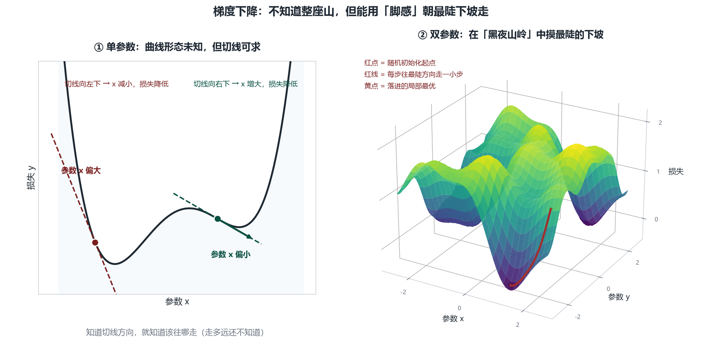
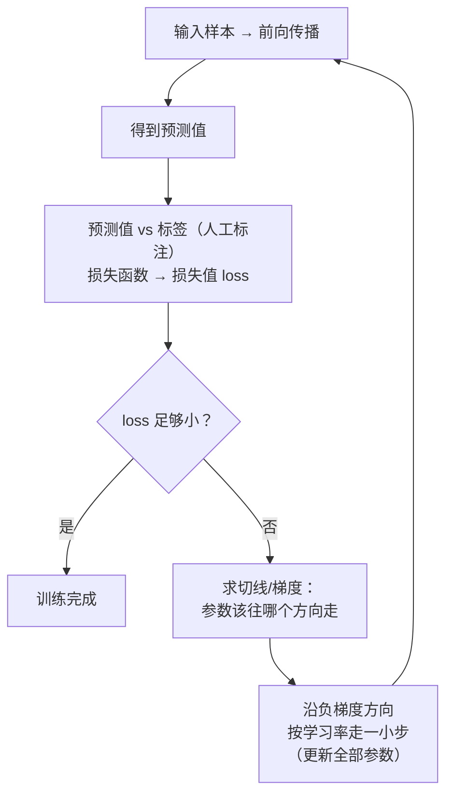

# 第 8 章 损失与梯度下降：网络如何自我调整

## 一、概念

第 7 章末尾留了悬念：小网络就有 2 万多个参数，人工根本调不过来。本章讲清**训练的核心思路**——先量化"错得有多离谱"（损失），再让计算机沿着"最陡的下坡方向"自己调参数（梯度下降）。

> 老师反复强调的心态设定：学完你会发现**整个神经网络就是在做一道一道的数学练习题，习题非常庞大而已**，没有任何神秘感。涉及微积分、偏导数的地方一律不讲深（目标是日常交流无障碍）。

## 二、原理推导

### 2.1 预测值（Prediction）与标签（Label）

- **预测值**：神经网络算出来的结果。未训练的网络权重偏置全是随机的 → 输出完全随机（例：输入数字 1，输出 0.86 说它是 6、0.76 说它是 4——错得离谱）；
- **标签（label，真实值）**：人类通过**数据标注**给出的正确结果；
- 输出层编号微调：第 1 个神经元代表数字 0、第 2 个代表 1……第 10 个代表 9（编号从几开始无所谓，纯粹为了看得清楚）；
- 正确结果的样子：对应位置的神经元完全点亮 = 1，其余全暗 = 0；
- 输出值被约束在 **0 到 1 之间**（有各种数学工具可以压到 0–1 区间；展示百分比用的转换工具可把任意一组数据转成百分比格式）。

### 2.2 损失值（Loss）与损失函数（Loss Function）

- 预测值与标签之间**必然有差距** → 需要一个量化的衡量 → 这个差距叫**损失值（loss）**；计算它的函数叫**损失函数（loss function，有的教材译作代价函数 cost function，一个意思）**；
- 损失值是一个数字，**≥ 0**；最小值 0 = 完全正确——但**几乎不可能达到**，目标是"尽量小"；
- 简单示例：预测值与标签逐项**相减、平方、再取平均**（平方保证为正数；谁减谁无所谓）——这就是**均方误差 MSE（Mean Squared Error）**，多用于回归任务；**分类任务更常用交叉熵（cross-entropy）**，思路一样，都是把"差多少"压成一个 ≥0 的数字。

### 2.3 参数与损失的关系：一个复杂函数

推理链：
1. 输入固定 → 标签固定 → 要减小损失**只能动输出**；
2. 输出不能直接动 → **是参数（2 万多个权重+偏置）在影响损失度**；
3. 参数与损失之间必然存在某种关系，但关系极其复杂 → 用数学记法：

```text
loss = C(参数)      ← C 是一个我们不知道具体形态的复杂函数
```

### 2.4 简化情形：单参数的切线（方向从哪来）

- 假设整个网络**只有一个参数 x**，经过复杂函数 C 得到损失 y；
- 画二维坐标系（横轴 x = 参数，纵轴 y = 损失），曲线弯来弯去、**形态未知**；参数随机初始化在曲线上某一点；
- **关键转折**：整条曲线长什么样我们不知道，但**这个点上的切线（斜率）是可以求的**（用微积分方法，课程不展开）；
- 知道切线就知道**该往哪个方向走**：
  - 切线向右下 → x 增大，损失降低；
  - 切线向左下 → x 减小，损失降低；
  - "走多远"还不知道，但方向有了。



### 2.5 多参数：梯度下降（Gradient Descent）

两个参数时（x、y 是参数，z 是损失），用 3D 曲面直观化：

- 想象你**在伸手不见五指的黑夜里，站在连绵起伏的山脉中**——看不见整体地形，不知道自己在哪；
- 但你**可以用脚感受坡度**：往最陡的下坡方向走一点 → 损失就减少一点；
- **这个过程就叫梯度下降（gradient descent）**——像下楼梯，往最陡的方向走；
- ⚠️ 梯度下降首先是一个**整体思想/思维方式**（损失曲面的具体形态我们并不知道）；落到实现上则是一族迭代算法——SGD、Momentum、Adam 等，区别只在"这一步具体怎么走"；
- 真实参数是 2 万多个维度——高维空间画不出来，但思想完全一样：**往最陡的方向走**。（3D 曲面演示见 2.4 节配图）

### 2.6 局部最优 vs 全局最优

- 沿最陡下坡滚下去，只能落进**最近的凹槽 = 局部最优解（local optimum）**；
- 全局最优解（global optimum）"**可遇不可求**"——曲面无限延伸，根本找不完；
- 实践经验：**不同的局部最优解效果都差不多**，找到局部最优就已经很不错了；
- 如果落进了不好的局部最优，还有一些辅助手段（如加入随机扰动把它"振出去"）。

### 2.7 学习率（Learning Rate）：走多远

- 知道方向后，**走一大步还是一小步**？——由学习率决定（人为规定的"步长"）；
- 为什么不能迈大步：黑夜里你不知道曲线整体形态——你朝下坡方向跨一米，**可能直接跨过谷底、跳到对面山坡上去了**；
- 所以每次**走一点点**：沿**负梯度方向**（函数值下降的方向）移动一小步，让损失值减少一点点；重复这个过程，一步步逼近凹槽底。

## 三、白板 / 演示步骤（按讲解顺序还原）

1. **展示未训练网络的随机输出**：可视化网页里输出层各神经元数值（0.86→6、0.76→4 等），指出"全是随机参数导致的随机结果"。
2. **定义预测值与标签**：把输出层编号改为对应数字 0–9；人类标注正确答案（正确位置点亮为 1，其余为 0）。
3. **写出损失**：逐项相减平方 → 得到损失值（≥0，越小越好）。
4. **单参数切线实验**：画一条复杂未知曲线（横轴 = 参数 x，纵轴 = 损失 y），随机落一点，求切线、定方向。（曲线图见 2.4）

5. **升维到 3D 曲面**：两个参数（x、y）+ 损失（z），站在"黑夜山脉"里用脚感受最陡下坡——引出梯度下降。（3D 曲面图见 2.5）

6. **讲局部最优与学习率**：滚进最近的凹槽就不错；步长要小，防止跨过谷底。

## 四、关键结论 / 公式

1. 训练 = 不断调整全网络的**参数**（权重+偏置），让输出符合预期；输入固定时，参数唯一决定输出。
2. **损失值**量化"错多少"：损失函数常见做法 = 预测值与标签逐项相减平方；损失 ≥ 0，目标尽量小（0 几乎不可达）。
3. **参数与损失的关系记作 loss = C(参数)**，C 形态未知但几乎处处光滑——**局部切线可求**，切线给出下降方向。
4. **梯度下降**：沿最陡下坡方向（负梯度方向）小步移动——是一个整体思想，不是具体数学公式。
5. **局部最优已足够好**；全局最优可遇不可求；卡住时有随机扰动等辅助手段。
6. **学习率 = 步长**：太大容易跨过谷底跳上对坡，太小则收敛慢——所以"每次走一点点"。

用 Mermaid 还原梯度下降循环（竖向）：



## 本节要点回顾

- 未训练的网络输出完全随机——**训练 = 调参数使输出接近标签**。
- **预测值 vs 标签**：模型算的是预测值；正确答案靠数据标注。
- **损失函数**量化差距（相减平方），损失值 ≥ 0，追求尽量小而非 0。
- 记法：`loss = C(参数)`；曲线未知但**切线可求**——切线给方向。
- **梯度下降 = 黑夜下山**：用脚感受最陡下坡，往最陡方向走；是思想不是公式。
- **局部最优已够好**，全局最优可遇不可求；卡住可加随机扰动。
- **学习率 = 步长**：太大跳过谷底，太小收敛慢；沿负梯度方向小步迭代。
- 破除神秘感：神经网络 = 一道道庞大的数学练习题。
