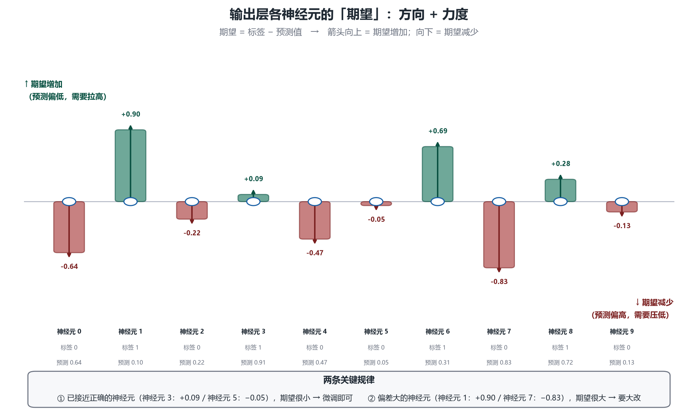
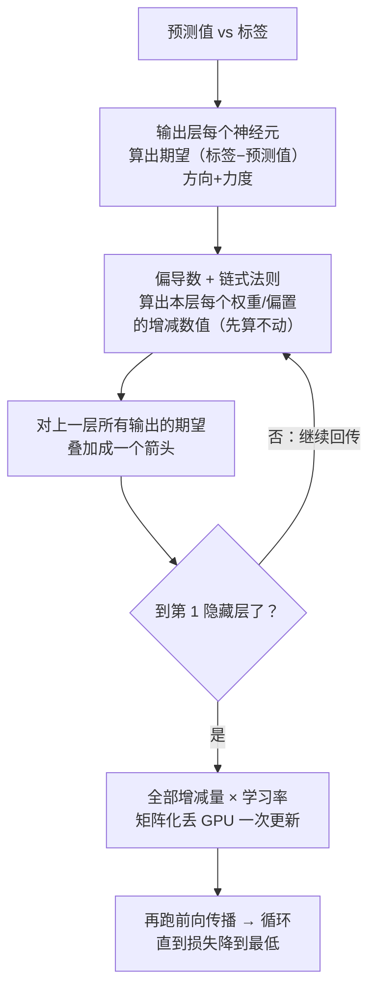

# 第 9 章 反向传播：梯度下降的实现手段

## 一、概念

上一章说清了目标——**梯度下降（减少损失）**；本章讲**怎么实现**这个目标。

> **一句话定位（老师原话）**：梯度下降是**目标**（减少损失）；**反向传播（backpropagation）就是为了实现这个目标的**。

## 二、原理推导

### 2.1 第一步：算出输出层的"期望"

对比预测值与标签，每个输出神经元都能算出一个**期望**：

```text
期望 = 标签 − 预测值

例：期望 0，实际 0.64 → 期望减少 0.64（箭头向下）
例：期望 1，实际 0.1  → 期望增加 0.9  （箭头向上）
```

> **数学脚注（了解即可，不展开微积分）**：严格讲，真正沿网络回传的信号是 `δ = 误差 × σ′(z)`——还要再乘上激活函数的导数。课程用"期望 = 标签 − 预测值"做直观模型，方向与力度一致、便于理解。

- 箭头**向上 = 期望增加，向下 = 期望减少**，箭头**有大有小**（期望的力度不同——已经接近正确的，期望就很小）；
- 每个神经元都有各自方向、各自力度的期望。



### 2.2 第二步：归因——影响这个神经元的都有谁

以输出层"神经元 0"（期望减少）为例，影响它激活度的因素：

1. 它的 **16 个权重 w₁…w₁₆**（可改，有"旋钮"）；
2. 它的 **1 个偏置 b**（可改）；
3. **上一层的输出 a₁…a₁₆**（不能直接改——但上一层也有自己的权重偏置，存在传递性）。

**用微积分算出每个因素该改多少**：
- **偏导数（partial derivative）**：有多个参数时，固定其他参数，看单个参数如何影响函数结果；
- 还会用到**链式法则（chain rule）**——这是**微积分里的概念，不是神经网络的概念**（平时刷视频听到的链式法则就在这里用）；
- 计算结果：**每个参数增减的具体数值**（如 w₁ 减少 0.01、w₂ 减少 0.12、b 增加一点……）；
- **注意：先只算不动**——全部算完，再一起操作。

### 2.3 第三步：期望逐层回传、叠加

关键在隐藏层：
- 每个隐藏层神经元**用到了上一层所有的输出** → 所以它对上一层的**每一个输出**都有期望（有增有减、有大有小）；
- 上一层某个神经元会收到**来自下层多个神经元的多个期望** → **叠加（相加）**成一个箭头（向上的加一起向上、向下的加一起向下）；
- 得到一个合成箭头后，**先记录**该层权重与偏置的增减量（**暂不更新**），**同时**用它产生对再上一层的期望 → 循环往复；全部算完再统一更新（见 2.4）；
- 回传到**隐藏层第 1 层**为止——再往上一层是输入层（固定的原始输入），**不需要也不应该对输入层有期望**；第 1 隐藏层只需算好自己的权重和偏置。

这就是"**反向**传播"名字的由来：误差信号从输出层**向后**逐层流动。

### 2.4 第四步：矩阵化 + 学习率

- 所有层的权重偏置都算出增减量后，**整层变成矩阵一起算**——整个运算过程全是矩阵，**丢给 GPU 一下就调完**；
- 实际更新时**乘以学习率**——让每次调整的步子小一点（呼应第 8 章）。

### 2.5 循环迭代：下山路上全是弯

- 调完参数 → 再跑一次前向传播 → 再反向传播 → 再调整……**循环往复**；
- 下山的路**蜿蜒崎岖**：可能先往这边走一点、那边碰到坡了再折过来——一步一步才能走到局部最优点；
- 直到损失值降得很低、几乎没有下降空间 → 结果就准确了。

### 2.6 "训练"的相对准确定义

> **训练（training）**：在训练过程中，通过**梯度下降**的手段，让神经网络的**参数逐步调整到最佳状态**——不一定是完美状态，而是尽最大努力把损失调到最低。

两点认知：
- **不用期望机器和人一样**：人的定义是约定俗成的，机器是算出来的；
- **每个神经元到底承担了什么作用，没人知道**——调来调去就调出了这个结果。

至此神经网络的核心（前向传播 + 反向传播）全部讲完。

## 三、白板 / 演示步骤（按讲解顺序还原）

1. **可视化网页切到"反向传播"标签**：误差向后流动——输出层每个神经元标出期望箭头（方向 + 大小）。（截图见 2.1）

2. **算输出层期望**：标签减预测值，得到每个神经元的增减期望与力度。
3. **归因到参数**：以神经元 0 为例，列出 16 权重 + 1 偏置 + 上层输出，说明"用偏导数 + 链式法则算出每个参数的增减数值"。
4. **画期望回传**：隐藏层对上层的期望叠加成单箭头，逐层回传到第 1 隐藏层。
5. **矩阵化 + 循环**：全部参数增减量矩阵化丢 GPU，乘学习率更新；循环"前向 → 反向"直到损失最低。

## 四、关键结论 / 公式

1. **梯度下降 = 目标；反向传播 = 实现目标的手段**。
2. **期望 = 标签 − 预测值**：输出层每个神经元的增减方向与力度由此而来。
3. 归因工具是**偏导数 + 链式法则**（微积分概念，非神经网络概念）——能算出每个参数增减的具体数值。
4. 隐藏层神经元对上层**所有输出**都有期望；上层收到的多个期望**叠加成一个箭头**再继续回传。
5. 回传终点是**第 1 隐藏层**——输入层固定，无参数可调、无期望可言。
6. 全程矩阵化、GPU 并行、乘学习率；**前向 → 反向循环往复**直到损失收敛。

用 Mermaid 还原反向传播流程（竖向）：



## 本节要点回顾

- **梯度下降是目标，反向传播是实现手段**。
- 期望 = 标签 − 预测值：每个输出神经元的增减方向与力度。
- 偏导数固定其他参数看单个参数的影响；链式法则把各层串起来——都是微积分工具。
- 每个参数的增减量**先全部算完、再一起更新**。
- 隐藏层对上层输出的多个期望**叠加**后继续回传；**输入层没有期望**。
- 全程矩阵化跑 GPU；乘学习率控制步长。
- 训练的定义：**用梯度下降把参数逐步调到（局部）最佳**；神经元各自的作用没人知道。
