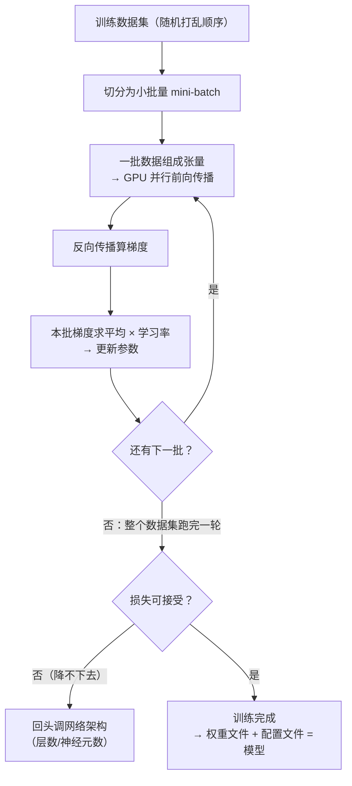

# 第 10 章 训练模式：批量、张量与模型文件

## 一、概念

反向传播讲完后，神经网络只剩最后一块：**实际训练时怎么组织数据、怎么更新参数**（三种梯度下降模式），以及训练完成后的产物——**模型文件**到底是什么。顺带澄清两组高频术语：**过拟合 / 欠拟合**、**训练框架 / 推理**。

## 二、原理推导

### 2.1 三种梯度下降模式（训练数据怎么喂）

| 模式 | 机制 | 特点 | 使用现状 |
|---|---|---|---|
| **SGD（Stochastic Gradient Descent，随机梯度下降）** | 每一步只取 **1 个样本**：前向 → 反向 → **立刻更新参数** → 下一个样本 | 梯度噪声极大、收敛剧烈震荡 | 早年小数据集用；**现代大模型基本不用**（见下方注） |
| **Full Batch（全批量梯度下降）** | **全部训练集**样本各自跑完前向+反向，**全部求平均**后更新一次参数；再跑下一轮全量 | 梯度方向最稳定、最理想；但**烧硬件烧成本、极慢**（大模型 200 多 TB 训练数据集受不了） | 几乎不用于大模型训练 |
| **Mini-Batch（小批量梯度下降）** | 数据集**切片**：一批一批跑，**每批求平均更新一次参数**，再跑下一批；循环往复 | 平衡稳定性与速度，显存可控 | **大模型主流，LLM / CV 模型全部默认使用** |

> **注（避免望文生义）**：表中 SGD 是**经典定义**（一次一个样本）。但 PyTorch 等框架里的 `SGD` 优化器实际执行的是 **mini-batch 更新 + 可选动量**，只是沿用了这个名字——看到代码里的 `SGD` 不要以为它在跑单样本。

**为什么单样本更新不行——梯度震荡过大**：
- 回想梯度下降的"黑夜山脉"比喻：**输入一变，整个损失曲面（山脉）就全变了**；
- 单样本模式下：你刚在这个样本的山上找到下坡、往下降了一点；下一个样本一来，山脉完全变了——你可能正好被"搬到山顶上"；
- 不同样本的山脉完全不同 → 参数被来回拉扯、剧烈震荡。

**为什么全批量不行**：理想最好，但训练数据动辄 200 多 TB，显存/内存爆炸、迭代极慢。

**小批量的细节**：
- 演示时"一个一个样本跑"是为了好理解——**实际是一起跑的**，靠**张量（tensor）**；
- **张量 = 多维数组**：0 维张量 = 标量；一维张量 = 向量；二维张量 = 矩阵；三维及以上 = 高阶张量；
- 为什么用张量：**GPU 的运行规则跟向量一样——不是一个个跑，而是一起跑（批量并行）**；
- 节奏：跑一批 → 求平均 → 更新参数 → 下一批 → 循环；整个数据集跑完一轮不够，**反复跑多轮**。

### 2.2 训练不求完美

- 训练**不追求完美结果**——完美结果谁都达不到；
- 人类神经元比计算机的数学公式**复杂得多得多**，至今没搞清楚人脑神经元到底怎么工作；你两个脑瓜仁干两天啥问题没有，计算机要烧好多好多的电才能训出一个模型；
- 小批量求平均时"东拉西扯"——照顾这边、照顾那边，拿到**大家都能接受**的结果就 OK；
- **损失降不下去时怎么办**：先看准确率能不能接受（如 98% → 收工）；如果只有 60% 且损失降不下去 → **网络架构有问题**（隐藏层太少/太多、整体设计不合理）→ 要回头调架构。

### 2.3 灾难性遗忘（Catastrophic Forgetting）

**训练数据要随机打乱顺序**。为什么不分批"先把 0 训好、再训 1、再训 2"？

- 先把各种 0 训到非常准 → 权重参数都往"识别 0"倾斜 → 模型只认识 0；
- 再训 1 → 调了一大堆把 1 认好了，**0 又忘了**；回头训 0，1 又完蛋——来回拉扯；
- 打乱顺序的本质：让各类样本"东拉西扯"地混合，模型对大家都能兼顾。

> **概念校准**：严格地说，灾难性遗忘指**模型在新任务 / 新数据分布上训练后，旧能力骤然下降**（持续学习场景，即便打乱顺序也可能发生）。按类别顺序训练带来的是**梯度被当前类别分布带偏**的问题——所以 shuffle（随机打乱）主要解决 batch 分布偏差，同时也能显著缓解遗忘。

### 2.4 过拟合与欠拟合

| 术语 | 含义 | 判断 |
|---|---|---|
| **泛化能力（generalization）** | 训练集里**没有**的东西，模型仍然认识、仍然能识别 | 泛化强 = 好模型 |
| **过拟合（overfitting）** | **只认识训练集**里的东西，训练集以外一塌糊涂 | 训练失败；**神经元/层数越多越容易过拟合** |
| **欠拟合（underfitting）** | 反过来——**连训练集都没认识清楚**，智能程度不够 | 参数/层数太少导致；要加容量 |

结论：神经元数量、层数**不是越多越好**——多了过拟合、少了欠拟合，要调到合适的值。

### 2.5 网络架构与训练框架

**网络架构（network architecture）**：前面讲的（分层、全连接）是**通用做法，不是唯一标准**——隐藏层设几层、每层多少神经元、是否全连接（可以部分连接）都需要设计；**不同的设计 = 不同的架构**。常见的几种：

| 架构 | 现状 |
|---|---|
| **全连接神经网络（FC / MLP，多层感知机）** | 结构最简单，是所有网络的基础形态；早期用于处理小规模数据，现已很少单独作为主干 |
| **CNN（Convolutional Neural Network，卷积神经网络）** | **局部连接 + 权重共享**；图像领域的经典架构（呼应第 7 章 2.8） |
| **Transformer** | **当前绝对主流**：图片、音频全用它；它起家于 NLP（自然语言处理），后来发现音频、视频什么都能用 |

**训练框架（训练框架 = 学习框架）**：
- **架构 = 图纸**（设计图，告诉你网络怎么设计）；
- **训练框架 = 把图纸落地成代码、真正跑起来**——"图纸都已经有了，带个红帽子开始干活了"——**这才是工程师真正出场的时候**；
- 两套框架：
  - 老的一套（如 TensorFlow 1.x、Caffe 等）：如今主要见于**存量项目**与**边缘计算（edge computing）**——手机等设备上的小训练/推理任务（大模型训练都在云端的训练机房/数据中心，不可能在家里搭训练集群）。它们在工业部署领域仍有使用，只是不再是新项目的首选；
  - **PyTorch**：**当前主力训练框架**，主流大模型都通过它训练。

### 2.6 训练 vs 推理（Inference）

- **推理 = 把前向传播走一次**；
- 训练阶段**每个 batch 都要跑「前向 → 反向 → 更新」**，与预测对错无关——只要损失不为 0，就需要反向传播算出梯度来更新参数；
- 训练完毕后，使用模型 = **只需前向传播、不做任何参数更新**——这个过程就叫推理；
- 本地开发、测试、调试时可以玩本地模型（用 PyTorch 跑前向传播）。

### 2.7 模型 = 权重文件 + 配置文件

训练完成的产物以**文件**形式存储：

| 文件 | 内容 | 作用 |
|---|---|---|
| **权重文件（参数文件）** | 权重 + 偏置（全部参数）| **最核心、占体积的主体**；使用时读出来放进网络就能跑 |
| **配置文件** | 网络架构描述：什么架构、多少层、每层神经元数量、隐藏层维度、权重精度等 | 光有权重无法复现网络结构——必须有配置文件 |

> **模型 = 权重文件 + 配置文件，这就是"模型"的全部含义。**
> 所以下载本地模型时，占体积的就是权重；配置文件几乎不占体积。使用时用 PyTorch（既是训练框架也是推理框架）把前向传播走一次即可。

## 三、白板 / 演示步骤（按讲解顺序还原）

1. **回顾单样本更新的问题**：演示网页里"一次只取一个样本"→ 引出梯度震荡。
2. **展开三种梯度下降笔记**：SGD / Full Batch / Mini-Batch 的机制、特点、使用现状逐条列出。（对比笔记见 2.1）

3. **讲张量与 GPU**：批量数据组成张量（多维数组），GPU 并行一起跑。
4. **讲灾难性遗忘**：按 0→1→2 顺序训练的来回拉扯，所以数据要打乱。
5. **讲过拟合/欠拟合**：容量多与少的两端问题。
6. **画架构与框架的关系**：架构=图纸，训练框架=施工；介绍 PyTorch 与边缘计算。
7. **拆开"模型"**：权重文件（大头）+ 配置文件（架构描述）；推理 = 只跑前向传播。

## 四、关键结论 / 公式

1. 三种梯度下降：**SGD（单样本，震荡大）→ Full Batch（全量，最稳但烧钱）→ Mini-Batch（小批量求平均，当前主流）**。
2. **张量 = 多维数组**；用张量是因为 **GPU 天生批量并行**——不是一个个跑，是一起跑。
3. 训练数据**必须随机打乱**：否则各类样本分布不均、**梯度被当前类别带偏**，顺序训练会出现"训 1 忘 0"；随机打乱同时能显著缓解灾难性遗忘（标准定义见 2.3）。
4. **过拟合 = 只认识训练集；欠拟合 = 连训练集都学不会**——容量多了过拟合、少了欠拟合。
5. 架构是图纸，**训练框架是施工**：PyTorch 是当前主力；老框架活在边缘计算。
6. **推理 = 只跑前向传播**；训练框架同时包含两者。
7. **模型 = 权重文件 + 配置文件**——权重占体积，配置描述架构。

用 Mermaid 还原训练循环（竖向）：

## 本节要点回顾

- 三种梯度下降一句话：**SGD 单样本噪声大；Full Batch 最稳但烧钱；Mini-Batch 是大模型主流**。
- **张量 = 多维数组**，配合 GPU 批量并行——实际训练是一起跑的。
- 训练数据**随机打乱**：避免各类样本分布不均、梯度被当前类别带偏（顺序训练会出现"训 1 忘 0"），同时显著缓解灾难性遗忘。
- **过拟合（只认训练集）/ 欠拟合（训练集都学不会）**——容量不是越多越好。
- **架构 = 图纸；训练框架 = 施工**；PyTorch 是主力训练框架，老框架退守边缘计算。
- **推理 = 只跑前向传播、不更新参数**（训练才需要跑反向传播，与预测对错无关）。
- **模型 = 权重文件 + 配置文件**——权重占体积，配置描述架构，二者缺一不可。
- 至此神经网络部分完结：前向传播 → 损失 → 梯度下降 → 反向传播 → 训练模式 → 模型文件，闭环完成。
