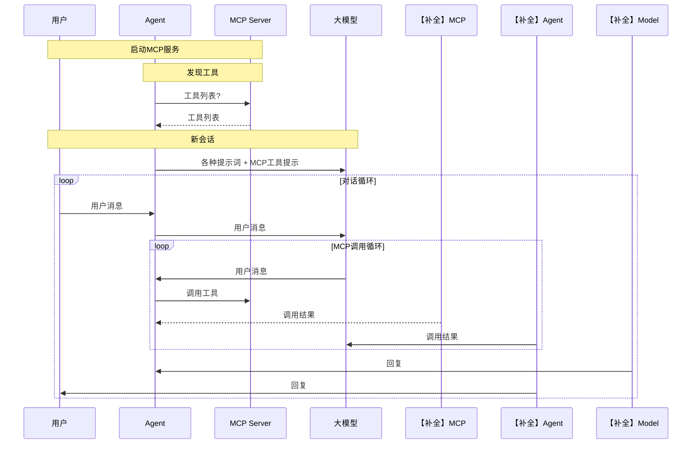

# 课件原文

> 本文件为课程配套课件 `课件.md` 的原样存档（2026-09-18 由 Xjq 提供）。
> 标注 `【补全】` 处为原文档中 Mermaid 代码块被截断、依课件截图与课程内容补齐的部分。

---

## AI效能工具

AI编程（可控性）

1. 技术认知：最核心
2. 范式：工具无关
3. 工具使用：概念

---

## 工具使用

### 工具选择

IDE + Coding Agent + 模型

1. IDE集成：VSCode、Cursor、Trae、....

2. IDE + Coding Agent + 模型：
- Coding Agent：Claude Code、Codex、OpenCode、....
- 模型：Claude Sonnet、Claude Opus、Codex、Gemini、Kimi、GLM、Minimax、...

### Coding Agent原理

#### tools

#### 会话

#### 提示词

#### 深度思考/推理/思维链

#### MCP



> 说明：课件原图在「Agent->>MCP: 调用工具」处截断，以上虚线部分依课件截图（存档于 `assets/_原始拍照/06_mcp_flow.jpg`）与课程讲解补齐。
> 图中 `Model->>Agent: 用户消息` 一行，按讲解语义应为「模型决定调用工具，向 Agent 发起请求」。

#### Skill

```mermaid
graph TD
    A[新会话] --> B{渐进式加载}
    B -->|首轮| C[系统提示词 + Skill描述]
    B -->|按需| D[详细Skill内容]
    C --> E[上下文占用小]
    【补全】D --> E
```

> 说明：课件原图在「C --> E」处截断，补全 `D --> E` 使图闭合（详细内容按需加载，同样不撑大上下文）。

#### Sub Agent

#### 长期记忆

### 开发范式

vibe coding / spec coding

---

## 最佳实践

1. 每一个会话应该保持独立和连续
2. 提示词始终保持精简
3. 文档尽量的细粒度拆分
4. skill数量不宜超过12个
5. 独立、并行任务适合使用子代理完成
6. 奖罚分明，有利于形成长期记忆
