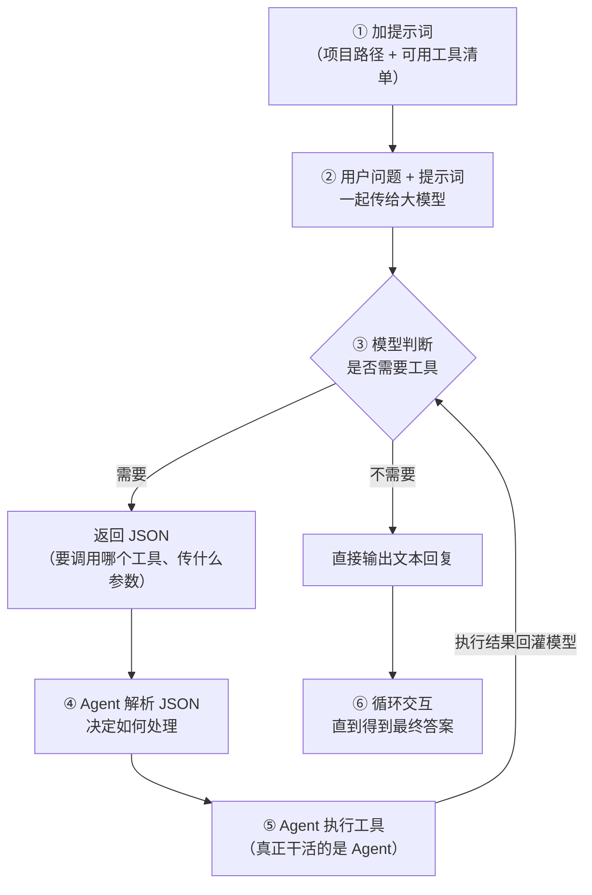
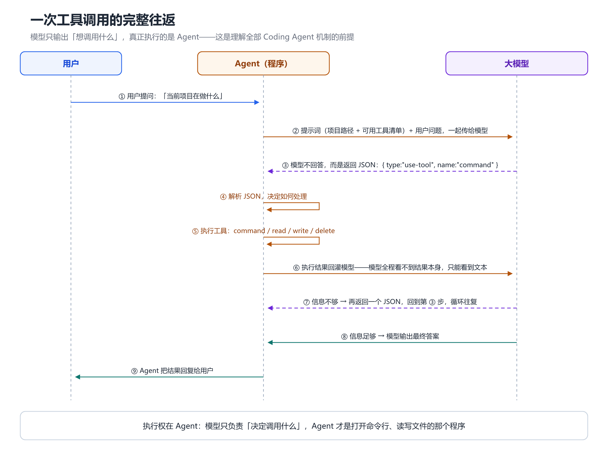
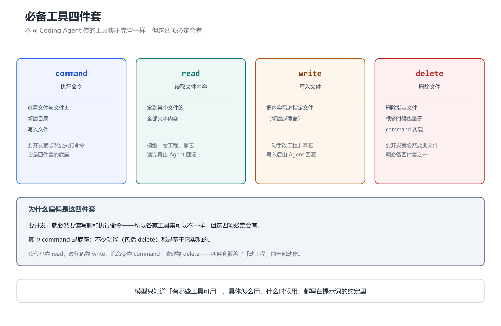
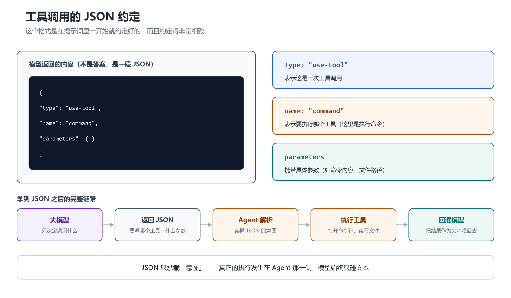
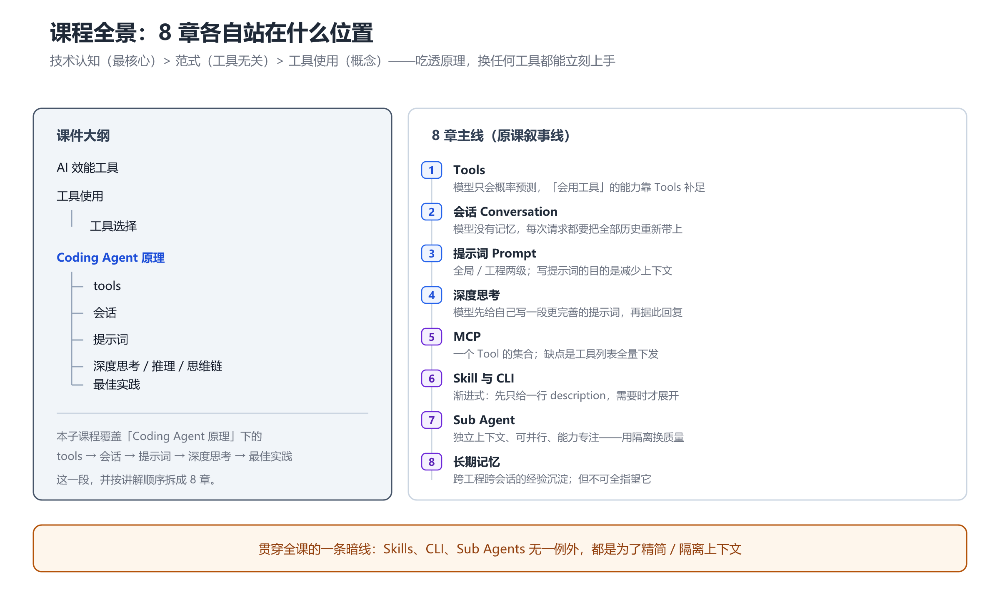

# 第 1 章 Coding Agent 与 Tools：从「只会预测」到「动手改工程」

## 一、概念

### 1.1 课程的三条主线

课件开篇给出 AI 编程（可控性）的三条主线，并标明了优先级：

| 主线 | 内容 | 说明 |
|---|---|---|
| 技术认知 | **最核心** | 理解原理，才知道边界在哪 |
| 范式 | 工具无关 | 换任何工具都能迁移 |
| 工具使用 | 概念 | 具体操作层 |

> 讲师反复强调一个判断：**所有 Coding Agent 工具「换汤不换药」**，玩不出新花样，也没有难以逾越的技术鸿沟。所以吃透原理，换任何工具都能立刻上手；只学操作，换个场景就不会用，工具一更新又懵。

### 1.2 Agent 是什么

- **Agent** 原意是「代理」，国内译作「智能体」。
- 它**不是一个严格的技术名词**——讲师类比「H5」：大家都这么叫，但没人能给出官方定义。
- 从功能上理解：**一个功能强大的 AI 应用**。
- 从职责上理解：**代理用户去和模型通信的程序**。

关键一点：**Agent 本身是个程序**——用 TypeScript / Node / Python 写的代码。**它才是工具的真正执行者**。

### 1.3 工具选型：IDE + Coding Agent + 模型

课件给出的三层结构：

| 层 | 说明 | 代表 |
|---|---|---|
| IDE 集成 | 编辑器工作区 | VSCode、Cursor、Trae… |
| Coding Agent | 执行工具调用的代理 | Claude Code、Codex、OpenCode… |
| 模型 | 负责决策的推理内核 | Claude Sonnet / Opus、GPT Codex、Gemini、Kimi、GLM、MiniMax… |

三层可自由组合。讲师的态度是：**选哪个都行，差异不大**——因为底层原理一致。

### 1.4 开发范式

课件列出两个名词（音频未展开，此处仅作名词记录）：

- **vibe coding** —— 氛围编程，凭感觉描述需求，让 AI 自由发挥
- **spec coding** —— 规范驱动开发（SDD, Spec-driven development），先写规格文档，再让 AI 按规格实现

## 二、原理推导

### 2.1 问题引入：模型凭什么知道项目在做什么

给 AI 一句「总结一下这个项目在干什么」，它能做到——但它怎么做到的？

如果直接把这句话丢给大模型，模型是懵的：它不知道项目路径，不知道有哪些文件，也不知道该从哪下手。

根源在于**大模型的本质**：

```text
大模型 = f( Token 列表 ) → 下一个 Token 的概率分布
```

它只会做概率预测，此外什么都不知道。所以「知道项目」这件事，**不可能由模型自己完成**。

### 2.2 解法：六步流程

课件给出的六步流程（Coding Agent 的核心机制）：

1. **加提示词**
   - 告诉大模型，目前项目代码的路径
   - 告诉大模型，可以使用哪些工具
2. **将用户问题和提示词一起传递给大模型**
3. **大模型根据情况决定是否要使用工具**。当需要使用工具的时候，它会返回一个 **JSON 格式**
4. **Agent 拿到这个 JSON 格式**，然后根据 JSON 格式的内容决定接下来如何处理
5. **Agent 将执行的结果返回给模型**，又输入给大模型
6. **后续继续交互性的操作**，大模型跟 Agent 之间不停地交互，直到得到一个最终的答案

用 Mermaid 还原六步流程（竖向）：



### 2.3 工具调用的 JSON 约定

模型返回的 JSON 大致形如（示意图见「三、演示步骤」末）：

```json
{
  "type": "use-tool",
  "name": "command",
  "parameters": { }
}
```

- `type: "use-tool"` —— 表示这是一次工具调用
- `name: "command"` —— 表示要执行一个命令
- `parameters` —— 携带具体参数

这个格式是**在提示词里一开始就约定好的**，而且约定得非常细致。

### 2.4 常用工具

课件列出的常用工具：

| 工具 | 作用 |
|---|---|
| `command` | 执行命令——查看文件 / 文件夹、新建目录、写入文件 |
| `read` | 读取某个文件的内容 |
| `write` | 写入文件 |
| `delete` | 删除文件（很多时候也基于 `command` 实现） |

不同 Coding Agent 传的工具集不完全一样，但 `command` / `read` / `write` / `delete` 这几项**必定会有**——因为要开发就必然要读写删和执行命令。

### 2.5 关键洞察：执行者是 Agent，不是模型

- 模型只输出「我想调用什么」，**它自己不会执行任何东西**。
- Agent 拿到 JSON 后，作为一个程序去真正执行（打开命令行、运行命令、读取文件）。
- 执行结果再由 Agent 回灌给模型，模型据此决定下一步。

这解释了为什么**模型永远看不到执行结果本身**——它只能看到 Agent 喂给它的文本。

## 三、演示步骤（按讲解顺序还原）

讲师用「手工模拟 Agent」的方式把这套流程走了一遍：

1. **写提示词**：设定角色（「你是一个前端工程师」）+ 项目位置 + 可用工具清单（`ls` 查看目录、`read` 读取文件），并约定「需要用工具时用 JSON 格式输出，不需要则正常输出」
2. **提出问题**：「当前项目在做什么」
3. **模型返回**：不是答案，而是一个 JSON——表示要调用 `command` 工具执行 `ls`
4. **Agent 执行**：讲师扮演 Agent，实际去运行 `ls`，拿到文件列表
5. **结果回灌**：把文件列表扔回给模型
6. **模型继续**：要求读 `package.json`
7. **Agent 再执行**：读出 `package.json` 内容，回灌
8. **模型继续**：要求读 `index` 入口文件
9. **循环往复**：直到模型认为信息足够，输出对项目的总结

整个过程中，模型与 Agent **来回交互了很多轮**——这就是「六步流程」中第 6 步的实态。









## 四、关键结论

1. **大模型本质是 `f(Token 列表) → 概率分布`**，它不知道项目在哪、有什么文件——「知道项目」这件事必须靠 Tools 补足。
2. **六步流程**：加提示词 → 传模型 → 模型返回 JSON → Agent 解析 → Agent 执行并回灌 → 循环至最终答案。
3. **工具调用的 JSON 约定在提示词里就定好了**，格式非常细致（`type` / `name` / `parameters`）。
4. **`command` / `read` / `write` / `delete` 是必备四件套**，多数功能也基于 `command` 实现。
5. **模型只负责「决定调用」，Agent 才是执行者**——Agent 是一个程序（TS / Node / Python 写的）。
6. **三层选型（IDE / Coding Agent / 模型）可自由组合**，选哪个差异不大，因为底层原理一致。
7. **技术认知 > 范式 > 工具使用**——理解原理才具备跨工具迁移的能力。

## 本节要点回顾

- 课程三条主线：**技术认知（最核心）/ 范式（工具无关）/ 工具使用（概念）**。
- Agent = 代理用户与模型通信的**程序**；不是严格技术名词（类比 H5）。
- 大模型只会做概率预测，**「总结项目」的能力来自 Tools，不来自模型**。
- 六步流程是全部机制的骨架，后面讲的 MCP、Skill 都是它的变体。
- 工具调用走 JSON：`type: use-tool` + `name` + `parameters`。
- 必备工具四件套：`command` / `read` / `write` / `delete`。
- **执行权在 Agent，模型只输出意图**——这是理解后续所有机制的前提。
- 开发范式两个名词：vibe coding（氛围编程）/ spec coding（规范驱动开发）。
