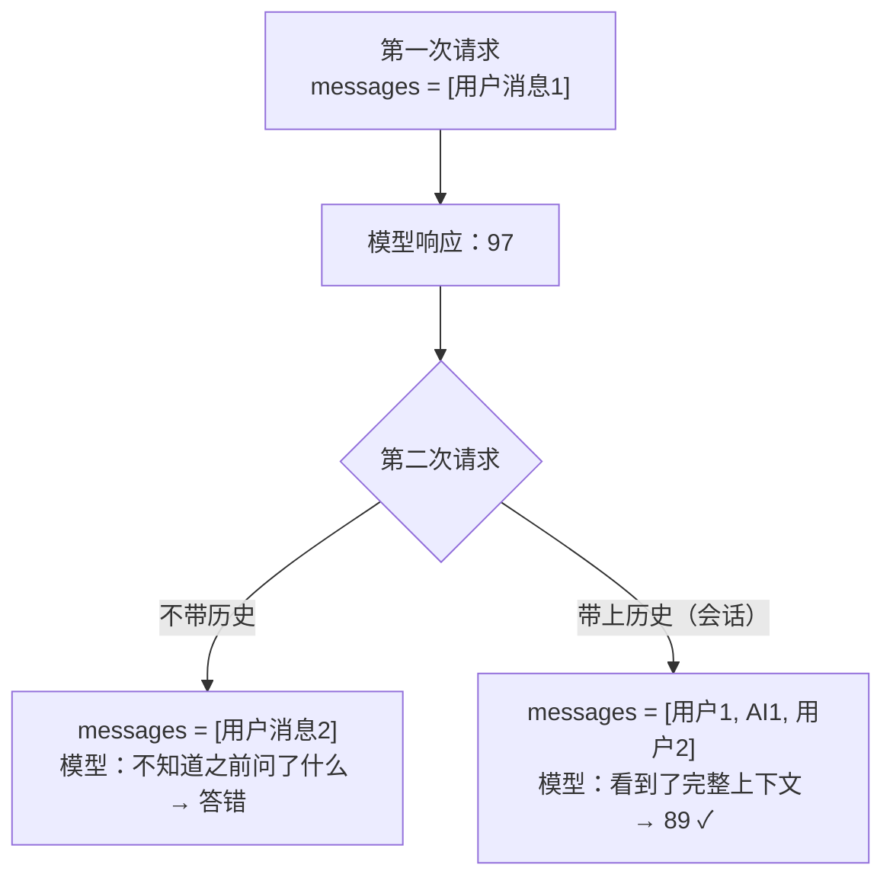
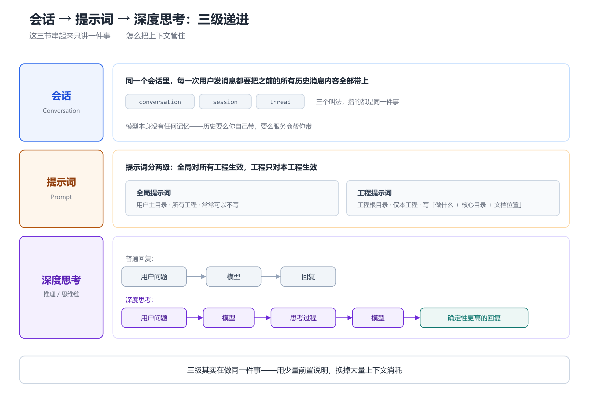
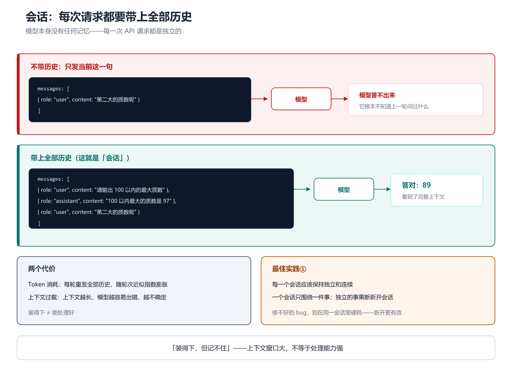

# 第 2 章 会话 Conversation：为什么每次都要带上全部历史

## 一、概念

**会话**是不同工具里叫法最混乱的一个概念：

| 叫法 | 常见于 |
|---|---|
| `conversation` | 通用叫法 |
| `session` | 通用叫法 |
| `thread`（线程） | Codex 等 |

三个词指的是同一件事：**一个连续对话的上下文容器**。

课件的定义只有一句话：

> 在同一个会话里边，每一次用户发消息都要把之前的所有历史消息内容全部带上。

理解这句话，就理解了会话的全部。

## 二、原理推导

### 2.1 问题引入：模型没有记忆

讲师用发**原始 HTTP 请求**的方式做了演示，绕开所有工具，直击本质。

**第一次请求**（`POST` 到模型服务，请求体里带 `messages`）：

```text
messages: [ { role: "user", content: "请输出 100 以内的最大质数" } ]
```

响应正确：**97**。

**第二次请求**（只改了问题，历史一个字都没带）：

```text
messages: [ { role: "user", content: "第二大的质数呢" } ]
```

响应：模型答不出来，只能泛泛地说「数学上不存在第二大的质数」之类。

原因很直白：**每一次 API 请求都是独立的**，模型根本不知道上一轮问过什么。它就像每次都被格式化了一次记忆。

### 2.2 解法：把历史全部带上

第二次请求时，把历史消息**全部塞进 `messages` 数组**：

```text
messages: [
  { role: "user",      content: "请输出 100 以内的最大质数" },
  { role: "assistant", content: "100 以内最大的质数是 97" },
  { role: "user",      content: "第二大的质数呢" }
]
```

这次模型答对了：**89**。

这就是会话：**每发一条新消息，都要把之前的所有消息重新发一遍**。

用 Mermaid 还原两种链路（竖向）：



### 2.3 服务商封装

有些模型服务商已经把这个动作**在服务端代劳**了：

- 你只需要带一个**会话 ID**（配置项可能叫 `conversation` / `thread` / `session`）
- 服务商自己维护历史，你不用重复拼装

有些服务商没有做，就需要客户端（也就是 Coding Agent）自己维护并携带历史。

> 这个边界有点模糊，但原理不变：**历史要么你自己带，要么服务商帮你带**。

### 2.4 最佳实践①：每个会话保持独立和连续

课件第一条最佳实践：

> 每一个会话应该保持独立和连续。（尽量减少会话中的内容）

两个原因：

| 原因 | 说明 |
|---|---|
| **Token 消耗** | 每轮都要重发全部历史，随轮次增长**近似指数级**膨胀 |
| **上下文过载致幻觉** | 上下文越长，模型越容易出错、结果越不确定 |

操作建议：

- 一个会话**只围绕一件事**
- 相关的事放一起；**独立的事果断新开会话**
- 「经常地去新开会话」

### 2.5 关键认知：装得下，但记不住

讲师的原话很关键：

> 现在大模型它的上下文窗口是够的，**它装得下，但它记不住**。

装得下 ≠ 能处理好。上下文窗口再大，内容一多，模型的表现就会退化。

**一个典型现象**（讲师特别提到）：

> 一个 bug 第一次没解决，后面大概率也解决不了，而且概率越来越低。

原因就是反复在同一会话里尝试，上下文持续膨胀，模型越来越糊。**这时候正确做法是新开会话重来**，而不是继续追问。

## 三、演示步骤（按讲解顺序还原）

1. **建 key、拼 HTTP 报文**：`POST` 到模型服务地址，头部带 `Content-Type`、`Authorization`
2. **写请求体**：指定模型（如 `kimi`）、`messages` 数组（可含 system 提示词，也可不要）
3. **第一次提问**：「请输出 100 以内的最大质数」→ 响应 **97**（响应里同时包含「推理过程」与「响应内容」两部分）
4. **保存**：把请求体与响应各存一份，便于后面拼历史
5. **第二次提问**：「第二大的质数呢」（**不带历史**）→ 模型答不出来
6. **补历史再发**：把 `[用户1, AI1, 用户2]` 一起发过去 → 这次答对 **89**
7. **得出结论**：同一会话内，每次发消息都要把之前全部内容带上





## 四、关键结论

1. **会话的本质 = 每次请求都携带全部历史消息**，因为模型本身没有任何记忆。
2. **`conversation` / `session` / `thread` 是同一件事的三个叫法**。
3. **不带历史 → 模型答不出**（质数演示）；**带上历史 → 答对**。
4. 有些服务商在服务端代劳（只传会话 ID 即可），有些需要客户端自己拼。
5. **最佳实践①：每个会话保持独立和连续**，尽量减少会话中的内容。
6. 两个代价：**Token 消耗近似指数增长** + **上下文过载导致幻觉**。
7. **「装得下，但记不住」**——上下文窗口大不等于处理能力强。
8. **bug 第一次没修好，就别在同一会话里硬耗**——新开会话往往更有效。

## 本节要点回顾

- 会话 = **每次发消息都带上之前所有历史**，没有例外。
- 三个叫法：`conversation` / `session` / `thread`。
- 质数演示：不带历史答不出，带上历史答对（97 → 89）。
- 服务商可能代劳，但原理不变：**历史总得有人带**。
- **最佳实践①：会话保持独立和连续**。
- 上下文越长 → Token 越贵 + 越容易幻觉；**能装下 ≠ 能记住**。
- 独立的事新开会话；**修不好的 bug 要换会话重来**。
