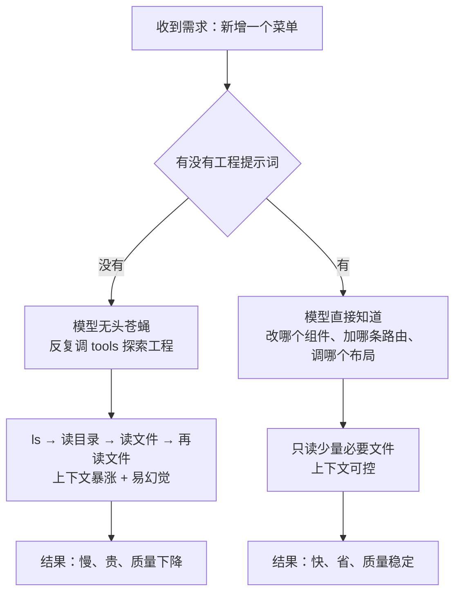

# 第 3 章 提示词 Prompt：全局与工程两级约定

## 一、概念

除了系统自带的提示词之外，用户可以**自己编写提示词**。这些提示词会**附着在每一次会话里**——按第 2 章讲的，会话每次都要把内容带上，提示词也不例外。

Coding Agent 的提示词分为两级：

| 类型 | 存放位置 | 生效范围 |
|---|---|---|
| **全局提示词** | 用户主目录下的**工具专属子目录**（`~/.claude/CLAUDE.md`、`~/.codex/AGENTS.md`） | **所有工程** |
| **工程提示词** | 工程根目录 | **仅当前工程** |

全局提示词并非直接放在用户主目录，而是放在主目录下**带工具名的子目录**里。

顾名思义：全局的对所有工程生效；工程的只有配置好的那个工程生效，**每个工程可以不一样**。

## 二、原理推导

### 3.1 具体位置

不同工具的文件名与位置略有差异，但道理相同：

| 工具 | 全局提示词 | 工程提示词 |
|---|---|---|
| Claude Code | `~/.claude/CLAUDE.md`（用户主目录下的 `.claude` 子目录） | 工程根目录的 `CLAUDE.md` |
| Codex | `~/.codex/AGENTS.md`（用户主目录下的 `.codex` 子目录） | 工程根目录的 `AGENTS.md` |

配置方式两种都行：

- **直接新建文件**（用代码编辑器在工程根目录建 `AGENTS.md`）
- **走设置界面**（Codex 的设置里有「个性化」，配的是全局提示词）

### 3.2 最佳实践②：提示词始终保持精简

课件第二条最佳实践：

> 提示词始终保持精简。

**判断标准只有一句话**：

> 这件事是不是**所有工程、所有会话、每一个对话**都需要？不是，就不要写。

- **全局提示词很多时候可以不写**。理由是：后续还有很多别的信息注入手段——比如让它去阅读某些文档——不必把所有信息都堆在提示词里。
- 讲师自己的全局提示词只有两句话：

  > 「不要自行决定，你不确定的话一定要问我。」

  第二句转写为「保管理系」（含义存疑）。

  > 注：此处转写含糊（"保管理系"），疑为"保持理性"，未作臆断。

  （第一句的原因是遇到过很多次 Agent 自作主张的情况）

- 有些同学在全局提示词里「这样要求、那样要求，写一大堆」——**它根本就记不住**。

### 3.3 工程提示词写什么

| 写什么 | 说明 |
|---|---|
| 工程大体在做什么 | 让模型知道业务背景 |
| 核心目录结构 | 关键目录即可，不重要的目录不用写 |
| 重要文档的位置 | 告诉模型去哪找细节 |

Git 提交规范这类，**可写可不写**。

### 3.4 反直觉的关键点：写提示词是为了减少上下文

这是本章最重要的一点，也是讲师反复强调的：

> 写提示词**最重要的目的，就是减少上下文**。

听起来矛盾——提示词不是增加上下文吗？逻辑是这样的：

```text
不写提示词：
  模型是「无头苍蝇」，不知道从哪下手
  → 反复调用 tools 探索工程（ls → 读目录 → 读文件 → 再读文件）
  → 大量上下文消耗

写了提示词：
  模型直接知道该去哪、做什么
  → 少读大量文件
  → 上下文反而更少
```

**讲师的例子**：让它「新增一个菜单」。

- **没有工程提示词**：它得先把整个工程摸一遍，才知道前端在哪、路由在哪
- **有工程提示词**：它直接知道要去改组件、加路由、调布局

用 Mermaid 还原两种路径的上下文消耗（竖向）：



这里还有一个前提：**上下文越多，模型越容易产生幻觉，表现反而越差**——这一现象第 2 章已经讲过（详见第 2 章），不再重复。放到本章的语境里，既然上下文是越堆越糟的资源，那么用少量前置说明换掉大量探索式读取就是划算的。

### 3.5 工具的存在意义：都在为精简上下文服务

讲师点明了一个贯穿全课的观察：

> 后面很多乱七八糟的工具，都是为了去精简上下文——像什么 Skills、什么 CLI、什么 Sub Agents，无一例外。

提示词是这套思路的**第一层**：用**少量**的前置说明，换掉**大量**的探索式读取。

## 三、演示步骤（按讲解顺序还原）

1. **看全局提示词**：打开用户主目录下工具专属子目录里的 `CLAUDE.md`（`~/.claude/CLAUDE.md`，或 `~/.codex/AGENTS.md`）——讲师那份只有两句话
2. **看工程提示词**：打开工程根目录下的 `AGENTS.md`——描述工程在做什么 + 核心目录
3. **配置方式演示**：Codex 设置 → 个性化 → 配全局提示词；工程提示词则在工程根目录新建文件
4. **讲师口头举例**（非真机演示）：新增菜单 → 新建组件 / 新建路由 / 布局加菜单；有提示词时模型直接知道该改哪，无需反复读工程


## 四、关键结论

1. **提示词分两级**：全局（用户主目录下的工具专属子目录，所有工程）/ 工程（工程根目录，仅本工程）。
2. **具体文件**：Claude Code 用 `CLAUDE.md`，Codex 用 `AGENTS.md`；全局在 `~/.claude/CLAUDE.md`、`~/.codex/AGENTS.md`，工程在工程根目录。
3. **最佳实践②：提示词始终保持精简**。
4. **判断标准**：是不是所有工程、所有会话、每一个对话都需要？不是就不写。
5. **全局提示词常常可以不写**；讲师自己只写了两句（含「不确定一定要问我」）。
6. **工程提示词写三样**：工程在做什么 / 核心目录结构 / 重要文档位置。
7. **反直觉核心**：写提示词的**目的是减少上下文**——不写会导致模型无头苍蝇式探索，反而消耗更多。
8. **提示词是「以少量前置说明换掉大量探索」的第一层手段**，后续的 Skills / CLI / Sub Agents 是同一思路的延伸。

## 本节要点回顾

- 提示词两级：**全局（所有工程）/ 工程（仅本工程）**。
- 位置：Claude Code → `CLAUDE.md`；Codex → `AGENTS.md`；全局在主目录下的工具专属子目录（`~/.claude/CLAUDE.md`、`~/.codex/AGENTS.md`），工程在工程根目录。
- **最佳实践②：提示词始终保持精简**；写之前先问「能不能不写」。
- **全局提示词常常可以不写**；工程提示词写「工程做什么 + 核心目录 + 文档位置」。
- **反直觉**：写提示词的目的是**减少**上下文（避免无头苍蝇式探索）。
- 一句经验：**「不要自行决定，不确定一定要问我」**值得写进全局提示词。
- 后续所有机制（Skills / CLI / Sub Agents）都在做同一件事：**精简上下文**。
