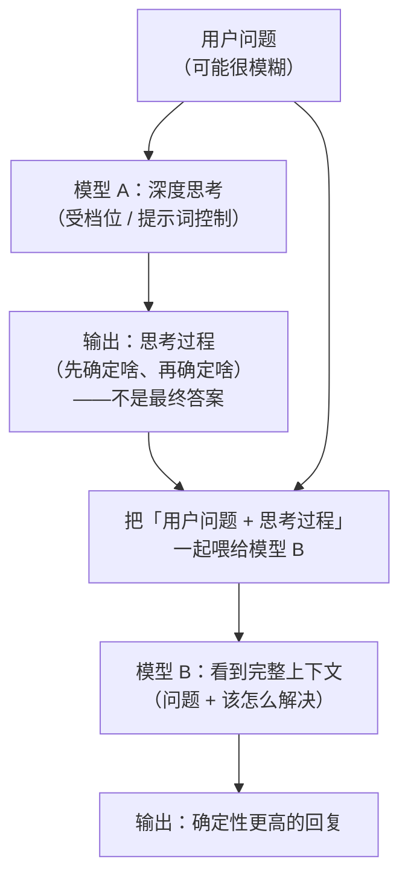

# 第 4 章 深度思考：让模型先给自己写提示词

## 一、概念

**深度思考**是同一件事的多个叫法之一：

| 叫法 | 常见于 |
|---|---|
| 深度思考 | 国内通用叫法 |
| 推理（reasoning） | 部分工具 |
| 思维链（Chain of Thought） | 学术 / 部分工具 |

三个词**一个意思**。

在工具层面，它是一个可以**调节的档位**：

| 工具 | 档位形式 |
|---|---|
| Codex | 低 / 中 / 高 / 超高 |
| Claude Code | 开关式（两档切换） |

有些工具甚至没有档位可选，只有「有」或「没有」。

## 二、原理推导

### 4.1 问题引入：用户问题和回复之间「差着东西」

原始的交互模式是这样的：

```text
用户问题 → 模型 → 回复
```

讲师指出这个模式的问题：**用户的问题和最终回复之间，差着很多东西**。

**具体例子**：给一个幼儿学习应用加功能，只说一句「给我加一个学习自然拼读的功能」。

这句话本身非常模糊：

- 自然拼读要怎么学？一个字母一个字母教发音？
- 要不要做一个子页面？
- 交互怎么设计？

而模型**不会追问**——按讲师的说法：

> 它管你给我的是啥，它才不会想那么多，就往下面预测就完事了。

结果就是：**很多事情都没想清楚，就开始动手了**。这是很多人用 AI 编程时的典型痛点。

### 4.2 解法：两段式链路

```text
用户问题 → 模型（深度思考）→ 思考过程 → 再喂给模型 → 确定性更高的回复
```

对比原始模式：

```text
原始：用户问题 ──────────────────→ 模型 → 回复
深度：用户问题 → 模型 → 思考过程 → 模型 → 确定性更高的回复
                          ↑
                    （不是最终答案）
```

关键点：

- 第一个模型**输出的不是最终答案，而是思考过程**
- 思考过程会被**再喂给（另一个或同一个）模型**
- 此时模型看到两样东西：**用户的问题** + **它应该怎么完成这个功能**
- 于是输出的答案**更精准、确定性更高**

### 4.3 本质：模型给自己写提示词

讲师给了一个非常精辟的概括：

> 相当于是**模型自己生成给自己的提示词**。

- 用户写的提示词粗略没关系（「你不是写得挺粗略吗，没问题」）
- 模型自己把它完善一遍（「那么详细？那我帮你写，我帮你把它完善一下」）

所以深度思考本质上就是**一次自动的提示词补全**——把模糊需求展开成结构化的执行计划。

用 Mermaid 还原深度思考的两段式链路（竖向）：



### 4.4 两种触发方式

| 方式 | 说明 | 例子 |
|---|---|---|
| **训练内置** | 模型训练时就带推理能力，做啥事都先深度思考 | DeepSeek R1 |
| **提示词触发** | 靠提示词告诉模型「你要深度思考，先别给答案」 | 多数通用模型 |

另外，有些**模型服务商在服务端就把这套流程处理好了**，客户端不用管；有些则需要 Agent 自己串联两次调用。

### 4.5 使用层面：动态调节，没有固定答案

讲师的建议是**动态调节**：

1. 先开个中等档位试一下
2. 看结果符不符合预期
3. **如果发现它没想清楚就开始干活 → 往上调一档**
4. 调到最高还不行 → **得靠其他手段了**（也就是第 5–7 章讲的工具链机制）

> 这个东西是动态调节的，它没有说一定的。

## 三、演示步骤（按讲解顺序还原）

1. **展示档位**：在 Codex 里找到推理档位（低 / 中 / 高 / 超高）；在 Claude Code 里则是两档开关
2. **提出模糊需求**：以「给英语模块加一个自然拼读功能」为例，说明需求本身的模糊程度
3. **演示原始链路**：直接提问 → 模型没想清楚就动手
4. **演示深度思考链路**：让模型先输出思考过程 → 再把「问题 + 思考过程」喂给模型 → 得到确定性更高的回复
5. **给出调节建议**：结果不符预期就调高档位，调到顶仍不行就换其他手段

## 四、关键结论

1. **深度思考 / 推理 / 思维链是同一件事的三个叫法**。
2. **原始链路的问题**：用户问题与回复之间「差着东西」，模型不会追问，没想清楚就动手。
3. **解法是两段式**：`用户问题 → 模型 → 思考过程 → 模型 → 确定性更高的回复`。
4. **本质：模型给自己生成更完善的提示词**——把模糊需求展开成结构化计划。
5. **两种触发**：训练内置（如 DeepSeek R1）/ 提示词触发。
6. **服务商可能代劳**：有些在服务端就处理好了，有些需要 Agent 自己串两次调用。
7. **档位是动态调节的**：结果不符预期就调高；调到顶仍不行，**要靠后续的工具链手段**。
8. **深度思考解决的是「需求模糊」，不解决「上下文过载」**——后者要靠第 6、7 章的机制。

## 本节要点回顾

- 三个叫法：**深度思考 / 推理 / 思维链**。
- 问题：**需求模糊时模型不会追问，没想清楚就动手**。
- 解法：让模型先输出**思考过程**，再把「问题 + 思考过程」喂回模型。
- **本质 = 模型给自己写提示词**，把粗略需求完善成结构化计划。
- 触发方式：训练内置（DeepSeek R1）或提示词触发。
- 档位：Codex 有低 / 中 / 高 / 超高；Claude Code 是开关式。
- **动态调节**：不符预期就调高；调到顶还不行 → 靠工具链（MCP / Skill / Sub Agent）。
