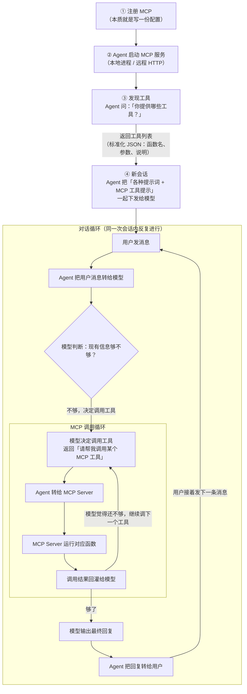
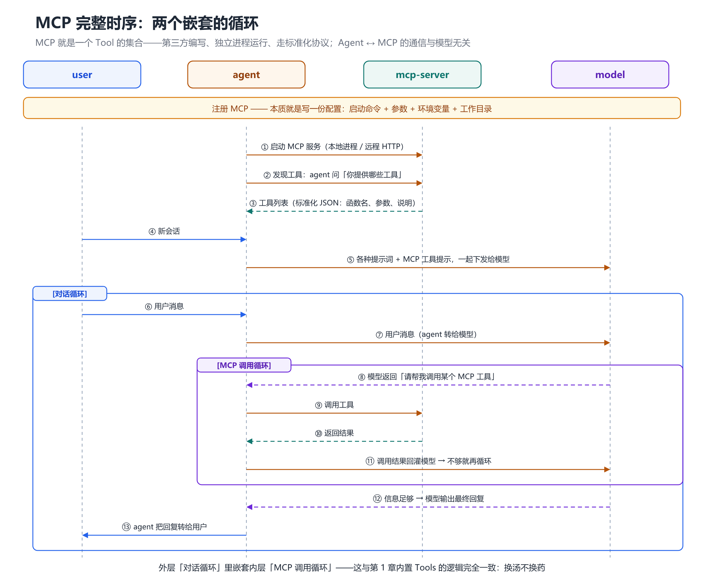

# 第 5 章 MCP：一个 Tool 的集合

## 一、概念

**一句话理解**：

> MCP 就是一个 **Tool 的集合**。

更完整一点：MCP 是由**第三方编写**、以**独立进程**运行的外部程序，它把一组工具打包在一起，通过**标准化协议**与 Agent 通信。

与内置 Tools 的对比：

| | 内置 Tools | MCP |
|---|---|---|
| 来源 | 官方写死在 Agent 里 | 第三方编写 |
| 形态 | 类似进程内的一个个函数 | **独立进程**（本地启动或远程访问） |
| 通信 | 直接调用 | **标准化协议**（JSON 格式） |
| 可扩展性 | 用户一般无法自定义 | **可自定义、可安装** |

**两者不是二选一**。内置 Tools 与 MCP 工具在实际运行中是**混合在出现、混合处理的**：同一次对话里，模型可能一会儿调用内置 Tools、一会儿调用 MCP，由模型统一决策这一步该用哪个。

> 背景补充：讲师提到 MCP 是 2025 年初出现的概念，当前有「MCP 快死了」的声音，但由于生态庞大，仍会持续一段时间，因此值得花几分钟了解。这一章的要求只是**知道 MCP 是什么**，将来面对面试题、以及第 6 章 MCP 与 Skill 的对比时能答上来即可；真要开发一个 MCP，属于 Agent 应用开发课程的内容。

## 二、原理推导

### 5.1 完整流程

涉及四个角色：**用户 / Agent / MCP Server / 模型**。

课件原图用 `sequenceDiagram` 绘制，含**两层嵌套的 `loop`**：外层是「对话循环」，内层嵌在其中的是「MCP 调用循环」。本仓库的 Mermaid 统一用 `graph TD`，因此改用**两层嵌套的 `subgraph`** 表达同一语义。

用 Mermaid 还原 MCP 的完整调用链路（竖向）：

读图要点：**「模型决定调用工具」→「调用结果回灌给模型」在「MCP 调用循环」里打转**（模型不满意就再调一次），**「模型输出最终回复」→「Agent 把回复转给用户」回到「对话循环」**，用户再发消息又回到起点。整条链路不是「走一遍就完」，而是**两层回环**。

**流程要点逐条说明**：

1. **注册 MCP** —— 就是在配置里写上启动命令与参数，配好即完成注册
2. **Agent 启动 MCP 服务** —— 有些 MCP Server 在远端（通过 HTTP 通信），很多在本地；总之会在本地开启一个服务
3. **发现工具** —— Agent 启动后问一句「请问你这个服务里给我提供了哪些工具」，MCP 返回**标准化 JSON 格式**的工具列表，包含：有哪些函数、每个函数要传哪些参数、每个参数什么意思、什么情况下用
4. **新会话** —— 开新会话时，Agent 除了发送各种系统提示词，还会告诉模型「你目前有这些 MCP 工具可用」
5. **对话循环** —— 用户发消息 → Agent 传给模型
6. **MCP 调用循环** —— 模型决定调用时，返回「请帮我调用某个 MCP 工具」→ Agent 转给 MCP → MCP 运行函数 → 结果回灌模型 → 模型可能觉得还不够，继续调
7. **收尾** —— 直到模型认为信息量够了，直接生成回复给 Agent，Agent 再回复用户

**关键点**：

> 到目前为止，跟模型有半毛钱关系没有？**一点关系都没有**。这两个程序之间通信，Agent 是个程序，MCP 是个程序。

也就是说：**Agent ↔ MCP 是程序间的标准化通信，模型只负责「决定要不要调用」**。这与第 1 章的 Tools 逻辑完全一致——**换汤不换药**。

### 5.2 注册方式

MCP 的注册**本质上就是一份配置**：

| 配置项 | 说明 |
|---|---|
| 启动命令 | Node 写的用 `npx`，Python 写的用 `uvx` |
| 参数 | 传给启动命令的参数 |
| 环境变量 | 有些 MCP 需要（本次演示的 Chrome DevTools 不需要） |
| 工作目录 | 在哪个目录下运行这个命令 |

- 不同工具（VSCode / Codex）的配置界面不同，**但配的东西完全一样**
- 网上有很多 **MCP 聚合站**，可以搜索、点进去看配置方式，复制粘贴即可
- 在聚合站上要认准 **server**：有些站同时列出 server 与 client 两类条目，**要装的是 server**（提供工具的那一方），点到 client 是装不成的
- 也可以用一条命令安装，在本地启动

> 讲师提醒：平时**不需要安装很多 MCP**。

### 5.3 实操演示：Chrome DevTools MCP

这个 MCP 提供的能力（每个能力就是一个工具）：

| 工具 | 作用 |
|---|---|
| `navigate_page` | 打开浏览器并访问指定地址 |
| `click` | 点击页面上的某个元素 |
| `execute_script` | 执行一段 JS |
| 截图等 | 其他浏览器操作 |

**用途**：开发完一个功能后，让 AI 自动去点一点、测一测，省去人工验证的麻烦。类似的 MCP 还有很多（查天气、查航班、处理 **Excel 类文件**等），这类 MCP 由第三方甚至个人编写，实际用起来有时挺有用。

### 5.4 MCP 的问题：非渐进式

本章逐字稿只说到「MCP 有一个比较严重的问题，等后面讲 Skill 的时候再说」，**并没有展开**。下面这段评价实际出自**第 6 章的对比论述**（该判断详见第 6 章），此处提前汇总，便于理解后续章节：

> MCP 它是**把所有工具列表都要传给模型**。

- 一个 MCP 就可能带来几十个工具
- 如果项目里装了十几个 MCP，那就是**几百个工具**
- 这些工具的完整说明（名称、参数、何时调用）**全部要写进提示词**发给模型
- 结果：**上下文爆炸**

这个问题直接引出了第 6 章的 Skill。

## 三、演示步骤（按讲解顺序还原）

1. **找 MCP**：打开 MCP 聚合站，搜索一个 MCP（如 Chrome DevTools）
2. **复制配置**：站点会给出配置片段
3. **注册**：在 VSCode 里新建 `.vscode/mcp.json` 粘贴配置；也可以直接在 VSCode 的市场里安装，安装时选择「**工作区安装**」，它会替你把配置写好；或在 Codex 的设置里添加 MCP 服务器，填「名称 / 启动命令 / 参数 / 环境变量 / 工作目录」
4. **确认注册成功**：配置写好后，工具会自动写入；此时可以把配置里**多余的几行删掉**，只留必要的部分
5. **发现工具**：在 AI 聊天窗口点开工具列表，勾选刚配置的 MCP → 点击「更新工具」→ 能看到它下面提供了很多工具；这些具体工具还可以**逐个勾选**，不必全部启用
6. **触发调用**：在会话里发一条消息——「请帮我打开百度，搜索幼小衔接的相关内容，找到前十条记录并打开」
7. **观察调用循环**：模型选中 Chrome DevTools MCP → 弹出审批（可设为「默认审批 / 自动批准」）→ 浏览器自动打开 → 模型不停调用别的工具（获取元素、执行 JS、截图）→ 自动完成搜索；运行中**点开某一次调用，可以看到模型实际传入的参数**（本质就是给函数传参）
8. **理解循环结构**：这一整套动作，就是「对话循环」里嵌套「MCP 调用循环」

## 四、关键结论

1. **MCP = 一个 Tool 的集合**，由第三方编写、独立进程运行。
2. **四角色流程**：注册 → Agent 启动服务 → 发现工具 → 新会话下发工具提示 → 对话循环 + MCP 调用循环 → 回复。
3. **注册 MCP = 写一份配置**（启动命令 + 参数 + 环境变量 + 工作目录）。
4. **`npx` 对应 Node 写的 MCP，`uvx` 对应 Python 写的 MCP**。
5. **Agent ↔ MCP 是程序间的标准化通信，与模型无关**；模型只负责决定是否调用。
6. **调用是循环的**：模型 → Agent → MCP → 结果 → 模型，反复直到信息足够。
7. **MCP 与内置 Tools 的逻辑完全一致**，只是工具来源与通信方式不同——**换汤不换药**。
8. **MCP 的致命缺点是「非渐进式」**：工具列表全量下发，装多了直接上下文爆炸 → 引出第 6 章的 Skill。

## 本节要点回顾

- **MCP = 一个 Tool 的集合**；第三方写、独立进程跑、走标准化协议。
- 流程：**注册 → 启动服务 → 发现工具 → 新会话下发 → 对话循环 + MCP 调用循环 → 回复**。
- **注册就是写配置**：命令 + 参数 + 环境变量 + 工作目录。
- `npx`（Node）/ `uvx`（Python）；也可用聚合站找现成的 MCP。
- **Agent ↔ MCP 通信与模型无关**，模型只管「要不要调」。
- 工具列表是**一次性全量**下发给模型的——**这是 MCP 最大的问题**。
- 装十几个 MCP = 几百个工具 → 上下文爆炸 → 所以有了 **Skill**（第 6 章）。
