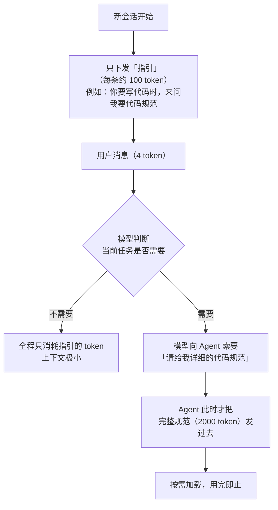

# 第 6 章 Skill 与 CLI：渐进式的提示词与工具

## 一、概念

### 6.1 Skill 要解决的问题

Skill 最初要解决的问题**不是替代 MCP**，而是：

> **提示词过大的问题。**

为什么提示词会过大？因为开发一个项目要告诉 AI 很多东西：

- 代码规范
- 目录规范
- Git 提交规范
- 公共组件如何开发
- 各种技术栈约定

假设**每一份规范是 2000 Token**，几份加起来就是 **8000+ Token**。

而这些内容**每一次会话都要全量发给模型**（按第 2 章的会话机制）。哪怕用户只说了一句「你好」（4 个 Token），实际发给模型的是 8000 多 Token。

**什么都没做，就消耗了近万 Token。** 这就是**上下文爆炸**。

### 6.2 核心思想：渐进式（Progressive Disclosure）

**类比人的开发方式**：没人会先把 Vue、React、Element UI 的全部文档背一遍再开始写代码——都是**用到的时候现查**。

Skill 的做法完全一致：

> 我一开始不告诉你全量信息，只告诉你很少一部分信息，或者告诉你「一会儿你想查的时候再来问我就完了」。

## 二、原理推导

### 6.3 非渐进式 vs 渐进式

**非渐进式（传统提示词）**：

```text
新会话
  → 提示词：代码规范（2000 token）
  → 提示词：目录规范（2000 token）
  → 提示词：Git 规范（2000 token）
  → 提示词：公共组件规范（2000 token）
  → 用户消息（4 token）
合计：8004 token
```

**渐进式（Skill）**：

```text
新会话
  → 提示词：代码规范**指引**（100 token）
  → 提示词：目录规范**指引**（100 token）
  → 提示词：Git 规范**指引**（100 token）
  → 提示词：公共组件规范**指引**（100 token）
  → 用户消息（4 token）
合计：404 token

（模型判断需要时）
  ← 模型：「我要看详细的代码规范」
  → Agent：代码规范（2000 token）
```

用 Mermaid 还原渐进式加载路径（竖向）：



> 指引的写法就是一句「什么时候来向我要什么」——例如：**「你要写代码的时候，来问我要代码规范」**。

### 6.4 文件结构与位置

**Skill 的本质是一个文件**（因为它本来就是做提示词的）：`SKILL.md`，一个 Markdown 文件。

**目录约定**：

- **每个子文件夹 = 一个技能**
- 两种存放位置：

| 位置 | 路径 | 生效范围 |
|---|---|---|
| **工程级** | `<工程>/.agent/skills/<技能名>/SKILL.md` | 仅当前工程 |
| **全局** | 用户主目录下的对应位置 | 所有工程 |

**`SKILL.md` 的结构**（两部分）：

```text
┌─ 头部 meta（YAML front matter）────────────┐
│  name:        技能名（必须与文件夹同名）      │
│  description: 什么时候使用这个技能            │  ← 唯一在会话开始时就下发的内容
├─ 正文 ────────────────────────────────────┤
│  详细的提示词：告诉模型应该怎么做            │  ← 模型需要时才加载
└──────────────────────────────────────────┘
```

> 讲师是**让 AI 帮他写 SKILL.md** 的——「其实我都拿着自己去建的，我就是让 AI 帮我建的」。

### 6.5 运作机制

1. **会话开始**：Agent 只把 `description`（两行字）发给模型
2. **模型判断**：觉得当前任务该用这个技能了，就告诉 Agent「请给我这个技能的详细描述」
3. **Agent 下发正文**：此时才把完整的 SKILL.md 内容给模型

> 这个过程在界面上看不出来，但底层就是这么走的。

### 6.6 Skill vs MCP

| 维度 | MCP | Skill |
|---|---|---|
| **本质** | 外部程序（工具的集合） | 提示词（可附带脚本） |
| **加载方式** | **全量**，工具列表一次性给模型 | **渐进式**，先给指引 |
| **执行方式** | 函数调用，一次性完成 | 提示词驱动；涉及工具时需**动态**写代码、找代码、装依赖 |
| **上下文占用** | 大 | 小 |
| **主要缺点** | 上下文过大 | 需要动态处理程序，不如函数调用干脆 |

**讲师的判断**：

- 目前 **Skill 优于 MCP**——因为工具调用**并非高频需求**，只有极少数场景才需要
- 但 **Skill 不能完全替代 MCP**：真要执行工具时，MCP 一个函数调用就完事，Skill 还要动态处理
- Skill 本身的定位是**解决提示词过大**

### 6.7 技能商店与数量建议

**技能商店**：<https://skills.sh/>

| 技能 | 作用 |
|---|---|
| `find-skill` | **找技能的技能**——需要找技能时会用到它 |
| `create-skill` | **造技能的技能**——让 AI 帮你写 SKILL.md |

**最佳实践④**（课件原文）：

> **skill 数量不宜超过 12 个。**

讲师提到实测下来 12 个左右最合适——数量再多，指引本身也会变成负担。

**最佳实践③**（课件原文）：

> **文档尽量细粒度拆分。**

这是渐进式思想在**文档沉淀**上的延伸：不要把一个文档搞得非常大，按主题拆细，**用到什么查什么**。讲师举例：一个 monorepo 项目里有很多工程，每个工程有自己的文档，文档还可以再细分。

> 这种思想**不是非要做成 Skill**，而是要时刻应用在 Agent 的使用当中，避免上下文过载。

### 6.8 CLI：渐进式工具

CLI 是 **Claude Code 提出的新概念**，同样是**渐进式**。

**做法**：不把工具全量告诉模型，只告诉它**一句话**——「这个工具可以操作浏览器」。

- 模型平时不操作浏览器，就不会去管它
- 当模型发现自己需要操作浏览器时，它会**运行命令去查询子命令**（如 `chrome-devtools --help`）
- 查到具体有哪些子命令后，再决定用哪个

**逻辑与 Skill 完全一致**：先给一个很短的指引，需要的时候再来问。

**现状**：目前多数工具还不支持 CLI 形式的渐进式暴露，所以讲师未能现场演示。

**讲师的判断**：

> **渐进式处理上下文，一定是未来的主流趋势。**

## 三、演示步骤（按讲解顺序还原）

1. **建技能目录**：在工程里新建 `.agent/skills/`，再建一个技能文件夹（如 `jokes`）
2. **建 SKILL.md**：文件夹内新建 `SKILL.md`（**文件名必须是 `SKILL.md`**）
3. **写 meta**：`name` 必须与文件夹同名（`jokes`），`description` 写「什么时候使用」——本课写的是「当用户感到生气的时候，就调用这个 skill，作用是给用户讲一些笑话」
4. **写正文**：详细的提示词内容
5. **验证触发**：在 VSCode 里说「我感觉现在有点生气」→ 观察它是否读到了 `jokes` 技能并讲了个笑话
6. **再验证**：在 Codex 里重复一次，同样触发成功
7. **引申**：由 Skill 的渐进式思想，讲到文档细粒度拆分与 Skill 数量控制

## 四、关键结论

1. **Skill 的初衷是解决「提示词过大」**，不是替代 MCP。
2. **核心思想是渐进式**：会话开始只给**指引**，需要时再取详细内容。
3. **效果对比**：8004 Token → 404 Token（首轮），后续按需加载。
4. **Skill 本质是 `SKILL.md` 文件**；每个子文件夹是一个技能。
5. **两种位置**：工程级 `<工程>/.agent/skills/<技能名>/SKILL.md`、全局（用户主目录）。
6. **`SKILL.md` 两部分**：`name`（须与文件夹同名）+ `description`（何时使用，唯一首轮下发的内容）；正文按需加载。
7. **Skill vs MCP**：MCP 全量下发但执行干脆；Skill 渐进式省上下文但需动态处理程序。
8. **讲师判断**：当前 Skill 优于 MCP（工具调用非高频），但不能完全替代。
9. **最佳实践③④**：文档尽量细粒度拆分；skill 数量不宜超过 12 个。
10. **CLI 是渐进式工具的下一步**（Claude Code 提出），逻辑与 Skill 一致；**渐进式是未来主流**。

## 本节要点回顾

- Skill 解决的是**提示词过大**（多份规范各 2000 Token，会话一开始就全量下发）。
- **渐进式**：先给指引（约 100 Token），模型需要时才索要正文（2000 Token）。
- Skill 就是 **`SKILL.md`**；每个子文件夹一个技能；`name` 必须与文件夹同名。
- **只有 `description` 在会话开始时下发**，正文按需加载。
- **位置两级**：工程级 `.agent/skills/`、全局用户主目录。
- **Skill vs MCP**：省上下文 vs 执行干脆；讲师认为目前 Skill 更优，但两者不能互相替代。
- **最佳实践③**：文档尽量细粒度拆分。**最佳实践④**：skill 数量不宜超过 12 个。
- **CLI** 是 Claude Code 的渐进式工具概念——只告知一句话，按需查子命令。
- **渐进式处理上下文是未来主流趋势**。
