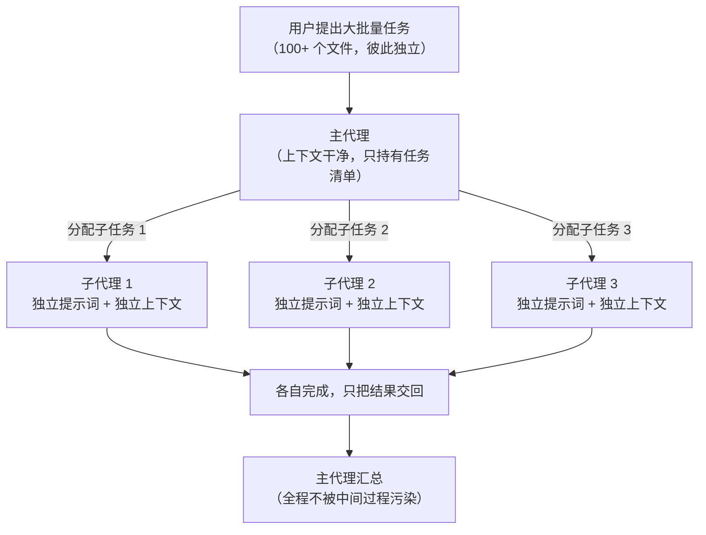
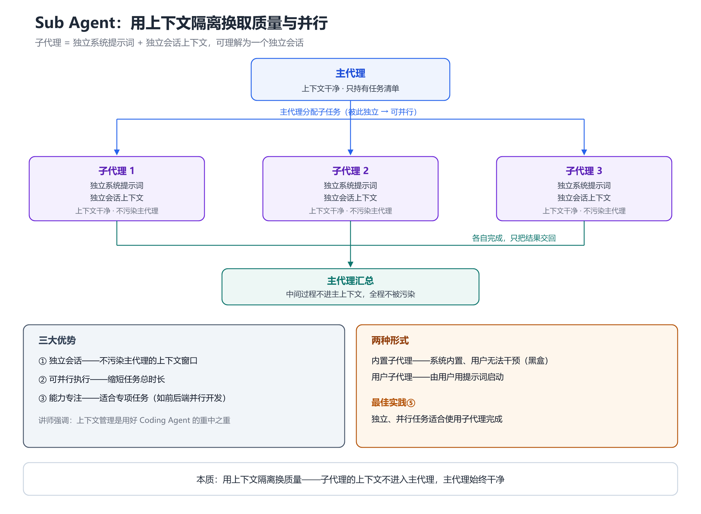

# 第 7 章 Sub Agent：用上下文隔离换取质量与并行

## 一、概念

**子代理（Sub Agent）**：

> 一个**独立的代理**。它有自己的系统提示词，也有自己的会话上下文——**上下文非常干净**。

可以简单地理解为：**每个子代理就是一个独立的会话**。

与主代理的关系：

| | 主代理 | 子代理 |
|---|---|---|
| 系统提示词 | 自己的 | **独立的** |
| 会话上下文 | 主对话的上下文 | **独立的、干净的** |
| 如何启动 | 用户直接对话 | 由主代理分配任务后启动 |
| 产出 | 面向用户 | 完成后把结果交回主代理 |

**本课的边界**：

> 本课只讲**使用层面**——怎么把子代理用起来，不深入到子代理内部究竟怎么运作。想深入理解代理内部的机制，需要另外学习 **Agent 应用开发**。而子代理内部用的，仍然是前面几章讲过的那套东西——提示词、工具、上下文等等。也就是说，本课讲的机制是通用的。

## 二、原理推导

### 7.1 场景引入

**需求**：给 100+ 个课程的 JSON 文件批量补全两个字段——`description`（课程描述）和 `skills`（技能点）。

- 逻辑本身很简单：读取每个文件里的目录和课程名称 → 推测描述与技能点 → 填进去
- 但**任务量特别大**：一百多个文件，有些课程的目录还特别长

**如果在一个会话里从头做到尾**，结果是什么？

> 上下文会变得非常庞大……不仅成本增加，而且它**容易出现幻觉，会导致后面的结果质量越来越差**。

而这些文件**彼此独立**——天然适合**并行处理**。

### 7.2 三大优势

课件原文列出的三条优势：

| # | 优势 | 说明 |
|---|---|---|
| 1 | **独立会话，不污染主代理上下文** | 子代理的上下文是独立的，不会污染主代理的上下文窗口 |
| 2 | **可并行执行，缩短任务总时长** | 主代理里只能串行（上一个完成才能下一个）；子代理可并行 |
| 3 | **能力专注，适合专项任务** | 例如前后端并行开发——来回切换技术栈会拉低输出质量 |

> 讲师特别强调：**上下文管理是我们使用 Coding Agent 的重中之重。**

### 7.3 两种形式

Coding Agent 一般会有两种形式的子代理：

| 类型 | 说明 |
|---|---|
| **内置子代理** | 系统内置的代理，不同厂商设置不同，**用户无法干预**（黑盒）。它一开始就定好了数量，不增不减；不同场景启动不同子代理去完成任务 |
| **用户子代理** | 由**用户通过提示词启动**的子代理，通常用于完成各种**并行、独立的开发任务** |

**内置子代理的举例**：专门写代码的、专门分析需求的、专门制定计划的、负责长期记忆系统的。**隔离性比用户子代理更好**（因为是一开始内置好的）。

> 讲师提到：前段时间 Claude Code 的源码被泄漏，有人扒出它内置了哪些子代理——但**大差不差，各家都差不多**。

**用户子代理的启动方式**：通过提示词明确要求，例如「这是一个长任务，建议你开启多个子代理来完成工作」。

> 讲师提醒：目前大部分情况下，**Agent 自己不会主动去启动子代理**，需要用户指定。

用 Mermaid 还原主代理与子代理的上下文隔离（竖向）：

### 7.4 实操要点

- Codex 里用 `@` 搜索**文件或文件夹**，把它作为处理对象
- 用 `/` 搜索 **skill**
- 提示词里明确要求开启子代理：「这是一个长任务，所以我建议你开启多个子代理来完成工作，**避免污染主代理的上下文**」
- 子代理启动时，**主代理会给它一段提示词**——可以点开查看这段提示词，看清楚任务是怎么被分配的
- 子代理数量**要考虑你的电脑配置**（演示中开启了 4 个，后来增加到 8 个）

### 7.5 何时使用

| 条件 | 说明 |
|---|---|
| 任务是**独立的** | 彼此之间没有依赖 |
| **需求已经整理好** | 不需要反复交互澄清 |
| **适合并行** | 例如「你现在有事要出门，不希望 AI 闲着」 |

**最佳实践⑤**（课件原文）：

> 独立、并行任务适合使用子代理完成。

## 三、演示步骤（按讲解顺序还原）

1. **准备素材**：在**桌面新建一个项目**，并**打开上一期课程所在的文件夹**；打开课程目录（一百多个 JSON 文件），每个文件结构相同，含 `description`、`skills`、`catalog`（课程目录）等字段
2. **用 `@` 指定目标**：在 Codex 里用 `@` 搜索并选中 `courses` 文件夹（演示时连接的是 OpenAI，**需要开 VPN**）
3. **描述任务**：用语音说明——「这个文件夹里有很多 JSON 文件，每个文件的格式完全一样，都表示一个课程；每个文件里有 `description` 和 `skills` 字段，分别表示课程描述和课程设计上的技能点；现在需要你读取每个文件里的目录和课程名称，推测描述应该是什么」
4. **明确指定子代理**：「这是一个长任务，所以我建议你开启很多个子代理来完成工作，避免污染主代理的上下文」
5. **观察执行**：主代理创建多个智能体（先 4 个，后增加到 8 个），并行处理文件
6. **查看分配提示词**：点开子代理，能看到主代理分配给它的提示词，以及它做了哪些事

> **已知缺失**：本段录音末尾约 1 分钟识别失败（模型幻觉输出无意义文本），原内容缺失。从上下文推断该段仍在演示子代理执行结果，但具体内容无法还原。

## 四、关键结论

1. **子代理 = 拥有独立系统提示词 + 独立会话上下文的代理**，可理解为一个独立会话。
2. **三大优势**：独立会话不污染主上下文 / 可并行执行 / 能力专注。
3. **两种形式**：内置子代理（黑盒、用户无法干预、隔离性更好）、用户子代理（提示词启动）。
4. **内置子代理举例**：写代码、分析需求、制定计划、长期记忆——各家实现**大差不差**。
5. **多数情况 Agent 不会主动开启子代理**，需要用户在提示词里明确指定。
6. **典型触发措辞**：「这是长任务，建议开启多个子代理，避免污染主代理的上下文」。
7. **最佳实践⑤：独立、并行任务适合使用子代理完成**。
8. **本质是用上下文隔离换质量**——讲师强调「上下文管理是使用 Coding Agent 的重中之重」。

## 本节要点回顾

- **子代理 = 独立提示词 + 独立上下文**，可理解为独立会话。
- **三大优势**：不污染主上下文 / 可并行 / 能力专注。
- **两种形式**：内置子代理（黑盒，用户不可干预）/ 用户子代理（提示词启动）。
- **需要用户显式指定**——Agent 一般不会自己开子代理。
- 典型措辞：**「这是长任务，建议开启多个子代理，避免污染主代理上下文」**。
- Codex 里 `@` 搜文件/文件夹，`/` 搜 skill；可点开查看分配给子代理的提示词。
- **最佳实践⑤：独立、并行任务用子代理**。
- 子代理数量要考虑本机配置；**核心收益是上下文隔离**。
