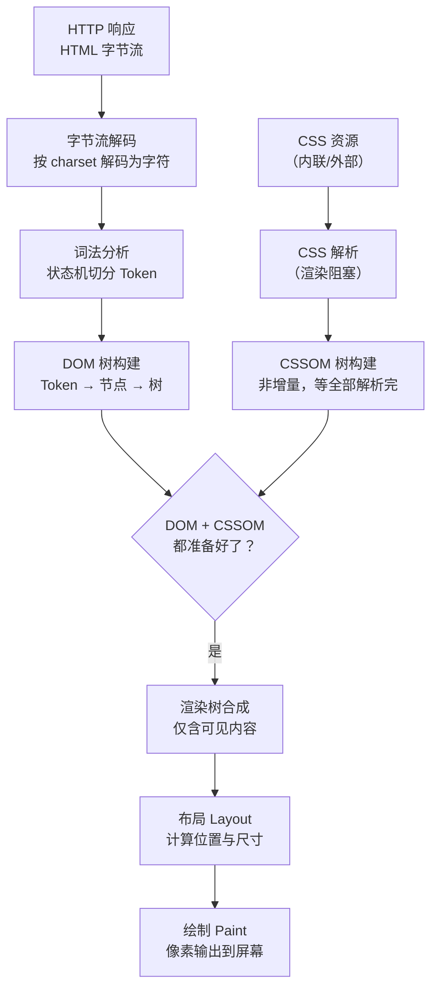

# HTML 核心与语义化

> 模块：01-html-css（第1周 HTML/CSS 基础）
> 定位：前端面试基础考点，理解 HTML 语义化、SEO 和可访问性

***

## 一、核心概念

### 1.1 DOCTYPE 声明

`<!DOCTYPE html>` 声明文档类型为 HTML5，告诉浏览器使用标准模式渲染。如果不声明或声明错误，浏览器会进入怪异模式（Quirks Mode），导致盒模型计算方式不同、CSS 渲染不一致。

> 📖 **参考链接**：
>
> - [MDN - DOCTYPE](https://developer.mozilla.org/zh-CN/docs/Glossary/Doctype)
> - [WHATWG - HTML 规范](https://html.spec.whatwg.org/)

### 1.2 HTML5 新特性

| 特性          | 说明                                           | 示例                       |
| ----------- | -------------------------------------------- | ------------------------ |
| 语义化标签       | header/nav/main/article/section/aside/footer | `<article>`              |
| 表单增强        | email/url/date/range 等输入类型                   | `<input type="email">`   |
| 音视频         | audio/video 标签替代 Flash                       | `<video src="...">`      |
| Canvas/SVG  | 2D/3D 图形绘制                                   | `<canvas>`               |
| Web Storage | localStorage/sessionStorage                  | `localStorage.setItem()` |
| WebSocket   | 全双工通信                                        | `new WebSocket()`        |
| 地理定位        | Geolocation API                              | `navigator.geolocation`  |
| 拖拽 API      | 原生拖放                                         | `draggable="true"`       |

> 📖 **参考链接**：
>
> - [MDN - HTML5](https://developer.mozilla.org/zh-CN/docs/Glossary/HTML5)
> - [MDN - Web Storage API](https://developer.mozilla.org/zh-CN/docs/Web/API/Web_Storage_API)

### 1.3 语义化标签详解

**为什么需要语义化**：

- **SEO**：搜索引擎爬虫能更好地理解页面结构，提升排名
- **可访问性**：屏幕阅读器能准确识别内容区域，帮助视障用户
- **代码维护**：开发者能快速理解页面结构
- **移动端适配**：移动端浏览器可能对语义化标签有特殊优化

**常用语义化标签对照**：

| 标签          | 语义         | 使用场景                             |
| ----------- | ---------- | -------------------------------- |
| `<header>`  | 页头/文章头部    | 网站顶部导航、Logo、文章标题区                |
| `<nav>`     | 导航链接集合     | 主导航菜单、面包屑                        |
| `<main>`    | 页面主要内容（唯一） | 包裹核心内容区域                         |
| `<article>` | 独立的自包含内容   | 博客文章、新闻、评论                       |
| `<section>` | 文档中的节      | 有标题的内容分组                         |
| `<aside>`   | 侧边栏/补充内容   | 侧边栏、广告、相关链接                      |
| `<footer>`  | 页脚         | 版权信息、联系方式                        |
| `<search>`  | 搜索区域       | 搜索表单、筛选器（HTML 2023 年新增）          |
| `<dialog>`  | 对话框/模态框    | 原生模态对话框、确认弹窗（HTML 5.2）           |
| `<details>` | 可折叠内容      | FAQ 折叠面板、展开更多（含 `<summary>` 子元素） |

#### 新增语义化标签详解

**`<search>`** **标签（HTML 2023 年新增）**：

```html
<!-- 替代 <div role="search">，语义更明确 -->
<search>
  <form action="/search">
    <input type="search" name="q" placeholder="搜索...">
    <button type="submit">搜索</button>
  </form>
</search>
```

**`<dialog>`** **标签（HTML 5.2）**：原生模态对话框，无需 JavaScript 库即可实现模态弹窗，自动处理焦点管理、ESC 关闭和无障碍访问。

```html
<button id="open-dialog">打开对话框</button>

<dialog id="my-dialog">
  <h2>确认操作</h2>
  <p>确定要执行此操作吗？</p>
  <form method="dialog">
    <button value="cancel">取消</button>
    <button value="confirm">确认</button>
  </form>
</dialog>

<script>
  const dialog = document.getElementById('my-dialog');
  document.getElementById('open-dialog').addEventListener('click', () => {
    dialog.showModal(); // showModal() 显示模态框（有遮罩）
    // dialog.show() 显示非模态对话框
  });
  dialog.addEventListener('close', () => {
    console.log('对话框关闭，返回值：', dialog.returnValue);
  });
</script>
```

```css
/* 自定义 dialog 样式 */
dialog::backdrop {
  background: rgba(0, 0, 0, 0.5);
  backdrop-filter: blur(2px);
}

dialog {
  border: none;
  border-radius: 12px;
  padding: 24px;
  box-shadow: 0 8px 24px rgba(0, 0, 0, 0.2);
}
```

**`<details>/<summary>`** **标签**：原生折叠/展开组件，无需 JavaScript。

```html
<details>
  <summary>点击展开更多信息</summary>
  <p>这是折叠的内容，仅在展开时可见。</p>
  <ul>
    <li>项目一</li>
    <li>项目二</li>
  </ul>
</details>

<!-- 默认展开 -->
<details open>
  <summary>常见问题</summary>
  <p>默认展开的答案...</p>
</details>
```

**`popover`** **属性（HTML 2024 年新增）**：原生弹出层，自动处理层级管理（top layer）、焦点管理、键盘导航和无障碍访问。

```html
<!-- 方式一：声明式触发 -->
<button popovertarget="my-popover">切换弹出层</button>
<div id="my-popover" popover>
  <p>这是一个原生弹出层，点击外部自动关闭</p>
</div>

<!-- 方式二：popover="auto"（默认）—— 点击外部自动关闭，多个互斥 -->
<div popover="auto">轻量弹出层，点击外部关闭</div>

<!-- 方式三：popover="manual" —— 手动控制，需 JavaScript -->
<div id="manual-popover" popover="manual">
  <p>需通过 JS 手动控制</p>
</div>

<script>
  const popover = document.getElementById('manual-popover');
  popover.showPopover();  // 显示
  popover.hidePopover();  // 隐藏
  popover.togglePopover(); // 切换
</script>
```

> 📖 **参考链接**：
>
> - [MDN - HTML 元素参考](https://developer.mozilla.org/zh-CN/docs/Web/HTML/Element)
> - [MDN - 语义化](https://developer.mozilla.org/zh-CN/docs/Glossary/Semantics)

### 1.4 块级元素 vs 行内元素 vs 行内块元素

| 特性             |      块级（block）     |                   行内（inline）                  | 行内块（inline-block） |
| -------------- | :----------------: | :-------------------------------------------: | :---------------: |
| 占行             |        独占一行        |                      同行排列                     |        同行排列       |
| 宽高设置           |         有效         |                       无效                      |         有效        |
| margin/padding |        四方向有效       | 水平方向有效，垂直方向 padding 视觉效果生效但不占布局空间，margin 垂直无效 |       四方向有效       |
| 默认宽度           |       父元素100%      |                      内容撑开                     |        内容撑开       |
| 典型标签           | div/p/h1\~h6/ul/li |                span/a/strong/em               |  img/input/button |

> **注**：`img` 实际是 `display: inline` 的可替换元素（replaced element），因其可设置宽高而行为类似 `inline-block`。

***

## 二、底层原理

### 2.1 浏览器解析 HTML 流程

```text
HTML 字节流 → 字符流 → Token → DOM 节点 → DOM 树
```

1. **字节流解码**：浏览器将接收到的 HTML 字节流按编码解码为字符流
2. **词法分析（Tokenizer）**：将字符流切分为 Token（开始标签、结束标签、文本、属性）
3. **DOM 树构建**：根据 Token 构建 DOM 节点，形成 DOM 树
4. **CSSOM 树构建**：并行解析 CSS，构建 CSSOM 树
5. **渲染树合成**：DOM + CSSOM → Render Tree

#### 完整示例：从 HTML 到渲染树的全过程

以下通过一个完整的 HTML 文档，演示浏览器解析的每个阶段：

**① 原始 HTML 文档**：

```html
<!DOCTYPE html>
<html lang="zh-CN">
<head>
  <meta charset="UTF-8">
  <title>解析示例</title>
  <style>
    p { color: blue; }
    .hidden { display: none; }
  </style>
</head>
<body>
  <h1>标题</h1>
  <p>段落文本</p>
  <div class="hidden">隐藏内容</div>
</body>
</html>
```

**② 字节流解码（Bytes → Characters）**：

浏览器通过 HTTP 接收到的原始数据是字节流，根据 `<meta charset="UTF-8">` 声明的编码方式解码为字符串：

```text
原始字节（十六进制）：
3C 21 44 4F 43 54 59 50 45 20 68 74 6D 6C 3E 0A 3C 68 74 6D 6C ...

解码后的字符流：
"<!DOCTYPE html>\n<html lang=\"zh-CN\">\n<head>\n..."
```

**③ 词法分析（Characters → Tokens）**：

词法分析器（Tokenizer）使用状态机将字符流切分为 Token，每个 Token 是最小有意义单元：

```text
Token 序列：
[DOCTYPE]     html
[StartTag]    html, 属性: lang="zh-CN"
  [StartTag]  head
    [StartTag]  meta, 属性: charset="UTF-8"
    [StartTag]  title
    [Character] "解析示例"
    [EndTag]   title
    [StartTag]  style
    [Character] "p { color: blue; } .hidden { display: none; }"
    [EndTag]   style
  [EndTag]    head
  [StartTag]  body
    [StartTag]  h1
    [Character] "标题"
    [EndTag]   h1
    [StartTag]  p
    [Character] "段落文本"
    [EndTag]   p
    [StartTag]  div, 属性: class="hidden"
    [Character] "隐藏内容"
    [EndTag]   div
  [EndTag]    body
[EndTag]      html
```

**④ DOM 树构建（Tokens → DOM Tree）**：

解析器根据 Token 的层级关系（通过维护一个栈结构）构建 DOM 节点，形成树形结构：

```text
Document
└── html (lang="zh-CN")
    ├── head
    │   ├── meta (charset="UTF-8")
    │   ├── title
    │   │   └── #text "解析示例"
    │   └── style
    │       └── #text "p { color: blue; } .hidden { display: none; }"
    └── body
        ├── h1
        │   └── #text "标题"
        ├── p
        │   └── #text "段落文本"
        └── div (class="hidden")
            └── #text "隐藏内容"
```

**⑤ CSSOM 树构建（CSS → CSSOM Tree）**：

与 DOM 构建不同，CSSOM 构建是**非增量**的——浏览器必须等待所有 CSS 解析完毕才能构建 CSSOM（因为后面的规则可能覆盖前面的）：

```text
CSSOM 树：
document
└── Stylesheet
    ├── Rule: p → { color: blue }
    └── Rule: .hidden → { display: none }
```

**⑥ 渲染树合成（DOM + CSSOM → Render Tree）**：

渲染树只包含**可见内容**。`<head>`、`<meta>`、`<title>`、`<style>` 等不可见元素，以及 `display: none` 的元素都不会出现在渲染树中：

```text
Render Tree（渲染树）：
RenderView (viewport)
└── html
    └── body
        ├── h1 (display: block)
        │   └── #text "标题"
        └── p (display: block, color: blue)
            └── #text "段落文本"

注意：div.hidden 未出现在渲染树中（display: none 被排除）
```

**⑦ JavaScript 验证 DOM 树结构**：

以下代码可在浏览器控制台运行，遍历并打印当前页面的 DOM 树结构：

```javascript
function traverseDOM(node, depth = 0) {
  const indent = '  '.repeat(depth);
  const nodeName = node.nodeName.toLowerCase();
  const attrs = node.attributes
    ? Array.from(node.attributes).map(a => `${a.name}="${a.value}"`).join(', ')
    : '';
  const attrStr = attrs ? ` (${attrs})` : '';
  const textStr = node.nodeName === '#text' ? `: "${node.nodeValue.trim()}"` : '';

  if (nodeName !== '#comment' && (nodeName !== '#text' || node.nodeValue.trim())) {
    console.log(`${indent}${nodeName}${attrStr}${textStr}`);
  }

  if (node.childNodes) {
    node.childNodes.forEach(child => traverseDOM(child, depth + 1));
  }
}

// 输出当前页面的 DOM 树结构
traverseDOM(document);
```

**⑧ 完整关键渲染路径流程图**：



> **关键要点**：DOM 构建是**增量**的（解析到哪构建到哪），CSSOM 构建是**非增量**的（必须等全部 CSS 解析完）。这也是 CSS 被称为"渲染阻塞资源"的原因——浏览器不会在 CSSOM 完成前渲染任何内容。

### 2.2 script 标签的 async 和 defer

| 属性    | 下载时机       | 执行时机                 |  执行顺序 |
| ----- | ---------- | -------------------- | :---: |
| 无     | 阻塞 HTML 解析 | 下载后立即执行              | 按出现顺序 |
| async | 异步下载       | 下载后立即执行              | 不保证顺序 |
| defer | 异步下载       | DOMContentLoaded 前执行 | 按出现顺序 |

```html
<!-- 阻塞解析 -->
<script src="app.js"></script>

<!-- 异步下载，下载完立即执行（适合独立脚本，如统计） -->
<script async src="analytics.js"></script>

<!-- 异步下载，DOM 解析完后执行（适合依赖 DOM 的脚本） -->
<script defer src="app.js"></script>
```

### 2.3 meta 标签的作用

| meta 标签                                                                  | 作用                                        |
| ------------------------------------------------------------------------ | ----------------------------------------- |
| `<meta charset="UTF-8">`                                                 | 声明字符编码                                    |
| `<meta name="viewport" content="width=device-width, initial-scale=1.0">` | 移动端视口适配                                   |
| `<meta name="description" content="...">`                                | SEO 页面描述（搜索结果摘要）                          |
| `<meta name="keywords" content="...">`                                   | 页面关键词（Google 等主流搜索引擎已不参考，但百度等国内搜索引擎仍部分参考） |
| `<meta http-equiv="X-UA-Compatible" content="IE=edge">`                  | 指定 IE 使用最新渲染模式                            |
| `<meta name="robots" content="noindex,nofollow">`                        | 控制搜索引擎爬取行为                                |

***

## 三、实战应用

### 3.1 SEO 优化最佳实践

```html
<!DOCTYPE html>
<html lang="zh-CN">
<head>
    <meta charset="UTF-8">
    <meta name="viewport" content="width=device-width, initial-scale=1.0">
    <meta name="description" content="这是一个测试案例">
    <title>这是一个测试案例</title>
    <link rel="canonical" href="https://www.example.com/">
</head>
<body>
    <header>
        <nav>
            <a href="/">首页</a>
            <a href="/about">关于我们</a>
        </nav>
    </header>
    <main>
        <article>
            <h1>新闻</h1>
            <p>...</p>
        </article>
    </main>
    <footer>
        <p>&copy; 2026 </p>
    </footer>
</body>
</html>
```

> 📖 **参考链接**：
>
> - [MDN - SEO（搜索引擎优化）](https://developer.mozilla.org/zh-CN/docs/Glossary/SEO)
> - [MDN - meta 标签](https://developer.mozilla.org/zh-CN/docs/Web/HTML/Element/meta)

### 3.2 可访问性（ARIA）

```html
<!-- 无 ARIA 的按钮（屏幕阅读器无法识别） -->
<div onclick="submit()">提交</div>

<!-- 有 ARIA 的按钮 -->
<button aria-label="提交表单">提交</button>

<!-- 图片的 alt 属性 -->

```

> 📖 **参考链接**：
>
> - [MDN - 无障碍访问（Accessibility）](https://developer.mozilla.org/zh-CN/docs/Web/Accessibility)
> - [W3C - WAI-ARIA](https://www.w3.org/TR/wai-aria/)

***

## 四、常见面试题

### 1. ★★ HTML5 新增了哪些标签？语义化的好处是什么？

**要点**：新增语义化标签（header/nav/main/article/section/aside/footer）、表单增强（email/date/range）、音视频（audio/video）、Canvas/SVG、Web Storage。语义化好处：SEO 友好、提升可访问性、代码可维护性、移动端优化。

### 2. ★★ script 标签的 async 和 defer 有什么区别？

**要点**：async 异步下载，下载完立即执行（不保证顺序），适合独立脚本如统计代码；defer 异步下载，等 DOM 解析完后按顺序执行，适合依赖 DOM 的脚本。两者都不阻塞 HTML 解析。

### 3. ★ HTML5 存储方式有哪些？

**要点**：localStorage（持久化存储，5MB，同源共享）、sessionStorage（会话级存储，关闭标签页清除）、IndexedDB（结构化数据，支持索引和事务，容量大）、Cookie（4KB，每次请求携带，可设置过期时间）。

### 4. ★ 什么是 Web Worker？

**要点**：Web Worker 在后台线程中运行 JavaScript，不阻塞主线程。适合 CPU 密集型任务（大数据计算、图像处理）。Worker 线程与主线程通过 postMessage 通信，不能操作 DOM。

***

## 五、避坑指南

| 常见错误                  | 现象        | 原因                          | 解决方案                          |
| --------------------- | --------- | --------------------------- | ----------------------------- |
| 忘记 viewport 声明        | 移动端页面缩放异常 | 缺少 `<meta name="viewport">` | 在 head 中添加 viewport meta 标签   |
| 多个 h1 标签              | SEO 扣分    | 每个页面应只有一个 h1                | 使用 h1 作为页面主标题，其他用 h2-h6       |
| 用 div 代替所有语义标签        | 代码可读性差    | 不熟悉语义化标签                    | 按内容选择语义化标签（header/nav/main）   |
| 大 script 在 head 中阻塞渲染 | 页面白屏时间长   | 浏览器解析到 script 标签会暂停 DOM 构建  | 使用 defer 或将 script 放在 body 底部 |

***

## 本章学习自检

完成本章学习后，应该能够：

- [ ] 用自己的话解释 HTML5 语义化和 SEO 的关系
- [ ] 手写一个语义化 HTML 页面结构
- [ ] 区分 async 和 defer 的加载和执行时机
- [ ] 回答 HTML5 新增特性相关的面试题
- [ ] 在浏览器中正确使用 meta 标签和 viewport 配置

***

> **学习导航**：
>
> - 返回 [学习路线总览](../README.md)
> - 本模块其他文件：[02-CSS布局核心](./02-CSS布局核心.md) | [03-CSS进阶与性能](./03-CSS进阶与性能.md) | [04-HTMLCSS笔面试题集](./04-HTMLCSS笔面试题集.md)
> - 实战应用：[企业后台管理系统](../10-project/01-企业后台管理系统实战.md)

***

## 补充内容1：Canvas 与 SVG 基础

> 定位：掌握 HTML5 图形绘制的两种核心技术，理解各自适用场景

***

### 1. 核心概念

#### 1.1 Canvas 2D 上下文

Canvas 是 HTML5 提供的位图绘制 API，通过 JavaScript 在 `<canvas>` 元素上绘制像素级别的图形。所有绘制操作都通过"2D 渲染上下文"（`CanvasRenderingContext2D`）完成。

**获取上下文**：

```html
<canvas id="myCanvas" width="400" height="300"></canvas>
<script>
  const canvas = document.getElementById('myCanvas');
  const ctx = canvas.getContext('2d');
</script>
```

**常用 API 速查表**：

| 分类   | API                                       | 说明                            |
| ---- | ----------------------------------------- | ----------------------------- |
| 矩形绘制 | `fillRect(x, y, w, h)`                    | 填充矩形                          |
| 矩形绘制 | `strokeRect(x, y, w, h)`                  | 描边矩形                          |
| 矩形绘制 | `clearRect(x, y, w, h)`                   | 清除矩形区域（变为透明）                  |
| 路径   | `beginPath()`                             | 开始新路径                         |
| 路径   | `moveTo(x, y)`                            | 移动画笔到指定位置                     |
| 路径   | `lineTo(x, y)`                            | 画线到指定位置                       |
| 路径   | `arc(x, y, r, start, end, anticlockwise)` | 画圆弧                           |
| 路径   | `closePath()`                             | 闭合路径                          |
| 路径   | `fill()` / `stroke()`                     | 填充 / 描边当前路径                   |
| 文本   | `fillText(text, x, y, [maxWidth])`        | 填充文字                          |
| 文本   | `strokeText(text, x, y, [maxWidth])`      | 描边文字                          |
| 文本   | `font`                                    | 字体样式（如 `'16px Arial'`）        |
| 文本   | `textAlign`                               | 水平对齐（`left`/`center`/`right`） |
| 图片   | `drawImage(img, dx, dy, [dw, dh])`        | 绘制图片                          |
| 状态   | `save()`                                  | 保存当前绘图状态到栈                    |
| 状态   | `restore()`                               | 从栈中恢复上一次保存的状态                 |
| 变换   | `translate(x, y)`                         | 平移坐标系原点                       |
| 变换   | `rotate(angle)`                           | 旋转坐标系（弧度）                     |
| 变换   | `scale(sx, sy)`                           | 缩放坐标系                         |

#### 1.2 SVG 基本形状

SVG（Scalable Vector Graphics）是基于 XML 的矢量图形格式，每个图形元素都是 DOM 节点，可以被 CSS 样式化和 JavaScript 事件监听。

| 元素          | 关键属性                        | 说明              |
| ----------- | --------------------------- | --------------- |
| `<rect>`    | x, y, width, height, rx, ry | 矩形（rx/ry 为圆角半径） |
| `<circle>`  | cx, cy, r                   | 圆形              |
| `<ellipse>` | cx, cy, rx, ry              | 椭圆              |
| `<line>`    | x1, y1, x2, y2              | 线段              |
| `<polygon>` | points（空格分隔的坐标对）            | 多边形             |
| `<path>`    | d（路径命令字符串）                  | 任意路径（最强大的元素）    |

**`<path>`** **的** **`d`** **属性常用命令**：

| 命令                                     | 全称               | 说明           |
| -------------------------------------- | ---------------- | ------------ |
| M x y                                  | Move To          | 移动到指定坐标（不画线） |
| L x y                                  | Line To          | 画直线到指定坐标     |
| H x                                    | Horizontal Line  | 画水平线         |
| V y                                    | Vertical Line    | 画垂直线         |
| A rx ry x-rotation large-arc sweep x y | Arc              | 画圆弧          |
| C cx1 cy1 cx2 cy2 x y                  | Cubic Bezier     | 三次贝塞尔曲线      |
| Q cx cy x y                            | Quadratic Bezier | 二次贝塞尔曲线      |
| Z                                      | Close Path       | 闭合路径         |

#### 1.3 Canvas vs SVG 选择场景对比

| 对比维度 | Canvas                          | SVG                              |
| ---- | ------------------------------- | -------------------------------- |
| 图形类型 | **位图（像素）**                      | **矢量图（数学描述）**                    |
| 缩放表现 | 放大会模糊、出现锯齿                      | 任意缩放不失真                          |
| 性能特点 | 绘制大量对象时性能更好（像素级操作）              | 对象较少时性能好；对象数量多（>1000）时 DOM 操作开销大 |
| 交互性  | 不支持事件绑定到具体图形，需手动计算坐标            | 每个元素都是 DOM 节点，天然支持事件绑定           |
| 内存占用 | 固定大小画布，图像越大内存越大                 | 由 DOM 节点数量决定                     |
| 导出能力 | `toDataURL()` / `toBlob()` 导出位图 | 可导出 SVG 源码或序列化为字符串               |
| 典型场景 | 游戏、图表库底层、图像处理、动画                | 图标、数据可视化、地图、响应式图形                |

***

### 2. 底层原理

#### 2.1 Canvas 渲染机制

Canvas 采用"立即模式"（Immediate Mode）渲染：一旦图形被绘制到画布上，它就不再是独立对象，而是像素数组中的一部分。修改图形需要擦除并重绘整个画布。这个机制带来的影响：

- **无法直接修改已绘制图形**：必须 `clearRect` 后重新绘制
- **动画依赖 requestAnimationFrame 循环**：每一帧都要清空画布并重绘所有元素
- **`save()`** **/** **`restore()`** **管理状态栈**：每次 `save()` 将当前状态（填充色、描边色、变换矩阵、字体等）压入栈，`restore()` 弹出并恢复，不会影响已绘制内容

#### 2.2 SVG 渲染机制

SVG 采用"保留模式"（Retained Mode）渲染：每个图形元素以 DOM 节点形式存在于文档树中，浏览器维护一个场景图，可以独立修改某个元素的属性并自动重绘。

- **DOM 操作**：修改属性（如 `setAttribute('fill', 'red')`）即可更新图形
- **CSS 支持**：可通过 CSS 控制 SVG 样式（`fill`、`stroke`、`stroke-width` 等）
- **事件冒泡**：SVG 元素遵循 DOM 事件模型，支持冒泡和捕获

***

### 3. 实战应用

#### 3.1 Canvas 绘制柱状图

```html
<canvas id="barChart" width="500" height="350"></canvas>
<script>
const canvas = document.getElementById('barChart');
const ctx = canvas.getContext('2d');

const data = [
  { label: '一月', value: 80 },
  { label: '二月', value: 120 },
  { label: '三月', value: 95 },
  { label: '四月', value: 150 },
  { label: '五月', value: 110 },
];

const chartWidth = canvas.width - 80;
const chartHeight = canvas.height - 80;
const barWidth = chartWidth / data.length - 15;
const maxValue = Math.max(...data.map(d => d.value));

// 绘制坐标轴
ctx.beginPath();
ctx.moveTo(50, 20);
ctx.lineTo(50, canvas.height - 30);
ctx.lineTo(canvas.width - 30, canvas.height - 30);
ctx.strokeStyle = '#333';
ctx.stroke();

// 绘制柱状图
data.forEach((item, index) => {
  const barHeight = (item.value / maxValue) * chartHeight;
  const x = 60 + index * (barWidth + 15);
  const y = canvas.height - 30 - barHeight;

  // 渐变填充
  const gradient = ctx.createLinearGradient(x, y, x, canvas.height - 30);
  gradient.addColorStop(0, '#4A90D9');
  gradient.addColorStop(1, '#1A5C9E');
  ctx.fillStyle = gradient;
  ctx.fillRect(x, y, barWidth, barHeight);

  // 数值标签
  ctx.fillStyle = '#333';
  ctx.font = '12px Arial';
  ctx.textAlign = 'center';
  ctx.fillText(item.value, x + barWidth / 2, y - 5);

  // X 轴标签
  ctx.fillText(item.label, x + barWidth / 2, canvas.height - 15);
});
</script>
```

#### 3.2 SVG 绘制饼图

```html
<svg viewBox="0 0 300 300" width="300" height="300">
  <!-- 使用 path 的 A 命令绘制扇形 -->
  <!-- 数据：产品A 30%、产品B 25%、产品C 20%、产品D 15%、产品E 10% -->
  <g transform="translate(150, 150)">
    <!-- 产品A: 30% (0° - 108°) -->
    <path d="M0,0 L0,-120 A120,120 0 0,1 114.12,37.08 Z"
          fill="#4A90D9" stroke="#fff" stroke-width="2">
      <title>产品A: 30%</title>
    </path>
    <!-- 产品B: 25% (108° - 198°) -->
    <path d="M0,0 L114.12,37.08 A120,120 0 0,1 -37.08,114.12 Z"
          fill="#50C878" stroke="#fff" stroke-width="2">
      <title>产品B: 25%</title>
    </path>
    <!-- 产品C: 20% (198° - 270°) -->
    <path d="M0,0 L-37.08,114.12 A120,120 0 0,1 -120,0 Z"
          fill="#F5A623" stroke="#fff" stroke-width="2">
      <title>产品C: 20%</title>
    </path>
    <!-- 产品D: 15% (270° - 324°) -->
    <path d="M0,0 L-120,0 A120,120 0 0,1 -70.53,-97.08 Z"
          fill="#D0021B" stroke="#fff" stroke-width="2">
      <title>产品D: 15%</title>
    </path>
    <!-- 产品E: 10% (324° - 360°) -->
    <path d="M0,0 L-70.53,-97.08 A120,120 0 0,1 0,-120 Z"
          fill="#8B572A" stroke="#fff" stroke-width="2">
      <title>产品E: 10%</title>
    </path>
  </g>
</svg>
```

***

### 4. 常见面试题

#### 1. ★★ Canvas 和 SVG 有什么区别？分别适用于什么场景？

**要点**：Canvas 是位图，基于像素，适合大量对象、游戏、图像处理；SVG 是矢量图，基于 XML，每个元素是 DOM 节点，适合图标、数据可视化、需要交互的场景。Canvas 缩放失真，SVG 缩放不失真。Canvas 性能在大量对象时更好，SVG 在对象少时更优。

#### 2. ★ Canvas 的 `save()` 和 `restore()` 有什么作用？

**要点**：`save()` 将当前绘图状态（填充色、描边色、变换矩阵、字体、裁剪区域等）压入状态栈；`restore()` 弹出栈顶状态并恢复。主要用于局部变换（如只旋转某个图形）和嵌套绘制场景，避免状态污染。

#### 3. ★ SVG `<path>` 的 `d` 属性中 M、L、C、Z 分别代表什么？

**要点**：M = MoveTo（移动起点）、L = LineTo（画直线）、C = Cubic Bezier（三次贝塞尔曲线）、Z = ClosePath（闭合路径）。还有 H（水平线）、V（垂直线）、A（圆弧）、Q（二次贝塞尔曲线）等命令。

***

### 5. 避坑指南

| 常见错误                                    | 现象              | 原因                                      | 解决方案                                                                |
| --------------------------------------- | --------------- | --------------------------------------- | ------------------------------------------------------------------- |
| Canvas 未设置 width/height 属性              | 图形变形或被裁剪        | CSS 设置宽高不等于 Canvas 像素尺寸，默认 300x150      | 在 `<canvas>` 标签上设置 `width` 和 `height` 属性                            |
| Canvas 在高 DPI 屏幕模糊                      | 绘制内容模糊不清        | 设备像素比 > 1，Canvas 未进行适配                  | 将 Canvas 宽高乘以 `devicePixelRatio`，再通过 CSS 缩回显示尺寸                     |
| SVG 大量节点导致卡顿                            | 页面滚动/交互卡顿       | 数千个 SVG DOM 节点导致渲染开销大                   | 使用 Canvas 替代，或对 SVG 进行虚拟化渲染                                         |
| SVG 命名空间错误                              | 动态创建的 SVG 元素不显示 | 使用 `createElement` 而非 `createElementNS` | 使用 `document.createElementNS('http://www.w3.org/2000/svg', 'rect')` |
| 使用了 `ctx.fill()` 但忘记先设置 `ctx.fillStyle` | 绘制内容不显示或颜色错误    | 在调用 `fill()` 前未设置 `ctx.fillStyle`       | 在 `fill()` 前设置 `ctx.fillStyle` 属性                                   |

***

## 补充内容2：表单验证与无障碍访问（a11y）

> 定位：掌握 HTML5 表单增强特性与无障碍访问标准，构建可用、友好的 Web 表单

***

### 1. 核心概念

#### 1.1 HTML5 新增输入类型详解

HTML5 引入了多种语义化输入类型，浏览器会提供原生校验和专属 UI 控件（如日期选择器、颜色面板）。

| 类型       | 用途     | 浏览器表现              | 自动校验规则                |
| -------- | ------ | ------------------ | --------------------- |
| `email`  | 邮箱地址   | 键盘调出 `@` 键（移动端）    | 必须包含 `@` 和域名          |
| `url`    | 网址     | 键盘调出 `.com` 键（移动端） | 必须包含协议（如 `https://`）  |
| `date`   | 日期     | 弹出日期选择器            | 日期格式有效                |
| `range`  | 数值范围滑块 | 显示滑块控件             | 值在 min/max 之间         |
| `color`  | 颜色选择   | 弹出颜色面板             | 值为有效十六进制颜色            |
| `number` | 数字     | 显示数字增减按钮           | 值在 min/max 之间，step 步长 |
| `tel`    | 电话号码   | 调出数字键盘（移动端）        | 无强制格式校验（号码格式全球不统一）    |
| `search` | 搜索框    | 显示清除按钮             | 无特殊校验                 |

#### 1.2 表单验证 API

HTML5 提供了一套内置的表单验证 API，可在不依赖 JavaScript 库的情况下实现验证。

| API / 属性                        | 类型     | 说明                                         |
| ------------------------------- | ------ | ------------------------------------------ |
| `checkValidity()`               | 方法     | 检查元素是否满足所有约束，返回布尔值                         |
| `reportValidity()`              | 方法     | 检查有效性，并在无效时向用户显示错误提示                       |
| `setCustomValidity(message)`    | 方法     | 设置自定义错误消息（空字符串表示有效）                        |
| `validationMessage`             | 属性（只读） | 当前验证错误消息文本                                 |
| `validity`                      | 属性（只读） | 返回 `ValidityState` 对象，包含各验证状态              |
| `willValidate`                  | 属性（只读） | 元素是否参与表单验证                                 |
| `:valid`                        | CSS 伪类 | 输入值有效时应用样式                                 |
| `:invalid`                      | CSS 伪类 | 输入值无效时应用样式                                 |
| `:user-valid` / `:user-invalid` | CSS 伪类 | 用户交互后才显示有效/无效样式（比 `:valid`/`:invalid` 更友好） |

**`ValidityState`** **对象常用属性**：

| 属性                                 | 说明                             |
| ---------------------------------- | ------------------------------ |
| `valueMissing`                     | 必填字段为空                         |
| `typeMismatch`                     | 值与 type 类型不匹配（如 email 缺少 @）    |
| `patternMismatch`                  | 值与 pattern 正则不匹配               |
| `tooLong` / `tooShort`             | 值超过/不足 maxLength/minLength     |
| `rangeUnderflow` / `rangeOverflow` | 值小于 min / 大于 max               |
| `stepMismatch`                     | 值不符合 step 步长                   |
| `badInput`                         | 浏览器无法将输入转换为有效值                 |
| `customError`                      | `setCustomValidity()` 设置了自定义错误 |

#### 1.3 enctype 属性详解

`<form>` 标签的 `enctype` 属性决定了表单数据提交到服务器时的编码方式（MIME 类型）。

| enctype 值                           | MIME 类型 | 编码方式                                           | 使用场景                                    |
| ----------------------------------- | ------- | ---------------------------------------------- | --------------------------------------- |
| `application/x-www-form-urlencoded` | 默认值     | 所有字符编码为 `key=value&key=value` 格式，特殊字符转义为 `%XX` | 纯文本表单（登录、搜索、普通提交）                       |
| `multipart/form-data`               | 分段数据    | 每项数据作为独立分段，不进行字符编码                             | **文件上传**（`<input type="file">`），二进制数据传输 |
| `text/plain`                        | 纯文本     | 每个字段 `key=value` 换行分隔，不编码                      | 仅用于调试，生产环境不应使用（数据不可靠）                   |

***

### 2. 底层原理

#### 2.1 表单验证触发时机

浏览器内置的约束验证遵循以下流程：

1. **提交时校验**：点击 `type="submit"` 按钮时，浏览器自动调用 `checkValidity()`，无效时阻止提交并触发 `invalid` 事件
2. **实时校验**：通过监听 `input` 事件（每次输入触发）或 `change` 事件（失去焦点且值改变时触发）手动调用验证 API
3. **`novalidate`** **属性**：在 `<form>` 上添加此属性可禁用浏览器默认验证，完全由自定义脚本控制

**自定义验证流程**：

```
用户输入 → input/change 事件 → 自定义验证逻辑
  → 有效：setCustomValidity('')，清除错误提示
  → 无效：setCustomValidity('错误消息')，显示错误提示
```

#### 2.2 焦点管理与 tabindex

`tabindex` 属性控制元素在键盘 Tab 键导航中的顺序和可聚焦性。

| tabindex 值    | 行为                             | 使用场景                           |
| ------------- | ------------------------------ | ------------------------------ |
| `0`           | 按 DOM 顺序参与 Tab 导航              | 让非交互元素（`<div>`、`<span>`）可被键盘聚焦 |
| `-1`          | 可通过 `focus()` 方法聚焦，但不参与 Tab 导航 | 模态框焦点管理、需要脚本聚焦的临时元素            |
| 正数（如 `1`、`2`） | 按数值从小到大参与 Tab 导航（**不推荐**）      | 几乎不用，会破坏自然的 DOM 顺序，导致维护困难      |

**`:focus-visible`** **伪类**：仅在用户使用键盘导航时显示焦点样式，鼠标点击时不显示。比 `:focus` 更友好，避免鼠标点击后出现不美观的焦点轮廓。

```css
/* 仅键盘导航时显示焦点轮廓 */
:focus-visible {
  outline: 2px solid #4A90D9;
  outline-offset: 2px;
}

/* 彻底移除鼠标点击的焦点样式 */
:focus:not(:focus-visible) {
  outline: none;
}
```

#### 2.3 ARIA 属性详解

ARIA（Accessible Rich Internet Applications）属性为辅助技术（屏幕阅读器）提供语义补充。

| 属性                   | 用途                          | 示例                                                                  |
| -------------------- | --------------------------- | ------------------------------------------------------------------- |
| `aria-label`         | 为元素提供可读标签（覆盖元素文本）           | `<button aria-label="关闭对话框">X</button>`                             |
| `aria-labelledby`    | 引用其他元素 ID 作为标签（支持多 ID 空格分隔） | `<h2 id="title">个人信息</h2><div aria-labelledby="title">...</div>`    |
| `aria-describedby`   | 引用描述性元素 ID（补充说明信息）          | `<input aria-describedby="emailHint"><p id="emailHint">请输入公司邮箱</p>` |
| `aria-hidden="true"` | 对辅助技术隐藏元素（视觉可见但屏幕阅读器忽略）     | 装饰性图标、重复内容                                                          |
| `role`               | 定义元素的语义角色                   | `<div role="alert">操作成功</div>`                                      |

**常用** **`role`** **值**：

| role 值       | 含义                   | 使用场景        |
| ------------ | -------------------- | ----------- |
| `banner`     | 页面级页头（等效 `<header>`） | 网站顶部导航      |
| `navigation` | 导航区域（等效 `<nav>`）     | 主导航菜单       |
| `main`       | 主要内容（等效 `<main>`）    | 核心内容区       |
| `alert`      | 重要通知（动态内容，自动朗读）      | 表单错误提示、成功消息 |
| `dialog`     | 对话框                  | 模态框         |
| `status`     | 状态信息（不中断用户）          | 加载状态、更新提示   |
| `button`     | 按钮行为                 | 非原生按钮的交互元素  |

#### 2.4 WCAG 标准概述

WCAG（Web Content Accessibility Guidelines）是 W3C 制定的无障碍标准，分为三个等级：

| 等级      | 要求   | 说明                                 |
| ------- | ---- | ---------------------------------- |
| **A**   | 最低级别 | 基本无障碍要求，必须满足；例如：所有非文本内容有替代文本       |
| **AA**  | 推荐级别 | 大多数网站应达成的目标；例如：颜色对比度至少 4.5:1、可键盘操作 |
| **AAA** | 最高级别 | 最严格的标准，很少网站能完全满足；例如：颜色对比度至少 7:1    |

**WCAG 四项原则（POUR）**：

- **Perceivable（可感知）**：信息必须能被用户感知（替代文本、字幕、颜色对比度）
- **Operable（可操作）**：界面组件必须可操作（键盘可访问、足够时间、避免闪烁）
- **Understandable（可理解）**：信息和操作必须可理解（可读性、可预测性、输入辅助）
- **Robust（健壮）**：内容必须能被各种用户代理（包括辅助技术）解析

***

### 3. 实战应用

#### 3.1 完整表单验证示例

```html
<form id="signupForm" novalidate>
  <!-- 用户名 -->
  <div class="form-group">
    <label for="username">用户名</label>
    <input
      type="text"
      id="username"
      name="username"
      required
      minlength="3"
      maxlength="20"
      pattern="^[a-zA-Z\u4e00-\u9fa5][a-zA-Z0-9\u4e00-\u9fa5_]{2,19}$"
      aria-describedby="usernameHint usernameError"
    />
    <p id="usernameHint" class="hint">3-20个字符，支持中英文、数字、下划线</p>
    <p id="usernameError" class="error" role="alert" aria-live="polite"></p>
  </div>

  <!-- 邮箱 -->
  <div class="form-group">
    <label for="email">邮箱</label>
    <input
      type="email"
      id="email"
      name="email"
      required
      aria-describedby="emailError"
    />
    <p id="emailError" class="error" role="alert" aria-live="polite"></p>
  </div>

  <!-- 密码 -->
  <div class="form-group">
    <label for="password">密码</label>
    <input
      type="password"
      id="password"
      name="password"
      required
      minlength="8"
      aria-describedby="passwordHint passwordError"
    />
    <p id="passwordHint" class="hint">至少8位，包含大小写字母和数字</p>
    <p id="passwordError" class="error" role="alert" aria-live="polite"></p>
  </div>

  <button type="submit">注册</button>
</form>

<script>
const form = document.getElementById('signupForm');

// 自定义验证规则
const validators = {
  username: (value) => {
    if (!value.trim()) return '用户名不能为空';
    if (value.length < 3) return '用户名至少需要3个字符';
    if (value.length > 20) return '用户名不能超过20个字符';
    return '';
  },
  email: (value) => {
    if (!value.trim()) return '邮箱不能为空';
    const emailRegex = /^[^\s@]+@[^\s@]+\.[^\s@]+$/;
    if (!emailRegex.test(value)) return '请输入有效的邮箱地址';
    return '';
  },
  password: (value) => {
    if (!value) return '密码不能为空';
    if (value.length < 8) return '密码至少需要8位';
    if (!/(?=.*[a-z])(?=.*[A-Z])(?=.*\d)/.test(value)) {
      return '密码必须包含大小写字母和数字';
    }
    return '';
  },
};

// 实时验证（input 事件驱动）
Object.keys(validators).forEach((fieldName) => {
  const input = document.getElementById(fieldName);
  const errorEl = document.getElementById(fieldName + 'Error');

  input.addEventListener('input', () => {
    const errorMessage = validators[fieldName](input.value);
    if (errorMessage) {
      input.setCustomValidity(errorMessage);
      errorEl.textContent = errorMessage;
      input.classList.add('invalid');
      input.classList.remove('valid');
    } else {
      input.setCustomValidity('');
      errorEl.textContent = '';
      input.classList.remove('invalid');
      input.classList.add('valid');
    }
  });
});

// 提交时整体校验
form.addEventListener('submit', (e) => {
  let hasError = false;

  Object.keys(validators).forEach((fieldName) => {
    const input = document.getElementById(fieldName);
    const errorEl = document.getElementById(fieldName + 'Error');
    const errorMessage = validators[fieldName](input.value);

    if (errorMessage) {
      hasError = true;
      input.setCustomValidity(errorMessage);
      errorEl.textContent = errorMessage;
      input.classList.add('invalid');
    }
  });

  if (hasError) {
    e.preventDefault();
    // 聚焦到第一个错误字段
    const firstInvalid = form.querySelector('.invalid');
    if (firstInvalid) firstInvalid.focus();
  }
});
</script>

<style>
.form-group { margin-bottom: 16px; }
label { display: block; margin-bottom: 4px; font-weight: bold; }
input { width: 100%; padding: 8px; border: 1px solid #ccc; border-radius: 4px; }
input.valid { border-color: #50C878; }
input.invalid { border-color: #D0021B; }
.hint { font-size: 12px; color: #888; margin: 4px 0 0; }
.error { font-size: 12px; color: #D0021B; margin: 4px 0 0; min-height: 18px; }
</style>
```

#### 3.2 Skip Navigation（跳过导航链接）实现

Skip Navigation 是无障碍访问的重要实践，允许键盘用户跳过重复的导航链接直接进入页面主要内容。

```html
<!DOCTYPE html>
<html lang="zh-CN">
<head>
  <meta charset="UTF-8">
  <title>龙江交投集团</title>
  <style>
    /* Skip Link：默认隐藏，聚焦时显示 */
    .skip-link {
      position: absolute;
      top: -100px;
      left: 0;
      z-index: 9999;
      padding: 12px 24px;
      background: #1A5C9E;
      color: #fff;
      font-size: 16px;
      text-decoration: none;
      border-radius: 0 0 4px 0;
      transition: top 0.2s;
    }
    .skip-link:focus {
      top: 0;
    }
  </style>
</head>
<body>
  <!-- 跳过导航链接：始终放在 body 最顶部 -->
  <a href="#main-content" class="skip-link" aria-label="跳过导航，直接进入主要内容">
    跳到主要内容
  </a>

  <header>
    <nav aria-label="主导航">
      <ul>
        <li><a href="/">首页</a></li>
        <li><a href="/about">关于我们</a></li>
        <li><a href="/services">业务板块</a></li>
        <li><a href="/news">新闻中心</a></li>
        <li><a href="/contact">联系我们</a></li>
      </ul>
    </nav>
  </header>

  <!-- 主要内容区域：id 与 skip-link 的 href 对应 -->
  <main id="main-content" tabindex="-1">
    <h1>集团新闻</h1>
    <article>
      <h2>龙江交投助力地方经济发展</h2>
      <p>...</p>
    </article>
  </main>

  <footer>
    <p>&copy; 2026 龙江交投</p>
  </footer>
</body>
</html>
```

**Skip Navigation 实现要点**：

1. 链接放在 `<body>` 最顶部，是页面第一个可聚焦元素
2. 使用 CSS 将链接默认隐藏在视口外（`top: -100px`），聚焦时移入视口
3. 目标区域 `<main>` 设置 `tabindex="-1"`，确保可通过 `focus()` 聚焦但不干扰 Tab 顺序
4. 目标区域需设置 `id` 与 skip link 的 `href` 对应

***

### 4. 常见面试题

#### 1. ★★ HTML5 表单新增了哪些输入类型？如何实现自定义表单验证？

**要点**：新增类型包括 email、url、date、range、color、number、tel、search 等。自定义验证通过 `setCustomValidity()` 设置错误消息，结合 `input`/`change` 事件实时校验，利用 `:valid`/`:invalid` 伪类展示样式反馈。`checkValidity()` 返回布尔值，`validationMessage` 获取当前错误文本。

#### 2. ★★ 什么是 WCAG？AA 和 AAA 有什么区别？

**要点**：WCAG 是 W3C 的 Web 内容无障碍指南，基于 POUR 四项原则（可感知、可操作、可理解、健壮）。A 级是最低要求，AA 级是大多数网站应达成的目标（颜色对比度 4.5:1、可键盘操作），AAA 级是最严格标准（颜色对比度 7:1、手语翻译等）。

#### 3. ★★ `tabindex` 的 0、-1、正数分别代表什么？

**要点**：`tabindex="0"` 使元素按 DOM 顺序参与 Tab 导航；`tabindex="-1"` 可通过脚本聚焦但不参与 Tab 导航（用于模态框焦点管理）；正数按数值从小到大排序参与导航（不推荐，破坏自然顺序）。

#### 4. ★ `enctype="multipart/form-data"` 和默认的 `application/x-www-form-urlencoded` 有什么区别？

**要点**：默认的 `application/x-www-form-urlencoded` 将表单数据编码为 `key=value` 键值对字符串，特殊字符转义；`multipart/form-data` 将每项数据作为独立分段传输，不进行字符编码，用于文件上传（`<input type="file">`）。`text/plain` 仅用于调试，不应在生产环境使用。

#### 5. ★ `aria-label` 和 `aria-labelledby` 的区别是什么？

**要点**：`aria-label` 直接为元素提供文本标签；`aria-labelledby` 引用页面中其他元素的 ID 作为标签，支持多 ID（空格分隔），适合已有可见文本元素的场景，优先级高于 `aria-label`。

***

### 5. 避坑指南

| 常见错误                           | 现象                  | 原因                         | 解决方案                                                         |
| ------------------------------ | ------------------- | -------------------------- | ------------------------------------------------------------ |
| 仅依赖 `:invalid` 做实时校验           | 页面加载时所有空必填字段都显示红色错误 | `:invalid` 在页面加载时立即生效      | 使用 `:user-invalid`（仅用户交互后触发）或通过 JS 添加 `.touched` 类控制         |
| 使用 `tabindex` 正数               | Tab 导航顺序混乱，维护困难     | 正数 tabindex 覆盖了 DOM 自然顺序   | 使用 `tabindex="0"` 或 `-1`，避免正数                                |
| 忘记 `aria-describedby` 关联错误提示   | 屏幕阅读器不朗读错误信息        | 输入框与错误提示无关联                | 为 `<input>` 添加 `aria-describedby="errorId"`，错误提示元素设置对应 `id`  |
| Skip Link 使用 `display:none` 隐藏 | 屏幕阅读器和键盘用户都无法访问     | `display:none` 从可访问性树中移除元素 | 使用 `position:absolute; top:-100px` 配合 `:focus { top: 0 }` 实现 |

