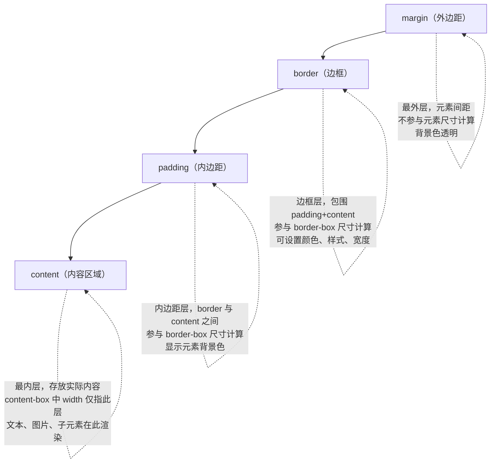

# CSS 布局核心

> 模块：01-html-css（第1周 HTML/CSS 基础）
> 定位：前端面试必考核心，掌握盒模型、BFC、Flex、Grid 等布局机制

---

## 一、核心概念

### 1.1 盒模型（Box Model）

CSS 盒模型是页面布局的基石，每个元素都被看作一个矩形盒子。盒模型由内到外分为四层：

```
margin（外边距） → border（边框） → padding（内边距） → content（内容）
```

> **生活化类比**：相框——照片（content）是核心内容，卡纸留白（padding）是照片与相框之间的空白区域，相框边框（border）是可见的装饰边框，墙上间距（margin）是相框与相框之间的距离。`content-box` 是照片尺寸，`border-box` 是含卡纸和边框的完整相框尺寸。

**两种盒模型对比**：

| 类型 | box-sizing 值 | width 包含范围 | 实际占用宽度计算公式 |
|------|:---:|------|------|
| 标准盒模型 | `content-box`（默认） | 仅 content | `width + padding + border + margin` |
| 替代盒模型 | `border-box` | content + padding + border | `width + margin` |

```css
/* 标准盒模型：元素实际宽度 = 200 + 20*2 + 5*2 = 250px */
.box-content {
    box-sizing: content-box;
    width: 200px;
    padding: 20px;
    border: 5px solid #333;
}

/* 替代盒模型：元素实际宽度 = 200px（content 自动缩小为 150px） */
.box-border {
    box-sizing: border-box;
    width: 200px;
    padding: 20px;
    border: 5px solid #333;
}
```

**最佳实践**：全局设置 `box-sizing: border-box`，避免复杂布局中尺寸计算困难。

```css
*,
*::before,
*::after {
    box-sizing: border-box;
}
```

**盒模型四层结构图：**



> 上图展示了 CSS 盒模型由外到内的四层结构：`margin`（外边距）、`border`（边框）、`padding`（内边距）和 `content`（内容区域）。`content-box` 模式下 `width` 仅指 `content` 层宽度，而 `border-box` 模式下 `width` 包含 `content + padding + border` 三层。理解这四层结构是掌握 CSS 布局的基础。

### 1.2 BFC（块级格式化上下文）

**BFC（Block Formatting Context）** 是一个独立的渲染区域，内部元素的布局不会影响外部元素。

> **生活化类比**：一个独立房间，房间里的家具摆放不会影响隔壁房间。BFC 就是这样一个"独立房间"，里面的元素无论怎么浮动都不会影响外部。

**BFC 的触发方式**：

| 触发方式 | 示例 |
|---------|------|
| 根元素 `<html>` | 默认触发 |
| `float` 不为 `none` | `float: left` |
| `position` 为 `absolute` 或 `fixed` | `position: absolute` |
| `display` 为 `inline-block` / `flex` / `grid` / `table-cell` | `display: flex` |
| `overflow` 不为 `visible` | `overflow: hidden` |
| `contain` 为 `layout` / `content` / `paint` | `contain: layout` |

**BFC 的应用场景**：

1. **清除浮动（解决父元素高度塌陷）**：给父元素设置 `overflow: hidden` 触发 BFC
2. **防止外边距折叠（margin 合并）**：将两个元素分别放入不同 BFC 容器
3. **防止元素被浮动元素覆盖**：让非浮动元素触发 BFC，实现自适应两栏布局

```css
/* 场景1：清除浮动 - 父元素高度塌陷 */
.clearfix {
    overflow: hidden; /* 触发 BFC，包裹浮动子元素 */
}

/* 场景2：防止 margin 合并 */
.bfc-container {
    overflow: hidden; /* 创建独立 BFC */
}

/* 场景3：两栏自适应布局 */
.left {
    float: left;
    width: 200px;
}
.right {
    overflow: hidden; /* 触发 BFC，不与浮动元素重叠 */
}
```

---

## 二、Flex 布局

### 2.1 容器属性（父元素）

设置 `display: flex` 后，元素成为 Flex 容器，其直接子元素成为 Flex 项目。

> **生活化类比**：抽屉里的可伸缩分隔板——分隔板的方向（flex-direction）决定物品是横排还是竖排。分隔板之间的物品可以随空间自动伸缩——空间多了就变宽（flex-grow），空间少了就变窄（flex-shrink）。justify-content 决定物品在分隔方向的分布方式，align-items 决定物品在垂直方向的对齐方式。默认情况下，物品会拉伸填满整个分隔板高度（align-items: stretch）。

| 属性 | 可选值 | 默认值 | 说明 |
|------|------|:---:|------|
| `flex-direction` | row / row-reverse / column / column-reverse | `row` | 主轴方向 |
| `flex-wrap` | nowrap / wrap / wrap-reverse | `nowrap` | 是否换行 |
| `justify-content` | flex-start / flex-end / center / space-between / space-around / space-evenly | `flex-start` | 主轴对齐方式 |
| `align-items` | stretch / flex-start / flex-end / center / baseline | `stretch` | 交叉轴对齐方式 |
| `align-content` | stretch / flex-start / flex-end / center / space-between / space-around | `stretch` | 多行时的交叉轴对齐 |
| `gap` | 长度值 | `0` | 项目间距（推荐替代 margin） |

```css
.container {
    display: flex;
    flex-direction: row;          /* 主轴水平，从左到右 */
    flex-wrap: wrap;              /* 允许换行 */
    justify-content: space-between; /* 两端对齐，中间均匀分布 */
    align-items: center;           /* 交叉轴居中 */
    gap: 16px;                    /* 项目间距 16px */
}
```

### 2.2 项目属性（子元素）

| 属性 | 说明 | 默认值 |
|------|------|:---:|
| `flex-grow` | 放大比例（剩余空间分配权重） | `0` |
| `flex-shrink` | 缩小比例（空间不足时收缩权重） | `1` |
| `flex-basis` | 项目在主轴上的初始大小 | `auto` |
| `flex` | grow / shrink / basis 的简写 | `0 1 auto` |
| `align-self` | 单独设置某个项目的交叉轴对齐 | `auto` |
| `order` | 项目排列顺序（数值越小越靠前） | `0` |

```css
/* flex: 1 等价于 flex: 1 1 0% — 等分剩余空间 */
.item-equal {
    flex: 1;
}

/* flex: auto 等价于 flex: 1 1 auto — 按内容大小分配剩余空间 */
.item-auto {
    flex: auto;
}

/* flex: none 等价于 flex: 0 0 auto — 不伸缩，保持原始大小 */
.item-fixed {
    flex: none;
}

/* 单独控制某个项目的对齐 */
.item-special {
    align-self: flex-end;
}
```

**flex 常见值速查**：

| 简写 | 展开 | 含义 |
|------|------|------|
| `flex: 1` | `flex-grow: 1; flex-shrink: 1; flex-basis: 0%` | 等分剩余空间 |
| `flex: auto` | `flex-grow: 1; flex-shrink: 1; flex-basis: auto` | 按内容比例分配 |
| `flex: none` | `flex-grow: 0; flex-shrink: 0; flex-basis: auto` | 不伸缩 |
| `flex: initial` | `flex-grow: 0; flex-shrink: 1; flex-basis: auto` | 默认值 |

> 📖 **参考链接**：
> - [MDN - Flexbox 布局](https://developer.mozilla.org/zh-CN/docs/Web/CSS/CSS_flexible_box_layout)
> - [MDN - flex](https://developer.mozilla.org/zh-CN/docs/Web/CSS/flex)

---

## 三、Grid 布局

Grid 是二维布局系统，同时控制行和列，适合复杂页面布局。

### 3.1 容器属性

```css
.grid-container {
    display: grid;
    /* 定义三列：两侧固定 200px，中间自适应 */
    grid-template-columns: 200px 1fr 200px;
    /* 定义行：第一行 60px，后续自动 */
    grid-template-rows: 60px auto;
    /* 行列间距 */
    gap: 16px;
    /* 隐式行的高度 */
    grid-auto-rows: 100px;
}
```

**fr 单位**：弹性系数，表示剩余空间中的等分比例。`1fr 2fr 1fr` 表示将剩余空间分为 4 份，三列分别占 1/4、2/4、1/4。

**auto-fill 与 auto-fit**：

```css
/* auto-fill：尽可能多创建列，即使有空列 */
.grid-fill {
    display: grid;
    grid-template-columns: repeat(auto-fill, minmax(200px, 1fr));
}

/* auto-fit：拉伸现有项目填满整行 */
.grid-fit {
    display: grid;
    grid-template-columns: repeat(auto-fit, minmax(200px, 1fr));
}
```

### 3.2 项目属性

```css
/* 按网格线编号定位（从 1 开始） */
.item {
    grid-column-start: 1;
    grid-column-end: 3;     /* 跨越 2 列 */
    grid-row-start: 1;
    grid-row-end: 3;        /* 跨越 2 行 */
}

/* 简写 */
.item {
    grid-column: 1 / 3;     /* 等价于 grid-column: 1 / span 2 */
    grid-row: 1 / 3;
}

/* grid-area 命名区域 */
.item-banner {
    grid-area: header;  /* 配合 grid-template-areas 使用 */
}

.grid-container {
    grid-template-areas:
        "header header header"
        "sidebar main main"
        "footer footer footer";
}
```

### 3.3 Flex vs Grid 选择指南

| 场景 | 推荐方案 | 原因 |
|------|---------|------|
| 一维排列（导航栏、列表） | Flex | 简单直观，单轴控制 |
| 二维布局（整体页面结构） | Grid | 同时控制行列，语义清晰 |
| 内容驱动（元素大小不固定） | Flex | 自动适应内容宽度 |
| 布局驱动（网格固定） | Grid | 精确控制网格结构 |
| 居中对齐 | Flex | `justify-content + align-items` 最简洁 |

> 📖 **参考链接**：
> - [MDN - Grid 布局](https://developer.mozilla.org/zh-CN/docs/Web/CSS/CSS_grid_layout)
> - [MDN - grid](https://developer.mozilla.org/zh-CN/docs/Web/CSS/grid)

---

## 四、元素居中方案

### 4.1 水平居中

| 方案 | 适用场景 | 代码 |
|------|---------|------|
| `text-align: center` | 行内元素/文本 | 父元素设置 |
| `margin: 0 auto` | 定宽块级元素 | 自身设置 |
| Flex | 任意元素 | 父元素 `display: flex; justify-content: center` |
| Grid | 任意元素 | 父元素 `display: grid; place-items: center` |
| `position + transform` | 任意元素 | `left: 50%; transform: translateX(-50%)` |

### 4.2 垂直居中

| 方案 | 适用场景 | 代码 |
|------|---------|------|
| `line-height` | 单行文本 | `line-height` 等于容器高度 |
| `vertical-align: middle` | 行内块/表格单元格 | 配合 `display: table-cell` |
| Flex | 任意元素 | 父元素 `display: flex; align-items: center` |
| Grid | 任意元素 | 父元素 `display: grid; align-items: center` |
| `position + transform` | 任意元素 | `top: 50%; transform: translateY(-50%)` |

### 4.3 水平垂直居中（完整方案）

```css
/* 方案1：Flex（推荐，最简洁） */
.parent-flex {
    display: flex;
    justify-content: center;
    align-items: center;
}

/* 方案2：Grid（一行搞定） */
.parent-grid {
    display: grid;
    place-items: center; /* place-items 是 align-items 和 justify-items 的简写 */
}

/* 方案3：absolute + transform（无需知道宽高） */
.parent-relative {
    position: relative;
}
.child-absolute {
    position: absolute;
    top: 50%;
    left: 50%;
    transform: translate(-50%, -50%);
}

/* 方案4：absolute + margin:auto（需知道宽高） */
.child-auto {
    position: absolute;
    top: 0;
    left: 0;
    right: 0;
    bottom: 0;
    width: 200px;
    height: 100px;
    margin: auto;
}
```

---

## 五、定位（Position）

| 值 | 参照物 | 是否脱离文档流 | 典型场景 |
|------|------|:---:|------|
| `static` | 无（默认值） | 否 | 默认布局 |
| `relative` | 自身原有位置 | 否（保留占位） | 微调位置、为 absolute 子元素建立定位上下文 |
| `absolute` | 最近的已定位祖先（非 static） | 是 | 弹窗、下拉菜单、Tooltip |
| `fixed` | 浏览器视口 | 是 | 固定导航栏、返回顶部按钮 |
| `sticky` | 最近的滚动祖先 | 否（达到阈值后固定） | 吸顶导航、表格表头固定 |

```css
/* sticky 典型用法：吸顶导航 */
.sticky-nav {
    position: sticky;
    top: 0;
    z-index: 100;
    background: #fff;
}

/* 场景：固定底部栏 */
.fixed-footer {
    position: fixed;
    bottom: 0;
    left: 0;
    right: 0;
    height: 60px;
}

/* 场景：绝对定位弹窗居中 */
.modal-overlay {
    position: fixed;
    top: 0;
    left: 0;
    right: 0;
    bottom: 0;
    background: rgba(0, 0, 0, 0.5);
}
.modal {
    position: absolute;
    top: 50%;
    left: 50%;
    transform: translate(-50%, -50%);
}
```

> 📖 **参考链接**：
> - [MDN - position](https://developer.mozilla.org/zh-CN/docs/Web/CSS/position)

---

## 六、浮动（Float）与清除浮动

### 6.1 浮动的特点

- 元素脱离正常文档流，向左或向右移动，直到碰到父容器边界或另一个浮动元素
- 浮动元素之后的块级元素会"无视"浮动元素，但行内元素会环绕浮动元素
- 父容器不会自动撑开以包含浮动子元素（高度塌陷）

### 6.2 清除浮动的方案

```css
/* 方案1：clearfix 伪元素（推荐，最常用） */
.clearfix::after {
    content: '';
    display: block;
    clear: both;
}

/* 方案2：触发父元素 BFC */
.parent-bfc {
    overflow: hidden; /* 或 overflow: auto */
}

/* 方案3：空标签法（不推荐，增加无意义标签） */
<div style="clear: both;"></div>

/* 方案4：父元素设置固定高度（不灵活） */
.parent {
    height: 300px;
}
```

**推荐方案**：clearfix 伪元素法，语义清晰、不污染 DOM 结构。

---

## 七、常见面试题

### 1. ★★ 标准盒模型和 IE 盒模型的区别？

**要点**：标准盒模型（content-box）width 只包含 content 区域；IE 盒模型（border-box）width 包含 content + padding + border。推荐全局使用 border-box，避免布局计算复杂。

### 2. ★★ BFC 是什么？如何触发？有哪些应用场景？

**要点**：BFC 是独立的渲染区域，触发方式包括 overflow: hidden、float、position: absolute/fixed、display: flex/grid 等。应用场景：清除浮动、防止 margin 折叠、自适应两栏布局。

### 3. ★★ Flex: 1 代表什么？和 flex: auto 有什么区别？

**要点**：flex: 1 等价于 flex-grow: 1; flex-shrink: 1; flex-basis: 0%，按剩余空间等分；flex: auto 等价于 flex-grow: 1; flex-shrink: 1; flex-basis: auto，按内容大小按比例分配。

### 4. ★★ Flex 和 Grid 的区别？各自适用场景？

**要点**：Flex 是一维布局，适合导航栏、列表等单方向排列；Grid 是二维布局，适合整体页面结构、复杂网格。Flex 内容驱动，Grid 布局驱动。

---

## 八、避坑指南

| 常见错误 | 现象 | 原因 | 解决方案 |
|---------|------|------|---------|
| 忘记设置 box-sizing | 加了 padding 后元素变宽撑破布局 | 默认 content-box，padding 额外增加宽度 | 全局设置 `*, *::before, *::after { box-sizing: border-box; }` |
| 浮动元素导致父容器高度塌陷 | 父容器高度为 0，下方元素上移 | 浮动元素脱离文档流 | 使用 clearfix 伪元素或触发父元素 BFC |
| Flex 布局中 align-items 不生效 | 交叉轴方向上元素没有对齐 | 忘记设置容器高度（交叉轴方向无可用空间） | 给 Flex 容器设置明确的高度 |
| position: absolute 参照物错误 | 元素定位到错误位置 | 最近的非 static 祖先不是预期的元素 | 检查祖先链，在正确的父元素上设置 `position: relative` |
| sticky 不生效 | 元素没有粘性定位效果 | 父元素设置了 overflow: hidden（sticky 需要滚动容器） | 确保 sticky 元素的祖先没有 overflow: hidden/auto/scroll |
| 使用 margin 做间距导致布局溢出 | 最后一个元素有额外 margin | margin 会参与盒模型计算 | 使用 gap 属性（Flex/Grid）或 `:last-child { margin: 0 }` |

---

## 本章学习自检

完成本章学习后，应该能够：
- [ ] 用自己的话解释 content-box 和 border-box 的区别
- [ ] 说出至少 3 种触发 BFC 的方式及其应用场景
- [ ] 手写 Flex 布局实现水平垂直居中
- [ ] 使用 Grid 布局实现三栏布局（两侧固定、中间自适应）
- [ ] 区分 static / relative / absolute / fixed / sticky 五种定位
- [ ] 写出至少 3 种清除浮动的方法
- [ ] 在面试中清晰回答 Flex vs Grid 的选择依据

---

> **学习导航**：
> - 返回 [学习路线总览](../README.md)
> - 本模块其他文件：[01-HTML核心与语义化](./01-HTML核心与语义化.md) | [03-CSS进阶与性能](./03-CSS进阶与性能.md) | [04-HTMLCSS笔面试题集](./04-HTMLCSS笔面试题集.md)
> - 实战应用：[企业后台管理系统](../10-project/01-企业后台管理系统实战.md)