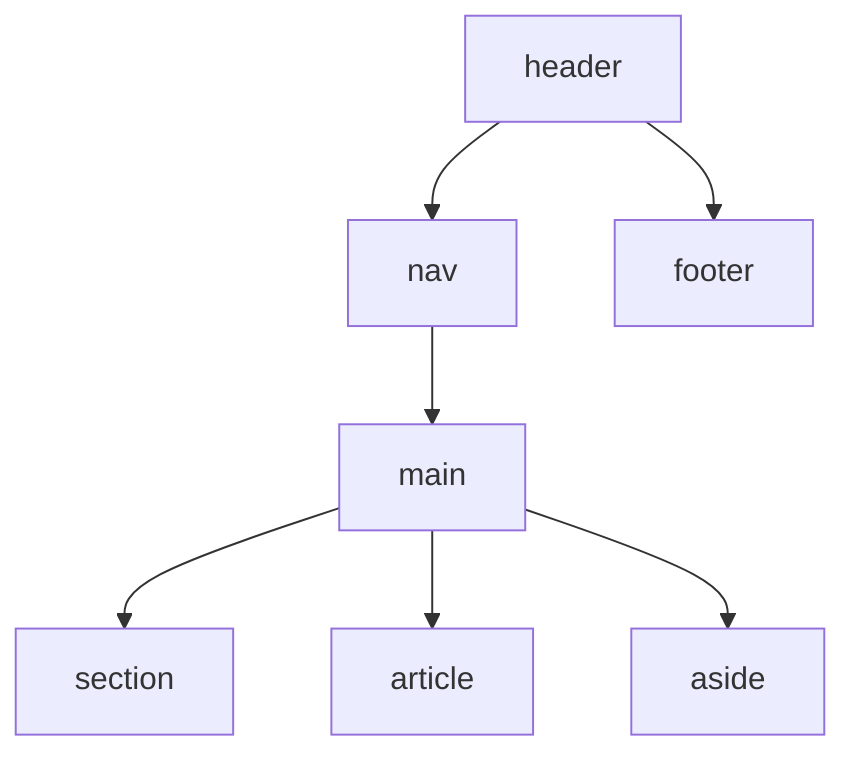

# HTML/CSS 笔面试题集

> 模块：01-html-css（第1周 HTML/CSS 基础）
> 覆盖：HTML5 语义化、CSS 盒模型、布局、响应式、动画、性能优化
> 题量：15 道选择题 + 10 道简答题 + 5 道场景设计题
> 难度标注：★基础  ★★中档  ★★★拔高

---

> 下图展示了 HTML5 语义化标签的层次结构，帮助理解页面骨架中各标签的嵌套关系与职责划分。



> 上图展示了 HTML5 语义化标签的层次结构，合理使用语义化标签能够提升页面的可读性、可访问性和 SEO 表现。

## 一、选择题（15 题，每题附解析）

### 1. ★ 标准盒模型中 width 属性指的是？

A. 包含 content、padding、border 三个区域
B. **仅包含 content 区域**
C. 包含 content + padding 两个区域
D. 包含 content + padding + border + margin 四个区域

**答案：B**

**解析**：标准盒模型（`box-sizing: content-box`）中，`width` 属性仅表示内容区（content）的宽度，padding 和 border 不包含在内，总宽度为 `width + padding + border + margin`。只有替代盒模型（`border-box`）的 width 才包含 content + padding + border。

---

### 2. ★ BFC 的全称是？

A. Block Format Context
B. Blocking Format Context
C. **Block Formatting Context**
D. Basic Formatting Container

**答案：C**

**解析**：BFC 全称 Block Formatting Context（块级格式化上下文），它是一个独立的渲染区域，内部布局不影响外部。

---

### 3. ★ Flex 布局中 justify-content 的作用是？

A. **主轴对齐方式**
B. 交叉轴对齐方式
C. 项目排列顺序
D. 是否允许换行

**答案：A**

**解析**：`justify-content` 控制项目在主轴方向上的对齐方式；`align-items` 控制项目在交叉轴方向上的对齐方式；`flex-direction` 控制主轴方向；`flex-wrap` 控制是否换行。

---

### 4. ★ 以下哪个 CSS 属性可以触发 BFC？

A. `display: block`
B. `margin: auto`
C. `position: static`
D. **`overflow: hidden`**

**答案：D**

**解析**：BFC 的触发方式包括：`overflow` 不为 `visible`（如 `overflow: hidden`）、`float` 不为 `none`、`position` 为 `absolute` 或 `fixed`、`display` 为 `inline-block` / `flex` / `grid` 等。

---

### 5. ★★ 以下哪个不是 CSS 伪类？

A. `:hover`
B. `:first-child`
C. `:active`
D. **`::before`**

**答案：D**

**解析**：伪类以单个冒号 `:` 开头，表示元素的状态（如 hover、active、focus）；伪元素以双冒号 `::` 开头，表示创建了一个新的虚拟元素（如 ::before、::after、::first-line）。

---

### 6. ★★ CSS 选择器的优先级计算正确的是？

A. `!important` > 类选择器 > ID > 内联 > 标签
B. `!important` > 内联 > ID > 标签 > 类选择器
C. **`!important` > 内联 > ID > 类 > 标签**
D. `!important` > ID > 内联 > 类 > 标签

**答案：C**

**解析**：CSS 优先级计算规则（从高到低）：`!important` > 内联样式（`style` 属性）> ID 选择器 > 类选择器/伪类/属性选择器 > 标签选择器。

---

### 7. ★★ position: sticky 的参照物是？

A. 浏览器视口
B. 父元素
C. **最近的滚动祖先**
D. 根元素 html

**答案：C**

**解析**：`position: sticky` 混合了 relative 和 fixed 的特性，在元素位置尚未到达阈值时是 relative，达到阈值后变成 fixed 固定，参照物是最近的滚动祖先元素。

---

### 8. ★★ 以下哪个属性会触发回流（Reflow）？

A. `color: #000`
B. `opacity: 0.5`
C. `box-shadow: 0 0 10px rgba(0,0,0,0.3)`
D. **`width: 100px`**

**答案：D**

**解析**：修改尺寸（width、height、margin、padding、border、top、left 等）会改变元素几何属性，触发回流；修改 opacity、box-shadow、color 只会触发重绘。

---

### 9. ★★ Grid 布局中 fr 单位表示？

A. 自由长度单位，按内容自适应
B. **弹性系数（剩余空间等分）**
C. 固定比例，相对于父容器
D. 最小宽度约束

**答案：B**

**解析**：fr 是"fraction"的缩写，表示剩余空间的弹性系数。例如 `grid-template-columns: 1fr 2fr 1fr` 表示将剩余空间分为 4 份，三列分别占 1/4、2/4、1/4。

---

### 10. ★★ flex: 1 是哪三个属性的简写？

A. `flex-grow: 1; flex-shrink: 0; flex-basis: auto;`
B. **`flex-grow: 1; flex-shrink: 1; flex-basis: 0%;`**
C. `flex-grow: 1; flex-shrink: 1; flex-basis: auto;`
D. `flex-grow: 1; flex-shrink: 0; flex-basis: 0%;`

**答案：B**

**解析**：CSS 规定 `flex: 1` 等价于 `flex: 1 1 0%`，即允许放大、允许缩小，初始大小为 0，实现等分剩余空间。

---

### 11. ★★★ 下面哪个 CSS 属性性能最好（不触发回流重绘）？

A. `width: 100px`
B. `top: 0`
C. `display: none`
D. **`transform: translateX(100px)`**

**答案：D**

**解析**：transform 和 opacity 的变化只会触发最终的 Composite（合成）阶段，不会触发 Layout（回流）和 Paint（重绘），性能最优。

---

### 12. ★★★ CSS 变量的正确使用方式是？

A. `--main-color: #333; color: var(--main-color);`
B. `@main-color: #333; color: @main-color;`
C. `$main-color: #333; color: $main-color;`
D. `var-main-color: #333; color: var-main-color;`

**答案：A**

**解析**：CSS 原生变量使用 `--变量名` 定义，使用 `var(变量名, 回退值)` 获取值；`$` 是 SASS/SCSS 语法，`@` 是 LESS 语法。

---

### 13. ★★ 以下哪种方式可以实现元素水平垂直居中？

A. `display: flex + justify-content: center + align-items: center`
B. `display: grid + place-items: center`
C. `position: absolute + top: 50% + left: 50% + transform: translate(-50%, -50%)`
D. **以上都可以**

**答案：D**

**解析**：三种方式都可以正确实现水平垂直居中，各有适用场景：Flex 和 Grid 代码更简洁；absolute + transform 不依赖父元素布局（父元素只需 `position: relative`）。

---

### 14. ★★ 媒体查询 @media 的常见断点不包括？

A. `@media (max-width: 768px)`
B. `@media (min-width: 1024px)`
C. **`@media (speed: fast)`**
D. `@media (min-width: 768px) and (max-width: 1024px)`

**答案：C**

**解析**：`speed` 不是有效的媒体特性。常见断点定义：<= 768px（移动端）、768-1024（平板）、>= 1024（桌面）。

---

### 15. ★★★ contain 属性的作用是什么？

A. 包含浮动元素
B. 控制元素溢出行为
C. **告诉浏览器元素的子树独立于页面其他部分，用于性能优化**
D. 改变元素包含块

**答案：C**

**解析**：`contain` 属性用于性能隔离，告诉浏览器该元素的渲染、布局不影响页面其他部分，浏览器可以优化渲染性能。常见值：`contain: layout style paint;`。

---

## 二、简答题（10 题，每题附要点）

### 1. ★★ 盒模型的两种类型及区别

**问题**：请简述标准盒模型（content-box）和 IE 怪异盒模型（border-box）的区别。

**要点**：
- content-box（标准）：`width` 只包含 content 区域，总宽度 = `width + padding + border + margin`
- border-box（替代/IE）：`width` 包含 content + padding + border，总宽度 = `width + margin`
- 推荐在全局设置 `* { box-sizing: border-box; }`，简化布局计算

> 📖 **参考链接**：
> - [MDN - box-sizing](https://developer.mozilla.org/zh-CN/docs/Web/CSS/box-sizing)
> - [MDN - CSS 盒模型](https://developer.mozilla.org/zh-CN/docs/Web/CSS/CSS_box_model/Introduction_to_the_CSS_box_model)

---

### 2. ★★ BFC 的触发方式和应用场景

**问题**：什么是 BFC？列举至少 3 种触发方式和常见应用场景。

**要点**：
- BFC（块级格式化上下文）是独立渲染区域，内部布局不影响外部
- 触发方式：`overflow: hidden` / `float: left` / `position: absolute/fixed` / `display: flex/grid` 等
- 应用场景：清除浮动（解决高度塌陷）、防止 margin 合并、浮动元素与非浮动元素自适应布局

> 📖 **参考链接**：
> - [MDN - 块级格式化上下文（BFC）](https://developer.mozilla.org/zh-CN/docs/Web/CSS/CSS_display/Block_formatting_context)
> - [MDN - display](https://developer.mozilla.org/zh-CN/docs/Web/CSS/display)

---

### 3. ★★ Flex 布局和 Grid 布局的区别和适用场景

**问题**：请对比 Flex 和 Grid，并说明各自适合什么场景。

**要点**：
- Flex：一维布局，单方向主轴，沿主轴排列项目，内容驱动
- Grid：二维布局，同时控制行和列，网格驱动
- Flex 适合一维排列：导航栏、列表、工具栏
- Grid 适合整体页面结构：栅格系统、多行列复杂布局
- 两者不互斥，经常配合使用

> 📖 **参考链接**：
> - [MDN - Flexbox 布局](https://developer.mozilla.org/zh-CN/docs/Web/CSS/CSS_flexible_box_layout)
> - [MDN - Grid 布局](https://developer.mozilla.org/zh-CN/docs/Web/CSS/CSS_grid_layout)

---

### 4. ★★ 回流和重绘的区别，如何减少回流

**问题**：什么是回流（Reflow）？什么是重绘（Repaint）？它们有什么区别？如何减少回流？

**要点**：
- 回流：浏览器重新计算元素几何属性（位置、尺寸），重新构建渲染树，性能开销大
- 重绘：元素外观改变，但几何属性不变，只需要重新绘制，开销较小
- 回流一定触发重绘，重绘不一定触发回流
- 减少回流策略：使用 `transform` 替代 `top/left` 做动画、批量修改 DOM、读写分离避免强制同步布局、使用 `will-change` 提示浏览器优化

> 📖 **参考链接**：
> - [MDN - transform](https://developer.mozilla.org/zh-CN/docs/Web/CSS/transform)
> - [MDN - Web 性能](https://developer.mozilla.org/zh-CN/docs/Web/Performance)

---

### 5. ★★ position 的五个值及参照物

**问题**：请说明 `static` / `relative` / `absolute` / `fixed` / `sticky` 五个定位值及其参照物。

**要点**：
- `static`：默认值，无定位，正常文档流
- `relative`：相对于**自身原始位置**，不脱离文档流
- `absolute`：相对于**最近已定位（非 static）祖先元素**，脱离文档流
- `fixed`：相对于**浏览器视口**，脱离文档流，滚动时位置不变
- `sticky`：相对于**最近滚动祖先**，达到阈值后固定，不脱离文档流

> 📖 **参考链接**：
> - [MDN - position](https://developer.mozilla.org/zh-CN/docs/Web/CSS/position)
> - [MDN - z-index](https://developer.mozilla.org/zh-CN/docs/Web/CSS/z-index)

---

### 6. ★★ CSS 选择器优先级计算规则

**问题**：CSS 选择器优先级如何计算？请给出规则并举例。

**要点**：
- 优先级从高到低：`!important` > 内联样式（1000）> ID 选择器（100）> 类/伪类/属性选择器（10）> 标签选择器（1）
- 权值累加，同权重后写覆盖先写
- 举例：`#nav .link a` = 100 + 10 + 1 = 111，`.header a.active` = 10 + 1 + 10 = 21，前者优先级更高
- `!important` 强制提升优先级，除非不得已不推荐使用

> 📖 **参考链接**：
> - [MDN - 优先级（Specificity）](https://developer.mozilla.org/zh-CN/docs/Web/CSS/CSS_cascade/Specificity)
> - [MDN - CSS 层叠](https://developer.mozilla.org/zh-CN/docs/Web/CSS/Cascade)

---

### 7. ★★★ CSS 动画性能优化（transform vs top/left）

**问题**：为什么使用 transform 做动画比修改 top/left 性能更好？

**要点**：
- 修改 top/left 会触发回流（Layout）→ 重绘（Paint）→ 合成（Composite）完整流程
- 修改 transform 只触发合成（Composite），不经过 Layout 和 Paint 阶段
- transform 动画通常在 GPU 合成层上执行，利用硬件加速
- 每次回流都需要浏览器重新计算整个文档的布局，开销巨大，动画卡顿

> 📖 **参考链接**：
> - [MDN - transform](https://developer.mozilla.org/zh-CN/docs/Web/CSS/transform)
> - [MDN - will-change](https://developer.mozilla.org/zh-CN/docs/Web/CSS/will-change)

---

### 8. ★★ 响应式布局的实现方案

**问题**：请列举几种常见的响应式布局实现方案。

**要点**：
- 媒体查询（@media）：根据不同断点应用不同样式，适合多端适配
- 流式布局：使用百分比 % 做宽度，根据父容器自适应
- Flex 布局：弹性布局，根据空间自动伸缩
- Grid 布局：二维栅格，配合 `auto-fit/auto-fill` + `minmax()` 实现响应式
- rem/vw 方案：使用相对单位，根据屏幕宽度自动缩放
- 混合方案：媒体查询 + Flex + rem/vw 结合使用

> 📖 **参考链接**：
> - [MDN - 媒体查询](https://developer.mozilla.org/zh-CN/docs/Web/CSS/CSS_media_queries)
> - [MDN - @media](https://developer.mozilla.org/zh-CN/docs/Web/CSS/@media)

---

### 9. ★★ 清除浮动的方法

**问题**：浮动导致父元素高度塌陷，有哪些清除浮动的方法？

**要点**：
- 伪元素 clearfix 法（推荐）：给父元素添加 `::after`，设置 `content: ''; display: block; clear: both;`
- 触发父元素 BFC：设置 `overflow: hidden` / `overflow: auto`
- 额外空标签法：在最后一个浮动元素后加空 div，设置 `clear: both`（不推荐，增加无意义 DOM）
- 父元素设置固定高度：不灵活，不推荐

> 📖 **参考链接**：
> - [MDN - float](https://developer.mozilla.org/zh-CN/docs/Web/CSS/float)
> - [MDN - clear](https://developer.mozilla.org/zh-CN/docs/Web/CSS/clear)

---

### 10. ★★★ em/rem/vh/vw 的区别和适用场景

**问题**：请说明 em、rem、vh、vw 四个单位的区别，以及分别适合什么场景。

**要点**：
- em：相对于**父元素**的 `font-size`，适合组件内部相对尺寸，但多层嵌套会累积放大
- rem：相对于**根元素（html）**的 `font-size`，适合全局尺寸控制，不会累积，推荐优先使用
- vh：相对于视口高度，1vh = 1% 视口高度，适合全屏高度（`100vh` = 全屏）
- vw：相对于视口宽度，1vw = 1% 视口宽度，适合全屏宽度、根据屏幕宽度等比例缩放
- 移动端适配常配合 rem + vw 使用：`html { font-size: calc(100vw / 375 * 16); }`

> 📖 **参考链接**：
> - [MDN - CSS 值和单位](https://developer.mozilla.org/zh-CN/docs/Web/CSS/CSS_Values_and_Units)
> - [MDN - font-size](https://developer.mozilla.org/zh-CN/docs/Web/CSS/font-size)

---

## 三、场景设计题（5 题，每题附思路和核心代码）

### 1. ★★ 题目：设计一个三栏布局（左右固定宽度，中间自适应）

**要求**：左栏 200px，右栏 150px，中栏自适应宽度，写出至少两种方案。

**思路 1：Flex 方案（推荐，简洁现代）**

```css
.container {
    display: flex;
}
.left {
    width: 200px;
    flex-shrink: 0; /* 禁止收缩 */
}
.center {
    flex: 1; /* 剩余空间全部给中间 */
}
.right {
    width: 150px;
    flex-shrink: 0;
}
```

**思路 2：Grid 方案（更直观）**

```css
.container {
    display: grid;
    grid-template-columns: 200px 1fr 150px;
}
```

**思路 3：传统浮动+BFC方案（兼容性好）**

```css
.left {
    float: left;
    width: 200px;
}
.right {
    float: right;
    width: 150px;
}
.center {
    overflow: hidden; /* 触发 BFC，不与浮动重叠 */
}
```

---

### 2. ★★ 题目：设计一个响应式导航栏（移动端汉堡菜单）

**要求**：桌面端显示完整导航链接，移动端只显示汉堡菜单，点击展开导航。

**思路**：使用 Flex 实现导航栏，媒体查询在小屏幕隐藏完整菜单，显示汉堡按钮，配合 JS 切换展开状态。

**核心代码**：

```html
<header class="navbar">
    <div class="logo">龙江交投</div>
    <button class="hamburger" id="hamburger">☰</button>
    <nav class="nav-menu" id="navMenu">
        <a href="/">首页</a>
        <a href="/about">关于</a>
        <a href="/business">业务</a>
        <a href="/contact">联系我们</a>
    </nav>
</header>
```

```css
.navbar {
    display: flex;
    align-items: center;
    justify-content: space-between;
    padding: 0 20px;
    height: 60px;
    background: #fff;
    box-shadow: 0 2px 4px rgba(0,0,0,0.1);
}
.hamburger {
    display: none;
    border: none;
    background: none;
    font-size: 24px;
    cursor: pointer;
}
.nav-menu {
    display: flex;
    gap: 24px;
}
@media (max-width: 768px) {
    .hamburger {
        display: block;
    }
    .nav-menu {
        display: none; /* 默认隐藏 */
        position: absolute;
        top: 60px;
        left: 0;
        right: 0;
        background: #fff;
        flex-direction: column;
        padding: 16px;
        box-shadow: 0 4px 4px rgba(0,0,0,0.1);
    }
    .nav-menu.open {
        display: flex; /* 点击后展开 */
    }
}
```

```javascript
document.getElementById('hamburger').addEventListener('click', () => {
    document.getElementById('navMenu').classList.toggle('open');
});
```

---

### 3. ★★★ 题目：实现一个无限滚动加载的图片列表（CSS + JS）

**要求**：图片列表网格排列，滚动到底部自动加载下一页。

**思路**：使用 Grid 实现响应式图片网格，监听滚动事件，当滚动到接近底部时触发加载，使用 IntersectionObserver 监听最后一项更高效。

**核心布局代码**：

```css
.image-grid {
    display: grid;
    grid-template-columns: repeat(auto-fill, minmax(200px, 1fr));
    gap: 16px;
    padding: 16px;
}
.image-item {
    aspect-ratio: 4/3;
    overflow: hidden;
    border-radius: 8px;
}
.image-item img {
    width: 100%;
    height: 100%;
    object-fit: cover;
}
.loading {
    text-align: center;
    padding: 20px;
    color: #999;
}
```

**IntersectionObserver 核心 JS**：

```javascript
const observer = new IntersectionObserver(entries => {
    const lastItem = entries[0];
    if (lastItem.isIntersecting) {
        // 到达最后一项，加载下一页
        loadMore();
    }
}, { rootMargin: '200px' }); // 提前 200px 开始加载

// 每次加载完更新监听
function updateObserver() {
    const items = document.querySelectorAll('.image-item');
    if (items.length > 0) {
        observer.observe(items[items.length - 1]);
    }
}
```

---

### 4. ★★ 题目：实现一个 sticky 表头+首列的表格

**要求**：表格滚动时，表头固定在顶部，第一列固定在左侧，表头和第一列交叉处同时固定。

**思路**：表头使用 `position: sticky` + `top: 0` 固定，首列使用 `position: sticky` + `left: 0` 固定，交叉单元格（表头第一列）同时设置 `top: 0` 和 `left: 0`，并设置更高 z-index。

**核心代码**：

```html
<div class="table-container">
    <table>
        <thead>
            <tr>
                <th>名称</th> <!-- 交叉单元格 -->
                <th>列1</th>
                <th>列2</th>
                <!-- 更多列 -->
            </tr>
        </thead>
        <tbody>
            <tr>
                <td>固定项1</td>
                <td>数据1</td>
                <td>数据2</td>
            </tr>
            <!-- 更多行 -->
        </tbody>
    </table>
</div>
```

```css
.table-container {
    max-height: 400px;
    overflow: auto;
}
th {
    background: #fff;
    position: sticky;
    top: 0; /* 表头吸顶 */
    z-index: 1;
}
td:first-child,
th:first-child {
    background: #fff;
    position: sticky;
    left: 0; /* 首列吸左 */
    z-index: 2;
}
th:first-child {
    z-index: 3; /* 交叉单元格层级最高 */
}
```

---

### 5. ★★★ 题目：设计一个暗黑模式切换方案（CSS 变量实现）

**要求**：点击按钮切换明暗主题，样式通过 CSS 变量管理，保存用户偏好到 localStorage。

**思路**：所有颜色使用 CSS 变量，切换主题时只需修改根元素上的变量值，使用 localStorage 持久化存储用户选择，页面加载时读取偏好。

**核心代码**：

```css
/* 定义 CSS 变量 */
:root {
    --bg-color: #ffffff;
    --text-color: #333333;
    --card-bg: #f5f5f5;
    --border-color: #e5e5e5;
}
[data-theme="dark"] {
    --bg-color: #121212;
    --text-color: #e0e0e0;
    --card-bg: #1e1e1e;
    --border-color: #333333;
}

/* 使用变量 */
body {
    background-color: var(--bg-color);
    color: var(--text-color);
    transition: background-color 0.3s, color 0.3s;
}
.card {
    background: var(--card-bg);
    border: 1px solid var(--border-color);
}
```

```javascript
// 读取本地存储的主题
const savedTheme = localStorage.getItem('theme') || 'light';
document.documentElement.setAttribute('data-theme', savedTheme);

// 切换主题
document.getElementById('themeToggle').addEventListener('click', () => {
    const current = document.documentElement.getAttribute('data-theme');
    const next = current === 'light' ? 'dark' : 'light';
    document.documentElement.setAttribute('data-theme', next);
    localStorage.setItem('theme', next);
});

// 配合系统主题
const systemPrefersDark = window.matchMedia('(prefers-color-scheme: dark)').matches;
if (!localStorage.getItem('theme') && systemPrefersDark) {
    document.documentElement.setAttribute('data-theme', 'dark');
}
```

---

> **学习导航**：
> - 返回 [学习路线总览](../README.md)
> - 本模块原理文件：[01-HTML核心与语义化](./01-HTML核心与语义化.md) | [02-CSS布局核心](./02-CSS布局核心.md) | [03-CSS进阶与性能](./03-CSS进阶与性能.md)
> - 实战应用：[企业后台管理系统](../10-project/01-企业后台管理系统实战.md)

---

## 本章学习自检

完成本模块学习后，请逐一确认以下知识点：

- [ ] 我能说出 HTML5 新增的 8 个以上语义化标签及其使用场景
- [ ] 我能区分块级元素、行内元素、行内块元素，并说出各自的特点
- [ ] 我能解释标准盒模型和 IE 盒模型的区别，以及 `box-sizing` 的作用
- [ ] 我能说出 BFC 的触发条件、特性及常见应用场景（解决外边距合并、浮动塌陷）
- [ ] 我能手写 Flex 布局的水平垂直居中，并说出容器属性和项目属性各有哪些
- [ ] 我能说出 Grid 布局中 `fr` 单位和 `grid-template-areas` 的用法
- [ ] 我能列举 3 种以上 CSS 水平垂直居中方案，并说出各自的适用场景
- [ ] 我能解释回流（Reflow）和重绘（Repaint）的区别，列举 3 种以上触发回流的情况
- [ ] 我能说出媒体查询的语法，并解释移动端适配中 rem/vw/vh 的原理
- [ ] 我能说出 CSS 选择器的优先级计算规则（!important > 内联 > ID > 类 > 标签）