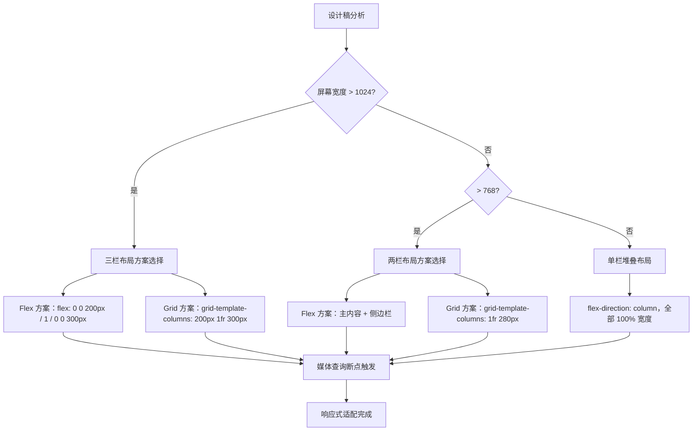

# HTML与CSS - 综合场景串联

---

## 场景一：实现响应式三栏布局

### 场景描述
实现一个通用的响应式三栏布局：左侧导航栏固定宽度200px，右侧侧边栏固定宽度300px，中间主内容区域自适应剩余宽度。在小屏幕设备上三栏变为上下堆叠的单栏布局。要求兼容主流浏览器，不使用第三方框架。



> 上图展示了响应式网页布局的适配流程，从设计稿出发，通过媒体查询定义断点，最终实现多终端设备的完美适配。

### 涉及知识点
- [CSS布局核心](./02-CSS布局核心.md)：flex布局、Grid布局、浮动布局、外边距方案
- [CSS进阶与性能](./03-CSS进阶与性能.md)：媒体查询、响应式设计、盒模型
- [HTML核心与语义化](./01-HTML核心与语义化.md)：语义化标签（header、main、aside、footer）

### 协作流程
1. 使用语义化HTML标签构建页面骨架：`<header>` 顶部导航，`<main>` 中间内容区，`<aside>` 侧边栏，`<footer>` 底部
2. 采用flex布局实现三栏排列：父容器设置`display: flex`，左侧设置`flex: 0 0 200px`，右侧设置`flex: 0 0 300px`，中间设置`flex: 1`自适应
3. 全局设置`box-sizing: border-box`确保宽度计算一致，避免padding和border影响布局
4. 添加媒体查询断点（如768px），小屏幕下将flex-direction切换为column，三栏宽度均设为100%
5. 使用`min-height: 100vh`确保页面至少占满视口高度，`overflow: auto`处理内容溢出
6. 可选优化：使用Grid布局的`grid-template-columns: 200px 1fr 300px`实现同样效果，代码更简洁

### 关键要点
- 三栏布局的经典方案对比：flex方案最简单直观，Grid方案语义最清晰，圣杯/双飞翼方案兼容性最好但代码复杂
- 响应式切换时需同步调整字体大小和间距，使用rem或em单位统一缩放
- 移动端优先策略：从最小屏幕开始编写CSS，通过min-width断点逐步增强布局
- 使用`gap`属性替代传统的margin控制间距，使代码更简洁

> **生活类比**：Flex 布局就像橡皮筋——把几个橡皮筋串在一起，拉长时它们按比例伸缩（flex-grow），缩短时也按比例压缩（flex-shrink），你还可以设置每个橡皮筋的基础长度（flex-basis）。Grid 布局则像棋盘——每个格子位置固定，你把棋子放在第几行第几列，它就在那里，不会因为其他棋子的变化而移动。

---

## 场景二：实现移动端适配的H5活动页面

### 场景描述
实现一个移动端H5活动页面，包含顶部Banner图、倒计时模块、商品列表、底部固定按钮。要求在不同手机屏幕尺寸下完美适配，适配retina屏幕，首屏加载迅速。

### 涉及知识点
- [HTML核心与语义化](./01-HTML核心与语义化.md)：viewport配置、meta标签
- [CSS布局核心](./02-CSS布局核心.md)：flex布局、定位、BFC
- [CSS进阶与性能](./03-CSS进阶与性能.md)：rem适配方案、媒体查询、图片优化、动画性能

### 协作流程
1. 设置viewport元标签：`<meta name="viewport" content="width=device-width, initial-scale=1.0, maximum-scale=1.0, user-scalable=no">`
2. 采用rem适配方案：根元素`html { font-size: calc(100vw / 7.5) }`（基于750px设计稿），所有尺寸使用rem单位
3. 使用flex布局实现商品列表，`flex-wrap: wrap`自动换行，每个商品卡片`flex: 0 0 calc(50% - 10px)`
4. 底部固定按钮使用`position: fixed; bottom: 0; left: 0; right: 0`，配合底部`padding-bottom`避免内容被遮挡
5. Banner图使用`<picture>`标签配合`srcset`实现不同分辨率适配，使用WebP格式减少体积
6. 倒计时模块使用CSS动画实现数字刷新效果，使用`transform: scale()`避免重排
7. 使用`will-change`属性提示浏览器优化动画元素，动画结束后移除该属性

### 关键要点
- rem适配方案：基于视口宽度的动态font-size，配合PostCSS的px2rem插件自动转换
- 1px边框问题：使用`transform: scale(0.5)`配合伪元素实现高清屏下的0.5px边框
- 图片懒加载：使用`loading="lazy"`属性或Intersection Observer API实现按需加载
- 移动端点击延迟：使用`touch-action: manipulation`或设置`viewport`消除300ms延迟

### 完整可运行示例：H5 活动页面

```html
<!DOCTYPE html>
<html lang="zh-CN">
<head>
  <meta charset="UTF-8">
  <meta name="viewport" content="width=device-width, initial-scale=1.0, maximum-scale=1.0, user-scalable=no">
  <title>限时秒杀活动</title>
  <style>
    * { margin: 0; padding: 0; box-sizing: border-box; }
    html { font-size: calc(100vw / 7.5); }
    body { font-family: -apple-system, BlinkMacSystemFont, sans-serif; font-size: 0.28rem; color: #333; background: #f5f5f5; padding-bottom: 1.2rem; }
    .banner { width: 100%; height: 3.6rem; background: linear-gradient(135deg, #ff6b6b, #ff8e53); display: flex; align-items: center; justify-content: center; color: #fff; font-size: 0.48rem; font-weight: bold; }
    .countdown { display: flex; align-items: center; justify-content: center; padding: 0.3rem; background: #fff; margin: 0.2rem 0; }
    .countdown .label { font-size: 0.28rem; margin-right: 0.2rem; }
    .countdown .time-box { display: inline-block; width: 0.6rem; height: 0.6rem; line-height: 0.6rem; text-align: center; background: #333; color: #fff; border-radius: 0.08rem; font-size: 0.3rem; font-weight: bold; margin: 0 0.08rem; }
    .countdown .separator { font-size: 0.3rem; font-weight: bold; }
    .product-list { display: flex; flex-wrap: wrap; padding: 0 0.2rem; gap: 0.2rem; }
    .product-card { flex: 0 0 calc(50% - 0.1rem); background: #fff; border-radius: 0.12rem; overflow: hidden; }
    .product-card .img { width: 100%; height: 2.4rem; background: #eee; display: flex; align-items: center; justify-content: center; color: #999; font-size: 0.24rem; }
    .product-card .info { padding: 0.16rem; }
    .product-card .name { font-size: 0.26rem; margin-bottom: 0.08rem; overflow: hidden; text-overflow: ellipsis; white-space: nowrap; }
    .product-card .price { color: #ff4757; font-size: 0.32rem; font-weight: bold; }
    .product-card .price .original { color: #999; font-size: 0.22rem; text-decoration: line-through; margin-left: 0.1rem; font-weight: normal; }
    .fixed-btn { position: fixed; bottom: 0; left: 0; right: 0; height: 1rem; background: linear-gradient(135deg, #ff6b6b, #ff4757); color: #fff; font-size: 0.32rem; font-weight: bold; border: none; cursor: pointer; display: flex; align-items: center; justify-content: center; }
  </style>
</head>
<body>
  <div class="banner">限时秒杀 · 全场五折</div>

  <div class="countdown">
    <span class="label">距离结束还剩</span>
    <span class="time-box" id="hour">00</span>
    <span class="separator">:</span>
    <span class="time-box" id="minute">00</span>
    <span class="separator">:</span>
    <span class="time-box" id="second">00</span>
  </div>

  <div class="product-list">
    <div class="product-card">
      <div class="img">商品图片</div>
      <div class="info"><div class="name">商品名称 A</div><div class="price">¥99 <span class="original">¥199</span></div></div>
    </div>
    <div class="product-card">
      <div class="img">商品图片</div>
      <div class="info"><div class="name">商品名称 B</div><div class="price">¥149 <span class="original">¥299</span></div></div>
    </div>
  </div>

  <button class="fixed-btn">立即抢购</button>

  <script>
    (function() {
      const endTime = Date.now() + 2 * 3600 * 1000 + 30 * 60 * 1000 + 15 * 1000;
      function update() {
        const diff = Math.max(0, endTime - Date.now());
        const h = Math.floor(diff / 3600000);
        const m = Math.floor((diff % 3600000) / 60000);
        const s = Math.floor((diff % 60000) / 1000);
        document.getElementById('hour').textContent = String(h).padStart(2, '0');
        document.getElementById('minute').textContent = String(m).padStart(2, '0');
        document.getElementById('second').textContent = String(s).padStart(2, '0');
        if (diff > 0) requestAnimationFrame(update);
      }
      update();
    })();
  </script>
</body>
</html>
```

---

## 完整可运行示例：响应式页面布局

```html
<!DOCTYPE html>
<html lang="zh-CN">
<head>
  <meta charset="UTF-8">
  <meta name="viewport" content="width=device-width, initial-scale=1.0">
  <title>响应式三栏布局</title>
  <style>
    * {
      margin: 0;
      padding: 0;
      box-sizing: border-box;
    }

    body {
      font-family: -apple-system, BlinkMacSystemFont, 'Segoe UI', Roboto, sans-serif;
      color: #333;
      min-height: 100vh;
      display: flex;
      flex-direction: column;
    }

    /* 顶部导航栏 */
    .navbar {
      background: #1a1a2e;
      color: #fff;
      padding: 0 24px;
      height: 60px;
      display: flex;
      align-items: center;
      justify-content: space-between;
      position: sticky;
      top: 0;
      z-index: 100;
    }

    .navbar .logo {
      font-size: 20px;
      font-weight: 700;
      letter-spacing: 1px;
    }

    .navbar .nav-links {
      display: flex;
      list-style: none;
      gap: 24px;
    }

    .navbar .nav-links a {
      color: #ccc;
      text-decoration: none;
      font-size: 14px;
      transition: color 0.2s;
    }

    .navbar .nav-links a:hover {
      color: #fff;
    }

    .navbar .menu-toggle {
      display: none;
      background: none;
      border: none;
      color: #fff;
      font-size: 24px;
      cursor: pointer;
    }

    /* 主体区域：Flexbox 三栏布局 */
    .main-wrapper {
      display: flex;
      flex: 1;
      min-height: 0;
    }

    /* 左侧边栏 */
    .sidebar-left {
      flex: 0 0 220px;
      background: #f5f6fa;
      padding: 20px;
      border-right: 1px solid #e0e0e0;
      overflow-y: auto;
    }

    .sidebar-left h3 {
      font-size: 14px;
      color: #888;
      text-transform: uppercase;
      margin-bottom: 16px;
    }

    .sidebar-left .menu-item {
      display: block;
      padding: 10px 12px;
      color: #555;
      text-decoration: none;
      border-radius: 6px;
      font-size: 14px;
      margin-bottom: 4px;
      transition: background 0.2s;
    }

    .sidebar-left .menu-item:hover,
    .sidebar-left .menu-item.active {
      background: #e8eaff;
      color: #1a1a2e;
      font-weight: 600;
    }

    /* 中间内容区 */
    .content {
      flex: 1;
      padding: 24px;
      overflow-y: auto;
      background: #fff;
    }

    .content h2 {
      font-size: 22px;
      margin-bottom: 16px;
    }

    .content .card-grid {
      display: grid;
      grid-template-columns: repeat(auto-fill, minmax(280px, 1fr));
      gap: 16px;
    }

    .content .card {
      background: #fafafa;
      border: 1px solid #eee;
      border-radius: 8px;
      padding: 20px;
      transition: box-shadow 0.2s;
    }

    .content .card:hover {
      box-shadow: 0 4px 12px rgba(0, 0, 0, 0.08);
    }

    .content .card h4 {
      font-size: 16px;
      margin-bottom: 8px;
    }

    .content .card p {
      font-size: 13px;
      color: #777;
      line-height: 1.6;
    }

    /* 右侧侧边栏 */
    .sidebar-right {
      flex: 0 0 280px;
      background: #fafbfc;
      padding: 20px;
      border-left: 1px solid #e0e0e0;
      overflow-y: auto;
    }

    .sidebar-right h3 {
      font-size: 14px;
      color: #888;
      text-transform: uppercase;
      margin-bottom: 16px;
    }

    .sidebar-right .info-item {
      padding: 10px 0;
      border-bottom: 1px solid #eee;
      font-size: 13px;
      color: #555;
    }

    .sidebar-right .info-item:last-child {
      border-bottom: none;
    }

    /* 底部 */
    .footer {
      background: #1a1a2e;
      color: #999;
      text-align: center;
      padding: 16px 24px;
      font-size: 13px;
    }

    /* ===== 响应式：平板端（≤1024px）===== */
    @media (max-width: 1024px) {
      .sidebar-right {
        flex: 0 0 220px;
      }
    }

    /* ===== 响应式：移动端（≤768px）===== */
    @media (max-width: 768px) {
      .navbar .nav-links {
        display: none;
      }

      .navbar .menu-toggle {
        display: block;
      }

      .main-wrapper {
        flex-direction: column;
      }

      .sidebar-left,
      .sidebar-right {
        flex: none;
        width: 100%;
        border-right: none;
        border-left: none;
        border-bottom: 1px solid #e0e0e0;
      }

      .content {
        order: -1;
      }

      .content .card-grid {
        grid-template-columns: 1fr;
      }
    }

    /* ===== 响应式：小屏手机（≤480px）===== */
    @media (max-width: 480px) {
      .navbar {
        padding: 0 12px;
        height: 50px;
      }

      .content {
        padding: 16px;
      }

      .sidebar-left,
      .sidebar-right {
        padding: 12px;
      }
    }
  </style>
</head>
<body>

  <!-- 顶部导航栏 -->
  <header class="navbar">
    <div class="logo">MySite</div>
    <ul class="nav-links">
      <li><a href="#">首页</a></li>
      <li><a href="#">产品</a></li>
      <li><a href="#">关于</a></li>
      <li><a href="#">联系</a></li>
    </ul>
    <button class="menu-toggle" aria-label="菜单">&#9776;</button>
  </header>

  <!-- 主体三栏区域 -->
  <div class="main-wrapper">
    <!-- 左侧导航栏 -->
    <aside class="sidebar-left">
      <h3>导航菜单</h3>
      <a href="#" class="menu-item active">仪表盘</a>
      <a href="#" class="menu-item">用户管理</a>
      <a href="#" class="menu-item">订单列表</a>
      <a href="#" class="menu-item">数据分析</a>
      <a href="#" class="menu-item">系统设置</a>
    </aside>

    <!-- 中间内容区 -->
    <main class="content">
      <h2>仪表盘</h2>
      <div class="card-grid">
        <div class="card">
          <h4>用户总数</h4>
          <p>12,580 位活跃用户</p>
        </div>
        <div class="card">
          <h4>订单数量</h4>
          <p>本月已完成 3,240 笔订单</p>
        </div>
        <div class="card">
          <h4>营收数据</h4>
          <p>本月营收 ¥ 856,000</p>
        </div>
        <div class="card">
          <h4>系统状态</h4>
          <p>所有服务运行正常</p>
        </div>
      </div>
    </main>

    <!-- 右侧侧边栏 -->
    <aside class="sidebar-right">
      <h3>最新动态</h3>
      <div class="info-item">系统版本 v2.4.1 已发布</div>
      <div class="info-item">本周新增 128 位用户</div>
      <div class="info-item">服务器运行时间 99.9%</div>
      <div class="info-item">下次维护：7月15日</div>
    </aside>
  </div>

  <!-- 底部 -->
  <footer class="footer">
    &copy; 2026 MySite. All rights reserved.
  </footer>

</body>
</html>
```

---

---

## 常见错误

### 1. 忘记设置 `box-sizing: border-box`

```css
/* 错误：padding 和 border 会撑大元素 */
.sidebar {
  width: 200px;
  padding: 20px;
  border: 1px solid #eee;
  /* 实际占用宽度 = 200 + 40 + 2 = 242px，导致布局错乱 */
}

/* 正确：统一设置 border-box */
*,
*::before,
*::after {
  box-sizing: border-box;
}
```

### 2. 媒体查询断点写在后面却被前面的覆盖

```css
/* 错误：大屏样式写在媒体查询之后，移动端样式会被覆盖 */
.sidebar { width: 100%; }
@media (min-width: 768px) {
  .sidebar { width: 200px; }
}
.sidebar { width: 300px; } /* 这行覆盖了上面的媒体查询！ */

/* 正确：将媒体查询放在默认样式之后 */
.sidebar { width: 100%; }
.sidebar { width: 300px; } /* 桌面端默认 */
@media (max-width: 768px) {
  .sidebar { width: 100%; } /* 移动端覆盖 */
}
```

### 3. rem 适配时忘记设置 `html` 的 `font-size`

```css
/* 错误：使用了 rem 但未设置根元素字体大小 */
.title { font-size: 0.32rem; } /* 实际等于 16px * 0.32 = 5.12px，根本不是预期值 */

/* 正确：基于设计稿 750px 设置根字体大小 */
html {
  font-size: calc(100vw / 7.5); /* 1rem = 100px (在 750px 宽屏幕上) */
}
```

### 4. flex 子元素设置 `flex: 1` 但不设置 `min-width: 0`

```css
/* 错误：flex 子元素内容溢出时不会收缩 */
.content {
  flex: 1;
  /* 缺少 min-width: 0，子元素内容过长时会撑破布局 */
}

/* 正确：设置 min-width: 0 允许收缩到比内容更小 */
.content {
  flex: 1;
  min-width: 0;
  overflow: hidden;
  text-overflow: ellipsis;
}
```

---

> [返回模块目录](../README.md) | [返回知识导览](../知识导览.md)