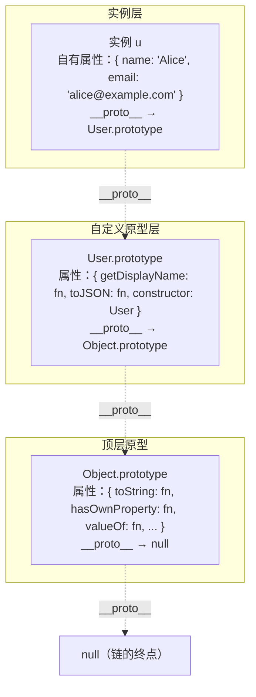
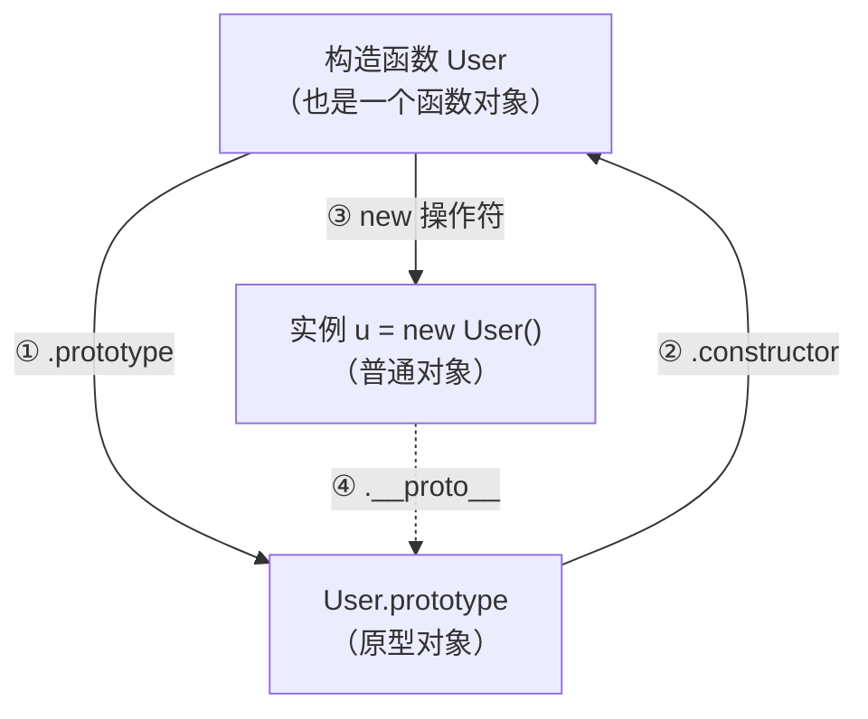

# 原型链查找与函数 prototype 关联流程图

> 模块：02-javascript-core（第2周 JavaScript 核心）
> 难度：★★★ 核心基础
> 前置知识：[执行上下文与作用域链](./01-语法基础与执行机制.md)
> 关联文档：[双链协同对比图](./01-语法基础与执行机制-双链协同图.md)

***

## 一、原型链是什么（用生活类比引入）

在 JavaScript 中，每个对象都有一个隐藏的内部属性 `[[Prototype]]`（浏览器中通过 `__proto__` 暴露），指向它的"原型"对象。当访问一个对象的属性时，如果自身没有，就会沿着这条链向上查找，直到找到或到达终点。这条链就是**原型链**。

下面用三个生活类比来理解它：


### 类比：企业工单系统（聚焦"自动查找+逐级升级"）

员工遇到 IT 问题，不需要自己知道该找谁——工单系统会**自动逐级分配**：

```
部门 IT 支持（实例自身）→ 处理不了 → 自动升级到公司 IT 部（prototype）
                                    → 还是处理不了 → 升级到集团 IT 总部（Object.prototype）
                                                  → 总部也处理不了 → 已到最高级别（null）→ 工单标记"暂无解决方案"（undefined）
```

每一级只处理自己能力范围内的问题，处理不了就往上一级转，**不会越级也不会反向**。员工只管提交工单，系统自动路由——正如你只需写 `u.getDisplayName()`，JS 引擎自动沿 `__proto__` 查找并执行，不需要你手动指定去哪一层找。


> 📖 **参考链接**：
> - [MDN - 继承与原型链](https://developer.mozilla.org/zh-CN/docs/Web/JavaScript/Inheritance_and_the_prototype_chain)
> - [MDN - Object 构造函数](https://developer.mozilla.org/zh-CN/docs/Web/JavaScript/Reference/Global_Objects/Object)

***

## 二、属性查找逐步演示

下面通过一个具体的代码示例，逐步追踪原型链的查找过程。

```javascript
function User(name, email) {
  this.name = name;
  this.email = email;
}

User.prototype.getDisplayName = function () {
  return `${this.name} <${this.email}>`;
};

User.prototype.toJSON = function () {
  return { name: this.name, email: this.email };
};

const u = new User('Alice', 'alice@example.com');
```

创建完成后，`u` 实例自身的属性有 `name` 和 `email`，而 `getDisplayName` 和 `toJSON` 在 `User.prototype` 上，`toString` 等方法在 `Object.prototype` 上。下面逐一追踪查找过程：

### 步骤 1：`u.name`

```
查找路径：u 自身 → 找到了！
```

```javascript
console.log(u.name); // 'Alice'
```

**在实例自身找到**（一步到位）。`name` 属性是构造函数中通过 `this.name = name` 直接挂载到实例上的，所以查找立即命中。

### 步骤 2：`u.getDisplayName()`

```
查找路径：u 自身 → 没找到 → 沿 __proto__ 到 User.prototype → 找到了！
```

```javascript
console.log(u.getDisplayName()); // 'Alice <alice@example.com>'
```

**跳了一步**。`getDisplayName` 不在实例自身，JS 引擎沿 `u.__proto__` 进入 `User.prototype`，在这里找到了 `getDisplayName` 方法并执行。注意该方法组合了实例的两个自有属性（`name` 和 `email`），展示了原型方法的典型用途——**处理实例数据**。

### 步骤 3：`u.toString()`

```
查找路径：u 自身 → 没找到 → User.prototype → 没找到 → 沿 __proto__ 到 Object.prototype → 找到了！
```

```javascript
console.log(u.toString()); // '[object Object]'
```

**跳了两步**。`toString` 既不在实例自身，也不在 `User.prototype` 上。引擎继续沿 `User.prototype.__proto__` 进入 `Object.prototype`，在这里找到了 `toString` 方法。

### 步骤 4：`u.xyz`

```
查找路径：u 自身 → 没找到 → User.prototype → 没找到 → Object.prototype → 没找到 → __proto__ 是 null → 返回 undefined
```

```javascript
console.log(u.xyz); // undefined
```

**链的终点**。三个层级全部查找完毕，`Object.prototype.__proto__` 为 `null`，表示原型链已到尽头。此时返回 `undefined`，**不报错**。这与作用域链查找变量失败时抛出 `ReferenceError` 完全不同。

***

## 三、原型链完整结构图



> 虚线箭头 `-.->` 表示 `__proto__` 引用关系。从实例出发，经过 `User.prototype`、`Object.prototype`，最终到达 `null`。`null` 没有 `__proto__`，因此原型链查找在此终止。

### 链上各层职责一览

| 层级 | 代表对象 | 典型属性/方法 | 说明 |
|------|---------|-------------|------|
| 第 0 层 | 实例 `u` | `name`、`email`（自有属性） | 构造函数中 `this.xxx` 挂载的属性 |
| 第 1 层 | `User.prototype` | `getDisplayName`、`toJSON`、`constructor` | 开发者自定义的共享方法 |
| 第 2 层 | `Object.prototype` | `toString`、`hasOwnProperty`、`valueOf` | 所有对象共有的内置方法 |
| 终点 | `null` | 无 | `Object.prototype.__proto__ === null` |

***

## 四、构造函数-原型-实例三角关系

构造函数、原型对象、实例三者之间形成了经典的"三角关系"，这是理解原型链的核心。



三条关键关系：

- **① `User.prototype`**：每个函数在创建时，JS 引擎自动为其创建一个 `prototype` 对象。只有函数才有 `prototype` 属性。
- **② `User.prototype.constructor`**：原型对象上的 `constructor` 属性指回构造函数本身，形成闭环。
- **③ `new User()`**：通过 `new` 调用构造函数，创建一个新实例。
- **④ `u.__proto__`**：实例的 `__proto__` 指向构造函数的 `prototype` 对象。这是实例能访问原型上方法的根本原因。

验证代码：

```javascript
function User(name, email) {
  this.name = name;
  this.email = email;
}
const u = new User('Alice', 'alice@example.com');

console.log(u.__proto__ === User.prototype);           // true
console.log(User.prototype.constructor === User);    // true
console.log(User.prototype.__proto__ === Object.prototype); // true
console.log(Object.prototype.__proto__ === null);        // true
```

> 📖 **参考链接**：
> - [MDN - new 运算符](https://developer.mozilla.org/zh-CN/docs/Web/JavaScript/Reference/Operators/new)
> - [MDN - Object.getPrototypeOf()](https://developer.mozilla.org/zh-CN/docs/Web/JavaScript/Reference/Global_Objects/Object/getPrototypeOf)

***

## 五、关键要点总结表

| 要点 | 说明 |
|------|------|
| `__proto__` vs `prototype` | `__proto__` 是**实例**的属性（所有对象都有），指向其原型；`prototype` 是**函数**的属性，是原型对象本身。两者不是同一个东西 |
| 原型链的起点 | 任何通过 `new` 创建的实例，其 `__proto__` 指向构造函数的 `prototype` |
| 原型链的终点 | `Object.prototype.__proto__ === null`，这是所有原型链的最终尽头 |
| 找不到属性 | 返回 `undefined`，**不报错**。与作用域链查找变量失败抛出 `ReferenceError` 完全不同 |
| `hasOwnProperty` | 用于检查属性是否在**实例自身**（而非原型链上）。`u.hasOwnProperty('name')` → `true`；`u.hasOwnProperty('toString')` → `false` |
| 原型链何时确定 | 对象**创建时**确定，由构造函数的 `prototype` 属性决定。创建后修改 `prototype` 不影响已创建的实例 |
| `in` 操作符 | `'name' in u` 检查属性是否在原型链上**任意位置**（包含自身和原型），而 `hasOwnProperty` 只检查自身 |
| `for...in` 遍历 | 会遍历对象自身及原型链上**所有可枚举**属性。通常配合 `hasOwnProperty` 过滤，只处理自身属性 |

***

## 六、原型链 vs 作用域链对比

虽然原型链和作用域链都是"链式向上查找"的单向链表结构，但它们在查找目标、失败行为等方面有着本质区别。

| 查找结果 | 作用域链（查变量） | 原型链（查属性） |
|---------|:---:|:---:|
| 找到了 | 返回变量的值 | 返回属性的值 |
| 找不到 | **报错** `ReferenceError`，代码停止执行 | **静默**返回 `undefined`，代码继续执行 |
| 查找目标 | 变量标识符（裸标识符如 `x`、`foo`） | 对象属性（点/括号语法如 `obj.x`、`arr[0]`） |
| 链结构 | 词法环境通过 `[[Outer]]` 引用串联 | 对象通过 `[[Prototype]]`（`__proto__`）串联 |
| 确定时机 | 函数**定义时**确定（静态词法作用域） | 对象**创建时**确定 |
| 终点 | 全局词法环境的 `Outer` 为 `null` | `Object.prototype.__proto__` 为 `null` |

**为什么设计不同？**

- 变量不存在通常是**代码 bug**（拼写错误、忘记声明等），应该尽早暴露，所以抛出错误。
- 对象属性不存在是**非常常见**的情况（如可选属性 `user?.address?.city`），不应导致程序崩溃，所以返回 `undefined`。

> 📖 **参考链接**：
> - [ECMAScript 规范 - 属性查找](https://tc39.es/ecma262/#sec-ordinary-object-internal-methods-and-internal-slots-get-p-receiver)
> - [MDN - hasOwnProperty()](https://developer.mozilla.org/zh-CN/docs/Web/JavaScript/Reference/Global_Objects/Object/hasOwnProperty)

**实际案例对比**：

```javascript
// 作用域链：找不到变量 → 报错
function test() {
  console.log(undefinedVar); // ❌ ReferenceError: undefinedVar is not defined
}

// 原型链：找不到属性 → 静默返回 undefined
const obj = { name: 'Alice' };
console.log(obj.unknownProp); // ✅ undefined（不报错）
```

***

## 七、面试考点

### 7.1 `instanceof` 的原理

`instanceof` 操作符用于检测构造函数的 `prototype` 是否出现在实例的原型链上。

```javascript
function User(name, email) {
  this.name = name;
  this.email = email;
}
const u = new User('Alice', 'alice@example.com');

console.log(u instanceof User);  // true
console.log(u instanceof Object);  // true
console.log(u instanceof Array);   // false
```

**原理**：沿 `u.__proto__` 链逐级向上查找，看是否等于 `User.prototype`：

```
u.__proto__ === User.prototype                 → true ✓
u.__proto__.__proto__ === Object.prototype       → true ✓（所以 u instanceof Object 也为 true）
u.__proto__.__proto__.__proto__ === null         → 链的终点
```

**手写 `instanceof` 实现**：

```javascript
function myInstanceof(instance, constructor) {
  let proto = Object.getPrototypeOf(instance); // 等价于 instance.__proto__

  while (proto !== null) {
    if (proto === constructor.prototype) {
      return true;
    }
    proto = Object.getPrototypeOf(proto); // 继续向上查找
  }

  return false;
}
```

### 7.2 `Object.create(null)` 的特殊性

```javascript
const pureObj = Object.create(null);
console.log(pureObj.__proto__);      // undefined
console.log(pureObj.toString);       // undefined
console.log(pureObj.hasOwnProperty); // undefined
```

`Object.create(null)` 创建的对象**没有原型链**，它不继承自 `Object.prototype`，因此没有任何内置方法。这是最"纯净"的对象，适用于：

- 纯粹作为**键值对字典**使用，避免 `__proto__` 作为 key 时产生安全风险
- 需要确保**不会意外继承**任何属性的场景
- 性能敏感场景（省去原型链查找开销）

**与普通对象的对比**：

```javascript
const normal = {};                   // 有 __proto__，指向 Object.prototype
const pure = Object.create(null);    // 没有 __proto__

'toString' in normal;                // true（继承自 Object.prototype）
'toString' in pure;                  // false（没有原型链）

// 用普通对象做字典的安全隐患
const dict = {};
dict['__proto__'] = 'evil';          // 赋值被忽略（字符串不是对象），读取时返回的是原型对象
console.log(dict['__proto__']);      // 输出的是原型对象，而不是 'evil'

// 用 Object.create(null) 做字典完全安全
const safeDict = Object.create(null);
safeDict['__proto__'] = 'safe';
console.log(safeDict['__proto__']);  // 'safe'（正常的键值对）
```

### 7.3 原型链继承的优缺点

**优点**：

- **内存高效**：所有实例共享原型上的方法，不需要为每个实例创建函数副本
- **动态性**：在原型上添加方法，所有已创建的实例立即就能使用
- **灵活性**：可以随时扩展原型，无需修改构造函数

```javascript
function User(name, email) {
  this.name = name;
  this.email = email;
}

const u1 = new User('Alice', 'alice@example.com');
const u2 = new User('Bob', 'bob@example.com');

// u1.getDisplayName 和 u2.getDisplayName 指向同一个函数引用
User.prototype.getDisplayName = function () {
  return `${this.name} <${this.email}>`;
};

console.log(u1.getDisplayName === u2.getDisplayName); // true（共享同一个函数）
```

**缺点**：

- **引用类型属性共享问题**：如果原型上放置引用类型（数组、对象），所有实例会共享同一个引用，一个实例修改会影响所有实例
- **无法向父类构造函数传参**：单纯的原型链继承无法在子类实例化时向父类构造函数传递参数
- **继承链过长影响性能**：过长的原型链会导致属性查找变慢

```javascript
// 原型上放置引用类型的问题示例
function Product() {}
Product.prototype.metadata = { category: 'default', version: 1 };

const productA = new Product();
const productB = new Product();

productA.metadata.category = 'electronics';
console.log(productB.metadata.category); // 'electronics' —— productB 的 metadata 也被修改了！
```

> 现代 JavaScript 中推荐使用 `class` 语法和 `extends` 关键字来实现继承，它底层仍然是原型链机制，但语法更清晰、更安全。

> 📖 **参考链接**：
> - [MDN - instanceof 运算符](https://developer.mozilla.org/zh-CN/docs/Web/JavaScript/Reference/Operators/instanceof)
> - [MDN - Object.create()](https://developer.mozilla.org/zh-CN/docs/Web/JavaScript/Reference/Global_Objects/Object/create)
> - [MDN - class 与继承](https://developer.mozilla.org/zh-CN/docs/Web/JavaScript/Reference/Classes)

***

## 八、本章学习自检

完成本章学习后，请确认你能够回答以下问题：

- [ ] 能用自己的话解释原型链的核心机制（共享原型+单向查找）
- [ ] 能区分 `__proto__` 和 `prototype` 的归属与用途
- [ ] 能手写 `instanceof` 的实现原理
- [ ] 能解释为什么 `Object.create(null)` 创建的对象没有 `toString` 方法
- [ ] 能说明原型链上找不到属性时返回 `undefined` 而非报错的原因
- [ ] 能对比原型链和作用域链的查找目标、失败行为、确定时机
- [ ] 能描述构造函数、原型对象、实例三者之间的三角关系
- [ ] 能指出原型链继承的主要优缺点

***

← [返回：语法基础与执行机制](./01-语法基础与执行机制.md)