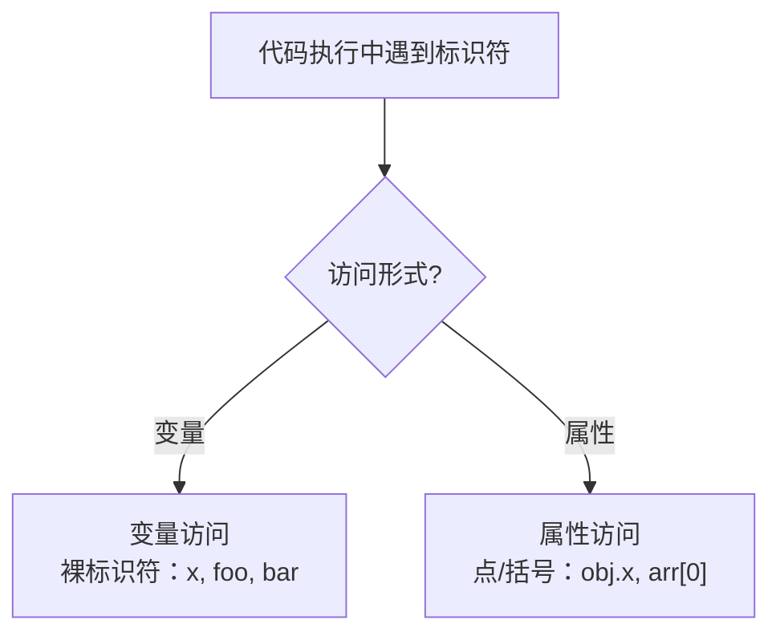
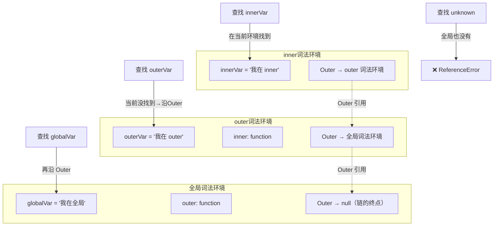
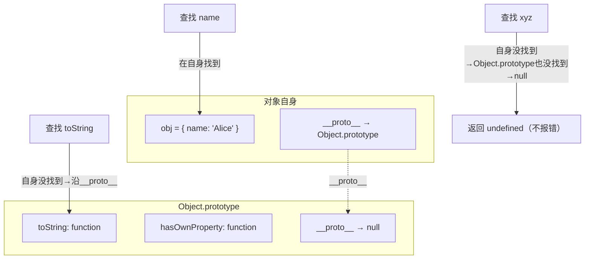
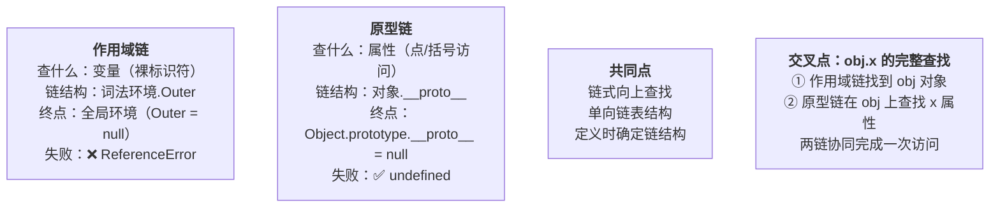

# 作用域链与原型链协同对比图

> 模块：02-javascript-core（第2周 JavaScript 核心）
> 难度：★★★ 核心基础
> 前置知识：[执行上下文与作用域链](./01-语法基础与执行机制.md)、[原型链流程图](./01-语法基础与执行机制-原型链流程图.md)

***

## 一、访问决策：两链分流的起点

> 代码执行中遇到标识符时，引擎首先判断访问形式：裸标识符走**变量访问**路径，点/括号语法走**属性访问**路径。这是两链分流的起点。



**一个简单的判断方法**：标识符前面有没有 `.` 或 `[`？

```javascript
let name = 'Alice';       // ① name 是裸标识符 → 走作用域链
let user = { name: 'Bob' };
console.log(name);        // ② name 是裸标识符 → 走作用域链 → 找到 'Alice'
console.log(user.name);   // ③ user 是裸标识符 → 作用域链；.name 是属性访问 → 原型链
```

> 📖 **参考链接**：
> - [ECMAScript 规范 - 标识符解析](https://tc39.es/ecma262/#sec-identifier-resolution)
> - [MDN - 属性访问器](https://developer.mozilla.org/zh-CN/docs/Web/JavaScript/Reference/Operators/Property_accessors)

***

## 二、作用域链 — 查找变量

### 2.1 什么是 Outer 引用？

**Outer 引用**（`[[Outer]]`）是每个词法环境（Lexical Environment）内部的一个"指针"，指向它**外层**的词法环境。它是在**函数定义时**就确定的，记录的是"我在哪里被创建"。

**直观理解：同心圆靶环**

把作用域链想象成一组同心圆靶环——每个环是一个作用域，变量写在对应的环上：

```
         ┌─────────────────────────────┐
         │     全局作用域（最外环）       │
         │   globalVar = '我在全局'      │
         │   ┌───────────────────┐      │
         │   │  outer 作用域      │      │
         │   │  outerVar='我在outer'│     │
         │   │  ┌──────────┐    │      │
         │   │  │inner作用域│    │      │
         │   │  │innerVar  │    │      │
         │   │  │  ● 你在这里 │    │      │
         │   │  └──────────┘    │      │
         │   └───────────────────┘      │
         └─────────────────────────────┘
```

你站在最内环（当前函数作用域），目光可以**向外**穿透所有环，看到外环上写的变量。但站在外面环的人，**无法向内看**到你的环里有什么。最外环是全局作用域，环外一片空白（`null`），再往外看就报 `ReferenceError`。

这个模型准确捕捉了作用域链的两个核心特性：**单向性**（只能从内向外看）和**链式结构**（一层套一层，直到全局）。

**本质理解：嵌套的** **`{}`** **就是链**

不需要任何比喻——作用域链本质上就是代码中 `{}` 的嵌套关系。内层函数的 `{}` 被外层函数的 `{}` 包裹，所以内层能"看到"外层定义的变量。这正是"词法作用域"的字面含义：作用域由代码的**书写位置**（词法结构）决定。

```javascript
// 全局作用域 ───────────────────────────────────┐
const a = 1;                                     // │
                                                  // │
function outer() {  // ← outer 的 {} 包裹在这里面    │
  const b = 2;       // outer 作用域               // │  outer 的 {} 嵌套在全局 {} 里面
                                                  // │  所以 outer 的 Outer → 全局
  function inner() { // ← inner 的 {} 包裹在这里面    │
    const c = 3;      // inner 作用域              // │  inner 的 {} 嵌套在 outer {} 里面
    // inner 能访问 c (自己) + b (outer) + a (全局)   // │  所以 inner 的 Outer → outer
  }                  // ← inner 的 {} 到这里结束     │
}                    // ← outer 的 {} 到这里结束     │
// ──────────────────────────────────────────────┘
```

**关键验证：定义位置决定一切**

同一个函数，定义在不同的位置，会形成不同的 Outer 引用——即使最终调用方式完全相同：

```javascript
const x = '全局 x';

function createPrinter() {
  const x = 'createPrinter 内的 x';

  // printX 定义在 createPrinter 内部
  // 它的 Outer → createPrinter 的词法环境
  return function printX() {
    console.log(x);
  };
}

const printer = createPrinter();
printer();  // 输出 'createPrinter 内的 x'，不是 '全局 x'
// 虽然 printX 在全局被调用，但它沿着定义时建立的 Outer 链查找
// 先在 createPrinter 作用域找到了 x，就不会继续到全局
```

如果 `printX` 是定义在全局的，即使同样被 `createPrinter` 返回并调用，它的 Outer 会指向全局，输出 `'全局 x'`。这就是 Outer 是**定义时**决定的含义。

> 📖 **参考链接**：
> - [ECMAScript 规范 - 词法环境](https://tc39.es/ecma262/#sec-lexical-environments)
> - [MDN - 闭包（Closures）](https://developer.mozilla.org/zh-CN/docs/Web/JavaScript/Closures)

### 2.2 查找过程详解

下面用一个具体代码示例，展示作用域链的真实结构：

```javascript
// 全局环境
const globalVar = '我在全局';

function outer() {
  const outerVar = '我在 outer';

  function inner() {
    const innerVar = '我在 inner';
    console.log(innerVar);  // ① 在当前环境找到 → '我在 inner'
    console.log(outerVar);  // ② 当前没有 → 沿 Outer 到 outer → 找到 '我在 outer'
    console.log(globalVar); // ③ outer 也没有 → 沿 Outer 到全局 → 找到 '我在全局'
    console.log(unknown);   // ④ 全局也没有 → ReferenceError!
  }

  inner();
}

outer();
```

**查找 innerVar 的过程**：

```
步骤 1：在 inner 的词法环境中查找 "innerVar"
        → 找到了！返回 '我在 inner'（一步到位）

步骤 2：在 inner 的词法环境中查找 "outerVar"
        → 没找到 → 沿 Outer 引用跳到 outer 的词法环境
        → 找到了！返回 '我在 outer'（跳了一步）

步骤 3：在 inner 的词法环境中查找 "globalVar"
        → 没找到 → 沿 Outer 到 outer → 没找到 → 沿 Outer 到全局
        → 找到了！返回 '我在全局'（跳了两步）

步骤 4：在 inner 的词法环境中查找 "unknown"
        → 没找到 → outer → 没找到 → 全局 → 没找到
        → 链的终点（全局的 Outer 是 null）→ 抛出 ReferenceError
```



### 2.3 关键要点

| 要点             | 说明                                                                                                                                       |
| -------------- | ---------------------------------------------------------------------------------------------------------------------------------------- |
| Outer 是什么时候确定的 | **函数定义时**确定，与调用位置无关（静态词法作用域）                                                                                                             |
| 查找方向           | 只能**从内向外**，不能从外向内（内层可以访问外层，外层不能访问内层）                                                                                                     |
| 查找终点           | 全局词法环境的 Outer 是 `null`                                                                                                                   |
| 找不到怎么办         | 抛出 `ReferenceError`，代码停止执行                                                                                                               |
| 闭包的本质          | 内部函数通过 Outer 引用保持着对外部变量的访问，即使外部函数已执行完毕。因为 Outer 链是定义时记录的，只要内部函数还"活着"，它定义时所在的那层作用域就不会被垃圾回收——这正是上面 `printX` 能访问 `createPrinter` 内部 `x` 的原因 |

***

## 三、原型链 — 查找对象属性

### 3.1 查找过程

> 属性访问先通过作用域链找到对象，再沿 `__proto__` 逐级向上查找属性，直至 `Object.prototype`（其 `__proto__` 为 `null`）。找不到返回 `undefined`，不报错。

```javascript
const obj = { name: 'Alice' };  // obj 只有 name 属性

console.log(obj.name);        // 在自己身上找到 → 'Alice'
console.log(obj.toString());  // 自己身上没有 → 沿 __proto__ 到 Object.prototype → 找到了
console.log(obj.xyz);         // 自己身上没有 → Object.prototype 也没有 → null → undefined
```

> 📖 **参考链接**：
> - [MDN - 继承与原型链](https://developer.mozilla.org/zh-CN/docs/Web/JavaScript/Inheritance_and_the_prototype_chain)
> - [ECMAScript 规范 - 普通对象 \[\[Get\]\] 方法](https://tc39.es/ecma262/#sec-ordinary-object-internal-methods-and-internal-slots-get-p-receiver)



> 上图演示了对象属性查找的原型链过程：自身找不到时沿 `__proto__` 逐层向上，直至 `Object.prototype` 仍无则返回 `undefined`（不报错），与变量查找抛出 `ReferenceError` 的行为形成鲜明对比。

### 3.2 对比：原型链 vs 作用域链

| 查找结果 |        作用域链（查变量）        |       原型链（查属性）       |
| ---- | :---------------------: | :------------------: |
| 找到了  |          返回变量的值         |        返回属性的值        |
| 找不到  | **报错** `ReferenceError` | **静默**返回 `undefined` |
| 为什么  |  变量不存在通常意味着代码 bug，应该暴露  | 属性不存在很常见（如可选属性），不应报错 |

***

## 四、对比总结

> 作用域链与原型链都是链式向上查找的单向链表结构，都在**定义时**确定链结构。核心区别在于查找目标、链结构、终点和失败行为。



### 4.1 一句话总结

| 场景     | 走哪条链                  | 示例                  |
| ------ | --------------------- | ------------------- |
| 直接写变量名 | 作用域链                  | `x`、`foo()`、`bar`   |
| 对象打点访问 | 先作用域链找到对象，再原型链找属性     | `obj.prop`、`arr[0]` |
| 函数调用   | 作用域链找到函数，然后执行         | `myFunc()`          |
| 方法调用   | 作用域链找到对象，原型链找到方法，然后执行 | `obj.method()`      |

### 4.2 图解：两链协同

当代码执行 `obj.method()` 时，两链如何协作：

```
obj.method()
   │
   ├─ 第1步：作用域链找到 obj
   │   当前作用域 → 外层作用域 → ... → 全局作用域
   │   先在当前作用域找 obj → 没找到 → 沿 Outer 到外层 → 找到了！
   │
   └─ 第2步：原型链在 obj 上找到 method
        obj 自身属性 → Person.prototype → Object.prototype → null
        先在 obj 自身找 → 没找到 → 沿 __proto__ 到 Person.prototype → 找到了！
```

**一句话区分**：作用域链回答"变量在哪"，原型链回答"属性在哪"。二者接力完成一次完整的属性访问。

> 📖 **参考链接**：
> - [ECMAScript 规范 - 执行上下文](https://tc39.es/ecma262/#sec-execution-contexts)
> - [MDN - 作用域（Scope）](https://developer.mozilla.org/zh-CN/docs/Glossary/Scope)

***

> 详细的作用域链查找机制，请参见 [执行上下文与作用域链](./01-语法基础与执行机制.md)。详细的原型链查找机制，请参见 [原型链流程图](./01-语法基础与执行机制-原型链流程图.md)。

***

← [返回：语法基础与执行机制](./01-语法基础与执行机制.md)
