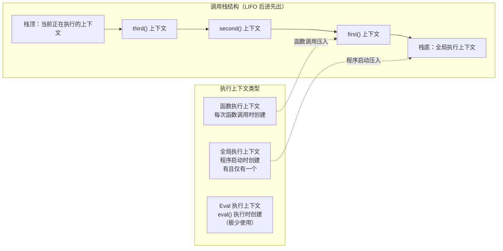
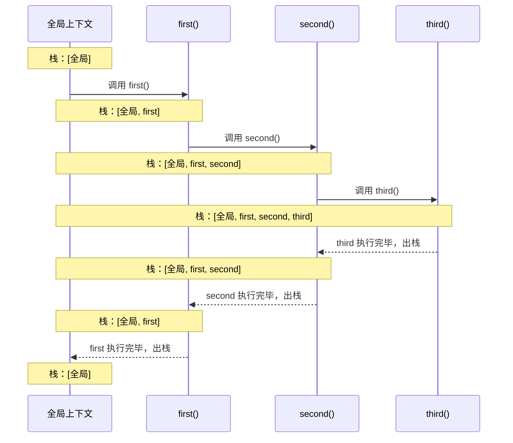
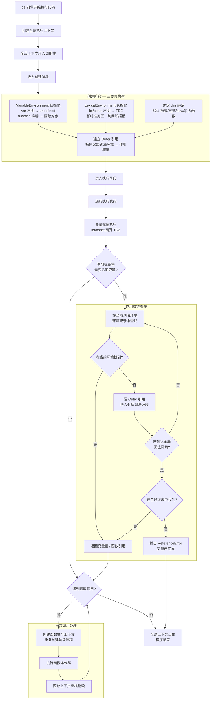

# 01-语法基础与执行机制

> 模块：02-javascript-core（第2周 JavaScript 核心）
> 难度：★★★ 核心基础
> 前置知识：无

***

## 一、var / let / const 区别

### 1.1 核心概念

JavaScript 中声明变量的三种方式：`var`、`let`、`const`。它们在**作用域**、**变量提升**、**暂时性死区**、**重复声明**和**全局属性**五个维度上存在显著差异。

| 对比维度  | var               | let          | const        |
| ----- | ----------------- | ------------ | ------------ |
| 作用域   | 函数作用域或全局作用域       | 块级作用域        | 块级作用域        |
| 变量提升  | 提升并初始化为 undefined | 提升但未初始化（TDZ） | 提升但未初始化（TDZ） |
| 暂时性死区 | 无                 | 有            | 有            |
| 重复声明  | 允许                | 不允许          | 不允许          |
| 全局属性  | 会成为 window 属性     | 不会           | 不会           |
| 初始值   | 可选                | 可选           | 必须           |

> 📖 **参考链接**：
> - [MDN - let 声明](https://developer.mozilla.org/zh-CN/docs/Web/JavaScript/Reference/Statements/let)
> - [MDN - const 声明](https://developer.mozilla.org/zh-CN/docs/Web/JavaScript/Reference/Statements/const)
> - [MDN - 变量提升（Hoisting）](https://developer.mozilla.org/zh-CN/docs/Glossary/Hoisting)

### 1.2 底层原理

#### 变量提升（Hoisting）

JavaScript 引擎在执行代码前会进行**预编译**，将变量和函数的声明提升到作用域顶部。`var` 声明的变量在提升时被初始化为 `undefined`，而 `let` 和 `const` 虽然也被提升，但不会被初始化，进入**暂时性死区**（Temporal Dead Zone, TDZ）。

```javascript
// var 的变量提升
console.log(a); // undefined（已提升，初始化为 undefined）
var a = 10;

// let/const 的暂时性死区
console.log(b); // ReferenceError: Cannot access 'b' before initialization
let b = 20;

// 函数提升优先级高于变量提升
console.log(foo); // function foo() {}
var foo = 'bar';
function foo() {}
```

#### 块级作用域的实现

`let` 和 `const` 的块级作用域是通过词法环境（Lexical Environment）实现的。每次进入一个新的块 `{}`，JavaScript 引擎会创建一个新的词法环境记录，该块内声明的变量存储在这个独立的记录中，块执行完毕后即可被回收。

```javascript
{
  let x = 1;
  const y = 2;
  console.log(x, y); // 1 2
}
// console.log(x); // ReferenceError: x is not defined
```

### 1.3 实战应用

```javascript
// 经典 for 循环中的 var 陷阱
for (var i = 0; i < 3; i++) {
  setTimeout(() => console.log(i), 100); // 输出 3, 3, 3
}
// 解决方案1：使用 let
for (let j = 0; j < 3; j++) {
  setTimeout(() => console.log(j), 100); // 输出 0, 1, 2
}
// 解决方案2：使用闭包
for (var k = 0; k < 3; k++) {
  (function (k) { setTimeout(() => console.log(k), 100); })(k); // 输出 0, 1, 2
}

// const 声明引用类型
const obj = { name: 'Alice' };
obj.name = 'Bob'; // 允许，修改的是属性而非引用
// obj = {}; // TypeError: Assignment to constant variable
```

### 1.4 常见面试题

**Q1：以下代码输出什么？**

```javascript
console.log(a);
console.log(b);
var a = 1;
let b = 2;
```

答案：输出 `undefined`，然后抛出 `ReferenceError`（因为 `var a` 提升后初始化为 `undefined`，`console.log(b)` 访问了 TDZ 中的 `let b`）。

**Q2：`const`** **声明的对象属性可以修改吗？**
可以。`const` 保证的是变量指向的内存地址不变，对于引用类型，内部属性不受此限制。

### 1.5 避坑指南

| 常见错误                | 现象             | 原因          | 解决方案               |
| ------------------- | -------------- | ----------- | ------------------ |
| 在声明前使用 let/const 变量 | ReferenceError | 暂时性死区       | 始终先声明后使用           |
| 在循环中用 var 声明索引      | 闭包捕获同一变量       | var 只有函数作用域 | 改用 let 或 IIFE      |
| 误以为 const 对象不可变     | 对象属性被意外修改      | const 只锁定引用 | 使用 Object.freeze() |
| 在 switch 中重复声明 let  | SyntaxError    | 同一块级作用域     | 为每个 case 添加 {}     |

***

## 二、作用域与作用域链

### 2.1 核心概念

**作用域**（Scope）是变量和函数的可访问范围，决定了代码在运行期间如何查找变量。JavaScript 有三种作用域：

- **全局作用域**：在代码任何地方都可访问，生命周期随页面存在
- **函数作用域**：在函数内部声明的变量，外部无法访问
- **块级作用域**（ES6）：`{}` 包裹的代码块，`let`/`const` 声明的变量仅在该块内有效

**作用域链**（Scope Chain）是 JavaScript 查找变量的机制：当访问一个变量时，先从当前作用域查找，找不到则沿着作用域链向上查找，直到全局作用域。如果全局作用域仍找不到，则返回 `ReferenceError`。

> 📖 **参考链接**：
> - [MDN - 作用域（Scope）](https://developer.mozilla.org/zh-CN/docs/Glossary/Scope)
> - [MDN - 闭包与作用域链](https://developer.mozilla.org/zh-CN/docs/Web/JavaScript/Closures)

### 2.2 底层原理

作用域链的底层实现依赖于**词法环境**（Lexical Environment）。每个执行上下文都有一个词法环境，词法环境包含两个部分：

1. **环境记录**（Environment Record）：存储当前作用域内的变量和函数声明
2. **外部词法环境引用**（Outer）：指向父级词法环境，形成作用域链

函数在**定义时**（而非调用时）就确定了其作用域链，这是**词法作用域**（静态作用域）的核心特征。

```javascript
const global = 'global';

function outer() {
  const outerVar = 'outer';
  
  function inner() {
    const innerVar = 'inner';
    console.log(innerVar); // 当前作用域找到
    console.log(outerVar); // 沿作用域链向上找到 outer 作用域
    console.log(global);   // 继续向上找到全局作用域
  }
  
  inner();
}

outer();
```

### 2.3 实战应用

```javascript
// 模块模式：利用函数作用域实现私有变量
const Counter = (function () {
  let count = 0; // 私有变量，外部无法访问
  
  return {
    increment() { return ++count; },
    decrement() { return --count; },
    getCount() { return count; },
  };
})();

console.log(Counter.getCount()); // 0
Counter.increment();
console.log(Counter.getCount()); // 1
// console.log(count); // ReferenceError: count is not defined
```

### 2.4 避坑指南

| 常见错误             | 现象                 | 原因             | 解决方案                     |
| ---------------- | ------------------ | -------------- | ------------------------ |
| 未声明变量直接赋值        | 意外创建全局变量           | 非严格模式下自动成为全局属性 | 始终使用 let/const 声明，开启严格模式 |
| 误以为块级作用域对 var 生效 | if 块内 var 变量在外部可访问 | var 只有函数作用域    | 改用 let/const             |
| 函数内修改外部变量        | 副作用难以追踪            | 作用域链向上查找到变量    | 尽量使用纯函数，避免修改外部状态         |

***

## 三、执行上下文与调用栈

### 3.1 核心概念

**执行上下文**（Execution Context）是 JavaScript 代码执行时的抽象环境，包含代码执行所需的所有信息。每当 JavaScript 引擎执行代码时，都会创建一个执行上下文。

执行上下文分为三种类型：

- **全局执行上下文**：代码首次运行时创建，有且仅有一个
- **函数执行上下文**：每次函数调用时创建
- **Eval 执行上下文**：`eval()` 函数执行时创建（极少使用）

**执行上下文栈**（Execution Context Stack / Call Stack）是管理执行上下文的栈结构。遵循 LIFO（后进先出）原则，栈底永远是全局执行上下文，栈顶是当前正在执行的上下文。

下图展示了执行上下文的三种类型，以及调用栈的 LIFO（后进先出）结构。栈底永远是全局执行上下文，栈顶是当前正在执行的上下文：



调用栈的压栈方向是**自下而上**：全局上下文先入栈（栈底），每次函数调用时新上下文压入栈顶；出栈方向是**自上而下**：栈顶上下文执行完毕后立即弹出，直到回到全局上下文。

> 📖 **参考链接**：
> - [ECMAScript 规范 - 执行上下文](https://tc39.es/ecma262/#sec-execution-contexts)
> - [MDN - 调用栈](https://developer.mozilla.org/zh-CN/docs/Glossary/Call_stack)

### 3.2 底层原理

#### 执行上下文的生命周期

每个执行上下文包含三个重要属性：

- **变量对象**（Variable Object, VO）/ **词法环境**（Lexical Environment）
- **作用域链**（Scope Chain）
- **this**

执行上下文分为两个阶段：

**创建阶段**（函数调用时，执行代码前）：

1. 创建变量对象（VO）：收集函数参数、内部函数声明、内部变量声明
2. 建立作用域链：将当前 VO 添加到作用域链顶端
3. 确定 this 指向

**执行阶段**：

1. 变量赋值
2. 函数引用
3. 执行其他代码

```javascript
// 调用栈示例
function first() {
  console.log('first start');
  second();
  console.log('first end');
}

function second() {
  console.log('second start');
  third();
  console.log('second end');
}

function third() {
  console.log('third');
  throw new Error('stack trace');
}

first();
// 调用栈（从底到顶）：全局 → first → second → third
```

下面用序列图展示上述代码执行过程中调用栈的动态变化（压栈与出栈）：



上图清晰地展示了调用栈的 LIFO 特性：**压栈顺序**为 `全局 → first → second → third`，**出栈顺序**为 `third → second → first → 全局`，最后栈中仅剩全局上下文，程序结束。如果 `third()` 中抛出错误（如示例中的 `throw new Error('stack trace')`），错误会沿调用栈**反向传播**，直到被 `catch` 捕获或到达全局作用域。

### 3.3 实战应用

```javascript
// 利用调用栈进行调试
// 浏览器 DevTools 中 Sources 面板的 Call Stack 可以查看当前调用栈
// console.trace() 可以打印当前调用栈

function debugFunction() {
  console.trace('调用栈追踪');
}
debugFunction();
```

### 3.4 避坑指南

| 常见错误           | 现象                                           | 原因         | 解决方案        |
| -------------- | -------------------------------------------- | ---------- | ----------- |
| 递归过深导致栈溢出      | RangeError: Maximum call stack size exceeded | 调用栈超出限制    | 改用迭代或尾递归优化  |
| 异步回调中访问已销毁的上下文 | 变量值为 undefined 或报错                           | 闭包引用了过期的变量 | 注意闭包变量的生命周期 |

**执行上下文创建与作用域链查找完整流程图：**

下图将执行上下文的生命周期、创建阶段、执行阶段、作用域链查找四个环节整合为一张完整流程图，箭头表示实际的流转方向，不再使用注释代替跨图连接。



**流程说明：**

1. **生命周期主线**（A→B→C→D→...→J→K→...→R）：JS 引擎从创建全局执行上下文开始，经过创建阶段和执行阶段，函数调用完毕后出栈，最终全局上下文出栈，程序结束。

2. **创建阶段**（CREATE 子图）：构建执行上下文的三大要素 —— **VariableEnvironment** 收集 `var` 声明并初始化为 `undefined`，**LexicalEnvironment** 收集 `let`/`const` 声明并使其进入 TDZ，同时确定 **this** 绑定，最后通过 **Outer 引用**建立作用域链。完成后进入执行阶段。

3. **执行阶段**（J→K→ASSIGN→ACCESS→M）：逐行执行代码，变量赋值让 `let`/`const` 离开 TDZ。遇到标识符访问时进入作用域链查找；遇到函数调用时创建新的执行上下文并重复创建阶段流程，函数执行完毕后出栈销毁，回到调用点继续判断。

4. **作用域链查找**（SCOPE 子图）：从当前词法环境开始，沿 Outer 引用逐级向外查找。找到则返回变量值/函数引用，未找到则继续向外；到达全局环境仍未找到时抛出 `ReferenceError`。

> 属性访问的原型链查找机制，请参见 [原型链流程图](./01-语法基础与执行机制-原型链流程图.md)。作用域链与原型链的协同工作关系，请参见 [双链协同对比图](./01-语法基础与执行机制-双链协同图.md)。

***

## 四、原型与原型链

### 4.1 核心概念

JavaScript 是一门**基于原型**（Prototype-based）的语言，每个对象都有一个内部属性 `[[Prototype]]`（通过 `__proto__` 或 `Object.getPrototypeOf()` 访问），指向它的原型对象。

- **`prototype`**：每个函数（除箭头函数）都有一个 `prototype` 属性，指向该函数的原型对象。当该函数作为构造函数使用 `new` 创建实例时，实例的 `__proto__` 会指向这个 `prototype` 对象。
- **`__proto__`**：每个对象（除 `Object.create(null)` 创建的对象）都有 `__proto__` 属性，指向它的构造函数的 `prototype`。
- **原型链**：当访问对象的属性时，先在自身查找，找不到则沿着 `__proto__` 向上查找，直到 `Object.prototype`（其 `__proto__` 为 `null`），形成一条原型链。

> **生活化类比**：社区服务中心——同一小区的所有居民（实例）共享一个社区中心（`prototype`），居民自己没有的服务由社区中心**代为办理**，社区中心处理不了的转介到市政中心（`Object.prototype`）。注意：社区中心是**所有居民共享**的同一个，不是每家各有一个。

> 📖 **参考链接**：
> - [MDN - 继承与原型链](https://developer.mozilla.org/zh-CN/docs/Web/JavaScript/Inheritance_and_the_prototype_chain)
> - [MDN - Object](https://developer.mozilla.org/zh-CN/docs/Web/JavaScript/Reference/Global_Objects/Object)
> - [MDN - instanceof 运算符](https://developer.mozilla.org/zh-CN/docs/Web/JavaScript/Reference/Operators/instanceof)

### 4.2 底层原理

```javascript
// 构造函数、原型、实例三者关系
function Person(name) {
  this.name = name;
}

Person.prototype.sayHello = function () {
  console.log(`Hello, I'm ${this.name}`);
};

const alice = new Person('Alice');

// 关系验证
console.log(alice.__proto__ === Person.prototype);        // true
console.log(Person.prototype.__proto__ === Object.prototype); // true
console.log(Object.prototype.__proto__);                    // null
console.log(Person.prototype.constructor === Person);       // true

// Function 和 Object 的特殊关系
console.log(Function.__proto__ === Function.prototype);     // true
console.log(Object.__proto__ === Function.prototype);       // true
console.log(Function.prototype.__proto__ === Object.prototype); // true
```

#### instanceof 原理

`instanceof` 运算符检测构造函数的 `prototype` 属性是否出现在实例的原型链上。

```javascript
function myInstanceof(instance, constructor) {
  let proto = Object.getPrototypeOf(instance);
  const prototype = constructor.prototype;
  
  while (proto) {
    if (proto === prototype) return true;
    proto = Object.getPrototypeOf(proto);
  }
  return false;
}

console.log([] instanceof Array);   // true
console.log([] instanceof Object);  // true
console.log({} instanceof Array);   // false
```

#### Object.create 原理

`Object.create(proto)` 创建一个新对象，并将其 `__proto__` 指向传入的 `proto`。

```javascript
// 注意：简化版仅演示原型链设置核心原理，不包含原生 Object.create 的第二个参数（propertiesObject）
// 警告：切勿在生产代码中覆盖原生方法！此处仅为原理演示
function myObjectCreate(proto) {
  function F() {}
  F.prototype = proto;
  return new F();
}
```

### 4.3 实战应用

```javascript
// 寄生组合继承（最优继承方案）
function Parent(name) {
  this.name = name;
}
Parent.prototype.sayName = function () {
  console.log(this.name);
};

function Child(name, age) {
  Parent.call(this, name); // 继承属性
  this.age = age;
}

// 继承方法
Child.prototype = Object.create(Parent.prototype);
Child.prototype.constructor = Child;

Child.prototype.sayAge = function () {
  console.log(this.age);
};

const child = new Child('小明', 10);
child.sayName(); // 小明
child.sayAge();  // 10
```

### 4.4 常见面试题

**Q：`Object.create(null)`** **创建的对象有什么特点？**
没有原型链，不继承 `Object.prototype` 的任何方法（如 `toString`、`hasOwnProperty`），适合用作纯数据字典。

### 4.5 避坑指南

| 常见错误                          | 现象               | 原因                           | 解决方案                               |
| ----------------------------- | ---------------- | ---------------------------- | ---------------------------------- |
| 混淆 `prototype` 和 `__proto__`  | 原型链指向错误          | 前者是函数属性，后者是对象属性              | 明确：prototype 是函数独有，__proto__ 是对象独有 |
| 直接修改原型上的引用类型                  | 所有实例共享同一引用       | 原型上的引用类型被所有实例共享              | 引用类型属性放在构造函数内                      |
| 使用 `for...in` 遍历到原型属性         | 遍历到不期望的属性        | for...in 会遍历原型链              | 使用 `hasOwnProperty` 过滤             |
| 重写 prototype 忘记修复 constructor | constructor 指向错误 | 重写 prototype 会丢失 constructor | 手动设置 `constructor`                 |

***

## 五、this 绑定规则

### 5.1 核心概念

`this` 是 JavaScript 中一个特殊的关键字，它在函数调用时动态绑定，指向调用该函数的对象。`this` 的绑定规则有五条，**优先级从高到低**为：

1. **new 绑定**：构造函数调用，`this` 指向新创建的实例对象
2. **显式绑定**：`call` / `apply` / `bind`，`this` 指向指定的对象
3. **隐式绑定**：作为对象方法调用，`this` 指向调用该方法的对象
4. **默认绑定**：独立函数调用（非严格模式指向 `window`/`global`，严格模式指向 `undefined`）
5. **箭头函数**：没有自己的 `this`，继承外层作用域的 `this`（词法 this）

> 📖 **参考链接**：
> - [MDN - this 关键字](https://developer.mozilla.org/zh-CN/docs/Web/JavaScript/Reference/Operators/this)
> - [MDN - Function.prototype.call()](https://developer.mozilla.org/zh-CN/docs/Web/JavaScript/Reference/Global_Objects/Function/call)
> - [MDN - Function.prototype.bind()](https://developer.mozilla.org/zh-CN/docs/Web/JavaScript/Reference/Global_Objects/Function/bind)

### 5.2 底层原理

```javascript
// 1. 默认绑定
function showThis() {
  console.log(this);
}
showThis(); // 非严格模式：window；严格模式：undefined

// 2. 隐式绑定
const obj = {
  name: 'obj',
  showThis: function () {
    console.log(this.name);
  },
};
obj.showThis(); // 'obj'

// 隐式丢失
const fn = obj.showThis;
fn(); // undefined（默认绑定）

// 3. 显式绑定
function greet(greeting, punctuation) {
  console.log(`${greeting}, ${this.name}${punctuation}`);
}

const person = { name: 'Alice' };
greet.call(person, 'Hello', '!');   // Hello, Alice!
greet.apply(person, ['Hi', '.']);   // Hi, Alice.
const boundGreet = greet.bind(person, 'Hey');
boundGreet('!');                     // Hey, Alice!

// 4. new 绑定
function Person(name) {
  this.name = name;
}
const p = new Person('Bob');
console.log(p.name); // Bob

// 5. 箭头函数
const arrowObj = {
  name: 'arrow',
  fn: () => {
    console.log(this.name); // this 继承自外层，不是 arrowObj
  },
  normalFn() {
    const arrow = () => console.log(this.name); // 继承 normalFn 的 this
    arrow();
  },
};
arrowObj.fn();       // ''（外层 this 是 window，window.name 默认为空串）
arrowObj.normalFn(); // 'arrow'
```

### 5.3 实战应用

```javascript
// 手写 call
Function.prototype.myCall = function (context, ...args) {
  // globalThis 兼容浏览器和 Node.js 环境
  context = context ?? globalThis;
  const fnKey = Symbol('fn');
  context[fnKey] = this;
  const result = context[fnKey](...args);
  delete context[fnKey];
  return result;
};

// 手写 apply
Function.prototype.myApply = function (context, args) {
  context = context ?? globalThis;
  const fnKey = Symbol('fn');
  context[fnKey] = this;
  const result = context[fnKey](...(args || []));
  delete context[fnKey];
  return result;
};

// 手写 bind
Function.prototype.myBind = function (context, ...boundArgs) {
  const fn = this;
  return function (...args) {
    // 使用 new.target 判断是否作为构造函数调用（替代废弃的 arguments.callee）
    return fn.apply(
      new.target ? this : context,
      [...boundArgs, ...args]
    );
  };
};
```

### 5.4 避坑指南

| 常见错误            | 现象                          | 原因                           | 解决方案                |
| --------------- | --------------------------- | ---------------------------- | ------------------- |
| 回调函数中 this 丢失   | setTimeout 中 this 指向 window | 隐式绑定丢失                       | 使用箭头函数或 bind        |
| 箭头函数用作对象方法      | this 指向外层而非对象               | 箭头函数没有自己的 this               | 对象方法使用普通函数          |
| 构造函数忘记 new      | this 污染全局                   | 默认绑定到全局对象                    | 使用 class 语法（必须 new） |
| 事件监听中 this 指向错误 | this 指向绑定元素而非组件             | addEventListener 的 this 指向元素 | 使用箭头函数或 bind        |

***

## 六、闭包（Closure）

### 6.1 核心概念

**闭包**是指一个函数能够记住并访问其词法作用域，即使该函数在其词法作用域之外执行。形成闭包的条件：

> **生活化类比**：储物柜钥匙——你去健身房（外部函数调用），把私人物品放在储物柜（变量声明），锁上门后你保留一把钥匙（闭包/内部函数）。即使你离开健身房（外部函数执行完毕），你仍然可以用钥匙打开储物柜取回物品。这把钥匙的存在阻止了清洁工（垃圾回收器）清理储物柜——这就是闭包阻止垃圾回收的本质。

1. 函数嵌套
2. 内部函数引用外部函数的变量
3. 内部函数被返回或以其他方式传递到外部

> 📖 **参考链接**：
> - [MDN - 闭包（Closures）](https://developer.mozilla.org/zh-CN/docs/Web/JavaScript/Closures)
> - [MDN - 内存管理](https://developer.mozilla.org/zh-CN/docs/Web/JavaScript/Guide/Memory_management)

### 6.2 底层原理

闭包的底层原理是 JavaScript 引擎的**垃圾回收机制**和**作用域链**。正常情况下，函数执行完毕后其执行上下文会被销毁，变量也会被回收。但当内部函数引用了外部函数的变量时，外部函数的作用域无法被回收（因为内部函数持有引用），从而形成闭包。

```javascript
function createCounter() {
  let count = 0; // 这个变量不会被垃圾回收
  
  return {
    increment() {
      return ++count;
    },
    getCount() {
      return count;
    },
  };
}

const counter = createCounter();
console.log(counter.increment()); // 1
console.log(counter.increment()); // 2
console.log(counter.getCount());  // 2
// counter 保持着对 createCounter 作用域中 count 的引用，形成闭包
```

### 6.3 实战应用

```javascript
// 1. 数据私有化
function createPerson(name) {
  let age = 0; // 私有变量
  
  return {
    getName() { return name; },
    getAge() { return age; },
    growUp() { age++; },
  };
}

// 2. 函数柯里化
function curry(fn) {
  return function curried(...args) {
    if (args.length >= fn.length) {
      return fn.apply(this, args);
    }
    return function (...nextArgs) {
      return curried.apply(this, [...args, ...nextArgs]);
    };
  };
}

const add = (a, b, c) => a + b + c;
const curriedAdd = curry(add);
console.log(curriedAdd(1)(2)(3)); // 6

// 3. 模块模式
const Module = (function () {
  const privateData = {};
  
  return {
    set(key, value) { privateData[key] = value; },
    get(key) { return privateData[key]; },
  };
})();

// 4. 经典面试题：每隔一秒输出一个数字
for (var i = 1; i <= 5; i++) {
  (function (j) {
    setTimeout(() => console.log(j), j * 1000);
  })(i);
}
// 使用 let 更简洁：
// for (let i = 1; i <= 5; i++) {
//   setTimeout(() => console.log(i), i * 1000);
// }
```

### 6.4 常见面试题

**Q：闭包一定导致内存泄漏吗？**
不一定。闭包确实会保留外部函数的变量，使其无法被垃圾回收，但如果这是有意的行为（如数据私有化），则不算内存泄漏。只有当闭包引用了不再需要的变量且无法被解除引用时，才算内存泄漏。

### 6.5 避坑指南

| 常见错误          | 现象        | 原因                  | 解决方案             |
| ------------- | --------- | ------------------- | ---------------- |
| 循环中创建闭包引用同一变量 | 所有闭包输出相同值 | var 无块级作用域，闭包引用同一变量 | 使用 let 或 IIFE 传参 |
| 闭包持有大对象引用     | 内存占用过高    | 闭包保留了整个作用域          | 用完后将引用置为 null    |
| 误以为闭包会复制变量值   | 闭包中访问到最新值 | 闭包持有的是引用，不是快照       | 理解闭包保存的是引用       |
| 在 DOM 事件中滥用闭包 | 内存泄漏      | DOM 元素被移除但闭包仍持有引用   | 适时解绑事件监听         |

***

## 七、错误处理

### 7.1 核心概念

JavaScript 提供了完善的错误处理机制，允许开发者捕获运行时异常、抛出自定义错误，并进行优雅的错误恢复。

**try/catch/finally 语法** 是最基本的错误处理结构：

- `try` 块包裹可能抛出错误的代码
- `catch` 块捕获并处理错误，接收一个 `error` 参数
- `finally` 块无论是否发生错误**始终执行**，即使 `try` 中有 `return`、`break` 或 `continue`

**throw 语句** 用于主动抛出异常，可以抛出任意类型的值，但推荐抛出 `Error` 对象以便获取堆栈信息。

**Error 内置类型详解表：**

| 类型 | 触发场景 | 示例 |
| --- | --- | --- |
| `Error` | 通用错误基类 | `new Error('自定义错误')` |
| `SyntaxError` | 语法错误（解析阶段） | `eval('var a = ;')` |
| `TypeError` | 类型错误 | `null.foo`、`undefined.bar` |
| `RangeError` | 数值超出范围 | `new Array(-1)`、递归过深 |
| `ReferenceError` | 引用未定义变量 | `console.log(notDefined)` |
| `URIError` | 编解码 URI 错误 | `decodeURI('%')` |
| `EvalError` | eval 函数错误（已废弃） | `new eval()` |

**自定义 Error 类** 通过继承 `Error` 实现，可以设置 `name`（错误类型名）、`message`（错误描述）和 `stack`（调用堆栈）属性，便于业务层区分不同类型的错误。

> 📖 **参考链接**：
> - [MDN - try...catch 语句](https://developer.mozilla.org/zh-CN/docs/Web/JavaScript/Reference/Statements/try...catch)
> - [MDN - Error 对象](https://developer.mozilla.org/zh-CN/docs/Web/JavaScript/Reference/Global_Objects/Error)
> - [MDN - throw 语句](https://developer.mozilla.org/zh-CN/docs/Web/JavaScript/Reference/Statements/throw)

### 7.2 底层原理

#### finally 的执行机制

`finally` 块的执行优先级高于 `try` 块中的 `return`。当 `try` 中执行 `return` 时，会先计算返回值、暂存该值，然后执行 `finally` 块，最后才返回暂存的值。如果 `finally` 中也有 `return`，则会覆盖 `try` 中的返回值。

```javascript
function testFinally() {
  try {
    return 'try 中的返回值';
  } finally {
    console.log('finally 执行了');
  }
}
console.log(testFinally());
// 输出：
// finally 执行了
// try 中的返回值
```

#### 错误传播机制

错误沿调用栈向上传播：当函数发生错误且未被捕获时，错误会逐层向上抛出，直到被 `catch` 捕获或到达全局作用域。异步错误（如 `setTimeout`、Promise 内部）不会沿普通调用栈传播，需要通过 `Promise.catch` 或 `async/await` + `try/catch` 捕获。

**全局错误捕获** 用于捕获未被局部处理的错误：

- `window.onerror`：捕获全局同步运行时错误，可获取错误消息、源文件、行号、列号和错误对象
- `window.addEventListener('error')`：比 `window.onerror` 更通用，还能捕获资源加载错误（图片、脚本等）
- `window.addEventListener('unhandledrejection')`：捕获未处理的 Promise 拒绝（未写 `.catch()` 的 Promise 异常）

```javascript
// 全局同步错误捕获
window.onerror = function (message, source, lineno, colno, error) {
  console.error('全局错误:', message);
  return true; // 返回 true 阻止默认错误处理
};

// 未处理的 Promise 拒绝
window.addEventListener('unhandledrejection', function (event) {
  console.error('未捕获的 Promise 拒绝:', event.reason);
  event.preventDefault(); // 阻止控制台输出错误
});
```

### 7.3 实战应用

```javascript
// 自定义 Error 类（用于业务层错误分类）
class BusinessError extends Error {
  constructor(message, code) {
    super(message);
    this.name = 'BusinessError';
    this.code = code;
  }
}

class NetworkError extends Error {
  constructor(message, statusCode) {
    super(message);
    this.name = 'NetworkError';
    this.statusCode = statusCode;
  }
}

// 完整的错误处理中间件模式（Express 风格）
class ErrorHandler {
  static async wrap(fn) {
    return async function (...args) {
      try {
        return await fn.apply(this, args);
      } catch (error) {
        ErrorHandler.handle(error);
      }
    };
  }

  static handle(error) {
    if (error instanceof BusinessError) {
      console.error(`[业务错误] ${error.code}: ${error.message}`);
      // 业务错误：提示用户
    } else if (error instanceof NetworkError) {
      console.error(`[网络错误] ${error.statusCode}: ${error.message}`);
      // 网络错误：重试或提示
    } else if (error instanceof TypeError) {
      console.error(`[类型错误] ${error.message}`);
    } else {
      console.error(`[未知错误] ${error.message}`);
      // 上报到日志系统
      errorReporter.report(error);
    }
  }
}

// 使用示例
async function fetchUserData(userId) {
  if (!userId) {
    throw new BusinessError('用户 ID 不能为空', 'INVALID_PARAM');
  }
  const response = await fetch(`/api/users/${userId}`);
  if (!response.ok) {
    throw new NetworkError('请求失败', response.status);
  }
  return response.json();
}

const safeFetchUser = ErrorHandler.wrap(fetchUserData);
safeFetchUser(null); // [业务错误] INVALID_PARAM: 用户 ID 不能为空
```

### 7.4 常见面试题

**Q1：`finally` 中有 `return` 会怎样？**

```javascript
function test() {
  try {
    return 1;
  } finally {
    return 2;
  }
}
console.log(test()); // 2
```

`finally` 中的 `return` 会覆盖 `try` 中的返回值，因此输出 `2`。

**Q2：`try/catch` 能否捕获异步错误？**

不能直接捕获。`try/catch` 只能捕获同步执行中的错误。异步回调中的错误需要在其回调内部捕获，`async/await` 配合 `try/catch` 可以捕获异步错误。

### 7.5 避坑指南

| 常见错误 | 现象 | 原因 | 解决方案 |
| --- | --- | --- | --- |
| 在 try 中 return 时 finally 不执行 | 误以为 return 后跳过 finally | 不理解 finally 执行时机 | finally 始终执行，但返回值可能被覆盖 |
| 异步函数中 try/catch 无效 | 错误未被捕获 | 异步回调在 try/catch 外部执行 | 使用 async/await 或将 catch 放在回调内 |
| 捕获后不处理错误 | 静默吞掉错误 | 空 catch 块 | 至少记录日志，区分可恢复和不可恢复错误 |
| 忘记捕获 Promise 拒绝 | unhandledrejection 警告 | 缺少 .catch() 或 try/catch | 始终处理 Promise 的拒绝情况 |
| 在 catch 中抛出原始错误 | 丢失原始堆栈信息 | 直接 throw error | 抛出新错误并保留 cause：`throw new Error('...', { cause: error })` |

***

## 八、ArrayBuffer 与 TypedArray

### 8.1 核心概念

**ArrayBuffer** 是 JavaScript 中表示**固定长度的原始二进制数据缓冲区**的对象。它本身不能直接读写，需要通过 TypedArray 视图或 DataView 进行操作。

**TypedArray 系列** 是 ArrayBuffer 的类型化数组视图，提供对底层二进制数据的类型化读写。共 9 种类型：

| 类型 | 字节数 | 取值范围 | 说明 |
| --- | --- | --- | --- |
| `Int8Array` | 1 | -128 ~ 127 | 有符号 8 位整数 |
| `Uint8Array` | 1 | 0 ~ 255 | 无符号 8 位整数 |
| `Uint8ClampedArray` | 1 | 0 ~ 255 | 无符号 8 位整数（裁剪） |
| `Int16Array` | 2 | -32768 ~ 32767 | 有符号 16 位整数 |
| `Uint16Array` | 2 | 0 ~ 65535 | 无符号 16 位整数 |
| `Int32Array` | 4 | -2147483648 ~ 2147483647 | 有符号 32 位整数 |
| `Uint32Array` | 4 | 0 ~ 4294967295 | 无符号 32 位整数 |
| `Float32Array` | 4 | IEEE 754 单精度 | 32 位浮点数 |
| `Float64Array` | 8 | IEEE 754 双精度 | 64 位浮点数 |

**DataView** 是另一种 ArrayBuffer 视图，提供灵活的读写方法，支持**字节序**（Endianness）控制。它不属于 TypedArray 系列，但同样操作 ArrayBuffer 底层数据。

> **生活化类比**：ArrayBuffer 好比一块固定面积的"土地"（原始内存），TypedArray 就像不同的"测量单位"——用平方米（Int32Array）测量得 42，用亩（Float32Array）测量得 0.063，土地本身没变，变了的是解读方式。多个测量员可以同时用不同单位测量同一块地。DataView 则是一把可自由切换测量单位的卷尺，还能选择从地块的哪头开始量（字节序）。

> 📖 **参考链接**：
> - [MDN - ArrayBuffer](https://developer.mozilla.org/zh-CN/docs/Web/JavaScript/Reference/Global_Objects/ArrayBuffer)
> - [MDN - 类型化数组指南](https://developer.mozilla.org/zh-CN/docs/Web/JavaScript/Guide/Typed_arrays)
> - [MDN - DataView](https://developer.mozilla.org/zh-CN/docs/Web/JavaScript/Reference/Global_Objects/DataView)

### 8.2 底层原理

ArrayBuffer 在内存中分配一块连续的二进制存储空间，大小在创建时确定且不可改变。TypedArray 和 DataView 都是这块内存的"视图"——它们不持有数据，只是提供不同的方式来解释和操作同一块内存。

**字节序**（Byte Order）决定多字节数据在内存中的存储顺序：

- **大端序**（Big-Endian）：高位字节在前（低地址），网络协议默认
- **小端序**（Little-Endian）：低位字节在前（低地址），x86 架构默认

DataView 的所有读写方法都支持指定字节序（默认大端），而 TypedArray 使用平台默认字节序（通常是小端序）。

```javascript
// 同一块内存，不同视图看到不同的数据解释
const buffer = new ArrayBuffer(8); // 8 字节缓冲区

const int32View = new Int32Array(buffer);
int32View[0] = 42;
int32View[1] = 100;

const float64View = new Float64Array(buffer);
console.log(float64View[0]); // 一个奇怪的浮点数（不同解释）

const uint8View = new Uint8Array(buffer);
console.log([...uint8View]); // [42, 0, 0, 0, 100, 0, 0, 0]（小端序）
```

### 8.3 实战应用

```javascript
// 1. ArrayBuffer 与字符串互转
function stringToArrayBuffer(str) {
  const encoder = new TextEncoder();
  return encoder.encode(str).buffer;
}

function arrayBufferToString(buffer) {
  const decoder = new TextDecoder();
  return decoder.decode(new Uint8Array(buffer));
}

const buf = stringToArrayBuffer('Hello 世界');
console.log(arrayBufferToString(buf)); // "Hello 世界"

// 2. DataView 读写不同字节序
const buffer = new ArrayBuffer(4);
const view = new DataView(buffer);

// 大端序写入（false = 大端序）
view.setInt16(0, 0x1234, false);
view.setInt16(2, 0x5678, false);

// 小端序写入（覆盖同一位置）
view.setInt16(0, 0x1234, true);  // true = 小端序

// 读取
console.log(view.getInt16(0, false).toString(16)); // 大端读：3412
console.log(view.getInt16(0, true).toString(16));  // 小端读：1234

// 3. 文件读取：FileReader + ArrayBuffer
const fileInput = document.querySelector('input[type="file"]');
fileInput.addEventListener('change', (event) => {
  const file = event.target.files[0];
  const reader = new FileReader();
  reader.onload = function (e) {
    const arrayBuffer = e.target.result;
    const uint8Array = new Uint8Array(arrayBuffer);
    console.log('文件大小:', uint8Array.length, '字节');
  };
  reader.readAsArrayBuffer(file);
});

// 4. Canvas 像素数据（ImageData 的 data 是 Uint8ClampedArray）
const canvas = document.createElement('canvas');
const ctx = canvas.getContext('2d');
// ... 绘制内容 ...
const imageData = ctx.getImageData(0, 0, canvas.width, canvas.height);
// imageData.data 是 Uint8ClampedArray，每个像素 4 个值（RGBA）
for (let i = 0; i < imageData.data.length; i += 4) {
  // 灰度化处理
  const avg = (imageData.data[i] + imageData.data[i + 1] + imageData.data[i + 2]) / 3;
  imageData.data[i] = avg;     // R
  imageData.data[i + 1] = avg; // G
  imageData.data[i + 2] = avg; // B
}
ctx.putImageData(imageData, 0, 0);

// 5. WebSocket 二进制消息
const ws = new WebSocket('ws://example.com');
ws.binaryType = 'arraybuffer';
ws.onmessage = function (event) {
  const buffer = event.data;
  const view = new DataView(buffer);
  const messageType = view.getUint8(0);
  const payloadLength = view.getUint32(1);
  console.log('消息类型:', messageType, '数据长度:', payloadLength);
};
```

### 8.4 常见面试题

**Q1：`ArrayBuffer` 和 `SharedArrayBuffer` 的区别？**

`ArrayBuffer` 只能在单线程中访问，`SharedArrayBuffer` 可以在多个 Web Worker 中共享，配合 `Atomics` 实现原子操作，用于多线程编程。

**Q2：`Uint8Array` 和 `Uint8ClampedArray` 的区别？**

当赋值超出 0-255 范围时，`Uint8Array` 对 256 取模（`300` 变为 `44`），`Uint8ClampedArray` 会裁剪到边界（`300` 变为 `255`，`-10` 变为 `0`），常用于 Canvas 像素处理。

### 8.5 避坑指南

| 常见错误 | 现象 | 原因 | 解决方案 |
| --- | --- | --- | --- |
| 直接修改 ArrayBuffer | 无法读写 | ArrayBuffer 本身无读写接口 | 必须通过 TypedArray 或 DataView 操作 |
| 忽略字节序 | 数据解析错误 | 网络协议与本地字节序不同 | 使用 DataView 指定字节序，或明确协议约定 |
| 越界访问 | 读写到错误位置 | 偏移量超出缓冲区范围 | 计算偏移量，使用 `byteLength` 检查边界 |
| 多个视图同时操作 | 数据不一致 | 不同视图解释同一内存 | 同一时刻只使用一种视图，或清楚数据布局 |
| TypedArray 的 slice 性能 | 大数组复制慢 | slice 创建新缓冲区并复制 | 使用 `subarray()` 创建共享同一缓冲区的视图 |

***

## 九、数据类型系统

### 9.1 核心概念

JavaScript 共有 **8 种数据类型**，分为**原始类型**（Primitive Types）和**引用类型**（Reference Type）。

**7 种原始类型：**

| 类型 | 说明 | 示例 |
| --- | --- | --- |
| `string` | 字符串，UTF-16 编码 | `'hello'`、`"世界"`、`` `模板` `` |
| `number` | 双精度 64 位浮点数（IEEE 754） | `42`、`3.14`、`NaN`、`Infinity` |
| `boolean` | 布尔值 | `true`、`false` |
| `null` | 空值，表示"无"（人为赋值） | `null` |
| `undefined` | 未定义，变量声明但未赋值（系统默认） | `undefined` |
| `symbol` | 唯一标识符（ES6） | `Symbol('id')` |
| `bigint` | 任意精度整数（ES2020） | `9007199254740991n` |

**特殊值：**

- `NaN`（Not a Number）：非数值，但 `typeof NaN === 'number'`，`NaN !== NaN` 为 `true`
- `Infinity` / `-Infinity`：正无穷/负无穷，`typeof Infinity === 'number'`

**Object 类型** 是引用类型，包括普通对象、数组、函数、Date、RegExp、Map、Set、WeakMap、WeakSet 等。与原始类型的关键区别是：原始类型按值存储/比较，引用类型按引用（内存地址）存储/比较。

### 9.2 底层原理

#### 类型判断

**typeof 操作符** 是最常用的类型判断方式，但存在若干陷阱：

| 表达式 | 结果 | 说明 |
| --- | --- | --- |
| `typeof 'hello'` | `'string'` | |
| `typeof 42` | `'number'` | |
| `typeof true` | `'boolean'` | |
| `typeof undefined` | `'undefined'` | |
| `typeof Symbol()` | `'symbol'` | |
| `typeof 1n` | `'bigint'` | |
| `typeof null` | `'object'` | **陷阱：历史遗留 Bug** |
| `typeof []` | `'object'` | **陷阱：无法区分数组** |
| `typeof {}` | `'object'` | |
| `typeof function(){}` | `'function'` | 函数是特殊的对象 |
| `typeof NaN` | `'number'` | **陷阱：NaN 是 number** |

**instanceof** 通过原型链查找判断对象类型，原理是检查构造函数的 `prototype` 是否出现在实例的原型链上。但 `instanceof` 只能判断引用类型，且跨 iframe/窗口时可能失效（不同全局环境的构造函数不同）。

**Object.prototype.toString.call()** 是最通用的类型判断方法，返回 `[object Type]` 格式的字符串：

```javascript
const typeCheck = (val) => Object.prototype.toString.call(val).slice(8, -1);

typeCheck(null);       // 'Null'
typeCheck(undefined);  // 'Undefined'
typeCheck([]);         // 'Array'
typeCheck(new Date()); // 'Date'
typeCheck(/regex/);    // 'RegExp'
typeCheck(new Map());  // 'Map'
```

#### 类型转换规则

**显式转换：**

- `Number(value)`：将值转为数字，无法转换返回 `NaN`
- `String(value)`：将值转为字符串
- `Boolean(value)`：将值转为布尔值（falsy 值：`false`、`0`、`''`、`null`、`undefined`、`NaN` 转为 `false`，其余为 `true`）

**隐式转换** 发生在运算符期望不同类型时，引擎自动调用 **ToPrimitive** 抽象操作：

- `hint === 'string'`（如 `+` 连接字符串或模板字符串）：先调用 `toString()`，再调用 `valueOf()`
- `hint === 'number'`（如数学运算）：先调用 `valueOf()`，再调用 `toString()`
- `hint === 'default'`（如 `==` 比较、`Date` 对象）：`Date` 优先 `toString()`，其余优先 `valueOf()`

**`==` vs `===` 的转换规则对比表：**

| 比较场景 | `==`（宽松相等） | `===`（严格相等） |
| --- | --- | --- |
| `null == undefined` | `true` | `false` |
| `'5' == 5` | `true`（字符串转数字） | `false` |
| `true == 1` | `true`（布尔转数字） | `false` |
| `[] == 0` | `true`（`[]` -> `''` -> `0`） | `false` |
| `[] == false` | `true` | `false` |
| `NaN == NaN` | `false`（特殊规则） | `false`（特殊规则） |
| `{} == {}` | `false`（引用不同） | `false`（引用不同） |
| `0 == false` | `true` | `false` |

### 9.3 实战应用

```javascript
// 1. 各种类型转换场景
console.log(1 + '2');          // '12' —— 字符串连接
console.log(1 + 2 + '3');      // '33' —— 先算加法，再字符串连接
console.log('1' + 2 + 3);      // '123' —— 从左到右，第一个是字符串
console.log(+'123');            // 123 —— 一元 + 转为数字
console.log(+true);             // 1
console.log(+false);            // 0
console.log(+null);             // 0
console.log(+undefined);        // NaN
console.log(!!'hello');         // true —— 双重否定转布尔
console.log(!!'');              // false
console.log(!!0);               // false

// 2. 对象转原始值的陷阱（valueOf 优先 vs toString 优先）
const obj = {
  valueOf() {
    console.log('valueOf 被调用');
    return 10;
  },
  toString() {
    console.log('toString 被调用');
    return '20';
  },
};

console.log(obj + 1);   // valueOf 被调用 → 11
console.log(`${obj}`);  // toString 被调用 → '20'

// 3. 使用 Symbol.toPrimitive 控制转换行为
const customObj = {
  [Symbol.toPrimitive](hint) {
    if (hint === 'number') return 42;
    if (hint === 'string') return 'custom string';
    return 'default';
  },
};

console.log(+customObj);       // 42
console.log(`${customObj}`);   // 'custom string'
console.log(customObj + '');   // 'default'

// 4. 安全的类型判断工具函数
function getType(value) {
  const type = typeof value;
  if (type !== 'object') return type;
  if (value === null) return 'null';
  return Object.prototype.toString.call(value).slice(8, -1).toLowerCase();
}

console.log(getType(null));      // 'null'
console.log(getType([]));        // 'array'
console.log(getType(new Map())); // 'map'
console.log(getType(Symbol()));  // 'symbol'
```

### 9.4 常见面试题

**Q1：`[] == ![]` 的结果是什么？为什么？**

结果是 `true`。推导过程：

1. `![]` -> `false`（对象转布尔为 `true`，取反为 `false`）
2. `[] == false` -> `[] == 0`（布尔转数字）
3. `[] == 0` -> `'' == 0`（对象 ToPrimitive 转原始值，`[].toString()` 为 `''`）
4. `'' == 0` -> `0 == 0` -> `true`

**Q2：`typeof null === 'object'` 的原因？**

这是 JavaScript 早期实现的 Bug。在 JS 引擎底层，类型标签存储在值的低位中，对象的类型标签是 `000`，而 `null` 表示为全零（`0x00`），与对象的类型标签相同，导致 `typeof null` 返回 `'object'`。该 Bug 因兼容性问题无法修复。

### 9.5 避坑指南

| 常见错误 | 现象 | 原因 | 解决方案 |
| --- | --- | --- | --- |
| 用 `typeof` 判断数组 | `typeof []` 返回 `'object'` | typeof 无法区分对象子类型 | 使用 `Array.isArray()` 或 `Object.prototype.toString.call()` |
| `==` 比较不同类型的值 | 意外结果为 `true` | `==` 会触发隐式类型转换 | 优先使用 `===`，明确需要转换时手动转换 |
| `NaN` 比较判断 | `NaN === NaN` 为 `false` | NaN 不等于自身 | 使用 `Number.isNaN()` 或 `Object.is()` |
| `+` 运算符的隐式转换 | 数字变字符串 | `+` 包含字符串时执行字符串拼接 | 明确转换意图，使用 `Number()` 或 `String()` |
| 对象比较 | 相同内容的对象不相等 | 引用类型比较的是地址 | 使用深度比较函数或 JSON.stringify 后比较（有限制） |
| `null` 和 `undefined` 混淆 | 逻辑判断不一致 | `null == undefined` 为 `true`，`===` 为 `false` | 明确语义：`null` 表示"空值"（人为赋值），`undefined` 表示"未定义"（系统默认） |

***

> **学习导航**：
>
> - 返回 [学习路线总览](../README.md)
> - 本模块下一章：[02-异步编程与ES6+特性](./02-异步编程与ES6+特性.md)
> - 本模块后续：[03-常用API与手写原理](./03-常用API与手写原理.md) | [04-JavaScript核心笔面试题集](./04-JavaScript核心笔面试题集.md)
> - 实战应用：[企业后台管理系统](../10-project/01-企业后台管理系统实战.md)

***

## 本章学习自检

- [ ] 能清晰说出 var / let / const 在五个维度上的区别
- [ ] 理解变量提升和暂时性死区的底层原理
- [ ] 能画出作用域链的查找过程图
- [ ] 理解执行上下文的创建阶段和执行阶段
- [ ] 能解释调用栈的工作机制
- [ ] 能画出原型链的关系图（含 Function / Object 的特殊关系）
- [ ] 能手写 instanceof 的实现
- [ ] 能准确判断各种场景下 this 的指向
- [ ] 能手写 call / apply / bind
- [ ] 能解释闭包的形成条件和内存泄漏风险
- [ ] 能举例说明闭包的三个实战应用场景

