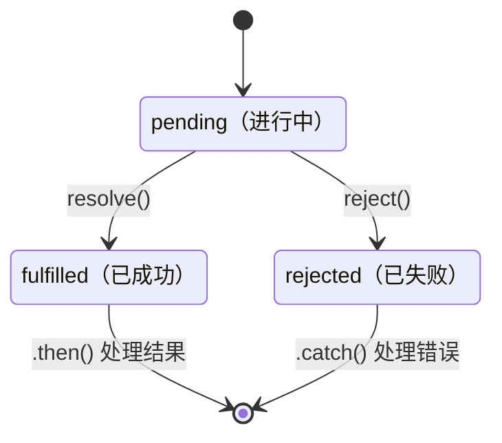
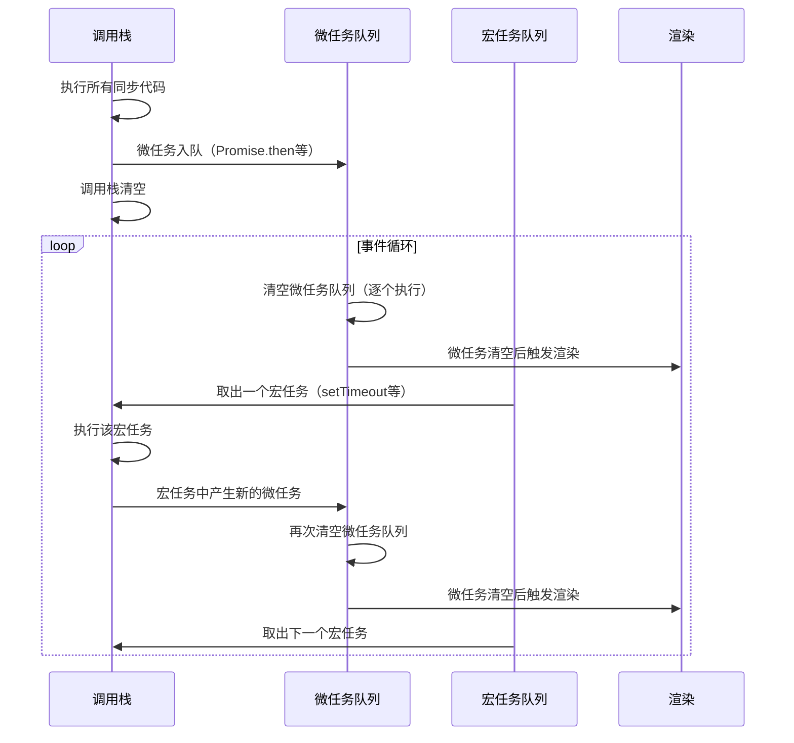
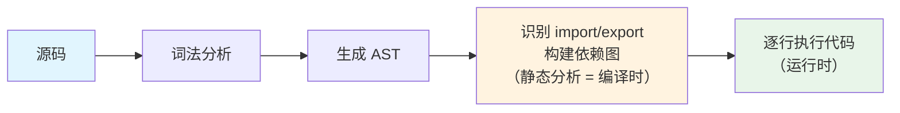

# 02-异步编程与ES6+特性

> 模块：02-javascript-core（第2周 JavaScript 核心）
> 难度：★★★ 核心进阶
> 前置知识：掌握 JavaScript 基本语法和执行机制

---

## 一、回调地狱（Callback Hell）

### 1.1 核心概念

**回调地狱**（Callback Hell / Pyramid of Doom）是指多层嵌套的回调函数导致代码可读性急剧下降、错误处理困难、逻辑难以维护的问题。在早期的 Node.js 和浏览器异步编程中非常普遍。

```javascript
// 典型的回调地狱：读取文件 → 解析 → 查询数据库 → 返回结果
fs.readFile('config.json', (err, config) => {
  if (err) return console.error(err);
  
  fs.readFile(config.dataPath, (err, data) => {
    if (err) return console.error(err);
    
    db.query('SELECT * FROM users WHERE id = ?', [data.userId], (err, users) => {
      if (err) return console.error(err);
      
      processUsers(users, (err, result) => {
        if (err) return console.error(err);
        console.log(result);
      });
    });
  });
});
```

### 1.2 解决方案

| 方案 | 特点 | 适用场景 |
|------|------|---------|
| Promise 链式调用 | 将回调扁平化，支持 .then().catch() | 通用异步流程控制 |
| async/await | 同步风格书写异步代码，最简洁 | 现代项目首选 |
| Generator + co | 类似 async/await，但需要执行器 | 早期过渡方案 |
| 事件发布/订阅 | 解耦异步操作 | 复杂的事件驱动场景 |

### 1.3 避坑指南

| 常见错误 | 现象 | 原因 | 解决方案 |
|---------|------|------|---------|
| 多层嵌套回调 | 代码难以维护，错误无法统一处理 | 回调模式天然嵌套 | 升级为 Promise 或 async/await |
| 忘记 return 终止回调 | 执行了多个分支逻辑 | 回调中未 return 阻止后续执行 | 回调中必要时 return |
| 异步回调中 throw 无法捕获 | 错误未被捕获导致崩溃 | 回调在下一个 tick 执行，try/catch 无效 | 使用 Promise 的 reject 或 async/await |

> 📖 **参考链接**：
> - [MDN - 回调函数](https://developer.mozilla.org/zh-CN/docs/Glossary/Callback_function)
> - [MDN - 异步 JavaScript](https://developer.mozilla.org/zh-CN/docs/Learn/JavaScript/Asynchronous)

---

## 二、Promise 深度解析

### 2.1 核心概念

**Promise** 是 ES6 引入的异步编程解决方案，代表一个异步操作的最终完成（或失败）及其结果值。Promise 有三种状态：

- **pending**（进行中）：初始状态，既未完成也未拒绝
- **fulfilled**（已成功）：操作成功完成，返回结果值
- **rejected**（已失败）：操作失败，返回失败原因

状态一旦从 pending 变为 fulfilled 或 rejected，就不可再改变（**状态凝固**）。

### 2.2 底层原理

Promise 的核心是**观察者模式**和**微任务队列**。当调用 `then` 时，如果 Promise 状态还未确定，回调会被存入内部队列；状态一旦确定，回调就会被加入微任务队列在下一个微任务阶段执行。

```javascript
// Promise 基本用法
const promise = new Promise((resolve, reject) => {
  setTimeout(() => {
    const success = Math.random() > 0.5;
    if (success) {
      resolve('成功');
    } else {
      reject('失败');
    }
  }, 1000);
});

promise
  .then(result => {
    console.log('结果:', result);
    return result + ' - 处理完毕';
  })
  .then(processed => {
    console.log(processed);
  })
  .catch(error => {
    console.error('错误:', error);
  })
  .finally(() => {
    console.log('无论如何都会执行');
  });
```

#### Promise 静态方法对比

| 方法 | 行为 | 使用场景 |
|------|------|---------|
| `Promise.all(iterable)` | 全部成功才成功，任一失败即失败 | 并行请求，全部完成才继续 |
| `Promise.allSettled(iterable)` | 等待全部完成（无论成功/失败），返回每个结果的状态 | 需要知道每个请求的结果 |
| `Promise.race(iterable)` | 返回第一个完成的结果（无论成功/失败） | 超时控制、竞速 |
| `Promise.any(iterable)` | 任一成功即成功，全部失败才失败 | 多源容错，取最快成功 |
| `Promise.resolve(value)` | 返回一个已成功的 Promise | 将值包装为 Promise |
| `Promise.reject(reason)` | 返回一个已失败的 Promise | 快速返回拒绝状态 |

```javascript
// Promise.all 示例
const urls = ['/api/user', '/api/order', '/api/product'];
Promise.all(urls.map(url => fetch(url).then(r => r.json())))
  .then(([user, order, product]) => {
    console.log('所有数据获取完毕:', user, order, product);
  })
  .catch(err => console.error('任一请求失败:', err));

// Promise.race 实现超时控制
function fetchWithTimeout(url, timeout = 5000) {
  return Promise.race([
    fetch(url),
    new Promise((_, reject) =>
      setTimeout(() => reject(new Error('请求超时')), timeout)
    ),
  ]);
}

// Promise.allSettled 示例
Promise.allSettled([
  Promise.resolve(1),
  Promise.reject('错误'),
  Promise.resolve(3),
]).then(results => {
  results.forEach(r => {
    if (r.status === 'fulfilled') console.log('成功:', r.value);
    else console.log('失败:', r.reason);
  });
});
```

### 2.3 链式调用原理

`then` 和 `catch` 方法始终返回一个新的 Promise，这使得链式调用成为可能。链式调用中，前一个 `then` 的返回值会作为参数传递给下一个 `then` 的回调函数。

> **生活化类比**：餐厅点餐流程——点菜（发起请求）→ 厨房做菜（异步处理，你可以干别的事）→ 上菜通知（`.then` 获取结果）→ 收拾餐桌（`.finally`，无论饭菜好坏都执行）。Promise 链就像餐厅的异步服务流程，每道工序完成后通过"通知"进入下一道，而非原地等待。

```javascript
// 链式调用的值传递
Promise.resolve(1)
  .then(v => v * 2)        // 返回 2
  .then(v => v + 3)        // 返回 5
  .then(v => console.log(v)); // 输出 5

// 返回 Promise 时自动展开
Promise.resolve(1)
  .then(v => {
    return new Promise(resolve => {
      setTimeout(() => resolve(v * 10), 1000);
    });
  })
  .then(v => console.log(v)); // 1秒后输出 10
```

### 2.4 避坑指南

| 常见错误 | 现象 | 原因 | 解决方案 |
|---------|------|------|---------|
| Promise 中忘记 return | 后续 then 收到 undefined | 回调函数默认返回 undefined | 确保 return 需要传递的值 |
| 未捕获的 Promise 拒绝 | UnhandledPromiseRejection 警告 | 错误未被 catch 处理 | 始终添加 .catch() 或 try/catch |
| Promise.all 中一个失败全部失败 | 所有请求的回滚 | all 的短路特性 | 改用 allSettled 或单独 catch |
| 在 forEach 中使用 async/await | 异步操作未按预期等待 | forEach 不等待 Promise | 使用 for...of 或 Promise.all |

**Promise 状态转换模型：**



上图展示了 Promise 的三种状态及其转换规则。Promise 初始为 `pending` 状态，通过调用 `resolve()` 转为 `fulfilled`，或通过调用 `reject()` 转为 `rejected`。关键特性是**状态不可逆**：一旦从 `pending` 变为 `fulfilled` 或 `rejected`（即 settled），就无法再次改变，保证了异步操作结果的确定性。

> 📖 **参考链接**：
> - [MDN - Promise](https://developer.mozilla.org/zh-CN/docs/Web/JavaScript/Reference/Global_Objects/Promise)
> - [TC39 - Promise Objects](https://tc39.es/ecma262/#sec-promise-objects)

---

## 三、async/await 原理

### 3.1 核心概念

`async/await` 是 ES2017 引入的异步语法糖，本质上是 **Generator + Promise** 的组合。`async` 函数始终返回一个 Promise，`await` 会暂停函数执行，等待 Promise 完成后再继续。

> **生活化类比：外卖点餐 APP** —— 你在手机上点完餐后（调用 async 函数），可以切换到其他 APP 刷视频（事件循环处理其他任务），不会卡在点餐界面。等外卖小哥送到时（Promise resolve），APP 弹出通知提醒你取餐（恢复 async 函数执行）。`async/await` 让你用"点完餐等着通知"的同步写法，但实际不阻塞你使用手机。关键区别：`await` 只暂停当前 async 函数，主线程（你的手机）完全不受影响，可以继续处理其他操作。

### 3.2 底层原理

`async/await` 可以看作是 Generator 函数的语法糖。Generator 函数通过 `yield` 暂停执行，需要一个执行器来驱动；而 `async/await` 内置了执行器，自动处理 Promise 的完成和错误。

```javascript
// async/await 的使用
async function fetchUserData(userId) {
  try {
    const user = await fetch(`/api/users/${userId}`).then(r => r.json());
    const orders = await fetch(`/api/orders?userId=${userId}`).then(r => r.json());
    return { user, orders };
  } catch (error) {
    console.error('获取数据失败:', error);
    throw error;
  }
}

// 串行执行：依次等待
async function serial() {
  const a = await fetchA(); // 等待 A 完成
  const b = await fetchB(); // 等待 B 完成
  return [a, b];
}

// 并行执行：同时发起
async function parallel() {
  const [a, b] = await Promise.all([fetchA(), fetchB()]);
  return [a, b];
}
```

### 3.3 实战应用

```javascript
// 错误处理的三种方式
// 方式1：try/catch
async function method1() {
  try {
    const data = await riskyOperation();
    return data;
  } catch (err) {
    console.error('操作失败:', err);
    return null;
  }
}

// 方式2：Promise.catch
async function method2() {
  const data = await riskyOperation().catch(err => {
    console.error('操作失败:', err);
    return null;
  });
  return data;
}

// 方式3：封装 to 函数（类似 Go 的错误处理）
async function to(promise) {
  return promise
    .then(data => [null, data])
    .catch(err => [err, null]);
}

async function method3() {
  const [err, data] = await to(riskyOperation());
  if (err) {
    console.error('操作失败:', err);
    return;
  }
  return data;
}

// 并发控制：限制并发数量
async function asyncPool(limit, tasks, iteratorFn) {
  const ret = [];
  const executing = new Set();
  
  for (const task of tasks) {
    const p = Promise.resolve().then(() => iteratorFn(task));
    ret.push(p);
    executing.add(p);
    
    const clean = () => executing.delete(p);
    p.then(clean, clean);
    
    if (executing.size >= limit) {
      await Promise.race(executing);
    }
  }
  
  return Promise.all(ret);
}
```

### 3.4 避坑指南

| 常见错误 | 现象 | 原因 | 解决方案 |
|---------|------|------|---------|
| 循环中使用 await 导致串行 | 性能低下 | 每次 await 都会暂停循环 | 使用 Promise.all 并行 |
| 忘记 await 导致竞态条件 | 数据不一致 | 表达式未等待就继续执行 | 确保需要等待的 Promise 前加 await |
| 顶层使用 await 报错 | SyntaxError | 早期 ES 模块不支持顶层 await | 包装在 async 函数中，或使用支持顶层 await 的环境 |
| async 函数中 throw 未被捕获 | 调用方收到 rejected Promise | async 函数将 throw 转为 rejected Promise | 调用方使用 try/catch 或 .catch() |

> 📖 **参考链接**：
> - [MDN - async function](https://developer.mozilla.org/zh-CN/docs/Web/JavaScript/Reference/Statements/async_function)
> - [MDN - await](https://developer.mozilla.org/zh-CN/docs/Web/JavaScript/Reference/Operators/await)
> - [TC39 - Async Function Definitions](https://tc39.es/ecma262/#sec-async-function-definitions)

---

## 四、Generator 生成器

### 4.1 核心概念

**Generator**（生成器）是 ES6 引入的一种特殊函数，通过 `function*` 声明，可以在执行过程中暂停和恢复。调用 Generator 函数返回一个**迭代器**（Iterator）对象，通过 `next()` 方法控制执行。

### 4.2 底层原理

Generator 实现了**迭代器协议**（Iterator Protocol）。每次调用 `next()` 都会执行到下一个 `yield` 表达式，然后返回 `{ value, done }` 对象。`yield` 表达式可以接收 `next()` 传入的参数，实现双向通信。

```javascript
function* generatorExample() {
  console.log('开始执行');
  const a = yield '第一个 yield';
  console.log('收到参数:', a);
  const b = yield '第二个 yield';
  console.log('收到参数:', b);
  return '结束';
}

const gen = generatorExample();
console.log(gen.next());       // { value: '第一个 yield', done: false }
console.log(gen.next('参数A')); // { value: '第二个 yield', done: false }
console.log(gen.next('参数B')); // { value: '结束', done: true }

// Generator 实现异步流程控制（async/await 的前身）
function* fetchFlow() {
  const user = yield fetch('/api/user').then(r => r.json());
  console.log('用户:', user);
  const orders = yield fetch(`/api/orders?userId=${user.id}`).then(r => r.json());
  console.log('订单:', orders);
}

// 简易执行器
function run(generator) {
  const gen = generator();
  
  function step(nextValue) {
    const result = gen.next(nextValue);
    if (result.done) return result.value;
    result.value.then(step);
  }
  
  step();
}

run(fetchFlow);
```

### 4.3 实战应用

```javascript
// 使用 Generator 实现无限序列
function* fibonacci() {
  let [prev, curr] = [0, 1];
  while (true) {
    yield curr;
    [prev, curr] = [curr, prev + curr];
  }
}

const fib = fibonacci();
console.log(fib.next().value); // 1
console.log(fib.next().value); // 1
console.log(fib.next().value); // 2
console.log(fib.next().value); // 3
console.log(fib.next().value); // 5

// 使用 Generator 遍历树结构
function* traverseTree(node) {
  yield node.value;
  if (node.children) {
    for (const child of node.children) {
      yield* traverseTree(child);
    }
  }
}
```

### 4.4 避坑指南

| 常见错误 | 现象 | 原因 | 解决方案 |
|---------|------|------|---------|
| 忘记调用 next() 启动 | 生成器未执行任何代码 | Generator 需要手动启动 | 确保调用 next() |
| 混淆 yield 和 yield* | 嵌套 Generator 返回迭代器对象而非值 | yield 不会展开迭代器 | 使用 yield* 委托给另一个 Generator |
| Generator 函数中 return 的值 | for...of 遍历时忽略 return 值 | for...of 只遍历 yield 产生的值 | 通过 next() 手动获取 return 值 |

> 📖 **参考链接**：
> - [MDN - function*](https://developer.mozilla.org/zh-CN/docs/Web/JavaScript/Reference/Statements/function*)
> - [MDN - 迭代协议](https://developer.mozilla.org/zh-CN/docs/Web/JavaScript/Reference/Iteration_protocols)

---

## 五、事件循环（Event Loop）

### 5.1 核心概念

**事件循环**（Event Loop）是 JavaScript 的异步执行机制，使得单线程的 JavaScript 能够实现非阻塞的异步操作。事件循环基于**宏任务**（MacroTask）和**微任务**（MicroTask）两个队列，遵循特定的执行顺序。

### 5.2 底层原理

**执行顺序**：先执行所有同步代码 → 清空微任务队列 → 取一个宏任务执行 → 再次清空微任务队列 → 取下一个宏任务 → ...（循环）

**宏任务（MacroTask）**：`<script>` 整体代码、`setTimeout`、`setInterval`、I/O 操作、`setImmediate`（Node.js）

> **注意**：UI 渲染**不属于**宏任务或微任务队列。根据 HTML 规范，渲染是事件循环中一个独立的步骤，在微任务队列清空后、下一个宏任务之前执行。

> **注意**：`requestAnimationFrame` 不属于宏任务，它在浏览器渲染阶段执行，位于宏任务和微任务之后的渲染帧中。`requestAnimationFrame` 的回调在每帧渲染前执行，与宏任务/微任务的调度机制不同。

**微任务（MicroTask）**：`Promise.then/catch/finally`、`MutationObserver`、`process.nextTick`（Node.js 中优先级最高）、`queueMicrotask()`

```javascript
console.log('1 - 同步');

setTimeout(() => {
  console.log('2 - 宏任务 setTimeout');
}, 0);

Promise.resolve()
  .then(() => {
    console.log('3 - 微任务 Promise.then');
  })
  .then(() => {
    console.log('4 - 微任务链式 then');
  });

console.log('5 - 同步');

// 输出顺序：1 → 5 → 3 → 4 → 2
```

### 5.3 实战应用

```javascript
// 经典面试题：综合考察事件循环
async function async1() {
  console.log('async1 start');
  await async2();
  console.log('async1 end');
}

async function async2() {
  console.log('async2');
}

console.log('script start');

setTimeout(() => {
  console.log('setTimeout');
}, 0);

async1();

new Promise((resolve) => {
  console.log('promise1');
  resolve();
}).then(() => {
  console.log('promise2');
});

console.log('script end');

// 输出顺序：
// script start → async1 start → async2 → promise1 → script end
// → async1 end → promise2 → setTimeout
```

### 5.4 避坑指南

| 常见错误 | 现象 | 原因 | 解决方案 |
|---------|------|------|---------|
| 误以为 setTimeout(fn, 0) 立即执行 | 回调在同步代码之后执行 | 宏任务需要等待当前微任务清空 | 理解事件循环的优先级 |
| 在微任务中递归创建微任务 | 页面卡死，宏任务永远无法执行 | 微任务队列被无限延长 | 避免微任务中无限递归 |
| 混淆 Node.js 和浏览器的事件循环 | 执行顺序不同 | Node.js 有不同的事件循环阶段 | 了解运行环境的差异 |
| 同步代码阻塞事件循环 | 页面响应卡顿 | 长时间同步操作阻塞主线程 | 拆分长任务或使用 Web Worker |

**事件循环执行时序：**



上图展示了浏览器事件循环中宏任务与微任务的执行时序。每次事件循环 tick 的核心流程为：先执行一个宏任务，然后**清空微任务队列中的所有微任务**，之后浏览器可能进行渲染，再进入下一轮循环。微任务的优先级高于宏任务，这也是为什么 `Promise.then` 的回调总是在 `setTimeout` 回调之前执行的原因。

> 📖 **参考链接**：
> - [MDN - 并发模型与事件循环](https://developer.mozilla.org/zh-CN/docs/Web/JavaScript/EventLoop)
> - [MDN - queueMicrotask](https://developer.mozilla.org/zh-CN/docs/Web/API/queueMicrotask)
> - [MDN - setTimeout](https://developer.mozilla.org/zh-CN/docs/Web/API/setTimeout)

---

## 六、ES6 模块化

### 6.1 核心概念

JavaScript 模块化经历了从无到有的演进过程。目前主流方案有两种：

- **CommonJS**（CJS）：Node.js 的默认模块规范，使用 `require` / `module.exports`，**运行时加载**，输出值的**拷贝**
- **ES Module**（ESM）：ES6 官方标准，使用 `import` / `export`，**编译时加载**（静态分析），输出值的**引用**

> **生活化类比：去一个地方**
>
> 想象你要去一个地方：
>
> - **编译时 = 出发前，在家里看地图做规划**。这时你还没真正出门，但已经完全确定了路线：去哪里、经过哪些路口、走哪条路。这个"规划"在行动前就已经被静态分析完毕，引擎可以提前进行优化（比如知道全程高速，提前检查车况）。
> - **运行时 = 你已经开车在路上**。到了一个路口，你才根据路况临时决定下一步：左转去超市，还是右转回家？这个决定只有等到运行到那个路口才能做出，无法提前规划。
>
> 对应到模块加载：
>
> - **ES Module 就像出发前的规划**：`import` 语句必须写在文件最顶层，不能放在 `if` 判断里，引擎在代码执行之前就能扫出所有依赖，构建出"模块地图"，进行静态分析（如 Tree Shaking）。
> - **CommonJS 就像在路上临时决定**：`require` 是一个函数，可以在代码的任何位置调用，甚至根据条件加载不同模块，只有真正执行到那一行时才去加载。

### 6.2 底层原理

#### JavaScript 真的有"编译"吗？

我们常说 JavaScript 是解释型语言，但现代 JS 引擎（V8/SpiderMonkey）实际都有一个解析/预编译阶段：

```
拿到源码 → 词法分析 → 生成 AST（抽象语法树）
```

在这个阶段就能识别出所有 `import` / `export` 声明，确定模块依赖关系，这叫**静态分析**。然后才逐行执行代码。

所以，"编译时"指的就是这个代码解析、AST 生成、依赖关系构建的阶段，而不是像 C 语言那种编译成机器码。



> 上图展示了现代 JS 引擎的处理流程。橙色阶段（识别 `import` / `export`）就是"编译时"——在此阶段引擎完成模块依赖分析，但尚未执行任何代码。绿色阶段（逐行执行）才是"运行时"。ES Module 的静态分析能力正是依赖于"编译时"阶段，而 CommonJS 的 `require` 要等到"运行时"才执行，因此无法进行静态分析。

| 对比维度 | CommonJS | ES Module |
|---------|----------|-----------|
| 加载时机 | 运行时 | 编译时（静态） |
| 输出 | 值的拷贝 | 值的引用（实时绑定） |
| this 指向 | 当前模块 | undefined |
| 动态导入 | 支持（require 可在任意位置） | 支持 import() 动态导入 |
| Tree Shaking | 不支持 | 支持（静态分析） |
| 循环引用 | 可能拿到未完成的值 | 能正确处理（引用绑定） |

```javascript
// CommonJS 示例
// math.js
let count = 0;
function increment() { count++; }
module.exports = { count, increment };

// main.js
const math = require('./math');
console.log(math.count); // 0
math.increment();
console.log(math.count); // 0（拷贝，不会更新！）

// ES Module 示例
// math.mjs
export let count = 0;
export function increment() { count++; }

// main.mjs
import { count, increment } from './math.mjs';
console.log(count); // 0
increment();
console.log(count); // 1（引用绑定，实时更新！）
```

**条件加载对比示例**：

```javascript
// CommonJS：可以在任意位置 require，支持条件加载（运行时决定）
if (process.env.NODE_ENV === 'development') {
  const devTools = require('./dev-tools'); // ✅ 运行到此处才加载
  devTools.init();
}

// ES Module：import 必须在顶层，不能放在条件语句中（编译时确定）
// ❌ 以下写法会报错：SyntaxError: 'import' and 'export' may only appear at the top level
if (process.env.NODE_ENV === 'development') {
  import devTools from './dev-tools.js'; // 语法错误！
}

// ESM 的条件加载需使用动态 import()（返回 Promise）
if (process.env.NODE_ENV === 'development') {
  import('./dev-tools.js').then(devTools => devTools.init()); // ✅ 运行时动态加载
}
```

> 这个对比直观体现了两种模块规范的核心差异：CommonJS 的 `require` 是普通函数，可以在任何位置调用；ES Module 的 `import` 是声明语句，必须在顶层静态声明。这也正是 ESM 能支持 Tree Shaking 而 CJS 不能的根本原因——只有静态声明才能在编译时分析出哪些导出未被使用。

### 6.3 Tree Shaking 原理

Tree Shaking（摇树优化）依赖于 ES Module 的**静态结构**特性。打包工具（如 Webpack、Rollup）在编译时分析 `import` / `export` 语句，构建依赖图，标记并移除未被引用的**死代码**（Dead Code）。

```javascript
// utils.js
export function used() { /* ... */ }
export function unused() { /* ... */ } // 会被 Tree Shaking 移除

// main.js
import { used } from './utils.js'; // 只导入了 used
used();
```

### 6.4 动态导入

```javascript
// 静态导入（必须顶层）
import { something } from './module.js';

// 动态导入（可在任意位置，返回 Promise）
button.addEventListener('click', async () => {
  const { heavyModule } = await import('./heavy-module.js');
  heavyModule.doSomething();
});

// 条件加载
if (condition) {
  import('./module-a.js').then(m => m.init());
} else {
  import('./module-b.js').then(m => m.init());
}
```

### 6.5 避坑指南

| 常见错误 | 现象 | 原因 | 解决方案 |
|---------|------|------|---------|
| CJS 和 ESM 混用 | 导入失败或行为异常 | 两者加载机制不同 | 统一使用一种规范，或在 package.json 中设置 type |
| CJS 循环引用导致导出为空 | 获取到不完整的模块 | CJS 先执行再导出，循环时可能未完成 | 重构模块结构，或使用 ESM |
| 忘记 .mjs 扩展名或 type 字段 | 报错 Unexpected token 'export' | Node.js 默认使用 CJS | 设置 package.json 中 "type": "module" |
| 动态导入未处理错误 | 模块加载失败时崩溃 | import() 返回 Promise 未被 catch | 为动态导入添加 .catch() 或 try/catch |

> 📖 **参考链接**：
> - [MDN - import](https://developer.mozilla.org/zh-CN/docs/Web/JavaScript/Reference/Statements/import)
> - [MDN - export](https://developer.mozilla.org/zh-CN/docs/Web/JavaScript/Reference/Statements/export)
> - [MDN - JavaScript 模块](https://developer.mozilla.org/zh-CN/docs/Web/JavaScript/Guide/Modules)

---

## 七、其他 ES6+ 核心特性

### 7.1 解构赋值

```javascript
// 数组解构
const [a, b, ...rest] = [1, 2, 3, 4, 5];
console.log(a, b, rest); // 1 2 [3, 4, 5]

// 对象解构（支持重命名和默认值）
const user = { name: 'Alice', age: 25 };
const { name: userName, age, gender = '未知' } = user;
console.log(userName, age, gender); // Alice 25 未知

// 函数参数解构
function printUser({ name, age }) {
  console.log(`${name} - ${age}`);
}
```

### 7.2 展开运算符与剩余参数

```javascript
// 展开运算符（Spread）
const arr1 = [1, 2, 3];
const arr2 = [4, 5, 6];
const combined = [...arr1, ...arr2]; // [1, 2, 3, 4, 5, 6]

const obj1 = { a: 1, b: 2 };
const obj2 = { b: 3, c: 4 };
const merged = { ...obj1, ...obj2 }; // { a: 1, b: 3, c: 4 }（后面覆盖前面）

// 剩余参数（Rest）
function sum(...numbers) {
  return numbers.reduce((total, n) => total + n, 0);
}
console.log(sum(1, 2, 3, 4)); // 10
```

### 7.3 可选链（?.）与空值合并（??）

```javascript
// 可选链：安全访问深层属性
const user = { profile: null };
console.log(user.profile?.name); // undefined（不会抛错）
console.log(user.profile?.name ?? '匿名用户'); // '匿名用户'

// 空值合并：只有 null/undefined 时使用默认值
const count = 0;
console.log(count || 10);  // 10（|| 会将 0 视为 falsy）
console.log(count ?? 10);  // 0（?? 只处理 null/undefined）
```

### 7.4 Symbol

```javascript
// Symbol 创建唯一标识
const s1 = Symbol('key');
const s2 = Symbol('key');
console.log(s1 === s2); // false（每个 Symbol 都是唯一的）

// 用途：防止属性名冲突
const id = Symbol('id');
const obj = {
  [id]: '唯一标识',
  name: '普通属性',
};
console.log(obj[id]); // '唯一标识'
// for...in 和 Object.keys() 不会遍历 Symbol 属性

// 全局 Symbol 注册表
const globalSym = Symbol.for('app.key');
console.log(Symbol.for('app.key') === globalSym); // true
```

### 7.5 Set / Map / WeakMap

```javascript
// Set：唯一值集合
const set = new Set([1, 2, 2, 3, 3, 4]);
console.log([...set]); // [1, 2, 3, 4]
set.add(5);
set.has(3); // true
set.delete(2);

// 数组去重一行代码
const unique = [...new Set([1, 2, 2, 3])];

// Map：键值对集合，键可以是任意类型
const map = new Map();
map.set('key', 'value');
map.set({ id: 1 }, '对象作为键');
map.get('key'); // 'value'

// WeakMap：键必须是对象，且是弱引用（不阻止垃圾回收）
const weakMap = new WeakMap();
let obj = { data: 'some data' };
weakMap.set(obj, 'metadata');
obj = null; // 此时 WeakMap 中的条目可以被垃圾回收

// WeakMap 的典型用途：存储 DOM 元素关联数据
const elementData = new WeakMap();
const btn = document.querySelector('button');
elementData.set(btn, { clickCount: 0 });
btn.addEventListener('click', () => {
  const data = elementData.get(btn);
  data.clickCount++;
});
```

### 7.6 模板字符串

```javascript
const name = 'Alice';
const age = 25;
const greeting = `你好，我是 ${name}，今年 ${age} 岁。`;

// 多行字符串
const html = `
  <div>
    <h1>标题</h1>
    <p>内容</p>
  </div>
`;

// 标签模板
function highlight(strings, ...values) {
  return strings.reduce((result, str, i) => {
    return result + str + (values[i] ? `<mark>${values[i]}</mark>` : '');
  }, '');
}
const result = highlight`用户 ${name} 的年龄是 ${age}`;
```

### 7.7 避坑指南

| 常见错误 | 现象 | 原因 | 解决方案 |
|---------|------|------|---------|
| 可选链用于赋值 | 语法错误 | ?. 不能用于赋值操作 | 先判断再赋值 |
| 混淆 || 和 ?? | 0 或 '' 被误判为需要默认值 | 明确语义：|| 判断 falsy，?? 判断 null/undefined |
| Map 使用对象键时引用丢失 | 无法通过字面量对象获取值 | 对象键比较的是引用 | 使用字符串键或保存对象引用 |
| WeakMap 不可迭代 | 无法遍历 | 弱引用特性导致无法枚举 | 使用 Map 替代，或单独维护键列表 |

> 📖 **参考链接**：
> - [MDN - 解构赋值](https://developer.mozilla.org/zh-CN/docs/Web/JavaScript/Reference/Operators/Destructuring_assignment)
> - [MDN - 展开语法](https://developer.mozilla.org/zh-CN/docs/Web/JavaScript/Reference/Operators/Spread_syntax)
> - [MDN - 可选链](https://developer.mozilla.org/zh-CN/docs/Web/JavaScript/Reference/Operators/Optional_chaining)
> - [MDN - Symbol](https://developer.mozilla.org/zh-CN/docs/Web/JavaScript/Reference/Global_Objects/Symbol)
> - [MDN - Set](https://developer.mozilla.org/zh-CN/docs/Web/JavaScript/Reference/Global_Objects/Set)
> - [MDN - Map](https://developer.mozilla.org/zh-CN/docs/Web/JavaScript/Reference/Global_Objects/Map)

---

## 八、ES2023-ES2025 新特性

> ES 标准自 ES2021 之后转向了更小粒度、更频繁的年度发布模式。ES2023 和 ES2024 已经正式定稿并被主流浏览器全面支持，ES2025 已于 2025 年 6 月 25 日正式批准为 ECMAScript 标准。这些新特性聚焦于**不可变操作**、**数据分组**、**异步增强**和**国际化时间处理**，补全了 JavaScript 长期以来缺失的实用工具。

### 8.1 ES2023：不可变数组方法与查找增强

ES2023 引入了 **4 个不可变数组方法**和 **2 个逆向查找方法**，解决了长期困扰开发者的一个问题：`sort()`、`reverse()`、`splice()` 等方法会**原地修改原数组**，导致意外的副作用。

#### 不可变数组方法

```javascript
// ========== toSorted()：排序后返回新数组 ==========
const arr = [3, 1, 4, 1, 5, 9, 2, 6];
const sorted = arr.toSorted();
console.log(sorted); // [1, 1, 2, 3, 4, 5, 6, 9]
console.log(arr);    // [3, 1, 4, 1, 5, 9, 2, 6]（原数组不变！）

// 支持自定义比较函数
const users = [
  { name: 'Alice', age: 30 },
  { name: 'Bob', age: 25 },
  { name: 'Charlie', age: 35 },
];
const sortedByAge = users.toSorted((a, b) => a.age - b.age);
console.log(sortedByAge.map(u => u.name)); // ['Bob', 'Alice', 'Charlie']

// ========== toReversed()：反转后返回新数组 ==========
const original = [1, 2, 3, 4, 5];
const reversed = original.toReversed();
console.log(reversed); // [5, 4, 3, 2, 1]
console.log(original); // [1, 2, 3, 4, 5]（原数组不变！）

// ========== toSpliced()：删除/替换后返回新数组 ==========
const fruits = ['apple', 'banana', 'cherry', 'date'];

// 删除索引 1-2 的元素
const removed = fruits.toSpliced(1, 2);
console.log(removed); // ['apple', 'date']
console.log(fruits);  // ['apple', 'banana', 'cherry', 'date']（原数组不变！）

// 删除并替换
const replaced = fruits.toSpliced(1, 1, 'blueberry', 'kiwi');
console.log(replaced); // ['apple', 'blueberry', 'kiwi', 'cherry', 'date']

// 插入元素（不删除）
const inserted = fruits.toSpliced(2, 0, 'grape', 'melon');
console.log(inserted); // ['apple', 'banana', 'grape', 'melon', 'cherry', 'date']

// ========== with()：替换指定索引元素后返回新数组 ==========
const colors = ['red', 'green', 'blue'];
const updated = colors.with(1, 'yellow');
console.log(updated); // ['red', 'yellow', 'blue']
console.log(colors);  // ['red', 'green', 'blue']（原数组不变！）

// 支持负索引（从末尾开始计数）
const lastUpdated = colors.with(-1, 'purple');
console.log(lastUpdated); // ['red', 'green', 'purple']
```

#### 逆向查找方法

```javascript
// ========== findLast()：从后往前查找，返回第一个匹配的元素 ==========
const numbers = [1, 3, 5, 7, 9, 5, 3, 1];
const lastMultipleOf3 = numbers.findLast(n => n % 3 === 0);
console.log(lastMultipleOf3); // 3（倒数第二个 3，而非第一个 3）

// ========== findLastIndex()：从后往前查找，返回第一个匹配的索引 ==========
const lastIndex = numbers.findLastIndex(n => n % 3 === 0);
console.log(lastIndex); // 6（索引 6 处的元素 3）

// 对比 find() / findIndex()（从前往后查找）
console.log(numbers.find(n => n % 3 === 0));     // 3（索引 1）
console.log(numbers.findIndex(n => n % 3 === 0)); // 1
```

#### 不可变数组方法与旧方法对比表

| 会改变原数组的方法 | 对应的不可变方法 | 引入版本 | 说明 |
|---|---|---|---|
| `sort()` | `toSorted()` | ES2023 | 排序后返回新数组，原数组不变 |
| `reverse()` | `toReversed()` | ES2023 | 反转后返回新数组，原数组不变 |
| `splice()` | `toSpliced()` | ES2023 | 删除/替换后返回新数组，原数组不变 |
| `arr[index] = value` | `with(index, value)` | ES2023 | 替换指定索引后返回新数组，支持负索引 |
| `push()` | `[...arr, item]` | ES6 | 展开运算符模拟末尾追加 |
| `unshift()` | `[item, ...arr]` | ES6 | 展开运算符模拟头部追加 |
| `pop()` | `arr.slice(0, -1)` | ES5 | slice 模拟删除末尾 |
| `shift()` | `arr.slice(1)` | ES5 | slice 模拟删除头部 |

> **设计理念**：不可变方法借鉴了函数式编程的核心理念——**不修改输入，只产生新输出**。这一原则在 React 状态管理中尤为重要，因为 React 依赖不可变数据来判断是否需要重新渲染。使用 `toSorted()` 等不可变方法，可以避免因忘记先 `[...arr]` 展开拷贝而导致的渲染 Bug。

### 8.2 ES2024：数据分组、Promise 增强与字符串处理

ES2024 引入了三个重要特性，分别解决了数据分组、Promise 手动创建和 Unicode 字符串校验的痛点。

#### Object.groupBy() 和 Map.groupBy()

```javascript
// ========== Object.groupBy()：按条件分组，返回普通对象 ==========
const inventory = [
  { name: 'asparagus', type: 'vegetables', quantity: 5 },
  { name: 'bananas', type: 'fruit', quantity: 2 },
  { name: 'goat', type: 'meat', quantity: 23 },
  { name: 'cherries', type: 'fruit', quantity: 8 },
  { name: 'fish', type: 'meat', quantity: 20 },
];

// 按 type 分组，返回对象（键为分组名，值为数组）
const groupedByType = Object.groupBy(inventory, ({ type }) => type);
console.log(groupedByType);
// {
//   vegetables: [{ name: 'asparagus', type: 'vegetables', quantity: 5 }],
//   fruit: [
//     { name: 'bananas', type: 'fruit', quantity: 2 },
//     { name: 'cherries', type: 'fruit', quantity: 8 },
//   ],
//   meat: [
//     { name: 'goat', type: 'meat', quantity: 23 },
//     { name: 'fish', type: 'meat', quantity: 20 },
//   ],
// }

// 复杂分组逻辑：按数量区间分组
const groupedByQuantity = Object.groupBy(inventory, ({ quantity }) => {
  if (quantity <= 5) return 'low';
  if (quantity <= 20) return 'medium';
  return 'high';
});
console.log(groupedByQuantity);
// {
//   low: [
//     { name: 'asparagus', type: 'vegetables', quantity: 5 },
//     { name: 'bananas', type: 'fruit', quantity: 2 },
//   ],
//   medium: [{ name: 'cherries', type: 'fruit', quantity: 8 }],
//   high: [
//     { name: 'goat', type: 'meat', quantity: 23 },
//     { name: 'fish', type: 'meat', quantity: 20 },
//   ],
// }

// ========== Map.groupBy()：按条件分组，返回 Map 对象 ==========
// 适合键为非字符串类型（如数字、对象、布尔值）的场景
const groupedByQuantityMap = Map.groupBy(inventory, ({ quantity }) => {
  if (quantity <= 5) return 'low';
  if (quantity <= 20) return 'medium';
  return 'high';
});

// Map 的优势：键可以是任意类型，且保持插入顺序
for (const [key, items] of groupedByQuantityMap) {
  console.log(`${key}: ${items.map(i => i.name).join(', ')}`);
}
// low: asparagus, bananas
// medium: cherries
// high: goat, fish

// ========== 对比旧方案：手写 reduce 实现分组 ==========
// 旧方案（ES2024 之前）
const oldGrouped = inventory.reduce((acc, item) => {
  const key = item.type;
  if (!acc[key]) acc[key] = [];
  acc[key].push(item);
  return acc;
}, {});
// 新方案：简洁且语义清晰
const newGrouped = Object.groupBy(inventory, ({ type }) => type);
```

#### Promise.withResolvers()

```javascript
// ========== Promise.withResolvers()：手动控制 Promise 的 resolve/reject ==========
// 旧方案：需要自己声明变量，繁琐且容易遗漏
let oldResolve, oldReject;
const oldPromise = new Promise((resolve, reject) => {
  oldResolve = resolve;
  oldReject = reject;
});

// 新方案：一步到位，简洁且类型安全
const { promise, resolve, reject } = Promise.withResolvers();

// 典型使用场景：将事件驱动转换为 Promise
function waitForClick(element) {
  const { promise, resolve } = Promise.withResolvers();
  element.addEventListener('click', resolve, { once: true });
  return promise;
}

// 超时控制
function createTimeoutSignal(ms) {
  const { promise, resolve } = Promise.withResolvers();
  const timer = setTimeout(() => {
    resolve('timeout');
  }, ms);
  return { promise, cancel: () => clearTimeout(timer) };
}

// 队列线控
function createAsyncQueue() {
  const queue = [];
  let waiter = null;

  return {
    async enqueue(item) {
      if (waiter) {
        waiter.resolve(item);
        waiter = null;
      } else {
        queue.push(item);
      }
    },
    async dequeue() {
      if (queue.length > 0) {
        return queue.shift();
      }
      waiter = Promise.withResolvers();
      return waiter.promise;
    },
  };
}
```

#### String.prototype.isWellFormed() 和 toWellFormed()

```javascript
// ========== 背景：Unicode 代理对与孤立代理 ==========
// UTF-16 编码中，每个字符占 2 或 4 字节（代理对）
// 如果高代理和低代理不成对，就会出现"孤立代理"（Lone Surrogate）
// 孤立代理在 JSON.stringify、某些 API 中可能导致错误

// ========== isWellFormed()：检查字符串是否包含孤立代理 ==========
const wellFormed = 'Hello, 世界!';
console.log(wellFormed.isWellFormed()); // true

const illFormed = 'ab\uD800'; // \uD800 是孤立的高代理
console.log(illFormed.isWellFormed()); // false

// ========== toWellFormed()：将孤立代理替换为 U+FFFD（替换字符）==========
const fixed = illFormed.toWellFormed();
console.log(fixed); // 'ab'（ 是 U+FFFD 替换字符）
console.log(fixed.isWellFormed()); // true

// 实际应用：安全序列化含孤立代理的字符串
function safeJSONStringify(data) {
  // 递归处理对象中所有字符串
  const sanitize = (obj) => {
    if (typeof obj === 'string') {
      return obj.toWellFormed();
    }
    if (Array.isArray(obj)) {
      return obj.map(sanitize);
    }
    if (obj && typeof obj === 'object') {
      return Object.fromEntries(
        Object.entries(obj).map(([k, v]) => [k, sanitize(v)])
      );
    }
    return obj;
  };
  return JSON.stringify(sanitize(data));
}

// 使用 TextEncoder 检查
function isWellFormedLegacy(str) {
  try {
    new TextEncoder().encode(str);
    return true;
  } catch {
    return false;
  }
}
```

#### Set 集合操作方法（ES2024）

ES2024 为 `Set.prototype` 新增了四个集合操作方法，使得 JavaScript 原生支持集合运算，无需手写循环或借助第三方库。这些方法同样遵循不可变原则，返回新的 `Set` 对象，不修改原 `Set`。

```javascript
const setA = new Set([1, 2, 3]);
const setB = new Set([2, 3, 4]);

// ========== union()：并集 ==========
// 返回包含两个集合中所有元素的新 Set（去重）
const unionSet = setA.union(setB);
console.log(unionSet); // Set {1, 2, 3, 4}

// ========== intersection()：交集 ==========
// 返回同时存在于两个集合中的元素
const intersectionSet = setA.intersection(setB);
console.log(intersectionSet); // Set {2, 3}

// ========== difference()：差集 ==========
// 返回存在于 setA 但不存在于 setB 中的元素
const differenceSet = setA.difference(setB);
console.log(differenceSet); // Set {1}

// ========== symmetricDifference()：对称差集 ==========
// 返回仅存在于其中一个集合但不同时存在于两个集合中的元素
// 即 (A ∪ B) - (A ∩ B)
const symmetricDiffSet = setA.symmetricDifference(setB);
console.log(symmetricDiffSet); // Set {1, 4}

// 所有方法都返回新 Set，原 Set 不变
console.log(setA); // Set {1, 2, 3}（原集合不变！）
console.log(setB); // Set {2, 3, 4}（原集合不变！）

// 实际应用：用户权限管理
const adminPermissions = new Set(['read', 'write', 'delete', 'manage']);
const editorPermissions = new Set(['read', 'write']);

// 管理员独有的权限
const adminOnly = adminPermissions.difference(editorPermissions);
console.log(adminOnly); // Set {'delete', 'manage'}

// 合并权限（所有可用权限）
const allPermissions = adminPermissions.union(editorPermissions);
console.log(allPermissions); // Set {'read', 'write', 'delete', 'manage'}

// 共同权限
const commonPermissions = adminPermissions.intersection(editorPermissions);
console.log(commonPermissions); // Set {'read', 'write'}
```

> **注意**：`union()`、`intersection()`、`difference()` 和 `symmetricDifference()` 方法接受 `Set` 对象或任何实现了 `Set` 协议的对象作为参数。这些方法在 ES2024 中正式定稿，Chrome 122+、Firefox 127+、Safari 17+ 等现代浏览器已原生支持。

### 8.3 ES2025：Temporal API 简介

**Temporal** 是 JavaScript 全新的日期时间 API，旨在全面替代 `Date` 对象。`Date` 对象自 1995 年引入以来，存在时区处理困难、可变性 Bug、API 不一致等问题。

```javascript
// ========== Temporal 核心类型 ==========
// 1. Temporal.Instant：时间戳（纳秒精度）
const instant = Temporal.Instant.from('2025-07-17T08:00:00Z');
console.log(instant.epochMilliseconds); // 时间戳（毫秒）
console.log(instant.epochNanoseconds);  // 时间戳（纳秒）

// 2. Temporal.PlainDate：纯日期（无时区、无时间）
const date = Temporal.PlainDate.from('2025-07-17');
console.log(date.year);   // 2025
console.log(date.month);  // 7
console.log(date.day);    // 17
console.log(date.dayOfWeek); // 4（星期四）
// 不可变操作：返回新对象，原对象不变
const nextMonth = date.add({ months: 1 });
console.log(nextMonth.toString()); // '2025-08-17'
console.log(date.toString());      // '2025-07-17'（原对象不变！）

// 3. Temporal.PlainTime：纯时间
const time = Temporal.PlainTime.from('14:30:00.500');
console.log(time.hour);        // 14
console.log(time.minute);      // 30
console.log(time.second);      // 0
console.log(time.millisecond); // 500

// 4. Temporal.PlainDateTime：日期 + 时间（无时区）
const dateTime = Temporal.PlainDateTime.from('2025-07-17T14:30:00');
const rounded = dateTime.round({ smallestUnit: 'hour', roundingMode: 'floor' });
console.log(rounded.toString()); // '2025-07-17T14:00:00'

// 5. Temporal.ZonedDateTime：带时区的日期时间
const zoned = Temporal.ZonedDateTime.from({
  timeZone: 'Asia/Shanghai',
  year: 2025, month: 7, day: 17, hour: 14, minute: 30,
});
console.log(zoned.toString()); // '2025-07-17T14:30:00+08:00[Asia/Shanghai]'

// 时区转换
const tokyoTime = zoned.withTimeZone('Asia/Tokyo');
console.log(tokyoTime.toString()); // '2025-07-17T15:30:00+09:00[Asia/Tokyo]'

// 6. Temporal.Duration：时间间隔
const duration = Temporal.Duration.from({ hours: 3, minutes: 45 });
const totalMinutes = duration.total({ unit: 'minutes' });
console.log(totalMinutes); // 225

// 7. 日期计算（不再需要手动处理月份天数）
const start = Temporal.PlainDate.from('2025-01-31');
const end = start.add({ months: 1 }); // 自动处理月份天数
console.log(end.toString()); // '2025-02-28'（而非 '2025-02-31'）

// 8. 比较日期
const a = Temporal.PlainDate.from('2025-07-17');
const b = Temporal.PlainDate.from('2025-12-31');
console.log(Temporal.PlainDate.compare(a, b)); // -1（a < b）
console.log(a.since(b)); // Temporal.Duration（负数表示 a 在 b 之前）
```

#### Temporal 与 Date 对比

| 维度 | `Date` | `Temporal` |
|---|---|---|
| 可变性 | 可变（`setMonth` 等修改原对象） | 不可变（所有操作返回新对象） |
| 时区支持 | 仅 UTC 和本地时区 | 完整的 IANA 时区数据库支持 |
| 精度 | 毫秒 | 纳秒 |
| 日期计算 | 手动处理月份天数 | 自动处理日历算术 |
| 比较操作 | 基于时间戳 | 专用比较方法 |
| 格式化 | 依赖 `toLocaleString` | 专用的 `toString()` 和格式化方法 |
| 适用场景 | 简单时间戳操作 | 复杂的日期计算、多时区、国际化 |

> **注意**：Temporal 作为 ES2025 的一部分已于 2025 年 6 月正式定稿（Stage 4）。目前主流浏览器尚未全面原生支持（MDN 标注为"有限可用"），生产环境建议通过 `@js-temporal/polyfill` 使用。

#### Iterator 辅助方法（ES2025）

ES2025 为 `Iterator.prototype` 新增了一系列辅助方法，使得迭代器获得了类似数组的函数式编程能力。这些方法借鉴了数组的 `map`、`filter`、`take` 等 API，但遵循**惰性求值**（Lazy Evaluation）原则——中间操作不会立即执行，只有最终消费操作（如 `toArray()`、`forEach()`）才会触发遍历。

```javascript
// ========== 基础示例：链式调用 ==========
function* numbers() {
  yield 1; yield 2; yield 3; yield 4; yield 5;
}

const result = numbers()
  .map(x => x * 2)      // 2, 4, 6, 8, 10
  .filter(x => x > 5)   // 6, 8, 10
  .take(2)              // 6, 8
  .toArray();

console.log(result); // [6, 8]

// ========== Iterator 辅助方法全览 ==========
function* range(start, end) {
  for (let i = start; i <= end; i++) {
    yield i;
  }
}

const iter = range(1, 10);

// map：转换每个元素
const doubled = iter.map(x => x * 2);
console.log(doubled.toArray()); // [2, 4, 6, 8, 10, 12, 14, 16, 18, 20]

// filter：过滤元素
const evens = range(1, 10).filter(x => x % 2 === 0);
console.log(evens.toArray()); // [2, 4, 6, 8, 10]

// take：取前 n 个元素
const first3 = range(1, 10).take(3);
console.log(first3.toArray()); // [1, 2, 3]

// drop：跳过前 n 个元素
const skip3 = range(1, 10).drop(3);
console.log(skip3.toArray()); // [4, 5, 6, 7, 8, 9, 10]

// flatMap：映射并展平
const pairs = range(1, 3).flatMap(x => [x, x * 10]);
console.log(pairs.toArray()); // [1, 10, 2, 20, 3, 30]

// reduce：归约操作
const sum = range(1, 5).reduce((acc, x) => acc + x, 0);
console.log(sum); // 15

// forEach：遍历每个元素
range(1, 3).forEach(x => console.log(x)); // 1, 2, 3

// some / every：条件判断
console.log(range(1, 5).some(x => x > 3));   // true
console.log(range(1, 5).every(x => x < 10)); // true

// find：查找第一个匹配元素
console.log(range(1, 10).find(x => x > 5 && x % 2 === 0)); // 6

// 消费方法（触发遍历的终点）
// toArray()：转换为数组
// forEach()：遍历执行
// reduce()：归约计算
// some() / every()：条件判断
// find()：查找元素
```

> **核心优势**：Iterator 辅助方法是**惰性求值**的，这意味着 `map`、`filter`、`take` 等中间操作不会创建中间数组，内存效率远高于数组的链式调用。对于处理大型数据集或无限序列时尤为重要。这些方法在 ES2025 中正式定稿，Chrome 133+、Firefox 135+ 等现代浏览器已原生支持。

### 8.4 避坑指南

| 常见错误 | 现象 | 原因 | 解决方案 |
|---------|------|------|---------|
| 在 React/Vue 中使用 `sort()` 直接修改了状态 | 渲染异常或状态追踪失效 | `sort()` 是原地修改，破坏了不可变数据 | 使用 `toSorted()` 替代 `sort()` |
| `Object.groupBy()` 返回 null 键 | 分组结果中出现 null 键 | 回调函数可能返回 `undefined` 或 `null` | 确保回调函数返回有效的键值 |
| 滥用 `Promise.withResolvers()` 绕过 Promise 链 | 代码逻辑混乱，错误难以追踪 | 手动控制的 Promise 脱离了 Promise 链的错误传播 | 仅在事件转换、超时控制等少量场景使用 |
| 混淆 `toSpliced()` 和 `with()` | 替换/删除逻辑不符合预期 | `toSpliced()` 用于删除/插入多个元素，`with()` 用于替换单个元素 | 单元素替换用 `with()`，多元素操作用 `toSpliced()` |
| Temporal 与 Date 混用 | 类型不匹配错误 | Temporal 和 Date 是不同的类型系统 | 统一使用 Temporal 或通过 `instant.toDate()` 桥接 |

> 📖 **参考链接**：
> - [MDN - Array.prototype.toSorted()](https://developer.mozilla.org/zh-CN/docs/Web/JavaScript/Reference/Global_Objects/Array/toSorted)
> - [MDN - Object.groupBy()](https://developer.mozilla.org/zh-CN/docs/Web/JavaScript/Reference/Global_Objects/Object/groupBy)
> - [MDN - Promise.withResolvers()](https://developer.mozilla.org/zh-CN/docs/Web/JavaScript/Reference/Global_Objects/Promise/withResolvers)

---

> **学习导航**：
> - 返回 [学习路线总览](../README.md)
> - 上一章：[01-语法基础与执行机制](./01-语法基础与执行机制.md)
> - 本模块后续：[03-常用API与手写原理](./03-常用API与手写原理.md) | [04-JavaScript核心笔面试题集](./04-JavaScript核心笔面试题集.md)
> - 实战应用：[企业后台管理系统](../10-project/01-企业后台管理系统实战.md)

---

## 九、ES2022-2025 新特性速览

> 截至 2026 年，ES2022-2025 已为 JavaScript 带来了大量实用新特性。

### 9.1 ES2022

| 特性 | 说明 | 示例 |
|------|------|------|
| `Array.prototype.at()` | 支持负索引访问 | `[1,2,3].at(-1)` → `3` |
| `Object.hasOwn()` | 替代 `Object.prototype.hasOwnProperty` | `Object.hasOwn(obj, 'key')` |
| `Error.cause` | 错误链支持 | `new Error('msg', { cause: err })` |
| Top-level await | 模块顶层直接 await | `await fetch('/api')` |
| 类私有字段 / 静态块 | `#privateField`、`static {}` | 私有成员和静态初始化逻辑 |

### 9.2 ES2023

| 特性 | 说明 | 示例 |
|------|------|------|
| `Array.prototype.findLast()` | 从末尾查找元素 | `[1,2,3].findLast(x => x > 1)` → `3` |
| `Array.prototype.findLastIndex()` | 从末尾查找索引 | `[1,2,3].findLastIndex(x => x > 1)` → `2` |
| `Array.prototype.toReversed()` | 返回反转副本（不修改原数组） | `arr.toReversed()` |
| `Array.prototype.toSorted()` | 返回排序副本 | `arr.toSorted()` |
| `Array.prototype.toSpliced()` | 返回删除/替换副本 | `arr.toSpliced(1, 1, 'x')` |
| `Array.prototype.with()` | 不可变替换指定索引 | `arr.with(1, 'x')` |

### 9.3 ES2024

| 特性 | 说明 | 示例 |
|------|------|------|
| `Promise.withResolvers()` | 创建 Promise + resolve/reject 对 | `const { promise, resolve, reject } = Promise.withResolvers()` |
| `Object.groupBy()` | 按条件分组 | `Object.groupBy(arr, item => item.type)` |
| `Map.groupBy()` | 返回 Map 的分组 | `Map.groupBy(arr, item => item.type)` |
| 正则 `v` 标志 | 增强 Unicode 支持 + 集合运算 | `/[a-z&&[^aeiou]]/v` |
| `Set` 并交差方法 | `union()`, `intersection()`, `difference()` 等 | `setA.union(setB)` |
| `ArrayBuffer` resize | 可调整大小的 ArrayBuffer | `new ArrayBuffer(8, { maxByteLength: 16 })` |

### 9.4 ES2025

| 特性 | 说明 | 示例 |
|------|------|------|
| 装饰器（Decorators） | Stage 4 正式标准 | `@logged class MyClass {}` |
| `Iterator` 辅助方法 | `.map()`, `.filter()`, `.take()` 等 | `iter.map(x => x * 2).take(5)` |
| `Float16Array` | 16 位浮点数支持 | 用于机器学习推理场景 |
| JSON Modules | `import` 直接导入 JSON | `import config from './config.json' with { type: 'json' }` |
| `Temporal` API | 现代日期时间 API（替代 Date） | `Temporal.Now.plainDateISO()` |

> **面试提示**：ES2022+ 新特性在面试中越来越常见，尤其是 `at()`、`findLast()`、`Object.groupBy()`、`Promise.withResolvers()` 和装饰器。

### 9.5 ES2026 候选特性（截至 2026 年 7 月）

| 特性 | 说明 | 示例 |
|------|------|------|
| `Error.isError()` | 标准化判断是否为 Error 实例 | `Error.isError(new Error()) // true` |
| `RegExp.escape()` | 安全转义正则表达式特殊字符 | `RegExp.escape('a+b') // 'a\\+b'` |
| `Uint8Array.fromBase64()` | 从 Base64 创建 Uint8Array | `Uint8Array.fromBase64('SGk=')` |
| `Uint8Array.fromHex()` | 从十六进制创建 Uint8Array | `Uint8Array.fromHex('deadbeef')` |
| `Uint8Array.prototype.toBase64()` | 转换为 Base64 | `new Uint8Array([72,105]).toBase64()` |
| `Uint8Array.prototype.toHex()` | 转换为十六进制 | `new Uint8Array([72,105]).toHex()` |
| `Set.prototype.isSubsetOf()` | 判断是否为子集 | `setA.isSubsetOf(setB)` |
| `Set.prototype.isSupersetOf()` | 判断是否为超集 | `setA.isSupersetOf(setB)` |
| `Set.prototype.isDisjointFrom()` | 判断是否不相交 | `setA.isDisjointFrom(setB)` |
| `import defer` | 延迟执行模块（已验证的模块加载优化） | `import defer { heavy } from './heavy.js'` |

> 以上特性处于 TC39 不同阶段（Stage 2-3），预计进入 ES2026 或后续版本。`Uint8Array.fromBase64()`/`fromHex()` 系列已在 Chrome 133+ 中提供实验性支持。

---

## 本章学习自检

- [ ] 能识别回调地狱并给出至少两种解决方案
- [ ] 理解 Promise 的三种状态和状态不可逆特性
- [ ] 能区分 Promise.all / allSettled / race / any 的差异
- [ ] 理解 async/await 是 Generator + Promise 的语法糖
- [ ] 能写出串行和并行两种 async/await 模式
- [ ] 能解释 Generator 的 yield 暂停和 next() 传参机制
- [ ] 能画出事件循环的宏任务和微任务执行流程图
- [ ] 能准确预测含 setTimeout、Promise、async/await 的代码输出顺序
- [ ] 能对比 CommonJS 和 ES Module 的六大区别
- [ ] 理解 Tree Shaking 的原理和前提条件
- [ ] 能手写解构赋值、展开运算符、可选链、空值合并的常见用法
- [ ] 能区分 Set / Map / WeakMap 的适用场景
- [ ] 能区分 toSorted/toReversed/toSpliced/with 与旧方法的差异
- [ ] 能使用 Object.groupBy() 和 Map.groupBy() 进行数据分组
- [ ] 理解 Promise.withResolvers() 的使用场景
- [ ] 能说出 Temporal API 相比 Date 的六大优势