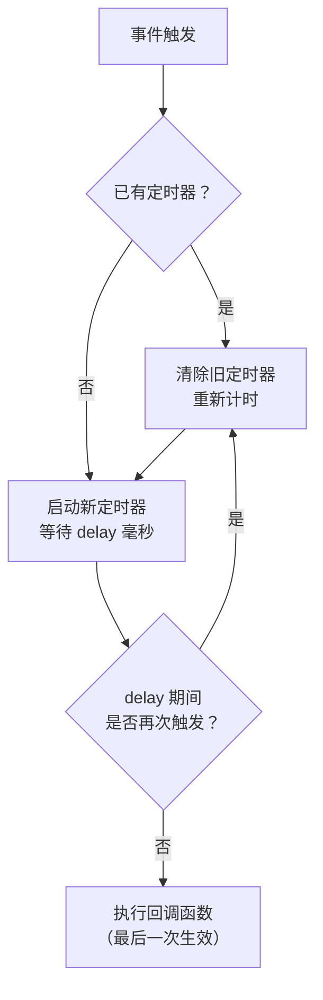
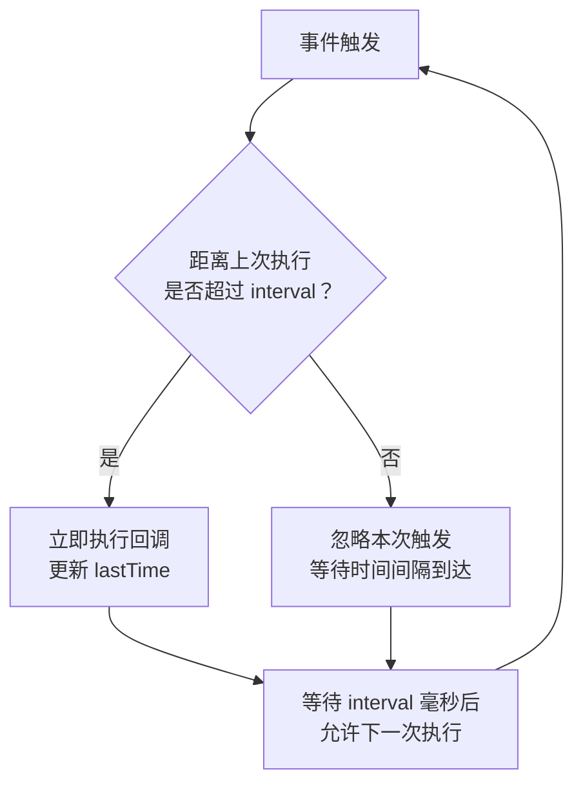

# 03-常用API与手写原理

> 模块：02-javascript-core（第2周 JavaScript 核心）
> 难度：★★★ 面试高频
> 前置知识：掌握 JavaScript 基本语法、原型、this、闭包

---

## 一、防抖（Debounce）与节流（Throttle）

### 1.1 核心概念

**防抖**和**节流**都是优化高频事件触发性能的手段，但策略不同：

- **防抖（Debounce）**：在事件触发后等待一段时间，如果期间事件再次触发，则重新计时。只有**最后一次触发**生效。
- **节流（Throttle）**：在固定时间间隔内，事件**只执行一次**。无论触发多频繁，按固定频率执行。

### 1.2 底层原理与手写实现

#### 防抖（Debounce）

```javascript
/**
 * 防抖函数
 * @param {Function} fn - 需要防抖的函数
 * @param {number} delay - 延迟时间（毫秒）
 * @param {boolean} immediate - 是否立即执行
 * @returns {Function} 防抖后的函数
 */
function debounce(fn, delay = 300, immediate = false) {
  let timer = null;
  
  return function (...args) {
    const context = this;
    
    // 如果定时器存在，清除重新计时
    if (timer) clearTimeout(timer);
    
    if (immediate) {
      // 立即执行模式：第一次触发立即执行，之后在 delay 内不再执行
      const callNow = !timer;
      timer = setTimeout(() => {
        timer = null;
      }, delay);
      if (callNow) fn.apply(context, args);
    } else {
      // 延迟执行模式：最后一次触发后 delay 毫秒执行
      timer = setTimeout(() => {
        fn.apply(context, args);
        timer = null;
      }, delay);
    }
  };
}

// 使用示例
const handleInput = debounce((e) => {
  console.log('搜索:', e.target.value);
}, 500);

// 适用场景：搜索框输入、窗口 resize、按钮防止重复点击
```

#### 节流（Throttle）

```javascript
/**
 * 节流函数（时间戳版本）
 * @param {Function} fn - 需要节流的函数
 * @param {number} interval - 时间间隔（毫秒）
 * @returns {Function} 节流后的函数
 */
function throttle(fn, interval = 300) {
  let lastTime = 0;
  
  return function (...args) {
    const now = Date.now();
    if (now - lastTime >= interval) {
      lastTime = now;
      fn.apply(this, args);
    }
  };
}

/**
 * 节流函数（定时器版本，保证最后一次也执行）
 */
function throttleTimer(fn, interval = 300) {
  let timer = null;
  
  return function (...args) {
    const context = this;
    if (!timer) {
      timer = setTimeout(() => {
        fn.apply(context, args);
        timer = null;
      }, interval);
    }
  };
}

// 适用场景：滚动事件、鼠标移动、页面 resize
```

### 1.3 防抖 vs 节流 对比

| 对比维度 | 防抖（Debounce） | 节流（Throttle） |
|---------|-----------------|-----------------|
| 核心策略 | 重新计时，最后一次生效 | 固定频率，按时间间隔执行 |
| 执行次数 | 高频触发只执行一次 | 高频触发按固定间隔执行 |
| 典型场景 | 搜索框输入、表单验证、按钮防重复 | 滚动加载、鼠标拖拽、resize |
| 用户体验 | 等待用户操作完成 | 持续反馈 |

### 1.4 避坑指南

| 常见错误 | 现象 | 原因 | 解决方案 |
|---------|------|------|---------|
| 防抖和节流选错场景 | 搜索框每次输入都发请求 | 将节流用于搜索框 | 搜索框用防抖，滚动事件用节流 |
| 防抖函数中 this 丢失 | 回调函数中 this 为 undefined | 未绑定 this 上下文 | 保存 this 并使用 apply/call |
| 节流导致最后一次操作丢失 | 用户停止滚动后未加载最后数据 | 时间戳版本不保证最后一次执行 | 使用定时器版节流 |

**防抖与节流执行流程对比图：**

**防抖（Debounce）执行流程：**



> 防抖的核心逻辑是"每次触发都重置计时器"，只有事件停止触发超过 `delay` 毫秒后才执行回调。适用于搜索框输入等"等待用户操作完成"的场景。

**节流（Throttle）执行流程：**



> 节流的核心逻辑是"固定间隔检查"，每次触发时判断距离上次执行是否超过 `interval`，超过则执行，否则忽略。适用于滚动事件等"需要持续反馈"的场景。


> 📖 **参考链接**：
> - [MDN - setTimeout](https://developer.mozilla.org/zh-CN/docs/Web/API/setTimeout)
> - [MDN - window.requestAnimationFrame](https://developer.mozilla.org/zh-CN/docs/Web/API/Window/requestAnimationFrame)

---

## 二、深浅拷贝

### 2.1 核心概念

- **浅拷贝**（Shallow Copy）：只复制对象的第一层属性。如果属性是引用类型，则复制的是引用地址，原对象和副本共享同一个引用。
- **深拷贝**（Deep Copy）：递归复制对象的所有层级，创建完全独立的对象副本，修改副本不会影响原对象。

### 2.2 底层原理与手写实现

#### 浅拷贝实现

```javascript
// 方式1：Object.assign
const shallow1 = Object.assign({}, source);

// 方式2：展开运算符
const shallow2 = { ...source };

// 方式3：数组 slice/concat
const arrCopy = sourceArr.slice();

// 浅拷贝的局限性
const obj = { a: 1, b: { c: 2 } };
const copy = { ...obj };
copy.b.c = 999;
console.log(obj.b.c); // 999（原对象被修改！）
```

#### 深拷贝实现

```javascript
// 方式1：JSON 序列化（最简单但有局限性）
const deep1 = JSON.parse(JSON.stringify(source));

// JSON 方式的局限性：
// - 无法处理函数（被忽略）
// - 无法处理 undefined（被忽略）
// - 无法处理 Symbol（被忽略）
// - 无法处理 Date（转为字符串）
// - 无法处理 RegExp（转为空对象 {}）
// - 无法处理循环引用（直接报错）
// - 无法处理 Map/Set

// 方式2：手写递归深拷贝（处理循环引用、Date、RegExp、Map、Set）
function deepClone(obj, hash = new WeakMap()) {
  // null 和基本类型直接返回
  if (obj === null || typeof obj !== 'object') return obj;
  
  // 处理 Date
  if (obj instanceof Date) return new Date(obj);
  
  // 处理 RegExp
  if (obj instanceof RegExp) return new RegExp(obj);
  
  // 处理循环引用
  if (hash.has(obj)) return hash.get(obj);
  
  // 处理 Map
  if (obj instanceof Map) {
    const mapClone = new Map();
    hash.set(obj, mapClone);
    obj.forEach((value, key) => {
      mapClone.set(deepClone(key, hash), deepClone(value, hash));
    });
    return mapClone;
  }
  
  // 处理 Set
  if (obj instanceof Set) {
    const setClone = new Set();
    hash.set(obj, setClone);
    obj.forEach(value => {
      setClone.add(deepClone(value, hash));
    });
    return setClone;
  }
  
  // 处理数组和普通对象
  const cloneObj = Array.isArray(obj) ? [] : {};
  hash.set(obj, cloneObj);
  
  // 处理 Symbol 类型的 key
  Reflect.ownKeys(obj).forEach(key => {
    cloneObj[key] = deepClone(obj[key], hash);
  });
  
  return cloneObj;
}

// 测试
const test = {
  name: 'test',
  date: new Date(),
  reg: /test/gi,
  map: new Map([['key', 'value']]),
  set: new Set([1, 2, 3]),
  fn: function () { return 'hello'; },
  arr: [1, 2, { nested: true }],
};
test.self = test; // 循环引用

const cloned = deepClone(test);
console.log(cloned.name);      // 'test'
console.log(cloned.date);      // Date 对象
console.log(cloned.reg);       // RegExp 对象
console.log(cloned.map);       // Map 对象
console.log(cloned.self === cloned); // true（循环引用正确处理）
```

### 2.3 避坑指南

| 常见错误 | 现象 | 原因 | 解决方案 |
|---------|------|------|---------|
| 使用 JSON 方式深拷贝含函数的对象 | 函数丢失 | JSON 不支持函数序列化 | 使用手写递归深拷贝 |
| 深拷贝遇到循环引用导致栈溢出 | RangeError 错误 | 无限递归 | 使用 WeakMap 记录已拷贝对象 |
| 误以为 Object.assign 是深拷贝 | 修改嵌套属性影响原对象 | 只拷贝第一层 | 使用递归深拷贝 |
| 深拷贝丢失 Symbol 属性 | Symbol 属性丢失 | Object.keys 不遍历 Symbol | 使用 Reflect.ownKeys |

> 📖 **参考链接**：
> - [MDN - structuredClone](https://developer.mozilla.org/zh-CN/docs/Web/API/structuredClone)
> - [MDN - JSON](https://developer.mozilla.org/zh-CN/docs/Web/JavaScript/Reference/Global_Objects/JSON)

---

## 三、数组去重

### 3.1 核心概念

数组去重是前端开发中的常见需求，有多种实现方案，各有优劣。选择合适的方案取决于数据类型和对性能的要求。

### 3.2 多种方案对比

```javascript
const arr = [1, 2, 2, 3, 3, NaN, NaN, {}, {}, null, null, undefined, undefined];

// 方案1：Set（最简洁，推荐）
const unique1 = [...new Set(arr)];
// 优点：简洁高效；缺点：无法去重对象（引用不同），NaN 可以正确去重

// 方案2：filter + indexOf
const unique2 = arr.filter((item, index) => arr.indexOf(item) === index);
// 缺点：NaN 无法去重（indexOf 对 NaN 始终返回 -1），时间复杂度 O(n²)

// 方案3：Map（最强大，能处理 NaN）
function uniqueByMap(arr) {
  const map = new Map();
  return arr.filter(item => !map.has(item) && map.set(item, true));
}
// 优点：能处理 NaN；缺点：代码稍长

// 方案4：reduce + includes
const unique4 = arr.reduce((acc, cur) => {
  return acc.includes(cur) ? acc : [...acc, cur];
}, []);
// 优点：语义清晰；缺点：includes 能处理 NaN，但时间复杂度 O(n²)

// 方案5：对象属性去重（适用于基本类型）
function uniqueByObject(arr) {
  const seen = {};
  return arr.filter(item => {
    const key = typeof item + JSON.stringify(item);
    return seen[key] ? false : (seen[key] = true);
  });
}
// 优点：速度快；缺点：对于对象来说 JSON.stringify 可能不可靠（因为对象属性枚举顺序在 ES2015 后大部分有序，但跨引擎行为可能不一致，且新增属性后顺序会变化，导致 JSON.stringify 结果不稳定）

// 方案6：对象数组按属性去重
function uniqueByProperty(arr, key) {
  const seen = new Set();
  return arr.filter(item => {
    const value = item[key];
    if (seen.has(value)) return false;
    seen.add(value);
    return true;
  });
}
```

### 3.3 方案对比总结

| 方案 | 时间复杂度 | NaN 处理 | 对象去重 | 推荐场景 |
|------|-----------|---------|---------|---------|
| Set | O(n) | 正确 | 按引用 | 基本类型数组去重（首选） |
| filter + indexOf | O(n²) | 错误 | 按引用 | 不推荐 |
| Map | O(n) | 正确 | 按引用 | 需要兼容 NaN 时 |
| reduce + includes | O(n²) | 正确 | 按引用 | 小数组，语义优先 |
| 对象属性 | O(n) | 需处理 | 可自定义 | 需要自定义去重逻辑 |

> 📖 **参考链接**：
> - [MDN - Array](https://developer.mozilla.org/zh-CN/docs/Web/JavaScript/Reference/Global_Objects/Array)
> - [MDN - Array.prototype.map()](https://developer.mozilla.org/zh-CN/docs/Web/JavaScript/Reference/Global_Objects/Array/map)
> - [MDN - Array.prototype.reduce()](https://developer.mozilla.org/zh-CN/docs/Web/JavaScript/Reference/Global_Objects/Array/reduce)

---

## 四、函数柯里化（Currying）

### 4.1 核心概念

**函数柯里化**（Currying）是将一个接受多个参数的函数，转换成一系列每次只接受一个参数的函数的技术。核心思想是**利用闭包保存已传入的参数**，等参数收集完毕后执行原函数。

### 4.2 底层原理与手写实现

```javascript
/**
 * 通用柯里化函数
 * @param {Function} fn - 需要柯里化的函数
 * @returns {Function} 柯里化后的函数
 */
function curry(fn) {
  return function curried(...args) {
    // 参数数量足够时，直接执行原函数
    if (args.length >= fn.length) {
      return fn.apply(this, args);
    }
    // 参数不足时，返回一个新函数继续收集参数
    return function (...nextArgs) {
      return curried.apply(this, [...args, ...nextArgs]);
    };
  };
}

// 使用示例
const add = (a, b, c) => a + b + c;
const curriedAdd = curry(add);

console.log(curriedAdd(1)(2)(3));  // 6
console.log(curriedAdd(1, 2)(3));  // 6
console.log(curriedAdd(1)(2, 3));  // 6
console.log(curriedAdd(1, 2, 3));  // 6

// 实战：无限累加器
function sum(...args) {
  const total = args.reduce((a, b) => a + b, 0);
  
  function adder(...nextArgs) {
    if (nextArgs.length === 0) return total;
    return sum(...args, ...nextArgs);
  }
  
  return adder;
}

console.log(sum(1)(2)(3)(4)()); // 10
console.log(sum(1, 2)(3, 4)()); // 10
```

### 4.3 实战应用

```javascript
// 1. 参数复用
const multiply = (a, b) => a * b;
const double = curry(multiply)(2);
console.log(double(5)); // 10
console.log(double(10)); // 20

// 2. 延迟执行
const log = (date, type, message) => {
  console.log(`[${date}] ${type}: ${message}`);
};
const todayLog = curry(log)('2026-01-01');
const todayError = todayLog('ERROR');
todayError('服务器连接失败'); // [2026-01-01] ERROR: 服务器连接失败

// 3. 函数组合
const compose = (...fns) => (x) => fns.reduceRight((v, f) => f(v), x);
const pipe = (...fns) => (x) => fns.reduce((v, f) => f(v), x);
```

> 📖 **参考链接**：
> - [MDN - Function.prototype.bind()](https://developer.mozilla.org/zh-CN/docs/Web/JavaScript/Reference/Global_Objects/Function/bind)
> - [MDN - 闭包](https://developer.mozilla.org/zh-CN/docs/Web/JavaScript/Closures)

---

## 五、继承实现

### 5.1 核心概念

JavaScript 的继承本质上是**原型链**的扩展。ES5 和 ES6 提供了多种继承方式，各有优劣。

### 5.2 五种继承方式

```javascript
// 1. 原型链继承
function Parent() {
  this.colors = ['red', 'blue'];
}
Parent.prototype.getColors = function () {
  return this.colors;
};

function Child() {}
Child.prototype = new Parent();

// 问题：所有实例共享引用类型属性，无法向父类构造函数传参

// 2. 构造函数继承（借用构造函数）
function Child2(name) {
  Parent.call(this);
  this.name = name;
}
// 问题：无法继承父类原型上的方法

// 3. 组合继承（原型链 + 构造函数）
function Child3(name) {
  Parent.call(this); // 第二次调用 Parent
  this.name = name;
}
Child3.prototype = new Parent(); // 第一次调用 Parent
Child3.prototype.constructor = Child3;
// 问题：父类构造函数被调用两次

// 4. 寄生组合继承（最优方案）
function Child4(name) {
  Parent.call(this);
  this.name = name;
}
Child4.prototype = Object.create(Parent.prototype);
Child4.prototype.constructor = Child4;
// 优点：只调用一次父类构造函数，原型链正确

// 5. ES6 class extends（语法糖）
class Animal {
  constructor(name) {
    this.name = name;
  }
  
  speak() {
    console.log(`${this.name} 发出声音`);
  }
}

class Dog extends Animal {
  constructor(name, breed) {
    super(name); // 必须先调用 super
    this.breed = breed;
  }
  
  speak() {
    super.speak();
    console.log(`${this.name} 汪汪叫`);
  }
}

const dog = new Dog('旺财', '金毛');
dog.speak();
// 输出：
// 旺财 发出声音
// 旺财 汪汪叫
```

### 5.3 继承方式对比

| 继承方式 | 原型方法 | 实例属性 | 传参 | 父类调用次数 | 推荐度 |
|---------|---------|---------|------|-----------|--------|
| 原型链继承 | 继承 | 共享引用 | 不支持 | 1 | 低 |
| 构造函数继承 | 不继承 | 独立 | 支持 | 1 | 低 |
| 组合继承 | 继承 | 独立 | 支持 | 2 | 中 |
| 寄生组合继承 | 继承 | 独立 | 支持 | 1 | 高 |
| ES6 class | 继承 | 独立 | 支持 | 1 | 最高 |

---

## 六、JavaScript 垃圾回收

### 6.1 核心概念

**垃圾回收**（Garbage Collection, GC）是 JavaScript 引擎自动管理内存的机制。开发者不需要手动分配和释放内存。主要算法有两种：

- **引用计数**：跟踪每个值的引用次数，引用数为 0 时回收。无法处理循环引用。
- **标记清除**：从根对象（全局对象）出发，标记所有可达对象，清除未标记的对象。现代 JavaScript 引擎均使用此算法。

### 6.2 底层原理

#### V8 分代回收

V8 引擎将内存分为**新生代**（Young Generation）和**老生代**（Old Generation）：

| 分代 | 特点 | 算法 | 触发条件 |
|------|------|------|---------|
| 新生代 | 存储生命周期短的对象，1-8MB | **Scavenge**（Cheney 算法），复制存活对象到另一半空间 | 空间快满时触发 |
| 老生代 | 存储生命周期长的对象 | **Mark-Sweep**（标记清除）+ **Mark-Compact**（标记整理） | 老生代空间不足时触发 |

**对象晋升**：新生代中经历过一次 Scavenge 仍存活的对象，或 To 空间使用率超过 25% 时的对象，会晋升到老生代。

### 6.3 实战应用

```javascript
// 避免内存泄漏的实践

// 1. 及时清除定时器
let timer = setInterval(() => { /* ... */ }, 1000);
// 不再需要时
clearInterval(timer);
timer = null;

// 2. 移除事件监听
const handler = () => { /* ... */ };
element.addEventListener('click', handler);
// 组件销毁时
element.removeEventListener('click', handler);

// 3. 避免意外的全局变量
function badPractice() {
  leakedVar = '我会成为全局变量'; // 缺少 let/const/var
}
// 正确做法
function goodPractice() {
  const localVar = '我是局部变量';
}

// 4. 解除 DOM 引用
const elements = {
  button: document.getElementById('myButton'),
};
// 即使 DOM 元素从页面移除，elements.button 仍然持有引用
// 不再需要时
elements.button = null;
```

---

## 七、内存泄漏场景

### 7.1 常见内存泄漏场景

| 泄漏场景 | 原因 | 示例 | 解决方案 |
|---------|------|------|---------|
| 全局变量 | 全局变量不会被 GC 回收 | `window.data = largeData` | 避免使用全局变量，使用 let/const |
| 未清理的定时器 | 定时器持有回调函数引用 | `setInterval` 未 clear | 组件销毁时清除定时器 |
| 闭包不当使用 | 闭包保留了外部函数的整个作用域 | 闭包引用大对象但只使用其中一小部分 | 用完后将引用置为 null |
| DOM 引用 | JavaScript 引用已移除的 DOM 元素 | 变量保存了 DOM 引用 | 移除 DOM 后同步清除 JS 引用 |
| 事件监听未移除 | 事件监听器持有函数引用 | addEventListener 未 remove | 组件销毁时移除所有监听器 |
|  detached DOM 树 | JS 引用了 DOM 节点但该节点已从 DOM 树移除 | 父节点被移除但子节点引用仍在 | 避免缓存 DOM 引用 |
| WebSocket/EventSource 未关闭 | 长连接持有引用 | 页面切换后 WebSocket 未关闭 | 页面离开时关闭连接 |

### 7.2 内存泄漏排查

```javascript
// 使用 Chrome DevTools 排查内存泄漏

// 1. Performance 面板：录制内存使用情况，观察是否存在持续上升的内存曲线
// 2. Memory 面板：
//    - Heap Snapshot：对比操作前后的堆快照，查找未释放的对象
//    - Allocation instrumentation on timeline：记录内存分配时间线
//    - Allocation sampling：按函数采样内存分配

// 3. Performance Monitor：实时监控 JS Heap Size、DOM Nodes 等指标

// 使用 WeakMap/WeakSet 避免内存泄漏
// WeakMap 的键是弱引用，不会阻止垃圾回收
const wm = new WeakMap();
let element = document.getElementById('app');
wm.set(element, { data: 'some data' });
element = null; // WeakMap 中的条目可以被 GC 回收
```

### 7.3 避坑指南

| 常见错误 | 现象 | 原因 | 解决方案 |
|---------|------|------|---------|
| 在 SPA 页面切换后内存持续增长 | 页面越来越卡 | 组件销毁时未清理副作用 | 在 useEffect/componentWillUnmount 中清理 |
| console.log 大对象导致内存泄漏 | 内存占用异常 | console 保留对象引用 | 生产环境移除 console.log |
| 闭包引用整个外部作用域 | 大对象无法被回收 | 闭包保存了整个作用域链 | 只保留需要的变量引用 |
| 使用普通 Map 存储 DOM 关联数据 | DOM 移除后数据仍在 | Map 的键是强引用 | 使用 WeakMap 替换 |

---

> **学习导航**：
> - 返回 [学习路线总览](../README.md)
> - 上一章：[02-异步编程与ES6+特性](./02-异步编程与ES6+特性.md)
> - 本模块上一篇：[01-语法基础与执行机制](./01-语法基础与执行机制.md)
> - 本模块后续：[04-JavaScript核心笔面试题集](./04-JavaScript核心笔面试题集.md)
> - 实战应用：[企业后台管理系统](../10-project/01-企业后台管理系统实战.md)

---

## 本章学习自检

- [ ] 能手写防抖函数（含立即执行选项）
- [ ] 能手写节流函数（时间戳版和定时器版）
- [ ] 能清晰区分防抖和节流的适用场景
- [ ] 能手写递归深拷贝（处理循环引用、Date、RegExp、Map、Set）
- [ ] 能列举 JSON 深拷贝的至少 5 个局限性
- [ ] 能用至少 3 种方案实现数组去重
- [ ] 能手写通用柯里化函数并理解其原理
- [ ] 能写出 5 种继承方式的完整代码
- [ ] 能解释寄生组合继承为何是最优方案
- [ ] 能解释 V8 分代回收的机制
- [ ] 能列举至少 5 种常见内存泄漏场景及解决方案
- [ ] 能解释 WeakMap 为何适合存储 DOM 关联数据
- [ ] 能手写简化版 EventEmitter 类
- [ ] 能区分纯函数与非纯函数并举例说明
- [ ] 能理解 compose 与 pipe 的函数组合思想
- [ ] 能区分声明式与命令式编程风格

---

## 补充：EventEmitter 模式与函数式编程

### 1. EventEmitter 模式（发布-订阅）

#### 1.1 核心概念

**EventEmitter** 是**发布-订阅模式**（Publish-Subscribe Pattern）的经典实现，在 Node.js 的 `events` 模块中广泛应用。其核心思想是：**事件发布者（Publisher）与事件消费者（Subscriber）之间通过事件名称进行解耦**，发布者只管触发事件，不需要知道谁在监听。

EventEmitter 提供的核心 API：

| API | 功能 | 说明 |
|-----|------|------|
| `on(event, listener)` | 注册事件监听 | 同一事件可注册多个监听函数，按注册顺序依次执行 |
| `emit(event, ...args)` | 触发事件 | 将参数传递给所有注册的监听函数 |
| `once(event, listener)` | 单次监听 | 监听函数执行一次后自动移除 |
| `removeListener(event, listener)` | 移除指定监听 | 移除指定事件的某个监听函数 |
| `removeAllListeners(event)` | 移除全部监听 | 移除指定事件的所有监听函数（不传参数则移除所有事件） |

#### 1.2 底层原理与手写实现

下面是一个简化版的 EventEmitter 类实现，用于教学说明发布-订阅模式的核心原理（与笔试题集中的完整手写题不同，此处侧重教学拆解）：

```javascript
/**
 * 简化版 EventEmitter 实现
 * 用于理解发布-订阅模式的核心原理
 */
class EventEmitter {
  constructor() {
    // 存储事件与监听函数列表的映射关系
    // 结构: { eventName: [ { fn, once }, ... ] }
    this._events = Object.create(null);
  }

  /**
   * 注册事件监听
   * @param {string} event - 事件名称
   * @param {Function} listener - 监听函数
   * @param {boolean} once - 是否只监听一次
   */
  _addListener(event, listener, once = false) {
    if (!this._events[event]) {
      this._events[event] = [];
    }
    this._events[event].push({ fn: listener, once });
    return this;
  }

  on(event, listener) {
    return this._addListener(event, listener, false);
  }

  once(event, listener) {
    return this._addListener(event, listener, true);
  }

  /**
   * 触发事件
   * @param {string} event - 事件名称
   * @param {...any} args - 传递给监听函数的参数
   */
  emit(event, ...args) {
    const listeners = this._events[event];
    if (!listeners || listeners.length === 0) return false;

    // 拷贝一份再遍历，避免在回调中修改监听列表导致遍历异常
    const listenersCopy = [...listeners];

    for (const item of listenersCopy) {
      item.fn.apply(this, args);

      // 如果是一次性监听，执行后从原始列表中移除
      if (item.once) {
        this.removeListener(event, item.fn);
      }
    }
    return true;
  }

  /**
   * 移除指定监听函数
   * 注意：需要匹配的是同一个函数引用
   */
  removeListener(event, listener) {
    const listeners = this._events[event];
    if (!listeners) return this;

    const index = listeners.findIndex(item => item.fn === listener);
    if (index !== -1) {
      listeners.splice(index, 1);
    }
    return this;
  }

  /**
   * 移除指定事件的所有监听函数
   * 不传 event 则清空所有事件
   */
  removeAllListeners(event) {
    if (event) {
      delete this._events[event];
    } else {
      this._events = Object.create(null);
    }
    return this;
  }
}

// 使用示例
const emitter = new EventEmitter();

// 注册普通监听
emitter.on('data', (msg) => {
  console.log('收到数据:', msg);
});

// 注册单次监听
emitter.once('ready', () => {
  console.log('初始化完成（只触发一次）');
});

emitter.emit('data', 'Hello');   // 输出: 收到数据: Hello
emitter.emit('ready');           // 输出: 初始化完成（只触发一次）
emitter.emit('ready');           // 无输出（已自动移除）
```

#### 1.3 使用场景

| 场景 | 说明 | 示例 |
|------|------|------|
| 组件间通信 | 非父子组件之间的数据传递 | Vue 2.x 的 `$on` / `$emit` / `$off`，React 中的事件总线 |
| 事件总线（EventBus） | 全局事件的发布与订阅 | 跨模块通信、全局状态变更通知 |
| Node.js 内置模块 | 大量 Node.js 核心模块基于 EventEmitter | `http.Server`、`fs.ReadStream`、`process` 等 |
| 自定义事件系统 | 第三方库或框架中的事件机制 | WebSocket 消息分发、游戏引擎中的事件系统 |

#### 1.4 与 DOM 事件的区别

| 对比维度 | EventEmitter | DOM 事件 |
|---------|-------------|---------|
| 事件传播 | 直接触发对应的监听函数，无传播过程 | 有捕获阶段、目标阶段、冒泡阶段 |
| 事件委托 | 不支持，监听器绑定在实例上 | 支持事件委托（利用冒泡机制） |
| 默认行为 | 无默认行为概念 | 可调用 `preventDefault()` 阻止默认行为 |
| 运行环境 | 主要在 Node.js 中使用，浏览器也可使用 | 仅限于浏览器环境 |
| 设计目的 | 解耦代码模块，实现异步通信 | 处理用户交互（点击、键盘、滚动等） |

> 📖 **参考链接**：
> - [MDN - EventTarget](https://developer.mozilla.org/zh-CN/docs/Web/API/EventTarget)
> - [MDN - Event](https://developer.mozilla.org/zh-CN/docs/Web/API/Event)

---

### 2. 函数式编程基础

#### 2.1 纯函数（Pure Function）

**纯函数**是函数式编程的基石，必须满足两个条件：
1. **相同输入始终产生相同输出**：不依赖任何外部可变状态，返回值仅由输入参数决定。
2. **无副作用**：不修改外部状态，不修改入参，不进行 I/O 操作等。

```javascript
// ===== 纯函数 vs 非纯函数对比 =====

// 非纯函数示例
let count = 0;
function impureIncrement() {
  count++;              // 修改了外部状态（副作用）
  return count;         // 返回值依赖外部变量 count
}
// 问题：相同调用 impureIncrement() 每次返回不同结果，不可预测

// 纯函数示例
function pureIncrement(num) {
  return num + 1;       // 仅依赖输入参数，不修改外部状态
}
// 优势：pureIncrement(5) 永远返回 6，完全可预测、可测试

// 非纯函数：修改了入参
function impureAddItem(arr, item) {
  arr.push(item);       // 直接修改了原数组！（副作用）
  return arr;
}
const original = [1, 2, 3];
impureAddItem(original, 4);
console.log(original);  // [1, 2, 3, 4] — 原数组被修改了

// 纯函数：返回新数组
function pureAddItem(arr, item) {
  return [...arr, item]; // 不修改原数组，返回新数组
}
const original2 = [1, 2, 3];
const newArr = pureAddItem(original2, 4);
console.log(original2); // [1, 2, 3] — 原数组不变
console.log(newArr);    // [1, 2, 3, 4]
```

#### 2.2 不可变性（Immutability）

**不可变性**是指数据一旦创建就不能被修改。如果需要变更，则创建一个新的数据副本。在 JavaScript 中实现不可变性的常用手段：

```javascript
// 1. Object.freeze — 浅冻结，禁止修改对象属性
const config = Object.freeze({
  apiUrl: 'https://api.example.com',
  timeout: 5000,
});
// config.timeout = 3000; // 严格模式下报错，非严格模式下静默失败

// 2. 展开运算符 — 创建浅拷贝而非修改原对象
const user = { name: 'Alice', age: 25 };
const updatedUser = { ...user, age: 26 }; // 新对象，user 不变

// 3. 数组的非破坏性方法（不修改原数组）
const nums = [1, 2, 3, 4, 5];

// map: 映射转换，返回新数组
const doubled = nums.map(n => n * 2);        // [2, 4, 6, 8, 10]

// filter: 过滤筛选，返回新数组
const evens = nums.filter(n => n % 2 === 0); // [2, 4]

// reduce: 累积计算，返回单一值
const sum = nums.reduce((acc, n) => acc + n, 0); // 15

// concat: 合并数组，返回新数组
const extended = nums.concat([6, 7]);        // [1,2,3,4,5,6,7]

// 4. 数组的破坏性方法（会修改原数组）— 函数式编程中应避免
// push、pop、shift、unshift、splice、sort、reverse 等
```

#### 2.3 高阶函数（Higher-Order Function）

**高阶函数**是指满足以下至少一个条件的函数：
- 接受一个或多个函数作为参数
- 返回一个函数作为结果

JavaScript 内置的数组方法 `map`、`filter`、`reduce` 就是典型的高阶函数——它们接受一个回调函数作为参数，对数组元素进行变换。

```javascript
// 高阶函数示例：自定义一个批量处理函数
function withLogging(fn) {
  // 返回一个新函数，给原函数包裹日志功能
  return function (...args) {
    console.log(`调用函数 ${fn.name}，参数:`, args);
    const result = fn.apply(this, args);
    console.log(`返回结果:`, result);
    return result;
  };
}

const loggedAdd = withLogging((a, b) => a + b);
loggedAdd(3, 5);
// 输出:
// 调用函数 ，参数: [3, 5]
// 返回结果: 8

// 另一个例子：once — 确保函数只执行一次
function once(fn) {
  let called = false;
  let result;
  return function (...args) {
    if (!called) {
      called = true;
      result = fn.apply(this, args);
    }
    return result;
  };
}
```

#### 2.4 函数组合：compose 与 pipe

函数组合是函数式编程的核心思想——**将多个小函数组合成一个新函数，数据依次流经每个函数进行变换**。

在本文第四章（函数柯里化）中已经给出了 `compose` 和 `pipe` 的实现代码（见 [实战应用](#43-实战应用) 第 3 点），此处不再重复。下面重点说明它们的概念和使用场景：

- **`compose`**：从右到左执行函数组合。`compose(f, g, h)(x)` 等价于 `f(g(h(x)))`，数据先经过 `h`，再经过 `g`，最后经过 `f`。
- **`pipe`**：从左到右执行函数组合。`pipe(f, g, h)(x)` 等价于 `h(g(f(x)))`，数据按书写顺序依次流经各个函数，更符合直觉的阅读顺序。

```javascript
// 基于已有的 compose 和 pipe 的使用示例

// 场景：处理用户输入字符串
const trim = (str) => str.trim();
const toLowerCase = (str) => str.toLowerCase();
const removeSpaces = (str) => str.replace(/\s+/g, '-');

// compose: 从右到左执行
// removeSpaces -> toLowerCase -> trim
const sanitizeWithCompose = compose(removeSpaces, toLowerCase, trim);
console.log(sanitizeWithCompose('  Hello World  ')); // "hello-world"

// pipe: 从左到右执行（阅读顺序更直观）
// trim -> toLowerCase -> removeSpaces
const sanitizeWithPipe = pipe(trim, toLowerCase, removeSpaces);
console.log(sanitizeWithPipe('  Hello World  ')); // "hello-world"

// 函数组合的核心价值：
// 1. 每个函数只做一件事，职责单一
// 2. 通过组合现有函数创建新功能，无需重复编写逻辑
// 3. 数据流清晰可追踪，易于调试和维护
```

#### 2.5 声明式 vs 命令式编程

函数式编程推崇**声明式**风格，与传统的**命令式**风格形成鲜明对比：

```javascript
const numbers = [1, 2, 3, 4, 5, 6, 7, 8, 9, 10];

// ===== 命令式编程 =====
// 强调"如何做"：一步步告诉计算机执行步骤
function getEvenDoubledImperative(arr) {
  const result = [];
  for (let i = 0; i < arr.length; i++) {
    if (arr[i] % 2 === 0) {
      result.push(arr[i] * 2);
    }
  }
  return result;
}
console.log(getEvenDoubledImperative(numbers)); // [4, 8, 12, 16, 20]

// ===== 声明式编程 =====
// 强调"做什么"：描述想要的结果，不关心内部实现细节
function getEvenDoubledDeclarative(arr) {
  return arr
    .filter(n => n % 2 === 0)  // 筛选偶数
    .map(n => n * 2);           // 翻倍
}
console.log(getEvenDoubledDeclarative(numbers)); // [4, 8, 12, 16, 20]
```

| 对比维度 | 命令式编程 | 声明式编程 |
|---------|-----------|-----------|
| 关注点 | **如何做**（How） | **做什么**（What） |
| 代码风格 | 逐步指令，手动控制流程 | 表达意图，组合已有抽象 |
| 可读性 | 需要跟踪每一步状态变化 | 语义清晰，一目了然 |
| 可维护性 | 修改逻辑需要调整流程控制 | 增删变换步骤即可 |
| 副作用 | 通常有中间变量和状态变更 | 函数式风格下无副作用 |
| 典型代码 | `for` 循环、`if-else` 分支、手动变量累积 | `map`、`filter`、`reduce` 链式调用 |

**函数式编程的核心价值总结：**

1. **可预测性**：纯函数保证相同输入始终产生相同输出，易于测试和调试。
2. **可维护性**：每个函数职责单一、无副作用，修改一处不影响其他地方。
3. **可组合性**：通过 compose/pipe 将小函数组合成复杂逻辑，代码复用率极高。
4. **并发友好**：无共享状态、无副作用，天然适合并行执行，无需担心竞态条件。