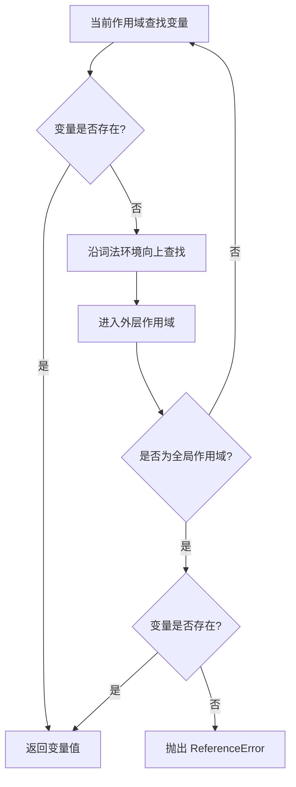
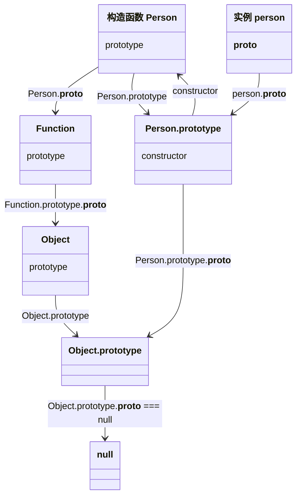

# JavaScript 核心笔面试题集

> 模块：02-javascript-core（第2周 JavaScript 核心）
> 覆盖：原型链、闭包、this、事件循环、Promise、async/await、ES6+
> 题量：20 道选择题 + 15 道简答题 + 10 道编程题
> 难度标注：★基础  ★★中档  ★★★拔高

---

## 一、选择题（20 题，每题附解析）

### 1. ★ typeof null 的结果是？

A. `"null"`
B. `"object"`
C. `"undefined"`
D. `"boolean"`

**答案：B**

**解析**：这是 JavaScript 自诞生以来就存在的历史遗留 bug。在 JavaScript 最初的实现中，值以类型标签 + 实际值的方式存储，对象的类型标签是 `0`，而 `null` 被表示为全零（即 NULL 指针），因此 `typeof null` 返回 `"object"`。这个 bug 因为修复会导致大量现有代码崩溃，所以一直保留至今。

---

**作用域链查找流程图：**



> 作用域链是 JavaScript 查找变量的核心机制：从当前作用域开始，沿词法环境逐级向外层查找，直至全局作用域。若全局作用域仍不存在该变量，则抛出 ReferenceError。

### 2. ★ let 和 var 的区别不包括？

A. let 有块级作用域，var 没有
B. let 存在暂时性死区，var 没有
C. let 可以重复声明，var 不可以
D. let 声明的全局变量不会成为 window 属性

**答案：C**

**解析**：恰恰相反，`let` **不允许**重复声明，`var` **允许**重复声明。A、B、D 均为正确描述。

---

### 3. ★ 以下哪个不是基本数据类型？

A. `string`
B. `number`
C. `Object`
D. `undefined`

**答案：C**

**解析**：JavaScript 有 7 种基本数据类型：`string`、`number`、`boolean`、`null`、`undefined`、`symbol`（ES6）、`bigint`（ES2020）。`Object` 是引用类型，不属于基本数据类型。

---

### 4. ★★ 以下代码输出什么？

```javascript
console.log([1, 2, 3].map(parseInt));
```

A. `[1, 2, 3]`
B. `[1, NaN, NaN]`
C. `[1, NaN, 3]`
D. `[NaN, NaN, NaN]`

**答案：B**

**解析**：`map` 的回调函数会接收三个参数：`(item, index, array)`。`parseInt` 接受两个参数：`(string, radix)`（字符串和进制）。因此实际调用为：

- `parseInt('1', 0)` -- radix 为 0 按十进制处理，返回 `1`
- `parseInt('2', 1)` -- radix 为 1 不合法，返回 `NaN`
- `parseInt('3', 2)` -- 二进制中不存在 '3'，返回 `NaN`

---

### 5. ★★ 以下关于闭包的说法错误的是？

A. 闭包可以让外部访问函数内部的变量
B. 闭包会导致内存泄漏，不应该使用
C. 闭包可以用来实现数据私有化
D. 闭包是函数和其词法环境的组合

**答案：B**

**解析**：闭包**不一定**导致内存泄漏。闭包确实会保留外部函数的变量，但如果这是有意的行为（如数据私有化、模块模式），则属于正常使用。只有在闭包引用了不再需要的变量且无法解除引用时，才算内存泄漏。闭包是 JavaScript 的核心特性，合理使用不会导致问题。

---

### 6. ★★ 以下代码中 this 指向什么？

```javascript
const obj = {
  name: 'obj',
  foo() {
    console.log(this.name);
  },
};
obj.foo();
```

A. `window`
B. `obj`
C. `undefined`
D. `global`

**答案：B**

**解析**：`foo()` 作为 `obj` 的方法被调用，属于**隐式绑定**，`this` 指向调用该方法的对象 `obj`。

---

### 7. ★★ Promise.all 和 Promise.race 的区别

A. all 等待全部成功，race 返回第一个完成（无论成功/失败）
B. all 返回第一个完成，race 等待全部完成
C. all 和 race 没有区别
D. all 任一失败即失败，race 全部失败才失败

**答案：A**

**解析**：`Promise.all` 等待所有 Promise 成功，任一失败则整体失败；`Promise.race` 返回第一个完成的 Promise 的结果（无论成功或失败）。

---

### 8. ★★ 以下代码输出顺序？

```javascript
setTimeout(() => console.log('a'), 0);
Promise.resolve().then(() => console.log('b'));
console.log('c');
```

A. `a b c`
B. `b c a`
C. `c b a`
D. `c a b`

**答案：C**

**解析**：执行顺序：同步代码 `console.log('c')` → 清空微任务队列 `Promise.then` 输出 `b` → 取一个宏任务 `setTimeout` 输出 `a`。

---

### 9. ★★ 以下哪个不是 ES6 新特性？

A. `let` 和 `const`
B. 箭头函数
C. 装饰器（Decorator）
D. `Promise`

**答案：C**

**解析**：装饰器（Decorator）已于 ES2025 正式成为 ECMAScript 标准，但在此之前它不属于 ES6（ES2015）特性。A、B、D 均为 ES6（ES2015）正式引入的特性。

---

### 10. ★★ WeakMap 和 Map 的主要区别

A. WeakMap 的键只能是字符串
B. WeakMap 的键是弱引用，不阻止垃圾回收
C. WeakMap 可以迭代
D. WeakMap 有 size 属性

**答案：B**

**解析**：`WeakMap` 的键必须是对象，且是**弱引用**（不会阻止垃圾回收），因此 `WeakMap` 不可迭代、没有 `size` 属性、没有 `clear()` 方法。

---

### 11. ★★★ 以下代码输出什么？

```javascript
async function async1() {
  console.log('async1 start');
  await async2();
  console.log('async1 end');
}

async function async2() {
  console.log('async2');
}

console.log('script start');
setTimeout(() => console.log('setTimeout'), 0);
async1();
new Promise((resolve) => {
  console.log('promise1');
  resolve();
}).then(() => console.log('promise2'));
console.log('script end');
```

A. `script start → async1 start → async2 → promise1 → script end → async1 end → promise2 → setTimeout`
B. `script start → async1 start → async2 → promise1 → script end → promise2 → async1 end → setTimeout`
C. `script start → async1 start → async2 → promise1 → script end → async1 end → setTimeout → promise2`
D. `script start → async1 start → async2 → promise1 → async1 end → script end → promise2 → setTimeout`

**答案：A**

**解析**：执行顺序拆解：
1. 同步代码：`script start` → `async1 start` → `async2` → `promise1` → `script end`
2. `await` 后面的代码相当于 `Promise.resolve().then(...)`，进入微任务队列
3. 微任务队列：`async1 end`（async1 中的 await 之后）→ `promise2`（.then 回调）
4. 宏任务：`setTimeout`

---

**原型链核心关系图：**



> 上图展示了 JavaScript 原型链的核心关系：每个构造函数都有一个 `prototype` 属性指向其原型对象，原型对象通过 `constructor` 指回构造函数；每个实例对象通过 `__proto__` 指向其构造函数的 `prototype`。原型链的终点是 `Object.prototype`，其 `__proto__` 为 `null`。理解 `constructor.prototype` 与 `instance.__proto__` 的关系是掌握原型链继承的关键。

### 12. ★★★ 以下关于原型链的说法正确的是？

A. `Function.__proto__ === Object.prototype`
B. `Function.__proto__ === Function.prototype`
C. `Object.__proto__ === Object.prototype`
D. `Function.prototype.__proto__ === null`

**答案：B**

**解析**：`Function` 本身就是函数，由 `Function` 构造函数创建，因此 `Function.__proto__ === Function.prototype`。其他选项：A 错误（应为 `Function.prototype`），C 错误（`Object.__proto__ === Function.prototype`），D 错误（`Function.prototype.__proto__ === Object.prototype`）。

---

### 13. ★★★ for...in 和 for...of 的区别

A. 两者没有区别
B. for...in 遍历键名，for...of 遍历键值
C. for...in 遍历键值，for...of 遍历键名
D. for...in 不能遍历对象，for...of 可以

**答案：B**

**解析**：`for...in` 遍历**可枚举属性**（包括原型链上的属性），适合遍历对象；`for...of` 遍历**可迭代对象**（实现了 `Symbol.iterator`），如数组、字符串、Map、Set，直接获取值。注意：`for...of` 不能直接遍历普通对象。

---

### 14. ★★ Object.create(null) 创建的对象有什么特点？

A. 拥有完整的原型链
B. 没有原型链，不继承 Object.prototype 的方法
C. 不能添加属性
D. 自动继承 toString 方法

**答案：B**

**解析**：`Object.create(null)` 创建的对象 `__proto__` 为 `null`，没有任何原型链，因此不继承 `toString`、`hasOwnProperty` 等 `Object.prototype` 方法。适合用作纯数据字典，避免键名冲突。

---

### 15. ★★ 以下哪个方法会修改原数组？

A. `slice`
B. `concat`
C. `splice`
D. `filter`

**答案：C**

**解析**：`splice` 会修改原数组（增删改），而 `slice`、`concat`、`filter` 会返回新数组，不修改原数组。其他会修改原数组的方法：`push`、`pop`、`shift`、`unshift`、`sort`、`reverse`。

---

### 16. ★★★ 以下代码输出什么？

```javascript
console.log(a);
let a = 1;
var b = 2;
```

A. `undefined` 然后正常执行
B. 抛出 `ReferenceError`
C. `undefined` 和 `undefined`
D. `1` 和 `2`

**答案：B**

**解析**：`let a` 存在暂时性死区（TDZ），在声明前访问会抛出 `ReferenceError: Cannot access 'a' before initialization`。代码在第一行就报错，不会继续执行。

---

### 17. ★★ Symbol 的作用和使用场景

A. Symbol 用于创建可变的唯一标识
B. Symbol 主要用于防止对象属性名冲突
C. Symbol 创建的标识可以重复
D. Symbol 等同于字符串

**答案：B**

**解析**：`Symbol` 创建的是**不可变的唯一标识**，主要用于防止对象属性名冲突。每个 `Symbol()` 调用都返回一个唯一的 Symbol 值。使用场景包括：定义私有属性、定义常量枚举、自定义 `Symbol.iterator` 等。

---

### 18. ★★★ 以下关于事件循环的说法正确的是？

A. 宏任务优先于微任务执行
B. 微任务在每次宏任务执行完毕后、下一个宏任务执行前清空
C. 微任务队列是一次性全部清空的，不会分批
D. B 和 C 都正确

**答案：D**

**解析**：事件循环的规则是：执行一个宏任务 → 清空微任务队列中的**所有**微任务（包括执行过程中新产生的微任务）→ 渲染更新（如有必要）→ 执行下一个宏任务。

---

### 19. ★★ 箭头函数和普通函数的区别

A. 箭头函数没有自己的 this，继承外层作用域的 this
B. 箭头函数不能作为构造函数
C. 箭头函数没有 arguments 对象
D. 以上都正确

**答案：D**

**解析**：箭头函数与普通函数的区别：没有自己的 `this`（继承外层）、不能用作构造函数（没有 `prototype`）、没有 `arguments` 对象（可用剩余参数代替）、不能使用 `yield`（不能作为 Generator 函数）。

---

### 20. ★★★ 以下代码输出什么？

```javascript
function Foo() {
  Foo.a = function () { console.log(1); };
  this.a = function () { console.log(2); };
}
Foo.prototype.a = function () { console.log(3); };
Foo.a = function () { console.log(4); };

Foo.a(); // ?
const obj = new Foo();
obj.a(); // ?
Foo.a(); // ?
```

A. `4, 2, 1`
B. `4, 3, 1`
C. `4, 2, 4`
D. `3, 2, 1`

**答案：A**

**解析**：
- 第一次 `Foo.a()`：`Foo.a` 当前是 `console.log(4)`，输出 `4`
- `new Foo()`：构造函数执行，`Foo.a` 被重新赋值为 `console.log(1)`，`this.a` 赋值为 `console.log(2)`（实例属性优先级高于原型属性）
- `obj.a()`：实例上找到 `a` 方法，输出 `2`
- 第二次 `Foo.a()`：`Foo.a` 已被构造函数改为 `console.log(1)`，输出 `1`

---

## 二、简答题（15 题）

### 1. ★★ 原型链是什么？如何实现继承？

**参考答案**：

原型链是 JavaScript 实现继承的核心机制。每个对象都有一个 `__proto__` 属性指向其构造函数的 `prototype`，当访问对象属性时，先在自身查找，找不到则沿着 `__proto__` 向上查找，直到 `Object.prototype`（其 `__proto__` 为 `null`），形成一条原型链。

继承实现方式：
- **寄生组合继承**（最优）：`Child.prototype = Object.create(Parent.prototype)`，只调用一次父类构造函数
- **ES6 class extends**：`class Child extends Parent`，配合 `super()` 调用父类构造函数

> 📖 **参考链接**：
> - [MDN - 继承与原型链](https://developer.mozilla.org/zh-CN/docs/Web/JavaScript/Inheritance_and_the_prototype_chain)
> - [MDN - Object.create()](https://developer.mozilla.org/zh-CN/docs/Web/JavaScript/Reference/Global_Objects/Object/create)

---

### 2. ★★ 闭包的原理和应用场景

**参考答案**：

闭包是指函数能够记住并访问其词法作用域，即使该函数在其词法作用域之外执行。原理是内部函数持有对外部函数作用域的引用，导致外部函数作用域无法被垃圾回收。

应用场景：数据私有化（封装私有变量）、函数柯里化（参数复用）、模块模式（IIFE 返回接口）、事件处理中的参数传递。

> 📖 **参考链接**：
> - [MDN - 闭包](https://developer.mozilla.org/zh-CN/docs/Web/JavaScript/Closures)

---

### 3. ★★ this 的四种绑定规则及优先级

**参考答案**：

优先级从高到低：
1. **new 绑定**：`new` 调用构造函数，this 指向新创建的实例
2. **显式绑定**：`call` / `apply` / `bind`，this 指向指定对象
3. **隐式绑定**：作为对象方法调用，this 指向调用对象
4. **默认绑定**：独立函数调用，非严格模式指向 window/global，严格模式指向 undefined

**箭头函数**比较特殊：没有自己的 this，继承外层作用域的 this，无法被 call/apply/bind 改变。

> 📖 **参考链接**：
> - [MDN - this](https://developer.mozilla.org/zh-CN/docs/Web/JavaScript/Reference/Operators/this)
> - [MDN - Function.prototype.call()](https://developer.mozilla.org/zh-CN/docs/Web/JavaScript/Reference/Global_Objects/Function/call)

---

### 4. ★★ var / let / const 的区别

**参考答案**：

| 维度 | var | let | const |
|------|------|------|------|
| 作用域 | 函数作用域 | 块级作用域 | 块级作用域 |
| 变量提升 | 提升 + 初始化为 undefined | 提升但 TDZ | 提升但 TDZ |
| 重复声明 | 允许 | 不允许 | 不允许 |
| 全局属性 | 成为 window 属性 | 不会 | 不会 |
| 初始值 | 可选 | 可选 | 必须 |

> 📖 **参考链接**：
> - [MDN - let](https://developer.mozilla.org/zh-CN/docs/Web/JavaScript/Reference/Statements/let)
> - [MDN - const](https://developer.mozilla.org/zh-CN/docs/Web/JavaScript/Reference/Statements/const)

---

### 5. ★★ Promise 的三种状态及常用方法

**参考答案**：

三种状态：`pending`（进行中）、`fulfilled`（已成功）、`rejected`（已失败）。状态一旦改变就不可逆。

常用方法：
- 实例方法：`then()`、`catch()`、`finally()`
- 静态方法：`Promise.resolve()`、`Promise.reject()`、`Promise.all()`、`Promise.allSettled()`、`Promise.race()`、`Promise.any()`

> 📖 **参考链接**：
> - [MDN - Promise](https://developer.mozilla.org/zh-CN/docs/Web/JavaScript/Reference/Global_Objects/Promise)
> - [MDN - Promise.all()](https://developer.mozilla.org/zh-CN/docs/Web/JavaScript/Reference/Global_Objects/Promise/all)

---

### 6. ★★ async/await 的原理

**参考答案**：

`async/await` 是 **Generator + Promise** 的语法糖。`async` 函数返回一个 Promise，`await` 会暂停函数执行，等待 Promise 完成。底层实现类似于 Generator 的自动执行器：`await` 相当于 `yield`，执行器自动调用 `next()` 并处理 Promise 的结果。

`async` 函数中 `return` 的值会被 `Promise.resolve()` 包装，`throw` 的错误会被转为 `Promise.reject()`。

> 📖 **参考链接**：
> - [MDN - async function](https://developer.mozilla.org/zh-CN/docs/Web/JavaScript/Reference/Statements/async_function)
> - [MDN - await](https://developer.mozilla.org/zh-CN/docs/Web/JavaScript/Reference/Operators/await)

---

### 7. ★★★ 事件循环机制（宏任务和微任务）

**参考答案**：

JavaScript 是单线程语言，通过事件循环实现异步非阻塞。执行顺序为：

1. 执行同步代码（属于宏任务 `<script>`）
2. 清空微任务队列（`Promise.then`、`MutationObserver`、`queueMicrotask`）
3. 执行渲染更新（如有必要）
4. 取出一个宏任务执行（`setTimeout`、`setInterval`、I/O）
5. 回到步骤 2

**关键点**：每次宏任务执行完毕后，都会清空微任务队列中的所有微任务，包括执行过程中新产生的微任务。

> 📖 **参考链接**：
> - [MDN - 并发模型与事件循环](https://developer.mozilla.org/zh-CN/docs/Web/JavaScript/EventLoop)
> - [MDN - queueMicrotask](https://developer.mozilla.org/zh-CN/docs/Web/API/queueMicrotask)

---

### 8. ★★ CommonJS 和 ES Module 的区别

**参考答案**：

| 维度 | CommonJS | ES Module |
|------|----------|-----------|
| 语法 | `require` / `module.exports` | `import` / `export` |
| 加载时机 | 运行时 | 编译时（静态） |
| 输出 | 值的拷贝 | 值的引用（实时绑定） |
| this | 指向当前模块 | `undefined` |
| Tree Shaking | 不支持 | 支持 |
| 动态导入 | `require` 可在任意位置 | `import()` |

> 📖 **参考链接**：
> - [MDN - import](https://developer.mozilla.org/zh-CN/docs/Web/JavaScript/Reference/Statements/import)
> - [MDN - JavaScript 模块](https://developer.mozilla.org/zh-CN/docs/Web/JavaScript/Guide/Modules)

---

### 9. ★★ 防抖和节流的区别及实现

**参考答案**：

- **防抖**：高频触发后，只执行最后一次。适用于搜索框输入、窗口 resize、按钮防重复点击。
- **节流**：高频触发按固定频率执行。适用于滚动加载、鼠标拖拽。

核心区别：防抖是"重新计时"，节流是"固定频率"。

> 📖 **参考链接**：
> - [MDN - setTimeout](https://developer.mozilla.org/zh-CN/docs/Web/API/setTimeout)
> - [MDN - window.requestAnimationFrame](https://developer.mozilla.org/zh-CN/docs/Web/API/Window/requestAnimationFrame)

---

### 10. ★★ 深拷贝和浅拷贝的区别

**参考答案**：

- **浅拷贝**：只复制第一层属性，引用类型共享同一地址。实现：`Object.assign`、展开运算符 `...`。
- **深拷贝**：递归复制所有层级，完全独立。
  - 简单方式：`JSON.parse(JSON.stringify(obj))`（局限性：无法处理函数、undefined、Symbol、Date、RegExp、循环引用、Map/Set）
  - 完整方式：手写递归深拷贝，使用 `WeakMap` 处理循环引用，特殊处理 `Date`、`RegExp`、`Map`、`Set`。

> 📖 **参考链接**：
> - [MDN - structuredClone](https://developer.mozilla.org/zh-CN/docs/Web/API/structuredClone)
> - [MDN - JSON](https://developer.mozilla.org/zh-CN/docs/Web/JavaScript/Reference/Global_Objects/JSON)

---

### 11. ★★★ JavaScript 垃圾回收机制

**参考答案**：

主要算法是**标记清除**（Mark-Sweep）：从根对象（全局对象）出发，标记所有可达对象，清除未标记的对象。

V8 引擎采用**分代回收**：
- **新生代**（1-8MB）：使用 **Scavenge** 算法（复制算法），快速回收短生命周期对象
- **老生代**：使用 **Mark-Sweep**（标记清除）+ **Mark-Compact**（标记整理，解决内存碎片）

老生代回收是全停顿的（Stop-The-World），V8 通过增量标记、并发标记等优化减少停顿时间。

> 📖 **参考链接**：
> - [MDN - 内存管理](https://developer.mozilla.org/zh-CN/docs/Web/JavaScript/Guide/Memory_management)
> - [MDN - WeakMap](https://developer.mozilla.org/zh-CN/docs/Web/JavaScript/Reference/Global_Objects/WeakMap)

---

### 12. ★★ call / apply / bind 的区别

**参考答案**：

- `call`：立即调用函数，参数逐个传递：`fn.call(ctx, arg1, arg2, ...)`
- `apply`：立即调用函数，参数以数组传递：`fn.apply(ctx, [arg1, arg2])`
- `bind`：返回一个新函数（不立即执行），参数可分批传递：`const boundFn = fn.bind(ctx, arg1)`

三者都用于改变函数的 `this` 指向，但 `bind` 返回的是绑定后的函数，需要手动调用。

> 📖 **参考链接**：
> - [MDN - Function.prototype.call()](https://developer.mozilla.org/zh-CN/docs/Web/JavaScript/Reference/Global_Objects/Function/call)
> - [MDN - Function.prototype.bind()](https://developer.mozilla.org/zh-CN/docs/Web/JavaScript/Reference/Global_Objects/Function/bind)

---

### 13. ★★ new 操作符做了什么事

**参考答案**：

1. 创建一个空对象
2. 将空对象的 `__proto__` 指向构造函数的 `prototype`
3. 将空对象作为 `this` 调用构造函数
4. 如果构造函数返回对象，则返回该对象；否则返回新创建的对象

```javascript
function myNew(constructor, ...args) {
  const obj = Object.create(constructor.prototype);
  const result = constructor.apply(obj, args);
  return result instanceof Object ? result : obj;
}
```

> 📖 **参考链接**：
> - [MDN - new 运算符](https://developer.mozilla.org/zh-CN/docs/Web/JavaScript/Reference/Operators/new)
> - [MDN - Object.create()](https://developer.mozilla.org/zh-CN/docs/Web/JavaScript/Reference/Global_Objects/Object/create)

---

### 14. ★★★ Proxy 和 Object.defineProperty 的区别

**参考答案**：

| 对比维度 | Object.defineProperty | Proxy |
|---------|----------------------|-------|
| 拦截范围 | 只能拦截属性的 get/set | 可拦截 13 种操作（get、set、has、deleteProperty 等） |
| 数组监听 | 无法直接监听数组变化 | 可以直接监听数组 |
| 新增属性 | 无法监听新增属性 | 可以监听 |
| 性能 | 需要逐个属性定义 | 代理整个对象，性能更好 |
| 兼容性 | 支持 IE9+ | 不支持 IE |

Vue 2.x 使用 `Object.defineProperty` 实现响应式，Vue 3.x 改用 `Proxy`。

> 📖 **参考链接**：
> - [MDN - Proxy](https://developer.mozilla.org/zh-CN/docs/Web/JavaScript/Reference/Global_Objects/Proxy)
> - [MDN - Object.defineProperty()](https://developer.mozilla.org/zh-CN/docs/Web/JavaScript/Reference/Global_Objects/Object/defineProperty)

---

### 15. ★★ ES6 模块化的静态导入和动态导入

**参考答案**：

- **静态导入**（`import`）：编译时确定依赖关系，必须在模块顶层使用，支持 Tree Shaking
- **动态导入**（`import()`）：运行时加载，返回 Promise，可在条件语句中使用，适合代码分割和按需加载

```javascript
// 静态导入
import { something } from './module.js';

// 动态导入
if (condition) {
  import('./module-a.js').then(m => m.init());
}
```

> 📖 **参考链接**：
> - [MDN - import](https://developer.mozilla.org/zh-CN/docs/Web/JavaScript/Reference/Statements/import)
> - [MDN - import() 动态导入](https://developer.mozilla.org/zh-CN/docs/Web/JavaScript/Reference/Operators/import)

---

## 三、编程题（10 题，每题附参考代码）

### 1. ★★ 手写防抖（debounce）

```javascript
function debounce(fn, delay = 300, immediate = false) {
  let timer = null;
  
  return function (...args) {
    const context = this;
    
    if (timer) clearTimeout(timer);
    
    if (immediate) {
      const callNow = !timer;
      timer = setTimeout(() => { timer = null; }, delay);
      if (callNow) fn.apply(context, args);
    } else {
      timer = setTimeout(() => {
        fn.apply(context, args);
        timer = null;
      }, delay);
    }
  };
}

// 测试
const log = debounce((val) => console.log(val), 500);
log(1); log(2); log(3); // 500ms 后只输出 3
```

---

### 2. ★★ 手写节流（throttle）

```javascript
function throttle(fn, interval = 300) {
  let lastTime = 0;
  
  return function (...args) {
    const now = Date.now();
    if (now - lastTime >= interval) {
      lastTime = now;
      fn.apply(this, args);
    }
  };
}

// 定时器版本（保证最后一次执行）
function throttleTimer(fn, interval = 300) {
  let timer = null;
  
  return function (...args) {
    const context = this;
    if (!timer) {
      timer = setTimeout(() => {
        fn.apply(context, args);
        timer = null;
      }, interval);
    }
  };
}
```

---

### 3. ★★ 手写深拷贝（deepClone，处理循环引用）

```javascript
function deepClone(obj, hash = new WeakMap()) {
  if (obj === null || typeof obj !== 'object') return obj;
  if (obj instanceof Date) return new Date(obj);
  if (obj instanceof RegExp) return new RegExp(obj);
  if (hash.has(obj)) return hash.get(obj);
  
  const cloneObj = Array.isArray(obj) ? [] : {};
  hash.set(obj, cloneObj);
  
  Reflect.ownKeys(obj).forEach(key => {
    cloneObj[key] = deepClone(obj[key], hash);
  });
  
  return cloneObj;
}

// 测试循环引用
const obj = { a: 1 };
obj.self = obj;
const cloned = deepClone(obj);
console.log(cloned.self === cloned); // true
```

---

### 4. ★★ 手写 call / apply / bind

```javascript
// 手写 call
Function.prototype.myCall = function (context, ...args) {
  context = context == null ? window : Object(context);
  const fnKey = Symbol('fn');
  context[fnKey] = this;
  const result = context[fnKey](...args);
  delete context[fnKey];
  return result;
};

// 手写 apply
Function.prototype.myApply = function (context, args) {
  context = context == null ? window : Object(context);
  const fnKey = Symbol('fn');
  context[fnKey] = this;
  const result = context[fnKey](...(args || []));
  delete context[fnKey];
  return result;
};

// 手写 bind
Function.prototype.myBind = function (context, ...boundArgs) {
  const fn = this;
  
  function boundFn(...args) {
    // 如果通过 new 调用，this 指向实例，否则指向 context
    return fn.apply(
      this instanceof boundFn ? this : context,
      [...boundArgs, ...args]
    );
  }
  
  // 维护原型链
  boundFn.prototype = Object.create(fn.prototype);
  return boundFn;
};
```

---

### 5. ★★ 手写 new 操作符

```javascript
function myNew(constructor, ...args) {
  // 1. 创建新对象，原型指向构造函数的 prototype
  const obj = Object.create(constructor.prototype);
  
  // 2. 执行构造函数，绑定 this
  const result = constructor.apply(obj, args);
  
  // 3. 如果构造函数返回对象，则返回该对象，否则返回新创建的对象
  return result instanceof Object ? result : obj;
}

// 测试
function Person(name, age) {
  this.name = name;
  this.age = age;
}
const p = myNew(Person, 'Alice', 25);
console.log(p.name); // Alice
console.log(p instanceof Person); // true
```

---

### 6. ★★★ 手写 Promise（含 then / catch / 链式调用）

```javascript
class MyPromise {
  constructor(executor) {
    this.state = 'pending';
    this.value = undefined;
    this.reason = undefined;
    this.onFulfilledCallbacks = [];
    this.onRejectedCallbacks = [];
    
    const resolve = (value) => {
      if (this.state !== 'pending') return;
      this.state = 'fulfilled';
      this.value = value;
      this.onFulfilledCallbacks.forEach(fn => fn());
    };
    
    const reject = (reason) => {
      if (this.state !== 'pending') return;
      this.state = 'rejected';
      this.reason = reason;
      this.onRejectedCallbacks.forEach(fn => fn());
    };
    
    try {
      executor(resolve, reject);
    } catch (err) {
      reject(err);
    }
  }
  
  then(onFulfilled, onRejected) {
    onFulfilled = typeof onFulfilled === 'function' ? onFulfilled : v => v;
    onRejected = typeof onRejected === 'function' ? onRejected : err => { throw err; };
    
    const promise2 = new MyPromise((resolve, reject) => {
      const handleCallback = (callback, value) => {
        queueMicrotask(() => {
          try {
            const result = callback(value);
            if (result === promise2) {
              throw new TypeError('Chaining cycle detected');
            }
            if (result instanceof MyPromise) {
              result.then(resolve, reject);
            } else {
              resolve(result);
            }
          } catch (err) {
            reject(err);
          }
        });
      };
      
      if (this.state === 'fulfilled') {
        handleCallback(onFulfilled, this.value);
      } else if (this.state === 'rejected') {
        handleCallback(onRejected, this.reason);
      } else {
        this.onFulfilledCallbacks.push(() => handleCallback(onFulfilled, this.value));
        this.onRejectedCallbacks.push(() => handleCallback(onRejected, this.reason));
      }
    });
    
    return promise2;
  }
  
  catch(onRejected) {
    return this.then(null, onRejected);
  }
  
  finally(onFinally) {
    return this.then(
      value => MyPromise.resolve(onFinally()).then(() => value),
      reason => MyPromise.resolve(onFinally()).then(() => { throw reason; })
    );
  }
  
  static resolve(value) {
    if (value instanceof MyPromise) return value;
    return new MyPromise(resolve => resolve(value));
  }
  
  static reject(reason) {
    return new MyPromise((_, reject) => reject(reason));
  }
}

// 测试
const p = new MyPromise((resolve, reject) => {
  setTimeout(() => resolve('成功'), 1000);
});
p.then(value => {
  console.log(value); // 1秒后输出 '成功'
  return value + '!';
}).then(value => {
  console.log(value); // '成功!'
});
```

---

### 7. ★★ 手写数组去重（多种方案）

```javascript
// 方案1：Set（最简洁）
const unique1 = arr => [...new Set(arr)];

// 方案2：filter + indexOf（无法处理 NaN）
const unique2 = arr => arr.filter((item, index) => arr.indexOf(item) === index);

// 方案3：Map（能处理 NaN）
const unique3 = arr => {
  const map = new Map();
  return arr.filter(item => !map.has(item) && map.set(item, true));
};

// 方案4：reduce + includes
const unique4 = arr => arr.reduce(
  (acc, cur) => acc.includes(cur) ? acc : [...acc, cur],
  []
);

// 方案5：对象数组按属性去重
const uniqueByProp = (arr, key) => {
  const seen = new Set();
  return arr.filter(item => {
    const value = item[key];
    return seen.has(value) ? false : (seen.add(value), true);
  });
};
```

---

### 8. ★★ 手写函数柯里化

```javascript
function curry(fn) {
  return function curried(...args) {
    if (args.length >= fn.length) {
      return fn.apply(this, args);
    }
    return function (...nextArgs) {
      return curried.apply(this, [...args, ...nextArgs]);
    };
  };
}

// 测试
const add = (a, b, c) => a + b + c;
const curriedAdd = curry(add);
console.log(curriedAdd(1)(2)(3)); // 6
console.log(curriedAdd(1, 2)(3)); // 6
console.log(curriedAdd(1)(2, 3)); // 6
```

---

### 9. ★★★ 手写 Promise.all

```javascript
Promise.myAll = function (promises) {
  return new Promise((resolve, reject) => {
    if (!Array.isArray(promises)) {
      return reject(new TypeError('参数必须是数组'));
    }
    
    const results = [];
    let completedCount = 0;
    const total = promises.length;
    
    if (total === 0) {
      return resolve(results);
    }
    
    promises.forEach((promise, index) => {
      Promise.resolve(promise).then(
        value => {
          results[index] = value;
          completedCount++;
          if (completedCount === total) {
            resolve(results);
          }
        },
        reason => {
          reject(reason);
        }
      );
    });
  });
};

// Promise.allSettled
Promise.myAllSettled = function (promises) {
  return Promise.all(
    promises.map(p =>
      Promise.resolve(p).then(
        value => ({ status: 'fulfilled', value }),
        reason => ({ status: 'rejected', reason })
      )
    )
  );
};

// Promise.race
Promise.myRace = function (promises) {
  return new Promise((resolve, reject) => {
    promises.forEach(p => {
      Promise.resolve(p).then(resolve, reject);
    });
  });
};
```

---

### 10. ★★★ 手写发布订阅模式（EventEmitter）

```javascript
class EventEmitter {
  constructor() {
    this.events = {};
  }
  
  // 订阅事件
  on(event, callback) {
    if (!this.events[event]) {
      this.events[event] = [];
    }
    this.events[event].push(callback);
    return this; // 支持链式调用
  }
  
  // 订阅一次性事件
  once(event, callback) {
    const wrapper = (...args) => {
      callback.apply(this, args);
      this.off(event, wrapper);
    };
    this.on(event, wrapper);
    return this;
  }
  
  // 发布事件
  emit(event, ...args) {
    const callbacks = this.events[event];
    if (callbacks) {
      callbacks.forEach(cb => cb.apply(this, args));
    }
    return this;
  }
  
  // 取消订阅
  off(event, callback) {
    const callbacks = this.events[event];
    if (callbacks) {
      this.events[event] = callbacks.filter(cb => cb !== callback);
    }
    return this;
  }
  
  // 移除所有监听器
  removeAllListeners(event) {
    if (event) {
      delete this.events[event];
    } else {
      this.events = {};
    }
    return this;
  }
}

// 测试
const emitter = new EventEmitter();

emitter.on('data', (msg) => console.log('收到数据:', msg));
emitter.once('once', (msg) => console.log('一次性事件:', msg));

emitter.emit('data', 'Hello'); // 收到数据: Hello
emitter.emit('once', 'World'); // 一次性事件: World
emitter.emit('once', 'Again'); // 无输出（已移除）
```

---

## 补充编程题：完整代码实现

### 补充1：手写防抖（debounce）完整实现

```javascript
/**
 * 防抖函数：高频触发后，只执行最后一次
 * @param {Function} fn - 需要防抖的函数
 * @param {number} delay - 延迟时间（毫秒），默认 300ms
 * @param {boolean} immediate - 是否立即执行，默认 false
 * @returns {Function} 防抖后的函数
 */
function debounce(fn, delay = 300, immediate = false) {
  let timer = null;
  // 用于记录 immediate 模式下是否已经执行过
  let isInvoked = false;

  return function (...args) {
    const context = this;

    // 清除上一次的定时器
    if (timer) {
      clearTimeout(timer);
    }

    if (immediate) {
      // 立即执行模式：首次触发时立即执行，之后在 delay 内不再执行
      if (!isInvoked) {
        fn.apply(context, args);
        isInvoked = true;
      }
      timer = setTimeout(() => {
        isInvoked = false;
      }, delay);
    } else {
      // 延迟执行模式：每次触发都重新计时
      timer = setTimeout(() => {
        fn.apply(context, args);
        timer = null;
      }, delay);
    }
  };
}

// 带有取消功能的增强版防抖
function debounceWithCancel(fn, delay = 300, immediate = false) {
  let timer = null;
  let isInvoked = false;

  function debounced(...args) {
    const context = this;
    if (timer) clearTimeout(timer);

    if (immediate) {
      if (!isInvoked) {
        fn.apply(context, args);
        isInvoked = true;
      }
      timer = setTimeout(() => { isInvoked = false; }, delay);
    } else {
      timer = setTimeout(() => {
        fn.apply(context, args);
        timer = null;
      }, delay);
    }
  }

  // 取消待执行的防抖
  debounced.cancel = () => {
    if (timer) {
      clearTimeout(timer);
      timer = null;
    }
    isInvoked = false;
  };

  // 立即执行并重置
  debounced.flush = (...args) => {
    debounced.cancel();
    fn.apply(this, args);
  };

  return debounced;
}

// 使用示例
const handleInput = debounce((value) => {
  console.log('搜索:', value);
}, 500);

// 输入框 onInput 事件
// input.addEventListener('input', (e) => handleInput(e.target.value));
```

### 补充2：手写节流（throttle）完整实现

```javascript
/**
 * 节流函数：高频触发按固定频率执行
 * @param {Function} fn - 需要节流的函数
 * @param {number} interval - 间隔时间（毫秒），默认 300ms
 * @returns {Function} 节流后的函数
 */

// 方案一：时间戳版本（首次立即执行，最后一次不执行）
function throttle(fn, interval = 300) {
  let lastTime = 0;

  return function (...args) {
    const now = Date.now();
    if (now - lastTime >= interval) {
      lastTime = now;
      fn.apply(this, args);
    }
  };
}

// 方案二：定时器版本（首次延迟执行，最后一次会执行）
function throttleTimer(fn, interval = 300) {
  let timer = null;

  return function (...args) {
    const context = this;
    if (!timer) {
      timer = setTimeout(() => {
        fn.apply(context, args);
        timer = null;
      }, interval);
    }
  };
}

// 方案三：结合版（首次立即执行，最后一次也会执行）
function throttleComplete(fn, interval = 300) {
  let lastTime = 0;
  let timer = null;

  return function (...args) {
    const context = this;
    const now = Date.now();
    const remaining = interval - (now - lastTime);

    if (remaining <= 0) {
      // 到达间隔时间，立即执行
      if (timer) {
        clearTimeout(timer);
        timer = null;
      }
      lastTime = now;
      fn.apply(context, args);
    } else if (!timer) {
      // 未到达间隔，设置定时器保证最后一次执行
      timer = setTimeout(() => {
        lastTime = Date.now();
        timer = null;
        fn.apply(context, args);
      }, remaining);
    }
  };
}

// 使用示例
const handleScroll = throttleComplete(() => {
  console.log('滚动位置:', window.scrollY);
}, 200);

// window.addEventListener('scroll', handleScroll);
```

### 补充3：手写深拷贝（deepClone）完整实现

```javascript
/**
 * 深拷贝函数：递归复制所有层级，处理各种数据类型
 * @param {*} target - 需要拷贝的目标对象
 * @param {WeakMap} hash - 用于处理循环引用的哈希表
 * @returns {*} 深拷贝后的新对象
 */
function deepClone(target, hash = new WeakMap()) {
  // 基本类型和 null 直接返回
  if (target === null || typeof target !== 'object') {
    return target;
  }

  // 处理循环引用
  if (hash.has(target)) {
    return hash.get(target);
  }

  // 处理 Date 类型
  if (target instanceof Date) {
    return new Date(target.getTime());
  }

  // 处理 RegExp 类型
  if (target instanceof RegExp) {
    return new RegExp(target.source, target.flags);
  }

  // 处理 Map 类型
  if (target instanceof Map) {
    const cloneMap = new Map();
    hash.set(target, cloneMap);
    target.forEach((value, key) => {
      cloneMap.set(deepClone(key, hash), deepClone(value, hash));
    });
    return cloneMap;
  }

  // 处理 Set 类型
  if (target instanceof Set) {
    const cloneSet = new Set();
    hash.set(target, cloneSet);
    target.forEach((value) => {
      cloneSet.add(deepClone(value, hash));
    });
    return cloneSet;
  }

  // 处理数组
  if (Array.isArray(target)) {
    const cloneArr = [];
    hash.set(target, cloneArr);
    target.forEach((item, index) => {
      cloneArr[index] = deepClone(item, hash);
    });
    return cloneArr;
  }

  // 处理普通对象
  const cloneObj = {};
  hash.set(target, cloneObj);

  // 复制所有自有属性（包括 Symbol 键）
  Reflect.ownKeys(target).forEach((key) => {
    cloneObj[key] = deepClone(target[key], hash);
  });

  return cloneObj;
}

// 测试用例
const testObj = {
  name: 'Alice',
  age: 25,
  hobbies: ['reading', 'coding'],
  address: {
    city: 'Beijing',
    zip: '100000'
  },
  createdAt: new Date(),
  pattern: /test/gi,
  map: new Map([['key', 'value']]),
  set: new Set([1, 2, 3]),
  [Symbol('id')]: 'unique'
};

// 循环引用测试
testObj.self = testObj;

const cloned = deepClone(testObj);
console.log(cloned === testObj);           // false
console.log(cloned.self === cloned);       // true（循环引用正确处理）
console.log(cloned.createdAt instanceof Date); // true
console.log(cloned.pattern instanceof RegExp); // true
console.log(cloned.map instanceof Map);    // true
console.log(cloned.set instanceof Set);    // true
```

### 补充4：手写 Promise.all 完整实现

```javascript
/**
 * 手写 Promise.all
 * 接收一个 Promise 数组，返回一个新的 Promise
 * - 所有 Promise 都成功时，返回所有结果的数组
 * - 任一 Promise 失败时，立即返回失败原因
 */
Promise.myAll = function (promises) {
  return new Promise((resolve, reject) => {
    // 参数校验
    if (!Array.isArray(promises)) {
      return reject(new TypeError('参数必须是可迭代对象'));
    }

    const results = [];
    let completedCount = 0;
    const total = promises.length;

    // 空数组直接 resolve
    if (total === 0) {
      return resolve(results);
    }

    promises.forEach((promise, index) => {
      // 使用 Promise.resolve 包装，确保非 Promise 值也能正常处理
      Promise.resolve(promise).then(
        (value) => {
          // 按索引保存结果，保证结果顺序与输入一致
          results[index] = value;
          completedCount++;

          // 所有 Promise 都完成时 resolve
          if (completedCount === total) {
            resolve(results);
          }
        },
        (reason) => {
          // 任一 Promise 失败时立即 reject
          reject(reason);
        }
      );
    });
  });
};

/**
 * 手写 Promise.allSettled
 * 等待所有 Promise 完成（无论成功或失败），返回每个 Promise 的结果描述
 */
Promise.myAllSettled = function (promises) {
  return new Promise((resolve) => {
    if (!Array.isArray(promises)) {
      return resolve([]);
    }

    const results = [];
    let completedCount = 0;
    const total = promises.length;

    if (total === 0) {
      return resolve(results);
    }

    const handleResult = (index, status, value) => {
      results[index] = { status, [status === 'fulfilled' ? 'value' : 'reason']: value };
      completedCount++;
      if (completedCount === total) {
        resolve(results);
      }
    };

    promises.forEach((promise, index) => {
      Promise.resolve(promise).then(
        (value) => handleResult(index, 'fulfilled', value),
        (reason) => handleResult(index, 'rejected', reason)
      );
    });
  });
};

/**
 * 手写 Promise.race
 * 返回第一个完成的 Promise 的结果（无论成功或失败）
 */
Promise.myRace = function (promises) {
  return new Promise((resolve, reject) => {
    if (!Array.isArray(promises)) {
      return reject(new TypeError('参数必须是可迭代对象'));
    }

    for (const promise of promises) {
      // 只要有一个完成，整个 race 就完成
      Promise.resolve(promise).then(resolve, reject);
    }
  });
};

/**
 * 手写 Promise.any
 * 返回第一个成功的 Promise，如果全部失败则 reject（AggregateError）
 */
Promise.myAny = function (promises) {
  return new Promise((resolve, reject) => {
    if (!Array.isArray(promises)) {
      return reject(new TypeError('参数必须是可迭代对象'));
    }

    const errors = [];
    let rejectedCount = 0;
    const total = promises.length;

    if (total === 0) {
      return reject(new AggregateError([], 'All promises were rejected'));
    }

    promises.forEach((promise, index) => {
      Promise.resolve(promise).then(
        (value) => {
          // 任一成功立即 resolve
          resolve(value);
        },
        (reason) => {
          errors[index] = reason;
          rejectedCount++;
          if (rejectedCount === total) {
            reject(new AggregateError(errors, 'All promises were rejected'));
          }
        }
      );
    });
  });
};

// 测试用例
async function testPromiseAll() {
  // Promise.all 测试
  const result1 = await Promise.myAll([
    Promise.resolve(1),
    Promise.resolve(2),
    3 // 非 Promise 值也能正常处理
  ]);
  console.log('Promise.myAll:', result1); // [1, 2, 3]

  // Promise.all 失败测试
  try {
    await Promise.myAll([
      Promise.resolve(1),
      Promise.reject('错误'),
      Promise.resolve(3)
    ]);
  } catch (err) {
    console.log('Promise.myAll 失败:', err); // '错误'
  }

  // Promise.allSettled 测试
  const result2 = await Promise.myAllSettled([
    Promise.resolve(1),
    Promise.reject('失败'),
    Promise.resolve(3)
  ]);
  console.log('Promise.myAllSettled:', result2);
  // [
  //   { status: 'fulfilled', value: 1 },
  //   { status: 'rejected', reason: '失败' },
  //   { status: 'fulfilled', value: 3 }
  // ]

  // Promise.race 测试
  const result3 = await Promise.myRace([
    new Promise((r) => setTimeout(() => r('慢'), 100)),
    new Promise((r) => setTimeout(() => r('快'), 50))
  ]);
  console.log('Promise.myRace:', result3); // '快'

  // Promise.any 测试
  const result4 = await Promise.myAny([
    Promise.reject('错误1'),
    Promise.resolve('成功'),
    Promise.reject('错误2')
  ]);
  console.log('Promise.myAny:', result4); // '成功'
}
```

---

> **学习导航**：
> - 返回 [学习路线总览](../README.md)
> - 本模块原理文件：[01-语法基础与执行机制](./01-语法基础与执行机制.md) | [02-异步编程与ES6+特性](./02-异步编程与ES6+特性.md) | [03-常用API与手写原理](./03-常用API与手写原理.md)
> - 实战应用：[企业后台管理系统](../10-project/01-企业后台管理系统实战.md)

---

## 本章学习自检

- [ ] 完成全部 20 道选择题，正确率 90% 以上
- [ ] 能口头回答全部 15 道简答题
- [ ] 能手写全部 10 道编程题的完整代码
- [ ] 理解每道选择题的解析，能解释为什么对/错
- [ ] 对不熟悉的题目，已回顾对应原理文件加深理解
- [ ] 建议：将错题记录到错题本，定期复习