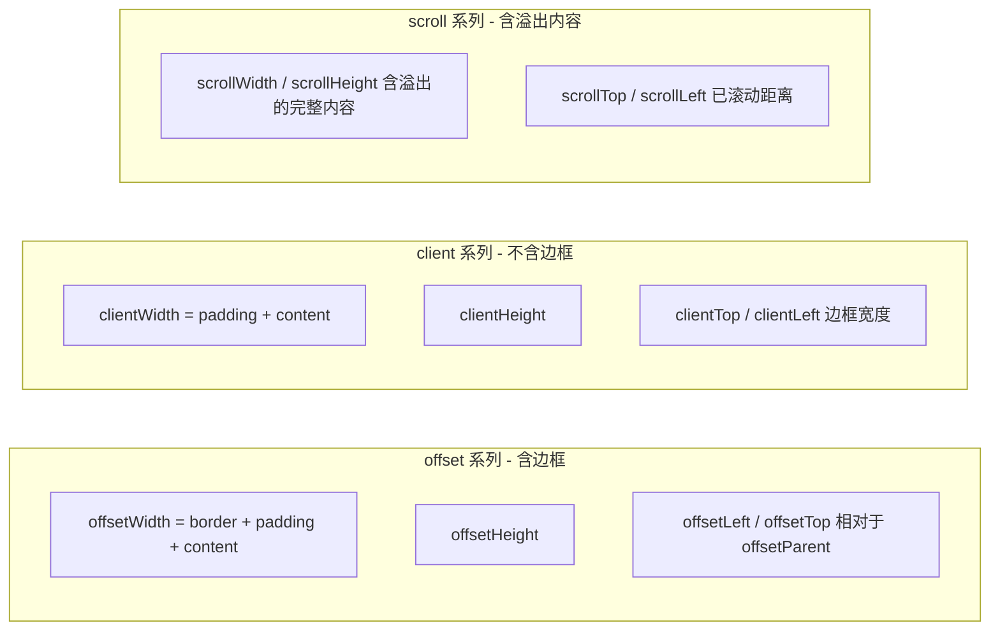
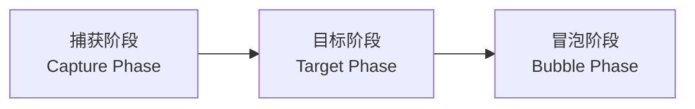

# 05-DOM操作与事件机制

> 模块：02-javascript-core（第2周 JavaScript 核心）
> 难度：★★★★ 核心进阶
> 前置知识：01-语法基础与执行机制

***

## 一、DOM树概念与节点类型

### 1.1 核心概念

**DOM**（Document Object Model，文档对象模型）是浏览器将 HTML 文档解析为一棵**节点树**的编程接口。每个 HTML 标签、文本、注释甚至属性，在 DOM 树中都对应一个节点对象，开发者可以通过 JavaScript 操作这些节点来动态改变页面内容和结构。

> **生活化类比**：DOM 树就像一本族谱——`<html>` 是老祖宗，`<head>` 和 `<body>` 是两个儿子，`<body>` 下面的 `<div>`、`<p>` 则是孙子辈。每个节点都有"爸爸"（parentNode）、"兄弟"（sibling）和"孩子"（childNodes）。

DOM 规范定义了 **12 种节点类型**，前端开发中最常用的是以下四种：

| 节点类型 | nodeType | nodeName | nodeValue | 示例 |
|---------|----------|----------|-----------|------|
| 元素节点（Element） | 1 | 大写的标签名 | `null` | `<div>`、`<p>`、`<span>` |
| 属性节点（Attr） | 2 | 属性名 | 属性值 | `class="box"` 中的 class |
| 文本节点（Text） | 3 | `#text` | 文本内容 | `<p>Hello</p>` 中的 "Hello" |
| 注释节点（Comment） | 8 | `#comment` | 注释内容 | `<!-- 注释 -->` |

### 1.2 底层原理

#### 浏览器解析 HTML 构建 DOM 树的过程

```
HTML 字节流 → 字符流 → Token → 节点对象 → DOM 树
```

1. **字节流解码**：浏览器从网络或磁盘读取 HTML 文件的原始字节，根据编码（如 UTF-8）解码为字符流。
2. **词法分析（Tokenization）**：将字符流解析为一个个 Token（标签 Token、文本 Token、注释 Token 等）。
3. **语法分析（Tree Construction）**：将 Token 序列转换为 DOM 节点对象，并按照父子兄弟关系构建树形结构。
4. **DOM 树构建完成**：`document` 对象成为整棵树的根节点入口。

```javascript
// 验证节点类型
const div = document.createElement('div');
console.log(div.nodeType);        // 1（元素节点）
console.log(div.nodeName);        // "DIV"（大写的标签名）

const textNode = document.createTextNode('Hello');
console.log(textNode.nodeType);   // 3（文本节点）
console.log(textNode.nodeName);   // "#text"
console.log(textNode.nodeValue);  // "Hello"

const comment = document.createComment('注释');
console.log(comment.nodeType);    // 8（注释节点）
console.log(comment.nodeValue);   // "注释"
```

#### 空白文本节点陷阱

HTML 中的**换行和缩进**也会被解析为文本节点，这是初学者常忽略的细节。

```html
<ul id="list">
  <li>项目1</li>
  <li>项目2</li>
</ul>
```

```javascript
const ul = document.getElementById('list');
console.log(ul.childNodes.length); // 5（3个文本节点 + 2个元素节点）
// childNodes 包含所有节点类型，包括空白文本节点
// children 只包含元素节点，返回 2
```

### 1.3 实战应用

```javascript
// 判断节点类型的安全方法
function getNodeTypeDescription(node) {
  const typeMap = {
    1: '元素节点',
    3: '文本节点',
    8: '注释节点',
    9: '文档节点',
    11: 'DocumentFragment',
  };
  return typeMap[node.nodeType] || '其他节点';
}

// 遍历 DOM 树（递归）
function traverseDOM(node, depth = 0) {
  if (node.nodeType === 3 && node.nodeValue.trim() === '') return; // 跳过空白文本
  console.log(' '.repeat(depth * 2) + 
    (node.nodeType === 1 ? `<${node.nodeName.toLowerCase()}>` : `"${node.nodeValue}"`));
  node.childNodes.forEach(child => traverseDOM(child, depth + 1));
}

// 使用
traverseDOM(document.body);
```

### 1.4 常见面试题

**Q：`childNodes` 和 `children` 的区别是什么？**

`childNodes` 返回所有类型的子节点（包括文本节点、注释节点），是一个 NodeList；`children` 只返回元素子节点，是一个 HTMLCollection。HTMLCollection 是**动态**的，会随 DOM 变化自动更新。

**Q：HTMLCollection 和 NodeList 的区别？**

| 对比维度 | HTMLCollection | NodeList |
|---------|---------------|----------|
| 包含节点 | 仅元素节点 | 所有节点类型 |
| 动态性 | 始终动态 | querySelectorAll 返回的是静态的，childNodes 返回的是动态的 |
| 获取方式 | children、getElementsByClassName | childNodes、querySelectorAll |
| forEach | 不支持 | 支持（现代浏览器） |

### 1.5 避坑指南

| 常见错误 | 现象 | 原因 | 解决方案 |
|---------|------|------|---------|
| 用 childNodes 遍历时误操作空白节点 | 循环次数异常 | 缩进/换行产生了空白文本节点 | 使用 `children` 或过滤 `nodeType === 1` |
| 误以为 querySelectorAll 返回动态集合 | 新增元素不在集合中 | querySelectorAll 返回静态 NodeList | 需要动态集合时使用 `getElementsBy*` 系列 |
| 在循环中直接操作 DOM 导致索引错乱 | 漏删或跳过元素 | HTMLCollection 是动态的 | 反向遍历或使用 `Array.from()` 转静态数组 |

> 📖 **参考链接**：
> - [MDN - Document Object Model](https://developer.mozilla.org/zh-CN/docs/Web/API/Document_Object_Model)
> - [WHATWG - DOM Living Standard](https://dom.spec.whatwg.org/)

***

## 二、节点增删改查

### 2.1 核心概念

操作 DOM 节点是前端开发的基本功，主要包括**创建、插入、删除、替换、克隆**五大类操作。

| 操作类型 | 核心 API | 说明 |
|---------|---------|------|
| 创建 | `document.createElement(tagName)` | 创建元素节点 |
| 创建 | `document.createTextNode(text)` | 创建文本节点 |
| 创建 | `document.createDocumentFragment()` | 创建文档片段（性能优化） |
| 插入 | `parent.appendChild(child)` | 追加到末尾 |
| 插入 | `parent.insertBefore(newNode, refNode)` | 插入到指定节点前 |
| 插入 | `parent.append(...nodes)` | 现代 API，可插入多个节点和文本 |
| 插入 | `parent.prepend(...nodes)` | 插入到开头 |
| 删除 | `parent.removeChild(child)` | 移除子节点 |
| 删除 | `child.remove()` | 现代 API，直接移除自身 |
| 替换 | `parent.replaceChild(newNode, oldNode)` | 替换子节点 |
| 克隆 | `node.cloneNode(deep)` | deep=true 深层克隆，false 浅层克隆 |

### 2.2 底层原理

#### appendChild 的内部机制

`appendChild` 不仅仅是"添加到末尾"，它遵循以下规则：

1. 如果新节点已经是 DOM 树中的节点，则先将其从原位置**移除**，再插入到新位置（移动语义）。
2. 如果新节点是 `DocumentFragment`，则插入其所有子节点，Fragment 本身不会被插入。
3. 插入后触发浏览器的**重排**（reflow）和**重绘**（repaint）。

```javascript
// 移动语义：同一节点只能存在于 DOM 树的一个位置
const div = document.getElementById('container1');
const span = document.getElementById('target');
document.getElementById('container2').appendChild(span);
// span 从 container1 移动到 container2，container1 中不再有 span
```

#### DocumentFragment 的性能优势

`DocumentFragment` 是一个"轻量级 Document"，存在于内存中，不在 DOM 树中渲染。批量插入节点时，先将节点添加到 Fragment，再一次性将 Fragment 插入 DOM，只触发一次重排。

```javascript
// 低效方式：每次循环触发一次重排
const list = document.getElementById('list');
for (let i = 0; i < 1000; i++) {
  const li = document.createElement('li');
  li.textContent = `项目 ${i}`;
  list.appendChild(li); // 每次都触发重排！
}

// 高效方式：使用 DocumentFragment，只触发一次重排
const fragment = document.createDocumentFragment();
for (let i = 0; i < 1000; i++) {
  const li = document.createElement('li');
  li.textContent = `项目 ${i}`;
  fragment.appendChild(li); // 在内存中操作，不触发重排
}
list.appendChild(fragment); // 一次性插入，只触发一次重排
```

### 2.3 实战应用

```javascript
// 批量插入节点工具函数
function batchAppend(parent, items, renderFn) {
  const fragment = document.createDocumentFragment();
  items.forEach(item => fragment.appendChild(renderFn(item)));
  parent.appendChild(fragment);
}

// 使用示例
const fruits = ['苹果', '香蕉', '橘子'];
const ul = document.getElementById('fruit-list');
batchAppend(ul, fruits, (name) => {
  const li = document.createElement('li');
  li.textContent = name;
  return li;
});

// insertBefore 实现 insertAfter
Element.prototype.insertAfter = function (newNode, refNode) {
  const nextSibling = refNode.nextSibling;
  if (nextSibling) {
    this.insertBefore(newNode, nextSibling);
  } else {
    this.appendChild(newNode);
  }
};

// 克隆节点
const original = document.querySelector('.card');
const clone = original.cloneNode(true); // 深克隆，包含所有子节点
clone.classList.add('card--cloned');
original.parentNode.appendChild(clone);
```

### 2.4 常见面试题

**Q：`innerHTML`、`createElement`、`DocumentFragment` 三种方式插入 DOM 的性能对比？**

| 方式 | 性能 | 安全性 | 适用场景 |
|------|------|--------|---------|
| `innerHTML` | 中等（需解析 HTML 字符串） | 差（XSS 风险） | 静态 HTML 片段插入 |
| `createElement` | 低（逐个插入触发多次重排） | 高 | 少量节点创建 |
| `DocumentFragment` | 高（一次插入） | 高 | 大量节点批量插入 |

**Q：`cloneNode(true)` 会克隆事件监听器吗？**
不会。`cloneNode` 只克隆 DOM 结构和内联属性，不会克隆通过 `addEventListener` 绑定的事件监听器。

### 2.5 避坑指南

| 常见错误 | 现象 | 原因 | 解决方案 |
|---------|------|------|---------|
| 循环中使用 innerHTML 拼接 | 性能差，事件丢失 | 每次赋值都重新解析 HTML，销毁旧 DOM | 改用 DocumentFragment 或一次赋值 |
| 忘记 cloneNode 参数 | 只克隆了外层标签 | `cloneNode()` 默认 false，不克隆子节点 | 深克隆使用 `cloneNode(true)` |
| 在循环中频繁 appendChild | 页面卡顿 | 每次操作触发重排 | 使用 DocumentFragment 批量操作 |
| 使用 innerHTML 插入用户输入 | XSS 攻击 | 未转义 HTML 特殊字符 | 使用 `textContent` 或进行 HTML 转义 |

***

## 三、DOM遍历与选择器API

### 3.1 核心概念

#### DOM 遍历属性大全

| 属性 | 遍历方向 | 包含节点类型 | 说明 |
|------|---------|-------------|------|
| `parentNode` | 向上 | 所有节点 | 父节点（可能是 Document） |
| `parentElement` | 向上 | 元素节点 | 父元素节点（父节点不是元素时返回 null） |
| `children` | 向下 | 元素节点 | 所有子元素（HTMLCollection，动态） |
| `childNodes` | 向下 | 所有节点 | 所有子节点（NodeList，动态） |
| `firstChild` | 向下 | 所有节点 | 第一个子节点 |
| `lastChild` | 向下 | 所有节点 | 最后一个子节点 |
| `firstElementChild` | 向下 | 元素节点 | 第一个子元素 |
| `lastElementChild` | 向下 | 元素节点 | 最后一个子元素 |
| `nextSibling` | 横向 | 所有节点 | 下一个兄弟节点 |
| `previousSibling` | 横向 | 所有节点 | 上一个兄弟节点 |
| `nextElementSibling` | 横向 | 元素节点 | 下一个兄弟元素 |
| `previousElementSibling` | 横向 | 元素节点 | 上一个兄弟元素 |

#### 选择器 API 对比

| API | 返回值 | 动态/静态 | 作用域 | 选择器语法 |
|-----|--------|----------|--------|-----------|
| `getElementById(id)` | 单个元素 / null | 动态 | 仅 document | 仅 ID |
| `getElementsByClassName(cls)` | HTMLCollection | 动态 | 任意元素 | 仅类名 |
| `getElementsByTagName(tag)` | HTMLCollection | 动态 | 任意元素 | 仅标签名 |
| `getElementsByName(name)` | NodeList | 动态 | 仅 document | 仅 name 属性 |
| `querySelector(selector)` | 单个元素 / null | 静态 | 任意元素 | 完整 CSS 选择器 |
| `querySelectorAll(selector)` | NodeList | 静态 | 任意元素 | 完整 CSS 选择器 |

### 3.2 底层原理

#### querySelectorAll 的匹配机制

`querySelectorAll` 使用**从右到左**的匹配策略（与 CSS 引擎的匹配方向一致），先找到匹配最右侧选择器的所有元素，再向上验证祖先是否符合其他选择器条件。这种方式比从左到右匹配更高效，因为可以快速过滤不符合最右选择器的元素。

```javascript
// 选择器: div.container > ul > li.active
// 匹配过程:
// 1. 找到所有 class="active" 的 li 元素
// 2. 检查每个 li 的父元素是否为 ul
// 3. 检查该 ul 的父元素是否为 class="container" 的 div
```

#### 动态集合 vs 静态集合的性能差异

```javascript
// 动态集合：每次访问 .length 都会重新查询 DOM
const dynamicItems = document.getElementsByClassName('item');
console.log(dynamicItems.length); // 假设 100 个
// 即使没有操作 DOM，下次访问 .length 也会重新计算

// 静态集合：快照，不会随 DOM 变化
const staticItems = document.querySelectorAll('.item');
console.log(staticItems.length); // 快照，初始化时确定
```

### 3.3 实战应用

```javascript
// 安全获取父元素（避免 parentNode 是 document 的情况）
function getParentElement(el) {
  return el.parentElement || null;
}

// 获取所有兄弟元素（排除自身）
function getSiblings(el) {
  return Array.from(el.parentNode.children).filter(child => child !== el);
}

// 在某个元素范围内查找
function findWithin(container, selector) {
  return container.querySelectorAll(selector);
}

// 查找最近的匹配祖先（低版本浏览器兼容 polyfill）
function closest(el, selector) {
  if (el.closest) return el.closest(selector);
  let current = el;
  while (current && current.nodeType === 1) {
    if (current.matches(selector)) return current;
    current = current.parentNode;
  }
  return null;
}

// 实战：表格行高亮（兄弟元素处理）
document.querySelectorAll('.data-row').forEach(row => {
  row.addEventListener('click', function () {
    getSiblings(this).forEach(s => s.classList.remove('active'));
    this.classList.add('active');
  });
});
```

### 3.4 常见面试题

**Q：`getElementsByClassName` 和 `querySelectorAll` 的区别？**

- `getElementsByClassName` 返回**动态** HTMLCollection，DOM 变化时自动更新；`querySelectorAll` 返回**静态** NodeList。
- `getElementsByClassName` 只能通过类名查找；`querySelectorAll` 支持任意 CSS 选择器。
- `getElementsByClassName` 性能略高于 `querySelectorAll`（简单匹配无需解析选择器语法）。

### 3.5 避坑指南

| 常见错误 | 现象 | 原因 | 解决方案 |
|---------|------|------|---------|
| 在循环中删除动态集合元素 | 漏删、索引错乱 | HTMLCollection 动态更新 | 反向遍历或 `Array.from` 转静态 |
| 用 `parentNode` 当 `parentElement` | 意外获取到 Document 节点 | Document 也是节点，但不是元素 | 需要元素父节点时用 `parentElement` |
| 忘记 `children` 不包含文本节点 | 与 `childNodes` 混淆 | `children` 是 Element，`childNodes` 是 Node | 遍历子元素用 `children`，遍历所有节点用 `childNodes` |
| 在动态集合上缓存 `length` | 循环提前终止 | 删除元素时集合长度变化 | 缓存 `Array.from()` 的结果 |

***

## 四、属性操作与样式操作

### 4.1 核心概念

#### 属性操作 API

| API | 操作对象 | 说明 |
|-----|---------|------|
| `getAttribute(name)` | HTML 属性 | 获取 HTML 属性值（字符串） |
| `setAttribute(name, value)` | HTML 属性 | 设置 HTML 属性值 |
| `removeAttribute(name)` | HTML 属性 | 移除 HTML 属性 |
| `hasAttribute(name)` | HTML 属性 | 判断是否有该属性 |
| `element.dataset.xxx` | data-* 属性 | 读写 `data-*` 自定义属性 |
| `element.classList` | class 属性 | 操作类名的专用 API |
| `element.id` / `element.className` | DOM 属性 | 直接访问 DOM 属性 |

#### classList API

| 方法 | 说明 |
|------|------|
| `classList.add('cls1', 'cls2', ...)` | 添加一个或多个类名 |
| `classList.remove('cls1', 'cls2', ...)` | 移除一个或多个类名 |
| `classList.toggle('cls')` | 切换类名（有则移除，无则添加） |
| `classList.toggle('cls', force)` | 强制添加（force=true）或移除（force=false） |
| `classList.contains('cls')` | 判断是否包含指定类名 |
| `classList.replace('old', 'new')` | 替换类名 |

#### 样式操作 API

| 方式 | 读写 | 说明 |
|------|------|------|
| `element.style.xxx` | 读写 | 操作内联样式，CSS 属性名使用驼峰命名 |
| `element.style.cssText` | 读写 | 批量设置内联样式 |
| `getComputedStyle(element)` | 只读 | 获取最终计算样式（包含所有 CSS 规则） |
| `element.style.setProperty(name, value, priority)` | 写 | 设置 CSS 属性（支持 `!important`） |
| `element.style.getPropertyValue(name)` | 读 | 获取 CSS 属性值 |

### 4.2 底层原理

#### HTML 属性 vs DOM 属性的映射关系

大多数 HTML 属性与 DOM 属性**同名同步**，但存在一些例外：

| HTML 属性 | DOM 属性 | 说明 |
|-----------|---------|------|
| `class` | `className` | JS 中 class 是保留字 |
| `for` | `htmlFor` | JS 中 for 是保留字 |
| `tabindex` | `tabIndex` | 驼峰命名转换 |
| `checked` | `checked`（布尔） | HTML 中是字符串，DOM 中是布尔值 |
| `style` | `style`（CSSStyleDeclaration） | HTML 中是字符串，DOM 中是对象 |

```javascript
// 特性检测：HTML 属性和 DOM 属性的值可能不同
const input = document.querySelector('input[type="checkbox"]');
input.setAttribute('checked', 'checked');
console.log(input.getAttribute('checked')); // "checked"（字符串）
console.log(input.checked);                 // true（布尔值）

// 动态修改后：checked IDL 属性变化，但 HTML 属性不变
input.checked = false;
console.log(input.getAttribute('checked')); // "checked"（HTML 属性反映默认选中状态，不受 IDL 属性变化影响）
console.log(input.checked);                 // false（IDL 属性反映当前选中状态）
```

#### getComputedStyle 的工作原理

`getComputedStyle` 返回的是浏览器经过**所有 CSS 规则层叠计算**后的最终样式值，包括：

1. 浏览器默认样式（User Agent Stylesheet）
2. 外部样式表、内部样式表
3. 内联样式（`style` 属性）
4. 继承自父元素的样式
5. 动画和过渡中的中间值

```javascript
const div = document.querySelector('.box');
const styles = getComputedStyle(div);

// 获取计算后的宽度（返回 "100px"，即使 CSS 写的是百分比）
console.log(styles.width);

// 获取伪元素的样式
const pseudoStyles = getComputedStyle(div, '::before');
console.log(pseudoStyles.content);
```

### 4.3 实战应用

```javascript
// dataset 实战：读取 data-* 属性
// <div id="user" data-id="123" data-role="admin" data-last-login="2024-01-01"></div>
const userEl = document.getElementById('user');
console.log(userEl.dataset.id);         // "123"
console.log(userEl.dataset.role);       // "admin"
console.log(userEl.dataset.lastLogin);  // "2024-01-01"（驼峰命名转换）

// 设置 data-* 属性
userEl.dataset.status = 'active';
// 等价于: userEl.setAttribute('data-status', 'active');

// classList 实战：暗色模式切换
function toggleDarkMode() {
  const root = document.documentElement;
  root.classList.toggle('dark-mode');
  
  // 根据状态持久化
  const isDark = root.classList.contains('dark-mode');
  localStorage.setItem('theme', isDark ? 'dark' : 'light');
}

// 批量设置样式
function setStyles(el, styles) {
  Object.assign(el.style, styles);
}
setStyles(document.body, {
  backgroundColor: '#f5f5f5',
  color: '#333',
  fontSize: '16px',
});

// 获取元素的实际宽高（含 padding 和 border）
function getElementSize(el) {
  const styles = getComputedStyle(el);
  return {
    width: parseFloat(styles.width),
    height: parseFloat(styles.height),
    paddingTop: parseFloat(styles.paddingTop),
    paddingBottom: parseFloat(styles.paddingBottom),
    borderTop: parseFloat(styles.borderTopWidth),
    borderBottom: parseFloat(styles.borderBottomWidth),
  };
}
```

### 4.4 常见面试题

**Q：`element.style.width` 和 `getComputedStyle(element).width` 的区别？**

| 对比维度 | `element.style.width` | `getComputedStyle(element).width` |
|---------|----------------------|----------------------------------|
| 读取范围 | 仅内联样式 | 所有 CSS 规则计算后的最终值 |
| 可写性 | 可写入 | 只读 |
| 返回值 | 空字符串（如果未设置内联样式） | 始终返回实际像素值 |
| 单位 | 与设置时相同 | 始终为 `px` |

### 4.5 避坑指南

| 常见错误 | 现象 | 原因 | 解决方案 |
|---------|------|------|---------|
| 用 `className` 追加类名覆盖已有类名 | 原有类名丢失 | `className` 是字符串整体替换 | 使用 `classList.add()` |
| 用 `style` 读取非内联样式 | 返回空字符串 | `style` 只读内联样式 | 使用 `getComputedStyle()` |
| 忘记 dataset 驼峰转换 | 读取到 undefined | `data-my-attr` 对应 `dataset.myAttr` | 按驼峰命名规则访问 |
| 用 `getComputedStyle` 获取隐藏元素尺寸 | 返回 0 | `display: none` 元素无布局尺寸 | 先设为 `visibility: hidden` 再测量 |

***

## 五、尺寸与位置

### 5.1 核心概念

元素尺寸相关属性分为三组，分别对应不同的计算范围：



| 属性 | 计算范围 | 说明 |
|------|---------|------|
| `offsetWidth / offsetHeight` | content + padding + border | 元素在页面中占据的视觉尺寸 |
| `clientWidth / clientHeight` | content + padding | 元素可视区域尺寸（不含滚动条） |
| `scrollWidth / scrollHeight` | content + padding（含溢出） | 元素完整内容尺寸 |
| `scrollTop / scrollLeft` | - | 已滚动的距离（可读写） |
| `offsetLeft / offsetTop` | - | 相对于 `offsetParent` 的偏移 |
| `getBoundingClientRect()` | - | 相对于视口的精确位置和尺寸 |

### 5.2 底层原理

#### getBoundingClientRect() 详解

`getBoundingClientRect()` 返回一个 `DOMRect` 对象，包含元素相对于**视口**（viewport）的精确位置和尺寸。这是执行布局计算和碰撞检测的首选方案。

```javascript
const rect = element.getBoundingClientRect();
// 返回值 DOMRect:
// {
//   x: 100,      // 相对于视口左边缘
//   y: 200,      // 相对于视口上边缘
//   width: 300,  // 元素宽度（含 border）
//   height: 150, // 元素高度（含 border）
//   top: 200,    // 上边缘距视口顶部
//   right: 400,  // 右边缘距视口左边
//   bottom: 350, // 下边缘距视口顶部
//   left: 100,   // 左边缘距视口左边
// }
```

#### offsetParent 的查找规则

`offsetParent` 是距离当前元素最近的**已定位祖先元素**（`position` 为 `relative`、`absolute`、`fixed` 或 `sticky`）。如果找不到，则返回最近的 `td`、`th`、`table` 或 `body`。

```javascript
function getElementOffset(el) {
  let top = 0;
  let left = 0;
  let current = el;
  
  while (current) {
    top += current.offsetTop;
    left += current.offsetLeft;
    current = current.offsetParent;
  }
  
  return { top, left };
}
```

### 5.3 实战应用

```javascript
// 判断元素是否在可视区域内
function isInViewport(el, offset = 0) {
  const rect = el.getBoundingClientRect();
  return (
    rect.top >= -offset &&
    rect.left >= -offset &&
    rect.bottom <= window.innerHeight + offset &&
    rect.right <= window.innerWidth + offset
  );
}

// 滚动到指定元素（平滑滚动）
function scrollToElement(el, offset = 0) {
  const top = el.getBoundingClientRect().top + window.scrollY - offset;
  window.scrollTo({ top, behavior: 'smooth' });
}

// 判断是否滚动到底部
function isScrolledToBottom(el, threshold = 50) {
  return el.scrollHeight - el.scrollTop - el.clientHeight <= threshold;
}

// 回到顶部
function scrollToTop() {
  window.scrollTo({ top: 0, behavior: 'smooth' });
}

// 拖拽元素实现
function makeDraggable(el) {
  let offsetX, offsetY, isDragging = false;
  
  el.addEventListener('mousedown', (e) => {
    isDragging = true;
    const rect = el.getBoundingClientRect();
    offsetX = e.clientX - rect.left;
    offsetY = e.clientY - rect.top;
    el.style.cursor = 'grabbing';
  });
  
  document.addEventListener('mousemove', (e) => {
    if (!isDragging) return;
    el.style.left = `${e.clientX - offsetX}px`;
    el.style.top = `${e.clientY - offsetY}px`;
  });
  
  document.addEventListener('mouseup', () => {
    isDragging = false;
    el.style.cursor = 'grab';
  });
}
```

### 5.4 常见面试题

**Q：`offsetHeight`、`clientHeight`、`scrollHeight` 的区别？**

| 属性 | 计算公式 | 场景 |
|------|---------|------|
| `offsetHeight` | border + padding + content | 获取元素在页面中占用的总高度 |
| `clientHeight` | padding + content（不含滚动条） | 获取元素可视区域高度 |
| `scrollHeight` | padding + 实际内容高度（含溢出） | 判断是否出现滚动条，实现滚动到底部检测 |

**Q：如何获取元素相对于文档（document）的绝对位置？**

```javascript
function getDocumentPosition(el) {
  const rect = el.getBoundingClientRect();
  return {
    top: rect.top + window.scrollY,
    left: rect.left + window.scrollX,
  };
}
```

### 5.5 避坑指南

| 常见错误 | 现象 | 原因 | 解决方案 |
|---------|------|------|---------|
| 用 `getBoundingClientRect` 判断可见性不准确 | 元素被遮挡仍判定为可见 | 只检测了视口范围，未检测遮挡 | 结合 IntersectionObserver 或额外检测 |
| 在 `display: none` 元素上读取尺寸 | 返回 0 | 隐藏元素没有布局 | 先设置为非 `display: none` 再测量 |
| 混淆 `offsetTop` 和 `getBoundingClientRect().top` | 定位偏差 | `offsetTop` 相对于 `offsetParent`，后者相对于视口 | 明确使用场景 |
| 频繁读取布局属性触发强制同步布局 | 页面卡顿 | 读取布局属性会强制浏览器计算布局 | 批量读取，避免在修改样式后立即读取 |

***

## 六、观察者三剑客

### 6.1 MutationObserver（DOM 变化监听）

#### 核心概念

`MutationObserver` 提供了一种**异步监听 DOM 树变化**的能力。它取代了已废弃的 `MutationEvent`，性能更好，不会阻塞页面渲染。

**配置项**（MutationObserverInit）：

| 配置项 | 类型 | 说明 |
|--------|------|------|
| `childList` | boolean | 监听子节点的添加和删除 |
| `attributes` | boolean | 监听属性变化 |
| `characterData` | boolean | 监听文本内容变化 |
| `subtree` | boolean | 监听目标节点所有后代节点 |
| `attributeOldValue` | boolean | 记录属性变化前的旧值 |
| `characterDataOldValue` | boolean | 记录文本变化前的旧值 |
| `attributeFilter` | string[] | 只监听指定的属性名 |

#### 底层原理

`MutationObserver` 采用**微任务**机制：当 DOM 发生变化时，变化记录被推入一个队列，在当前宏任务执行完毕后、下一个宏任务开始前，通过微任务批量处理所有变化记录，而非每次变化都立即回调。

```javascript
// 创建一个 MutationObserver
const observer = new MutationObserver((mutations) => {
  mutations.forEach((mutation) => {
    switch (mutation.type) {
      case 'childList':
        console.log('子节点变化:', mutation.addedNodes, mutation.removedNodes);
        break;
      case 'attributes':
        console.log('属性变化:', mutation.attributeName, mutation.oldValue);
        break;
      case 'characterData':
        console.log('文本变化:', mutation.oldValue, '→', mutation.target.textContent);
        break;
    }
  });
});

// 开始观察
observer.observe(document.getElementById('app'), {
  childList: true,      // 监听子节点增删
  attributes: true,      // 监听属性变化
  characterData: true,   // 监听文本变化
  subtree: true,         // 监听所有后代
  attributeOldValue: true,
  characterDataOldValue: true,
});

// 停止观察
// observer.disconnect();

// 获取尚未处理的变更记录（不清空队列）
// const pending = observer.takeRecords();
```

#### 实战应用

```javascript
// 防 XSS 攻击：监听 DOM 变化，过滤危险内容
function sanitizeDOM(rootEl) {
  const observer = new MutationObserver((mutations) => {
    mutations.forEach(mutation => {
      mutation.addedNodes.forEach(node => {
        if (node.nodeType === 1) {
          // 移除危险属性
          const dangerousAttrs = ['onerror', 'onload', 'onclick'];
          dangerousAttrs.forEach(attr => {
            if (node.hasAttribute(attr)) {
              node.removeAttribute(attr);
            }
          });
        }
      });
    });
  });
  
  observer.observe(rootEl, { childList: true, subtree: true });
  return observer;
}

// 水印防护：监听水印 DOM 被删除
function protectWatermark(watermarkEl) {
  const observer = new MutationObserver((mutations) => {
    mutations.forEach(mutation => {
      // 如果水印被删除，重新插入
      if (mutation.removedNodes.length > 0) {
        const removed = Array.from(mutation.removedNodes);
        if (removed.includes(watermarkEl) || removed.some(n => n.contains?.(watermarkEl))) {
          document.body.appendChild(watermarkEl);
        }
      }
      // 如果水印属性被修改，恢复
      if (mutation.type === 'attributes' && mutation.target === watermarkEl) {
        watermarkEl.style.cssText = originalStyle;
      }
    });
  });
  
  observer.observe(document.body, {
    childList: true,
    attributes: true,
    subtree: true,
    attributeFilter: ['style', 'class'],
  });
}
```

> 📖 **参考链接**：
> - [MDN - MutationObserver](https://developer.mozilla.org/zh-CN/docs/Web/API/MutationObserver)
> - [MDN - MutationRecord](https://developer.mozilla.org/zh-CN/docs/Web/API/MutationRecord)

### 6.2 IntersectionObserver（元素可见性监听）

#### 核心概念

`IntersectionObserver` 提供了一种**异步监听目标元素与祖先元素（或视口）交叉状态**的能力。最常用于**懒加载**和**无限滚动**。

```javascript
const observer = new IntersectionObserver((entries, observer) => {
  entries.forEach(entry => {
    if (entry.isIntersecting) {
      console.log('元素进入可视区域');
      console.log('交叉比例:', entry.intersectionRatio);
      // 加载后停止观察
      observer.unobserve(entry.target);
    }
  });
}, {
  root: null,        // null 表示视口，可指定祖先元素
  rootMargin: '0px', // 扩大或缩小交叉检测区域
  threshold: 0.1,    // 交叉比例阈值（0 到 1，或数组 [0, 0.25, 0.5, 0.75, 1]）
});

// 开始观察
observer.observe(document.querySelector('.lazy-image'));
```

#### 底层原理

`IntersectionObserver` 的回调是**异步**的，在浏览器空闲时批量执行。它不依赖 `scroll` 事件，不会造成主线程阻塞，性能远优于传统的 `getBoundingClientRect` + `scroll` 方案。

#### 实战应用

```javascript
// 1. 图片懒加载
function lazyLoadImages() {
  const observer = new IntersectionObserver((entries) => {
    entries.forEach(entry => {
      if (entry.isIntersecting) {
        const img = entry.target;
        img.src = img.dataset.src;
        img.classList.remove('lazy');
        observer.unobserve(img);
      }
    });
  }, { rootMargin: '200px' }); // 提前 200px 开始加载
  
  document.querySelectorAll('img[data-src]').forEach(img => {
    observer.observe(img);
  });
}

// 2. 无限滚动
function infiniteScroll(loadMoreFn) {
  const sentinel = document.getElementById('scroll-sentinel');
  
  const observer = new IntersectionObserver(async (entries) => {
    if (entries[0].isIntersecting) {
      await loadMoreFn();
    }
  }, { rootMargin: '300px' });
  
  observer.observe(sentinel);
  return observer;
}

// 3. 曝光埋点（元素露出 50% 且持续 1 秒才上报）
function exposureTracking() {
  const timers = new WeakMap();
  
  const observer = new IntersectionObserver((entries) => {
    entries.forEach(entry => {
      if (entry.isIntersecting) {
        // 进入可视区域，开始计时
        timers.set(entry.target, setTimeout(() => {
          console.log('曝光上报:', entry.target.dataset.trackId);
          observer.unobserve(entry.target);
        }, 1000));
      } else {
        // 离开可视区域，取消计时
        clearTimeout(timers.get(entry.target));
        timers.delete(entry.target);
      }
    });
  }, { threshold: 0.5 });
  
  document.querySelectorAll('[data-track-id]').forEach(el => {
    observer.observe(el);
  });
}
```

> 📖 **参考链接**：
> - [MDN - IntersectionObserver](https://developer.mozilla.org/zh-CN/docs/Web/API/IntersectionObserver)
> - [MDN - IntersectionObserverEntry](https://developer.mozilla.org/zh-CN/docs/Web/API/IntersectionObserverEntry)

### 6.3 ResizeObserver（元素尺寸变化监听）

#### 核心概念

`ResizeObserver` 提供了一种**监听元素尺寸变化**的能力。相比 `window.resize` 事件只能监听视口变化，`ResizeObserver` 可以监听任意元素的尺寸变化。

```javascript
const observer = new ResizeObserver((entries) => {
  entries.forEach(entry => {
    const { width, height } = entry.contentRect;
    console.log(`元素尺寸变化: ${width} x ${height}`);
    console.log('边框盒尺寸:', entry.borderBoxSize);
    console.log('内容盒尺寸:', entry.contentBoxSize);
  });
});

observer.observe(document.querySelector('.resizable'));
```

#### 底层原理

`ResizeObserver` 的回调在**布局阶段之后、绘制阶段之前**触发，避免了传统方案中 `resize` 事件循环触发重排的性能问题。它的回调也是批量异步执行的。

#### 实战应用

```javascript
// 响应式组件的自适应
function responsiveContainer(el) {
  const observer = new ResizeObserver((entries) => {
    const width = entries[0].contentRect.width;
    
    if (width < 600) {
      el.classList.add('layout-compact');
      el.classList.remove('layout-wide');
    } else if (width < 1024) {
      el.classList.remove('layout-compact');
      el.classList.remove('layout-wide');
    } else {
      el.classList.add('layout-wide');
    }
  });
  
  observer.observe(el);
  return observer;
}

// 监听元素尺寸变化，动态调整子元素布局
function autoGrid(el) {
  const observer = new ResizeObserver((entries) => {
    const width = entries[0].contentRect.width;
    const cols = width < 400 ? 1 : width < 800 ? 2 : 3;
    el.style.gridTemplateColumns = `repeat(${cols}, 1fr)`;
  });
  
  observer.observe(el);
  return observer;
}
```

### 6.4 三个观察者对比

| 对比维度 | MutationObserver | IntersectionObserver | ResizeObserver |
|---------|-----------------|---------------------|----------------|
| 监听目标 | DOM 树变化（节点增删、属性、文本） | 元素与视口/祖先的交叉状态 | 元素的尺寸变化 |
| 触发时机 | DOM 变化后（微任务） | 元素可见性变化时 | 元素尺寸变化时（布局后） |
| 性能 | 高（批量异步处理） | 高（独立于主线程） | 高（批量异步处理） |
| 典型场景 | 防 XSS、水印保护、表单监听 | 懒加载、无限滚动、曝光埋点 | 响应式组件、自适应布局 |

### 6.5 避坑指南

| 常见错误 | 现象 | 原因 | 解决方案 |
|---------|------|------|---------|
| 忘记 `disconnect()` | 内存泄漏 | Observer 持续持有 DOM 引用 | 组件卸载时调用 `disconnect()` |
| MutationObserver 回调中修改 DOM | 死循环 | 回调中的 DOM 修改触发新的 mutation | 在修改前断开观察，修改后重新连接 |
| IntersectionObserver 的 root 指定错误 | 回调不触发 | root 必须是目标元素的祖先元素 | 确保 root 是目标元素的祖先，或使用 null（视口） |
| 同时观察大量元素 | 回调过于频繁 | 每个元素变化都会触发回调 | 使用 `threshold` 数组控制触发时机 |

***

## 七、事件流与事件机制

### 7.1 核心概念

#### 事件流三阶段

DOM 事件流分为三个阶段，完整描述了事件从触发到响应的传播路径：



1. **捕获阶段（Capture Phase）**：事件从 `window` 向下传播，经过 `document`、`html`、`body`，逐层到达目标元素的父元素。此阶段绑定的监听器（`addEventListener` 第三个参数为 `true`）会触发。
2. **目标阶段（Target Phase）**：事件到达目标元素本身，触发目标元素上绑定的监听器（无论捕获还是冒泡）。
3. **冒泡阶段（Bubble Phase）**：事件从目标元素向上冒泡，依次经过父元素、祖先元素，直到 `window`。此阶段绑定的监听器（`addEventListener` 第三个参数为 `false` 或省略）会触发。

> **生活化类比：公司审批流程** —— 事件流就像公司审批流程：捕获阶段是"总经理→部门经理→组长"逐级向下传达（从外到内），目标阶段是当事人处理，冒泡阶段是"组长→部门经理→总经理"逐级向上汇报（从内到外）。每一级都可以在"传达"或"汇报"环节拦截处理（`stopPropagation`），也可以选择在哪个方向响应（`addEventListener` 的第三个参数控制监听在捕获阶段还是冒泡阶段触发）。

#### 事件冒泡与捕获

```javascript
// HTML 结构:
// <div id="outer">
//   <div id="inner">
//     <button id="btn">点击</button>
//   </div>
// </div>

const outer = document.getElementById('outer');
const inner = document.getElementById('inner');
const btn = document.getElementById('btn');

// 冒泡阶段监听（默认）
outer.addEventListener('click', () => console.log('outer 冒泡'), false);
inner.addEventListener('click', () => console.log('inner 冒泡'), false);
btn.addEventListener('click', () => console.log('btn 冒泡'), false);

// 捕获阶段监听
outer.addEventListener('click', () => console.log('outer 捕获'), true);
inner.addEventListener('click', () => console.log('inner 捕获'), true);
btn.addEventListener('click', () => console.log('btn 捕获'), true);

// 点击 btn 的输出顺序:
// outer 捕获 → inner 捕获 → btn 捕获 → btn 冒泡 → inner 冒泡 → outer 冒泡
```

### 7.2 底层原理

#### 事件模型演进

| 阶段 | 模型 | 说明 |
|------|------|------|
| DOM Level 0 | 原始事件模型 | `element.onclick = handler`，同一事件只能绑定一个处理器 |
| DOM Level 2 | 标准事件模型 | `addEventListener`，支持多个处理器，支持捕获和冒泡 |
| DOM Level 3 | 扩展事件模型 | 新增更多事件类型（键盘事件、滚动事件等） |

#### `addEventListener` 的第三个参数

```javascript
// 方式一：布尔值（传统）
element.addEventListener('click', handler, false); // 冒泡阶段
element.addEventListener('click', handler, true);  // 捕获阶段

// 方式二：选项对象（推荐）
element.addEventListener('click', handler, {
  capture: false,  // 是否在捕获阶段触发
  once: true,      // 只触发一次后自动移除
  passive: true,   // 不会调用 preventDefault()（提升滚动性能）
  signal: controller.signal, // 通过 AbortController 移除监听器
});
```

### 7.3 实战应用

#### 事件委托（Event Delegation）

事件委托利用事件冒泡机制，将子元素的事件处理统一绑定到父元素上，通过 `event.target` 判断实际触发元素。

```javascript
// 传统方式：每个按钮绑定事件（性能差，无法处理动态新增元素）
document.querySelectorAll('.btn').forEach(btn => {
  btn.addEventListener('click', handleClick);
});

// 事件委托：只需在父元素上绑定一次
document.getElementById('btn-container').addEventListener('click', (e) => {
  // 匹配目标元素
  const btn = e.target.closest('.btn');
  if (!btn) return;
  
  // 通过 data-* 属性区分不同按钮的行为
  const action = btn.dataset.action;
  switch (action) {
    case 'edit':
      console.log('编辑按钮被点击');
      break;
    case 'delete':
      console.log('删除按钮被点击');
      break;
    default:
      console.log('未知操作');
  }
});

// 动态添加的元素也能享受事件委托
// 新按钮自动"继承"父元素的事件处理
```

> 📖 **参考链接**：
> - [MDN - addEventListener](https://developer.mozilla.org/zh-CN/docs/Web/API/EventTarget/addEventListener)
> - [MDN - 事件介绍](https://developer.mozilla.org/zh-CN/docs/Learn/JavaScript/Building_blocks/Events)

### 7.4 常见面试题

**Q：事件委托的优缺点？**

| 优点 | 缺点 |
|------|------|
| 减少事件绑定数量，节省内存 | 部分事件不冒泡（如 `focus`、`blur`、`scroll`），无法委托 |
| 动态添加的子元素自动获得事件处理 | 事件委托层级过深时，`event.target` 判断可能出错 |
| 简化代码维护，集中管理事件 | 对 `mousemove` 等高频事件，委托可能影响性能 |

**Q：哪些事件不冒泡？**

`focus`、`blur`、`load`、`unload`、`scroll`、`resize`、`mouseenter`、`mouseleave` 等。其中 `focus` 和 `blur` 可以使用对应的冒泡版本 `focusin` 和 `focusout` 来替代。

### 7.5 避坑指南

| 常见错误 | 现象 | 原因 | 解决方案 |
|---------|------|------|---------|
| 事件委托用了不冒泡的事件 | 事件不触发 | focus/blur 等不冒泡 | 使用 focusin/focusout 或直接在目标元素上绑定 |
| 事件委托中未判断 `e.target` | 点击子元素也触发 | 冒泡导致所有子元素点击都触发父元素处理器 | 使用 `e.target.matches()` 或 `e.target.closest()` 过滤 |
| 在循环中绑定事件导致闭包问题 | 所有回调引用同一变量 | var 无块级作用域 | 使用 let 或事件委托 |
| 滥用 `addEventListener` 未移除 | 内存泄漏 | 单页应用中组件销毁但事件未解绑 | 组件卸载时调用 `removeEventListener` |

> 📖 **参考链接**：
> - [MDN - Event](https://developer.mozilla.org/zh-CN/docs/Web/API/Event)
> - [MDN - addEventListener](https://developer.mozilla.org/zh-CN/docs/Web/API/EventTarget/addEventListener)

***

## 八、事件控制与自定义事件

### 8.1 核心概念

#### stopPropagation vs stopImmediatePropagation

| 方法 | 行为 | 影响范围 |
|------|------|---------|
| `event.stopPropagation()` | 阻止事件继续传播（阻止冒泡或捕获） | 当前元素上**其他监听器**仍会触发 |
| `event.stopImmediatePropagation()` | 阻止事件传播 + 阻止当前元素上其他监听器 | 当前元素上**其他监听器**也不会触发 |

```javascript
btn.addEventListener('click', (e) => {
  console.log('监听器1');
  e.stopPropagation(); // 阻止冒泡，但监听器2仍然会触发
});

btn.addEventListener('click', (e) => {
  console.log('监听器2');
});

// 点击 btn 输出: 监听器1 → 监听器2（stopPropagation 不阻止同元素的其他监听器）
```

```javascript
btn.addEventListener('click', (e) => {
  console.log('监听器1');
  e.stopImmediatePropagation(); // 阻止冒泡 + 阻止监听器2
});

btn.addEventListener('click', (e) => {
  console.log('监听器2'); // 不会触发！
});

// 点击 btn 输出: 监听器1
```

#### preventDefault()

`preventDefault()` 阻止浏览器的**默认行为**，但不阻止事件传播。

| 默认行为 | 触发元素 | 示例 |
|---------|---------|------|
| 链接跳转 | `<a>` | 点击链接跳转到 href |
| 表单提交 | `<form>` | 点击提交按钮发送表单 |
| 文本选中 | 文本 | 鼠标拖拽选中文本 |
| 右键菜单 | 任意元素 | 右键弹出上下文菜单 |
| 拖拽 | 可拖拽元素 | 拖拽图片/链接 |
| 键盘输入 | `<input>` | 按键输入字符 |

```javascript
// 阻止表单默认提交，改用 AJAX
form.addEventListener('submit', async (e) => {
  e.preventDefault(); // 阻止表单默认提交行为
  const formData = new FormData(form);
  await fetch('/api/submit', { method: 'POST', body: formData });
});

// 阻止链接跳转，改为 SPA 路由导航
document.addEventListener('click', (e) => {
  const link = e.target.closest('a[href]');
  if (!link || link.getAttribute('target') === '_blank') return;
  
  e.preventDefault();
  router.navigate(link.getAttribute('href'));
});
```

### 8.2 CustomEvent（自定义事件）

#### 核心概念

`CustomEvent` 允许开发者创建和派发自定义事件，实现组件间的**解耦通信**。这是一种比回调函数和全局状态更优雅的组件通信方式。

```javascript
// 创建自定义事件
const event = new CustomEvent('user-login', {
  detail: {           // 通过 detail 传递数据
    userId: '12345',
    username: 'Alice',
    timestamp: Date.now(),
  },
  bubbles: true,      // 是否冒泡
  cancelable: true,   // 是否可被 preventDefault 取消
  composed: true,     // 是否穿透 Shadow DOM
});

// 派发事件
element.dispatchEvent(event);
```

#### 底层原理

`CustomEvent` 与原生事件共用同一个事件系统，通过 `dispatchEvent` 同步触发。事件处理器按照事件流三个阶段（捕获 → 目标 → 冒泡）依次执行，且 `dispatchEvent` 是同步的——所有监听器执行完毕后 `dispatchEvent` 才返回。

```javascript
// dispatchEvent 的同步特性
const event = new CustomEvent('data-ready', { detail: { items: [1, 2, 3] } });

let processed = false;
element.addEventListener('data-ready', () => {
  processed = true;
});

console.log(processed); // false
element.dispatchEvent(event);
console.log(processed); // true（dispatchEvent 是同步的，监听器已执行完毕）
```

### 8.3 实战应用

```javascript
// 1. 组件间解耦通信：状态管理
// 创建一个全局事件总线
class EventBus {
  constructor() {
    this._target = document.createElement('div');
  }
  
  on(event, callback) {
    this._target.addEventListener(event, callback);
  }
  
  off(event, callback) {
    this._target.removeEventListener(event, callback);
  }
  
  emit(event, detail) {
    this._target.dispatchEvent(new CustomEvent(event, { detail }));
  }
}

const bus = new EventBus();

// 组件 A：监听用户登录
bus.on('user-login', (e) => {
  console.log('组件A收到登录通知:', e.detail.username);
});

// 组件 B：发送登录事件
bus.emit('user-login', { userId: '123', username: 'Alice' });

// 2. 表单验证事件
class FormValidator {
  constructor(formEl) {
    this.form = formEl;
    this.init();
  }
  
  init() {
    this.form.addEventListener('submit', (e) => {
      e.preventDefault();
      const isValid = this.validate();
      
      // 派发验证结果事件
      this.form.dispatchEvent(new CustomEvent('validation-result', {
        detail: { isValid, errors: this.errors },
        bubbles: true,
      }));
    });
  }
  
  validate() {
    this.errors = [];
    // 验证逻辑...
    return this.errors.length === 0;
  }
}

// 3. SPA 路由变化通知
class Router {
  navigate(path) {
    history.pushState({}, '', path);
    window.dispatchEvent(new CustomEvent('route-change', {
      detail: { path, params: this.parseParams(path) },
    }));
  }
}

// 页面组件监听路由变化
window.addEventListener('route-change', (e) => {
  console.log('路由变化:', e.detail.path);
  // 根据路由渲染对应组件
});
```

### 8.4 常见面试题

**Q：`stopPropagation` 和 `stopImmediatePropagation` 的区别？**

`stopPropagation` 阻止事件向父元素传播，但**不阻止**当前元素上绑定的其他监听器执行。`stopImmediatePropagation` 不仅阻止事件传播，还**阻止当前元素上其他监听器**的执行。

**Q：`event.target` 和 `event.currentTarget` 的区别？**

| 属性 | 指向 | 说明 |
|------|------|------|
| `event.target` | 触发事件的**实际元素** | 事件流中最初触发事件的元素，不会变化 |
| `event.currentTarget` | 当前正在处理事件的**监听器绑定元素** | 在事件流中随事件传播而变化，即 `this` |

```javascript
// 点击 inner 按钮时：
// <div id="outer"><div id="inner"><button>点击</button></div></div>
outer.addEventListener('click', function(e) {
  console.log(e.target);        // <button>（实际触发元素）
  console.log(e.currentTarget); // <div id="outer">（监听器绑定元素）
  console.log(this);            // <div id="outer">（等于 currentTarget）
});
```

### 8.5 避坑指南

| 常见错误 | 现象 | 原因 | 解决方案 |
|---------|------|------|---------|
| 混淆 `stopPropagation` 和 `stopImmediatePropagation` | 预期被阻止的监听器仍触发 | 用了 `stopPropagation` 而非 `stopImmediatePropagation` | 需要阻止同元素其他监听器时用后者 |
| 在 `passive: true` 的监听器中调用 `preventDefault` | 控制台警告，preventDefault 无效 | passive 模式声明不阻止默认行为 | 需要阻止默认行为时不设置 `passive: true` |
| CustomEvent 忘记设置 `bubbles: true` | 父元素监听不到自定义事件 | 默认 `bubbles` 为 `false` | 需要冒泡时显式设置 `bubbles: true` |
| 在 `dispatchEvent` 中修改 `detail` | 修改无效 | `detail` 在事件创建时冻结 | 需要传递可变数据时使用对象引用 |

***

> **学习导航**：
>
> - 返回 [学习路线总览](../README.md)
> - 本模块上一章：[04-JavaScript核心笔面试题集](./04-JavaScript核心笔面试题集.md)
> - 实战应用：[企业后台管理系统](../10-project/01-企业后台管理系统实战.md)

***

## 本章学习自检

- [ ] 能说出 DOM 的四种常用节点类型及其 nodeType 值
- [ ] 理解 childNodes 和 children 的区别，知道空白文本节点的存在
- [ ] 能手写节点的增删改查操作（createElement / appendChild / removeChild / insertBefore / replaceChild / cloneNode）
- [ ] 理解 DocumentFragment 的性能优化原理
- [ ] 能区分 HTMLCollection 和 NodeList 的动态/静态特性
- [ ] 能正确使用 querySelector / querySelectorAll / getElementById 等选择器 API
- [ ] 能使用 dataset 读写 data-* 属性
- [ ] 能使用 classList API 操作类名
- [ ] 理解 element.style 和 getComputedStyle 的区别
- [ ] 能区分 offsetHeight / clientHeight / scrollHeight 的计算范围
- [ ] 能使用 getBoundingClientRect() 获取元素的精确位置和尺寸
- [ ] 能使用 MutationObserver 监听 DOM 变化
- [ ] 能使用 IntersectionObserver 实现懒加载和无限滚动
- [ ] 能使用 ResizeObserver 监听元素尺寸变化
- [ ] 能完整描述事件流三阶段（捕获 → 目标 → 冒泡）
- [ ] 能解释事件委托的原理和优缺点，知道哪些事件不冒泡
- [ ] 能区分 stopPropagation 和 stopImmediatePropagation
- [ ] 能使用 CustomEvent 实现组件间解耦通信
- [ ] 理解 event.target 和 event.currentTarget 的区别