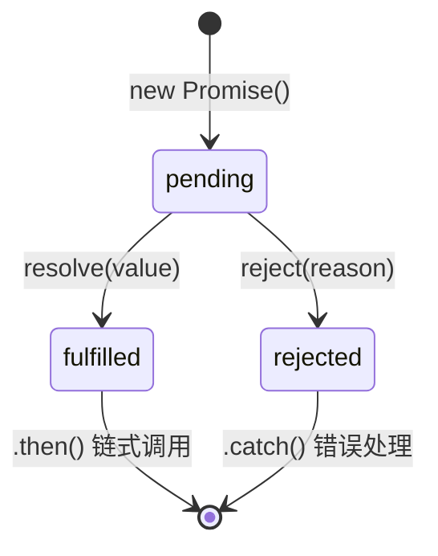

# JavaScript核心 - 综合场景串联

---

## 场景一：实现防抖节流工具类

### 场景描述
实现两个通用工具函数 debounce 和 throttle。debounce 在停止触发后等待一段时间执行一次，throttle 保证一段时间内只执行一次。要求支持立即执行选项、取消、取消防抖的能力。

```mermaid
%%{init: {'themeVariables': {'fontSize': '16px'}}}%%
flowchart TD
    subgraph debounce["防抖（debounce）"]
        A1["用户输入 'a'"] --> B1["启动定时器 300ms"]
        B1 --> C1["用户输入 'ab'"]
        C1 --> D1["清除旧定时器，重新计时 300ms"]
        D1 --> E1["用户输入 'abc'"]
        E1 --> F1["清除旧定时器，重新计时 300ms"]
        F1 --> G1["停止输入..."]
        G1 --> H1["300ms 后执行搜索"]
    end

    subgraph throttle["节流（throttle）"]
        A2["触发事件 0ms"] --> B2["立即执行"]
        B2 --> C2["触发事件 100ms"]
        C2 --> D2["忽略（间隔不足）"]
        D2 --> E2["触发事件 200ms"]
        E2 --> F2["忽略（间隔不足）"]
        F2 --> G2["触发事件 300ms"]
        G2 --> H2["间隔已到，执行"]
        H2 --> I2["触发事件 400ms"]
        I2 --> J2["忽略（间隔不足）"]
    end
```



> 上图展示了防抖和节流的执行时序差异：防抖只在最后一次触发后延迟执行，节流则按固定间隔执行，忽略两次间隔内的多余触发。

### 涉及知识点
- [语法基础与执行机制](./01-语法基础与执行机制.md)：闭包、作用域、this指向、arguments
- [异步编程与ES6+特性](./02-异步编程与ES6+特性.md)：箭头函数、定时器、剩余参数
- [常用API与手写原理](./03-常用API与手写原理.md)：setTimeout、clearTimeout

### 协作流程
1. debounce 实现流程：
   - 使用闭包保存定时器ID和是否已执行标记
   - 每次触发时清除现有定时器，重新设置新定时器
   - 如果 leading 配置为 true，首次立即执行
   - 如果 trailing 配置为 true，停止后等待执行一次
   - 添加 cancel 方法清除定时器，恢复初始状态

2. throttle 实现流程：
   - 使用闭包保存上次执行时间戳和定时器
   - 每次触发时计算当前时间与上次执行的时间差
   - 时间差大于等于等待时间则立即执行并更新时间戳
   - 否则设置定时器，等到剩余时间后执行
   - 添加 cancel 方法清除定时器

3. 测试验证：
   - 在窗口 resize、scroll 事件上测试防抖效果
   - 在按钮点击、mousemove 事件上测试节流效果
   - 测试立即执行选项和取消功能

### 关键要点
- this 指向处理：使用 apply 绑定正确的 this 到原函数
- 参数传递：将触发时的参数透传给原函数
-  leading 和 trailing 选项：理解不同组合的执行时机
- 定时器清理：每次调用都要清除旧定时器避免重复执行
- 防抖适合搜索输入联想、窗口大小变化重绘；节流适合滚动加载、按钮防重复点击

### 实现代码

```javascript
/**
 * debounce - 防抖函数
 * 在事件被触发 n 秒后再执行回调，如果在这 n 秒内又被触发，则重新计时。
 *
 * @param {Function} fn   - 需要防抖处理的函数
 * @param {number}   wait - 延迟毫秒数，默认 300
 * @param {Object}   options
 * @param {boolean}  options.leading  - 是否在首次触发时立即执行，默认 false
 * @param {boolean}  options.trailing - 是否在停止触发后执行，默认 true
 * @returns {Function} 包装后的防抖函数，附带 cancel() 方法
 */
function debounce(fn, wait = 300, options = {}) {
  const { leading = false, trailing = true } = options;

  let timerId = null;       // setTimeout 返回的定时器 ID
  let lastArgs = null;      // 保存最后一次调用的参数（用于 trailing 执行）
  let lastThis = null;      // 保存最后一次调用的 this 上下文
  let hasCalled = false;    // 标记 leading 是否已经执行过

  /** 实际执行传入的函数 */
  function invokeFunc() {
    fn.apply(lastThis, lastArgs);
    lastArgs = lastThis = null;
    hasCalled = true;       // 已执行过，后续 trailing 不会重复触发
  }

  /** 启动 trailing 定时器 */
  function startTimer() {
    return setTimeout(() => {
      // 如果 trailing 为 true 且尚未执行（leading 没触发，或触发后又来了新调用）
      if (trailing && lastArgs && !hasCalled) {
        invokeFunc();
      }
      timerId = null;
      hasCalled = false;    // 重置，为下一轮防抖做准备
    }, wait);
  }

  function debounced(...args) {
    lastArgs = args;
    lastThis = this;

    // 如果 leading 为 true 且当前没有活跃的定时器，立即执行
    const callNow = leading && !timerId;

    // 清除旧的定时器，重新计时
    if (timerId) {
      clearTimeout(timerId);
      timerId = null;
    }

    // 重置 hasCalled（因为又有新的触发，trailing 应该重新判断）
    hasCalled = false;

    // 启动新的定时器
    timerId = startTimer();

    // 立即执行（leading 模式）
    if (callNow) {
      invokeFunc();
    }
  }

  /** 取消当前的防抖定时器，恢复初始状态 */
  debounced.cancel = function () {
    if (timerId) {
      clearTimeout(timerId);
      timerId = null;
    }
    lastArgs = lastThis = null;
    hasCalled = false;
  };

  return debounced;
}

/**
 * throttle - 节流函数
 * 规定在一个单位时间内，只能触发一次函数。如果这个单位时间内触发多次，只有一次生效。
 *
 * @param {Function} fn   - 需要节流处理的函数
 * @param {number}   wait - 间隔毫秒数，默认 300
 * @param {Object}   options
 * @param {boolean}  options.leading  - 是否在首次触发时立即执行，默认 true
 * @param {boolean}  options.trailing - 是否在最后一次触发后补执行，默认 true
 * @returns {Function} 包装后的节流函数，附带 cancel() 方法
 */
function throttle(fn, wait = 300, options = {}) {
  const { leading = true, trailing = true } = options;

  let timerId = null;
  let lastArgs = null;
  let lastThis = null;
  let previous = 0;         // 上次执行的时间戳（0 表示从未执行过）

  /** 实际执行传入的函数 */
  function invokeFunc() {
    previous = leading ? Date.now() : 0; // 更新上次执行时间
    fn.apply(lastThis, lastArgs);
    lastArgs = lastThis = null;
  }

  /** 计算距离下次执行的剩余时间 */
  function remaining() {
    const elapsed = Date.now() - previous;
    return wait - elapsed;
  }

  /** 启动 trailing 定时器 */
  function startTimer() {
    return setTimeout(() => {
      timerId = null;
      if (trailing && lastArgs) {
        invokeFunc();
        // 执行后如果队列中还有等待，继续启动定时器
        if (lastArgs) {
          timerId = startTimer();
        }
      }
    }, remaining());
  }

  function throttled(...args) {
    lastArgs = args;
    lastThis = this;

    const timeSinceLast = Date.now() - previous;

    // 如果距离上次执行已经超过 wait，立即执行
    if (timeSinceLast >= wait || (!leading && previous === 0)) {
      if (timerId) {
        clearTimeout(timerId);
        timerId = null;
      }
      invokeFunc();
      return;
    }

    // 如果 trailing 为 true 且没有定时器在等待，启动一个
    if (trailing && !timerId) {
      timerId = startTimer();
    }
  }

  /** 取消节流定时器，恢复初始状态 */
  throttled.cancel = function () {
    if (timerId) {
      clearTimeout(timerId);
      timerId = null;
    }
    lastArgs = lastThis = null;
    previous = 0;
  };

  return throttled;
}

// ==================== 使用示例 ====================

// 1. 搜索框输入联想（防抖）
const searchInput = document.querySelector('#search-input');
const handleSearch = debounce((event) => {
  console.log('发起搜索请求：', event.target.value);
}, 300, { leading: false, trailing: true });

searchInput.addEventListener('input', handleSearch);

// 2. 窗口滚动加载更多（节流）
const handleScroll = throttle(() => {
  console.log('检查滚动位置，触发懒加载');
}, 200, { leading: true, trailing: false });

window.addEventListener('scroll', handleScroll);

// 3. 取消防抖/节流
// handleSearch.cancel();   // 取消等待中的防抖
// handleScroll.cancel();   // 取消等待中的节流
```

> **生活类比**：
> - **防抖（debounce）**：就像电梯关门——连续有人进电梯，门就一直不关，最后一个人进来后等几秒才关门。适合搜索框输入联想。
> - **节流（throttle）**：就像地铁发车——无论站台来了多少乘客，地铁固定间隔发一班车。适合滚动事件、鼠标移动。

---

## 场景二：实现一个符合Promise/A+规范的Promise

### 场景描述
从零实现一个符合 Promise/A+ 规范的 Promise，支持 then 链式调用、错误捕获、异步解析。理解 Promise 的内部状态机和 resolve 过程。

### 涉及知识点
- [异步编程与ES6+特性](./02-异步编程与ES6+特性.md)：Promise基本概念、回调函数
- [常用API与手写原理](./03-常用API与手写原理.md)：手写Promise原理
- [JavaScript核心笔面试题集](./04-JavaScript核心笔面试题集.md)：Promise相关题目

### 协作流程
1. 定义三种状态：pending、fulfilled、rejected，状态只能从pending转为fulfilled或rejected，且不可变
2. 在构造函数中接收 executor 函数，传入 resolve 和 reject 方法
3. resolve 方法：将状态改为fulfilled，保存value，执行所有onFulfilled回调
4. reject 方法：将状态改为rejected，保存reason，执行所有onRejected回调
5. then 方法：接收onFulfilled和onRejected，返回一个新Promise，实现链式调用
6. 解决then链式穿透：如果onFulfilled/onRejected不是函数，需要透传value/reason
7. 解析thenable对象：递归解析直到得到非Promise值，保证最终状态正确
8. 添加静态方法resolve、reject、all、race完成基本功能

### 关键要点
- 状态不可变：一旦从pending改变，就不能再改变
- 异步处理：如果executor中resolve是异步调用，需要先保存回调队列
- 链式返回：每次then必须返回新Promise，不能返回this
- 值穿透：then参数可选，如果省略需要透传值给下一级
- 错误处理：链式调用中任何一步出错都会被捕获并传给下一级onRejected
- 可以使用 promises-aplus-tests 测试套件验证是否符合规范

### Promise 状态机



> 上图展示了 Promise 的三种状态及其转换规则：初始状态为 pending，通过 resolve 转为 fulfilled，通过 reject 转为 rejected。状态一旦改变就不可逆，fulfilled 和 rejected 状态通过 .then() 和 .catch() 进行链式处理。

### 实现代码

```javascript
/**
 * MyPromise - 手写 Promise 实现（符合 Promise/A+ 规范核心逻辑）
 *
 * 三种状态：pending（等待中）、fulfilled（已成功）、rejected（已失败）
 * 状态转换规则：pending → fulfilled（不可逆），pending → rejected（不可逆）
 */
class MyPromise {
  /**
   * 构造函数
   * @param {Function} executor - 执行器函数 (resolve, reject) => void
   *        在构造函数中立即同步执行，传入 resolve 和 reject 两个方法
   */
  constructor(executor) {
    // ---- 内部状态定义 ----
    this.state = 'pending';        // 当前状态：'pending' | 'fulfilled' | 'rejected'
    this.value = undefined;        // 成功时的值（resolve 的实参）
    this.reason = undefined;       // 失败时的原因（reject 的实参）

    // 回调队列：因为 executor 中可能异步调用 resolve/reject，
    // 此时 .then() 已经执行过了，所以需要先把回调存起来，等状态变更后再执行
    this.onFulfilledCallbacks = []; // 成功回调队列
    this.onRejectedCallbacks = [];  // 失败回调队列

    // ---- resolve 方法 ----
    // 将 Promise 状态从 pending 变为 fulfilled
    const resolve = (value) => {
      // 【关键】状态只能从 pending 改变，一旦改变就不可逆
      if (this.state !== 'pending') return;

      this.state = 'fulfilled';
      this.value = value;

      // 执行所有注册的成功回调（异步回调在此刻被触发）
      this.onFulfilledCallbacks.forEach((callback) => callback());
    };

    // ---- reject 方法 ----
    // 将 Promise 状态从 pending 变为 rejected
    const reject = (reason) => {
      // 【关键】状态只能从 pending 改变，一旦改变就不可逆
      if (this.state !== 'pending') return;

      this.state = 'rejected';
      this.reason = reason;

      // 执行所有注册的失败回调
      this.onRejectedCallbacks.forEach((callback) => callback());
    };

    // 立即执行 executor 函数
    // 如果 executor 执行过程中抛出异常，直接 reject
    try {
      executor(resolve, reject);
    } catch (error) {
      reject(error);
    }
  }

  /**
   * then 方法 —— Promise 链式调用的核心
   *
   * @param {Function} onFulfilled - 成功回调，接收 value
   * @param {Function} onRejected  - 失败回调，接收 reason
   * @returns {MyPromise} 返回一个新的 MyPromise，实现链式调用
   */
  then(onFulfilled, onRejected) {
    // 【值穿透】如果 onFulfilled 不是函数，创建一个默认的透传函数
    // 这样 .then().then(v => console.log(v)) 中 v 可以正确传递
    onFulfilled =
      typeof onFulfilled === 'function' ? onFulfilled : (value) => value;

    // 【错误穿透】如果 onRejected 不是函数，创建一个默认的抛出函数
    // 这样错误可以一直向下传递，直到被 .catch() 捕获
    onRejected =
      typeof onRejected === 'function'
        ? onRejected
        : (reason) => {
            throw reason;
          };

    // 【关键】then 必须返回一个新的 Promise，实现链式调用
    // 不能返回 this，否则同一个 Promise 会被多次 resolve
    const promise2 = new MyPromise((resolve, reject) => {
      // 根据当前状态执行不同的处理逻辑

      if (this.state === 'fulfilled') {
        // 状态已经 fulfilled，直接处理
        // 使用 setTimeout 模拟微任务（Promise/A+ 规范要求回调异步执行）
        setTimeout(() => {
          try {
            // 执行 onFulfilled 回调，获取返回值 x
            const x = onFulfilled(this.value);
            // 对返回值 x 进行解析（处理 x 是普通值或 Promise 的情况）
            resolvePromise(promise2, x, resolve, reject);
          } catch (error) {
            // 如果 onFulfilled 执行出错，直接 reject
            reject(error);
          }
        }, 0);
      } else if (this.state === 'rejected') {
        // 状态已经 rejected，直接处理
        setTimeout(() => {
          try {
            const x = onRejected(this.reason);
            resolvePromise(promise2, x, resolve, reject);
          } catch (error) {
            reject(error);
          }
        }, 0);
      } else if (this.state === 'pending') {
        // 状态还是 pending（executor 中有异步操作），
        // 将回调存入队列，等待 resolve/reject 被调用时再执行
        this.onFulfilledCallbacks.push(() => {
          setTimeout(() => {
            try {
              const x = onFulfilled(this.value);
              resolvePromise(promise2, x, resolve, reject);
            } catch (error) {
              reject(error);
            }
          }, 0);
        });

        this.onRejectedCallbacks.push(() => {
          setTimeout(() => {
            try {
              const x = onRejected(this.reason);
              resolvePromise(promise2, x, resolve, reject);
            } catch (error) {
              reject(error);
            }
          }, 0);
        });
      }
    });

    return promise2;
  }

  /**
   * catch 方法 —— 用于捕获链式调用中的错误
   * 本质上是 then(undefined, onRejected) 的语法糖
   *
   * @param {Function} onRejected - 错误处理回调
   * @returns {MyPromise} 新的 Promise
   */
  catch(onRejected) {
    return this.then(undefined, onRejected);
  }

  // ==================== 静态方法 ====================

  /**
   * MyPromise.resolve(value)
   * 返回一个已成功的 Promise（如果 value 本身是 Promise 则直接返回）
   */
  static resolve(value) {
    if (value instanceof MyPromise) {
      return value;
    }
    return new MyPromise((resolve) => resolve(value));
  }

  /**
   * MyPromise.reject(reason)
   * 返回一个已失败的 Promise
   */
  static reject(reason) {
    return new MyPromise((_, reject) => reject(reason));
  }

  /**
   * MyPromise.all(promises)
   * 所有 Promise 都成功才成功，任意一个失败则立即失败
   *
   * @param {Array<MyPromise>} promises - Promise 数组
   * @returns {MyPromise<Array>} 所有结果的数组
   */
  static all(promises) {
    return new MyPromise((resolve, reject) => {
      const results = [];          // 按顺序收集结果
      let completedCount = 0;     // 已完成计数

      if (promises.length === 0) {
        resolve(results);          // 空数组直接 resolve
        return;
      }

      promises.forEach((promise, index) => {
        // 确保每个元素都是 Promise（处理非 Promise 值）
        MyPromise.resolve(promise).then(
          (value) => {
            // 按索引保存结果，保证顺序正确
            results[index] = value;
            completedCount++;

            // 全部完成时 resolve
            if (completedCount === promises.length) {
              resolve(results);
            }
          },
          (reason) => {
            // 任意一个失败，立即 reject
            reject(reason);
          }
        );
      });
    });
  }

  /**
   * MyPromise.race(promises)
   * 返回第一个完成的 Promise 的结果（无论成功还是失败）
   *
   * @param {Array<MyPromise>} promises - Promise 数组
   * @returns {MyPromise} 第一个完成的结果
   */
  static race(promises) {
    return new MyPromise((resolve, reject) => {
      promises.forEach((promise) => {
        // 谁先完成就用谁的结果
        MyPromise.resolve(promise).then(resolve, reject);
      });
    });
  }
}

/**
 * resolvePromise - 解析 then 回调的返回值
 *
 * 处理 then 回调返回值的各种情况：
 * 1. 返回值是普通值 → 直接 resolve
 * 2. 返回值是 Promise → 等它完成后再 resolve
 * 3. 返回值是当前 promise2 → 抛出循环引用错误
 *
 * @param {MyPromise} promise2 - then 返回的新 Promise
 * @param {*}         x        - onFulfilled/onRejected 的返回值
 * @param {Function}  resolve  - promise2 的 resolve
 * @param {Function}  reject   - promise2 的 reject
 */
function resolvePromise(promise2, x, resolve, reject) {
  // 【循环引用检测】如果 x 和 promise2 是同一个对象，抛出 TypeError
  // 例如：const p = promise.then(() => p) 会形成循环引用
  if (promise2 === x) {
    return reject(new TypeError('Chaining cycle detected for promise'));
  }

  // 如果 x 是 MyPromise 实例，采用它的状态
  if (x instanceof MyPromise) {
    x.then(resolve, reject);
    return;
  }

  // 如果 x 是对象或函数（可能是一个 thenable 对象）
  if (x !== null && (typeof x === 'object' || typeof x === 'function')) {
    let called = false; // 防止 resolve/reject 被多次调用

    try {
      const then = x.then;

      if (typeof then === 'function') {
        // x 是一个 thenable 对象，调用它的 then 方法
        then.call(
          x,
          (y) => {
            // thenable 的 resolve 回调
            if (called) return;
            called = true;
            // 递归解析，直到 y 不是 Promise/thenable
            resolvePromise(promise2, y, resolve, reject);
          },
          (r) => {
            // thenable 的 reject 回调
            if (called) return;
            called = true;
            reject(r);
          }
        );
      } else {
        // then 不是函数，x 是普通对象，直接 resolve
        resolve(x);
      }
    } catch (error) {
      if (called) return;
      called = true;
      reject(error);
    }
  } else {
    // x 是普通值（数字、字符串、null、undefined 等），直接 resolve
    resolve(x);
  }
}

// ==================== 使用示例 ====================

// 1. 基本使用
const promise1 = new MyPromise((resolve, reject) => {
  setTimeout(() => {
    resolve('成功数据');
  }, 1000);
});

promise1.then((value) => {
  console.log('收到数据：', value);        // 输出：收到数据：成功数据
  return value + ' → 经过处理';
}).then((value) => {
  console.log('链式传递：', value);        // 输出：链式传递：成功数据 → 经过处理
});

// 2. 错误处理
const promise2 = new MyPromise((resolve, reject) => {
  setTimeout(() => {
    reject(new Error('请求失败'));
  }, 500);
});

promise2
  .then((value) => {
    console.log('这不会执行');
  })
  .catch((error) => {
    console.error('捕获错误：', error.message); // 输出：捕获错误：请求失败
  });

// 3. MyPromise.all 并发示例
const tasks = [
  MyPromise.resolve(1),
  MyPromise.resolve(2),
  new MyPromise((resolve) => setTimeout(() => resolve(3), 300)),
];

MyPromise.all(tasks).then((results) => {
  console.log('全部完成：', results); // 输出：全部完成：[1, 2, 3]
});

// 4. 状态不可变验证
const promise3 = new MyPromise((resolve, reject) => {
  resolve('第一次 resolve');
  resolve('第二次 resolve');   // 不会生效，状态已经是 fulfilled
  reject(new Error('后续 reject')); // 也不会生效
});

promise3.then((value) => {
  console.log('只会输出第一次：', value); // 输出：只会输出第一次：第一次 resolve
});
```

---

## 常见错误

### 1. 防抖函数中使用了闭包过期的变量

防抖函数的核心是闭包，如果闭包中引用的变量在外部被修改，会导致不可预期的行为。

```javascript
// ❌ 错误示例：闭包中的变量被外部修改
let count = 0;

const handleInput = debounce(() => {
  // 此时 count 可能已经被外部多次修改，值不是触发时的值
  console.log('当前计数：', count);
}, 300);

// 用户快速输入过程中，count 持续递增
input.addEventListener('input', () => {
  count++; // 每次输入 count 都变了
  handleInput();
});

// ✅ 正确做法：将需要的值作为参数传入，通过闭包"快照"保存
const handleInput = debounce((currentCount) => {
  console.log('触发时的计数：', currentCount);
}, 300);

input.addEventListener('input', () => {
  count++;
  handleInput(count); // 参数会被保存到 lastArgs 中
});
```

> **核心原因**：debounce 的 `lastArgs` 保存的是调用时的参数快照，但闭包中直接引用的外部变量（如 `count`）是"活"的引用，读取的是最新值而非触发时的值。

### 2. Promise 中忘记 return，导致链式调用断裂

这是 Promise 链式调用中最常见的错误——在 `.then()` 回调中创建了 Promise 但没有 `return`，导致链式调用断裂。

```javascript
// ❌ 错误示例：忘记 return，链式调用断裂
fetchUser(userId)
  .then((user) => {
    // 这里创建了一个新 Promise，但没有 return！
    // 下一个 .then 拿到的是 undefined，而不是 userOrders
    fetchOrders(user.id).then((orders) => {
      console.log('订单数据：', orders);
    });
  })
  .then((result) => {
    // result 是 undefined！因为上一个 .then 没有 return
    console.log('这一步拿到的是：', result); // undefined
  });

// ✅ 正确做法：return 内部的 Promise
fetchUser(userId)
  .then((user) => {
    // 必须 return，才能将 Promise 的结果传递给下一个 .then
    return fetchOrders(user.id);
  })
  .then((orders) => {
    console.log('订单数据：', orders); // 正确获取到 orders
  });
```

> **核心原因**：`.then()` 返回的新 Promise 会采用回调函数中 `return` 的值作为 resolve 的参数。如果不 `return`，相当于 `return undefined`，导致数据丢失。

### 3. 手写 Promise 时 then 没有返回新 Promise

在实现手写 Promise 时，最容易犯的错误是让 `then` 返回 `this` 而不是新的 Promise 实例。

```javascript
// ❌ 错误示例：then 返回 this（同一个 Promise 实例）
class BadPromise {
  then(onFulfilled, onRejected) {
    // 错误：返回 this，意味着同一个 Promise 可以被多次 resolve
    // 第二次调用 .then() 时，state 已经是 fulfilled，无法再次触发
    if (this.state === 'fulfilled') {
      onFulfilled(this.value);
    }
    return this; // ← 错误！不能返回 this
  }
}

// 问题体现：
const p = new BadPromise((resolve) => resolve(1));
p.then((v) => console.log(v)); // 输出 1
p.then((v) => console.log(v)); // 不会输出！（因为 p 已经是 fulfilled 状态）

// ✅ 正确做法：每次 then 返回全新的 Promise
class GoodPromise {
  then(onFulfilled, onRejected) {
    // 返回一个新 Promise，每次调用 .then() 都是独立的链
    return new GoodPromise((resolve, reject) => {
      // ... 处理回调逻辑
    });
  }
}
```

> **核心原因**：Promise/A+ 规范要求每次 `then` 都返回一个新的 Promise，这样才能实现链式调用。如果返回 `this`，同一个 Promise 的状态只能变更一次，后续的 `.then()` 无法正常工作。

### 4. 混淆 async/await 与 Promise 的异常捕获

使用 `async/await` 时，如果忘记 `try/catch` 或混用 `.catch()`，会导致未捕获的 Promise 异常。

```javascript
// ❌ 错误示例：async 函数中忘记 try/catch
async function loadData() {
  const user = await fetchUser();  // 如果 fetchUser 抛出异常，这里会中断
  const orders = await fetchOrders(user.id); // 这行永远不会执行
  return { user, orders };
}

// 调用方可能以为已经处理了错误，但实际上没有
loadData(); // 未捕获的 Promise rejection！

// ❌ 错误示例：try/catch 包裹了 await，但没处理非 await 的 Promise
async function loadData() {
  try {
    const promise = fetchUser(); // 没有 await，错误不会被 catch
    // 做一些其他操作...
    const user = await promise;  // 错误在这里才抛出，但已经被 try 包裹
  } catch (err) {
    console.log('捕获不到错误！');
  }
}

// ✅ 正确做法 1：统一使用 try/catch
async function loadData() {
  try {
    const user = await fetchUser();
    const orders = await fetchOrders(user.id);
    return { user, orders };
  } catch (err) {
    console.error('数据加载失败：', err);
    throw err; // 或者返回默认值
  }
}

// ✅ 正确做法 2：在调用方使用 .catch()
loadData().catch((err) => {
  console.error('数据加载失败：', err);
});

// ✅ 正确做法 3：使用 async 函数的自动包装
async function loadData() {
  const user = await fetchUser().catch(err => {
    console.error('fetchUser 失败', err);
    return null; // 返回默认值，继续流程
  });
  if (!user) return null;
  const orders = await fetchOrders(user.id);
  return { user, orders };
}
```

> **核心原因**：`async` 函数会自动将返回值包装为 Promise，但内部的异常也需要显式处理。混用 `await` 和 `.catch()` 时，要清楚每一层的错误由谁处理，避免遗漏。

---

> [返回模块目录](../README.md) | [返回知识导览](../知识导览.md)