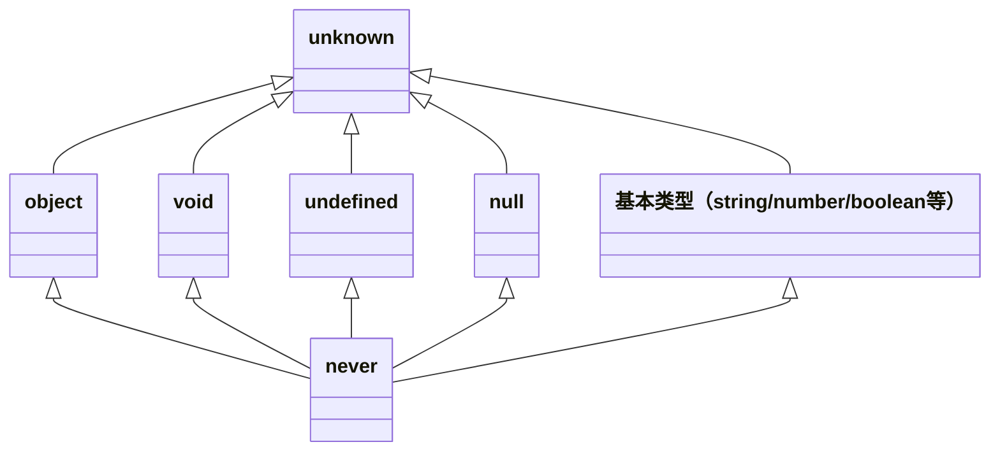

# 高级类型与工程配置

> 模块：03-typescript（第3周 TypeScript）
> 定位：高级原理篇
> 推荐阅读时间：90分钟

---

## 核心概念

TypeScript 的高级类型建立在基础类型系统之上，通过类型组合、条件判断、类型推导等能力实现复杂的类型变换。这些特性让 TypeScript 能够精确描述复杂的数据结构，实现更强的类型安全。

同时，合理配置 `tsconfig.json` 是 TypeScript 工程化实践的基础，正确的配置可以帮助我们在开发阶段提前发现更多问题。

> **生活化类比（泛型）**：超市储物柜——柜子本身不关心你存什么（类型参数 `T`），但取出来时知道是什么东西（类型推断）。你存的是包，取出来就是包；你存的是手机，取出来就是手机。泛型让代码在保持类型安全的同时支持多种类型。

---

## 底层原理

### 1. 条件类型

条件类型的语法是 `T extends U ? X : Y`，如果 `T` 能赋值给 `U`，结果就是 `X`，否则就是 `Y`。

```typescript
// 基础用法
type IsString<T> = T extends string ? true : false;

type A = IsString<string>; // true
type B = IsString<number>; // false
```

**分布式条件类型**：当 `T` 是联合类型时，条件类型会自动分发到每个成员上计算，最终结果是所有结果的联合。

```typescript
type ToArray<T> = T extends unknown ? T[] : never;

// 分布式计算：(string[] | number[])
type C = ToArray<string | number>;
// 相当于 string[] | number[]，而不是 (string | number)[]
```

如果不想分发，可以用 `[T] extends [U]` 包裹：

```typescript
type ToArrayNonDistributed<T> = [T] extends [any] ? T[] : never;
type D = ToArrayNonDistributed<string | number>;
// 结果是 (string | number)[]
```

### 2. 映射类型

映射类型可以遍历一个类型的所有属性，然后对每个属性做变换。

```typescript
// 基础语法：把 T 的所有属性都变成可选
type MyPartial<T> = {
  [K in keyof T]?: T[K];
};
```

TypeScript 内置了几个常用的映射类型：

- `Partial<T>` - 所有属性变成可选
- `Required<T>` - 所有属性变成必选
- `Readonly<T>` - 所有属性变成只读
- `Pick<T, K>` - 挑选出指定属性

```typescript
// Partial 的实现原理
type Partial<T> = {
  [P in keyof T]?: T[P];
};

// Required 的实现原理
type Required<T> = {
  [P in keyof T]-?: T[P];
};

// Readonly 的实现原理
type Readonly<T> = {
  readonly [P in keyof T]: T[P];
};

// Pick 的实现原理
type Pick<T, K extends keyof T> = {
  [P in K]: T[P];
};
```

### 3. infer 关键字

`infer` 关键字用于在条件类型中推导类型，最常用于提取嵌套类型。

```typescript
// 提取函数返回类型
type ReturnType<T extends (...args: any) => any> = 
  T extends (...args: any) => infer R ? R : any;

// 提取函数参数类型
type Parameters<T extends (...args: any) => any> = 
  T extends (...args: infer P) => any ? P : never;
```

示例使用：

```typescript
function foo(x: number, y: string) {
  return { x, y };
}

type FooReturn = ReturnType<typeof foo>; 
// { x: number; y: string }

type FooParams = Parameters<typeof foo>;
// [x: number, y: string]
```

### 4. 常用工具类型详解

这里给出所有常用内置工具类型的实现和用法：

```typescript
// Partial<T> - 将所有属性变为可选
type MyPartial<T> = { [K in keyof T]?: T[K] };
// 用法：interface User { name: string; age: number; }
// type PartialUser = Partial<User>; // { name?: string; age?: number }

// Required<T> - 将所有属性变为必选
type MyRequired<T> = { [K in keyof T]-?: T[K] };
// -? 移除可选标记

// Readonly<T> - 将所有属性变为只读
type MyReadonly<T> = { readonly [K in keyof T]: T[K] };

// Pick<T, K> - 从 T 中挑选出 K 属性
type MyPick<T, K extends keyof T> = { [P in K]: T[P] };

// Omit<T, K> - 从 T 中移除 K 属性，剩下的返回
type MyOmit<T, K extends keyof T> = Pick<T, Exclude<keyof T, K>>;

// Record<K, V> - 构造一个对象类型，键是 K，值是 V
type MyRecord<K extends keyof any, V> = { [P in K]: V };
// 用法：type UserMap = Record<string, User>;

// Exclude<T, U> - 从 T 中排除可以赋值给 U 的成员
type MyExclude<T, U> = T extends U ? never : T;
// 用法：type T = Exclude<'a' | 'b' | 'c', 'a' | 'b'>; // 'c'

// Extract<T, U> - 从 T 中提取可以赋值给 U 的成员
type MyExtract<T, U> = T extends U ? T : never;
// 用法：type T = Extract<'a' | 'b' | 'c', 'a' | 'b'>; // 'a' | 'b'

// NonNullable<T> - 排除 null 和 undefined
type MyNonNullable<T> = Exclude<T, null | undefined>;

// ReturnType<T> - 获取函数返回类型
type MyReturnType<T extends (...args: any) => any> = 
  T extends (...args: any) => infer R ? R : any;

// Parameters<T> - 获取函数参数组成的元组类型
type MyParameters<T extends (...args: any) => any> = 
  T extends (...args: infer P) => any ? P : never;
```

### 5. 类型体操入门

这里展示几个经典的类型体操题目：

**题目1：实现 DeepReadonly，将对象所有层级的属性都变为只读**

```typescript
type DeepReadonly<T> = {
  readonly [P in keyof T]: T[P] extends object 
    ? T[P] extends Function 
      ? T[P] 
      : DeepReadonly<T[P]> 
    : T[P];
};

// 测试
type Obj = { a: { b: string } };
type DeepReadonlyObj = DeepReadonly<Obj>;
// { readonly a: { readonly b: string } }
```

**题目2：实现 TupleToUnion，将元组转为联合类型**

```typescript
type TupleToUnion<T extends any[]> = T[number];

// 测试
type T1 = TupleToUnion<[string, number, boolean]>;
// T1 = string | number | boolean
```

**题目3：实现 IsEqual，判断两个类型是否相等**

```typescript
type IsEqual<A, B> = (<T>() => T extends A ? 1 : 2) extends 
  (<T>() => T extends B ? 1 : 2) ? true : false;

// 测试
type E1 = IsEqual<string, string>; // true
type E2 = IsEqual<string, number>; // false
```

### 6. 装饰器

> **版本说明**：TypeScript 支持两种装饰器语法：（1）**实验性装饰器**（legacy，需 `experimentalDecorators: true`），使用 `target`、`propertyKey`、`descriptor` 三参数模式；（2）**Stage 3 标准装饰器**（TS 5.0+），使用 `context` 对象模式，语法有显著差异。以下示例基于实验性装饰器。

装饰器是一种特殊类型的声明，可以附加到类、方法、属性、参数上，用来修改类的行为。

```typescript
// 类装饰器
function loggedClass<T extends { new(...args: any[]): {} }>(constructor: T) {
  return class extends constructor {
    newProperty = "new property";
    hello = "override";
  };
}

@loggedClass
class Person {
  name: string;
  constructor(name: string) {
    this.name = name;
  }
}
```

```typescript
// 方法装饰器
function log(target: any, propertyKey: string, descriptor: PropertyDescriptor) {
  const original = descriptor.value;
  descriptor.value = function(...args: any[]) {
    console.log(`Calling ${propertyKey} with`, args);
    return original.apply(this, args);
  };
  return descriptor;
}

class Calculator {
  @log
  add(a: number, b: number) {
    return a + b;
  }
}

new Calculator().add(1, 2); // 会打印日志
```

```typescript
// 属性装饰器
function defaultValue(value: any) {
  return function (target: any, propertyKey: string) {
    target[propertyKey] = value;
  };
}

class Settings {
  @defaultValue(true)
  enableCache!: boolean;
}
```

```typescript
// 装饰器工厂
function Enumerable(value: boolean) {
  return function (target: any, propertyKey: string, descriptor: PropertyDescriptor) {
    descriptor.enumerable = value;
    return descriptor;
  };
}

// 使用
class MyClass {
  @Enumerable(false)
  get something() { return 1; }
}
```

### 7. tsconfig.json 核心配置

```json
{
  "compilerOptions": {
    // 严格模式，开启所有严格类型检查选项
    "strict": true,
    
    // 指定编译后的 JavaScript 版本
    "target": "ES2020",
    
    // 指定模块生成方式
    "module": "ESNext",
    
    // 路径别名
    "paths": {
      "@/*": ["./src/*"]
    },
    
    // 是否生成 .d.ts 声明文件
    "declaration": true,
    
    // 是否允许从 CommonJS 模块默认导入，解决兼容性问题
    "esModuleInterop": true,
    
    // 报告未使用的局部变量错误
    "noUnusedLocals": true,
    
    // 报告未使用的参数错误
    "noUnusedParameters": true
  },
  
  // 包含哪些文件
  "include": ["src/**/*"],
  
  // 排除哪些文件
  "exclude": ["node_modules", "dist"]
}
```

**关键配置说明：**

- `strict: true`：开启所有严格类型检查，新项目建议始终开启。包含 `noImplicitAny`、`strictNullChecks`、`strictFunctionTypes`、`strictBindCallApply`、`strictPropertyInitialization`、`noImplicitThis`、`alwaysStrict` 等选项。
- `target`：控制输出 JS 的语法版本，现代项目推荐 `ES2020`+。
- `module`：指定模块系统，使用 bundler（Vite/Webpack）时推荐 `ESNext`。
- `paths`：配置路径别名，需要和打包工具配合使用。
- `declaration`：是否生成 `.d.ts` 文件，开发库时需要开启。
- `esModuleInterop`：开启后可以 `import React from 'react'` 代替 `import * as React from 'react'`，解决 CommonJS 和 ESModule 互操作性问题。
- `noUnusedLocals` / `noUnusedParameters`：检查未使用的变量和参数，帮助保持代码整洁。

### TypeScript 类型层级结构



`unknown` 位于类型层级的最顶端，是 TypeScript 的**顶层类型**（Top Type），任何类型都可以赋值给 `unknown`；而 `never` 位于最底端，是**底层类型**（Bottom Type），`never` 可以赋值给任何类型。`object`、`void`、`undefined`、`null` 以及所有基本类型都处于中间层级，它们各自是 `unknown` 的子类型，同时又是 `never` 的父类型。

### 8. TypeScript 4.9+ 新特性

#### 8.1 `satisfies` 关键字（TS 4.9+）

`satisfies` 关键字用于验证表达式的类型是否匹配某个类型，同时保留该表达式更精确的推断类型。与 `as` 类型断言不同，`satisfies` 不会丢失类型信息。

**核心区别**：`as` 是"强制断言"，告诉编译器"相信我，就是这个类型"；`satisfies` 是"类型检查+保留推断"，告诉编译器"请检查我的类型是否满足这个约束，但请保留我实际更精确的类型"。

```typescript
// 问题场景：使用 as 会丢失精确类型信息
type Color = 'red' | 'green' | 'blue';
type RGB = [number, number, number];

const palette1 = {
  red: [255, 0, 0],
  green: '#00ff00',
  blue: [0, 0, 255],
} as Record<Color, RGB | string>;
// palette1.red 的类型是 RGB | string，丢失了数组的精确类型
// palette1.red[0]  // 类型为 number | string，访问时类型变宽

// 使用 satisfies：类型检查 + 类型推断保留
const palette2 = {
  red: [255, 0, 0],
  green: '#00ff00',
  blue: [0, 0, 255],
} satisfies Record<Color, RGB | string>;
// palette2.red 的类型被保留为 number[]（而非 RGB | string 联合类型）
// palette2.red[0]  // 类型为 number（而非 number | string）
// palette2.green 的类型被保留为 string（而非 RGB | string 联合类型）
// 同时 palette2 仍然满足 Record<Color, RGB | string> 约束

// 如果某个属性不满足约束，编译时会报错
const palette3 = {
  red: [255, 0, 0],
  green: '#00ff00',
  // blue: 42,  // 编译错误：42 不满足 RGB | string
} satisfies Record<Color, RGB | string>;
```

**`satisfies` vs `as` 对比**：

| 特性 | `as` 断言 | `satisfies` |
|------|----------|-------------|
| 类型检查 | 宽松，可强制转换 | 严格，必须满足约束 |
| 类型推断 | 丢失精确类型 | 保留精确类型 |
| 类型安全 | 低，可能绕过检查 | 高，编译时保证 |
| 适用场景 | 需要强制类型转换 | 需要验证类型同时保留精确类型 |

**常见使用场景**：

```typescript
// 场景1：定义配置对象，同时保留字面量类型
type Config = {
  [key: string]: { timeout: number; retries: number };
};

const appConfig = {
  api: { timeout: 3000, retries: 3 },
  cache: { timeout: 1000, retries: 1 },
} satisfies Config;
// appConfig.api.timeout 的类型是 number（保留推断类型），同时 appConfig 满足 Config 约束

// 场景2：定义联合类型的值映射，保持每个值的精确类型
type Status = 'pending' | 'active' | 'done';
const statusMap = {
  pending: { label: '待处理', color: 'orange' },
  active: { label: '进行中', color: 'blue' },
  done: { label: '已完成', color: 'green' },
} satisfies Record<Status, { label: string; color: string }>;
// statusMap.pending.color 的类型是 string（保留推断类型），而非 RGB | string 联合类型
```

#### 8.2 `const` 类型参数（TS 5.0+）

`const` 类型参数允许在泛型函数中声明 const 修饰的类型参数，使得传入的字面量参数被推断为它们最窄（const）的类型，而不是被拓宽为基本类型。

```typescript
// 传统写法：使用 as const 断言
function getValues<T>(items: T[]): T[] {
  return items;
}
// 调用时需要手动 as const
const result1 = getValues(['a', 'b', 'c'] as const);
// 结果类型：readonly ['a', 'b', 'c']

// 如果不加 as const，类型会被拓宽
const result2 = getValues(['a', 'b', 'c']);
// 结果类型：string[]，丢失了字面量信息

// TS 5.0+ const 类型参数：函数声明时指定
// 注意：参数类型必须是 T 本身（而非 T[]），才能推断出元组类型
function getValuesConst<const T extends readonly string[]>(items: T): T {
  return items;
}
const result3 = getValuesConst(['a', 'b', 'c']);
// 结果类型：readonly ['a', 'b', 'c']，无需手动 as const！
```

**实际应用场景**：

```typescript
// 场景1：实现类似 Object.keys 但保留精确键类型
function objectKeys<const T extends Record<string, unknown>>(obj: T): (keyof T)[] {
  return Object.keys(obj) as (keyof T)[];
}

const user = { name: '张三', age: 18, email: 'zhangsan@example.com' };
const keys = objectKeys(user);
// keys 的类型是 ('name' | 'age' | 'email')[]，而不是 string[]

// 场景2：创建类型安全的枚举映射函数
function createEnum<const T extends readonly string[]>(values: T): { [K in T[number]]: K } {
  const result = {} as { [K in T[number]]: K };
  for (const value of values) {
    result[value as T[number]] = value;
  }
  return result;
}
const statusEnum = createEnum(['pending', 'active', 'done'] as const);
// 老写法：需要手动 as const
// 新写法（如果用 const 类型参数）：const statusEnum = createEnum(['pending', 'active', 'done']);
// statusEnum 的类型：{ pending: 'pending'; active: 'active'; done: 'done' }

// 场景3：防止数组字面量被推断为可变数组
function useTuple<const T extends readonly unknown[]>(tuple: T): T {
  return tuple;
}
const coords = useTuple([10, 20]);
// coords 的类型是 readonly [10, 20]，而不是 number[]
```

#### 8.3 `noInfer<T>` 工具类型（TS 5.4+）

`noInfer<T>` 用于阻止 TypeScript 从泛型参数中推断类型。当你希望某个泛型参数的类型由其他参数或显式注解决定，而不是从当前参数推断时，使用 `noInfer`。

```typescript
// 问题场景：泛型参数被意外推断
function createLogger<T>(levels: T[], defaultLevel: T): { levels: T[]; default: T } {
  return { levels, default: defaultLevel };
}

// 调用时，T 从 levels 和 defaultLevel 同时推断
const logger = createLogger(['error', 'warn', 'info'], 'info');
// T 被推断为 'error' | 'warn' | 'info'
// 这是期望的行为，但有时我们不希望这样

// 使用 noInfer：阻止从 defaultLevel 推断 T
function createLoggerSafe<T>(levels: T[], defaultLevel: noInfer<T>): { levels: T[]; default: T } {
  return { levels, default: defaultLevel };
}

const logger2 = createLoggerSafe(['error', 'warn', 'info'], 'info');
// T 仅从 levels 推断为 'error' | 'warn' | 'info'
// defaultLevel 本身不参与推断，只被检查是否满足 T
// 如果 defaultLevel 不在 T 的范围内，编译报错
// createLoggerSafe(['error', 'warn'], 'info'); // 错误：'info' 不在 'error' | 'warn' 中
```

**常见使用场景**：

```typescript
// 场景1：函数参数中某个参数不参与类型推断
function select<T>(items: T[], predicate: (item: noInfer<T>) => boolean): T[] {
  return items.filter(predicate);
}

const items = [{ id: 1, name: 'A' }, { id: 2, name: 'B' }];
const result = select(items, item => item.id > 1);
// T 从 items 推断为 { id: number; name: string }
// predicate 参数不参与 T 的推断

// 场景2：确保回调参数类型由外部注入而非内部推断
interface EventMap {
  click: { x: number; y: number };
  keydown: { key: string };
}
function onEvent<K extends keyof EventMap>(type: K, handler: (e: noInfer<EventMap[K]>) => void): void {
  // ...
}
// handler 的类型由 type 决定，不会从 handler 回调中意外推断 K
onEvent('click', (e) => {
  console.log(e.x, e.y); // e 的类型由 'click' 确定
});
```

#### 8.4 `using` 声明（TS 5.2+，Explicit Resource Management）

`using` 声明是 TypeScript 5.2 引入的显式资源管理语法，基于 TC39 的 Explicit Resource Management 提案。它允许声明一个在作用域结束时自动清理的资源，类似于 C# 的 `using` 或 Python 的 `with` 语句。

```typescript
// 使用 using 声明：资源在离开作用域时自动释放
{
  using file = new MyFileHandle('path/to/file');
  // 使用 file 进行操作...
  file.write('hello');
  // 当离开这个代码块时，file[Symbol.dispose]() 会自动被调用
}
// 此时 file 已经被自动释放

// 等价于传统 try-finally 写法
{
  const file = new MyFileHandle('path/to/file');
  try {
    file.write('hello');
  } finally {
    file[Symbol.dispose]();
  }
}
```

**实现 `Symbol.dispose` 接口**：

```typescript
// 使用 Symbol.dispose 实现同步清理
class MyFileHandle implements Disposable {
  private fd: number;

  constructor(path: string) {
    this.fd = openFile(path);
    console.log(`文件已打开：${path}`);
  }

  write(data: string): void {
    console.log(`写入数据：${data}`);
  }

  [Symbol.dispose](): void {
    closeFile(this.fd);
    console.log('文件已关闭（自动清理）');
  }
}

// 使用 using 声明
function processFile() {
  using file = new MyFileHandle('data.txt');
  file.write('hello world');
  // 函数结束时自动调用 file[Symbol.dispose]()
}
```

**异步资源清理：`await using`**：

```typescript
// 使用 Symbol.asyncDispose 实现异步清理
class DatabaseConnection implements AsyncDisposable {
  private connected: boolean = false;

  async connect(): Promise<void> {
    this.connected = true;
    console.log('数据库连接已建立');
  }

  async query(sql: string): Promise<void> {
    console.log(`执行查询：${sql}`);
  }

  async [Symbol.asyncDispose](): Promise<void> {
    if (this.connected) {
      console.log('数据库连接已关闭（异步清理）');
      this.connected = false;
    }
  }
}

// 使用 await using 声明异步资源
async function queryDatabase() {
  await using db = new DatabaseConnection();
  await db.connect();
  await db.query('SELECT * FROM users');
  // 函数结束时自动调用 await db[Symbol.asyncDispose]()
}
```

**DisposableStack：组合多个资源**：

```typescript
// 使用 DisposableStack 管理多个资源
function processMultipleResources() {
  using stack = new DisposableStack();

  const file1 = stack.use(new MyFileHandle('file1.txt'));
  const file2 = stack.use(new MyFileHandle('file2.txt'));
  // 当 stack 被释放时，file1 和 file2 的 dispose 都会按 LIFO 顺序被调用
  // 释放顺序：file2 → file1 → stack
}
```

**核心优势**：

| 传统 try-finally | `using` 声明 |
|------------------|-------------|
| 需要手动编写 try-finally 模板代码 | 编译器自动生成清理代码 |
| 多个资源时嵌套层级深 | 多个 using 声明平铺，可读性好 |
| 容易遗漏 finally 清理 | 编译时强制实现 Disposable 接口 |
| 清理顺序需要手动管理 | DisposableStack 自动按 LIFO 顺序清理 |

> 📖 **参考链接**：
> - [TypeScript官方文档 - 条件类型（Conditional Types）](https://www.typescriptlang.org/docs/handbook/2/conditional-types.html)
> - [TypeScript官方文档 - 映射类型（Mapped Types）](https://www.typescriptlang.org/docs/handbook/2/mapped-types.html)
> - [TypeScript官方文档 - tsconfig.json](https://www.typescriptlang.org/docs/handbook/tsconfig-json.html)
> - [TypeScript官方文档 - 模块解析](https://www.typescriptlang.org/docs/handbook/module-resolution.html)

---

---

## 实战应用

### 1. 在实际项目中使用工具类型

```typescript
// 定义用户接口
interface User {
  id: number;
  name: string;
  email: string;
  password: string;
}

// 创建用户时不需要 id，用 Omit 移除
type CreateUserRequest = Omit<User, 'id'>;

// 更新用户时所有字段都是可选，用 Partial
type UpdateUserRequest = Partial<User>;

// 用户字典，用 Record
type UserMap = Record<number, User>;

// 从 User 中挑选出安全字段（不包含密码）
type SafeUser = Pick<User, 'id' | 'name' | 'email'>;
```

### 2. 使用映射类型批量转换类型

```typescript
// 将所有字段变成 Promise
type ToPromise<T> = {
  [K in keyof T]: Promise<T[K]>;
};

// 所有方法都变成异步
type AsyncApi<T> = {
  [K in keyof T]: T[K] extends (...args: infer Args) => infer Ret
    ? (...args: Args) => Promise<Ret>
    : never;
};
```

### 3. 工程化配置最佳实践

新项目推荐配置：

```json
{
  "compilerOptions": {
    "strict": true,
    "target": "ES2020",
    "module": "ESNext",
    "moduleResolution": "bundler",
    "skipLibCheck": true,
    "esModuleInterop": true,
    "forceConsistentCasingInFileNames": true,
    "resolveJsonModule": true,
    "isolatedModules": true,
    "noUnusedLocals": true,
    "noUnusedParameters": true,
    "noFallthroughCasesInSwitch": true
  },
  "include": ["src"],
  "exclude": ["node_modules"]
}
```

---

## 常见面试题

### Q1: 什么是分布式条件类型？什么时候会触发？

A: 当条件类型的第一个参数是联合类型，并且是裸类型（没有被数组/元组包裹）时，TypeScript 会自动分发条件类型到联合类型的每个成员分别计算，最后把结果合并成联合类型。这就是分布式条件类型。如果不想分发，可以用 `[T] extends [U]` 包裹。

### Q2: Partial 和 Required 的实现原理是什么？

A: 使用映射类型遍历 `keyof T`，对每个属性进行变换。`Partial` 加上 `?` 变成可选，`Required` 用 `-?` 移除可选标记。

### Q3: infer 关键字的作用是什么？

A: `infer` 用于在条件类型中推导类型，可以提取出嵌套在其他类型中的子类型，比如提取函数返回类型、参数类型等。这是实现很多高级工具类型的基础。

### Q4: tsconfig 中 strict 模式都包含哪些内容？为什么建议开启？

A: strict 是一组严格类型检查选项的集合，包括 `noImplicitAny`、`strictNullChecks`、`strictFunctionTypes`、`strictBindCallApply`、`strictPropertyInitialization`、`noImplicitThis`、`alwaysStrict`。开启 strict 可以让 TypeScript 提供更强的类型检查，提前发现更多潜在错误，提升代码质量。新项目强烈建议始终开启。

### Q5: 装饰器的使用场景有哪些？

A: 装饰器可以用来在不修改原代码的情况下给类/方法/属性添加额外功能，常见场景：日志记录、性能监控、缓存、权限控制、依赖注入、数据校验等。

---

## 避坑指南

| 常见错误 | 现象 | 原因 | 解决方案 |
|---------|------|------|----------|
| 不理解分布式条件类型 | 得到的是联合类型而不是元组，和预期不符 | 不知道裸联合类型会自动分发 | 需要整体判断时用 `[T] extends [U]` 包裹 |
| infer 位置写错 | 不能推导，报语法错误 | 不理解 infer 只能在条件类型的 extends 子句中使用 | 把 infer 放在 extends 那边 |
| 映射类型中 keyof 使用错误 | 遍历得不到正确的键 | 混淆了 `T` 和 `keyof T` | 映射遍历的是 `keyof T`，不是 `T` |
| 开启 strict 后一堆错误 | 项目升级 TS 后，strictNullChecks 报错很多 | 老项目没有严格的类型习惯 | 逐步修复，对于确实可能为 null 的地方加上空检查 |
| paths 不生效 | IDE 找不到路径别名对应的文件 | 只配置了 TS，没配置打包工具 | tsconfig 配置 paths 后，还需要在 vite/webpack 中也配置别名 |
| 装饰器不生效 | 编译报错，找不到装饰器语法 | 没有开启 experimentalDecorators | 在 tsconfig 中开启 `experimentalDecorators: true` |
| 声明文件 d.ts 不会写 | 不知道怎么给第三方 JS 库写类型定义 | 不理解 ambient declaration 语法 | 使用 `declare module 'xxx' { ... }` 声明模块 |
| exclude 不生效 | node_modules 里的文件还是被编译了 | exclude 写法不正确 | 写成 `"exclude": ["node_modules"]` 就够了，不需要 `node_modules/**/*` |

---

## TypeScript 5.7 / 5.8 新特性

TypeScript 持续演进，以下是 5.7 和 5.8 版本中值得关注的重要新特性。

### TypeScript 5.7 新特性

#### 1. `--erasableSyntaxOnly` 选项

用于阻止使用 `enum`、`namespace`、`constructor parameter properties` 等在编译后需要生成运行时代码的 TypeScript 特有语法，确保源文件只包含可被简单擦除的类型注解。

```jsonc
// tsconfig.json
{
  "compilerOptions": {
    "erasableSyntaxOnly": true
    // 开启后，使用 enum 或 namespace 将报错
  }
}
```

```typescript
// ❌ erasableSyntaxOnly 模式下报错
enum Color { Red, Green, Blue }        // enum 不是"可擦除"语法
namespace Utils { }                     // namespace 不是"可擦除"语法

// ✅ 使用替代方案
const Color = { Red: 0, Green: 1, Blue: 2 } as const;
type Color = (typeof Color)[keyof typeof Color];
```

> **适用场景**：项目使用 Node.js 原生 TypeScript 剥离（如 Node.js 的 `--experimental-strip-types`）、使用 `@swc` 或 `esbuild` 等仅做类型擦除的编译器时，该选项可以确保代码不会意外引入需要运行时转换的 TS 语法。

#### 2. 未初始化变量检查增强

TypeScript 5.7 对未初始化变量的检查更加严格，特别是对数组方法的闭包中的变量。

```typescript
// TypeScript 5.7 之前：不报错（但运行时可能为 undefined）
// TypeScript 5.7：对未初始化变量的检查更精确
let result: number[];
[1, 2, 3].forEach(() => {
  result.push(0); // 5.7 中会报错：变量 'result' 在赋值前被使用
});
```

#### 3. 相对路径重写的改进

`--module nodenext` 模式下，TypeScript 5.7 改进了相对路径的导入重写逻辑，更好地匹配 Node.js 的模块解析行为。

```typescript
// 使用 --module nodenext 时，导入路径需要明确写出文件扩展名
import { helper } from './utils.js';  // 需要 .js 扩展名（即使源文件是 .ts）
```

### TypeScript 5.8 新特性

#### 1. `--module nodenext` 增强

TypeScript 5.8 进一步强化了 `--module nodenext` 的输出稳定性，改进了 `package.json` 中 `"exports"` 字段的条件解析，更好地支持 Node.js ESM 和 CJS 双模式。

```jsonc
// package.json - 条件导出
{
  "exports": {
    ".": {
      "import": "./dist/index.mjs",
      "require": "./dist/index.cjs",
      "types": "./dist/index.d.ts"
    }
  }
}
```

#### 2. 条件类型推断优化

TypeScript 5.8 对条件类型的推断算法进行了优化，减少了某些边界情况下的"循环"检测误报。

```typescript
// 5.8 中，以下复杂条件类型能够正确推断，不再触发"类型实例化过深"错误
type DeepExtract<T> = T extends object
  ? { [K in keyof T]: DeepExtract<T[K]> }
  : T;
```

#### 3. 性能提升

TypeScript 5.8 在 `--watch` 模式和增量编译方面有显著性能提升，特别是在大型项目中：

- `--watch` 模式下重新编译速度提升约 20%
- `--incremental` 构建时 `.tsbuildinfo` 文件体积更小
- 类型检查内存占用优化

#### 4. `--strictBuiltinIteratorReturn` 选项

新增的严格模式选项，确保 `Iterator` 的 `next()` 方法返回值类型正确。

```typescript
// tsconfig.json
{
  "compilerOptions": {
    "strictBuiltinIteratorReturn": true
  }
}
```

### TypeScript 5.9 新特性（2025 年 8 月发布）

TypeScript 5.9 于 2025 年 8 月 1 日正式发布，引入了多项重要特性。

#### 1. `import defer` 支持（Stage 3 提案）

`import defer` 是 ECMAScript Stage 3 提案，TypeScript 5.9 率先支持。它允许延迟执行导入的模块，直到模块被实际使用：

```typescript
// import defer：延迟加载重型模块，首屏不阻塞
import defer * as heavyModule from './heavy-module.js';

// 只有在实际调用时才执行模块代码
const result = heavyModule.heavyCalculation(data); // 此时才加载并执行 heavy-module
```

**适用场景**：
- 首屏不需要的辅助功能模块（如反馈表单、聊天组件）
- 条件渲染的组件（如 Modal、Drawer）
- 性能敏感场景下的代码分割优化

#### 2. `--module node20` 选项

新增 `--module node20` 选项，支持 Node.js 20+ 的原生 ESM 解析规则：

```json
{
  "compilerOptions": {
    "module": "node20",
    "moduleResolution": "node20"
  }
}
```

#### 3. `ArrayBuffer` 类型增强

TypeScript 5.9 改进了 `ArrayBuffer` 的类型定义，更好地支持 ES2024 中引入的可调整大小的 ArrayBuffer：

```typescript
// 可调整大小的 ArrayBuffer
const buffer = new ArrayBuffer(8, { maxByteLength: 16 });
// buffer.byteLength: 8, buffer.maxByteLength: 16

buffer.resize(12);
// buffer.byteLength: 12
```

### 版本升级建议

| 当前版本 | 建议升级路径 | 注意事项 |
|----------|------------|---------|
| < 5.4 | 5.4 → 5.5 → 5.7 | 渐进式升级，每个版本验证一次 |
| 5.4 - 5.6 | 直接升级到 5.7 | 需关注 `erasableSyntaxOnly` 相关警告 |
| 5.7 | 直接升级到 5.8 | 性能提升明显，推荐升级 |
| 5.8 | 直接升级到 5.9 | 新增 import defer、--module node20 等特性 |

> **升级前检查**：
> 1. 运行 `pnpm exec tsc --noEmit` 确保无类型错误
> 2. 检查 `tsconfig.json` 中 `strict` 相关选项是否兼容
> 3. 如果使用了 `enum` 或 `namespace`，评估是否迁移到替代方案
> 4. 在 CI 环境中先做一次完整的类型检查

---

> **学习导航**：
> - 返回 [学习路线总览](../README.md)
> - 上一篇：[01-TypeScript基础与类型系统](./01-TypeScript基础与类型系统.md)
> - 面试练习：[TypeScript笔面试题集](./03-TypeScript笔面试题集.md)

---

## 本章学习自检

请检查你是否掌握了以下知识点：

- [ ] 理解条件类型语法和分布式条件类型的特性
- [ ] 理解映射类型的工作原理，能看懂 Partial/Required/Pick 的实现
- [ ] 掌握 infer 关键字的用法，能实现 ReturnType 这样的工具类型
- [ ] 能说出 10 个以上常用内置工具类型，并知道它们的实现原理
- [ ] 能独立完成简单的类型体操题目（DeepReadonly、TupleToUnion 等）
- [ ] 了解装饰器的基本用法（类装饰器、方法装饰器、属性装饰器）
- [ ] 掌握 tsconfig.json 核心配置项的含义
- [ ] 理解 strict 模式包含哪些选项，为什么要开启
- [ ] 能在实际项目中合理使用高级类型处理复杂场景
