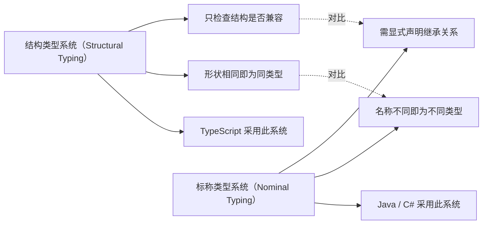

# TypeScript 笔面试题集

> 模块：03-typescript（第3周 TypeScript）
> 覆盖：类型系统、泛型、高级类型、工具类型、装饰器、tsconfig
> 题量：16 道选择题 + 10 道简答题 + 5 道类型体操题
> 难度标注：★基础  ★★中档  ★★★拔高

---

## 一、选择题（16 题，每题附解析）

**结构类型系统（鸭子类型）vs 标称类型对比图：**



> TypeScript 采用结构类型系统（鸭子类型），仅比较类型的结构是否兼容，而非名称是否相同；这与 Java/C# 等语言的标称类型系统有本质区别。

### 1. ★ TypeScript 中 `any` 和 `unknown` 的区别是什么？

A. 没有任何区别，可以互换使用  
B. `any` 更安全，`unknown` 不安全  
C. `unknown` 更安全，需要类型收窄后才能使用；`any` 完全关闭类型检查  
D. `unknown` 只能用于函数参数，`any` 可以用于任何地方  

**答案：C**

**解析**：`any` 完全关闭类型检查，可以任意调用方法，非常不安全；`unknown` 保留类型检查，必须经过类型收窄（typeof、instanceof 等）后才能调用方法，相对安全。项目中应优先使用 `unknown`。

---

### 2. ★ 以下哪个类型不是 TypeScript 的基本类型？

A. `string`  
B. `number`  
C. `object`  
D. `undefined`  

**答案：C**

**解析**：TypeScript 的基本类型包括 `string`、`number`、`boolean`、`null`、`undefined`、`symbol`、`bigint`、`void`、`never`、`unknown`、`any`。`object` 是引用类型，不属于基本类型。注意：`object` 在 TypeScript 中是一个特殊类型，表示非原始类型。

---

### 3. ★ `interface` 和 `type` 的区别不包括以下哪一项？

A. `interface` 支持声明合并，`type` 不支持  
B. `type` 可以定义联合类型，`interface` 不可以  
C. `type` 可以被继承（extends）  
D. `interface` 可以被类实现（implements）  

**答案：C**

**解析**：`type` 不能被 `extends` 继承（虽然可以用 `&` 交叉类型来组合），这是 `interface` 的特性。`interface` 支持声明合并、可以被类实现、可以被 extends；`type` 可以定义联合类型、元组、基本类型别名，但不支持声明合并。

---

### 4. ★★ 以下泛型约束正确的是？

A. `<T extends string | number>`  
B. `<T extends { length: number }>`  
C. `<T extends any>`  
D. 以上都正确  

**答案：D**

**解析**：以上三种泛型约束写法都是合法的。A 约束 T 必须是 string 或 number；B 约束 T 必须包含 length 属性（如 string、Array）；C 虽然语法正确，但 `<T extends any>` 是冗余约束（任何类型都满足 `extends any`），ESLint 会发出警告。不过作为语法，它们都是正确的。

---

### 5. ★★ 以下哪个工具类型可以将所有属性变为可选？

A. `Required<T>`  
B. `Partial<T>`  
C. `Pick<T, K>`  
D. `Omit<T, K>`  

**答案：B**

**解析**：`Partial<T>` 使用映射类型 `{ [K in keyof T]?: T[K] }` 将所有属性变为可选。`Required<T>` 恰好相反，将所有属性变为必选；`Pick<T, K>` 从 T 中挑选 K 属性；`Omit<T, K>` 从 T 中移除 K 属性。

---

### 6. ★★ 以下代码中，`infer R` 的作用是什么？

```typescript
type ReturnType<T> = T extends (...args: any[]) => infer R ? R : any;
```

A. 声明一个泛型参数 R  
B. 提取函数的参数类型  
C. 在条件类型中推导出函数的返回类型  
D. 定义函数的返回类型  

**答案：C**

**解析**：`infer` 关键字只能在条件类型的 `extends` 子句中使用，用于在条件类型中推导类型。这里的 `infer R` 用于提取函数的返回类型，如果 T 是一个函数类型，就推导出 R 并返回；否则返回 any。

---

### 7. ★★ 以下关于枚举（enum）的说法错误的是？

A. 数字枚举默认从 0 开始递增  
B. 数字枚举编译后会产生反向映射  
C. 字符串枚举编译后也会产生反向映射  
D. 枚举可以混合使用数字和字符串成员  

**答案：C**

**解析**：字符串枚举编译后**不会**产生反向映射，只有数字枚举会产生反向映射。数字枚举默认从 0 开始递增，可以手动指定起始值。TypeScript 支持异构枚举（混合数字和字符串），但一般不推荐使用。

---

### 8. ★★ 以下哪个不是 TypeScript 的类型守卫（Type Guard）？

A. `typeof`  
B. `instanceof`  
C. `keyof`  
D. 自定义类型谓词 `is`  

**答案：C**

**解析**：`keyof` 是类型操作符，用于获取一个类型的所有键的联合类型，它不是类型守卫。类型守卫包括 `typeof`（检查基本类型）、`instanceof`（检查实例）、`in`（检查属性是否存在）、以及自定义类型谓词（`value is Type` 语法）。

---

### 9. ★★★ 条件类型 `T extends U ? X : Y` 中，当 T 是联合类型时会发生什么？

A. 直接判断整个联合类型，不拆分  
B. 抛出编译错误，联合类型不能用于条件类型  
C. 自动分发到联合类型的每个成员分别计算，结果合并为联合类型（分布式条件类型）  
D. 只取联合类型的第一个成员进行判断  

**答案：C**

**解析**：这是 TypeScript 的分布式条件类型特性。当 T 是裸联合类型时，条件类型会自动分发，相当于对每个成员分别计算。例如 `ToArray<string | number>` 等于 `(string extends any ? string[] : never) | (number extends any ? number[] : never)`，结果是 `string[] | number[]`，而不是 `(string | number)[]`。

---

### 10. ★★ `const` 断言（`as const`）的作用是？

A. 将变量声明为常量，和 `const` 关键字一样  
B. 将字面量类型收窄为最窄类型，并标记所有属性为 `readonly`  
C. 将变量提升到全局作用域  
D. 禁用变量的所有方法调用  

**答案：B**

**解析**：`as const` 会将类型收窄到最具体的字面量类型，同时将所有属性标记为 `readonly`。例如 `const arr = [1, 2] as const` 的类型是 `readonly [1, 2]`，而不是 `number[]`。这在需要精确字面量类型时非常有用。

---

### 11. ★★ `as const` 和 `Object.freeze` 的区别是什么？

A. 两者完全一样，没有区别  
B. `as const` 只在编译时生效，`Object.freeze` 在运行时生效  
C. `Object.freeze` 只在编译时生效，`as const` 在运行时生效  
D. 两者都只在运行时生效  

**答案：B**

**解析**：`as const` 是 TypeScript 的编译时特性，只在类型层面生效，不会影响运行时的 JavaScript 代码。`Object.freeze` 是 JavaScript 的运行时方法，会在运行时冻结对象，防止修改。两者可以配合使用，达到编译时类型约束 + 运行时不可变的效果。

---

### 12. ★★★ 以下代码中，`keyof` 的作用是什么？

```typescript
function getProperty<T, K extends keyof T>(obj: T, key: K): T[K] {
  return obj[key];
}
```

A. 获取对象的所有属性值  
B. 获取对象类型的所有键的联合类型，用于约束参数  
C. 遍历对象的所有属性  
D. 将对象的键转换为值  

**答案：B**

**解析**：`keyof T` 获取类型 T 的所有键组成的联合类型。这里 `K extends keyof T` 约束 K 必须是 T 的某个键，从而保证 `obj[key]` 的类型安全。这样调用 `getProperty(user, "name")` 时，TypeScript 能推断出返回值类型是 `string`。

---

### 13. ★★ `tsconfig.json` 中 `strict` 模式包含了以下哪些选项？

A. `noImplicitAny`、`strictNullChecks`、`strictFunctionTypes`  
B. `strictBindCallApply`、`strictPropertyInitialization`、`noImplicitThis`  
C. `alwaysStrict`  
D. 以上全部  

**答案：D**

**解析**：`strict: true` 会同时开启所有严格类型检查选项，包括：`noImplicitAny`（禁止隐式 any）、`strictNullChecks`（严格空检查）、`strictFunctionTypes`（严格函数类型）、`strictBindCallApply`（严格 bind/call/apply）、`strictPropertyInitialization`（严格属性初始化）、`noImplicitThis`（禁止隐式 this）、`alwaysStrict`（始终严格模式）。

---

### 14. ★★ 以下代码的类型推断结果是什么？

```typescript
function process(value: string | number) {
  if (typeof value === "string") {
    return value.toUpperCase();
  }
  return value.toFixed(2);
}
```

A. 返回值类型是 `string`  
B. 返回值类型是 `string | number`  
C. 返回值类型是 `string | string`  
D. typeof 分支内 value 被收窄为 string，else 分支内 value 被收窄为 number，但两个分支都返回 string  

**答案：A**

**解析**：TypeScript 的控制流分析（Control Flow Analysis）会根据 `typeof` 检查进行类型收窄。在 `if` 分支内，`value` 被收窄为 `string`；在 else 分支内，`value` 被收窄为 `number`。`value.toUpperCase()` 返回 `string`，`value.toFixed(2)` 也返回 `string`，两个分支的返回值类型一致，整体返回值类型是 `string`。选项 D 描述的类型收窄过程是正确的，但最终返回值类型应是 `string` 而非 `string | number`。

---

### 15. ★★★ 如何实现一个 `DeepReadonly` 类型，将嵌套对象的所有属性都标记为只读？

A. 使用 `Readonly<T>` 就足够了  
B. 使用条件类型 + 递归 + 映射类型，对每个属性如果是对象类型就递归调用  
C. 使用 `as const` 断言  
D. TypeScript 不支持深层只读  

**答案：B**

**解析**：`DeepReadonly` 需要使用递归的映射类型来实现。核心思路是：遍历对象的每个属性，如果属性值是对象类型（且不是函数），就递归调用 `DeepReadonly`；否则直接标记为 `readonly`。实现代码：`type DeepReadonly<T> = { readonly [P in keyof T]: T[P] extends object ? T[P] extends Function ? T[P] : DeepReadonly<T[P]> : T[P] }`。

---

### 16. ★★ TypeScript 4.9 中 `satisfies` 关键字的作用是？

A. 和 `as` 类型断言完全一样，用于强制转换类型  
B. 对表达式进行类型检查，但保留其最窄的推导类型，而不是强制拓宽为目标类型  
C. 用于声明某个变量满足某个接口，但编译后会在运行时进行校验  
D. 用于替代 `typeof` 类型守卫  

**答案：B**

**解析**：`satisfies` 是 TypeScript 4.9 引入的关键字，用于在不改变表达式类型推断结果的前提下，验证该表达式是否符合某个类型。与 `as` 断言的区别在于：`as` 会强制将类型转换为目标类型（可能丢失具体信息），而 `satisfies` 仅做类型检查，表达式仍保留 TypeScript 推导出的最精确类型。例如：`const palette = { red: [255, 0, 0] } satisfies Record<string, number[]>;`，此时 `palette.red` 的类型仍是 `number[]`（数组字面量默认推导为数组类型而非元组），同时 TypeScript 会确保 `palette` 满足 `Record<string, number[]>` 约束。`satisfies` 在编译后会完全擦除，不产生任何运行时代码。

> 📖 **参考链接**：
> - [TypeScript官方文档 - 从零开始认识TypeScript](https://www.typescriptlang.org/docs/handbook/typescript-from-scratch.html)
> - [TypeScript官方文档 - 类型收窄（Narrowing）](https://www.typescriptlang.org/docs/handbook/2/narrowing.html)
> - [TypeScript官方文档 - 泛型（Generics）](https://www.typescriptlang.org/docs/handbook/2/generics.html)

---

## 二、简答题（10 题）

### 1. ★★ TypeScript 的类型系统有哪些优势？

**参考答案**：

1. **静态类型检查**：在编译阶段就能发现类型错误，减少运行时 bug
2. **更好的 IDE 支持**：智能提示、自动补全、代码导航、重构能力大幅提升
3. **代码即文档**：类型定义本身就起到了文档作用，提升代码可读性和可维护性
4. **渐进式引入**：完全兼容 JavaScript，可以逐步迁移
5. **强大的类型推导**：很多场景下不需要手动标注类型，TypeScript 能自动推导
6. **活跃的社区**：有丰富的类型定义库（DefinitelyTyped），几乎所有主流库都有类型支持

---

### 2. ★★ interface 和 type 的异同和适用场景

**参考答案**：

**相同点**：
- 都可以用来定义对象类型
- 都支持泛型
- 都可以被实现（类型层面）

**不同点**：
- `interface` 支持声明合并（同名 interface 自动合并），`type` 不支持
- `type` 可以定义联合类型、交叉类型、元组、基本类型别名，`interface` 不行
- `interface` 可以被类 `implements`，`type` 理论上也可以但语义上不推荐
- `interface` 可以使用 `extends` 继承，`type` 使用 `&` 交叉类型组合

**适用场景**：
- 定义对象/类的形状：优先使用 `interface`
- 定义联合类型、元组、工具类型、函数类型：使用 `type`
- 需要声明合并（如扩展第三方库类型）：必须使用 `interface`

---

### 3. ★★ 泛型的作用和使用场景

**参考答案**：

**作用**：泛型允许在定义函数、接口、类时不预先指定具体类型，而是在使用时再指定，从而实现组件对多种类型的支持，同时保持类型安全。

**使用场景**：
1. **通用工具函数**：如 `identity<T>`、`request<T>` 等
2. **容器类型**：如 `Array<T>`、`Promise<T>`、`Map<K, V>` 等
3. **API 响应类型**：封装通用请求函数，通过泛型指定返回数据类型
4. **React 组件**：`React.FC<Props>` 就是泛型在组件中的应用
5. **类型约束**：通过 `extends` 限制泛型参数必须满足某些条件

---

### 4. ★★ 类型守卫（Type Guard）有哪些方式？

**参考答案**：

TypeScript 中常用的类型守卫方式：

1. **`typeof` 类型守卫**：用于检查基本类型（`typeof value === "string"`）
2. **`instanceof` 类型守卫**：用于检查实例类型（`value instanceof Date`）
3. **`in` 操作符**：用于检查对象是否包含某个属性（`"property" in value`）
4. **自定义类型谓词**：使用 `value is Type` 语法定义（`function isString(value: unknown): value is string`）
5. **字面量类型守卫**：通过 `===` 或 `switch` 判断具体的字面量值
6. **`Array.isArray()`**：用于检查数组类型

---

### 5. ★★★ TypeScript 的协变和逆变

**参考答案**：

**协变（Covariance）**：子类型可以赋值给父类型。TypeScript 中大多数类型是协变的，比如 `Array<Cat>` 可以赋值给 `Array<Animal>`（如果 Cat 是 Animal 的子类型）。

**逆变（Contravariance）**：父类型可以赋值给子类型。在函数参数类型中体现：`(arg: Animal) => void` 可以赋值给 `(arg: Cat) => void`。因为接收 Animal 的函数一定能处理 Cat。

**双向协变（Bivariance）**：TypeScript 默认在某些情况下允许双向协变（方法参数），但开启 `strictFunctionTypes` 后，函数参数变为逆变。

**口诀**：参数是逆变，返回值是协变。即"允许函数接收更宽泛的类型（参数逆变），返回更具体的类型（返回值协变）"。

---

### 6. ★★ tsconfig.json 中 strict 模式的作用

**参考答案**：

`strict: true` 会同时开启以下所有严格类型检查选项：

1. **`noImplicitAny`**：禁止隐式 any 类型，必须显式标注或通过推导得到
2. **`strictNullChecks`**：严格区分 null/undefined 和其他类型，不能将 null 赋值给非空类型
3. **`strictFunctionTypes`**：严格函数类型检查，函数参数变逆变
4. **`strictBindCallApply`**：严格检查 bind/call/apply 的参数类型
5. **`strictPropertyInitialization`**：严格检查类属性是否在构造函数中初始化
6. **`noImplicitThis`**：禁止隐式 any 的 this
7. **`alwaysStrict`**：编译结果始终使用严格模式

开启 strict 可以显著提升代码类型安全性，新项目强烈建议始终开启。

---

### 7. ★★★ 装饰器的原理和使用场景

**参考答案**：

**原理**：装饰器本质上是一个函数，通过 `@expression` 语法附加到类、方法、属性、参数上。TypeScript 编译器会将装饰器编译为函数调用，在类定义时执行。装饰器可以修改或替换被装饰的目标。

**使用场景**：
1. **日志记录**：自动记录方法调用和参数
2. **性能监控**：测量方法执行时间
3. **权限控制**：在方法执行前检查权限
4. **缓存**：缓存方法的返回值
5. **依赖注入**：如 Angular 的 `@Injectable()`
6. **数据校验**：验证方法参数或属性值
7. **路由定义**：如 NestJS 的 `@Controller()`、`@Get()`

**注意事项**：TypeScript 5.0+ 已正式支持 Stage 3 标准装饰器（使用 `context` 对象模式），ES2025（2025 年 6 月正式定稿）已将装饰器纳为 ECMAScript 标准。Legacy 实验性装饰器（`experimentalDecorators: true`）仍可用于向后兼容，但新项目建议使用标准装饰器语法。

---

### 8. ★★ never 类型的使用场景

**参考答案**：

1. **永远不会返回的函数**：如抛出错误的函数 `function throwError(): never` 或无限循环的函数
2. **穷举检查**：在 switch 语句的 default 分支中，将变量赋值给 `never` 类型，确保所有情况都被处理。如果有新增类型未处理，TypeScript 会报编译错误
3. **类型运算中排除不可能的类型**：如 `type NonNullable<T> = T extends null | undefined ? never : T`

---

### 9. ★★ TypeScript 5.0 `const` 类型参数的用法和场景

**参考答案**：

TypeScript 5.0 引入了 `const` 类型参数修饰符，允许在泛型参数前添加 `const` 修饰符，使 TypeScript 将传入的字面量参数推断为最精确的字面量类型，效果等同于调用方手动添加 `as const`。

**语法**：

```typescript
// 在泛型参数前添加 const 修饰符
function getNames<const T extends readonly string[]>(names: T): T {
  return names;
}

// 调用时无需手动 as const
const names = getNames(["Alice", "Bob", "Charlie"]);
// 推断类型：readonly ["Alice", "Bob", "Charlie"]
// 而非：string[]（不加 const 修饰符时数组字面量会被拓宽）
```

**与 `as const` 的对比**：

- `as const` 需要在调用方显式添加，容易遗漏且增加使用负担
- `const` 类型参数由函数/组件作者在声明时决定，调用方无需关心，API 更简洁

**使用场景**：

1. **精确推断数组字面量**：当函数需要精确知道传入的每个元素类型时（如路由配置、配置对象等）
2. **泛型组件 Props 推断**：在 React 组件中，`<const T extends ...>` 可确保 props 被精确推断
3. **避免类型拓宽**：防止 TypeScript 将字面量类型拓宽为基础类型（如 `"hello"` 拓宽为 `string`）

**注意事项**：`const` 类型参数仅适用于 `string`、`number`、`boolean`、`bigint` 字面量以及数组和对象字面量，不对其他类型产生效果。

---

### 10. ★★★ TypeScript 5.2 `using` 声明（Explicit Resource Management）的作用

**参考答案**：

`using` 是 TypeScript 5.2 引入的显式资源管理语法，基于 ECMAScript 的 Explicit Resource Management 提案，允许在变量离开作用域时自动释放资源（类似 C# 的 `using` / Python 的 `with` 语句）。

**核心概念**：

当一个对象实现了 `Symbol.dispose` 或 `Symbol.asyncDispose` 方法时，使用 `using` 声明的变量会在离开其所在块作用域时自动调用对应的 dispose 方法。

**语法**：

```typescript
// 同步资源管理
{
  using file = openFile("data.txt");
  // 使用 file ...
  // 离开作用域时自动调用 file[Symbol.dispose]()
}

// 异步资源管理
{
  await using db = await connectDatabase();
  // 使用 db ...
  // 离开作用域时自动调用 db[Symbol.asyncDispose]()
}
```

**典型使用场景**：

1. **文件句柄管理**：自动关闭打开的文件，避免资源泄漏
2. **数据库连接**：确保连接在操作完成后自动释放回连接池
3. **锁的控制**：在关键代码段执行完毕后自动释放锁
4. **临时文件清理**：确保临时资源在不再需要时被清理
5. **测试夹具**：在测试结束后自动清理测试数据

**与 `try/finally` 对比**：

- `using` 声明更简洁，无需手动编写 `finally` 块
- 资源释放逻辑由对象自身通过 `Symbol.dispose` 封装，符合关注点分离原则
- 多个 `using` 声明按声明的逆序执行释放（类似栈的 LIFO 顺序）

**TypeScript 配置**：需要在 `tsconfig.json` 中将 `target` 设为 `es2022` 或更高，或在 `lib` 中包含 `esnext.disposable`。

> 📖 **参考链接**：
> - [TypeScript官方文档 - 条件类型（Conditional Types）](https://www.typescriptlang.org/docs/handbook/2/conditional-types.html)
> - [TypeScript官方文档 - 映射类型（Mapped Types）](https://www.typescriptlang.org/docs/handbook/2/mapped-types.html)
> - [TypeScript官方文档 - tsconfig.json](https://www.typescriptlang.org/docs/handbook/tsconfig-json.html)

---

## 三、类型体操题（5 题，每题附实现代码）

### 1. ★★ 实现 MyPartial<T>

将泛型 T 中的所有属性转换为可选属性。

```typescript
type MyPartial<T> = {
  [K in keyof T]?: T[K];
};

// 测试用例
interface User {
  name: string;
  age: number;
  email: string;
}

type PartialUser = MyPartial<User>;
// 结果：{ name?: string; age?: number; email?: string }

// 验证
const user: PartialUser = { name: "Alice" }; // 合法，其他属性可选
```

**考点**：映射类型 `[K in keyof T]` 和可选修饰符 `?` 的使用。

---

### 2. ★★ 实现 MyPick<T, K>

从泛型 T 中挑选出属性 K 并构造一个新类型。

```typescript
type MyPick<T, K extends keyof T> = {
  [P in K]: T[P];
};

// 测试用例
interface User {
  id: number;
  name: string;
  email: string;
  password: string;
}

type UserPublic = MyPick<User, "id" | "name" | "email">;
// 结果：{ id: number; name: string; email: string }

// 验证
const publicUser: UserPublic = {
  id: 1,
  name: "Alice",
  email: "alice@example.com"
};
// password 属性不存在，无法访问
```

**考点**：`extends keyof T` 约束泛型参数，以及映射类型遍历指定键。

---

### 3. ★★ 实现 MyReturnType<T>

获取函数类型 T 的返回值类型。

```typescript
type MyReturnType<T extends (...args: any) => any> = 
  T extends (...args: any) => infer R ? R : never;

// 测试用例
function getUser(id: number) {
  return { id, name: "Alice", age: 25 };
}

function noReturn(): void {
  console.log("nothing");
}

type UserReturn = MyReturnType<typeof getUser>;
// 结果：{ id: number; name: string; age: number }

type VoidReturn = MyReturnType<typeof noReturn>;
// 结果：void

// 更复杂的测试
const add = (a: number, b: number): number => a + b;
type AddReturn = MyReturnType<typeof add>;
// 结果：number
```

**考点**：`infer` 关键字在条件类型中提取嵌套类型。

---

### 4. ★★★ 实现 DeepReadonly<T>

将一个对象类型的所有层级属性都变为只读。

```typescript
type DeepReadonly<T> = {
  readonly [P in keyof T]: T[P] extends object
    ? T[P] extends Function
      ? T[P]          // 函数类型保持不变
      : DeepReadonly<T[P]>
    : T[P];            // 基本类型直接标记 readonly
};

// 测试用例
interface Config {
  server: {
    host: string;
    port: number;
    options: {
      timeout: number;
      retry: boolean;
    };
  };
  version: string;
}

type ReadonlyConfig = DeepReadonly<Config>;
// 结果：所有层级属性都变为 readonly

// 验证
declare const config: ReadonlyConfig;
// config.server.host = "new"; // Error：Cannot assign to 'host' because it is a read-only property
// config.server.options.timeout = 5000; // Error：深层也 readonly

// 函数类型测试
interface WithFn {
  data: string;
  callback: () => void;
}
type ReadonlyWithFn = DeepReadonly<WithFn>;
// callback 保持为 () => void，不会被 DeepReadonly 处理
```

**考点**：递归映射类型、条件类型判断、`object` 类型与 `Function` 类型的区分。

---

### 5. ★★★ 实现 TupleToUnion<T>

将元组类型转换为联合类型。

```typescript
// 方案一：使用索引访问（最简洁）
type TupleToUnion<T extends any[]> = T[number];

// 方案二：使用递归（理解递归思路）
type TupleToUnionRecursive<T extends any[]> = 
  T extends [infer First, ...infer Rest]
    ? First | TupleToUnionRecursive<Rest>
    : never;

// 测试用例
type T1 = TupleToUnion<[string, number, boolean]>;
// 结果：string | number | boolean

type T2 = TupleToUnion<[1, 2, 3]>;
// 结果：1 | 2 | 3

type T3 = TupleToUnion<[]>; 
// 结果：never（空元组没有成员）

// 验证
const value: T1 = "hello"; // 合法
const num: T1 = 42;        // 合法
const bool: T1 = true;     // 合法
// const obj: T1 = {};     // 错误：{} 不是 string | number | boolean
```

**考点**：`T[number]` 索引访问的妙用，以及递归提取元组元素的思路。

---

## 补充类型体操：常用工具类型实现

### 补充1：实现 Pick<T, K>

```typescript
/**
 * Pick<T, K>：从类型 T 中挑选出属性 K 并构造一个新类型
 * 已在 TypeScript 内置，此处展示其实现原理
 */
type MyPick<T, K extends keyof T> = {
  [P in K]: T[P];
};

// 增强版 Pick：支持深层选取
type DeepPick<T, K extends keyof T> = {
  [P in K]: T[P];
};

// 测试用例
interface User {
  id: number;
  name: string;
  email: string;
  password: string;
  address: {
    city: string;
    street: string;
  };
}

// 基础用法：选取部分字段
type UserPublic = MyPick<User, 'id' | 'name' | 'email'>;
// 结果：{ id: number; name: string; email: string }

// 配合条件类型做更灵活的选取
type PickByType<T, ValueType> = {
  [P in keyof T as T[P] extends ValueType ? P : never]: T[P];
};

type StringFields = PickByType<User, string>;
// 结果：{ name: string; email: string; password: string }
```

### 补充2：实现 Omit<T, K>

```typescript
/**
 * Omit<T, K>：从类型 T 中移除属性 K 并构造一个新类型
 * 已内置在 TypeScript 中，此处展示其实现原理
 */

// 方案一：使用 Pick + Exclude（官方实现方式）
type MyOmit<T, K extends keyof T> = Pick<T, Exclude<keyof T, K>>;

// 方案二：使用映射类型 + as 子句（TypeScript 4.1+）
type MyOmitV2<T, K extends keyof T> = {
  [P in keyof T as P extends K ? never : P]: T[P];
};

// 测试用例
interface User {
  id: number;
  name: string;
  email: string;
  password: string;
}

// 移除敏感字段
type SafeUser = MyOmit<User, 'password'>;
// 结果：{ id: number; name: string; email: string }

// 移除多个字段
type UserPreview = MyOmit<User, 'password' | 'id'>;
// 结果：{ name: string; email: string }

// 扩展：深层 Omit
type DeepOmit<T, K extends string> = {
  [P in keyof T as P extends K ? never : P]: T[P] extends object
    ? DeepOmit<T[P], K>
    : T[P];
};

interface NestedUser {
  id: number;
  info: {
    name: string;
    password: string;
    meta: {
      password: string;
      token: string;
    };
  };
}

type CleanNestedUser = DeepOmit<NestedUser, 'password'>;
// info.password 和 info.meta.password 都被移除
```

### 补充3：实现 ReturnType<T>

```typescript
/**
 * ReturnType<T>：获取函数类型 T 的返回值类型
 * 已内置在 TypeScript 中，此处展示其实现原理
 */
type MyReturnType<T extends (...args: any) => any> = 
  T extends (...args: any) => infer R ? R : never;

// 测试用例

// 1. 普通函数
function getUser(id: number) {
  return { id, name: 'Alice', age: 25 };
}
type UserReturn = MyReturnType<typeof getUser>;
// 结果：{ id: number; name: string; age: number }

// 2. 箭头函数
const add = (a: number, b: number): number => a + b;
type AddReturn = MyReturnType<typeof add>;
// 结果：number

// 3. 异步函数
async function fetchData(): Promise<{ data: string }> {
  return { data: 'hello' };
}
type FetchReturn = MyReturnType<typeof fetchData>;
// 结果：Promise<{ data: string }>

// 4. 泛型函数
function identity<T>(value: T): T {
  return value;
}
type IdentityReturn = MyReturnType<typeof identity>;
// 结果：unknown（泛型未实例化时无法推断具体类型）

// 扩展：获取 Promise 内部的实际类型
type UnwrapPromise<T> = T extends Promise<infer U> ? UnwrapPromise<U> : T;
type ActualData = UnwrapPromise<FetchReturn>;
// 结果：{ data: string }

// 扩展：获取函数参数类型
type MyParameters<T extends (...args: any) => any> = 
  T extends (...args: infer P) => any ? P : never;

type AddParams = MyParameters<typeof add>;
// 结果：[a: number, b: number]
```

### 补充4：实现 DeepReadonly<T>

```typescript
/**
 * DeepReadonly<T>：将对象类型的所有层级属性都变为只读
 * 递归地对每个属性进行处理
 */
type DeepReadonly<T> = {
  readonly [P in keyof T]: T[P] extends object
    ? T[P] extends Function
      ? T[P]                          // 函数类型保持不变
      : DeepReadonly<T[P]>            // 对象类型递归处理
    : T[P];                            // 基本类型直接标记 readonly
};

// 测试用例
interface Config {
  server: {
    host: string;
    port: number;
    options: {
      timeout: number;
      retry: boolean;
    };
  };
  version: string;
  callback: () => void;
}

type ReadonlyConfig = DeepReadonly<Config>;
// 所有层级属性都变为 readonly
// callback 保持为 () => void（函数类型不处理）

// 验证
declare const config: ReadonlyConfig;
// config.server.host = 'new';          // Error
// config.server.options.timeout = 5000; // Error
// config.callback = () => {};          // Error

// 扩展：DeepRequired（所有属性必填）
type DeepRequired<T> = {
  [P in keyof T]-?: T[P] extends object
    ? T[P] extends Function
      ? T[P]
      : DeepRequired<T[P]>
    : T[P];
};

// 扩展：DeepPartial（所有属性可选）
type DeepPartial<T> = {
  [P in keyof T]?: T[P] extends object
    ? T[P] extends Function
      ? T[P]
      : DeepPartial<T[P]>
    : T[P];
};

// 扩展：DeepMutable（移除所有 readonly）
type DeepMutable<T> = {
  -readonly [P in keyof T]: T[P] extends object
    ? T[P] extends Function
      ? T[P]
      : DeepMutable<T[P]>
    : T[P];
};

// 递归深度限制版本（防止无限递归）
type DeepReadonlyLimited<T, Depth extends number = 5> = Depth extends 0
  ? T
  : {
      readonly [P in keyof T]: T[P] extends object
        ? T[P] extends Function
          ? T[P]
          : DeepReadonlyLimited<T[P], Prev[Depth]>
        : T[P];
    };

// 辅助类型：递减数字
type Prev = [never, 0, 1, 2, 3, 4, 5];
```

### 补充5：其他常用工具类型实现

```typescript
// 1. Required<T>：将所有属性变为必选
type MyRequired<T> = {
  [P in keyof T]-?: T[P];
};

// 2. Partial<T>：将所有属性变为可选
type MyPartial<T> = {
  [P in keyof T]?: T[P];
};

// 3. Readonly<T>：将所有属性变为只读
type MyReadonly<T> = {
  readonly [P in keyof T]: T[P];
};

// 4. Record<K, V>：构造一个键为 K、值为 V 的对象类型
type MyRecord<K extends keyof any, V> = {
  [P in K]: V;
};

// 5. Exclude<T, U>：从 T 中排除可分配给 U 的类型
type MyExclude<T, U> = T extends U ? never : T;

// 6. Extract<T, U>：从 T 中提取可分配给 U 的类型
type MyExtract<T, U> = T extends U ? T : never;

// 7. NonNullable<T>：从 T 中排除 null 和 undefined
type MyNonNullable<T> = T extends null | undefined ? never : T;

// 测试用例
type Status = 'active' | 'inactive' | 'pending' | 'deleted';
type ActiveStatus = MyExclude<Status, 'deleted'>;
// 结果：'active' | 'inactive' | 'pending'

type RoleMap = MyRecord<'admin' | 'user' | 'guest', { permissions: string[] }>;
// 结果：{ admin: { permissions: string[] }; user: { ... }; guest: { ... } }
```

---

## 四、综合面试题

### 综合题1：如何设计一个类型安全的 API 请求层？

```typescript
// 定义通用 API 响应类型
interface ApiResponse<T> {
  code: number;
  message: string;
  data: T;
}

// 定义分页响应
interface PaginatedResponse<T> extends ApiResponse<T[]> {
  total: number;
  page: number;
  pageSize: number;
}

// 通用请求函数
async function request<T>(url: string, options?: RequestInit): Promise<ApiResponse<T>> {
  const response = await fetch(url, options);
  return response.json();
}

// 使用示例
interface User {
  id: number;
  name: string;
  email: string;
}

// 类型安全的调用
const userResult = await request<User>("/api/users/1");
// userResult.data 的类型是 User，有完整的类型提示
console.log(userResult.data.name);
```

### 综合题2：如何利用 TypeScript 的 never 做穷举检查？

```typescript
type Shape = 
  | { kind: "circle"; radius: number }
  | { kind: "square"; size: number }
  | { kind: "rectangle"; width: number; height: number };

function getArea(shape: Shape): number {
  switch (shape.kind) {
    case "circle":
      return Math.PI * shape.radius ** 2;
    case "square":
      return shape.size ** 2;
    case "rectangle":
      return shape.width * shape.height;
    default:
      // 穷举检查：如果将来新增了 shape 类型，在编译阶段就会报错
      const _exhaustiveCheck: never = shape;
      throw new Error(`Unhandled shape: ${_exhaustiveCheck}`);
  }
}
```

---

> **学习导航**：
> - 返回 [学习路线总览](../README.md)
> - 本模块原理文件：[01-TypeScript基础与类型系统](./01-TypeScript基础与类型系统.md) | [02-高级类型与工程配置](./02-高级类型与工程配置.md)
> - 实战应用：[企业后台管理系统](../10-project/01-企业后台管理系统实战.md)

---

## 本章学习自检

请检查你是否能独立完成以下试题：

- [ ] 选择题 16 题全部理解，每题都能说出正确答案和解析
- [ ] 简答题 10 题都能用自己的话流畅回答
- [ ] 能独立写出 MyPartial<T> 的实现
- [ ] 能独立写出 MyPick<T, K> 的实现
- [ ] 能独立写出 MyReturnType<T> 的实现
- [ ] 能独立写出 DeepReadonly<T> 的实现
- [ ] 能独立写出 TupleToUnion<T> 的实现
- [ ] 理解分布式条件类型、协变逆变、类型守卫等进阶概念
- [ ] 理解 `satisfies` 与 `as` 断言的区别，能说出适用场景
- [ ] 理解 `const` 类型参数（TS 5.0+）的用法和场景
- [ ] 理解 `using` 声明（TS 5.2+）的显式资源管理机制
- [ ] 能结合实际项目场景解释 TypeScript 的工程价值