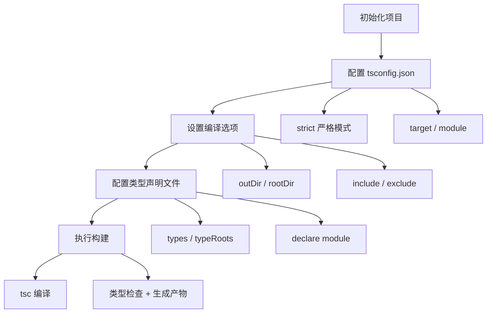

# TypeScript - 综合场景串联

---

## 场景一：给第三方库添加类型声明

### 场景描述
项目中引入了一个没有内置类型声明的第三方JavaScript库（如lodash），需要为该库编写类型声明文件，使TypeScript能正确进行类型检查。同时需要处理库的默认导出、命名导出、函数重载和配置项类型。

**TypeScript 项目工程配置流程图：**



> TypeScript 工程配置遵循"初始化 - 配置 - 编译选项 - 类型声明 - 构建"的核心流程，合理的 tsconfig 配置是项目类型安全的基础。

### 涉及知识点
- [TypeScript基础与类型系统](./01-TypeScript基础与类型系统.md)：类型声明、declare、类型定义
- [高级类型与工程配置](./02-高级类型与工程配置.md)：声明文件(.d.ts)、模块声明、tsconfig配置

### 协作流程
1. 使用 `declare module '库名'` 声明模块，为库提供顶层类型定义
2. 为库的主函数编写类型声明：参数类型、返回值类型、函数重载
3. 处理命名导出：使用 `export` 关键字声明每个导出的函数或类型
4. 处理默认导出：使用 `export default` 声明默认导出
5. 为配置项对象定义接口，使用可选属性标注可选配置
6. 将声明文件放在 `types/` 目录下，在 tsconfig.json 中配置 `typeRoots` 或 `types` 字段
7. 如果库较复杂，使用 `declare namespace` 组织命名空间
8. 为自定义事件或回调函数定义类型，使用泛型支持灵活的回调签名

### 关键要点
- 声明文件优先使用 `interface` 描述对象结构，`type` 描述联合类型和工具类型
- 使用 `declare function` 声明函数，支持多个重载签名
- 使用 `declare class` 声明类，包含构造函数签名和实例方法
- 模块声明与全局声明不同：模块声明在 `declare module` 内，全局声明直接使用 `declare`
- 可以在 `@types/` 下查找社区已有的类型声明作为参考

---

## 场景二：实现一个类型安全的useState

### 场景描述
使用TypeScript实现一个类型安全的React useState Hook的简化版本，要求支持泛型类型推断、函数式更新、以及初始值类型推导。

### 涉及知识点
- [TypeScript基础与类型系统](./01-TypeScript基础与类型系统.md)：泛型、类型推断、联合类型
- [高级类型与工程配置](./02-高级类型与工程配置.md)：函数重载、条件类型
- [TypeScript笔面试题集](./03-TypeScript笔面试题集.md)：工具类型实现

### 协作流程
1. 定义 `useState` 函数签名，使用泛型参数 `<S>` 表示状态类型
2. 处理初始值类型推断：如果传入具体值则自动推断类型，如果传入 `undefined` 则需要显式指定泛型
3. 定义 `setState` 函数签名，支持两种形式：直接传入新值 `S` 或传入更新函数 `(prevState: S) => S`
4. 使用函数重载区分两种初始化方式：`useState(initialState: S)` 和 `useState<S>()` 返回 `S | undefined`
5. 返回元组类型 `[S, Dispatch<SetStateAction<S>>]`，确保数组解构的类型正确
6. 定义 `Dispatch` 类型和 `SetStateAction` 类型，使用条件类型处理函数式更新
7. 验证类型推导：传入数字时state类型为number，传入字符串时state类型为string
8. 验证函数式更新：`setState(prev => prev + 1)` 类型检查通过

### 关键要点
- 泛型参数默认推断：当传入具体值作为参数时，TypeScript能自动推断泛型类型
- 函数重载的优先级：更具体的签名放在前面，更通用的签名放在后面
- 条件类型：`SetStateAction<S> = S | ((prevState: S) => S)` 使用联合类型支持两种更新方式
- 元组返回类型：使用 `as const` 确保返回的数组被推断为元组而非联合类型数组
- 调度类型：`Dispatch<A> = (value: A) => void` 简化调度函数签名

> **生活类比**：泛型就像万能遥控器——同一个遥控器（泛型函数）可以控制电视、空调、音响（不同类型），按什么键就出什么功能（类型推断），不需要为每种设备买一个专用遥控器（不用写重复代码）。

### 场景二代码示例

```typescript
// ==================== 类型安全的 useState 实现 ====================

// 1. 定义 SetStateAction 类型 —— 支持直接值和函数式更新两种形式
//    使用联合类型 S | ((prevState: S) => S)，TypeScript 会根据传入值自动判别
type SetStateAction<S> = S | ((prevState: S) => S);

// 2. 定义 Dispatch 类型 —— 调度函数签名，接收一个 Action 并执行
//    泛型参数 A 表示可接受的 Action 类型
type Dispatch<A> = (value: A) => void;

// 3. 实现 useState 函数 —— 使用函数重载区分不同初始化方式
//    重载签名 1：传入初始值，泛型 S 自动从参数类型推断
function useState<S>(initialState: S): [S, Dispatch<SetStateAction<S>>];

//    重载签名 2：不传初始值，需要显式指定泛型 <S>，返回 S | undefined
function useState<S = undefined>(): [S | undefined, Dispatch<SetStateAction<S | undefined>>];

//    实现签名（包含所有重载的兼容类型）
function useState<S>(initialState?: S): [S | undefined, Dispatch<SetStateAction<S | undefined>>] {
  // 内部状态存储（简化实现，实际 React 使用闭包 + 链表维护 Hook 状态）
  let state = initialState as S | undefined;

  // setState 实现：根据传入值类型决定是直接赋值还是调用更新函数
  const setState: Dispatch<SetStateAction<S | undefined>> = (value) => {
    if (typeof value === 'function') {
      // 函数式更新：调用传入的函数，传入当前状态，获取新状态
      state = (value as (prevState: S | undefined) => S | undefined)(state);
    } else {
      // 直接赋值：将新值赋给状态
      state = value;
    }
    // 触发重新渲染（实际 React 会调度更新，此处仅作演示）
    console.log('状态已更新：', state);
  };

  // 返回元组 [state, setState]，支持数组解构
  return [state, setState];
}

// ==================== 使用示例 ====================

// 示例 1：自动类型推断 —— 传入数字，state 被推断为 number 类型
const [count, setCount] = useState(0);
//     ^? count: number
//        ^? setCount: Dispatch<SetStateAction<number>>

setCount(5);                             // ✅ 直接设置新值
setCount(prev => prev + 1);              // ✅ 函数式更新，prev 类型被推断为 number
// setCount('hello');                    // ❌ 类型错误：string 不能赋值给 SetStateAction<number>

// 示例 2：显式指定泛型 —— 初始值可能为 null，需要明确类型范围
interface UserInfo {
  id: number;
  name: string;
  email: string;
}

const [user, setUser] = useState<UserInfo | null>(null);
//     ^? user: UserInfo | null

setUser({ id: 1, name: '张三', email: 'zhangsan@example.com' });  // ✅ 设置新用户
setUser(prev => prev ? { ...prev, name: '李四' } : null);          // ✅ 函数式更新，prev 类型为 UserInfo | null

// 示例 3：不传初始值 —— 必须显式指定泛型，否则无法推断类型
const [data, setData] = useState<{ items: string[] }>();
//     ^? data: { items: string[] } | undefined

setData({ items: ['a', 'b'] });                                    // ✅ 直接赋值
setData(prev => prev ? { items: [...prev.items, 'c'] } : { items: ['c'] }); // ✅ 函数式更新

// 示例 4：复杂对象类型 —— 泛型约束确保类型安全
const [profile, setProfile] = useState<UserInfo>({
  id: 1,
  name: '张三',
  email: 'zhangsan@example.com',
});
//     ^? profile: UserInfo

// 泛型约束确保 setProfile 只能接收 UserInfo 或 (prev: UserInfo) => UserInfo
setProfile({ id: 2, name: '李四', email: 'lisi@example.com' }); // ✅
// setProfile({ id: 3 });  // ❌ 类型错误：缺少 name 和 email 属性
```

---

## 完整可运行示例：第三方库类型声明文件

```typescript
// ==================== 第三方库类型声明文件示例 ====================
// 文件名：types/legacy-chart.d.ts
// 用途：为老旧 JavaScript 库 'legacy-chart' 编写类型声明文件

/**
 * 场景背景：
 * 项目中引入了一个名为 'legacy-chart' 的第三方图表库，
 * 该库没有官方的 TypeScript 类型声明文件，
 * 也没有 @types/legacy-chart 社区声明包，
 * 因此需要手动编写 .d.ts 声明文件来提供类型支持。
 */

// ==================== 1. declare module —— 声明一个 npm 模块 ====================
// 使用 declare module 语法告诉 TypeScript："这个模块存在，以下是它的类型"
declare module 'legacy-chart' {

  // ==================== 2. 函数重载声明 ====================
  // 为库的主函数提供多种调用签名，覆盖不同的使用方式
  // 重载签名 1：仅传入配置对象，返回图表实例
  function createChart(options: ChartOptions): ChartInstance;
  // 重载签名 2：传入 DOM 容器 + 配置对象
  function createChart(container: HTMLElement, options: ChartOptions): ChartInstance;

  // ==================== 3. 默认导出 ====================
  // 声明默认导出，使 import createChart from 'legacy-chart' 可用
  export default createChart;

  // ==================== 4. namespace 声明 —— 组织相关工具函数 ====================
  // 当库中存在工具函数集合时，使用 namespace 将它们组织在一起
  export namespace ChartUtils {
    /** 格式化数值（支持千分位、指定小数位数） */
    function formatNumber(value: number, decimals?: number): string;
    /** 解析颜色字符串为 RGB 对象 */
    function parseColor(color: string): RGBColor;
    /** 计算两个颜色之间的混合色 */
    function mixColor(color1: string, color2: string, ratio: number): string;
  }

  // ==================== 5. interface 声明 —— 定义配置项类型 ====================
  // 使用 interface 描述对象结构，支持可选属性标注

  /** 图表配置选项 */
  export interface ChartOptions {
    /** 图表类型 */
    type: 'line' | 'bar' | 'pie' | 'scatter';
    /** 图表标题（可选） */
    title?: string;
    /** 宽高配置 */
    size?: {
      width: number;
      height: number;
    };
    /** 数据系列数组 */
    series: ChartSeries[];
    /** 主题配置（可选） */
    theme?: ChartTheme;
    /** 是否启用动画（可选，默认 true） */
    animation?: boolean;
    /** 自适应容器大小（可选） */
    responsive?: boolean;
  }

  /** 数据系列配置 */
  export interface ChartSeries {
    /** 系列名称 */
    name: string;
    /** 数据：一维数组为单轴数据，二维数组为双轴数据（如散点图） */
    data: number[] | [number, number][];
    /** 系列颜色 */
    color?: string;
  }

  /** 图表主题 */
  export interface ChartTheme {
    primary: string;
    background: string;
    textColor: string;
    gridColor: string;
  }

  /** RGB 颜色对象 */
  export interface RGBColor {
    r: number;
    g: number;
    b: number;
  }

  // ==================== 6. class 声明 ====================
  // 声明类时，需要同时声明构造函数签名和实例成员

  /** 图表实例类 */
  export class ChartInstance {
    /** 构造函数：接收配置选项 */
    constructor(options: ChartOptions);

    /** 销毁图表实例，释放资源 */
    destroy(): void;

    /** 更新图表数据（支持增量更新） */
    updateData(series: ChartSeries[]): void;

    /** 调整图表尺寸 */
    resize(width: number, height: number): void;

    /** 导出图表为图片（base64） */
    toImage(type?: 'png' | 'jpeg'): string;

    /** 只读：图表 DOM 容器 */
    readonly container: HTMLElement;

    /** 只读：当前配置 */
    readonly options: ChartOptions;
  }
}

// ==================== 7. 扩展已有第三方库的类型 ====================
// 例如：扩展 Vue Router 的 RouteMeta 接口，添加自定义字段
// 这种模式常用于为框架"打补丁"，在已有类型基础上追加自定义属性

declare module 'vue-router' {
  interface RouteMeta {
    /** 页面标题（用于文档标题和面包屑） */
    title?: string;
    /** 是否需要登录验证 */
    requiresAuth?: boolean;
    /** 页面图标名称 */
    icon?: string;
    /** 可访问该页面的角色列表 */
    roles?: string[];
    /** 是否在侧边栏中隐藏 */
    hidden?: boolean;
  }
}

// ==================== 8. 声明全局变量或全局函数 ====================
// 使用 declare global 扩展全局作用域的类型

declare global {
  // 扩展 Window 接口
  interface Window {
    /** 应用版本号（构建时注入） */
    __APP_VERSION__: string;
    /** 埋点上报函数 */
    reportEvent: (eventName: string, data?: Record<string, any>) => void;
  }

  // 声明全局函数（需谨慎使用，优先考虑模块化导入）
  /** 全局格式化金额函数 */
  function formatCurrency(amount: number, currency?: string): string;
}

// 确保该文件被视为模块（而非全局脚本），
// 这是必要的，因为文件中有顶层 import/export（如 declare module），
// 添加 export {} 明确标注这是一个模块文件
export {};
```

---

## 常见错误

### 1. 写了 declare module 但忘记声明模块内的具体类型

```typescript
// ❌ 错误：声明了模块，但内部是空的，使用时 TypeScript 将所有导出视为 any
// 文件：types/my-utils.d.ts
declare module 'my-utils' {
  // 空声明 —— 没有任何导出类型，导入时全部为 any 类型
}

// 在业务代码中：
import { formatDate } from 'my-utils';
//     ^? 类型为 any，失去了类型检查的意义

// ✅ 正确：必须声明模块提供的具体接口和类型
declare module 'my-utils' {
  /** 格式化日期 */
  export function formatDate(date: Date, format?: string): string;
  /** 解析 URL 查询参数 */
  export function parseQuery<T = Record<string, string>>(url: string): T;
  /** 库的版本号 */
  export const version: string;
}
```

**说明**：`declare module` 只是告诉 TypeScript "这个模块存在"，如果内部没有具体类型声明，导入时所有类型都会是 `any`，完全失去了类型检查的意义。声明模块后必须为模块的每个导出成员提供类型。

### 2. 泛型约束过宽导致类型推断失败

```typescript
// ❌ 错误：泛型约束太宽泛，TypeScript 无法正确推断或约束类型
function firstElement<T>(arr: T): T {
  //            ^? T 没有任何约束，可能是任何类型
  return arr[0]; // 如果 arr 不是数组，arr[0] 在运行时可能出错
}

// ✅ 正确：使用 extends 关键字约束泛型参数
function firstElement<T extends any[]>(arr: T): T[number] {
  //            ^? 约束 T 必须是数组类型
  return arr[0]; // TypeScript 知道 arr 是数组，arr[0] 类型安全
}

// ✅ 另一种写法：约束参数为数组，泛型为元素类型
function firstElement<T>(arr: T[]): T {
  //            ^? T 表示数组元素类型
  return arr[0]; // 返回类型也是 T，类型安全
}
```

**说明**：泛型约束越精确，TypeScript 的类型推断越准确。约束过宽（如 `<T>` 无任何约束）会导致类型收缩困难，甚至需要手动类型断言。合理使用 `extends` 可以在保持灵活性的同时确保类型安全。

### 3. 类型声明文件路径与 tsconfig 的 typeRoots 不匹配

```json
// tsconfig.json 中的配置
{
  "compilerOptions": {
    "typeRoots": ["./node_modules/@types", "./src/types"]
    //                                                 ^^^^^^^^ 类型声明文件目录
  }
}
```

```typescript
// ❌ 错误：类型声明文件放在 src/typings/ 下，但 typeRoots 配置的是 src/types/
// 文件路径：src/typings/legacy-chart.d.ts
// 结果：TypeScript 找不到该声明文件，所有导入都报"找不到模块"错误

// ✅ 正确：确保类型声明文件路径与 typeRoots 一致
// 文件路径：src/types/legacy-chart.d.ts （与 typeRoots 中配置的 ./src/types 匹配）
declare module 'legacy-chart' {
  export function init(): void;
}
```

**说明**：`typeRoots` 指定了 TypeScript 自动加载类型声明文件的目录列表。如果声明文件放在 `typeRoots` 之外的目录，需要在 `tsconfig.json` 的 `include` 字段中显式包含该路径，或者使用三斜杠指令 `/// <reference path="./typings/legacy-chart.d.ts" />` 手动引入。

### 4. 在 .d.ts 文件中使用顶层 import/export 导致全局声明失效

```typescript
// ❌ 错误：顶层 import 使该文件变成"模块"，全局声明不再在全局生效
// 文件：types/global.d.ts
import { User } from './models'; // ⚠️ 这个 import 改变了文件的作用域

// 以下声明在模块作用域内，不是全局声明
declare var myGlobalVar: string; // ❌ 仅在当前模块作用域可见

// ✅ 正确：将全局声明放在 declare global 块内
import { User } from './models';

declare global {
  var myGlobalVar: string;
  function globalHelper(): void;
  interface Window {
    user: User;
  }
}

// 必须添加 export {} 确保文件被视为模块
export {};
```

**说明**：TypeScript 中，包含顶层 `import` 或 `export` 的文件被视为"模块"（Module），其内部声明的作用域是局部的。如果需要在模块文件中声明全局类型，必须使用 `declare global { ... }` 语法包裹，并添加 `export {}` 明确标注文件为模块。

---

> [返回模块目录](../README.md) | [返回知识导览](../知识导览.md)