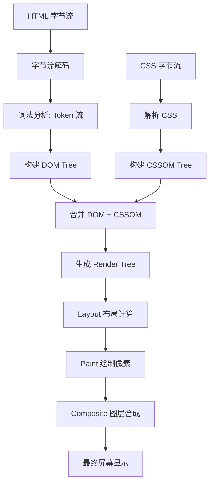
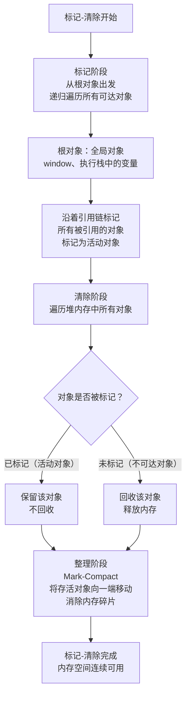

# 浏览器渲染与V8原理

> 模块：04-browser（第4周 浏览器原理）
> 知识点：浏览器架构、渲染流程、重排重绘、V8引擎、垃圾回收
> 前置知识：[HTML核心与语义化](../01-html-css/01-HTML核心与语义化-导览.md)、[语法基础与执行机制](../02-javascript-core/01-语法基础与执行机制-导览.md)

---

## 一、核心概念

浏览器是我们前端开发日常工作中最常接触的运行环境，理解其内部工作原理对写出高性能代码至关重要。

**核心概念要点：**

1. **浏览器多进程架构**：现代浏览器采用多进程设计，不同功能运行在独立进程中，一个进程崩溃不会影响整个浏览器。
2. **渲染流程**：从 HTML/CSS 到最终页面显示需要经历一系列步骤，理解每个环节能帮助我们优化渲染性能。
3. **重排重绘**：DOM 修改会触发不同级别的渲染更新，代价不同，优化重排重绘是前端性能优化的核心课题。
4. **V8 引擎**：Chrome 浏览器使用的 JavaScript 引擎，负责代码解析、执行和内存管理。
5. **垃圾回收**：自动内存管理机制，理解其工作原理能帮助我们避免内存泄漏问题。

---

## 二、底层原理

### 2.1 浏览器多进程架构

现代 Chrome 浏览器采用多进程架构，主要包含以下进程：

| 进程类型 | 作用 |
|---------|------|
| **浏览器主进程** | 控制浏览器窗口、地址栏、书签栏，协调各个进程，管理用户界面 |
| **渲染进程** | 负责页面内容渲染，HTML、CSS、JS 解析执行都在这里，Chrome 默认每个标签页一个独立渲染进程 |
| **GPU 进程** | 负责 GPU 硬件加速，UI 渲染和动画合成 |
| **网络进程** | 负责网络资源加载，处理网络请求 |
| **插件进程** | 运行第三方插件如 Flash 等，现在已很少使用 |

**为什么采用多进程？**
- 稳定性：一个标签页崩溃不会影响其他标签页和整个浏览器
- 安全性：沙箱隔离，恶意代码不能轻易访问其他进程资源
- 性能：多核 CPU 可以并行处理不同进程

### 2.2 渲染进程中的线程

渲染进程内部包含多个线程协同工作：

1. **GUI 渲染线程**
   - 负责解析 HTML、CSS，构建 DOM 树、Render 树，执行布局和绘制
   - **与 JS 引擎线程互斥**：当 JS 执行时，GUI 线程会被挂起，因为 JS 可以修改 DOM，所以必须等 JS 执行完才能继续渲染

2. **JS 引擎线程**
   - 负责解析和执行 JavaScript 代码（V8 引擎）
   - 只有一个主线程，所有 JS 代码都在这个线程执行

3. **事件触发线程**
   - 负责管理事件循环，将触发的事件放入任务队列
   - 当主线程空闲时，取出任务执行

4. **定时器线程**
   - `setTimeout`、`setInterval` 计时在这里进行，计时完成后放到回调队列
   - 注意：不是计时完立即执行，要等主线程空闲

5. **异步 HTTP 请求线程**
   - AJAX 网络请求在这个线程处理，响应就绪后将回调放入任务队列

**GUI 和 JS 为什么互斥？**
因为 JavaScript 可以操作 DOM，修改了 DOM 结构，此时如果继续渲染可能导致渲染结果不一致，所以必须等 JS 执行完再进行渲染。

### 2.3 完整渲染流程

浏览器渲染页面分为以下关键步骤：

```text
HTML → DOM Tree
       ↓
CSS  → CSSOM Tree
       ↓
DOM + CSSOM → Render Tree（渲染树）
       ↓
Layout → 计算每个节点的几何位置（布局 / 回流）
       ↓
Paint → 绘制每个节点的像素（绘制 / 重绘）
       ↓
Composite → 将各个图层合成到屏幕（合成）
```

**各步骤详解：**

1. **构建 DOM Tree**
   - HTML 解析器将 HTML 字节流解析为 DOM 树
   - 遇到 `<script>` 标签会阻塞解析，因为 JS 可能修改 DOM，所以需要先执行 JS

2. **构建 CSSOM Tree**
   - CSS 解析器将 CSS 解析为 CSSOM 树，包含每个节点的样式信息
   - CSS 不会阻塞 DOM 解析，但会阻塞 Render Tree 构建，因为样式会影响布局

3. **生成 Render Tree**
   - 将 DOM 树和 CSSOM 树合并，只保留需要显示的节点（`display: none` 的节点不会出现在渲染树中）

4. **Layout（布局）**
   - 计算每个节点在屏幕上的确切位置和大小，也叫回流（Reflow）

5. **Paint（绘制）**
   - 将节点的样式内容绘制出来，包括文本、颜色、图片、边框等，也叫重绘（Repaint）

6. **Composite（合成）**
   - 将不同图层按照正确顺序绘制到屏幕上，得到最终页面

**渲染流程全景图：**



> 整个流程可以类比**印刷一本书**：HTML 是书的章节结构（目录），CSS 是排版样式（字体大小、颜色），DOM Tree 是列出所有段落的清单，CSSOM 是样式手册，Render Tree 是合并后"真正需要印出来的页面"，Layout 计算每段文字在纸上的位置，Paint 把墨水上到每个字，Composite 则是把透明胶片（各图层）按 z-order 叠在一起，最终成像。

### 2.4 重排（Reflow）和重绘（Repaint）

**重排（Reflow / 回流）**：当渲染树中元素的几何属性（宽高、位置）发生变化时，浏览器重新计算布局，这个过程叫重排。

**重绘（Repaint）**：当元素的样式属性（颜色、背景色等不影响布局的属性）发生变化时，浏览器重新绘制元素，这个过程叫重绘。

**关系：**
- **重排必定重绘**：布局变了，必须重新绘制
- **重绘不一定重排**：只改颜色不改变位置大小，不需要重排，只需重绘

> 把重排和重绘想象成**装修房子**：重排就像拆墙改格局——你把客厅和卧室之间的墙拆了，所有房间的尺寸和位置都要重新计算，然后墙面也得重新刷（重绘）。重绘只是刷墙换颜色——不动任何墙体结构，只需要把原来的白色刷成蓝色，工作量小得多。所以，能刷墙解决的问题，千万别拆墙。

**常见触发重排的操作：**
- 添加/删除可见 DOM 元素
- 改变元素位置（top/left）
- 改变元素尺寸（width/height/padding/margin）
- 改变内容大小（文本变化、图片尺寸变化）
- 浏览器窗口大小改变（resize）
- 设置 `display` 属性
- 计算 `offsetWidth`、`offsetHeight` 等布局属性（强制回流）

**常见触发重绘但不触发重排的操作：**
- 改变 `color`、`background-color`
- 改变 `visibility`（`visibility: hidden` 只是隐藏，布局还在，所以只重绘不重排）
- 改变 `outline`

**性能影响：**
- 重排代价远大于重绘，频繁重排会导致页面卡顿
- 现代浏览器会优化批量 DOM 修改，但不合理的代码仍会导致性能问题

### 2.5 V8 引擎架构

V8 是 Google 开发的高性能 JavaScript 引擎，采用**即时编译（JIT）**技术。

**V8 执行流程（简化版）：**

```
JavaScript 源代码
       ↓
Parser（解析器）→ 生成 AST（抽象语法树）
       ↓
Ignition（解释器）→ 生成字节码，并解释执行字节码
       ↓
Sparkplug → 非优化编译器，快速生成机器码（V8 9.1+）
       ↓
Maglev → 中层优化编译器，平衡编译速度与性能（V8 11.0+）
       ↓
TurboFan（优化编译器）→ 热点代码编译为高度优化机器码
       ↓
执行
```

#### V8 编译器管线详解

V8 采用**分层编译（Tiered Compilation）**策略，通过四层编译器管线在启动速度和峰值性能之间取得平衡。每一层都是对前一层的补充和升级：

**第一层：Ignition（解释器）**

Ignition 是 V8 的字节码解释器，负责将 AST 编译为字节码并逐条解释执行。它于 2017 年取代了旧的 Full-codegen 编译器，核心设计目标是在保证快速启动的同时，为后续优化层收集类型反馈信息（Type Feedback）。Ignition 本身不生成机器码，而是执行一种紧凑的、基于寄存器的字节码格式，这使得内存占用显著低于直接编译为机器码。

**第二层：Sparkplug（非优化编译器）**

Sparkplug 于 2021 年（V8 9.1）引入，位于 Ignition 和 TurboFan 之间。它的职责是**快速将字节码编译为未优化的机器码**，而不做任何类型相关的优化。Sparkplug 直接从 Ignition 的字节码"翻译"为机器码（几乎是 1:1 映射），编译速度极快（约 1ms 编译一个中等函数），但生成的机器码性能较低。它的存在意义在于：在 Ignition 收集到足够的类型反馈之前，让代码以比解释执行更快的速度运行，填补了从解释执行到 TurboFan 优化编译之间的"性能鸿沟"。

**第三层：Maglev（中层优化编译器）**

Maglev 于 2023 年（V8 11.0）引入，是介于 Sparkplug 和 TurboFan 之间的**中层编译器**。它比 Sparkplug 更优化（应用了一些简单的类型特化），但编译速度远快于 TurboFan（大约是 TurboFan 的 10 倍快）。Maglev 解决了 TurboFan 的一个核心痛点：TurboFan 的优化编译非常耗时，如果频繁进行去优化（Deoptimization），会导致大量 CPU 时间浪费在编译上。Maglev 生成质量介于 Sparkplug 和 TurboFan 之间的机器码，在编译速度和代码性能之间取得了更好的平衡。

**第四层：TurboFan（优化编译器）**

TurboFan 是 V8 的**顶级优化编译器**，负责将热点代码（频繁执行的函数）编译为高度优化的机器码。它利用 Ignition 收集的类型反馈进行激进的内联（Inlining）、逃逸分析（Escape Analysis）、类型特化（Type Specialization）等优化。TurboFan 生成的机器码性能最高，但编译时间也最长。如果类型反馈发生变化（如函数被传入了不同类型的参数），TurboFan 会触发**去优化（Deoptimization）**，将代码回退到 Ignition 解释执行，同时重新收集类型信息，必要时再次触发优化编译。

**四层管线协作流程**：

```
JavaScript 源代码
      ↓
Parser（解析器）→ 生成 AST
      ↓
① Ignition → 生成字节码 → 解释执行（同时收集类型反馈）
      ↓（函数变热）
② Sparkplug → 快速编译为未优化机器码（填补性能空白）
      ↓（函数持续变热，类型反馈充足）
③ Maglev → 中层优化编译（编译速度与性能的平衡点）
      ↓（极度热点函数）
④ TurboFan → 深度优化编译（峰值性能）
      ↓
 执行 → 类型变化时触发去优化 → 回退到 Ignition
```

> 对于学习目的，理解 Ignition（解释执行）+ TurboFan（优化编译）的两层核心架构即可满足日常开发需求。Sparkplug 和 Maglev 是 V8 团队为了进一步提升真实场景性能（尤其是页面加载和交互响应）而引入的补充层，体现了现代 JavaScript 引擎在"启动速度 vs 峰值性能"之间的持续优化思路。

**核心优化技术：**

1. **隐藏类（Hidden Class）**
   - JavaScript 对象是动态的，属性可以随时添加删除
   - V8 为相同结构的对象创建相同的隐藏类，优化属性访问速度
   - 如果对象结构变化频繁，会频繁生成新的隐藏类，性能下降
   - 所以建议：同类型对象保持一致的属性创建顺序，避免动态添加属性

2. **内联缓存（Inline Cache，IC）**
   - 将对象属性访问位置缓存起来，下次访问直接读取，减少查找开销
   - 隐藏类不变的情况下，内联缓存非常高效

**为什么字节码 + JIT 比直接编译机器码好？**
- 字节码减少了内存占用，只对热点代码（频繁执行的代码）进行优化编译，平衡启动速度和执行性能

### 2.6 V8 垃圾回收机制

JavaScript 不需要手动管理内存，由 V8 的垃圾回收器自动回收不再使用的内存。

**V8 的分代回收策略：**
V8 将堆内存分为**新生代**和**老生代**，不同区域使用不同的回收算法。

#### 新生代区域
- 存放新创建的对象，空间较小
- 使用 **Scavenge 算法（Cheney 复制算法）**
- 将新生代空间分为两块：From 空间和 To 空间
- 回收过程：
  1. 标记 From 空间中的活对象
  2. 将活对象复制到 To 空间
  3. 清空 From 空间
  4. 交换 From 和 To 的角色，完成回收
- 优点：算法简单，复制存活对象，内存连续，碎片少
- 缺点：空间利用率只有一半，适合小对象，生命周期短
- 晋升规则：经历两次 Scavenge 回收还存活的对象，晋升到老生代

#### 老生代区域
- 存放存活时间较长的对象，空间较大
- 使用 **Mark-Sweep（标记清除） + Mark-Compact（标记整理）** 组合

**标记清除**：
1. 标记所有存活对象
2. 清除未标记的死对象
- 优点：不需要复制对象，内存利用率高
- 缺点：会产生内存碎片

**标记整理**：
1. 标记存活对象
2. 将所有存活对象向一端移动
3. 清理端边界外的内存
- 优点：解决了内存碎片问题
- 缺点：移动对象需要额外时间开销

V8 策略：平时用 Mark-Sweep，当需要分配大对象且碎片较多时用 Mark-Compact。

#### 三色标记法与增量标记

- **三色标记法**：将对象分为三种颜色：白色（未访问）、灰色（已访问但子对象未访问）、黑色（已访问且子对象已访问）
- **增量标记**：垃圾回收过程会阻塞 JS 执行（Stop-The-World），为了减少停顿时间，V8 将标记过程拆分，分成很多小步骤，和 JS 执行交替进行，减少卡顿
- **写屏障**：增量标记期间，如果 JS 修改了对象引用，需要用写屏障技术更新标记

**全停顿（Stop-The-World）**：
垃圾回收执行时，需要暂停 JS 执行，这就是全停顿。新生代回收很快，停顿几乎感觉不到；老生代回收如果对象多，停顿可能比较明显，所以增量标记很重要。

> 增量标记就像保洁阿姨趁你起身倒水时，悄悄在你脚边贴便利贴标记哪些是废纸（标记阶段），等你下班后统一清理（清除阶段）。不耽误你工作的是贴便利贴这一步，不是最后的清理。清除阶段仍然需要 Stop-The-World，只是标记阶段被拆成了小步。



> 上图展示了 V8 老生代垃圾回收的标记-清除（Mark-Sweep）完整流程：从根对象出发递归标记所有可达对象，随后清除未标记的死对象并回收内存。当内存碎片较多时，V8 会额外执行标记-整理（Mark-Compact），将存活对象移到一端以消除碎片，确保后续有大对象分配需求时能够获得连续的内存空间。

### 2.7 常见内存泄漏场景

内存泄漏：不再需要的内存没有被垃圾回收，一直占用内存，导致页面越来越卡，最终崩溃。

**常见场景：**

1. **意外的全局变量**
```javascript
// 忘记声明，变成 window 的属性，不会回收
function foo() {
  leak = '大量数据'; // 相当于 window.leak = '大量数据'
}
```

2. **未清理的定时器或回调**
```javascript
const timer = setInterval(() => {
  // 引用了外部元素，即使元素移除了，定时器还在，内存无法释放
  console.log(document.getElementById('app'));
}, 1000);

// 不需要时要及时清理
// clearInterval(timer);
```

3. **闭包引用不当**
```javascript
function createClosure() {
  const largeData = new Array(1000000);
  return function() {
    // 闭包引用了 largeData，只要这个函数被引用，largeData 就无法回收
    console.log(largeData.length);
  };
}
```

4. **DOM 引用残留**
```javascript
const elements = {
  // 页面已经删除了这个 div，但变量还引用着，无法回收
  box: document.getElementById('box')
};
// 删除元素后要手动解除引用
// elements.box = null;
```

5. **事件监听未移除**
```javascript
element.addEventListener('click', handler);
// 元素移除后要 removeEventListener，否则 handler 和引用的变量无法回收
```

> 📖 **参考链接**：
> - [web.dev - 关键渲染路径（Critical Rendering Path）](https://web.dev/learn/performance/understanding-the-critical-path)
> - [V8 官方文档](https://v8.dev/)
> - [V8 博客 - 垃圾回收机制（Trash Talk）](https://v8.dev/blog/trash-talk)
> - [MDN - JIT（即时编译）](https://developer.mozilla.org/zh-CN/docs/Glossary/Just_In_Time_Compilation)

---

## 三、实战应用

### 优化技巧：减少重排重绘

**1. 批量修改 DOM，使用 DocumentFragment**

```javascript
// 不好：每次 append 都可能触发重排
for (let i = 0; i < 100; i++) {
  document.body.appendChild(document.createElement('div'));
}

// 好：用 DocumentFragment 批量插入，只触发一次重排
const fragment = document.createDocumentFragment();
for (let i = 0; i < 100; i++) {
  fragment.appendChild(document.createElement('div'));
}
document.body.appendChild(fragment);
```

**2. 使用 className 批量修改样式，避免逐条修改 style**

```javascript
// 不好：每次修改 style 可能触发重排
box.style.width = '100px';
box.style.height = '100px';
box.style.backgroundColor = 'red';

// 好：一次修改，只触发一次重排
box.className = 'active';
```

**3. 离线 DOM 操作：先设置 display: none，修改完再显示**

```javascript
box.style.display = 'none';
// 多次修改...
box.innerHTML = '...';
box.style.width = '200px';
box.style.display = 'block';
// 只触发两次重排（消失 + 显示），中间修改不触发
```

**4. 使用 transform 动画代替 top/left，避免重排**

```css
/* 不好：改变位置会触发重排 */
.box {
  position: absolute;
  top: 0;
  transition: top 0.3s;
}
.box.move {
  top: 100px;
}

/* 好：transform 只触发合成，不触发重排重绘 */
.box {
  position: absolute;
  transform: translate(0, 0);
  transition: transform 0.3s;
  will-change: transform;
}
.box.move {
  transform: translate(0, 100px);
}
```

**5. 使用 requestAnimationFrame 批量更新**

```javascript
// 在下次渲染前一次性更新所有变更
requestAnimationFrame(() => {
  // 所有 DOM 修改在这里
  box.style.transform = 'translateY(100px)';
});
```

**6. 将频繁重绘的元素提升为独立图层**

```css
.animation-element {
  will-change: transform; /* 推荐方式：告知浏览器提前优化 */
}
/* 旧式 hack：transform: translateZ(0) 强制创建合成层，不推荐 */
```

提升到独立图层后，修改这个元素不会影响其他元素的布局，只需要最后合成，性能更好。

### 避免内存泄漏实践

```javascript
// 1. 组件卸载时清理定时器和事件
class MyComponent {
  mount() {
    this.timer = setInterval(this.update.bind(this), 1000);
    window.addEventListener('resize', this.handleResize.bind(this));
  }
  
  unmount() {
    clearInterval(this.timer);
    window.removeEventListener('resize', this.handleResize);
    // 解除 DOM 引用
    this.container = null;
  }
}

// 2. 避免不必要的全局缓存，不用时置空
const cache = new Map();
// 清理过期缓存
function cleanCache() {
  for (const [key, value] of cache) {
    if (isExpired(value)) {
      cache.delete(key);
    }
  }
}
```

---

## 四、常见面试题

**Q1：Chrome 为什么每个标签页一个独立渲染进程？**
A：主要为了稳定性和安全性。一个标签页渲染崩溃不会影响其他标签页和整个浏览器；同时沙箱隔离也提高了安全性，一个页面的恶意代码更难窃取其他页面的数据。

**Q2：为什么 GUI 渲染线程和 JS 引擎线程互斥？**
A：因为 JavaScript 可以操作 DOM，如果 JS 执行和 GUI 渲染同时进行，可能导致渲染结果不一致，所以必须让 JS 执行完再继续渲染。

**Q3：重排一定重绘吗？重绘一定重排吗？**
A：重排一定触发重绘，因为布局变了必须重新绘制；重绘不一定触发重排，只修改不影响布局的样式不需要重新计算布局。

**Q4：V8 的分代回收是什么？为什么分代？**
A：V8 将内存分为新生代和老生代，新生代存放新对象，使用 Scavenge 复制算法；老生代存放存活对象，使用标记清除 + 标记整理。分代是因为大部分对象生命周期短，用 Scavenge 高效回收，空间换时间；生命周期长的对象用标记清除，节省空间。

**Q5：什么情况下会发生内存泄漏？前端怎么排查？**
A：全局变量、未清理定时器、闭包、残留 DOM 引用、未移除事件监听都会导致内存泄漏。排查可以用 Chrome DevTools 的 Memory 面板，拍堆快照对比，看哪些对象持续增长。

---

## 五、避坑指南

| 常见错误 | 现象 | 原因 | 解决方案 |
|---------|------|------|---------|
| 频繁逐条修改 DOM 样式 | 页面卡顿，掉帧 | 每次修改都可能触发重排，多次修改多次重排 | 使用 className 批量修改，或者离线修改 |
| 在循环中读取 offsetWidth 然后修改样式 | 循环很慢，卡顿 | 每次读取 offsetWidth 都会强制浏览器回流，强制同步布局 | 先统一读取所有尺寸，再统一修改样式 |
| 用 top/left 做动画 | 动画卡顿，尤其在低性能设备 | top/left 修改会触发重排，每一帧都重排 | 使用 transform 代替，只触发合成 |
| 组件卸载不清理定时器 | 内存泄漏，报错，性能越来越差 | 定时器回调引用了组件/元素，无法回收 | 组件卸载时一定要 clearInterval/clearTimeout |
| 添加事件监听不移除 | 内存泄漏，事件多次触发 | 元素已经删除，但监听还在内存中 | removeEventListener 一定要配对使用 |
| 大量动态添加对象属性 | 对象属性访问性能差 | V8 隐藏类频繁变化，无法优化 | 构造时就声明所有属性，避免动态添加 |
| 忘记声明变量 | 全局内存泄漏 | 变量挂载到 window 上，一直不回收 | 使用严格模式 `use strict`，TS 也能避免 |
| 缓存不清理 | 内存持续增长 | 缓存越来越大，旧数据不清理 | 设置缓存最大容量，LRU 淘汰策略 |

---

## 六、新浏览器 API 补充

> 现代浏览器不断引入新的 API 来提升用户体验和性能。以下三个 API 代表了 2023-2024 年浏览器平台的前沿方向：View Transitions API 实现丝滑的页面过渡动画，Speculation Rules API 通过预渲染/预获取实现接近即时的页面导航，Navigation API 则提供了更现代化的路由控制方案。

### 6.1 View Transitions API：页面过渡动画

**View Transitions API** 允许开发者在单页应用（SPA）或多页应用（MPA）中，为 DOM 状态变化创建流畅的过渡动画，而无需复杂的动画库。

#### 核心用法

```javascript
// ========== 基本用法：document.startViewTransition() ==========
// 在 SPA 中使用，包裹 DOM 更新操作
function updatePageContent() {
  // 传入一个回调函数，在其中执行 DOM 修改
  document.startViewTransition(() => {
    // 所有 DOM 修改都在这里进行
    container.innerHTML = newContent;
    // 浏览器会自动：
    // 1. 截取旧 DOM 状态的快照
    // 2. 执行回调，更新 DOM
    // 3. 截取新 DOM 状态的快照
    // 4. 在两张快照之间创建过渡动画
  });
}

// ========== 实际 SPA 路由切换示例 ==========
async function navigateTo(url) {
  const response = await fetch(url);
  const html = await response.text();

  // startViewTransition 返回的 transition 对象可用于控制动画
  const transition = document.startViewTransition(() => {
    document.getElementById('main-content').innerHTML = html;
  });

  // 等待过渡动画完成
  await transition.finished;
  console.log('过渡动画已完成');
}

// ========== 跳过过渡动画 ==========
const transition = document.startViewTransition(() => updateDOM());
// 在某些条件下跳过动画
transition.skipTransition();
```

#### CSS 自定义过渡动画

```css
/* 自定义过渡动画的伪元素 */
/* 旧视图的快照 */
::view-transition-old(root) {
  animation: fadeOut 0.3s ease-out forwards;
}

/* 新视图的快照 */
::view-transition-new(root) {
  animation: fadeIn 0.3s ease-in forwards;
}

@keyframes fadeOut {
  from { opacity: 1; }
  to { opacity: 0; }
}

@keyframes fadeIn {
  from { opacity: 0; }
  to { opacity: 1; }
}

/* ========== 命名视图过渡 ========== */
/* 为特定元素设置 view-transition-name */
.hero-image {
  view-transition-name: hero-image;
}

.product-title {
  view-transition-name: product-title;
}

/* 为命名元素单独设置过渡动画 */
::view-transition-old(hero-image) {
  animation: slideOut 0.4s cubic-bezier(0.4, 0, 0.2, 1) forwards;
}

::view-transition-new(hero-image) {
  animation: slideIn 0.4s cubic-bezier(0.4, 0, 0.2, 1) forwards;
}

@keyframes slideOut {
  from { transform: translateX(0); opacity: 1; }
  to { transform: translateX(-100px); opacity: 0; }
}

@keyframes slideIn {
  from { transform: translateX(100px); opacity: 0; }
  to { transform: translateX(0); opacity: 1; }
}
```

#### MPA（多页应用）中的 View Transitions

```html
<!-- 在 HTML 头部添加 meta 标签即可启用跨页面的过渡动画 -->
<meta name="view-transition" content="same-origin" />

<!-- 不同页面间相同 view-transition-name 的元素会自动过渡 -->
<!-- 页面 A -->


<!-- 页面 B（导航后） -->

<!-- 浏览器会自动为两个页面的 avatar 元素创建 morphing 动画 -->
```

```css
/* 自定义 MPA 过渡动画 */
@keyframes slideFromRight {
  from { transform: translateX(100%); }
  to { transform: translateX(0); }
}

@keyframes slideToLeft {
  from { transform: translateX(0); }
  to { transform: translateX(-100%); }
}

/* 前进导航动画 */
::view-transition-old(root) {
  animation: slideToLeft 0.3s ease-out forwards;
}

::view-transition-new(root) {
  animation: slideFromRight 0.3s ease-out forwards;
}

/* 使用 prefers-reduced-motion 媒体查询为减少动画用户禁用过渡 */
@media (prefers-reduced-motion: reduce) {
  ::view-transition-old(root),
  ::view-transition-new(root) {
    animation: none;
  }
}
```

### 6.2 Speculation Rules API：预渲染与预获取

**Speculation Rules API** 通过 JSON 配置声明式地告诉浏览器哪些页面需要预获取或预渲染，从而实现接近即时的页面导航体验。

#### 核心用法

```html
<!-- ========== 基本用法：在 HTML 中声明推测规则 ========== -->
<script type="speculationrules">
{
  "prerender": [
    {
      "source": "list",
      "urls": ["/dashboard", "/settings", "/profile"]
    }
  ],
  "prefetch": [
    {
      "source": "list",
      "urls": ["/api/data", "/images/hero.webp"]
    }
  ]
}
</script>

<!-- ========== 预渲染（Prerender）vs 预获取（Prefetch）========== -->
<!--
  预渲染（prerender）：
  - 浏览器在后台完整渲染页面（包括 JS 执行、CSS 解析）
  - 导航时页面瞬间显示，体验接近零延迟
  - 资源消耗较大，适合用户极可能访问的页面
  - Chrome 限制：每个页面最多预渲染 2 个页面

  预获取（prefetch）：
  - 仅下载页面主文档的资源（HTML、CSS、JS、图片等）
  - 不执行 JavaScript，不渲染页面
  - 资源消耗较小，适合次要页面
  - 导航时仍需解析和渲染，但网络请求已消除
-->
```

#### 高级配置：基于用户行为的推测规则

```html
<script type="speculationrules">
{
  "prerender": [
    {
      "source": "list",
      "urls": ["/dashboard"],
      // 只有当用户点击匹配的选择器时才开始预渲染
      "where": {
        "selector_matches": ".nav-link, .sidebar-link"
      }
    },
    {
      "source": "document",
      // 根据文档中的链接自动推测
      "where": {
        "and": [
          { "href_matches": "/articles/*" },
          { "not": { "href_matches": "/articles/archived/*" } },
          { "not": { "selector_matches": "[rel~=nofollow]" } }
        ]
      },
      // 预渲染候选页面的最大数量
      "eagerness": "moderate"
    }
  ]
}
</script>
```

#### eagerness 参数说明

| eagerness 值 | 触发时机 | 适用场景 |
|---|---|---|
| `immediate` | 页面加载后立即开始 | 用户几乎必定访问的页面（如登录后的首页） |
| `eager` | 用户鼠标悬停（hover）链接时 | 导航栏、侧边栏链接 |
| `moderate` | 用户鼠标悬停链接超过 200ms 时 | 文章列表、产品列表 |
| `conservative` | 用户鼠标按下（mousedown）或触摸开始（touchstart）时 | 不经常访问的链接 |

#### 动态添加推测规则

```javascript
// 通过 JavaScript 动态插入推测规则
function addSpeculationRules(urls) {
  const script = document.createElement('script');
  script.type = 'speculationrules';
  script.textContent = JSON.stringify({
    prerender: [{
      source: 'list',
      urls: urls,
    }],
  });
  document.head.appendChild(script);
}

// 基于用户行为动态预渲染
let prerenderTimer;
document.querySelectorAll('.article-card').forEach(card => {
  card.addEventListener('mouseenter', () => {
    const url = card.dataset.href;
    prerenderTimer = setTimeout(() => {
      addSpeculationRules([url]);
    }, 200); // 悬停 200ms 后开始预渲染
  });

  card.addEventListener('mouseleave', () => {
    clearTimeout(prerenderTimer);
  });
});

// 检测页面是否通过预渲染激活
// 使用 document.onprerenderingchange 事件监听方式
document.onprerenderingchange = () => {
  // 页面从预渲染状态变为激活状态时触发
  if (!document.prerendering) {
    loadAnalytics();
  }
};
```

### 6.3 Navigation API：现代化路由控制

**Navigation API** 是 `History API` 的现代化替代方案，提供了更强大的路由控制能力，包括导航拦截、URL 模式匹配、导航状态追踪等。

#### 核心用法：navigation.navigate()

```javascript
// ========== 基本导航 ==========
// 类似于 history.pushState() + 手动渲染，但功能更强大
navigation.navigate('/dashboard', {
  state: { from: 'home', timestamp: Date.now() },
});

// 替换当前条目（类似于 history.replaceState()）
navigation.navigate('/login', {
  history: 'replace',
  state: { reason: 'session-expired' },
});

// 获取导航结果（Promise 在导航完成时 resolve）
const result = await navigation.navigate('/products').finished;
console.log('导航结果:', result); // { committed, finished }

// 获取当前导航信息
console.log(navigation.currentEntry);
// {
//   url: 'https://example.com/dashboard',
//   key: 'abc123',
//   id: 'def456',
//   index: 2,
//   sameDocument: true,
//   getState: () => { ... }
// }
```

#### navigate 事件：拦截导航

```javascript
// ========== 拦截所有导航请求 ==========
navigation.addEventListener('navigate', (event) => {
  // event.destination.url：目标 URL
  // event.intercept()：拦截导航，由开发者手动处理
  // event.preventDefault()：阻止导航
  // event.scroll()：导航完成后恢复滚动位置
  // event.restoreScroll()：恢复滚动位置
  // event.transitionWhile()：View Transition 集成

  const url = new URL(event.destination.url);

  // 仅处理同源导航
  if (url.origin !== location.origin) return;

  // 仅处理同文档导航（SPA 内部路由）
  if (!event.sameDocument) return;

  // 拦截导航并手动处理
  event.intercept({
    async handler() {
      // 显示加载状态
      showLoading();

      try {
        // 获取新页面内容
        const content = await fetchPageContent(url.pathname);

        // 结合 View Transitions API 实现流畅过渡
        await document.startViewTransition(() => {
          updateContent(content);
        }).finished;
      } catch (error) {
        showError(error);
      } finally {
        hideLoading();
      }
    },
    // 设置焦点重置
    focusReset: 'after-transition',
    // 滚动行为
    scroll: 'after-transition',
  });
});
```

#### Navigation API 与 History API 对比

| 维度 | History API | Navigation API |
|---|---|---|
| 导航方法 | `pushState()` / `replaceState()` | `navigation.navigate()` / `navigation.reload()` |
| 导航拦截 | 无（需手动监听 `popstate` + 框架路由） | `navigate` 事件 + `event.intercept()` |
| 导航状态 | 手动管理，容易丢失 | `navigation.currentEntry.getState()` |
| URL 模式匹配 | 无 | `navigation.navigate()` 支持 URL 对象 |
| 导航取消 | 无原生支持 | `event.intercept()` 的 `AbortSignal` |
| 滚动恢复 | 浏览器自动处理，不可控 | `event.scroll()` / `event.restoreScroll()` |
| View Transition 集成 | 手动调用 `startViewTransition()` | `event.transitionWhile()` 直接集成 |
| 遍历历史 | `history.back()` / `history.go()` | `navigation.back()` / `navigation.traverseTo()` |
| 导航信息 | 无 | `navigation.currentEntry`、`navigation.entries()` |

```javascript
// ========== 高级用法：导航状态管理 ==========
// 设置当前导航条目的状态
navigation.updateCurrentEntry({
  state: { scrollPosition: window.scrollY },
});

// 获取导航状态
const state = navigation.currentEntry.getState();
console.log(state.scrollPosition); // 用户离开页面时的滚动位置

// 恢复滚动位置
navigation.addEventListener('navigatesuccess', (event) => {
  const state = navigation.currentEntry.getState();
  if (state?.scrollPosition) {
    window.scrollTo(0, state.scrollPosition);
  }
});

// ========== 遍历导航历史 ==========
// 前进/后退
navigation.back();
navigation.forward();

// 遍历到特定条目
const entries = navigation.entries();
for (const entry of entries) {
  console.log(`索引 ${entry.index}: ${entry.url}`);
}

// 跳转到特定索引
navigation.traverseTo(entries[0].key);

// ========== 导航完成事件 ==========
navigation.addEventListener('navigatesuccess', () => {
  console.log('导航成功');
});

navigation.addEventListener('navigateerror', (event) => {
  console.error('导航失败:', event.error);
});

// ========== 结合 View Transitions API ==========
navigation.addEventListener('navigate', (event) => {
  event.intercept({
    async handler() {
      const content = await loadContent(event.destination.url);
      // 使用 transitionWhile 将 View Transition 与导航绑定
      event.transitionWhile(
        updateDOM(content)
      );
    },
  });
});
```

### 6.4 避坑指南

| 常见错误 | 现象 | 原因 | 解决方案 |
|---------|------|------|---------|
| 预渲染页面过多 | 带宽和 CPU 消耗过大，用户设备发热 | 同时预渲染多个页面会消耗大量资源 | 控制预渲染数量（Chrome 限制 2 个），使用 `eagerness` 控制触发时机 |
| View Transitions 与 fixed 定位冲突 | 过渡动画期间固定定位元素闪烁 | 过渡期间页面被渲染到伪元素树中，fixed 定位上下文变化 | 为 fixed 元素设置单独的 `view-transition-name` |
| `navigation.navigate()` 在非 SPA 中使用 | 页面完整刷新而非无刷新导航 | 未正确拦截 `navigate` 事件 | 必须在 `navigate` 事件中调用 `event.intercept()` 才能实现同文档导航 |
| 预渲染页面中执行分析代码 | 分析数据不准确（重复计数） | 预渲染页面也会执行 JS，分析代码被提前触发 | 使用 `document.onprerenderingchange` 事件监听并延迟加载分析代码 |
| View Transitions 中 `::view-transition-old` 未设置动画 | 过渡效果不符合预期 | 默认动画可能不适用所有场景 | 始终自定义 `::view-transition-old` 和 `::view-transition-new` 的动画 |

---

> **学习导航**：
> - 返回 [学习路线总览](../README.md)
> - 本模块其他内容：[02-事件循环与Web安全](./02-事件循环与Web安全.md) | [03-浏览器笔面试题集](./03-浏览器笔面试题集.md)
> - 实战应用：[企业后台管理系统](../10-project/01-企业后台管理系统实战.md)

---

## 本章学习自检

- [ ] 能说出浏览器主要包含哪些进程，各自的作用是什么
- [ ] 能说出渲染进程包含哪些线程，GUI 和 JS 为什么互斥
- [ ] 能完整描述从输入 URL 到页面显示的渲染流程
- [ ] 能说清重排和重绘的区别，以及对性能的影响
- [ ] 能说出至少 5 种减少重排重绘的优化方法
- [ ] 能说出 V8 引擎执行 JavaScript 的大致流程
- [ ] 理解隐藏类和内联缓存优化原理
- [ ] 掌握 V8 分代垃圾回收，新生代和老生代分别用什么算法
- [ ] 理解三色标记法和增量标记的作用
- [ ] 能说出至少 5 种常见的前端内存泄漏场景
- [ ] 能使用 `document.startViewTransition()` 实现 SPA 页面过渡动画
- [ ] 理解 Speculation Rules API 的预渲染和预获取区别
- [ ] 能使用 Navigation API 的 `navigate` 事件拦截导航并实现自定义路由
