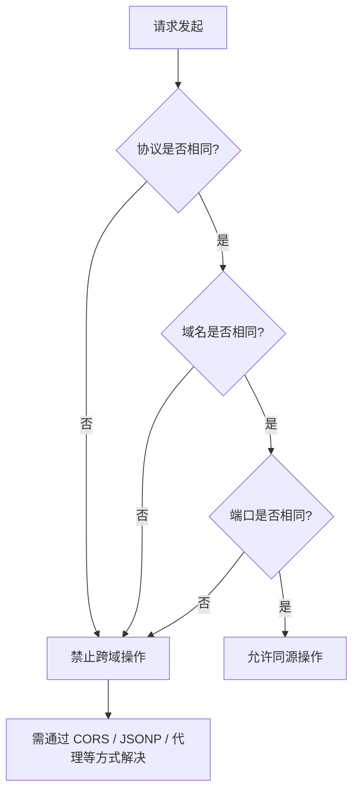

# 浏览器原理笔面试题集

> 模块：04-browser（第4周 浏览器原理）
> 覆盖：渲染流程、V8 引擎、事件循环、跨域、Web 存储、Web 安全
> 题量：15 道选择题 + 10 道简答题 + 3 道场景设计题
> 难度标注：★基础  ★★中档  ★★★拔高

---

## 一、选择题（15 题，每题附解析）

### 第 1 题 ★ 浏览器渲染流程中，以下哪个步骤最先执行？

A. 构建 CSSOM 树  
B. 解析 HTML 构建 DOM 树  
C. 构建 Render 树（渲染树）  
D. Layout 布局计算

**答案：B**

**解析**：浏览器渲染流程的第一步是解析 HTML 文档，构建 DOM 树（Document Object Model Tree）。然后才解析 CSS 构建 CSSOM 树，将两者合并为 Render 树，再进行 Layout 布局计算和 Paint 绘制。HTML 解析过程中遇到 `<script>` 标签会阻塞解析，因为 JS 可能修改 DOM。

---

### 第 2 题 ★ 以下哪个操作一定会触发回流（Reflow）？

A. 修改元素的 `color` 属性  
B. 修改元素的 `background-color` 属性  
C. 修改元素的 `width` 属性  
D. 修改元素的 `visibility` 属性

**答案：C**

**解析**：修改元素的 `width` 改变了元素的几何属性，会影响布局，所以一定会触发回流（重排）。A 和 B 只修改颜色，只触发重绘不触发回流。D 修改 `visibility` 不影响布局，也只触发重绘。

---

### 第 3 题 ★ 以下关于重排和重绘的说法，正确的是？

A. 重绘一定会触发重排  
B. 重排一定会触发重绘  
C. 重排和重绘完全独立，互不影响  
D. 使用 `display: none` 触发重排但不会触发重绘

**答案：B**

**解析**：重排一定会触发重绘。因为布局变了，元素的位置和大小发生了变化，浏览器必须重新绘制。而重绘不一定触发重排，比如只修改颜色，不改变布局。`display: none` 会同时触发重排和重绘，因为元素从无到有或从有到无都会改变布局。

---

### 第 4 题 ★★ V8 引擎中，Ignition 的作用是？

A. 将 JavaScript 代码解析为 AST（抽象语法树）  
B. 将 JavaScript 解析为字节码并解释执行  
C. 将字节码编译为优化机器码  
D. 负责垃圾回收

**答案：B**

**解析**：Ignition 是 V8 的解释器，负责将 JavaScript 代码解析为字节码并执行。A 是 Parser 解析器的工作。C 是 TurboFan 优化编译器的工作。D 垃圾回收有专门的 GC 模块负责。

---

### 第 5 题 ★★ 以下关于 Event Loop 的说法正确的是？

A. 宏任务执行完后再执行微任务  
B. 微任务在宏任务之前执行（即微任务队列优先级更高）  
C. 宏任务和微任务按注册顺序交替执行  
D. 微任务只在页面加载时执行一次

**答案：B**

**解析**：事件循环的规则是：执行完一个宏任务后，立即清空微任务队列，然后才执行下一个宏任务。所以微任务的优先级高于宏任务。A 不准确，宏任务执行完后，微任务队列会完全清空（包括执行过程中新产生的微任务），然后才执行下一个宏任务。

---

### 第 6 题 ★★ 以下哪个不属于宏任务（MacroTask）？

A. `setTimeout`  
B. `setInterval`  
C. `Promise.then`  
D. `I/O`

**答案：C**

**解析**：`Promise.then` 属于微任务（MicroTask）。宏任务包括：`setTimeout`、`setInterval`、`I/O`、`script` 整体代码段等。微任务包括：`Promise.then/catch/finally`、`MutationObserver`、`queueMicrotask`。注：UI 渲染在事件循环中独立执行，不属于宏任务或微任务队列。

---

### 第 7 题 ★★ 以下哪个不属于微任务（MicroTask）？

A. `Promise.then`  
B. `MutationObserver`  
C. `setTimeout`  
D. `queueMicrotask`

**答案：C**

**解析**：`setTimeout` 属于宏任务。微任务包括：`Promise.then/catch/finally`、`MutationObserver`、`queueMicrotask`。另外在 Node.js 环境中，`process.nextTick` 也属于微任务，且优先级高于其他微任务。

---

### 第 8 题 ★★ Cookie 的 SameSite 属性设置为 Strict 的作用是？

A. 允许所有第三方请求携带 Cookie  
B. 允许安全的第三方请求携带 Cookie（如链接跳转）  
C. 完全禁止第三方请求携带 Cookie  
D. 只允许同源请求携带 Cookie

**答案：C**

**解析**：`SameSite=Strict` 表示完全禁止第三方请求携带 Cookie，包括从第三方网站点击链接跳转到目标网站时也不会携带 Cookie。`SameSite=Lax` 则允许链接跳转、GET 表单提交等安全的第三方请求携带 Cookie。`SameSite=None` 不限制，但需要配合 `Secure` 属性（仅 HTTPS 发送）。

---

**同源策略限制范围流程图：**



> 同源策略要求协议、域名、端口三者完全一致才视为同源，任一不匹配即为跨域，需要借助 CORS 等方案实现跨域通信。

### 第 9 题 ★★ 以下哪个不是跨域解决方案？

A. CORS（跨域资源共享）  
B. JSONP  
C. 代理服务器  
D. `localStorage` 跨域共享

**答案：D**

**解析**：`localStorage` 受同源策略限制，不同源之间无法共享 `localStorage` 数据。跨域解决方案包括：CORS、JSONP、代理服务器（proxy）、`postMessage`、WebSocket、`document.domain + iframe` 等。

---

### 第 10 题 ★★ 以下关于 localStorage 和 sessionStorage 的说法，正确的是？

A. 两者容量相同，都能存储 5MB 数据  
B. sessionStorage 在关闭标签页后数据清除，localStorage 则永久保存  
C. 两者都会随 HTTP 请求自动发送到服务器  
D. localStorage 只能存储字符串，sessionStorage 可以存储对象

**答案：B**

**解析**：`sessionStorage` 在关闭标签页后数据清除，`localStorage` 永久保存（除非手动清除），这是两者最主要区别。A 容量都约 5MB，正确但不是主要区别。C 两者都是纯客户端存储，不会随 HTTP 请求发送。D 两者都只能存储字符串，存储对象需要 `JSON.stringify`。

---

### 第 11 题 ★★ 以下关于 XSS 攻击的防御措施，不正确的是？

A. 对用户输入进行校验和转义  
B. 使用 `textContent` 代替 `innerHTML`  
C. 使用 HTTPS 协议  
D. 设置 `HttpOnly` Cookie

**答案：C**

**解析**：HTTPS 可以防止中间人攻击，加密传输数据，但不能防御 XSS 攻击。XSS 攻击发生在浏览器端，攻击者将恶意脚本注入页面，HTTPS 无法阻止。防御 XSS 的正确措施包括：输入校验和输出编码、CSP 内容安全策略、`HttpOnly` Cookie、使用 `textContent` 代替 `innerHTML`。

---

### 第 12 题 ★★★ 以下关于 CSP（内容安全策略）的说法，正确的是？

A. CSP 只能通过 HTTP 响应头设置，不能在 HTML 中设置  
B. CSP 可以限制页面可以加载的资源来源（脚本、样式、图片等）  
C. CSP 的 `default-src 'self'` 表示允许所有来源  
D. CSP 无法防御 XSS 攻击

**答案：B**

**解析**：CSP（Content-Security-Policy）可以通过 HTTP 响应头或 `<meta>` 标签设置，可以限制页面可以加载的资源来源，包括脚本、样式、图片、字体、连接等。`default-src 'self'` 表示只允许同源资源（不是所有源）。CSP 是防御 XSS 的强力手段，可以禁止内联脚本和限制脚本来源。

---

### 第 13 题 ★★★ V8 垃圾回收中，新生代使用什么算法？

A. 标记清除（Mark-Sweep）  
B. 标记整理（Mark-Compact）  
C. Scavenge（Cheney 复制算法）  
D. 增量标记（Incremental Marking）

**答案：C**

**解析**：V8 新生代使用 Scavenge 算法（Cheney 复制算法），将新生代空间分为 From 和 To 两块，复制存活对象到 To 空间后清空 From 空间。标记清除和标记整理用于老生代。增量标记是为了减少全停顿时间，将标记过程拆分，可与 JS 执行交替进行。

---

### 第 14 题 ★★ 以下关于 requestAnimationFrame 的说法，正确的是？

A. 在浏览器空闲时执行回调  
B. 在浏览器下次重绘之前执行回调  
C. 回调执行频率固定为每秒 60 次  
D. 页面不可见时仍然会执行回调

**答案：B**

**解析**：`requestAnimationFrame` 在浏览器下次重绘之前执行回调，频率与屏幕刷新率同步（通常 60fps，但不是固定的）。页面不可见时（如切换到其他标签页）会自动暂停，节省资源。A 是 `requestIdleCallback` 的特点。

---

### 第 15 题 ★★★ 以下关于浏览器进程架构的说法，正确的是？

A. 所有标签页共享同一个渲染进程  
B. Chrome 中每个标签页运行在独立的渲染进程中  
C. 渲染进程崩溃会导致整个浏览器退出  
D. 浏览器只有一个主进程，所有功能都在主进程中

**答案：B**

**解析**：Chrome 采用多进程架构，默认每个标签页一个独立的渲染进程，这样一个标签页崩溃不会影响其他标签页和整个浏览器。浏览器包含多个进程：浏览器主进程、渲染进程、GPU 进程、网络进程、插件进程等。渲染进程崩溃只会影响对应的标签页。

> 📖 **参考链接**：
> - [web.dev - 关键渲染路径（Critical Rendering Path）](https://web.dev/learn/performance/understanding-the-critical-path)
> - [MDN - 事件循环（Event Loop）](https://developer.mozilla.org/zh-CN/docs/Web/JavaScript/EventLoop)
> - [MDN - 跨站脚本攻击（XSS）](https://developer.mozilla.org/zh-CN/docs/Glossary/Cross-site_scripting)

---

## 二、简答题（10 题）

### 第 1 题 ★★ 请描述浏览器从输入 URL 到页面显示的完整渲染流程。

**参考答案：**

1. **构建 DOM 树**：HTML 解析器将 HTML 字节流解析为 DOM 树，遇到 `<script>` 标签会阻塞解析
2. **构建 CSSOM 树**：CSS 解析器将 CSS 解析为 CSSOM 树，CSS 不会阻塞 DOM 解析但会阻塞渲染树构建
3. **生成 Render 树**：将 DOM 树和 CSSOM 树合并，只保留可见节点（`display: none` 的节点不会出现）
4. **Layout 布局**：计算每个节点在屏幕上的确切位置和大小（回流 / Reflow）
5. **Paint 绘制**：将节点的样式内容绘制为像素（重绘 / Repaint）
6. **Composite 合成**：将不同图层按照正确顺序合成到屏幕

---

### 第 2 题 ★★ 请解释重排（Reflow）和重绘（Repaint）的区别，以及关系。

**参考答案：**

**重排（Reflow）**：当元素的几何属性（宽高、位置、显示/隐藏）发生变化时，浏览器重新计算渲染树中元素的布局，这个过程叫重排。重排代价大，因为需要重新计算所有受影响元素的布局。

**重绘（Repaint）**：当元素的外观属性（颜色、背景色、边框颜色等）发生变化时，浏览器重新绘制元素，这个过程叫重绘。重绘代价相对较小。

**关系**：重排一定会触发重绘（布局变了必须重新绘制），但重绘不一定触发重排（只改颜色不影响布局）。

**常见触发重排的操作**：修改 width/height、添加/删除 DOM 元素、改变元素位置、改变 `display` 属性、读取 `offsetWidth` 等布局属性。

**常见只触发重绘的操作**：修改 color、background-color、visibility。

---

### 第 3 题 ★★ 如何减少重排重绘？请至少说出 4 种方法。

**参考答案：**

1. **批量修改 DOM**：使用 DocumentFragment 一次性插入多个节点，避免逐个插入触发多次重排
2. **使用 className 批量修改样式**：避免逐条修改 `element.style.xxx`，改为一次性修改 className
3. **离线 DOM 操作**：先将元素设置 `display: none`，修改完后再显示，中间修改不触发重排
4. **使用 transform 代替 top/left**：transform 只触发合成，不触发重排和重绘
5. **使用 requestAnimationFrame**：在下一帧渲染前统一更新 DOM
6. **将频繁重绘的元素提升为独立图层**：使用 `will-change: transform` 或 `transform: translateZ(0)`
7. **避免在循环中读取布局属性**：如 offsetWidth/offsetHeight 会强制浏览器同步回流，应先读取再统一修改

---

### 第 4 题 ★★ 请描述 V8 垃圾回收机制，包括新生代和老生代分别使用什么算法。

**参考答案：**

V8 采用分代垃圾回收策略，将堆内存分为新生代和老生代。

**新生代**：
- 存放新创建、生命周期短的对象
- 使用 **Scavenge 算法（Cheney 复制算法）**
- 将空间分为 From 和 To 两块，标记 From 中的活对象，复制到 To 空间，清除 From 空间，交换角色
- 优点：简单高效，内存连续无碎片；缺点：空间利用率只有一半
- 经历两次回收还存活的对象晋升到老生代

**老生代**：
- 存放生命周期长的对象
- 使用 **Mark-Sweep（标记清除）+ Mark-Compact（标记整理）** 组合
- 标记清除：标记活对象，清除死对象，会产生内存碎片
- 标记整理：将活对象移向一端，清理边界外内存，消除碎片
- 平时用标记清除，碎片多时用标记整理

**增量标记**：为减少全停顿（Stop-The-World）时间，将标记过程拆分为小步骤，与 JS 执行交替进行。

---

### 第 5 题 ★★★ 请详细描述浏览器事件循环机制，包括宏任务和微任务的执行顺序。

**参考答案：**

浏览器事件循环（Event Loop）是 JavaScript 处理异步操作的核心机制。

**两个队列**：
- **宏任务队列**：`script`（整体代码段）、`setTimeout`、`setInterval`、`I/O`
- **微任务队列**：`Promise.then/catch/finally`、`MutationObserver`、`queueMicrotask`

**执行顺序**：
1. 执行同步代码（script 整体是一个宏任务）
2. 清空微任务队列（所有微任务全部执行完，包括执行过程中新产生的微任务）
3. 取出一个宏任务执行
4. 清空微任务队列
5. 取出下一个宏任务执行
6. 循环往复

**关键规则**：
- 微任务必须在当前宏任务执行完后立即清空，然后才能执行下一个宏任务
- 微任务执行过程中产生的新微任务，也会在当前轮次清空
- 宏任务之间可能执行 UI 渲染

**示例**：
```javascript
console.log('1');
setTimeout(() => console.log('2'), 0);
Promise.resolve().then(() => console.log('3'));
console.log('4');
// 输出：1 → 4 → 3 → 2
```

---

### 第 6 题 ★★ 跨域的解决方案有哪些？请至少说出 4 种。

**参考答案：**

跨域问题的根源是浏览器的同源策略（协议 + 域名 + 端口必须相同）。

1. **CORS（跨域资源共享）**：服务器设置 `Access-Control-Allow-Origin` 响应头，浏览器自动处理跨域请求。分为简单请求和预检请求（OPTIONS）。
2. **JSONP**：利用 `<script>` 标签不受同源策略限制，通过回调函数传递数据。只支持 GET 请求，安全性差。
3. **代理服务器**：开发环境用 Vite/Webpack 的 proxy 配置，生产环境用 Nginx 反向代理，将跨域请求转为同源请求。
4. **postMessage**：HTML5 提供的跨窗口通信 API，可以安全地实现跨源通信。
5. **WebSocket**：WebSocket 协议不受同源策略限制。
6. **document.domain + iframe**：仅适用于主域名相同、子域名不同的情况（已逐步废弃）。

---

### 第 7 题 ★★ 请对比 Cookie、localStorage、sessionStorage、IndexedDB 的区别。

**参考答案：**

| 特性 | Cookie | localStorage | sessionStorage | IndexedDB |
|------|--------|-------------|---------------|-----------|
| 容量 | 约 4KB | 约 5MB | 约 5MB | 无上限 |
| 生命周期 | 可设置过期时间 | 永久 | 关闭标签页清除 | 永久 |
| 通信方式 | 每次 HTTP 请求自动携带 | 纯客户端 | 纯客户端 | 纯客户端 |
| 数据类型 | 字符串 | 字符串 | 字符串 | 结构化数据 |
| API 方式 | 字符串操作 | 简单 API | 简单 API | 异步，支持事务 |

**适用场景**：Cookie 用于用户认证；localStorage 用于长期缓存；sessionStorage 用于表单临时数据；IndexedDB 用于大量结构化数据或离线应用。

---

### 第 8 题 ★★ 请解释 XSS 攻击的原理和防御措施。

**参考答案：**

**XSS（跨站脚本攻击）**：攻击者将恶意脚本注入到页面中，当用户访问页面时脚本在浏览器中执行。

**三种类型**：
1. **存储型 XSS**：恶意脚本存储在服务器，用户访问时执行
2. **反射型 XSS**：恶意脚本通过 URL 参数传递，服务器反射到页面
3. **DOM 型 XSS**：纯客户端发生，前端代码不当地将用户输入插入 DOM

**防御措施**：
1. **输入校验 + 输出编码**：对用户输入进行严格校验，输出时转义特殊字符（`<` → `&lt;` 等）
2. **使用 textContent 代替 innerHTML**：避免将用户输入直接作为 HTML 插入
3. **CSP（内容安全策略）**：通过 HTTP 响应头限制脚本来源，禁止内联脚本
4. **HttpOnly Cookie**：设置 Cookie 为 HttpOnly，JavaScript 无法读取，防止 Cookie 被盗
5. **使用 DOMPurify 等库**：对用户输入进行 HTML 清理

---

### 第 9 题 ★★ 请解释 CSRF 攻击的原理和防御措施。

**参考答案：**

**CSRF（跨站请求伪造）**：攻击者利用用户已登录的状态，诱导用户点击恶意链接或访问恶意页面，以用户身份发起非预期请求。

**攻击原理**：
1. 用户登录了 A 网站，浏览器保存了 Cookie
2. 用户访问恶意网站 B，B 网站向 A 网站发送请求
3. 浏览器自动携带 A 网站的 Cookie，A 网站以为是用户自己发起的请求

**防御措施**：
1. **CSRF Token**：服务器生成随机 Token，嵌入表单或请求头，提交时验证
2. **SameSite Cookie**：`SameSite=Strict` 完全禁止第三方请求携带 Cookie
3. **Referer / Origin 校验**：服务器检查请求来源，拒绝非许可域名
4. **双重 Cookie 验证**：Cookie 中的一个值和请求头中的值一致才通过

---

### 第 10 题 ★★★ 请说明 CSP（内容安全策略）的作用和常用配置。

**参考答案：**

**CSP（Content-Security-Policy）** 通过 HTTP 响应头或 `<meta>` 标签，告诉浏览器哪些资源可以加载和执行，是防御 XSS 的强力手段。

**常用配置示例**：
```http
Content-Security-Policy: default-src 'self'; script-src 'self' https://trusted-cdn.com; style-src 'self' 'unsafe-inline'; img-src *; connect-src 'self' https://api.example.com; font-src 'self'; object-src 'none'; frame-ancestors 'self'; base-uri 'self'; form-action 'self'
```

**常用指令**：
- `default-src`：默认源，其他指令未设置时的回退值
- `script-src`：JavaScript 脚本来源，可设置 `'nonce-xxx'` 或 `'strict-dynamic'`
- `style-src`：CSS 样式来源
- `img-src`：图片来源
- `connect-src`：AJAX、WebSocket 等连接来源
- `font-src`：字体来源
- `frame-ancestors`：可嵌入当前页面的域名（防御点击劫持）
- `object-src`：插件来源，建议设为 `'none'`

> 📖 **参考链接**：
> - [MDN - 内容安全策略（CSP）](https://developer.mozilla.org/zh-CN/docs/Web/HTTP/CSP)
> - [MDN - 跨站请求伪造（CSRF）](https://developer.mozilla.org/zh-CN/docs/Glossary/CSRF)
> - [MDN - 跨域资源共享（CORS）](https://developer.mozilla.org/zh-CN/docs/Web/HTTP/CORS)

---

## 三、场景设计题（3 题）

### 场景设计题 1 ★★ 设计一个前端错误监控系统

**题目**：请设计一个前端错误监控系统，需要捕获 JS 运行时错误、Promise 未捕获错误、资源加载错误、接口请求错误，并将错误信息上报到服务器。

**参考答案**：

```javascript
// 前端错误监控 SDK 核心实现
class ErrorMonitor {
  constructor(options) {
    this.reportUrl = options.reportUrl || '/api/errors';
    this.appId = options.appId || 'default';
    this.init();
  }

  init() {
    this.catchJsError();
    this.catchPromiseError();
    this.catchResourceError();
    this.catchRequestError();
  }

  // 1. 捕获 JS 运行时错误
  catchJsError() {
    window.addEventListener('error', (event) => {
      // 区分 JS 错误和资源加载错误
      if (event.target instanceof Window) {
        this.report({
          type: 'js_error',
          message: event.message,
          filename: event.filename,
          line: event.lineno,
          column: event.colno,
          stack: event.error?.stack || ''
        });
      }
    }, true);
  }

  // 2. 捕获 Promise 未捕获错误
  catchPromiseError() {
    window.addEventListener('unhandledrejection', (event) => {
      this.report({
        type: 'promise_error',
        message: event.reason?.message || String(event.reason),
        stack: event.reason?.stack || ''
      });
    });
  }

  // 3. 捕获资源加载错误（图片、脚本、样式等）
  catchResourceError() {
    window.addEventListener('error', (event) => {
      const target = event.target;
      // 资源加载错误的 target 是具体的元素（img, script, link）
      if (target !== window) {
        this.report({
          type: 'resource_error',
          tagName: target.tagName,
          src: target.src || target.href || '',
          message: `Failed to load ${target.tagName}: ${target.src || target.href}`
        });
      }
    }, true);
  }

  // 4. 捕获接口请求错误（需要包装 fetch 或 XMLHttpRequest）
  catchRequestError() {
    this.wrapFetch();
    this.wrapXHR();
  }

  wrapFetch() {
    const originalFetch = window.fetch;
    const self = this;
    window.fetch = function(...args) {
      const startTime = Date.now();
      return originalFetch.apply(this, args)
        .then((response) => {
          const duration = Date.now() - startTime;
          // 非 2xx 状态码视为错误
          if (!response.ok) {
            self.report({
              type: 'fetch_error',
              url: args[0],
              method: args[1]?.method || 'GET',
              status: response.status,
              duration
            });
          }
          return response;
        })
        .catch((error) => {
          self.report({
            type: 'fetch_error',
            url: args[0],
            message: error.message,
            duration: Date.now() - startTime
          });
          throw error;
        });
    };
  }

  wrapXHR() {
    const originalOpen = XMLHttpRequest.prototype.open;
    const originalSend = XMLHttpRequest.prototype.send;
    const self = this;

    XMLHttpRequest.prototype.open = function(method, url) {
      this._monitorUrl = url;
      this._monitorMethod = method;
      return originalOpen.apply(this, arguments);
    };

    XMLHttpRequest.prototype.send = function() {
      const xhr = this;
      const startTime = Date.now();
      xhr.addEventListener('loadend', () => {
        const duration = Date.now() - startTime;
        if (xhr.status < 200 || xhr.status >= 400) {
          self.report({
            type: 'xhr_error',
            url: xhr._monitorUrl,
            method: xhr._monitorMethod,
            status: xhr.status,
            duration
          });
        }
      });
      return originalSend.apply(this, arguments);
    };
  }

  // 上报错误（使用 sendBeacon 保证页面关闭时也能上报）
  report(data) {
    const payload = {
      ...data,
      appId: this.appId,
      timestamp: Date.now(),
      userAgent: navigator.userAgent,
      pageUrl: location.href
    };

    if (navigator.sendBeacon) {
      navigator.sendBeacon(this.reportUrl, JSON.stringify(payload));
    } else {
      // 降级方案：使用 Image 打点（GET 请求，数据量有限）
      const params = encodeURIComponent(JSON.stringify(payload));
      new Image().src = `${this.reportUrl}?data=${params}`;
    }
  }
}

// 使用
const monitor = new ErrorMonitor({
  reportUrl: 'https://api.example.com/errors',
  appId: 'trading-platform'
});
```

**设计要点**：
- 使用 `window.error` 捕获 JS 运行时错误
- 使用 `unhandledrejection` 捕获 Promise 错误
- 通过判断 `event.target` 区分 JS 错误和资源加载错误
- 包装 fetch 和 XHR 来捕获接口错误
- 使用 `sendBeacon` 上报，保证页面关闭时也能发送
- 上报数据包含：错误类型、消息、堆栈、时间戳、页面 URL、用户代理

---

### 场景设计题 2 ★★ 设计一个跨域资源共享方案

**题目**：你的前端应用部署在 `https://frontend.example.com`，后端 API 部署在 `https://api.example.com`。请设计一个完整的跨域解决方案，包括 CORS 服务端配置、JSONP 降级方案、开发环境代理配置。

**参考答案：**

```javascript
// ========== 方案一：CORS（推荐方案） ==========

// 服务端配置（Express 示例）
const express = require('express');
const cors = require('cors');

const app = express();

// CORS 中间件配置
const corsOptions = {
  origin: function(origin, callback) {
    // 白名单校验
    const allowedOrigins = [
      'https://frontend.example.com',
      'https://admin.example.com',
      'http://localhost:5173'  // 开发环境
    ];
    if (!origin || allowedOrigins.includes(origin)) {
      callback(null, true);
    } else {
      callback(new Error('Not allowed by CORS'));
    }
  },
  credentials: true,              // 允许携带 Cookie
  methods: ['GET', 'POST', 'PUT', 'DELETE', 'OPTIONS'],
  allowedHeaders: ['Content-Type', 'Authorization', 'X-CSRF-Token'],
  exposedHeaders: ['X-Total-Count'],
  maxAge: 86400                   // 预检请求缓存 24 小时
};

app.use(cors(corsOptions));

// 手动设置 CORS 头（不使用 cors 中间件时）
app.use((req, res, next) => {
  const origin = req.headers.origin;
  if (allowedOrigins.includes(origin)) {
    res.setHeader('Access-Control-Allow-Origin', origin);
    res.setHeader('Access-Control-Allow-Credentials', 'true');
    res.setHeader('Access-Control-Allow-Methods', 'GET, POST, PUT, DELETE, OPTIONS');
    res.setHeader('Access-Control-Allow-Headers', 'Content-Type, Authorization');
    res.setHeader('Access-Control-Max-Age', '86400');
  }
  // 处理 OPTIONS 预检请求
  if (req.method === 'OPTIONS') {
    return res.sendStatus(204);
  }
  next();
});

// 前端请求配置
const apiClient = {
  baseURL: 'https://api.example.com',
  
  async request(url, options = {}) {
    const response = await fetch(`${this.baseURL}${url}`, {
      ...options,
      credentials: 'include', // 携带 Cookie
      headers: {
        'Content-Type': 'application/json',
        ...options.headers
      }
    });
    if (!response.ok) {
      throw new Error(`HTTP ${response.status}`);
    }
    return response.json();
  },
  
  get(url) { return this.request(url, { method: 'GET' }); },
  post(url, data) { return this.request(url, { method: 'POST', body: JSON.stringify(data) }); }
};

// ========== 方案二：JSONP（降级方案，仅 GET） ==========

function jsonp(url, callbackName = 'callback') {
  return new Promise((resolve, reject) => {
    const fnName = `jsonp_${Date.now()}_${Math.random().toString(36).slice(2)}`;
    
    // 全局回调函数
    window[fnName] = (data) => {
      resolve(data);
      cleanup();
    };
    
    const script = document.createElement('script');
    script.src = `${url}${url.includes('?') ? '&' : '?'}${callbackName}=${fnName}`;
    script.onerror = () => {
      reject(new Error('JSONP request failed'));
      cleanup();
    };
    
    function cleanup() {
      delete window[fnName];
      document.body.removeChild(script);
    }
    
    document.body.appendChild(script);
  });
}

// 使用示例
jsonp('https://api.example.com/data').then(data => console.log(data));

// 服务端 JSONP 响应
// 如果请求参数中包含 callback，返回：
// res.send(`${req.query.callback}(${JSON.stringify(data)})`);

// ========== 方案三：开发环境代理配置 ==========

// Vite 配置 (vite.config.js)
export default {
  server: {
    port: 5173,
    proxy: {
      '/api': {
        target: 'https://api.example.com',
        changeOrigin: true,
        rewrite: (path) => path.replace(/^\/api/, ''),
        configure: (proxy) => {
          proxy.on('error', (err) => console.error('Proxy error:', err));
        }
      }
    }
  }
};

// Webpack 配置 (webpack.config.js)
module.exports = {
  devServer: {
    proxy: {
      '/api': {
        target: 'https://api.example.com',
        changeOrigin: true,
        pathRewrite: { '^/api': '' }
      }
    }
  }
};

// Nginx 生产环境反向代理
// location /api/ {
//     proxy_pass https://api.example.com/;
//     proxy_set_header Host $host;
//     proxy_set_header X-Real-IP $remote_addr;
// }
```

**设计要点**：
- CORS 是首选方案，支持所有 HTTP 方法，安全性高
- 服务端需要白名单校验，防止任意来源访问
- 开发环境使用代理，避免跨域问题
- JSONP 仅作为 GET 请求的降级方案
- 生产环境用 Nginx 反向代理，隐藏后端真实地址

---

### 场景设计题 3 ★★★ 设计一个前端性能监控 SDK

**题目**：请设计一个前端性能监控 SDK，可以采集 Core Web Vitals 核心指标（FP、FCP、LCP、CLS、FID / INP），并支持自定义指标上报。要求包括指标采集、数据聚合、上报策略。

**参考答案**：

```javascript
// 前端性能监控 SDK
class PerformanceMonitor {
  constructor(options = {}) {
    this.reportUrl = options.reportUrl || '/api/performance';
    this.appId = options.appId || 'default';
    this.sampleRate = options.sampleRate || 1; // 采样率
    this.buffer = [];
    this.maxBufferSize = 10;
    this.flushInterval = 5000; // 5 秒批量上报
    this.init();
  }

  init() {
    // 采样控制
    if (Math.random() > this.sampleRate) return;
    
    this.collectNavigationTiming();
    this.collectResourceTiming();
    this.collectFP();
    this.collectFCP();
    this.collectLCP();
    this.collectCLS();
    this.collectFID();
    this.collectINP();
    this.startFlushTimer();
    this.collectPageInfo();
  }

  // ========== 1. 导航时序指标（FP 之前的指标） ==========
  collectNavigationTiming() {
    if (document.readyState === 'complete') {
      this.getNavigationMetrics();
    } else {
      window.addEventListener('load', () => {
        setTimeout(() => this.getNavigationMetrics(), 0);
      });
    }
  }

  getNavigationMetrics() {
    const timing = performance.getEntriesByType('navigation')[0];
    if (!timing) return;

    this.addMetric({
      type: 'navigation',
      dns: timing.domainLookupEnd - timing.domainLookupStart,
      tcp: timing.connectEnd - timing.connectStart,
      ttfb: timing.responseStart - timing.requestStart,       // 首字节时间
      domReady: timing.domContentLoadedEventEnd - timing.fetchStart,
      loadComplete: timing.loadEventEnd - timing.fetchStart,
      domParse: timing.domInteractive - timing.responseEnd
    });
  }

  // ========== 2. 资源加载指标 ==========
  collectResourceTiming() {
    window.addEventListener('load', () => {
      setTimeout(() => {
        const resources = performance.getEntriesByType('resource');
        const stats = { js: [], css: [], img: [], total: resources.length };
        
        resources.forEach((r) => {
          const item = {
            name: r.name,
            duration: Math.round(r.duration),
            size: r.transferSize || 0
          };
          if (r.initiatorType === 'script') stats.js.push(item);
          else if (r.initiatorType === 'css' || r.initiatorType === 'link') stats.css.push(item);
          else if (r.initiatorType === 'img') stats.img.push(item);
        });
        
        this.addMetric({ type: 'resources', ...stats });
      }, 0);
    });
  }

  // ========== 3. FP（First Paint，首次绘制） ==========
  collectFP() {
    const entry = performance.getEntriesByType('paint')
      .find(e => e.name === 'first-paint');
    if (entry) {
      this.addMetric({ type: 'fp', value: Math.round(entry.startTime) });
    }
  }

  // ========== 4. FCP（First Contentful Paint，首次内容绘制） ==========
  collectFCP() {
    const entry = performance.getEntriesByType('paint')
      .find(e => e.name === 'first-contentful-paint');
    if (entry) {
      this.addMetric({ type: 'fcp', value: Math.round(entry.startTime) });
    }
  }

  // ========== 5. LCP（Largest Contentful Paint，最大内容绘制） ==========
  collectLCP() {
    new PerformanceObserver((list) => {
      const entries = list.getEntries();
      const lastEntry = entries[entries.length - 1];
      this.addMetric({
        type: 'lcp',
        value: Math.round(lastEntry.startTime),
        element: lastEntry.element?.tagName || ''
      });
    }).observe({ type: 'largest-contentful-paint', buffered: true });
  }

  // ========== 6. CLS（Cumulative Layout Shift，累计布局偏移） ==========
  collectCLS() {
    let clsValue = 0;
    new PerformanceObserver((list) => {
      for (const entry of list.getEntries()) {
        // 只统计非用户交互导致的布局偏移
        if (!entry.hadRecentInput) {
          clsValue += entry.value;
        }
      }
      this.addMetric({ type: 'cls', value: Math.round(clsValue * 10000) / 10000 });
    }).observe({ type: 'layout-shift', buffered: true });
  }

  // ========== 7. FID（First Input Delay，首次输入延迟） ==========
  collectFID() {
    new PerformanceObserver((list) => {
      for (const entry of list.getEntries()) {
        this.addMetric({
          type: 'fid',
          value: Math.round(entry.processingStart - entry.startTime),
          target: entry.target?.tagName || ''
        });
      }
    }).observe({ type: 'first-input', buffered: true });
  }

  // ========== 8. INP（Interaction to Next Paint，交互到下次绘制） ==========
  collectINP() {
    let maxInteractionTime = 0;
    new PerformanceObserver((list) => {
      for (const entry of list.getEntries()) {
        const duration = entry.duration;
        if (duration > maxInteractionTime) {
          maxInteractionTime = duration;
        }
      }
      this.addMetric({ type: 'inp', value: Math.round(maxInteractionTime) });
    }).observe({ type: 'event', buffered: true, durationThreshold: 16 });
  }

  // ========== 9. 页面基础信息 ==========
  collectPageInfo() {
    this.addMetric({
      type: 'page_info',
      href: location.href,
      referrer: document.referrer,
      screen: `${window.screen.width}x${window.screen.height}`,
      connection: navigator.connection?.effectiveType || 'unknown'
    });
  }

  // ========== 自定义指标 ==========
  customMetric(name, value, extra = {}) {
    this.addMetric({ type: 'custom', name, value, ...extra });
  }

  // ========== 数据聚合与上报 ==========
  addMetric(data) {
    this.buffer.push({
      ...data,
      appId: this.appId,
      timestamp: Date.now()
    });
    
    // buffer 满了立即上报
    if (this.buffer.length >= this.maxBufferSize) {
      this.flush();
    }
  }

  flush() {
    if (this.buffer.length === 0) return;
    
    const data = this.buffer.splice(0);
    
    // 使用 sendBeacon 上报（页面卸载时也能发送）
    const payload = JSON.stringify(data);
    
    if (navigator.sendBeacon) {
      navigator.sendBeacon(this.reportUrl, payload);
    } else {
      fetch(this.reportUrl, {
        method: 'POST',
        body: payload,
        headers: { 'Content-Type': 'application/json' },
        keepalive: true
      });
    }
  }

  startFlushTimer() {
    // 定时上报
    setInterval(() => this.flush(), this.flushInterval);
    // 页面隐藏时上报
    document.addEventListener('visibilitychange', () => {
      if (document.visibilityState === 'hidden') {
        this.flush();
      }
    });
    // 页面卸载时上报
    window.addEventListener('beforeunload', () => this.flush());
  }
}

// ========== 使用示例 ==========

const monitor = new PerformanceMonitor({
  reportUrl: 'https://api.example.com/metrics',
  appId: 'trading-platform',
  sampleRate: 0.1 // 10% 采样
});

// 自定义指标：API 请求耗时
async function apiWithTiming(url, options) {
  const start = Date.now();
  const response = await fetch(url, options);
  const duration = Date.now() - start;
  monitor.customMetric('api_duration', duration, { url, status: response.status });
  return response;
}

// ========== Core Web Vitals 评分标准参考 ==========
// FCP:  Good < 1.8s,  Poor > 3.0s
// LCP:  Good < 2.5s,  Poor > 4.0s
// FID:  Good < 100ms, Poor > 300ms
// CLS:  Good < 0.1,   Poor > 0.25
// INP:  Good < 200ms, Poor > 500ms
// TTFB: Good < 800ms, Poor > 1800ms
```

**设计要点**：
- 使用 PerformanceObserver API 采集 Core Web Vitals 指标
- 覆盖 FP、FCP、LCP、CLS、FID（INP）等核心指标
- 采集传统导航时序指标（DNS、TCP、TTFB 等）
- 支持自定义指标上报
- 批量上报 + 定时上报，减少请求次数
- 使用 sendBeacon 保证页面关闭时也能发送
- 支持采样率控制，避免大数据量
- 页面隐藏/卸载时主动上报，防止数据丢失

---

## 补充代码示例：跨域解决方案

### 补充1：CORS 完整配置示例

```javascript
// ========== 服务端 CORS 配置（Express 完整示例） ==========

const express = require('express');
const cors = require('cors');

const app = express();

// 方式一：使用 cors 中间件（推荐）
const corsOptions = {
  origin: function (origin, callback) {
    // 白名单校验
    const allowedOrigins = [
      'https://frontend.example.com',
      'https://admin.example.com',
      'http://localhost:5173',   // 开发环境
    ];
    if (!origin || allowedOrigins.includes(origin)) {
      callback(null, true);
    } else {
      callback(new Error('Not allowed by CORS'));
    }
  },
  credentials: true,              // 允许携带 Cookie
  methods: ['GET', 'POST', 'PUT', 'DELETE', 'PATCH', 'OPTIONS'],
  allowedHeaders: [
    'Content-Type',
    'Authorization',
    'X-Requested-With',
    'X-CSRF-Token',
  ],
  exposedHeaders: [
    'X-Total-Count',
    'X-RateLimit-Limit',
  ],
  maxAge: 86400,                  // 预检请求缓存 24 小时
};

app.use(cors(corsOptions));

// 方式二：手动设置 CORS 响应头（不使用 cors 中间件）
app.use((req, res, next) => {
  const origin = req.headers.origin;
  const allowedOrigins = [
    'https://frontend.example.com',
    'http://localhost:5173',
  ];

  if (allowedOrigins.includes(origin)) {
    res.setHeader('Access-Control-Allow-Origin', origin);
    // 注意：携带 Cookie 时 origin 不能为 '*'
    res.setHeader('Access-Control-Allow-Credentials', 'true');
    res.setHeader(
      'Access-Control-Allow-Methods',
      'GET, POST, PUT, DELETE, PATCH, OPTIONS'
    );
    res.setHeader(
      'Access-Control-Allow-Headers',
      'Content-Type, Authorization, X-Requested-With'
    );
    res.setHeader('Access-Control-Max-Age', '86400');
  }

  // 处理 OPTIONS 预检请求
  if (req.method === 'OPTIONS') {
    return res.sendStatus(204);
  }

  next();
});

// ========== 前端 CORS 请求配置 ==========

// 携带 Cookie 的跨域请求
fetch('https://api.example.com/data', {
  method: 'GET',
  credentials: 'include',           // 关键：携带 Cookie
  headers: {
    'Content-Type': 'application/json',
  },
})
  .then((res) => res.json())
  .then((data) => console.log(data));

// 封装通用请求函数
function createApiClient(baseURL) {
  return {
    async request(url, options = {}) {
      const response = await fetch(`${baseURL}${url}`, {
        ...options,
        credentials: 'include',
        headers: {
          'Content-Type': 'application/json',
          ...options.headers,
        },
      });

      if (!response.ok) {
        throw new Error(`HTTP ${response.status}: ${response.statusText}`);
      }

      return response.json();
    },

    get(url, params) {
      const query = params
        ? '?' + new URLSearchParams(params).toString()
        : '';
      return this.request(url + query, { method: 'GET' });
    },

    post(url, data) {
      return this.request(url, {
        method: 'POST',
        body: JSON.stringify(data),
      });
    },

    put(url, data) {
      return this.request(url, {
        method: 'PUT',
        body: JSON.stringify(data),
      });
    },

    delete(url) {
      return this.request(url, { method: 'DELETE' });
    },
  };
}

const api = createApiClient('https://api.example.com');
```

### 补充2：JSONP 完整实现

```javascript
/**
 * JSONP 实现：利用 <script> 标签不受同源策略限制
 * 注意：仅支持 GET 请求，服务端需要配合返回 callback(data) 格式
 */

/**
 * 封装 JSONP 请求
 * @param {string} url - 请求地址
 * @param {Object} options - 配置项
 * @param {string} options.callbackKey - 回调函数名的 query 参数名，默认 'callback'
 * @param {number} options.timeout - 超时时间（毫秒），默认 10000
 * @returns {Promise<any>} 返回 Promise
 */
function jsonp(url, options = {}) {
  const {
    callbackKey = 'callback',
    timeout = 10000,
  } = options;

  return new Promise((resolve, reject) => {
    // 生成唯一回调函数名
    const callbackName = `jsonp_${Date.now()}_${Math.random().toString(36).slice(2, 8)}`;

    // 超时处理
    const timeoutId = setTimeout(() => {
      cleanup();
      reject(new Error(`JSONP 请求超时 (${timeout}ms)`));
    }, timeout);

    // 在全局作用域注册回调函数
    window[callbackName] = (data) => {
      clearTimeout(timeoutId);
      cleanup();
      resolve(data);
    };

    // 清理函数
    function cleanup() {
      if (script.parentNode) {
        script.parentNode.removeChild(script);
      }
      delete window[callbackName];
    }

    // 创建 script 标签
    const script = document.createElement('script');
    const separator = url.includes('?') ? '&' : '?';
    script.src = `${url}${separator}${callbackKey}=${callbackName}`;

    // 错误处理
    script.onerror = () => {
      clearTimeout(timeoutId);
      cleanup();
      reject(new Error('JSONP 请求失败'));
    };

    // 插入 DOM，开始加载
    document.body.appendChild(script);
  });
}

// ========== 使用示例 ==========

// 前端调用
jsonp('https://api.example.com/search', {
  callbackKey: 'cb',
  timeout: 5000,
})
  .then((data) => {
    console.log('JSONP 请求成功:', data);
  })
  .catch((err) => {
    console.error('JSONP 请求失败:', err.message);
  });

// ========== 服务端 JSONP 响应（Node.js/Express） ==========

// 服务端需要检测 callback 参数，将响应包装为函数调用
app.get('/api/search', (req, res) => {
  const { cb, q } = req.query;

  // 业务逻辑
  const results = searchDatabase(q);

  if (cb) {
    // JSONP 响应：将数据包装为回调函数调用
    res.setHeader('Content-Type', 'application/javascript');
    res.send(`${cb}(${JSON.stringify(results)})`);
  } else {
    // 普通 JSON 响应
    res.json(results);
  }
});
```

### 补充3：postMessage 跨窗口通信完整实现

```javascript
// ========== 场景一：父页面与 iframe 通信 ==========

// ---------- 父页面 ----------
// 发送消息给 iframe
function sendToIframe(iframeElement, data) {
  iframeElement.contentWindow.postMessage(
    {
      type: 'FROM_PARENT',
      payload: data,
      timestamp: Date.now(),
    },
    'https://child.example.com' // 指定目标源（安全）
  );
}

// 接收 iframe 发来的消息
window.addEventListener('message', (event) => {
  // 验证消息来源（安全关键）
  if (event.origin !== 'https://child.example.com') {
    return;
  }

  const { type, payload } = event.data;

  switch (type) {
    case 'FROM_CHILD':
      console.log('收到 iframe 消息:', payload);
      break;
    case 'CHILD_READY':
      console.log('iframe 已加载完成');
      break;
    default:
      break;
  }
});

// ---------- 子页面（iframe 内） ----------
// 告知父页面自己已就绪
window.parent.postMessage(
  { type: 'CHILD_READY', timestamp: Date.now() },
  'https://parent.example.com'
);

// 向父页面发送消息
function sendToParent(data) {
  window.parent.postMessage(
    {
      type: 'FROM_CHILD',
      payload: data,
      timestamp: Date.now(),
    },
    'https://parent.example.com'
  );
}

// 接收父页面消息
window.addEventListener('message', (event) => {
  if (event.origin !== 'https://parent.example.com') {
    return;
  }

  const { type, payload } = event.data;
  if (type === 'FROM_PARENT') {
    console.log('收到父页面消息:', payload);
  }
});

// ========== 场景二：两个同源标签页通信 ==========

// ---------- 标签页 A ----------
// 向标签页 B 发送消息
function sendToTabB(data) {
  // 通过 window.open 获取目标窗口引用
  const targetWindow = window.open('https://example.com/page-b');
  targetWindow.postMessage(
    { type: 'TAB_MESSAGE', payload: data },
    'https://example.com'
  );
}

// ---------- 标签页 B ----------
// 监听来自其他标签页的消息
window.addEventListener('message', (event) => {
  if (event.origin !== 'https://example.com') {
    return;
  }

  if (event.data.type === 'TAB_MESSAGE') {
    console.log('收到标签页 A 的消息:', event.data.payload);
  }
});

// ========== 场景三：跨域窗口通信封装 ==========

/**
 * 安全的跨窗口通信封装
 */
class CrossWindowMessenger {
  constructor(targetOrigin) {
    this.targetOrigin = targetOrigin;
    this.handlers = new Map();
    this.pendingRequests = new Map();

    window.addEventListener('message', this.handleMessage.bind(this));
  }

  // 注册消息处理器
  on(type, handler) {
    this.handlers.set(type, handler);
  }

  // 移除消息处理器
  off(type) {
    this.handlers.delete(type);
  }

  // 发送消息
  send(targetWindow, type, payload) {
    targetWindow.postMessage(
      { type, payload },
      this.targetOrigin
    );
  }

  // 发送请求并等待响应（类似 RPC）
  request(targetWindow, type, payload, timeout = 5000) {
    return new Promise((resolve, reject) => {
      const requestId = `req_${Date.now()}_${Math.random().toString(36).slice(2)}`;

      const timer = setTimeout(() => {
        this.pendingRequests.delete(requestId);
        reject(new Error(`请求超时: ${type}`));
      }, timeout);

      this.pendingRequests.set(requestId, { resolve, reject, timer });

      targetWindow.postMessage(
        { type, payload, requestId },
        this.targetOrigin
      );
    });
  }

  // 处理收到的消息
  handleMessage(event) {
    if (event.origin !== this.targetOrigin) {
      return;
    }

    const { type, payload, requestId } = event.data;

    // 如果是响应消息
    if (requestId && this.pendingRequests.has(requestId)) {
      const { resolve, reject, timer } = this.pendingRequests.get(requestId);
      clearTimeout(timer);
      this.pendingRequests.delete(requestId);

      if (payload && payload.error) {
        reject(new Error(payload.error));
      } else {
        resolve(payload);
      }
      return;
    }

    // 如果是请求消息，调用对应的处理器
    const handler = this.handlers.get(type);
    if (handler) {
      const result = handler(payload);
      // 如果调用方需要响应
      if (requestId && event.source) {
        Promise.resolve(result).then((response) => {
          event.source.postMessage(
            { type, payload: response, requestId },
            this.targetOrigin
          );
        });
      }
    }
  }
}

// 使用示例
const messenger = new CrossWindowMessenger('https://child.example.com');

messenger.on('getUserInfo', async (payload) => {
  const user = await fetchUser(payload.userId);
  return { name: user.name, email: user.email };
});

const iframe = document.getElementById('my-iframe');
const userInfo = await messenger.request(iframe.contentWindow, 'getUserInfo', {
  userId: 123,
});
console.log('获取到的用户信息:', userInfo);
```

---

> **学习导航**：
> - 返回 [学习路线总览](../README.md)
> - 本模块原理文件：[01-浏览器渲染与V8原理](./01-浏览器渲染与V8原理.md) | [02-事件循环与Web安全](./02-事件循环与Web安全.md)
> - 实战应用：[企业后台管理系统](../10-project/01-企业后台管理系统实战.md)

---

## 本章学习自检

- [ ] 能独立完成全部 15 道选择题，并对每道题说出解析要点
- [ ] 能独立完成全部 10 道简答题，覆盖渲染流程、重排重绘、V8 GC、事件循环、跨域、存储、XSS、CSRF、CSP
- [ ] 能独立完成 3 道场景设计题，写出核心代码和设计思路
- [ ] 理解前端错误监控系统的完整设计（JS 错误、Promise 错误、资源错误、接口错误）
- [ ] 理解跨域方案的完整设计和各方案适用场景
- [ ] 理解前端性能监控 SDK 的完整设计（Core Web Vitals 采集 + 上报策略）