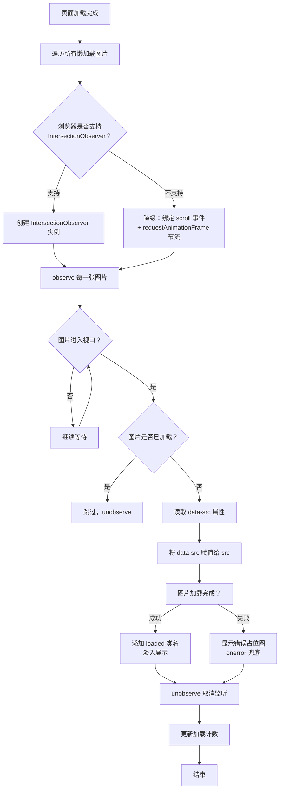
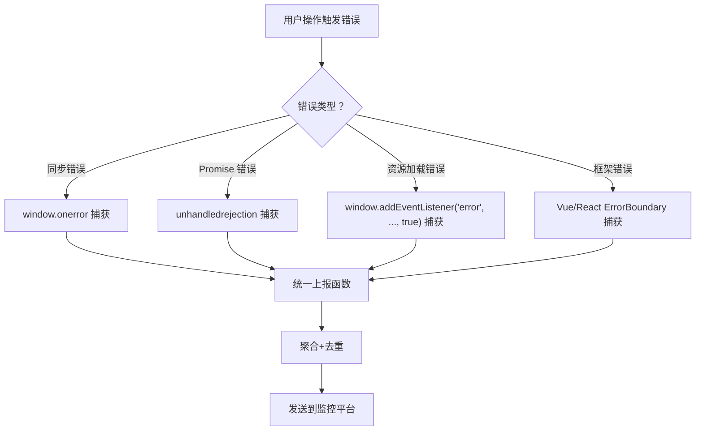

# 浏览器原理 - 综合场景串联

---

## 场景一：实现一个图片懒加载

### 场景描述
实现一个图片懒加载方案，当图片进入可视区域时才加载真实图片。要求支持占位图、加载前占位、加载失败处理，同时兼容不支持Intersection Observer的旧浏览器。

**图片懒加载执行流程图：**



> 图片懒加载的核心思想是"按需加载"——只有用户即将看到的内容才去请求，既节省带宽又提升首屏渲染速度。IntersectionObserver 是浏览器原生 API，性能远优于传统的 scroll 事件方案。

### 涉及知识点
- [浏览器渲染与V8原理](./01-浏览器渲染与V8原理.md)：DOM操作、重排重绘优化
- [事件循环与Web安全](./02-事件循环与Web安全.md)：事件循环、宏任务、requestAnimationFrame

### 协作流程
1. 使用 Intersection Observer API 监听图片元素的可见性
2. 在 img 标签中使用 data-src 存储真实图片地址，src 使用占位图或空字符串
3. 当图片进入视口（intersectionRatio > 0），将 data-src 赋值给 src
4. 图片加载完成后添加 loaded 类名，移除占位图样式
5. 图片加载失败时显示错误占位图，使用 onerror 事件处理
6. 已经加载的图片调用 unobserve 取消监听，避免重复处理
7. 兼容方案：不支持 Intersection Observer 时，监听 scroll 事件配合节流
8. 使用 getBoundingClientRect 判断元素是否在视口内作为降级方案
9. 使用 requestAnimationFrame 优化滚动监听性能，避免频繁触发

### 关键要点
- Intersection Observer 性能优于 scroll 事件，因为浏览器原生实现了高效交叉检测
- 使用 threshold 配置项控制触发时机，如 0 表示刚进入视口就触发
- 使用 rootMargin 提前加载，如 100px 表示提前100px开始加载
- 占位图使用内联SVG或CSS渐变，避免额外HTTP请求
- 图片加载完成后使用 CSS transition 实现淡入效果，注意使用 opacity 而非 display
- 使用 loading="lazy" 属性作为原生懒加载的补充，但需注意浏览器兼容性

---

## 场景二：实现前端异常监控上报系统

### 场景描述
实现一个前端异常监控系统，捕获运行时错误、资源加载错误、Promise异常和接口错误，统一上报到后端。要求支持错误去重、采样率控制、错误上下文信息收集。

**错误捕获层次架构图：**



> 前端异常监控遵循"分层捕获、统一上报"的原则，不同错误类型需要不同的捕获方式，最终汇集到同一个上报管道，经过去重和采样后再发送到后端。

### 涉及知识点
- [浏览器渲染与V8原理](./01-浏览器渲染与V8原理.md)：V8错误处理机制
- [事件循环与Web安全](./02-事件循环与Web安全.md)：事件循环、错误捕获、安全问题

### 协作流程
1. 使用 window.onerror 捕获全局运行时错误，获取错误信息、文件名、行号、列号、错误堆栈
2. 使用 window.addEventListener('error', handler, true) 捕获资源加载错误（img、script等）
3. 使用 window.addEventListener('unhandledrejection') 捕获未处理的Promise rejection
4. 使用 XMLHttpRequest 和 fetch 的拦截器包装，捕获接口错误
5. 错误信息收集：用户代理、页面URL、时间戳、错误堆栈、面包屑日志
6. 错误去重：使用错误类型+文件名+行号生成唯一标识，相同错误在一定时间内只上报一次
7. 采样率控制：根据错误类型设置不同采样率，运行时错误100%，资源错误采样10%
8. 使用 navigator.sendBeacon API 上报错误，确保页面关闭时也能发送数据
9. 在 window.onbeforeunload 事件中刷新待上报队列

### 关键要点
- 错误捕获层次：全局错误 -> 框架错误 -> 业务错误，逐层降级处理
- SourceMap：生产环境代码压缩后需要配合SourceMap还原错误位置
- 跨域脚本错误：跨域脚本需要设置 crossorigin 属性和 CORS 头才能获取详细错误信息
- 错误上报限流：避免短时间内大量错误导致服务器压力过大
- 敏感信息脱敏：上报前对密码、token等敏感信息进行脱敏处理
- 使用 requestIdleCallback 在空闲时批量上报，避免阻塞主线程

### 异常监控初始化代码

```javascript
/**
 * 前端异常监控上报系统
 * 功能：捕获全局错误、Promise异常、资源加载错误、接口错误，统一上报
 */
class ErrorMonitor {
  constructor(options = {}) {
    // 上报地址
    this.reportUrl = options.reportUrl || '/api/error/report';
    // 采样率配置：不同错误类型使用不同采样率
    this.sampleRate = {
      runtime: options.runtimeSampleRate ?? 1,    // 运行时错误 100% 上报
      resource: options.resourceSampleRate ?? 0.1, // 资源加载错误 10% 上报
      api: options.apiSampleRate ?? 1,            // 接口错误 100% 上报
    };
    // 错误去重 hash 缓存（防止同一错误短时间重复上报）
    this.errorHashCache = new Map();
    // 去重时间窗口：同一错误在 5 秒内只上报一次
    this.dedupWindow = options.dedupWindow || 5000;
    // 待上报队列：用于页面关闭前批量发送
    this.pendingQueue = [];
    // 最大队列长度
    this.maxQueueSize = 50;

    this.init();
  }

  /**
   * 初始化所有错误捕获钩子
   */
  init() {
    this.captureRuntimeError();   // 1. 运行时错误
    this.capturePromiseError();   // 2. Promise 未处理异常
    this.captureResourceError();  // 3. 资源加载错误
    this.captureHttpError();      // 4. fetch/XHR 接口错误
  }

  /**
   * 1. 捕获全局运行时错误（同步错误）
   * window.onerror 可以捕获大部分同步运行时错误，获取错误消息、文件、行列号、堆栈
   */
  captureRuntimeError() {
    window.onerror = (message, source, lineno, colno, error) => {
      this.report({
        type: 'runtime',
        message: String(message),
        source: source,
        lineno: lineno,
        colno: colno,
        stack: error ? error.stack : '',
        timestamp: Date.now(),
      });
      // 返回 true 阻止浏览器默认错误提示
      return true;
    };
  }

  /**
   * 2. 捕获未处理的 Promise rejection
   * 当 Promise 被 reject 但没有 .catch() 处理时触发
   */
  capturePromiseError() {
    window.addEventListener('unhandledrejection', (event) => {
      const reason = event.reason;
      this.report({
        type: 'promise',
        message: reason instanceof Error ? reason.message : String(reason),
        stack: reason instanceof Error ? reason.stack : '',
        timestamp: Date.now(),
      });
      // 阻止控制台输出默认错误警告
      event.preventDefault();
    });
  }

  /**
   * 3. 捕获资源加载错误（img、script、link 等）
   * 注意：资源加载错误不会冒泡，需要在捕获阶段监听
   */
  captureResourceError() {
    window.addEventListener('error', (event) => {
      // 筛选资源加载错误（排除运行时错误，运行时错误由 window.onerror 处理）
      const target = event.target;
      if (target && (target.tagName === 'IMG' || target.tagName === 'SCRIPT' || target.tagName === 'LINK')) {
        this.report({
          type: 'resource',
          message: `资源加载失败: ${target.tagName} ${target.src || target.href}`,
          resourceUrl: target.src || target.href,
          resourceType: target.tagName.toLowerCase(),
          timestamp: Date.now(),
        }, 'resource');
      }
    }, true); // 第三个参数 true 表示在捕获阶段触发
  }

  /**
   * 4. 拦截 fetch 和 XHR 请求错误
   * 通过重写原生 API 实现无侵入的接口错误监控
   */
  captureHttpError() {
    // --- 拦截 fetch ---
    const originalFetch = window.fetch;
    window.fetch = (...args) => {
      return originalFetch(...args)
        .then((response) => {
          // 响应状态码异常（4xx、5xx）视为接口错误
          if (!response.ok) {
            this.report({
              type: 'api',
              message: `fetch ${args[0]} 返回状态码 ${response.status}`,
              url: typeof args[0] === 'string' ? args[0] : args[0]?.url,
              status: response.status,
              method: args[1]?.method || 'GET',
              timestamp: Date.now(),
            }, 'api');
          }
          return response;
        })
        .catch((error) => {
          // 网络错误（超时、断网等）
          this.report({
            type: 'api',
            message: `fetch 网络错误: ${error.message}`,
            url: typeof args[0] === 'string' ? args[0] : args[0]?.url,
            method: args[1]?.method || 'GET',
            timestamp: Date.now(),
          }, 'api');
          throw error; // 继续抛出，不吞掉业务逻辑
        });
    };

    // --- 拦截 XMLHttpRequest ---
    const originalSend = XMLHttpRequest.prototype.send;
    const originalOpen = XMLHttpRequest.prototype.open;
    XMLHttpRequest.prototype.open = function (method, url) {
      this._errorUrl = url;
      this._errorMethod = method;
      return originalOpen.apply(this, arguments);
    };
    XMLHttpRequest.prototype.send = function () {
      this.addEventListener('error', () => {
        ErrorMonitor.prototype.report.call(this, {
          type: 'api',
          message: `XHR 网络错误: ${this._errorUrl}`,
          url: this._errorUrl,
          method: this._errorMethod,
          status: this.status,
          timestamp: Date.now(),
        }, 'api');
      });
      this.addEventListener('loadend', function () {
        if (this.status >= 400) {
          ErrorMonitor.prototype.report.call(this, {
            type: 'api',
            message: `XHR ${this._errorUrl} 返回状态码 ${this.status}`,
            url: this._errorUrl,
            method: this._errorMethod,
            status: this.status,
            timestamp: Date.now(),
          }, 'api');
        }
      });
      return originalSend.apply(this, arguments);
    };
  }

  /**
   * 错误去重：基于错误类型 + 消息 + 堆栈生成唯一 hash
   * 同一错误在去重时间窗口内只上报一次，避免刷屏
   */
  generateHash(error) {
    const raw = `${error.type}_${error.message}_${error.source || ''}`;
    // 简单的字符串 hash 算法
    let hash = 0;
    for (let i = 0; i < raw.length; i++) {
      const char = raw.charCodeAt(i);
      hash = ((hash << 5) - hash) + char;
      hash = hash & hash; // 转换为 32 位整数
    }
    return String(hash);
  }

  /**
   * 采样判断：根据错误类型返回是否应该上报
   */
  shouldSample(errorType) {
    const rate = this.sampleRate[errorType] ?? 1;
    return Math.random() < rate;
  }

  /**
   * 统一上报函数
   * @param {Object} error - 错误信息对象
   * @param {string} errorType - 错误类型（runtime / resource / api / promise）
   */
  report(error, errorType = 'runtime') {
    // 1. 采样过滤
    if (!this.shouldSample(errorType)) return;

    // 2. 去重检查
    const hash = this.generateHash(error);
    const lastReportTime = this.errorHashCache.get(hash);
    if (lastReportTime && Date.now() - lastReportTime < this.dedupWindow) {
      return; // 在去重时间窗口内，跳过
    }
    this.errorHashCache.set(hash, Date.now());

    // 3. 补充通用上下文信息
    const enrichedError = {
      ...error,
      userAgent: navigator.userAgent,
      pageUrl: window.location.href,
      timestamp: error.timestamp || Date.now(),
      errorType: errorType,
    };

    // 4. 加入上报队列
    this.pendingQueue.push(enrichedError);
    if (this.pendingQueue.length >= this.maxQueueSize) {
      this.flush(); // 队列满了立即发送
    } else {
      this.scheduleFlush(); // 否则延迟批量发送
    }
  }

  /**
   * 延迟批量发送（利用浏览器空闲时间）
   */
  scheduleFlush() {
    if (this._flushTimer) return;
    this._flushTimer = setTimeout(() => {
      this.flush();
    }, 2000);
  }

  /**
   * 发送待上报队列中的错误数据
   * 使用 sendBeacon 确保在页面关闭时也能发送
   */
  flush() {
    if (this.pendingQueue.length === 0) return;
    clearTimeout(this._flushTimer);
    this._flushTimer = null;

    const data = JSON.stringify(this.pendingQueue.slice());
    this.pendingQueue = [];

    // 优先使用 sendBeacon（页面关闭时仍然可用）
    if (navigator.sendBeacon) {
      navigator.sendBeacon(this.reportUrl, new Blob([data], { type: 'application/json' }));
    } else {
      // 降级方案：使用 fetch + keepalive
      fetch(this.reportUrl, {
        method: 'POST',
        headers: { 'Content-Type': 'application/json' },
        body: data,
        keepalive: true,
      }).catch(() => {});
    }
  }
}

// ==================== 使用示例 ====================
// 初始化监控实例
const monitor = new ErrorMonitor({
  reportUrl: '/api/error/report',
  runtimeSampleRate: 1,    // 运行时错误 100% 上报
  resourceSampleRate: 0.1, // 资源错误 10% 采样
  apiSampleRate: 1,        // 接口错误 100% 上报
  dedupWindow: 5000,       // 5 秒内同一错误不重复上报
});

// 页面关闭前确保队列中数据全部发送
window.addEventListener('beforeunload', () => {
  monitor.flush();
});
```

> **生活类比**：就像大楼里的消防系统——每个楼层都装有烟雾探测器（各类错误捕获钩子），一旦检测到烟雾（错误），探测器立即向中控室发送信号（统一上报），中控室会判断是不是同一个位置重复报警（去重），然后决定是否通知消防队（发送到监控平台）。

---

## 完整可运行示例：图片懒加载（IntersectionObserver）

```html
<!DOCTYPE html>
<html lang="zh-CN">
<head>
  <meta charset="UTF-8">
  <meta name="viewport" content="width=device-width, initial-scale=1.0">
  <title>图片懒加载 - IntersectionObserver</title>
  <style>
    * { margin: 0; padding: 0; box-sizing: border-box; }
    body {
      font-family: -apple-system, BlinkMacSystemFont, 'Segoe UI', sans-serif;
      background: #f5f5f5;
      color: #333;
    }

    .header {
      text-align: center;
      padding: 40px 20px;
      background: linear-gradient(135deg, #667eea 0%, #764ba2 100%);
      color: #fff;
    }
    .header h1 { font-size: 28px; margin-bottom: 8px; }
    .header p { font-size: 14px; opacity: 0.85; }

    .gallery {
      display: grid;
      grid-template-columns: repeat(auto-fill, minmax(300px, 1fr));
      gap: 20px;
      padding: 24px;
      max-width: 1200px;
      margin: 0 auto;
    }

    /* 图片卡片 */
    .image-card {
      background: #fff;
      border-radius: 10px;
      overflow: hidden;
      box-shadow: 0 2px 8px rgba(0,0,0,0.08);
      transition: transform 0.3s, box-shadow 0.3s;
    }
    .image-card:hover {
      transform: translateY(-4px);
      box-shadow: 0 8px 24px rgba(0,0,0,0.12);
    }

    /* 图片容器（占位区域） */
    .image-wrapper {
      position: relative;
      width: 100%;
      padding-top: 66.67%; /* 3:2 宽高比，撑开占位空间 */
      background: #e8e8e8;
      overflow: hidden;
    }

    /* 图片本身 */
    .image-wrapper img {
      position: absolute;
      top: 0;
      left: 0;
      width: 100%;
      height: 100%;
      object-fit: cover;
      opacity: 0;
      transition: opacity 0.5s ease;
    }

    /* 加载完成 */
    .image-wrapper img.loaded {
      opacity: 1;
    }

    /* 加载失败 */
    .image-wrapper img.error {
      opacity: 1;
      object-fit: contain;
      background: #f0f0f0;
    }

    /* 占位骨架屏动画 */
    .image-wrapper .placeholder {
      position: absolute;
      top: 0;
      left: 0;
      width: 100%;
      height: 100%;
      background: linear-gradient(90deg, #e8e8e8 25%, #f0f0f0 50%, #e8e8e8 75%);
      background-size: 200% 100%;
      animation: shimmer 1.5s infinite;
    }

    @keyframes shimmer {
      0% { background-position: 200% 0; }
      100% { background-position: -200% 0; }
    }

    .image-wrapper.loaded .placeholder {
      display: none;
    }

    /* 卡片信息 */
    .image-caption {
      padding: 12px 16px;
      font-size: 14px;
      color: #666;
    }

    /* 统计信息 */
    .stats {
      position: fixed;
      bottom: 20px;
      right: 20px;
      background: rgba(0,0,0,0.8);
      color: #fff;
      padding: 10px 16px;
      border-radius: 8px;
      font-size: 13px;
      z-index: 100;
    }
  </style>
</head>
<body>

  <div class="header">
    <h1>图片懒加载演示</h1>
    <p>基于 IntersectionObserver API，滚动页面查看图片加载效果</p>
  </div>

  <div class="gallery" id="gallery"></div>

  <div class="stats" id="stats">已加载: 0 / 0</div>

  <script>
    /**
     * 图片懒加载管理器
     */
    class LazyImageLoader {
      /**
       * @param {Object} options - 配置项
       * @param {string} options.selector - 懒加载图片的选择器
       * @param {string} options.rootMargin - 预加载距离
       * @param {number} options.threshold - 可见比例阈值
       * @param {string} options.placeholder - 占位图 URL
       * @param {string} options.errorPlaceholder - 错误占位图 URL
       */
      constructor(options = {}) {
        this.selector = options.selector || '.lazy-image';
        this.rootMargin = options.rootMargin || '100px';
        this.threshold = options.threshold ?? 0;
        this.placeholder = options.placeholder || '';
        this.errorPlaceholder = options.errorPlaceholder || '';

        this.observer = null;
        this.loadedCount = 0;
        this.totalCount = 0;
        this.onProgress = options.onProgress || null;
        this.useFallback = false;

        this.init();
      }

      /**
       * 初始化观察器
       */
      init() {
        // 检查 IntersectionObserver 支持
        if (!('IntersectionObserver' in window)) {
          console.warn('IntersectionObserver 不支持，降级为 scroll 监听');
          this.useFallback = true;
          this.initFallback();
          return;
        }

        this.observer = new IntersectionObserver(
          (entries) => this.handleIntersect(entries),
          {
            root: null,
            rootMargin: this.rootMargin,
            threshold: this.threshold,
          }
        );

        this.observeAll();
      }

      /**
       * 观察所有懒加载图片
       */
      observeAll() {
        const images = document.querySelectorAll(this.selector);
        this.totalCount = images.length;
        images.forEach((img) => this.observer.observe(img));
      }

      /**
       * 处理交叉事件
       */
      handleIntersect(entries) {
        entries.forEach((entry) => {
          if (entry.isIntersecting) {
            this.loadImage(entry.target);
            this.observer.unobserve(entry.target);
          }
        });
      }

      /**
       * 加载单张图片
       */
      loadImage(img) {
        const dataSrc = img.getAttribute('data-src');
        if (!dataSrc) return;

        const wrapper = img.closest('.image-wrapper');

        img.onload = () => {
          img.classList.add('loaded');
          if (wrapper) wrapper.classList.add('loaded');
          this.loadedCount++;
          this.reportProgress();
        };

        img.onerror = () => {
          img.classList.add('error');
          if (wrapper) wrapper.classList.add('loaded');
          if (this.errorPlaceholder) {
            img.src = this.errorPlaceholder;
          }
          this.loadedCount++;
          this.reportProgress();
        };

        // 设置占位图
        if (this.placeholder) {
          img.src = this.placeholder;
        }

        // 开始加载真实图片
        img.src = dataSrc;
      }

      /**
       * 回报加载进度
       */
      reportProgress() {
        if (this.onProgress) {
          this.onProgress(this.loadedCount, this.totalCount);
        }
      }

      /**
       * 降级方案：基于 scroll 事件 + 节流
       */
      initFallback() {
        const checkImages = () => {
          const images = document.querySelectorAll(`${this.selector}:not(.loaded)`);
          this.totalCount = document.querySelectorAll(this.selector).length;

          images.forEach((img) => {
            if (this.isInViewport(img)) {
              this.loadImage(img);
              img.classList.add('loaded');
            }
          });
        };

        // 节流版本的 scroll 监听
        let ticking = false;
        window.addEventListener('scroll', () => {
          if (!ticking) {
            requestAnimationFrame(() => {
              checkImages();
              ticking = false;
            });
            ticking = true;
          }
        });

        // 初始检查
        checkImages();
      }

      /**
       * 判断元素是否在视口内（降级方案）
       */
      isInViewport(el) {
        const rect = el.getBoundingClientRect();
        const margin = parseInt(this.rootMargin) || 0;
        return (
          rect.top <= window.innerHeight + margin &&
          rect.bottom >= -margin &&
          rect.left <= window.innerWidth + margin &&
          rect.right >= -margin
        );
      }

      /**
       * 销毁观察器
       */
      destroy() {
        if (this.observer) {
          this.observer.disconnect();
          this.observer = null;
        }
      }
    }

    // ==================== 使用示例 ====================

    // 生成模拟图片数据
    const imageData = Array.from({ length: 20 }, (_, i) => ({
      id: i + 1,
      title: `图片 ${i + 1}`,
      // 使用占位图片服务生成不同尺寸图片
      src: `https://picsum.photos/seed/${i + 1}/600/400`,
    }));

    // 渲染画廊
    const gallery = document.getElementById('gallery');
    const statsEl = document.getElementById('stats');

    imageData.forEach((item) => {
      const card = document.createElement('div');
      card.className = 'image-card';
      card.innerHTML = `
        <div class="image-wrapper">
          <div class="placeholder"></div>
          
        </div>
        <div class="image-caption">${item.title}</div>
      `;
      gallery.appendChild(card);
    });

    // 初始化懒加载
    const loader = new LazyImageLoader({
      selector: '.lazy-image',
      rootMargin: '200px',
      threshold: 0,
      onProgress: (loaded, total) => {
        statsEl.textContent = `已加载: ${loaded} / ${total}`;
      },
    });
  </script>
</body>
</html>
```

> **生活类比**：就像超市自动门——你走到门口（图片进入视口），门才自动打开（加载真实图片），你还没走到的时候门关着（用占位图），省电又省力（节省带宽和内存）。

---

## 常见错误

### 1. 懒加载时忘记设置图片占位尺寸导致页面抖动

**问题表现**：图片加载前后，页面布局发生跳动，用户体验很差。

**原因**：图片在加载前没有占据空间（宽高为 0），真实图片加载完成后突然撑开布局，导致后续元素位置移动。

**解决方案**：在图片容器上设置固定的宽高比例，确保占位区域与真实图片尺寸一致。

```css
/* 错误做法：图片加载前无占位尺寸 */
img { display: block; }

/* 正确做法：使用 padding-top 百分比撑开容器 */
.image-wrapper {
  position: relative;
  width: 100%;
  padding-top: 56.25%; /* 16:9 宽高比 */
  overflow: hidden;
}
.image-wrapper img {
  position: absolute;
  top: 0;
  left: 0;
  width: 100%;
  height: 100%;
  object-fit: cover;
}
```

或者在 `` 标签上直接设置 `width` 和 `height` 属性，现代浏览器会根据这两个属性自动计算宽高比并预留空间：

```html

```

### 2. IntersectionObserver 在组件卸载时未 disconnect

**问题表现**：在 SPA 单页应用中，从列表页切换到详情页后，控制台报错 `Cannot read properties of null`，或者内存占用持续上升。

**原因**：组件卸载（销毁）时，IntersectionObserver 实例仍然持有对已移除 DOM 元素的引用，导致观察器继续尝试回调但目标元素已不存在，同时造成内存泄漏。

**解决方案**：在组件或页面的销毁生命周期中调用 `disconnect()` 方法。

```javascript
// Vue 3 示例
import { onMounted, onUnmounted, ref } from 'vue';

export default {
  setup() {
    let observer = null;

    onMounted(() => {
      observer = new IntersectionObserver((entries) => {
        entries.forEach((entry) => {
          if (entry.isIntersecting) {
            const img = entry.target;
            img.src = img.dataset.src;
            observer.unobserve(img);
          }
        });
      });
      // 开始观察
      document.querySelectorAll('.lazy-image').forEach((img) => {
        observer.observe(img);
      });
    });

    // 关键：组件卸载时断开观察器
    onUnmounted(() => {
      if (observer) {
        observer.disconnect();
        observer = null;
      }
    });
  },
};
```

```javascript
// React 示例
useEffect(() => {
  const observer = new IntersectionObserver(/* ... */);
  document.querySelectorAll('.lazy-image').forEach((img) => observer.observe(img));

  // cleanup 函数在组件卸载时执行
  return () => {
    observer.disconnect();
  };
}, []);
```

### 3. 异常监控在生产环境上报了过多错误（未做去重和采样）

**问题表现**：生产环境监控平台收到海量重复错误上报，服务器压力剧增，甚至导致监控系统自身崩溃。

**原因**：
- 同一错误在短时间内被反复触发（如轮询接口报错），没有去重机制导致每条都上报。
- 未设置采样率，所有错误 100% 上报，资源类错误（如图片 404）量大但不一定需要全量采集。

**解决方案**：
- **错误去重**：基于错误类型 + 错误消息 + 文件名 + 行号生成唯一 hash，同一 hash 在时间窗口内（如 5 秒）只上报一次。
- **采样率控制**：不同错误类型使用不同采样比例。运行时错误（影响业务逻辑）100% 上报，资源加载错误（影响较小）可降到 10% 采样。

```javascript
// 去重 + 采样示意
class ErrorReporter {
  constructor() {
    this.hashCache = new Map();          // 去重缓存
    this.dedupWindow = 5000;             // 5秒去重窗口
    this.sampleRate = {
      runtime: 1,    // 运行时错误 100%
      resource: 0.1, // 资源错误 10%
      api: 0.5,      // 接口错误 50%
    };
  }

  shouldReport(error) {
    // 采样判断
    const rate = this.sampleRate[error.type] ?? 1;
    if (Math.random() > rate) return false;

    // 去重判断
    const hash = this.hash(error);
    const lastTime = this.hashCache.get(hash);
    if (lastTime && Date.now() - lastTime < this.dedupWindow) {
      return false; // 窗口期内重复，跳过
    }
    this.hashCache.set(hash, Date.now());
    return true;
  }

  hash(error) {
    const raw = `${error.type}_${error.message}_${error.filename}_${error.lineno}`;
    return raw.split('').reduce((h, c) => ((h << 5) - h) + c.charCodeAt(0) | 0, 0).toString();
  }
}
```

---

> [返回模块目录](../README.md) | [返回知识导览](../知识导览.md)