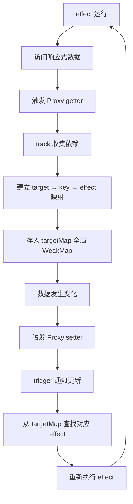
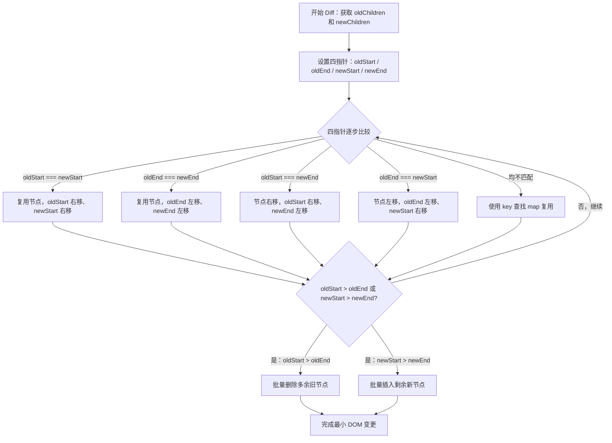

# Vue 3 响应式与编译优化

> 模块：05-vue（第5周 Vue 3 生态）
> 定位：核心原理深入篇

---

## 核心概念

响应式系统是 Vue 的核心，它让数据变化时自动更新视图，开发者无需手动操作 DOM。Vue 3 使用 Proxy 重写了响应式系统，解决了 Vue 2 中 Object.defineProperty 的诸多限制，同时编译器层面的优化大幅提升了运行时性能。

### 什么是响应式？

响应式是指当数据发生变化时，依赖该数据的视图会自动更新。Vue 通过**数据劫持 + 依赖收集 + 派发更新**三个步骤实现：

1. **数据劫持**：拦截数据的读取和修改操作
2. **依赖收集**：记录哪些组件/函数依赖了哪些数据
3. **派发更新**：数据变化时，通知所有依赖该数据的组件重新渲染

---

## 底层原理

### Vue 2 响应式原理

Vue 2 使用 `Object.defineProperty` 劫持对象的 getter 和 setter：

```javascript
// Vue 2 响应式核心实现（简化版）
function defineReactive(obj, key, val) {
  // 递归遍历嵌套属性
  observe(val)

  const dep = new Dep() // 收集依赖

  Object.defineProperty(obj, key, {
    get() {
      // 依赖收集：当前正在渲染的组件（Watcher）记录依赖
      if (Dep.target) {
        dep.depend()
      }
      return val
    },
    set(newVal) {
      if (newVal === val) return
      val = newVal
      // 新值也需要进行响应式处理
      observe(newVal)
      // 派发更新：通知所有依赖的组件重新渲染
      dep.notify()
    }
  })
}

function observe(obj) {
  if (typeof obj !== 'object' || obj === null) return
  Object.keys(obj).forEach(key => defineReactive(obj, key, obj[key]))
}
```

**Vue 2 响应式的局限**：
1. **无法检测新增属性**：`Object.defineProperty` 只能劫持初始化时已存在的属性，新增属性 `obj.newProp = 'value'` 不会触发更新。需要用 `Vue.set(obj, 'newProp', value)`
2. **无法检测删除属性**：`delete obj.prop` 不会被拦截。需要用 `Vue.delete(obj, 'prop')`
3. **数组问题**：无法检测通过索引修改数组元素（`arr[0] = 'x'`）和修改数组长度（`arr.length = 0`）
4. **递归遍历**：初始化时递归遍历所有属性，性能开销大，深层嵌套对象时尤其明显
5. **多次重写**：数组变异方法（push、pop、shift、unshift、splice、sort、reverse）需要重写

**Vue 2 对数组的处理**：
```javascript
// Vue 2 重写数组变异方法
const arrayProto = Array.prototype
const arrayMethods = Object.create(arrayProto)

const methodsToPatch = [
  'push', 'pop', 'shift', 'unshift', 'splice', 'sort', 'reverse'
]

methodsToPatch.forEach(method => {
  const original = arrayProto[method]
  arrayMethods[method] = function(...args) {
    const result = original.apply(this, args)
    // 通知更新
    this.__ob__.dep.notify()
    return result
  }
})
```

### Vue 3 响应式原理

Vue 3 使用 `Proxy` 代理整个对象，配合 `Reflect` API：

```javascript
// Vue 3 响应式核心实现（简化版）
function reactive(target) {
  if (typeof target !== 'object' || target === null) return target

  return new Proxy(target, {
    get(target, key, receiver) {
      // 依赖收集
      track(target, key)
      const result = Reflect.get(target, key, receiver)

      // 惰性响应式：只有访问嵌套对象时才进行代理
      if (typeof result === 'object' && result !== null) {
        return reactive(result)
      }
      return result
    },
    set(target, key, value, receiver) {
      const oldValue = target[key]
      const result = Reflect.set(target, key, value, receiver)

      if (oldValue !== value) {
        // 触发更新
        trigger(target, key)
      }
      return result
    },
    deleteProperty(target, key) {
      const hadKey = Object.prototype.hasOwnProperty.call(target, key)
      const result = Reflect.deleteProperty(target, key)

      if (hadKey && result) {
        // 删除属性时也触发更新
        trigger(target, key)
      }
      return result
    }
  })
}
```

**Vue 3 响应式核心优势**：
1. **Proxy 代理整个对象**：支持新增属性检测（`obj.newProp = value` 会被拦截），支持删除属性检测（`delete obj.prop` 会被拦截）
2. **数组完整支持**：支持数组索引修改（`arr[0] = 'x'`）和 `length` 修改检测
3. **惰性响应式**：初始化时只代理第一层，访问嵌套对象时才进行代理，性能更好
4. **Reflect API**：配合 Proxy 使用，保证 `this` 指向正确，返回值符合预期
5. **无需重写数组方法**：Proxy 直接拦截数组操作，不需要重写变异方法

> Proxy 就像一个**智能门禁系统**：大楼里每个房间（对象属性）都装了传感器。有人进房间（读取属性），门禁自动记录"谁来过"（依赖收集 track）；有人从房间搬东西出来（修改属性），门禁立刻通知保安"快去看看要不要更新监控画面"（触发更新 trigger）。Vue 2 的 `Object.defineProperty` 则是给每个房间装一把锁，只能锁最初就有的门，后来新开的门（新增属性）就没法锁了。Proxy 是整栋楼的门禁系统，无论你开哪个门，系统都能感知到。

**依赖收集（track）和触发更新（trigger）实现思路**：

```javascript
// 简化的依赖收集和触发更新机制
const targetMap = new WeakMap() // 存储所有响应式对象的依赖

// 当前正在收集依赖的 effect
let activeEffect = null

function track(target, key) {
  if (!activeEffect) return

  // 获取目标对象的依赖映射
  let depsMap = targetMap.get(target)
  if (!depsMap) {
    targetMap.set(target, (depsMap = new Map()))
  }

  // 获取目标 key 的依赖集合
  let dep = depsMap.get(key)
  if (!dep) {
    depsMap.set(key, (dep = new Set()))
  }

  dep.add(activeEffect)
}

function trigger(target, key) {
  const depsMap = targetMap.get(target)
  if (!depsMap) return

  const dep = depsMap.get(key)
  if (dep) {
    // 执行所有依赖该 key 的副作用
    dep.forEach(effect => effect())
  }
}
```

**响应式依赖收集全流程**：



Vue 3 的响应式依赖收集采用 **Proxy 代理 + 全局 WeakMap（targetMap）** 的数据结构，以 `target → key → effect` 三级映射精确记录依赖关系。当数据变化时，只需从 targetMap 中查找对应的 effect 集合并重新执行，避免了 Vue 2 中递归遍历属性的性能开销。整个过程由 `track` 和 `trigger` 两个核心函数驱动，配合 `activeEffect` 全局变量追踪当前正在执行的副作用。

**ref 的响应式本质**：
```javascript
// ref 简化实现
function ref(value) {
  return {
    get value() {
      track(this, 'value')
      return value
    },
    set value(newValue) {
      // 简化版使用 !== 比较；实际 Vue 3 源码使用 Object.is 以正确处理 NaN 等边界情况
      if (newValue !== value) {
        value = newValue
        trigger(this, 'value')
      }
    }
  }
}
```

> 📖 **参考链接**：
> - [Vue 3官方文档 - 响应式系统深入](https://cn.vuejs.org/guide/extras/reactivity-in-depth)
> - [MDN - Proxy](https://developer.mozilla.org/zh-CN/docs/Web/JavaScript/Reference/Global_Objects/Proxy)

### 虚拟 DOM（Virtual DOM）原理

**是什么**：
虚拟 DOM 是用 JavaScript 对象描述真实 DOM 结构的轻量级表示。每个虚拟节点（VNode）包含标签名、属性、子节点等信息。

```javascript
// 真实 DOM
// <div id="app" class="container"><span>Hello</span></div>

// 对应的虚拟 DOM
const vnode = {
  tag: 'div',
  props: { id: 'app', class: 'container' },
  children: [
    {
      tag: 'span',
      props: {},
      children: ['Hello']
    }
  ]
}
```

**为什么需要虚拟 DOM**：
1. **减少真实 DOM 操作**：真实 DOM 操作代价高，虚拟 DOM 通过 diff 算法找出最小变更，再批量更新真实 DOM
2. **跨平台**：虚拟 DOM 是平台无关的抽象层，可以渲染到不同平台（Web、Native、小程序等）
3. **声明式编程**：开发者只需描述 UI 应该是什么样子，框架负责高效更新 DOM

**patch 算法**：
新旧 VNode 对比的核心流程：

1. **同层比较**：只比较同一层级的节点，不跨层级比较
2. **标签名不同**：直接替换整个节点及其子树
3. **标签名相同**：复用节点，更新属性和子节点
4. **文本节点**：直接更新文本内容
5. **子节点对比**：使用 diff 算法对比新旧子节点列表

### Vue 3 Diff 算法优化

Vue 3 在编译器层面做了大量优化，使 diff 算法更加高效：

**diff 算法双端比较过程（简化图示）：**

```
          旧数组       [a, b, c, d]
                           
          新数组       [a, x, b, c, d]
                           
双指针位置：  l               r      
                →               ←      
Old: [      a,      b,      c,      d      ]
New: [   a,   x,   b,   c,   d   ]
                ←               →      
最终完成插入后：[a, x, b, c, d]
```

> 把 Diff 算法双端比较想象成**整理扑克牌**：你手里有一叠旧牌（旧子节点列表）和一叠新牌（新子节点列表），你和对手都从两头开始比：比头对头，一样就收了；比尾对尾，一样就收了；不一样就插入新牌，去掉旧牌。这样比完一头少一头，最终只需要处理中间变化的部分，比从一头挨个比整个列表快很多。

**1. 静态标记（PatchFlag）**

编译阶段为动态节点标记类型，运行时 diff 只检查标记的属性：

```javascript
// 编译后的 render 函数（简化）
render() {
  return createVNode('div', { class: 'static' }, [
    createVNode('span', { class: 'dynamic' }, this.message, PatchFlags.TEXT)
    // PatchFlags.TEXT = 1，表示只有文本会变化
  ])
}

// 运行时 diff 只需要检查 PatchFlag 标记的属性，不需要遍历所有属性
if (vnode.patchFlag & PatchFlags.TEXT) {
  // 只更新文本内容
}
```

PatchFlag 类型：
| 标记 | 含义 |
|------|------|
| `TEXT = 1` | 动态文本内容 |
| `CLASS = 2` | 动态 class |
| `STYLE = 4` | 动态 style |
| `PROPS = 8` | 动态属性（不含 class 和 style） |
| `FULL_PROPS = 16` | 有动态 key 的属性 |
| `HYDRATE_EVENTS = 32` | 带事件监听 |
| `STABLE_FRAGMENT = 64` | 稳定顺序的 Fragment |
| `KEYED_FRAGMENT = 128` | 带 key 的 Fragment |
| `UNKEYED_FRAGMENT = 256` | 不带 key 的 Fragment |
| `NEED_PATCH = 512` | 需要 DOM patch |
| `DYNAMIC_SLOTS = 1024` | 动态插槽 |

**2. 静态提升（HoistStatic）**

把静态节点提升到 render 函数外部，避免每次渲染都重新创建：

```javascript
// 未优化：每次 render 都创建新的静态节点
render() {
  return createVNode('div', null, [
    createVNode('span', { class: 'static' }, '不会变的内容'),
    createVNode('span', null, this.message)
  ])
}

// 优化后：静态节点提升到 render 外部
const _hoisted_1 = createVNode('span', { class: 'static' }, '不会变的内容')

render() {
  return createVNode('div', null, [
    _hoisted_1, // 直接复用，不重新创建
    createVNode('span', null, this.message)
  ])
}
```

**3. Block Tree**

将模板分为 Block，每个 Block 只追踪动态节点，diff 时只对比动态节点：

```javascript
// 传统方式：遍历所有子节点 diff
// Block Tree 方式：只对比 dynamicChildren

// 编译后
render() {
  return (openBlock(), createBlock('div', null, [
    createVNode('span', { class: 'static' }, '静态文本'),
    createVNode('span', { class: 'dynamic' }, this.message, PatchFlags.TEXT)
  ]))
}
// createBlock 会收集 dynamicChildren 数组
// diff 时只对比 dynamicChildren 中的节点，跳过静态节点
```

**Block Tree 的意义**：
- 动态节点被收集到 `dynamicChildren` 数组中
- diff 时直接从 `dynamicChildren` 获取需要对比的节点
- 跳过所有静态节点，大幅减少 diff 的时间复杂度
- 对于大部分静态内容、少量动态内容的模板，性能提升明显

**4. 事件缓存（cacheHandlers）**

对事件处理函数进行缓存，避免每次渲染都创建新的函数：

```javascript
// 未优化：每次渲染创建新函数
render(ctx) {
  return createVNode('button', {
    onClick: () => ctx.count++
  })
}

// 优化后：事件函数被缓存
render(ctx, cache) {
  return createVNode('button', {
    onClick: cache[0] || (cache[0] = ($event) => ctx.count++)
  })
}
```

**Vue 3 Diff 双端比较流程**：



Vue 3 的 Diff 算法采用经典的**双端比较**策略，通过四个指针（oldStart、oldEnd、newStart、newEnd）从新旧子节点列表的两端同时向中间逼近，每次迭代尝试命中四种匹配模式之一。结合 PatchFlag 静态标记和 Block Tree 优化，实际运行时可以跳过大量静态节点，仅对标记为动态的节点执行 diff，极大减少了不必要的比较开销。

> 📖 **参考链接**：
> - [Vue 3官方文档 - Patch Flags](https://cn.vuejs.org/guide/extras/rendering-mechanism#patch-flags)
> - [Vue 3官方文档 - Static Hoisting](https://cn.vuejs.org/guide/extras/rendering-mechanism#cache-static)

### 编译器优化

Vue 3 的模板编译过程分为三个阶段：

```
模板字符串 → parse（解析） → AST → transform（转换） → AST → generate（生成） → render 函数
```

**1. parse（解析）**：将模板字符串解析为 AST（抽象语法树）

```javascript
// 模板：<div><p>Hello</p><p>{{ msg }}</p></div>
// 解析为 AST 树结构，包含标签、属性、文本、表达式信息
```

**2. transform（转换）**：对 AST 进行优化转换

编译时优化在此阶段完成：
- **静态节点标记**：标记哪些节点是纯静态的，不会变化
- **动态绑定标记**：标记动态绑定的属性和文本，生成 PatchFlag
- **静态提升**：将静态节点提升到渲染函数外部
- **Block Tree 构建**：识别动态节点，构建 Block Tree 结构

**3. generate（生成）**：将 AST 转换为 render 函数代码

```javascript
// 生成的 render 函数（简化）
function render(_ctx, _cache) {
  return (_openBlock(), _createBlock("div", null, [
    _createVNode("p", null, "Hello"),
    _createVNode("p", null, _toDisplayString(_ctx.msg), 1 /* TEXT */)
  ]))
}
```

> 📖 **参考链接**：
> - [Vue 3官方文档 - 渲染机制](https://cn.vuejs.org/guide/extras/rendering-mechanism)

### nextTick 原理

`nextTick` 将回调推迟到下次 DOM 更新循环之后执行，确保在回调中能获取到更新后的 DOM：

```javascript
// nextTick 实现原理（Vue 3 简化版）
const callbacks = []
let pending = false

function flushCallbacks() {
  pending = false
  const copies = callbacks.slice(0)
  callbacks.length = 0
  // 执行所有回调
  copies.forEach(cb => cb())
}

// Vue 3 仅使用 Promise.resolve() 作为微任务实现
// 现代浏览器已全面支持 Promise，无需降级策略
function nextTick(cb) {
  callbacks.push(cb)
  if (!pending) {
    pending = true
    Promise.resolve().then(flushCallbacks)
  }
}
```

**Vue 2 vs Vue 3 实现差异**：
> Vue 2 使用了完整的降级策略：`Promise.then` → `MutationObserver` → `setImmediate` → `setTimeout`，以兼容不支持 Promise 的旧浏览器。Vue 3 简化了实现，仅使用 `Promise.resolve().then()` 作为微任务，因为现代浏览器已全面支持 Promise。
1. `Promise.then`（微任务，首选）→ Vue 2 和 Vue 3 均使用
2. `MutationObserver`（微任务，次选）→ 仅 Vue 2 保留，Vue 3 已移除
3. `setImmediate`（宏任务，仅 IE/Node.js）→ 仅 Vue 2 保留
4. `setTimeout`（宏任务，最后兜底）→ 仅 Vue 2 保留

**使用场景**：
```javascript
// 数据变化后，在 nextTick 中可以获取更新后的 DOM
const count = ref(0)
count.value++
nextTick(() => {
  // 此时 DOM 已经更新
  console.log(document.querySelector('#count').textContent) // 1
})

// 或者使用 await 语法
await nextTick()
console.log('DOM 已更新')
```

### Vapor Mode（无虚拟 DOM 编译策略）

Vapor Mode 是 Vue 团队正在开发的一种全新的编译策略，旨在**跳过虚拟 DOM**，直接将模板编译为高性能的 DOM 操作代码。它借鉴了 Solid.js 和 Svelte 等框架的"无虚拟 DOM"思路，但保留了 Vue 的响应式系统和模板语法。

#### 核心概念

传统 Vue 3 的渲染流程是：

```
模板 → 编译 → 虚拟 DOM（VNode）→ Diff 对比 → 真实 DOM 操作
```

Vapor Mode 的渲染流程是：

```
模板 → 编译 → 直接生成 DOM 操作代码（跳过虚拟 DOM 和 Diff）
```

**类比理解**：传统 Vue 3 像是"写信给装修队描述怎么改"（虚拟 DOM 描述变更），Vapor Mode 像是"直接告诉工人敲哪面墙"（直接操作 DOM）。前者更灵活但需要翻译步骤，后者更直接但需要精确指令。

#### 工作原理

Vapor Mode 在编译阶段分析模板的静态结构和动态绑定，直接生成针对性的 DOM 操作代码：

```vue
<!-- 原始模板 -->
<template>
  <div class="container">
    <h1>{{ title }}</h1>
    <p>{{ message }}</p>
  </div>
</template>
```

**传统 Vue 3 编译结果（简化）**：

```javascript
// 传统编译：生成 VNode 树，运行时通过 Diff 更新
render(_ctx, _cache) {
  return (_openBlock(), _createBlock('div', { class: 'container' }, [
    _createVNode('h1', null, _toDisplayString(_ctx.title), 1 /* TEXT */),
    _createVNode('p', null, _toDisplayString(_ctx.message), 1 /* TEXT */)
  ]))
}
```

**Vapor Mode 编译结果（概念示意）**：

```javascript
// Vapor Mode 编译：直接生成 DOM 操作代码
import { effect, template, setText } from 'vue/vapor'

const tpl = template('<div class="container"><h1></h1><p></p></div>')

export default (ctx) => {
  const root = tpl()
  // 直接绑定响应式数据到 DOM 节点
  effect(() => setText(root.querySelector('h1'), ctx.title))
  effect(() => setText(root.querySelector('p'), ctx.message))
  return root
}
```

#### 与传统响应式的对比

| 维度 | 传统 Vue 3（虚拟 DOM） | Vapor Mode（无虚拟 DOM） |
|------|------------------------|--------------------------|
| 渲染机制 | 生成 VNode 树 → Diff 对比 → DOM 操作 | 编译时直接生成 DOM 操作代码 |
| 内存开销 | 维护 VNode 树在内存中 | 无 VNode 树，内存占用更低 |
| 首次渲染 | 需要生成完整 VNode 树 | 直接创建 DOM，更快 |
| 更新粒度 | 组件级重新渲染 + Diff | 精确到 DOM 节点的细粒度更新 |
| 运行时体积 | 约 50KB（含虚拟 DOM 运行时） | 约 30KB（移除虚拟 DOM 运行时） |
| 灵活性 | 高，支持 render 函数和 JSX | 低，仅支持模板语法 |
| 兼容性 | 支持所有 Vue 3 特性 | 部分特性可能不支持（如动态组件） |

#### 核心优势

1. **更小的包体积**：移除虚拟 DOM 运行时，减少约 40% 的运行时代码
2. **更快的首次渲染**：无需构建 VNode 树，直接创建 DOM 元素
3. **更精确的更新**：每个动态绑定独立追踪，精确更新对应 DOM 节点，无需组件级 Diff
4. **更低的内存占用**：不需要维护 VNode 树结构

#### 适用场景与限制

**适用场景**：
- 性能敏感的应用（如移动端 H5、数据大屏）
- 静态内容占比较高的页面（大部分内容不变，少量动态内容）
- 对包体积有严格要求的场景（如嵌入 SDK、小程序）

**限制与注意事项**：
- Vapor Mode 目前仍在开发中（Vue 3.6+ 实验性功能），API 可能变化
- 仅支持模板语法，不支持 `render` 函数和 JSX
- 部分动态特性（如 `<component :is="...">` 动态组件）可能受限
- 需要配合 Vapor Mode 专用的编译器和运行时

#### 与 PatchFlag/Block Tree 的关系

Vapor Mode 是编译优化的**终极形态**。传统 Vue 3 的 PatchFlag 和 Block Tree 优化是在"保留虚拟 DOM 的前提下尽可能减少 Diff 开销"，而 Vapor Mode 直接**砍掉了虚拟 DOM 这一层**，将编译时优化推向极致：

```
传统 Vue 2：全量虚拟 DOM + 全量 Diff
       ↓
Vue 3：虚拟 DOM + PatchFlag + Block Tree（优化 Diff）
       ↓
Vapor Mode：无虚拟 DOM，编译时直接生成 DOM 操作
```

如果将一个 Vue 3 组件看作"写了修改清单请人执行"（虚拟 DOM），Vapor Mode 就是"直接自己动手改"（编译时确定操作），省去了中间沟通（Diff）的成本。但"自己动手"需要提前知道该改什么，所以 Vapor Mode 对模板的静态分析要求更高。

#### Alien Signals 响应式系统重构（Vue 3.6）

Vue 3.6（2026 年 1 月发布）基于 **Alien Signals** 库对 `@vue/reactivity` 进行了重大重构，这是 Vue 3 发布以来响应式系统的最大一次架构升级。

**核心改进**：

| 维度 | 旧实现（Vue 3.0-3.5） | Alien Signals（Vue 3.6+） |
|------|-------|------|
| 响应式性能 | 基准 | 提升约 **60%** |
| 内存占用 | 基准 | 降低约 **40%** |
| 依赖追踪 | 手动管理依赖图 | 自动优化依赖图，减少无效追踪 |
| 批量更新 | 基于微任务队列 | 智能合并，减少不必要的重新计算 |
| API 兼容性 | — | **完全向后兼容**，无需修改现有代码 |

**技术原理**：

Alien Signals 是一个专门的响应式信号库，相比 Vue 3 原有的 `@vue/reactivity` 实现，它采用了更高效的依赖追踪算法和内存管理策略：

```javascript
// 无需修改代码，Vue 3.6 自动使用 Alien Signals 引擎
import { ref, computed, watch } from 'vue'

const count = ref(0)
const double = computed(() => count.value * 2)

// 内部使用 Alien Signals 进行依赖追踪和更新调度
// 性能提升是透明的，开发者无感知
watch(double, (val) => {
  console.log(`double 更新为: ${val}`)
})
```

**迁移注意事项**：
- API 完全向后兼容，无需修改任何现有代码
- 升级 `vue` 到 3.6+ 即可自动获得性能提升
- 如有自定义的 `@vue/reactivity` 底层依赖，需验证兼容性
- 建议在升级后进行性能基准测试，验证实际收益

---

## 实战应用

### 1. 理解 shallowRef 和 shallowReactive

当数据量很大时，使用浅层响应式可以提升性能：

```javascript
import { shallowRef, shallowReactive } from 'vue'

// 浅层 ref：只有 .value 本身的替换是响应式的
const data = shallowRef({ list: [] })
data.value = { list: [1, 2, 3] } // 响应式（替换整个对象）
data.value.list.push(4) // 不会触发更新（内部属性变化不是响应式）

// 浅层 reactive：只有第一层属性是响应式的
const state = shallowReactive({ list: [] })
state.list.push(1) // 不会触发更新（list 内部修改不被浅层代理拦截）
state.list = [1, 2, 3] // 响应式（替换了第一层属性）
```

### 2. 避免不必要的响应式

```javascript
// 不需要响应式的数据，可以直接用普通变量
<script setup>
// 不需要响应式
const config = { title: '系统设置', version: '1.0.0' }

// 需要响应式
const user = ref({ name: '张三' })
</script>
```

### 3. 合理使用 nextTick

```javascript
// 场景1：获取滚动位置
const scrollToBottom = () => {
  messages.value.push(newMessage)
  await nextTick()
  container.value.scrollTop = container.value.scrollHeight
}

// 场景2：表单验证
const submit = async () => {
  formRef.value.validate()
  await nextTick()
  // 此时错误信息已渲染到 DOM
}
```

---

## 常见面试题

### 1. Vue 2 和 Vue 3 响应式原理的区别

**回答要点**：
- Vue 2 使用 `Object.defineProperty` 劫持每个属性，Vue 3 使用 `Proxy` 代理整个对象
- Vue 2 无法检测新增/删除属性，Vue 3 可以
- Vue 2 无法检测数组索引和 length 修改，Vue 3 可以
- Vue 2 初始化时递归遍历所有属性，Vue 3 惰性代理（访问时才代理嵌套对象）
- Vue 2 需要重写数组变异方法，Vue 3 不需要

### 2. 虚拟 DOM 的原理和优缺点

**回答要点**：
- 原理：用 JS 对象描述真实 DOM，通过 diff 算法比较新旧 VNode，找出最小变更批量更新
- 优点：减少 DOM 操作、跨平台、声明式编程
- 缺点：首次渲染需要生成完整 VNode 树，速度不如直接操作 DOM；需要额外的 diff 计算开销

### 3. Vue 3 Diff 算法做了哪些优化

**回答要点**：
- 静态标记（PatchFlag）：标记动态内容类型，diff 时只检查标记的属性
- 静态提升（HoistStatic）：静态节点提升到 render 函数外，避免重复创建
- Block Tree：动态节点收集到 dynamicChildren 中，diff 时只对比动态节点
- 事件缓存（cacheHandlers）：缓存事件处理函数，避免重复创建

### 4. nextTick 的原理和使用场景

**回答要点**：
- nextTick 将回调推迟到下次 DOM 更新循环之后执行
- Vue 3 仅使用 `Promise.resolve().then()`（微任务）实现 nextTick，无降级策略
- Vue 2 曾使用 Promise.then → MutationObserver → setImmediate → setTimeout 降级链
- 使用场景：数据变化后获取更新后的 DOM、确保组件渲染完成后再执行操作

---

## 避坑指南

| 常见错误 | 现象 | 原因 | 解决方案 |
|---------|------|------|----------|
| 将响应式对象直接赋值给普通变量 | 修改后视图不更新 | 普通变量没有响应式连接 | 保持使用 ref 或 reactive，不要赋值为普通变量 |
| 在 Vue 3 中使用 Vue.set/Vue.delete | 代码报错或无效 | Vue 3 已移除这些 API，Proxy 能直接处理 | 直接赋值和删除即可，不需要额外 API |
| 认为所有数据都需要响应式 | 内存占用大，性能差 | 过度使用响应式，不需要响应式的大数据也用了 ref/reactive | 不需要响应式的数据用普通变量，大数据用 shallowRef |
| 在模板中直接修改 computed 计算属性 | 修改无效或警告 | computed 默认是只读的 | 使用可写计算属性（setter），或直接修改源数据 |
| 直接修改 props 的值 | 警告或视图不更新 | props 是单向数据流，子组件不能修改 | 通过 emit 通知父组件修改，或者使用 v-model |
| 在 watch 中监听深层对象但使用浅拷贝比较 | 回调不触发 | 对象引用没变，浅拷贝比较认为没变化 | 使用 `{ deep: true }` 深度监听 |
| 在 computed 中产生副作用（如发送请求） | 数据不可预测，性能问题 | computed 应该是一个纯计算函数 | 副作用应该放在 watch 或 watchEffect 中 |
| 在 nextTick 中嵌套使用 nextTick | 代码逻辑混乱，性能下降 | 过度使用 nextTick | 尽量减少使用，只在必需时用一次 |

---

> **学习导航**：
> - 返回 [学习路线总览](../README.md)
> - 本模块其他原理文件：[01-Vue3核心语法](./01-Vue3核心语法.md) | [03-路由与状态管理](./03-路由与状态管理.md) | [04-Vue3笔面试题集](./04-Vue3笔面试题集.md)
> - 实战应用：[企业后台管理系统](../10-project/01-企业后台管理系统实战.md)

## 本章学习自检

- [ ] 我能说出 Vue 2 响应式原理的核心实现，以及 Object.defineProperty 的局限性
- [ ] 我理解 Vue 3 使用 Proxy 实现响应式的原理和优势
- [ ] 我能画出 Vue 2 和 Vue 3 响应式系统的对比图
- [ ] 我理解 Reactivity API 中的 track 和 trigger 机制
- [ ] 我能解释虚拟 DOM 是什么，为什么需要它
- [ ] 我能描述 patch 算法的核心流程，简述同层比较策略
- [ ] 我能解释 PatchFlag 的作用和常见的标记类型
- [ ] 我能描述静态提升（HoistStatic）和 Block Tree 的工作原理
- [ ] 我理解 Vue 3 模板编译的三个阶段（parse、transform、generate）
- [ ] 我能说出 nextTick 的原理、降级策略和使用场景

---

## 补充内容：安全防护与防调试方案识别

> Object.defineProperty 和 Proxy 不仅是响应式系统的核心，也被广泛用于前端安全防护和防调试。在代码审查中，识别这些"陷阱代码"并替换为安全替代方案，是 AI 代码审查的重要能力。

### 常见防调试方案识别

#### 1. 无限 debugger 循环

```javascript
// ❌ 防调试代码：阻止开发者打开 DevTools
// 利用 debugger 语句在 DevTools 打开时暂停执行
setInterval(() => {
  debugger;
}, 100);

// 更隐蔽的变体：通过 Function 构造器动态生成
setInterval(() => {
  Function('debugger')();
}, 100);

// 变体：基于时间差检测 DevTools 是否打开
// 原理：DevTools 打开时 debugger 会暂停，导致时间间隔异常
```

**审查识别信号**：代码中出现 `debugger` 语句（尤其是定时器或循环中）、`Function('debugger')()` 构造。

**修复方案**：直接删除，移除所有 `debugger` 语句。ESLint 规则 `no-debugger: 'error'` 可自动拦截。

#### 2. Object.defineProperty 检测 DevTools

```javascript
// ❌ 防调试代码：通过 getter 检测 DevTools 是否打开
// 原理：DevTools 打开时，console 对象的某些属性访问行为会变化
let devtoolsOpen = false;

Object.defineProperty(window, 'checkDevtools', {
  get() {
    const start = performance.now();
    debugger;
    const end = performance.now();
    // DevTools 打开时，debugger 会暂停执行，导致时间差 > 100ms
    devtoolsOpen = (end - start) > 100;
    return devtoolsOpen;
  }
});

// 更隐蔽的变体：检测 console.log 的输出宽度
// 原理：DevTools 打开时 console 的布局尺寸与关闭时不同
const element = new Image();
Object.defineProperty(element, 'id', {
  get() {
    // 检测到 DevTools → 执行恶意操作（如跳转页面、清空数据）
    window.location.href = 'about:blank';
  }
});
console.log(element);
```

**审查识别信号**：
- `Object.defineProperty` 的 getter/setter 中含有非业务逻辑（如 `performance.now()`、`console.log`、`debugger`）
- `console.log` 的参数是一个有自定义 getter 的对象
- `window.location` 在非导航逻辑中被修改

#### 3. console.log 劫持

```javascript
// ❌ 防调试代码：劫持 console.log 阻止调试输出
const originalLog = console.log;
console.log = function(...args) {
  // 检查是否被 DevTools 调用（通过调用栈）
  const stack = new Error().stack;
  if (stack.includes('devtools')) {
    return; // 不输出任何内容
  }
  originalLog.apply(console, args);
};

// 更激进的变体：完全禁用所有 console 方法
for (const method of ['log', 'warn', 'error', 'info', 'debug', 'table', 'dir']) {
  console[method] = () => {};
}
```

**审查识别信号**：`console.log`、`console.warn` 等被重新赋值、`Error().stack` 被用于检测调用来源。

### 代码审查中如何发现这些陷阱

```javascript
// 自定义 ESLint 规则：检测防调试代码模式
// eslint-plugin-custom/rules/no-anti-debug.js
module.exports = {
  meta: {
    type: 'problem',
    docs: {
      description: '禁止防调试代码模式',
    },
    schema: [],
  },
  create(context) {
    return {
      // 检测 debugger 语句
      DebuggerStatement(node) {
        context.report({
          node,
          message: '禁止使用 debugger 语句，请移除防调试代码',
        });
      },

      // 检测 Function('debugger') 构造
      CallExpression(node) {
        if (
          node.callee.name === 'Function' &&
          node.arguments.length === 1 &&
          node.arguments[0].value === 'debugger'
        ) {
          context.report({
            node,
            message: '禁止使用 Function("debugger") 防调试代码',
          });
        }
      },

      // 检测 console.log 被重新赋值
      AssignmentExpression(node) {
        if (
          node.left.type === 'MemberExpression' &&
          node.left.object.name === 'console'
        ) {
          context.report({
            node,
            message: '禁止覆盖 console 方法，这会破坏调试能力',
          });
        }
      },

      // 检测 Object.defineProperty 中的可疑 getter
      CallExpression(node) {
        if (
          node.callee.type === 'MemberExpression' &&
          node.callee.object.name === 'Object' &&
          node.callee.property.name === 'defineProperty' &&
          node.arguments.length >= 3
        ) {
          const descriptor = node.arguments[2];
          if (
            descriptor.type === 'ObjectExpression' &&
            descriptor.properties.some(p =>
              p.key.name === 'get' &&
              p.value.type === 'FunctionExpression' &&
              (
                // 检测 getter 中是否包含可疑调用
                containsDebugger(p.value.body) ||
                containsPerformanceNow(p.value.body) ||
                containsLocationRedirect(p.value.body)
              )
            )
          ) {
            context.report({
              node,
              message: 'Object.defineProperty 的 getter 中包含可疑的防调试代码',
            });
          }
        }
      },
    };
  },
};
```

### 重构方案：从防调试到安全日志

**重构前（防调试陷阱）**：

```javascript
// 原始代码：使用 defineProperty 隐藏调试检测逻辑
const devtools = { isOpen: false };
const element = new Image();

Object.defineProperty(element, 'id', {
  get() {
    devtools.isOpen = true;
    // 检测到 DevTools → 清空页面
    document.body.innerHTML = '';
    return 'devtools-detector';
  }
});

console.log(element);
console.log(devtools.isOpen);
```

**重构后（安全的 Proxy 日志方案）**：

```javascript
// 安全方案：使用 Proxy 做 API 调用日志（透明的调试工具）
const apiProxy = new Proxy(apiClient, {
  get(target, prop) {
    const original = target[prop];

    if (typeof original === 'function') {
      return function (...args) {
        const start = performance.now();
        console.group(`[API] ${prop}()`);
        console.log('参数:', args);
        const result = original.apply(target, args);
        console.log('耗时:', `${(performance.now() - start).toFixed(2)}ms`);
        console.groupEnd();
        return result;
      };
    }

    return original;
  },

  set(target, prop, value) {
    console.log(`[API] 设置 ${prop} =`, value);
    target[prop] = value;
    return true;
  }
});

// 替代原有的防调试代码，提供透明的调试能力
// 通过环境变量控制是否启用日志
const isDev = process.env.NODE_ENV === 'development';
const client = isDev ? apiProxy : apiClient;
```

**重构后（安全的状态监控方案）**：

```javascript
// 使用 Proxy 实现响应式状态监控（替代 defineProperty 陷阱）
function createObservableStore(initialState, onChange) {
  return new Proxy(initialState, {
    get(target, prop) {
      // 安全的 getter：仅用于数据访问，不做任何副作用
      return Reflect.get(target, prop);
    },

    set(target, prop, value) {
      const oldValue = target[prop];
      const success = Reflect.set(target, prop, value);

      if (oldValue !== value) {
        // 显式的变更回调，行为可预测
        onChange({
          prop,
          oldValue,
          newValue: value,
          timestamp: Date.now(),
        });
      }

      return success;
    },
  });
}

// 使用示例：安全的状态监控
const store = createObservableStore(
  { user: null, token: null },
  (change) => {
    // 开发环境：输出到控制台
    // 生产环境：上报到监控系统
    if (process.env.NODE_ENV === 'development') {
      console.log(`[Store] ${change.prop} 变更:`, change.oldValue, '→', change.newValue);
    }
  }
);
```

### 防调试 vs 安全防护对比

| 维度 | 防调试代码（反模式） | 安全防护（推荐） |
|------|--------------------|----------------|
| 目的 | 阻止开发者调试，隐藏恶意行为 | 保护用户数据，防止 XSS/CSRF |
| 手段 | debugger 循环、getter 陷阱、console 劫持 | CSP 策略、HttpOnly Cookie、输入校验 |
| 可维护性 | 代码混淆，难以维护 | 清晰的安全策略，可审计 |
| 对调试的影响 | 完全阻断正常调试 | 不影响开发调试 |
| 合规性 | 可能违反开源协议 / 安全规范 | 符合 OWASP 安全标准 |

**总结**：代码审查中遇到 `debugger` 语句、`Object.defineProperty` 的异常 getter、`console` 方法劫持等模式，应标记为"需要重构"——这些代码增加了维护成本，阻碍正常调试，且可能隐藏安全漏洞。推荐使用 Proxy 实现透明的日志和监控能力，配合 CSP 等标准安全策略，做到"可调试、可审计、可监控"。