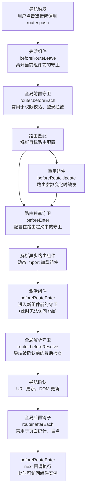
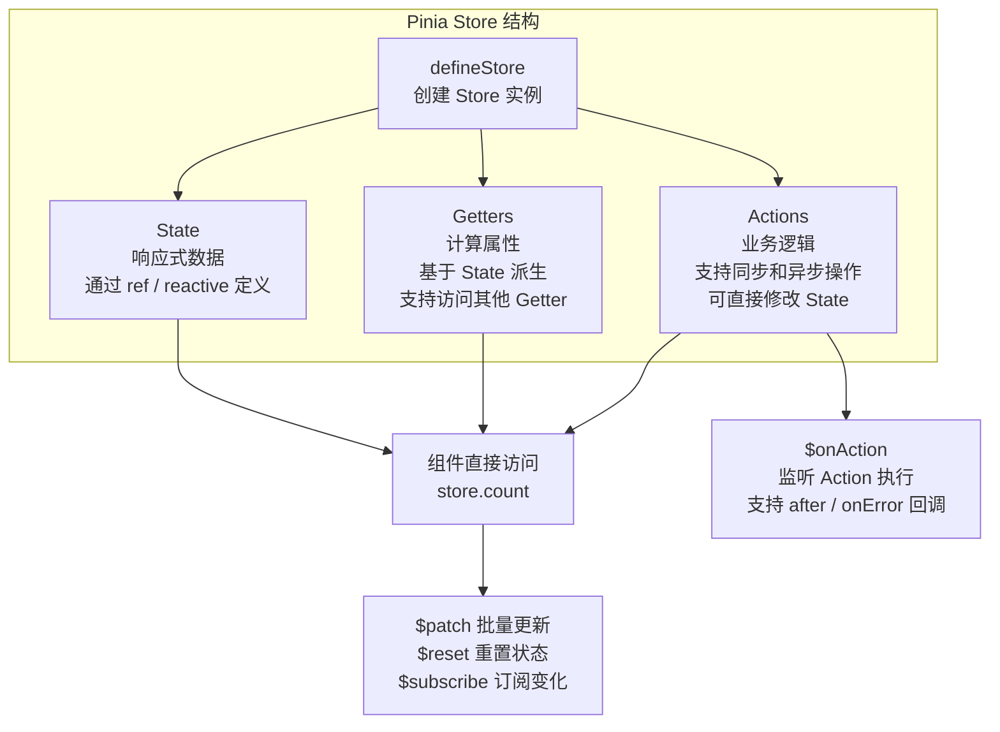

# Vue 3 路由与状态管理

> 模块：05-vue（第5周 Vue 3 生态）
> 定位：路由与状态管理原理篇

---

## 核心概念

在单页应用（SPA）中，路由负责管理页面导航，状态管理负责管理全局数据。Vue Router 和 Pinia 是 Vue 3 生态中官方推荐的路由和状态管理方案，它们共同构成了企业级 Vue 应用的基础架构。

### 为什么需要路由和状态管理？

- **路由**：SPA 只有一个 HTML 页面，路由负责根据 URL 变化切换显示不同组件，实现页面导航效果
- **状态管理**：当多个组件需要共享数据时，需要将状态提升到全局，避免 props 逐层传递（prop drilling）

---

## 底层原理

### Vue Router 路由模式

Vue Router 支持两种路由模式：

#### Hash 模式

URL 使用 `#` 分隔，`#` 后面的部分不会发送给服务器：

```
https://example.com/#/user/profile
```

- 通过 `hashchange` 事件监听 URL 变化
- `#` 后面的内容不会发送到服务器，不需要服务器配置
- 兼容性好，所有浏览器都支持

```javascript
// hash 模式原理
window.addEventListener('hashchange', () => {
  console.log('路由变化：', location.hash)
})

// 手动触发
location.hash = '/user/profile'
```

#### History 模式

使用 HTML5 History API（`pushState` / `replaceState`）修改 URL，配合 `popstate` 事件监听：

```
https://example.com/user/profile
```

- 使用 `pushState` 和 `replaceState` 修改 URL 而不刷新页面
- 通过 `popstate` 事件监听浏览器前进后退
- URL 看起来像正常的路径，对 SEO 友好
- **需要服务器配置**：所有路径都返回 index.html，否则刷新会 404

```javascript
// history 模式原理
// 修改 URL 不刷新页面
history.pushState(null, '', '/user/profile')

// 手动调用 pushState/replaceState 不会触发 popstate
// 只有浏览器前进后退按钮会触发 popstate
window.addEventListener('popstate', () => {
  console.log('浏览器前进后退：', location.pathname)
})
```

**服务器配置（Nginx 示例）**：
```nginx
location / {
  try_files $uri $uri/ /index.html;
}
```

**两种模式对比**：
| 特性 | Hash 模式 | History 模式 |
|------|-----------|--------------|
| URL 格式 | `/#/path` | `/path` |
| 服务器配置 | 不需要 | 需要 fallback |
| SEO | 差（搜索引擎不索引 # 后内容，不适合 SEO 场景） | 较好 |
| 兼容性 | 所有浏览器 | IE10+ |
| 适用场景 | 不需要 SEO 的中后台应用 | 需要 SEO 的前台应用 |

### 动态路由匹配

通过路由参数实现动态匹配：

```javascript
const routes = [
  {
    path: '/user/:id',
    component: UserDetail
  }
]

// 在组件中获取参数
<script setup>
import { useRoute } from 'vue-router'

const route = useRoute()
console.log(route.params.id) // 来自 URL: /user/123
</script>
```

**动态路由响应**：
- 当从 `/user/123` 导航到 `/user/456` 时，组件会被复用（不会重新创建）
- 可以使用 `watch` 监听 `$route.params` 变化，或者使用 `beforeRouteUpdate` 守卫

```javascript
// 方式1：watch 监听路由参数变化
watch(() => route.params.id, (newId) => {
  fetchUser(newId)
})

// 方式2：使用路由守卫
onBeforeRouteUpdate((to, from) => {
  fetchUser(to.params.id)
})
```

### 嵌套路由

路由嵌套配置，通过 `<router-view>` 实现嵌套渲染：

```javascript
const routes = [
  {
    path: '/user/:id',
    component: UserLayout,
    children: [
      {
        // /user/:id/profile
        path: 'profile',
        component: UserProfile
      },
      {
        // /user/:id/posts
        path: 'posts',
        component: UserPosts
      }
    ]
  }
]
```

```vue
<!-- UserLayout.vue -->
<template>
  <div class="user-layout">
    <h2>用户信息</h2>
    <!-- 嵌套路由出口 -->
    <router-view />
  </div>
</template>
```

### 路由守卫

路由守卫用于控制导航访问权限，分为全局守卫、路由独享守卫和组件内守卫。

#### 全局守卫

```javascript
import router from './router'

// 全局前置守卫：每次导航开始时触发
router.beforeEach((to, from, next) => {
  // 检查登录状态
  if (to.meta.requiresAuth && !isLoggedIn()) {
    next('/login')
  } else {
    next()
  }
})

// 全局解析守卫：在导航被确认之前，组件内守卫和异步路由组件解析之后
router.beforeResolve((to, from, next) => {
  // 适合在确认路由前做最后的检查
  next()
})

// 全局后置守卫：导航完成后触发
router.afterEach((to, from) => {
  // 适合做页面统计、埋点等
  console.log('页面切换：', to.fullPath)
})
```

#### 路由独享守卫

```javascript
const routes = [
  {
    path: '/admin',
    component: AdminLayout,
    beforeEnter: (to, from, next) => {
      // 只对 /admin 路由生效
      if (!isAdmin()) {
        next('/403')
      } else {
        next()
      }
    }
  }
]
```

#### 组件内守卫

```vue
<script setup>
import { onBeforeRouteLeave, onBeforeRouteUpdate } from 'vue-router'

// 注意：onBeforeRouteEnter 在 Composition API 中不可用
// beforeRouteEnter 需要在组件创建前执行，而 setup() 时组件已创建
// 如需使用 beforeRouteEnter，请用 Options API：
// export default {
//   beforeRouteEnter(to, from, next) {
//     next(vm => { /* 通过 vm 访问组件实例 */ })
//   }
// }

// 路由参数变化时，组件被复用
onBeforeRouteUpdate((to, from) => {
  // 重新获取数据
  fetchData(to.params.id)
})

// 离开此组件前
onBeforeRouteLeave((to, from) => {
  const answer = window.confirm('确定离开吗？未保存的数据将丢失')
  if (!answer) return false
})
</script>
```

#### 完整导航解析流程

1. 导航被触发
2. 在失活的组件中调用 `beforeRouteLeave` 守卫
3. 调用全局 `beforeEach` 守卫
4. 在重用的组件中调用 `beforeRouteUpdate` 守卫
5. 在路由配置中调用 `beforeEnter` 守卫
6. 解析异步路由组件
7. 在被激活的组件中调用 `beforeRouteEnter` 守卫
8. 调用全局 `beforeResolve` 守卫
9. 导航被确认
10. 调用全局 `afterEach` 钩子
11. 触发 DOM 更新
12. 调用 `beforeRouteEnter` 中传给 `next` 的回调



> 上图展示了 Vue Router 完整的导航守卫执行链：从导航触发开始，依次经过组件离开守卫、全局前置守卫、路由匹配、路由独享守卫、组件进入守卫，最后通过全局解析守卫确认导航。这条守卫链的设计使得开发者可以在导航的各个阶段插入权限校验、数据预加载、页面埋点等逻辑，形成一道灵活且严密的导航控制屏障。

### 路由懒加载

使用动态 import 实现路由级别的代码分割，减少首屏加载体积：

```javascript
// 未使用懒加载：所有组件都打包在一起
import Home from './views/Home.vue'
import About from './views/About.vue'

// 使用懒加载：按路由拆分 chunk
const routes = [
  {
    path: '/',
    component: () => import('./views/Home.vue')
  },
  {
    path: '/about',
    // webpackChunkName 给 chunk 命名，方便调试
    component: () => import(/* webpackChunkName: "about" */ './views/About.vue')
  },
  {
    path: '/settings',
    // 将多个路由的组件打包到同一个 chunk
    component: () => import(/* webpackChunkName: "group-settings" */ './views/Settings.vue')
  },
  {
    path: '/profile',
    component: () => import(/* webpackChunkName: "group-settings" */ './views/Profile.vue')
  }
]
```

> 📖 **参考链接**：
> - [Vue Router 官方文档](https://router.vuejs.org/zh/guide/)

---

## Pinia 状态管理

### 为什么 Pinia 替代 Vuex

| 对比维度 | Vuex 4 | Pinia |
|---------|--------|-------|
| API 设计 | store/state/getters/mutations/actions/modules | store/state/getters/actions，无 mutations |
| TypeScript 支持 | 需要额外类型声明，体验一般 | 原生完整支持，类型自动推断 |
| 模块化 | 嵌套模块，命名空间复杂 | 独立的 store，扁平化 |
| 组合式 API | 不支持 | 原生支持，可选择 setup 写法 |
| 代码量 | 模板代码较多 | 代码更简洁 |
| 开发体验 | 需要 commit mutations | 直接修改 state，更直观 |

**Vuex 4 的问题**：
- `mutations` 概念冗余，所有状态变更必须通过 commit，增加代码量
- 嵌套 module 导致命名空间复杂，跨模块访问困难
- TypeScript 类型推导不完善，需要手写大量类型声明

### Pinia 核心概念

```javascript
import { defineStore } from 'pinia'

// 1. Options API 风格
export const useCounterStore = defineStore('counter', {
  state: () => ({
    count: 0,
    user: null
  }),
  getters: {
    doubleCount: (state) => state.count * 2,
    // getter 可以访问其他 getter
    doubleCountPlusOne() {
      return this.doubleCount + 1
    }
  },
  actions: {
    increment() {
      // 直接修改 state，不需要 commit
      this.count++
    },
    async fetchUser(id) {
      const user = await api.getUser(id)
      this.user = user
    }
  }
})

// 2. Composition API 风格（setup 写法）
export const useUserStore = defineStore('user', () => {
  const user = ref(null)
  const token = ref('')

  // 相当于 getters
  const isLoggedIn = computed(() => !!token.value)

  // 相当于 actions
  async function login(credentials) {
    const res = await api.login(credentials)
    token.value = res.token
    user.value = res.user
  }

  function logout() {
    token.value = ''
    user.value = null
  }

  return { user, token, isLoggedIn, login, logout }
})
```

### Pinia 常用 API

```javascript
// 组件中使用
<script setup>
import { useCounterStore } from '@/stores/counter'

const counter = useCounterStore()

// 直接访问 state
console.log(counter.count)

// 直接修改 state
counter.count++

// $patch 批量更新
counter.$patch({
  count: 100,
  user: { name: '张三' }
})

// $patch 函数式更新（适合复杂更新）
counter.$patch((state) => {
  state.count++
  state.user.name = '李四'
})

// $reset 重置 state 到初始值
// 注意：仅 Options API 风格支持；setup 风格需要手动实现
counter.$reset()

// $subscribe 订阅 state 变化
counter.$subscribe((mutation, state) => {
  console.log('state 变化了', mutation.type, state)
})

// 在 action 完成前获取状态
counter.$onAction(({ name, store, args, after, onError }) => {
  after((result) => {
    console.log(`action ${name} 完成`, result)
  })
  onError((error) => {
    console.error(`action ${name} 失败`, error)
  })
})
```

### Pinia 模块化

```javascript
// stores/counter.js
export const useCounterStore = defineStore('counter', { /* ... */ })

// stores/user.js
export const useUserStore = defineStore('user', { /* ... */ })

// 组件中互相引用
<script setup>
import { useCounterStore } from '@/stores/counter'
import { useUserStore } from '@/stores/user'

const counter = useCounterStore()
const user = useUserStore()

// store 之间可以互相引用
function doSomething() {
  if (user.isLoggedIn) {
    counter.increment()
  }
}
</script>
```



> 上图展示了 Pinia Store 的核心结构：一个 Store 由 State（响应式数据）、Getters（计算属性）和 Actions（业务逻辑）三部分组成。与 Vuex 最大的不同在于，Pinia 去掉了 Mutations 这一层，Actions 可以直接修改 State，使得代码更加简洁直观。同时，Pinia 内置了 $patch、$reset、$subscribe、$onAction 等实用 API，方便开发者对状态进行批量更新、重置和订阅监听。

> 📖 **参考链接**：
> - [Pinia 官方文档](https://pinia.vuejs.org/zh/introduction.html)
> - [Vue 3官方文档 - 状态管理](https://cn.vuejs.org/guide/scaling-up/state-management)

---

## 实战应用

### 1. 权限路由控制

```javascript
// router/index.js
const routes = [
  {
    path: '/login',
    component: () => import('@/views/Login.vue'),
    meta: { requiresAuth: false }
  },
  {
    path: '/dashboard',
    component: () => import('@/views/Dashboard.vue'),
    meta: { requiresAuth: true, roles: ['admin', 'editor'] }
  }
]

router.beforeEach((to, from, next) => {
  const userStore = useUserStore()

  if (to.meta.requiresAuth && !userStore.isLoggedIn) {
    next('/login')
  } else if (to.meta.roles && !to.meta.roles.includes(userStore.role)) {
    next('/403')
  } else {
    next()
  }
})
```

### 2. 动态路由注册

```javascript
// 根据后端返回的权限动态添加路由
async function addDynamicRoutes() {
  const permissionRoutes = await api.getPermissionRoutes()
  permissionRoutes.forEach(route => {
    router.addRoute(route)
  })
}
```

### 3. Pinia 持久化

```javascript
// 自定义插件实现 localStorage 持久化
function localStoragePlugin({ store }) {
  const key = `pinia-${store.$id}`

  // 恢复状态
  const saved = localStorage.getItem(key)
  if (saved) {
    store.$patch(JSON.parse(saved))
  }

  // 保存状态
  store.$subscribe((mutation, state) => {
    localStorage.setItem(key, JSON.stringify(state))
  })
}

// 注册插件
const pinia = createPinia()
pinia.use(localStoragePlugin)
```

---

## 常见面试题

### 1. hash 模式和 history 模式的区别

**回答要点**：
- hash 模式 URL 带 `#`，`#` 后的内容不发送给服务器；history 模式 URL 看起来像正常路径
- hash 模式通过 `hashchange` 事件监听；history 模式通过 `pushState`/`replaceState` + `popstate` 事件
- hash 模式兼容性好，不需要服务器配置；history 模式需要服务器配置 fallback，否则刷新 404
- history 模式对 SEO 更友好

### 2. 路由守卫有哪些？执行顺序是什么？

**回答要点**：
- 全局守卫：beforeEach、beforeResolve、afterEach
- 路由独享守卫：beforeEnter
- 组件内守卫：beforeRouteEnter、beforeRouteUpdate、beforeRouteLeave
- 执行顺序：beforeRouteLeave → beforeEach → beforeRouteUpdate → beforeEnter → 解析组件 → beforeRouteEnter → beforeResolve → afterEach → DOM 更新 → beforeRouteEnter 的 next 回调

### 3. Pinia 和 Vuex 的区别

**回答要点**：
- Pinia 去掉了 mutations，可以直接修改 state
- Pinia 有完整的 TypeScript 支持，类型自动推断
- Pinia 支持多个独立的 store，不需要嵌套模块
- Pinia 支持 Options API 和 Composition API 两种写法
- Pinia 代码更简洁，模板代码更少

### 4. 路由懒加载的原理

**回答要点**：
- 使用动态 import 语法 `() => import('./Component.vue')`
- 构建工具将动态 import 的模块拆分为独立的 chunk
- 只有路由被访问时才加载对应的 chunk
- 减少首屏加载体积，提升页面加载速度

---

## 避坑指南

| 常见错误 | 现象 | 原因 | 解决方案 |
|---------|------|------|----------|
| history 模式刷新页面 404 | 页面空白，显示 404 错误 | 服务器找不到对应路径，因为没有真正的 HTML 文件 | 配置服务器 fallback，Nginx 使用 `try_files $uri $uri/ /index.html` |
| 动态路由参数变化时组件不更新 | 从 /user/1 到 /user/2 时页面数据不变 | 组件被复用，不会重新创建 | 使用 `watch` 监听 `route.params` 变化，或使用 `onBeforeRouteUpdate` 守卫 |
| 在 Pinia 中直接替换整个 state | 响应式丢失，视图不更新 | 直接替换 state 对象的引用，丢失了 Proxy 代理 | 使用 `$patch` 方法更新，或使用 `$reset` 重置 |
| 路由守卫中忘记调用 next | 路由卡住，无法导航 | 守卫中缺少 `next()` 调用 | 检查每个守卫分支都调用了 `next()` |
| 在 Pinia action 中返回 Promise 但未处理 | 错误未捕获，可能静默失败 | 异步操作可能抛出异常 | 在调用 action 时使用 `try/catch` 或 `.catch()` 处理错误 |
| 滥用路由守卫做大量异步操作 | 页面切换卡顿 | 守卫中同步执行大量异步操作会阻塞导航 | 将非必要的异步操作放到 `afterEach` 中，或使用懒加载 |
| 在多个 store 中循环引用 | 无限循环或报错 | store A 依赖 store B，store B 又依赖 store A | 在 action 或 getter 内部按需引入，避免顶层 import 导致循环依赖 |

---

> **学习导航**：
> - 返回 [学习路线总览](../README.md)
> - 本模块其他原理文件：[01-Vue3核心语法](./01-Vue3核心语法.md) | [02-响应式与编译优化](./02-响应式与编译优化.md) | [04-Vue3笔面试题集](./04-Vue3笔面试题集.md)
> - 实战应用：[企业后台管理系统](../10-project/01-企业后台管理系统实战.md)

## 本章学习自检

- [ ] 我能说出 hash 模式和 history 模式的区别，以及各自的原理
- [ ] 我理解动态路由匹配的用法，以及参数变化时组件的处理方式
- [ ] 我能配置嵌套路由，理解 `<router-view>` 的嵌套机制
- [ ] 我能说出全局守卫、路由独享守卫、组件内守卫的类别和区别
- [ ] 我能画出完整的导航解析流程图
- [ ] 我理解路由懒加载的原理，能正确使用动态 import
- [ ] 我能说出 Pinia 相比 Vuex 的核心改进
- [ ] 我理解 Pinia 的 defineStore、state、getters、actions 的用法
- [ ] 我能使用 $patch、$reset、$subscribe 等 Pinia 内置 API
- [ ] 我能实现基于 Pinia 的权限路由控制方案