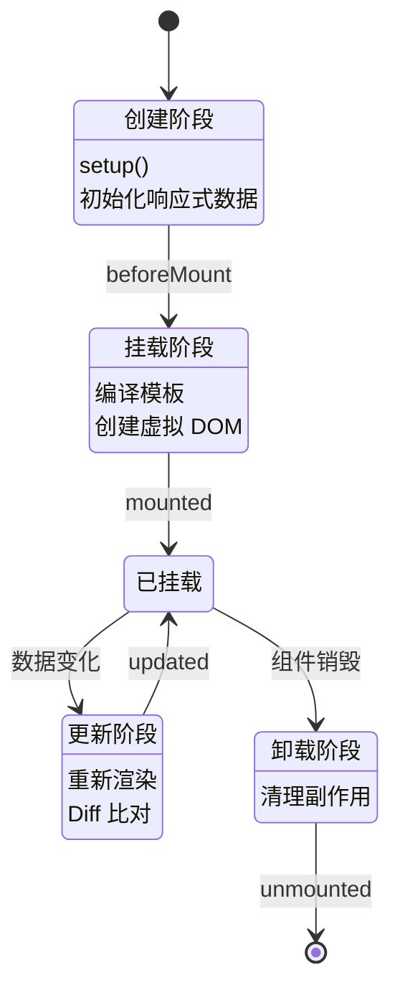

# Vue 3 笔面试题集

> 模块：05-vue（第5周 Vue 3 生态）
> 覆盖：Composition API、响应式原理、虚拟 DOM、Diff 算法、Vue Router、Pinia
> 题量：15 道选择题 + 10 道简答题 + 5 道场景设计题
> 难度标注：★基础  ★★中档  ★★★拔高

---

## 一、选择题（15 题，每题附解析）

### 1. ★ Vue 3 中创建响应式数据可以使用哪个 API？

A. `data()` 函数
B. `ref()` 和 `reactive()`
C. `computed()` 和 `watch()`
D. `props()` 和 `emit()`

**答案：B**

**解析**：Vue 3 中通过 `ref()` 和 `reactive()` 创建响应式数据。`ref()` 用于基本类型和对象，返回包装对象，需要 `.value` 访问；`reactive()` 用于对象，直接访问属性。`data()` 是 Vue 2 Options API 的用法，`computed()` 和 `watch()` 是计算和侦听，`props()` 和 `emit()` 是组件通信。

---

### 2. ★ Vue 3 中 `<script setup>` 的优势不包括？

A. 更简洁的代码
B. 顶层变量自动暴露给模板
C. import 的组件不需要注册
D. 不需要 import 组件

**答案：D**

**解析**：`<script setup>` 是语法糖，优势包括代码更简洁、顶层变量自动暴露给模板、import 导入的组件直接可用不需要注册。但仍然需要通过 `import` 导入组件，只是省去了 `components` 注册步骤。

---

### 3. ★ v-if 和 v-show 的区别是什么？

A. 没有区别，两者效果相同
B. v-if 控制 DOM 的创建和销毁，v-show 控制 CSS 的 display
C. v-show 控制 DOM 的创建和销毁，v-if 控制 CSS 的 display
D. v-if 只能用于单个元素，v-show 可以用于多个元素

**答案：B**

**解析**：v-if 是条件渲染，条件为 false 时 DOM 元素不会被创建（惰性渲染），切换开销大，适合不频繁切换的场景。v-show 始终渲染到 DOM，只是通过 CSS `display` 属性切换显示隐藏，初始渲染开销大，切换开销小，适合频繁切换的场景。

---

### 4. ★★ 关于 ref 和 reactive 的区别，以下说法正确的是？

A. ref 只能用于基本类型，reactive 只能用于对象
B. ref 和 reactive 没有区别，可以互换使用
C. ref 可以用于基本类型和对象，通过 `.value` 访问；reactive 只能用于对象，直接访问
D. reactive 可以用于基本类型，ref 只能用于对象

**答案：C**

**解析**：ref 可以用于基本类型和对象，通过 `.value` 访问值（模板中自动解包），ref 内部对对象会自动调用 reactive。reactive 只能用于对象（包括数组），直接访问属性不需要 `.value`。两者在解构时都需要 toRef/toRefs 保持响应性。

---

### 5. ★★ Vue 3 的响应式原理使用的是什么技术？

A. Object.defineProperty
B. Proxy
C. Object.observe
D. MutationObserver

**答案：B**

**解析**：Vue 3 使用 ES6 的 Proxy 实现响应式，代理整个对象，支持新增/删除属性检测、数组索引和 length 修改检测。Vue 2 使用 Object.defineProperty（选项 A），存在诸多限制。Object.observe（选项 C）已被废弃。MutationObserver（选项 D）用于监听 DOM 变化。

---

### 6. ★★ 关于 computed 和 watch 的区别，以下说法正确的是？

A. computed 和 watch 功能完全相同
B. computed 有缓存，依赖不变不重新计算；watch 没有缓存，变化就执行
C. watch 有缓存，computed 没有缓存
D. computed 可以执行异步操作，watch 不能执行异步操作

**答案：B**

**解析**：computed 计算属性有缓存机制，只有依赖的响应式数据变化才会重新计算，适合衍生值的计算。watch 没有缓存，监听的数据变化就执行回调，适合执行副作用（如异步请求、DOM 操作等）。watch 支持异步操作，computed 不推荐产生副作用。

---

### 7. ★★ 关于 Vue Router 的 hash 模式和 history 模式，以下说法错误的是？

A. hash 模式 URL 包含 `#`，history 模式 URL 更干净
B. history 模式需要服务器配置 fallback，否则刷新会 404
C. hash 模式通过 `hashchange` 事件监听，history 模式通过 `popstate` 事件监听
D. hash 模式对 SEO 更友好

**答案：D**

**解析**：history 模式对 SEO 更友好，因为 URL 看起来像正常的页面路径，搜索引擎可以正常索引。hash 模式中 `#` 后面的内容部分搜索引擎可能不会索引。A、B、C 选项描述均正确。

---

### 8. ★★ 以下关于 Pinia 的说法正确的是？

A. Pinia 和 Vuex 一样，需要 commit mutations 来修改 state
B. Pinia 去掉了 mutations，可以直接修改 state
C. Pinia 不支持 TypeScript
D. Pinia 必须使用 Options API 写法

**答案：B**

**解析**：Pinia 的核心理念是去掉了 Vuex 中冗余的 mutations 概念，可以直接修改 state 而不需要 commit。Pinia 原生完整支持 TypeScript，类型自动推断。Pinia 同时支持 Options API 和 Composition API 两种写法。

---

### 9. ★★ 关于 Vue 3 中 watchEffect 和 watch 的区别，以下说法正确的是？

A. watchEffect 需要显式指定监听源，watch 自动追踪
B. watchEffect 自动追踪依赖并立即执行，watch 默认惰性执行
C. watchEffect 可以获取新旧值，watch 不能
D. 两者完全一样，只是写法不同

**答案：B**

**解析**：watchEffect 自动追踪回调中使用的响应式依赖，立即执行，依赖变化时重新执行，不需要手动指定监听源。watch 需要显式指定监听源，默认惰性执行（不立即执行），可以获取新旧值。watchEffect 不能获取新旧值。

---

### 10. ★★ 以下关于 nextTick 的说法正确的是？

A. nextTick 是同步执行的回调
B. nextTick 在下次 DOM 更新循环之后执行回调
C. nextTick 在数据变化之前执行回调
D. nextTick 是 Vue 3 新增的 API，Vue 2 中没有

**答案：B**

**解析**：nextTick 将回调推迟到下次 DOM 更新循环之后执行，确保在回调中能获取到更新后的 DOM。Vue 2 中内部使用 Promise.then → MutationObserver → setImmediate → setTimeout 降级链；Vue 3 中仅使用 `Promise.resolve().then()`（现代浏览器已全面支持 Promise）。nextTick 在 Vue 2 和 Vue 3 中都存在，用于数据变化后获取更新后的 DOM。

---

### 11. ★★★ Vue 3 Diff 算法的优化不包括以下哪项？

A. 静态标记（PatchFlag）
B. 静态提升（HoistStatic）
C. 使用 Fiber 架构
D. Block Tree

**答案：C**

**解析**：Fiber 架构是 React 16 引入的可中断渲染架构，不是 Vue 3 的特性。Vue 3 Diff 算法的优化包括：静态标记（PatchFlag，标记动态内容类型）、静态提升（HoistStatic，静态节点提升到 render 函数外）、Block Tree（动态节点收集到 dynamicChildren 中）、事件缓存（cacheHandlers）。

---

### 12. ★★★ Vue 3 的静态提升（HoistStatic）是什么？

A. 将动态节点提升到 render 函数外，避免重复创建
B. 将静态节点提升到 render 函数外，避免重复创建
C. 提升组件的渲染优先级
D. 提升 CSS 样式的优先级

**答案：B**

**解析**：静态提升（HoistStatic）是 Vue 3 编译器优化，将不会变化的静态节点提升到 render 函数外部，这样每次组件渲染时可以直接复用已有的 VNode，而不是重新创建。这减少了 VNode 的创建开销，提升了渲染性能。

---

### 13. ★★ 以下关于 provide/inject 的说法正确的是？

A. 只能父子组件之间使用
B. 父组件 provide，后代组件 inject
C. inject 的数据一定是响应式的
D. provide 只能在 setup 中使用

**答案：B**

**解析**：provide/inject 用于跨层级组件通信，父组件（祖先组件）通过 provide 提供数据，任意后代组件通过 inject 获取数据。inject 的数据是否响应式取决于 provide 提供的数据是否是响应式数据（ref 或 reactive）。provide 可以在 setup 和 Options API 中使用。

---

**Vue 组件完整生命周期状态图：**



> Vue 组件的生命周期涵盖创建、挂载、更新、卸载四个阶段，setup() 在创建阶段最早执行，替代了 Vue 2 的 beforeCreate 和 created 钩子。

### 14. ★★ Vue 3 生命周期中，setup 替代了 Vue 2 的哪些钩子？

A. mounted 和 updated
B. beforeCreate 和 created
C. beforeMount 和 mounted
D. beforeDestroy 和 destroyed

**答案：B**

**解析**：Vue 3 中 setup 函数在 beforeCreate 和 created 之前执行，替代了这两个钩子。在 setup 中可以直接使用 Composition API 定义数据和方法，不需要在 beforeCreate 或 created 中操作。mounted、updated、beforeUnmount 等仍然有对应的 onMounted、onUpdated、onBeforeUnmount 等钩子。

---

### 15. ★★★ Vue 3 编译器优化的 Block Tree 是什么？

A. 将组件树分成多个 Block，每个 Block 独立渲染
B. 将动态节点收集到 dynamicChildren 数组中，diff 时只对比动态节点
C. 将路由组件按 Block 拆分，实现懒加载
D. 将 CSS 按 Block 拆分，避免样式冲突

**答案：B**

**解析**：Block Tree 是 Vue 3 的编译器优化策略。模板中的动态节点会被收集到 `dynamicChildren` 数组中，静态节点被跳过。diff 时直接从 `dynamicChildren` 获取需要对比的节点，大幅减少 diff 的时间复杂度，尤其对于大部分静态内容、少量动态内容的模板效果显著。

---

## 二、简答题（10 题）

### 1. ★★ Vue 2 和 Vue 3 响应式原理的区别

**答案要点**：

Vue 2 使用 `Object.defineProperty` 劫持对象属性的 getter 和 setter，存在以下局限：
- 无法检测新增属性，需要使用 `Vue.set()`
- 无法检测删除属性，需要使用 `Vue.delete()`
- 无法检测数组索引和 length 修改
- 需要重写数组的 7 个变异方法
- 初始化时递归遍历所有属性，性能开销大

Vue 3 使用 `Proxy` 代理整个对象，优势如下：
- 支持新增和删除属性检测
- 支持数组索引和 length 修改检测
- 不需要重写数组方法
- 惰性响应式：初始化只代理第一层，访问嵌套对象时才代理
- 配合 Reflect API，保证 this 指向正确

> 📖 **参考链接**：
> - [Vue 3官方文档 - 响应式系统深入](https://cn.vuejs.org/guide/extras/reactivity-in-depth)
> - [MDN - Proxy](https://developer.mozilla.org/zh-CN/docs/Web/JavaScript/Reference/Global_Objects/Proxy)

---

### 2. ★★ Vue 3 Composition API 相比 Options API 的优势

**答案要点**：

- **代码组织**：Composition API 可以按逻辑关注点聚合代码，Options API 将同一逻辑的代码分散在 data、methods、computed 中
- **逻辑复用**：Composition API 可以轻松提取组合式函数（composables）复用逻辑，而 Options API 的 mixins 容易导致命名冲突和来源不清晰
- **TypeScript 支持**：Composition API 原生适配 TypeScript 类型推断，Options API 需要额外声明类型
- **Tree Shaking**：Composition API 中未使用的代码更容易被打包工具摇掉
- **代码量**：大型组件中 Composition API 代码更少，结构更清晰

> 📖 **参考链接**：
> - [Vue 3官方文档 - Composition API FAQ](https://cn.vuejs.org/guide/extras/composition-api-faq)
> - [Vue 3官方文档 - setup 函数](https://cn.vuejs.org/api/composition-api-setup)

---

### 3. ★★ 虚拟 DOM 的原理和优缺点

**答案要点**：

**原理**：虚拟 DOM 是用 JavaScript 对象（VNode）描述真实 DOM 结构的轻量级表示。通过 diff 算法比较新旧 VNode 树，找出最小变更，再批量更新真实 DOM。

**优点**：
- 减少真实 DOM 操作，提升性能
- 跨平台：虚拟 DOM 是平台无关的抽象层，可以渲染到不同平台
- 声明式编程：开发者只需描述 UI 状态，框架负责更新

**缺点**：
- 首次渲染需要生成完整 VNode 树，不如直接操作 DOM 快
- 需要额外的 diff 计算开销
- 内存占用：需要维护 VNode 树

---

### 4. ★★★ Vue 3 Diff 算法做了哪些优化

**答案要点**：

1. **静态标记（PatchFlag）**：编译阶段为动态节点标记类型（TEXT、CLASS、STYLE 等），运行时 diff 只检查标记的属性，不遍历所有属性
2. **静态提升（HoistStatic）**：将静态节点提升到 render 函数外部，避免每次渲染重新创建 VNode
3. **Block Tree**：将动态节点收集到 `dynamicChildren` 数组中，diff 时只对比这些节点，跳过所有静态节点
4. **事件缓存（cacheHandlers）**：缓存事件处理函数，避免每次渲染创建新函数，减少不必要的子组件更新

> 📖 **参考链接**：
> - [Vue 3官方文档 - 渲染机制](https://cn.vuejs.org/guide/extras/rendering-mechanism)
> - [Vue 3官方文档 - Patch Flags](https://cn.vuejs.org/guide/extras/rendering-mechanism#patch-flags)

---

### 5. ★★ Vue Router 的路由守卫有哪些

**答案要点**：

**全局守卫**：
- `beforeEach`：全局前置守卫，每次导航开始时触发
- `beforeResolve`：全局解析守卫，在导航被确认前触发
- `afterEach`：全局后置守卫，导航完成后触发

**路由独享守卫**：
- `beforeEnter`：在路由配置中定义，只对该路由生效

**组件内守卫**：
- `beforeRouteEnter`：进入组件前触发，在 `setup` 中无法访问 this
- `beforeRouteUpdate`：路由参数变化、组件被复用时触发
- `beforeRouteLeave`：离开组件前触发，可以阻止导航

**完整执行顺序**：beforeRouteLeave → beforeEach → beforeRouteUpdate → beforeEnter → 解析组件 → beforeRouteEnter → beforeResolve → afterEach → DOM 更新 → beforeRouteEnter next 回调

> 📖 **参考链接**：
> - [Vue Router 官方文档](https://router.vuejs.org/zh/guide/)

---

### 6. ★★ Pinia 和 Vuex 的区别

**答案要点**：

- **API 设计**：Pinia 去掉了 mutations 概念，可以直接修改 state；Vuex 需要通过 commit mutations 修改
- **TypeScript 支持**：Pinia 原生完整支持，类型自动推断；Vuex 4 需要额外声明类型
- **模块化**：Pinia 使用独立的 store，扁平化管理；Vuex 使用嵌套模块，命名空间复杂
- **写法**：Pinia 支持 Options API 和 Composition API 两种写法；Vuex 4 只支持 Options API
- **代码量**：Pinia 代码更简洁，模板代码更少
- **体积**：Pinia 更轻量

> 📖 **参考链接**：
> - [Pinia 官方文档](https://pinia.vuejs.org/zh/introduction.html)
> - [Vue 3官方文档 - 状态管理](https://cn.vuejs.org/guide/scaling-up/state-management)

---

### 7. ★★ Vue 3 组件通信方式有哪些

**答案要点**：

1. **props / emits**：父子组件通信，父传子用 props，子传父用 emits
2. **defineExpose**：子组件暴露方法/属性给父组件访问
3. **provide / inject**：跨层级组件通信，祖先组件 provide，后代组件 inject
4. **v-model**：双向绑定，本质是 props + emit 的语法糖
5. **Pinia**：全局状态管理，任意组件间共享状态
6. **事件总线（mitt）**：任意组件间通信，通过发布订阅模式
7. **ref**：父组件通过 ref 获取子组件实例

---

### 8. ★★ nextTick 的原理和使用场景

**答案要点**：

**原理**：
- nextTick 将回调推迟到下次 DOM 更新循环之后执行
- Vue 3 中仅使用 `Promise.resolve().then()`（微任务）实现，现代浏览器已全面支持 Promise
- （Vue 2 曾使用降级策略：Promise.then → MutationObserver → setImmediate → setTimeout，以兼容旧浏览器）
- 多个 nextTick 回调会被收集到队列中，统一执行

**使用场景**：
- 数据变化后获取更新后的 DOM（如获取元素尺寸、滚动位置）
- 确保子组件渲染完成后再执行操作
- 在 `created` 或 `setup` 中等待 DOM 渲染完成

---

### 9. ★★★ Vue 3 编译器的优化策略

**答案要点**：

Vue 3 编译器在 compile 阶段做了大量优化：

1. **静态节点标记**：识别纯静态的节点，在 diff 时跳过
2. **PatchFlag 动态标记**：为动态绑定添加标记，运行时只检查标记的属性
3. **静态提升（HoistStatic）**：将静态节点提升到 render 函数外，避免重复创建
4. **Block Tree**：识别动态节点，构建 Block Tree，diff 时只对比 dynamicChildren
5. **事件缓存（cacheHandlers）**：缓存事件处理函数，避免不必要的更新
6. **预字符串化**：当静态节点数量达到阈值时，直接生成 innerHTML 字符串

编译流程：模板 → parse（解析为 AST）→ transform（优化转换）→ generate（生成 render 函数）

> 📖 **参考链接**：
> - [Vue 3官方文档 - 渲染机制](https://cn.vuejs.org/guide/extras/rendering-mechanism)
> - [Vue 3官方文档 - Static Hoisting](https://cn.vuejs.org/guide/extras/rendering-mechanism#cache-static)

---

### 10. ★★ v-model 的原理

**答案要点**：

v-model 本质是 `props` + `emit` 的语法糖：

```vue
<!-- 写法1 -->
<input v-model="message" />

<!-- 等价于 -->
<input :value="message" @input="message = $event.target.value" />
```

在 Vue 3 中，v-model 支持多个绑定和自定义名称：
```vue
<!-- 默认 v-model -->
<Child v-model="title" />
<!-- 等价于 -->
<Child :modelValue="title" @update:modelValue="title = $event" />

<!-- 命名 v-model -->
<Child v-model:title="title" v-model:content="content" />
```

组件内部通过 `defineProps` 接收 `modelValue`（或自定义名称），通过 `defineEmits` 触发 `update:modelValue` 事件。

> 📖 **参考链接**：
> - [Vue 3官方文档 - 模板语法](https://cn.vuejs.org/guide/essentials/template-syntax)
> - [Vue 3官方文档 - 内置指令](https://cn.vuejs.org/api/built-in-directives)

---

## 三、场景设计题（5 题）

### 1. ★★ 设计一个权限管理系统（动态路由 + 按钮级权限控制）

**设计思路**：

**动态路由**：
1. 定义基础路由（登录页、404 等）和需要权限的动态路由表
2. 登录成功后，根据后端返回的用户角色和权限，从动态路由表中筛选该用户可访问的路由
3. 使用 `router.addRoute()` 动态添加路由
4. 在 `beforeEach` 守卫中检查权限，未登录跳转登录页

**按钮级权限**：
1. 后端返回用户的权限标识列表（如 `['user:add', 'user:delete', 'role:edit']`）
2. 封装自定义指令 `v-permission`，根据权限标识控制按钮显示/隐藏
3. 或者封装 `hasPermission` 函数，在模板中使用 `v-if` 控制

```javascript
// 自定义指令 v-permission
app.directive('permission', {
  mounted(el, binding) {
    const userStore = useUserStore()
    if (!userStore.hasPermission(binding.value)) {
      el.parentNode?.removeChild(el)
    }
  }
})

// 使用
<button v-permission="'user:delete'">删除</button>
```

---

### 2. ★★ 设计一个通用表格组件（支持排序、筛选、分页、自定义列）

**设计思路**：

**组件 Props**：
- `columns`：列配置数组（key、title、width、sortable、filterable、render 自定义渲染函数）
- `dataSource`：表格数据数组
- `pagination`：分页配置（current、pageSize、total）
- `loading`：加载状态

**组件 Events**：
- `update:sort`：排序变化
- `update:filter`：筛选变化
- `update:pagination`：分页变化

**实现要点**：
- 使用插槽（slot）支持自定义列渲染
- 排序功能通过修改数据源排序实现，或通知父组件处理
- 分页使用独立的分页组件
- 筛选支持下拉筛选和输入筛选
- 使用 `defineExpose` 暴露表格方法（如刷新、清空筛选）

```javascript
// 列配置示例
const columns = [
  { key: 'name', title: '姓名', width: 120, sortable: true },
  { key: 'age', title: '年龄', width: 80, sortable: true },
  { key: 'status', title: '状态', filterable: true, filters: ['启用', '禁用'] },
  { key: 'action', title: '操作', render: (row) => h(Button, { onClick: () => edit(row) }, '编辑') }
]
```

---

### 3. ★★★ 设计一个低代码表单设计器（拖拽生成表单，JSON Schema 驱动）

**设计思路**：

**核心架构**：
1. **组件面板**：左侧展示可用表单组件（输入框、下拉框、日期选择器等），支持拖拽
2. **画布区域**：中间拖放区域，展示表单布局，支持拖拽排序和选中编辑
3. **属性面板**：右侧展示选中组件的属性配置（标签、必填、校验规则等）
4. **JSON Schema 驱动**：表单配置以 JSON Schema 存储和传输

**数据模型**：
```javascript
// JSON Schema 表单定义
const formSchema = {
  fields: [
    {
      id: 'field_1',
      type: 'input',
      label: '用户名',
      key: 'username',
      required: true,
      placeholder: '请输入用户名',
      validation: [{ rule: 'required', message: '用户名不能为空' }]
    },
    {
      id: 'field_2',
      type: 'select',
      label: '性别',
      key: 'gender',
      options: [
        { label: '男', value: 'male' },
        { label: '女', value: 'female' }
      ]
    }
  ],
  layout: 'vertical' // 布局方式
}
```

**渲染器**：根据 JSON Schema 动态渲染表单组件，每个字段类型对应一个渲染组件。

**拖拽实现**：使用 HTML5 Drag and Drop API 或第三方库（如 vuedraggable），拖拽组件到画布时生成新的字段配置。

---

### 4. ★★ 设计一个全局 Loading 和错误处理方案

**设计思路**：

**全局 Loading**：
1. 使用 Pinia 管理 loading 状态
2. 封装 HTTP 请求拦截器，请求开始显示 loading，请求结束隐藏 loading
3. 支持显示/隐藏方法，以及 loading 文案配置
4. 使用 Teleport 将 loading 组件传送到 body 下，避免样式层级问题

```javascript
// stores/loading.js
export const useLoadingStore = defineStore('loading', () => {
  const visible = ref(false)
  const text = ref('加载中...')

  let requestCount = 0

  function show(t) {
    if (t) text.value = t
    requestCount++
    visible.value = true
  }

  function hide() {
    requestCount--
    if (requestCount <= 0) {
      requestCount = 0
      visible.value = false
    }
  }

  return { visible, text, show, hide }
})
```

**全局错误处理**：
1. 封装 HTTP 响应拦截器，统一处理错误状态码（401 跳转登录、403 无权限、500 服务器错误）
2. 使用 ErrorBoundary 组件捕获渲染错误
3. 全局未捕获错误处理：`app.config.errorHandler`
4. 使用统一的错误提示组件（如 ElMessage）

```javascript
// 错误处理
app.config.errorHandler = (err, instance, info) => {
  console.error('全局错误：', err, info)
  // 上报错误日志
  reportError(err)
  // 显示错误提示
  ElMessage.error('操作失败，请稍后重试')
}
```

---

### 5. ★★★ 设计一个前端微前端架构（qiankun / Module Federation）

**设计思路**：

**方案选择**：
- **qiankun**：基于 single-spa 的微前端框架，适合已有多个独立子应用接入
- **Module Federation**（Webpack 5）：适合构建时组合，模块间共享依赖

**qiankun 方案**：
1. 主应用注册子应用，指定子应用的入口地址和激活规则
2. 子应用独立开发、独立部署，需要暴露生命周期钩子（bootstrap、mount、unmount）
3. 主应用通过路由匹配激活不同的子应用
4. 处理 CSS 隔离（Shadow DOM 或 CSS Scope）和 JS 沙箱（Proxy 沙箱）

```javascript
// 主应用注册子应用
import { registerMicroApps, start } from 'qiankun'

registerMicroApps([
  {
    name: 'app-vue',
    entry: '//localhost:8081',
    container: '#subapp-container',
    activeRule: '/app-vue'
  },
  {
    name: 'app-react',
    entry: '//localhost:8082',
    container: '#subapp-container',
    activeRule: '/app-react'
  }
])

start()
```

**Module Federation 方案**：
1. Webpack 5 配置 exposes 和 remotes
2. 主应用通过 remotes 配置引用其他应用的模块
3. 子应用通过 exposes 配置暴露组件或模块
4. 共享依赖通过 shared 配置，避免重复加载

**关键挑战**：
- 子应用间通信：使用全局状态管理（如 Pinia 共享）、自定义事件、localStorage 等
- 样式隔离：CSS Modules、Shadow DOM、命名空间前缀
- 公共依赖：共享 Vue、Element Plus 等，减少重复加载
- 部署和版本管理：独立部署，注意版本兼容性

---

## 补充编程题：完整代码实现

### 补充1：自定义组合式函数（Composable）

```javascript
// ========== 1. useDebounce：防抖组合式函数 ==========
import { ref, watch } from 'vue';

export function useDebounce(value, delay = 300) {
  const debouncedValue = ref(value.value);

  watch(value, (newValue) => {
    const timer = setTimeout(() => {
      debouncedValue.value = newValue;
    }, delay);

    // 清理函数：组件卸载时自动清除定时器
    return () => clearTimeout(timer);
  });

  return debouncedValue;
}

// 使用示例
// <script setup>
// const keyword = ref('');
// const debouncedKeyword = useDebounce(keyword, 500);
// watch(debouncedKeyword, (val) => { /* 发起搜索请求 */ });
// </script>

// ========== 2. useFetch：数据请求组合式函数 ==========
import { ref, watchEffect, toValue } from 'vue';

export function useFetch(url) {
  const data = ref(null);
  const error = ref(null);
  const loading = ref(false);

  async function execute() {
    loading.value = true;
    error.value = null;
    data.value = null;

    try {
      const response = await fetch(toValue(url));
      if (!response.ok) {
        throw new Error(`HTTP ${response.status}`);
      }
      data.value = await response.json();
    } catch (err) {
      error.value = err.message;
    } finally {
      loading.value = false;
    }
  }

  // 监听 URL 变化，自动重新请求
  watchEffect(() => {
    execute();
  });

  return { data, error, loading, refetch: execute };
}

// 使用示例
// <script setup>
// const userId = ref(1);
// const { data: user, loading, error } = useFetch(
//   () => `https://api.example.com/users/${userId.value}`
// );
// </script>

// ========== 3. useLocalStorage：本地存储组合式函数 ==========
import { ref, watch } from 'vue';

export function useLocalStorage(key, defaultValue) {
  // 读取初始值
  const storedValue = localStorage.getItem(key);
  const data = ref(storedValue !== null ? JSON.parse(storedValue) : defaultValue);

  // 监听变化，自动同步到 localStorage
  watch(data, (newValue) => {
    if (newValue === null || newValue === undefined) {
      localStorage.removeItem(key);
    } else {
      localStorage.setItem(key, JSON.stringify(newValue));
    }
  }, { deep: true });

  // 监听其他标签页的 storage 变化
  window.addEventListener('storage', (event) => {
    if (event.key === key) {
      data.value = event.newValue !== null
        ? JSON.parse(event.newValue)
        : defaultValue;
    }
  });

  return data;
}

// 使用示例
// <script setup>
// const theme = useLocalStorage('app-theme', 'light');
// const fontSize = useLocalStorage('font-size', 14);
// </script>

// ========== 4. useMouse：鼠标位置追踪组合式函数 ==========
import { ref, onMounted, onUnmounted } from 'vue';

export function useMouse() {
  const x = ref(0);
  const y = ref(0);

  function update(event) {
    x.value = event.pageX;
    y.value = event.pageY;
  }

  onMounted(() => {
    window.addEventListener('mousemove', update);
  });

  onUnmounted(() => {
    window.removeEventListener('mousemove', update);
  });

  return { x, y };
}

// ========== 5. usePermission：权限检查组合式函数 ==========
import { computed } from 'vue';
import { useUserStore } from '@/stores/user';

export function usePermission() {
  const userStore = useUserStore();

  const permissions = computed(() => userStore.permissions || []);

  function hasPermission(code) {
    return permissions.value.includes(code);
  }

  function hasAnyPermission(...codes) {
    return codes.some((code) => permissions.value.includes(code));
  }

  function hasAllPermissions(...codes) {
    return codes.every((code) => permissions.value.includes(code));
  }

  return { hasPermission, hasAnyPermission, hasAllPermissions };
}
```

### 补充2：手写简单响应式系统（reactive/ref）

```javascript
/**
 * 简易 Vue 3 响应式系统实现
 * 基于 Proxy 和 Effect 依赖收集
 */

// 当前正在执行的副作用函数
let activeEffect = null;

// 副作用函数栈（处理嵌套 effect）
const effectStack = [];

// 依赖收集：target -> key -> Set<effect>
const targetMap = new WeakMap();

/**
 * 创建响应式对象（reactive）
 */
function reactive(target) {
  // 基本类型和非对象直接返回
  if (target === null || typeof target !== 'object') {
    return target;
  }

  // 已经代理过的对象直接返回
  if (target.__v_isReactive) {
    return target;
  }

  return new Proxy(target, {
    get(obj, key, receiver) {
      // 标记为已代理
      if (key === '__v_isReactive') {
        return true;
      }

      // 依赖收集
      track(obj, key);

      const result = Reflect.get(obj, key, receiver);

      // 深层响应式：嵌套对象也代理
      if (typeof result === 'object' && result !== null) {
        return reactive(result);
      }

      return result;
    },

    set(obj, key, value, receiver) {
      const oldValue = obj[key];
      const result = Reflect.set(obj, key, value, receiver);

      // 值变化时触发更新
      if (oldValue !== value) {
        trigger(obj, key);
      }

      return result;
    },

    deleteProperty(obj, key) {
      const hadKey = Object.prototype.hasOwnProperty.call(obj, key);
      const result = Reflect.deleteProperty(obj, key);

      if (hadKey && result) {
        trigger(obj, key);
      }

      return result;
    },
  });
}

/**
 * 创建 ref 响应式引用
 */
function ref(value) {
  // 如果已经是 ref，直接返回
  if (value && value.__v_isRef) {
    return value;
  }

  // 内部使用 reactive 处理对象
  const rawValue = typeof value === 'object' && value !== null
    ? reactive(value)
    : value;

  const r = {
    __v_isRef: true,

    get value() {
      track(r, 'value');
      return rawValue;
    },

    set value(newValue) {
      if (newValue !== rawValue) {
        rawValue = typeof newValue === 'object' && newValue !== null
          ? reactive(newValue)
          : newValue;
        trigger(r, 'value');
      }
    },
  };

  return r;
}

/**
 * 依赖收集：建立 target[key] -> effect 的映射
 */
function track(target, key) {
  if (!activeEffect) return;

  let depsMap = targetMap.get(target);
  if (!depsMap) {
    targetMap.set(target, (depsMap = new Map()));
  }

  let deps = depsMap.get(key);
  if (!deps) {
    depsMap.set(key, (deps = new Set()));
  }

  deps.add(activeEffect);

  // 让 effect 知道自己收集了哪些依赖，方便清理
  activeEffect.deps.push(deps);
}

/**
 * 触发更新：通知所有依赖 target[key] 的 effect 重新执行
 */
function trigger(target, key) {
  const depsMap = targetMap.get(target);
  if (!depsMap) return;

  const deps = depsMap.get(key);
  if (!deps) return;

  // 创建新的 Set 避免无限循环
  const effectsToRun = new Set(deps);
  effectsToRun.forEach((effect) => {
    // 避免循环触发
    if (effect !== activeEffect) {
      effect();
    }
  });
}

/**
 * 创建副作用函数（类似 Vue 的 watchEffect）
 */
function effect(fn) {
  const effectFn = () => {
    // 清理旧的依赖
    cleanup(effectFn);

    activeEffect = effectFn;
    effectStack.push(effectFn);

    fn();

    effectStack.pop();
    activeEffect = effectStack[effectStack.length - 1];
  };

  // 存储依赖列表，用于清理
  effectFn.deps = [];

  // 立即执行一次
  effectFn();

  return effectFn;
}

/**
 * 清理副作用函数的所有依赖
 */
function cleanup(effectFn) {
  for (const deps of effectFn.deps) {
    deps.delete(effectFn);
  }
  effectFn.deps.length = 0;
}

/**
 * 计算属性（computed）
 */
function computed(getter) {
  let cachedValue;
  let dirty = true;

  // effect 会在依赖变化时自动重新执行
  const effectFn = effect(() => {
    const newValue = getter();
    if (cachedValue !== newValue) {
      cachedValue = newValue;
      dirty = true;  // 依赖变化时标记为脏，通知下次访问需重新读取
    }
  });

  const computedRef = {
    __v_isRef: true,

    get value() {
      if (dirty) {
        // dirty 为 true 表示 effect 已更新 cachedValue
        // 清除标记，避免重复通知
        dirty = false;
      }
      track(computedRef, 'value');
      return cachedValue;
    },
  };

  return computedRef;
}

// ========== 测试 ==========

const state = reactive({
  count: 0,
  message: 'Hello',
  nested: { value: 1 },
});

const doubleCount = computed(() => state.count * 2);

effect(() => {
  console.log('count 变化:', state.count, 'double:', doubleCount.value);
});

// 修改响应式数据
state.count = 1;  // 输出: count 变化: 1 double: 2
state.count = 2;  // 输出: count 变化: 2 double: 4

// ref 测试
const countRef = ref(0);
effect(() => {
  console.log('ref count:', countRef.value);
});
countRef.value = 10;  // 输出: ref count: 10
```

### 补充3：自定义指令完整实现

```javascript
// ========== 1. v-permission：权限控制指令 ==========
import { useUserStore } from '@/stores/user';

const permissionDirective = {
  mounted(el, binding) {
    const userStore = useUserStore();
    const { value } = binding;

    if (value && !userStore.hasPermission(value)) {
      // 无权限时移除元素
      el.parentNode?.removeChild(el);
    }
  },
};

// 注册指令
// app.directive('permission', permissionDirective);

// 使用
// <button v-permission="'user:delete'">删除</button>
// <button v-permission="['user:edit', 'admin']">编辑</button>

// ========== 2. v-lazy：图片懒加载指令 ==========
const lazyDirective = {
  mounted(el, binding) {
    // 默认占位图
    el.src = binding.value.placeholder || 'data:image/svg+xml,...';

    const observer = new IntersectionObserver(
      (entries) => {
        entries.forEach((entry) => {
          if (entry.isIntersecting) {
            const img = entry.target;
            img.src = binding.value.src;
            img.onload = () => {
              img.classList.add('loaded');
            };
            observer.unobserve(img);
          }
        });
      },
      {
        rootMargin: '50px', // 提前 50px 开始加载
        threshold: 0.01,
      }
    );

    observer.observe(el);

    // 存储 observer 实例以便卸载时清理
    el._lazyObserver = observer;
  },

  unmounted(el) {
    if (el._lazyObserver) {
      el._lazyObserver.disconnect();
    }
  },
};

// 使用
// 

// ========== 3. v-debounce：防抖点击指令 ==========
const debounceDirective = {
  mounted(el, binding) {
    const { value: handler, arg: delay = 300 } = binding;
    let timer = null;

    el.addEventListener('click', (event) => {
      if (timer) clearTimeout(timer);
      timer = setTimeout(() => {
        handler(event);
      }, Number(delay));
    });
  },
};

// 使用
// <button v-debounce:500="handleSubmit">提交（防抖 500ms）</button>

// ========== 4. v-focus：自动聚焦指令 ==========
const focusDirective = {
  mounted(el) {
    el.focus();
  },
};

// 使用
// <input v-focus />

// ========== 5. v-copy：一键复制指令 ==========
const copyDirective = {
  mounted(el, binding) {
    el._copyHandler = async () => {
      const text = binding.value;
      try {
        await navigator.clipboard.writeText(text);
        el.classList.add('copied');
        // 提示
        console.log('复制成功:', text);
        setTimeout(() => {
          el.classList.remove('copied');
        }, 2000);
      } catch (err) {
        // 降级方案：使用 textarea 复制
        const textarea = document.createElement('textarea');
        textarea.value = text;
        textarea.style.position = 'fixed';
        textarea.style.opacity = '0';
        document.body.appendChild(textarea);
        textarea.select();
        document.execCommand('copy');
        document.body.removeChild(textarea);
        console.log('复制成功（降级）:', text);
      }
    };

    el.addEventListener('click', el._copyHandler);
  },

  unmounted(el) {
    el.removeEventListener('click', el._copyHandler);
  },
};

// 使用
// <span v-copy="userInfo.email">点击复制邮箱</span>

// ========== 6. v-watermark：水印指令 ==========
const watermarkDirective = {
  mounted(el, binding) {
    const { text = '水印文字', fontSize = 16, color = 'rgba(0,0,0,0.1)', rotate = -30 } = binding.value || {};

    const canvas = document.createElement('canvas');
    const ctx = canvas.getContext('2d');
    ctx.font = `${fontSize}px Arial`;
    const textWidth = ctx.measureText(text).width;

    canvas.width = textWidth + 100;
    canvas.height = 200;

    ctx.font = `${fontSize}px Arial`;
    ctx.fillStyle = color;
    ctx.translate(canvas.width / 2, canvas.height / 2);
    ctx.rotate((rotate * Math.PI) / 180);
    ctx.fillText(text, -textWidth / 2, 0);

    el.style.position = 'relative';
    const watermark = document.createElement('div');
    watermark.style.cssText = `
      position: absolute;
      top: 0;
      left: 0;
      width: 100%;
      height: 100%;
      pointer-events: none;
      background: url(${canvas.toDataURL()}) repeat;
      z-index: 9999;
    `;
    el.appendChild(watermark);
    el._watermark = watermark;
  },

  unmounted(el) {
    if (el._watermark) {
      el._watermark.remove();
    }
  },
};

// 使用
// <div v-watermark="{ text: '公司名称', fontSize: 18, color: 'rgba(0,0,0,0.08)' }">
//   内容区域
// </div>
```

---

> **学习导航**：
> - 返回 [学习路线总览](../README.md)
> - 本模块原理文件：[01-Vue3核心语法](./01-Vue3核心语法.md) | [02-响应式与编译优化](./02-响应式与编译优化.md) | [03-路由与状态管理](./03-路由与状态管理.md)
> - 实战应用：[企业后台管理系统](../10-project/01-企业后台管理系统实战.md)

---

## 四、Vue 3.5/3.6 新特性速览

> 截至 2026 年，Vue 3.5 和 3.6 已带来多项重要新特性，面试中高频出现。

| 特性 | 版本 | 说明 | 示例 |
|------|:---:|------|------|
| `defineModel()` | 3.4+ | 简化 v-model 双向绑定 | `const model = defineModel()` |
| 响应式 Props 解构 | 3.5 | `defineProps` 解构保持响应式 | `const { count } = defineProps<{ count: number }>()` |
| `useTemplateRef()` | 3.5 | 类型安全的模板引用 | `const inputRef = useTemplateRef('input')` |
| `onWatcherCleanup()` | 3.5 | 在 watcher 中注册清理函数 | `watch(source, (val, _, onCleanup) => { onCleanup(() => {...}) })` |
| `useId()` | 3.5 | 生成唯一 ID（SSR 安全） | `const id = useId()` |
| Vapor Mode | 3.6+ | 无虚拟 DOM 编译策略（实验性） | 编译时将模板直接转为 DOM 操作 |

```vue
<!-- defineModel 示例 -->
<script setup lang="ts">
// 替代手动 props + emit 的 v-model 绑定
const modelValue = defineModel<string>()
const count = defineModel<number>('count', { default: 0 })
</script>
<template>
  <input v-model="modelValue" />
  <span>{{ count }}</span>
</template>

<!-- 响应式 Props 解构示例 -->
<script setup lang="ts">
// Vue 3.5+：解构仍保持响应式，可直接用于 watch / computed
const { title = '默认标题', count } = defineProps<{
  title?: string
  count: number
}>()
watchEffect(() => console.log(title, count))
</script>
```

> **面试提示**：Vue 3.5+ 新特性在面试中越来越常见，`defineModel()` 和响应式 Props 解构是最高频考点。

---

## 五、本章学习自检

- [ ] 我能正确回答 15 道选择题，理解每道题的解析
- [ ] 我能完整回答 Vue 2 和 Vue 3 响应式原理的区别
- [ ] 我能说出 Composition API 相比 Options API 的核心优势
- [ ] 我能描述虚拟 DOM 的原理和优缺点
- [ ] 我能说出 Vue 3 Diff 算法的四大优化
- [ ] 我能完整列出 Vue Router 的路由守卫和执行顺序
- [ ] 我能对比 Pinia 和 Vuex 的区别
- [ ] 我能说出至少 5 种 Vue 3 组件通信方式
- [ ] 我能解释 nextTick 的原理和使用场景
- [ ] 我能设计权限管理系统、通用表格组件等场景方案