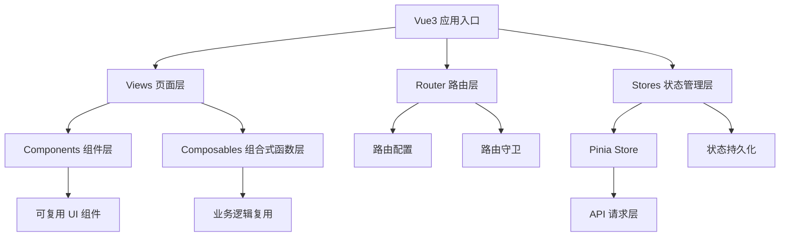
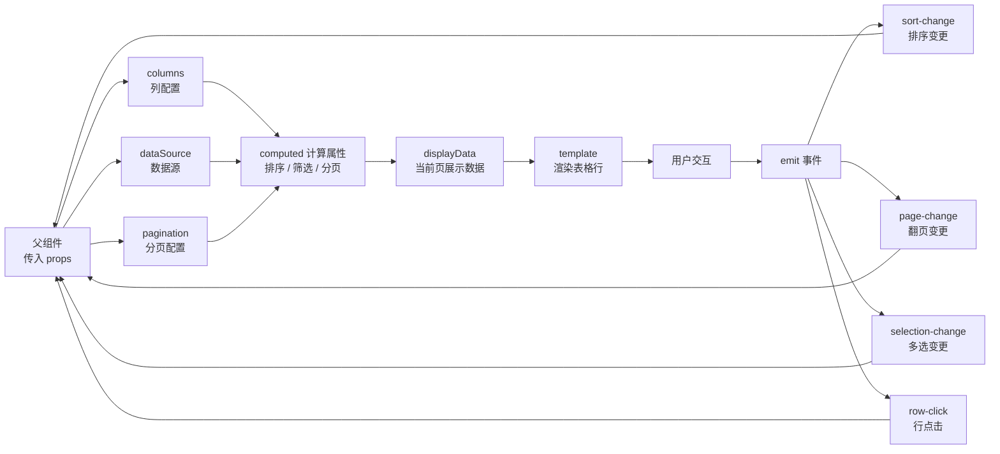

# Vue3 - 综合场景串联

---

## 场景一：实现Vue3 + Vite 项目

### 场景描述
从零搭建一个Vue3 + Vite + TypeScript + Pinia + Vue Router的前端项目，实现用户登录、权限路由、商品列表展示和购物车功能。要求使用Composition API、状态管理、路由守卫和API封装。

**Vue3 + Pinia + VueRouter 项目分层结构图：**



> Vue3 项目采用分层架构：页面层（Views）负责组装，组件层（Components）负责 UI 渲染，状态管理层（Stores）通过 Pinia 管理全局状态，路由层（Router）控制页面导航与权限守卫。

### 涉及知识点
- [Vue3核心语法](./01-Vue3核心语法.md)：Composition API、响应式、组件通信
- [响应式与编译优化](./02-响应式与编译优化.md)：ref、reactive、computed、watchEffect
- [路由与状态管理](./03-路由与状态管理.md)：Vue Router、Pinia、路由守卫

### 协作流程
1. 使用 `pnpm create vite` 创建Vue3 + TypeScript项目，安装pinia、vue-router、axios
2. 配置Vite：设置路径别名(@)、代理配置、环境变量
3. 搭建路由结构：登录页、首页、商品列表、购物车、404页面
4. 实现路由守卫：beforeEach检查登录状态，未登录跳转登录页，根据角色动态添加路由
5. 使用Pinia管理登录状态：token存储、用户信息、登录/登出方法
6. 封装axios实例：请求拦截器添加token，响应拦截器处理401和错误
7. 编写Composition API：使用useLogin组合式函数封装登录逻辑
8. 商品列表：使用computed过滤和排序商品，使用watch监听路由参数变化
9. 购物车：使用Pinia管理购物车状态，使用computed计算总价

### 关键要点
- 目录结构：src/api（接口）、src/stores（状态管理）、src/composables（组合式函数）、src/views（页面）、src/components（组件）
- 环境变量：使用Vite的import.meta.env获取环境变量，.env文件区分环境
- 权限控制：前端路由守卫+后端接口权限双重校验
- 代码规范：ESLint + Prettier + Husky + lint-staged 保证代码质量
- 构建优化：路由懒加载、组件按需加载、生产环境去除console

---

## 场景二：实现一个可复用的表格组件

### 场景描述
使用Vue3 Composition API实现一个功能完善的表格组件，支持分页、排序、筛选、多选、自定义列、空状态和加载状态。使用props传递配置，emit触发事件，使用slot支持自定义渲染。

### 涉及知识点
- [Vue3核心语法](./01-Vue3核心语法.md)：props、emit、slot、v-model
- [响应式与编译优化](./02-响应式与编译优化.md)：computed、watch、v-memo
- [路由与状态管理](./03-路由与状态管理.md)：Pinia状态管理

### 协作流程
1. 定义props接口：columns（列配置）、dataSource（数据源）、pagination（分页配置）、loading（加载状态）
2. 使用computed计算当前页数据，支持前端分页和后端分页两种模式
3. 实现排序功能：点击列头触发排序，使用computed对数据排序
4. 实现筛选功能：每列可配置筛选器，使用watch监听筛选条件变化
5. 实现多选功能：使用v-model绑定已选行，支持全选/取消全选
6. 使用slot实现自定义列渲染：具名插槽匹配列key，作用域插槽传递行数据
7. 使用v-memo优化表格行渲染，避免无关数据变化导致重渲染
8. 添加空状态：无数据时显示空状态组件，加载中显示loading组件
9. 使用expose暴露表格实例方法：clearSelection、refresh、scrollTo

### 关键要点
- 类型安全：使用TypeScript泛型定义表格数据类型，保证类型安全
- 性能优化：使用v-memo减少不必要的渲染，使用shallowRef优化大数据量
- 双向绑定：使用defineModel或v-model支持已选行双向绑定
- 组件通信：使用provide/inject向深层子组件传递表格上下文
- 可访问性：添加ARIA属性，支持键盘导航，符合WCAG标准
- 使用虚拟列表处理大数据量场景，仅渲染可视区域的行

**ProTable 组件数据流图：**



> **生活类比**：Pinia 就像公司公告栏——任何人（任何组件）都可以去看公告栏上的信息（读取 state），有权限的人可以更新公告（修改 state），而且更新后所有看公告栏的人都能立刻看到最新内容（响应式更新）。

---

## 完整可运行示例：Vue3 + Vite 项目初始化代码

```typescript
// ==================== Vue3 + Vite 项目初始化代码 ====================
// 场景：从零搭建一个 Vue3 + Vite + TypeScript + Pinia + Vue Router 前端项目

// ==================== 1. vite.config.ts —— Vite 构建配置 ====================
// 文件路径：vite.config.ts（项目根目录）
import { defineConfig, loadEnv } from 'vite';
import vue from '@vitejs/plugin-vue';
import { resolve } from 'path';

/**
 * Vite 配置文件
 * 文档：https://vitejs.dev/config/
 * 使用 defineConfig 工具函数获得类型提示
 */
export default defineConfig(({ mode }) => {
  // 加载对应模式的环境变量（.env.development / .env.production）
  const env = loadEnv(mode, process.cwd(), '');

  return {
    // 插件列表
    plugins: [vue()],

    // 路径别名配置 —— 避免使用深层相对路径 import
    resolve: {
      alias: {
        '@': resolve(__dirname, 'src'),           // @ 指向 src 目录
        '@components': resolve(__dirname, 'src/components'),
        '@views': resolve(__dirname, 'src/views'),
        '@stores': resolve(__dirname, 'src/stores'),
        '@api': resolve(__dirname, 'src/api'),
        '@utils': resolve(__dirname, 'src/utils'),
        '@types': resolve(__dirname, 'src/types'),
      },
    },

    // 开发服务器配置
    server: {
      port: 3000,              // 开发服务器端口
      open: true,              // 启动时自动打开浏览器
      // 代理配置 —— 解决开发环境跨域问题
      proxy: {
        '/api': {
          // 后端接口地址
          target: env.VITE_API_BASE_URL || 'http://localhost:8080',
          changeOrigin: true,   // 修改请求头中的 origin 为目标地址
          // 如果后端接口路径本身包含 /api 前缀，则不需要 rewrite
          // rewrite: (path) => path.replace(/^\/api/, ''),
        },
      },
    },

    // 生产构建配置
    build: {
      outDir: 'dist',           // 输出目录
      sourcemap: false,         // 生产环境不生成 sourcemap
      // 代码分割策略 —— 将大型依赖拆分为独立 chunk
      rollupOptions: {
        output: {
          manualChunks: {
            'vue-vendor': ['vue', 'vue-router', 'pinia'],  // Vue 全家桶
            'ui-vendor': ['element-plus'],                   // UI 组件库
          },
        },
      },
    },
  };
});

// ==================== 2. 路由配置 —— src/router/index.ts ====================
// 文件路径：src/router/index.ts

import { createRouter, createWebHistory, type RouteRecordRaw } from 'vue-router';
import { useAuthStore } from '@/stores/auth';

/**
 * 路由配置表
 * 使用路由懒加载（动态 import）优化首屏加载速度
 * meta 字段存放路由元信息，常用于权限控制和面包屑
 */
const routes: RouteRecordRaw[] = [
  {
    path: '/',
    redirect: '/dashboard', // 根路径重定向到首页
  },
  {
    path: '/login',
    name: 'Login',
    component: () => import('@/views/Login.vue'), // 路由懒加载
    meta: { title: '登录', requiresAuth: false },
  },
  {
    path: '/dashboard',
    name: 'Dashboard',
    component: () => import('@/views/Dashboard.vue'),
    meta: { title: '首页', requiresAuth: true },
  },
  {
    path: '/products',
    name: 'ProductList',
    component: () => import('@/views/ProductList.vue'),
    meta: { title: '商品列表', requiresAuth: true },
  },
  {
    path: '/products/:id',   // 动态路由参数
    name: 'ProductDetail',
    component: () => import('@/views/ProductDetail.vue'),
    meta: { title: '商品详情', requiresAuth: true },
  },
  {
    path: '/cart',
    name: 'Cart',
    component: () => import('@/views/Cart.vue'),
    meta: { title: '购物车', requiresAuth: true },
  },
  {
    // 通配符路由 —— 匹配所有未定义路径，显示 404 页面
    path: '/:pathMatch(.*)*',
    name: 'NotFound',
    component: () => import('@/views/NotFound.vue'),
    meta: { title: '404', requiresAuth: false },
  },
];

// 创建路由实例
const router = createRouter({
  history: createWebHistory(import.meta.env.BASE_URL), // HTML5 History 模式
  routes,
  // 滚动行为：切换路由时回到页面顶部
  scrollBehavior: () => ({ top: 0 }),
});

/**
 * 全局前置路由守卫 —— 权限控制的核心
 * 每次路由切换前触发，检查用户登录状态和页面权限
 */
router.beforeEach((to, from) => {
  // 动态设置页面标题
  document.title = `${to.meta.title || '管理系统'} | Vue3 Admin`;

  const authStore = useAuthStore();

  // 场景 1：目标页面需要登录，但用户未登录 → 跳转到登录页
  if (to.meta.requiresAuth && !authStore.isLoggedIn) {
    return {
      name: 'Login',
      query: { redirect: to.fullPath }, // 保存来源路径，登录成功后跳回
    };
  }

  // 场景 2：已登录用户访问登录页 → 重定向到首页
  if (to.name === 'Login' && authStore.isLoggedIn) {
    return { name: 'Dashboard' };
  }

  // 场景 3：正常访问 → 放行
  return true;
});

export default router;

// ==================== 3. Pinia Store 示例 —— src/stores/auth.ts ====================
// 文件路径：src/stores/auth.ts

import { defineStore } from 'pinia';
import { ref, computed } from 'vue';
import { loginApi, logoutApi, getUserInfoApi } from '@/api/auth';
import { setToken, getToken, removeToken } from '@/utils/token';

/** 用户信息类型 */
export interface UserInfo {
  id: number;
  username: string;
  nickname: string;
  avatar: string;
  roles: string[];
}

/**
 * 认证状态管理 Store
 * 使用 Composition API 风格（Setup Store）定义 Pinia Store
 * 管理用户登录状态、token、用户信息
 */
export const useAuthStore = defineStore('auth', () => {
  // ==================== 状态（State） ====================
  const token = ref<string>(getToken() || '');       // 登录令牌
  const userInfo = ref<UserInfo | null>(null);       // 用户信息

  // ==================== 计算属性（Getters） ====================
  const isLoggedIn = computed(() => !!token.value);  // 是否已登录
  const username = computed(() =>                     // 用户显示名称
    userInfo.value?.nickname || userInfo.value?.username || ''
  );
  const roles = computed(() => userInfo.value?.roles || []); // 用户角色列表

  // ==================== 方法（Actions） ====================

  /** 登录 */
  async function login(username: string, password: string) {
    try {
      // 调用登录接口，获取 token
      const res = await loginApi({ username, password });
      token.value = res.data.token;
      setToken(res.data.token); // 持久化存储 token

      // 登录成功后立即获取用户信息
      await fetchUserInfo();

      return true;
    } catch (error) {
      console.error('登录失败：', error);
      return false;
    }
  }

  /** 获取用户信息 */
  async function fetchUserInfo() {
    const res = await getUserInfoApi();
    userInfo.value = res.data;
  }

  /** 登出 */
  async function logout() {
    try {
      await logoutApi(); // 通知后端登出
    } finally {
      // 无论接口是否成功，都清除本地状态
      token.value = '';
      userInfo.value = null;
      removeToken();
    }
  }

  /** 检查是否拥有指定角色 */
  function hasRole(role: string): boolean {
    return roles.value.includes(role);
  }

  // 暴露给外部使用
  return {
    token,
    userInfo,
    isLoggedIn,
    username,
    roles,
    login,
    logout,
    fetchUserInfo,
    hasRole,
  };
});

// ==================== 4. Axios 请求封装 —— src/utils/request.ts ====================
// 文件路径：src/utils/request.ts

import axios, {
  type AxiosInstance,
  type AxiosRequestConfig,
  type AxiosResponse,
  type InternalAxiosRequestConfig,
} from 'axios';
import { useAuthStore } from '@/stores/auth';
import { getToken } from '@/utils/token';
import { ElMessage } from 'element-plus';

/** 统一的后端响应格式 */
export interface ApiResponse<T = any> {
  code: number;       // 业务状态码，200 表示成功
  data: T;            // 响应数据
  message: string;    // 提示信息
}

// 创建 axios 实例，配置基础参数
const service: AxiosInstance = axios.create({
  baseURL: import.meta.env.VITE_API_BASE_URL || '/api', // 基础请求路径
  timeout: 15000,      // 请求超时时间（毫秒）
  headers: {
    'Content-Type': 'application/json;charset=utf-8',
  },
});

// ==================== 请求拦截器 ====================
// 在每次请求发出前，自动添加 token 到请求头
service.interceptors.request.use(
  (config: InternalAxiosRequestConfig) => {
    const token = getToken();
    if (token && config.headers) {
      // 使用 Bearer Token 方式传递认证信息
      config.headers.Authorization = `Bearer ${token}`;
    }
    return config;
  },
  (error) => {
    console.error('请求错误：', error);
    return Promise.reject(error);
  }
);

// ==================== 响应拦截器 ====================
// 统一处理响应数据和错误
service.interceptors.response.use(
  (response: AxiosResponse<ApiResponse>) => {
    const { data } = response;

    // 业务状态码为 200 表示请求成功
    if (data.code === 200) {
      return data as any; // 返回解包后的数据，调用方无需再 .data
    }

    // 业务错误：显示后端返回的错误信息
    ElMessage.error(data.message || '请求失败');
    return Promise.reject(new Error(data.message || '请求失败'));
  },
  (error) => {
    // HTTP 错误处理
    if (error.response) {
      const { status } = error.response;

      switch (status) {
        case 401: // 未授权：token 过期或未登录
          const authStore = useAuthStore();
          authStore.logout();
          ElMessage.error('登录已过期，请重新登录');
          break;
        case 403: // 禁止访问：无权限
          ElMessage.error('没有权限访问该资源');
          break;
        case 404: // 资源不存在
          ElMessage.error('请求的资源不存在');
          break;
        case 500: // 服务器内部错误
          ElMessage.error('服务器内部错误');
          break;
        default:
          ElMessage.error(`请求失败（${status}）`);
      }
    } else if (error.code === 'ECONNABORTED') {
      // 请求超时
      ElMessage.error('请求超时，请稍后重试');
    } else {
      // 网络异常
      ElMessage.error('网络异常，请检查网络连接');
    }

    return Promise.reject(error);
  }
);

// ==================== 封装常用请求方法 ====================
// 对 axios 实例的进一步封装，提供泛型支持

export function get<T = any>(
  url: string,
  params?: Record<string, any>,
  config?: AxiosRequestConfig
): Promise<ApiResponse<T>> {
  return service.get(url, { params, ...config });
}

export function post<T = any>(
  url: string,
  data?: any,
  config?: AxiosRequestConfig
): Promise<ApiResponse<T>> {
  return service.post(url, data, config);
}

export function put<T = any>(
  url: string,
  data?: any,
  config?: AxiosRequestConfig
): Promise<ApiResponse<T>> {
  return service.put(url, data, config);
}

export function del<T = any>(
  url: string,
  config?: AxiosRequestConfig
): Promise<ApiResponse<T>> {
  return service.delete(url, config);
}

export default service;

// ==================== 5. API 接口示例 —— src/api/auth.ts ====================
// 文件路径：src/api/auth.ts
// 按业务模块拆分 API 接口文件，保持代码组织清晰

import { get, post } from '@/utils/request';
import type { UserInfo } from '@/stores/auth';

/** 登录请求参数 */
export interface LoginParams {
  username: string;
  password: string;
}

/** 登录响应 */
export interface LoginResult {
  token: string;
}

/** 登录接口 */
export function loginApi(data: LoginParams) {
  return post<LoginResult>('/auth/login', data);
}

/** 获取当前用户信息接口 */
export function getUserInfoApi() {
  return get<UserInfo>('/auth/userinfo');
}

/** 登出接口 */
export function logoutApi() {
  return post('/auth/logout');
}
```

---

## 常见错误

### 1. 在 setup 外使用 Pinia store 导致响应式丢失

```typescript
// ❌ 错误：在组件 setup 之外（如普通 .ts 工具文件）中调用 useStore
// file: src/utils/permission.ts
import { useAuthStore } from '@/stores/auth';

export function checkPermission() {
  // ❌ 在非 setup 上下文中调用 useStore，可能报错或拿到非响应式实例
  const authStore = useAuthStore();
  return authStore.roles.includes('admin');
}

// ✅ 正确：确保 Pinia 已注入后再调用 useStore
// 方式一：在组件内使用（推荐）
import { useAuthStore } from '@/stores/auth';

export function usePermission() {
  // ✅ 在 composable 函数中调用（运行时由组件 setup 调用）
  const authStore = useAuthStore();
  return computed(() => authStore.roles.includes('admin'));
}

// 方式二：在路由守卫中使用（此时 Pinia 实例已通过 app.use(pinia) 安装）
router.beforeEach((to, from) => {
  const authStore = useAuthStore(); // ✅ 路由守卫中调用是安全的
  if (to.meta.requiresAuth && !authStore.isLoggedIn) {
    return { name: 'Login' };
  }
});
```

**说明**：Pinia store 依赖 Vue 的 `provide/inject` 机制。在 Pinia 实例被 `app.use(pinia)` 安装之前，或在不属于 Vue 组件树的上下文中调用 `useXxxStore()`，会导致 store 实例未正确初始化，响应式特性丢失。必须确保在 `setup()` 函数、`<script setup>` 或路由守卫中调用。

### 2. 路由守卫中忘记调用 next() 或返回正确的值

```typescript
// ❌ 错误：混用 Vue Router 3 的 next() 和 Vue Router 4 的 return 语法
router.beforeEach((to, from, next) => {
  const authStore = useAuthStore();

  if (to.meta.requiresAuth && !authStore.isLoggedIn) {
    next('/login'); // 调用了 next()，但没有 return
    // ⚠️ 注意：调用了 next() 后不应有后续代码
  }
  // ❌ 没有 else 分支，也没有 return 或 next() —— 导航被挂起！
});

// ✅ 正确：Vue Router 4 推荐使用 return 语法
router.beforeEach((to, from) => {
  // 注意：Vue Router 4 中 beforeEach 的回调函数参数只有两个
  const authStore = useAuthStore();

  if (to.meta.requiresAuth && !authStore.isLoggedIn) {
    // ✅ 返回路由地址对象，表示重定向
    return { name: 'Login', query: { redirect: to.fullPath } };
  }

  // ✅ 返回 true 或 undefined 表示允许导航继续
  return true;
});
```

**说明**：Vue Router 3 中必须调用 `next()` 来确认导航，Vue Router 4 中推荐使用返回值（`return false` 取消导航，`return { name: '...' }` 重定向）。许多开发者在升级到 Vue Router 4 后仍然混用 `next()` 和 `return`，导致路由逻辑混乱或导航被意外挂起。

### 3. Vite 代理配置写错导致 API 请求 404

```typescript
// vite.config.ts

// ❌ 错误：代理配置不合理，导致请求路径错误
export default defineConfig({
  server: {
    proxy: {
      '/api': {
        target: 'http://localhost:8080',
        // ❌ 忘记设置 changeOrigin，后端可能因 Origin 校验拒绝请求
        // ❌ 后端接口路径已经是 /api/xxx，但 rewrite 把 /api 去掉了
        rewrite: (path) => path.replace(/^\/api/, ''),
      },
    },
  },
});

// 前端请求：axios.get('/api/users')
// 代理后实际请求：http://localhost:8080/users  （/api 被 rewrite 去掉了）
// 但后端实际接口路径可能是：http://localhost:8080/api/users  → 404！

// ✅ 正确：根据后端实际接口路径配置代理
export default defineConfig({
  server: {
    proxy: {
      '/api': {
        target: 'http://localhost:8080',
        changeOrigin: true, // ✅ 修改请求头 origin，防止后端校验拒绝
        // 如果后端接口路径前缀就是 /api，则不需要 rewrite
        // 如果后端接口路径没有 /api 前缀，才需要 rewrite 去掉它
      },
    },
  },
});

// 前端请求：axios.get('/api/users')
// 代理后实际请求：http://localhost:8080/api/users  → 正确匹配后端接口
```

**说明**：Vite 代理配置中最容易出错的是 `rewrite` 规则和 `changeOrigin` 选项。`rewrite` 用于重写请求路径，仅在前后端路径前缀不一致时使用；`changeOrigin` 用于修改请求头中的 `Origin` 字段为 `target` 地址，避免后端 Cors 校验拒绝。此外，修改 `vite.config.ts` 后需要重启 Vite 开发服务器才能生效。

### 4. 在 setup 中解构 props 导致响应式丢失

```vue
<script setup lang="ts">
import { computed, toRefs } from 'vue';

// ❌ 错误：Vue 3.4 及以下直接解构 props 会丢失响应性
// const { title, count } = defineProps<{ title: string; count: number }>();
// const doubleCount = count * 2; // ❌ 不会随 props.count 变化而更新

// ✅ 正确方式一（Vue 3.4 及以下）：使用 toRefs 保持响应性
const props = defineProps<{
  title: string;
  count: number;
}>();
const { title, count } = toRefs(props);
const doubleCount = computed(() => count.value * 2);

// ✅ 正确方式二（Vue 3.5+）：直接解构即可保持响应性，无需 toRefs
// const { title, count } = defineProps<{ title: string; count: number }>();
// const doubleCount = computed(() => count * 2); // ✅ 会随 props.count 变化
</script>
```

**说明**：在 Vue 3.5+ 的 `<script setup>` 中，`defineProps` 返回的 props 对象可以直接解构，解构后的变量会自动保持响应性。Vue 3.4 及以下版本需要使用 `toRefs()` 将 props 属性转换为 Ref 以保持响应性，或者始终通过 `props.xxx` 访问。这是一个非常常见的陷阱，尤其是在从 Options API 迁移到 Composition API 的过渡期。

---

> [返回模块目录](../README.md) | [返回知识导览](../知识导览.md)