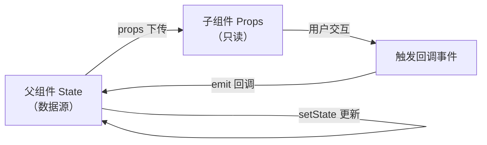
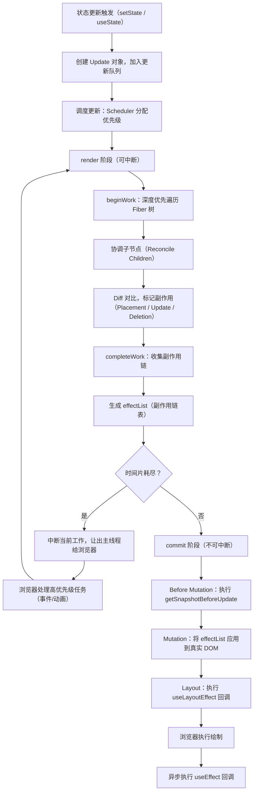
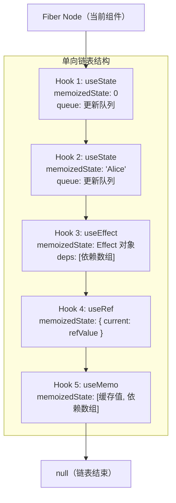

# React 核心与 Hooks

> 模块：06-react（第6周 React 19/20 生态）
> 本文带你深入理解 React 核心概念、Fiber 架构、Hooks 原理，构建扎实的 React 底层知识体系。
> 前置知识：[HTML核心与语义化](../01-html-css/01-HTML核心与语义化-导览.md)、[语法基础与执行机制](../02-javascript-core/01-语法基础与执行机制-导览.md)、[TypeScript基础与类型系统](../03-typescript/01-TypeScript基础与类型系统-导览.md)

---

## 一、核心概念

### 1.1 声明式编程

React 采用**声明式编程**范式，开发者只需描述"UI 应该是什么样子"，React 负责将描述转化为实际的 DOM 操作。

```jsx
// 声明式：描述 UI 状态
function Greeting({ name }) {
  return <h1>你好，{name}！</h1>;
}

// 对比命令式：逐步操作 DOM
const h1 = document.createElement('h1');
h1.textContent = `你好，${name}！`;
document.getElementById('root').appendChild(h1);
```

声明式的优势在于：当状态变化时，React 自动计算最小 DOM 更新，开发者无需手动管理 DOM 的增删改查。

> 📖 **参考链接**：
> - [React官方文档 - Thinking in React](https://react.dev/learn/thinking-in-react)

### 1.2 组件化

React 将 UI 拆分为独立、可复用的**组件**。每个组件封装自身的结构（JSX）、样式（CSS）和行为（逻辑）：

```jsx
// 函数组件
function Button({ onClick, children }) {
  return <button onClick={onClick}>{children}</button>;
}

// 组合使用
function App() {
  return (
    <div>
      <Button onClick={() => alert('点击了')}>点击我</Button>
    </div>
  );
}
```

组件化的核心价值：**高内聚、低耦合**，每个组件职责单一，便于开发、测试和维护。

### 1.3 单向数据流

React 中数据通过 **props** 从父组件向子组件单向传递。子组件不能直接修改 props，只能通过回调函数通知父组件更新状态：

**React 单向数据流示意图：**



> 上图展示了 React 单向数据流的核心约束：数据只能从父组件通过 props 向下传递，子组件无法直接修改父级数据，只能通过回调函数向上通知。这种单向约束让数据流向始终可追溯，避免了双向绑定带来的状态混乱问题。

```jsx
function Parent() {
  const [count, setCount] = useState(0);

  return <Child count={count} onIncrement={() => setCount(count + 1)} />;
}

function Child({ count, onIncrement }) {
  return (
    <div>
      <p>计数：{count}</p>
      <button onClick={onIncrement}>+1</button>
    </div>
  );
}
```

单向数据流让数据追踪变得简单，避免了双向绑定带来的数据流向混乱。

> 📖 **参考链接**：
> - [React官方文档 - Passing Props to a Component](https://react.dev/learn/passing-props-to-a-component)

---

## 二、底层原理

### 2.1 JSX 的本质

JSX 是 `React.createElement` 的**语法糖**。Babel 在编译时会将 JSX 转换为 JavaScript 函数调用：

```jsx
// 编写的 JSX
const element = <h1 className="title">Hello</h1>;

// Babel 编译后
const element = React.createElement('h1', { className: 'title' }, 'Hello');

// createElement 返回的虚拟 DOM 对象
{
  type: 'h1',
  props: {
    className: 'title',
    children: 'Hello'
  }
}
```

在 React 17+ 中，引入了新的 JSX 转换（`react/jsx-runtime`），不再需要手动引入 React：

```jsx
// React 17+ 新 JSX 转换
import { jsx as _jsx } from 'react/jsx-runtime';
const element = _jsx('h1', { className: 'title', children: 'Hello' });
```

### 2.2 虚拟 DOM

**虚拟 DOM**（Virtual DOM）是真实 DOM 的 JavaScript 对象表示。React 通过在内存中维护一棵虚拟 DOM 树，实现高效的 UI 更新。

> **生活化类比**：装修设计图——先在图纸上改（虚拟 DOM diff），确认无误后再动工（更新真实 DOM），避免反复拆墙造成浪费。React 的虚拟 DOM 就是这张"设计图"，先在内存里比对新旧差异，再一次性更新真实 DOM。

**对比真实 DOM 的优势**：

| 维度 | 真实 DOM | 虚拟 DOM |
|------|----------|----------|
| 操作成本 | 直接操作 DOM 开销大（重排/重绘） | JavaScript 对象操作，成本极低 |
| 更新策略 | 每次更新直接操作 DOM | 批量更新，Diff 后最小化 DOM 操作 |
| 跨平台 | 仅限浏览器 | 可渲染到不同平台（React Native、Canvas） |
| 性能优化 | 需手动优化 | 自动 Diff 计算最小变更 |

**工作流程**：
1. 状态变化时，生成新的虚拟 DOM 树
2. 通过 Diff 算法对比新旧虚拟 DOM 树
3. 计算出最小的 DOM 变更
4. 批量执行真实 DOM 操作

### 2.3 React 18 新特性

React 18 带来了多项重要更新，核心是**并发渲染**（Concurrent Rendering）：

**（1）并发特性（Concurrent Features）**

并发渲染让 React 可以"中断"渲染，优先处理更紧急的任务：

```jsx
import { useTransition, useDeferredValue } from 'react';

// useTransition：标记非紧急更新
function SearchPage() {
  const [isPending, startTransition] = useTransition();
  const [query, setQuery] = useState('');

  function handleChange(e) {
    // 紧急更新：输入框立即响应
    setQuery(e.target.value);
    // 非紧急更新：搜索结果可延迟
    startTransition(() => {
      setSearchResults(filterData(e.target.value));
    });
  }

  return (
    <div>
      <input value={query} onChange={handleChange} />
      {isPending && <p>搜索中...</p>}
      <SearchResults />
    </div>
  );
}

// useDeferredValue：延迟更新某个值
function List({ query }) {
  const deferredQuery = useDeferredValue(query);
  // 使用 deferredQuery 渲染列表，避免输入卡顿
  return <SlowList query={deferredQuery} />;
}
```

**（2）自动批处理（Automatic Batching）**

React 18 将所有状态更新自动批处理，减少不必要的重渲染：

```jsx
// React 17：只有事件处理函数中的更新会批处理
// setTimeout/Promise 中的更新不会批处理，每次 setState 触发一次渲染

// React 18：所有更新都自动批处理
function handleClick() {
  setCount(c => c + 1); // ─┐
  setFlag(f => !f);      // ─┤ 只触发一次渲染！
  setText('new');        // ─┘
}

// 即使在异步回调中也自动批处理
setTimeout(() => {
  setCount(c => c + 1); // ─┐
  setFlag(f => !f);      // ─┤ 也只触发一次渲染！
}, 1000);
```

**（3）Suspense 支持 SSR**

```jsx
import { Suspense } from 'react';

function App() {
  return (
    <Suspense fallback={<Loading />}>
      <Comments />
    </Suspense>
  );
}
```

**（4）新增 Hooks**

| Hook | 作用 |
|------|------|
| `useId` | 生成唯一 ID，支持服务端渲染 |
| `useTransition` | 标记非紧急更新，保持 UI 响应 |
| `useDeferredValue` | 延迟更新某个值 |
| `useSyncExternalStore` | 订阅外部 store |
| `useInsertionEffect` | 在 DOM 变更前执行（CSS-in-JS 场景） |

> 📖 **参考链接**：
> - [React官方文档 - useTransition](https://react.dev/reference/react/useTransition)
> - [React官方文档 - useDeferredValue](https://react.dev/reference/react/useDeferredValue)

### 2.4 Fiber 架构深度解析

**为什么需要 Fiber？**

React 15 使用 **Stack Reconciler**（栈调和器），采用递归方式遍历虚拟 DOM 树。递归过程**不可中断**，当组件树庞大时，一次完整的 Diff 可能耗时超过 16ms（60fps 的帧预算），导致主线程被阻塞，出现掉帧和卡顿。

**Fiber 解决的核心问题**：

| 问题 | Fiber 的解决方案 |
|------|-----------------|
| 长任务阻塞主线程 | 可中断的异步渲染（时间分片 Time Slicing） |
| 所有任务优先级相同 | 任务优先级调度（紧急更新优先） |
| 无法复用中间结果 | 保存工作进度，恢复时继续 |

**Fiber 节点结构**：

```javascript
// Fiber 节点的关键属性
{
  type: 'div',          // 组件类型（函数/类组件、原生标签等）
  key: null,            // 用于 Diff 算法中的节点标识
  child: Fiber,         // 第一个子节点
  sibling: Fiber,       // 下一个兄弟节点
  return: Fiber,        // 父节点
  stateNode: DOM节点,   // 对应的真实 DOM 节点
  alternate: Fiber,     // 指向另一棵树中对应的 Fiber 节点（双缓冲）
  // 副作用标记
  flags: Placement | Update | Deletion,
  // 待处理的更新队列
  updateQueue: [],
  // 备忘状态（Hooks 链表）
  memoizedState: null,
}
```

Fiber 树将传统的树形结构转换为**链表结构**（child/sibling/return），使得遍历过程可以随时中断和恢复。

**双缓冲机制**：

React 维护两棵 Fiber 树：
- **current 树**：当前屏幕上显示内容对应的 Fiber 树
- **workInProgress 树**：正在内存中构建的新 Fiber 树

两棵树通过 `alternate` 属性相互引用。当 workInProgress 树构建完成后，React 将其切换为新的 current 树，实现无缝更新。

**工作循环（Work Loop）**：

```
render 阶段（可中断）:
  遍历 Fiber 树 → 标记副作用（Placement/Update/Deletion）
  可以被更高优先级任务中断

commit 阶段（不可中断）:
  将标记的副作用应用到真实 DOM
  同步执行，保证 UI 一致性
```

时间分片的实现依赖于 React 的 Scheduler 包，底层使用 `MessageChannel` 实现任务调度（`requestIdleCallback` 仅作为备选方案，因其兼容性和稳定性问题）：
```javascript
// 简化的工作循环原理
// React Scheduler 使用 MessageChannel 模拟 requestIdleCallback
function workLoop(deadline) {
  let shouldYield = false;
  while (nextUnitOfWork && !shouldYield) {
    nextUnitOfWork = performUnitOfWork(nextUnitOfWork);
    shouldYield = deadline.timeRemaining() < 1;
  }
  // 通过 MessageChannel 注册下一轮任务
  scheduleNextWork();
}
```

**React Fiber 调度全流程**：



Fiber 架构将 React 的更新流程拆分为两个核心阶段：可中断的 **render 阶段**负责遍历 Fiber 树、协调子节点并生成副作用链表，利用时间分片（Time Slicing）机制保证高优先级任务（如用户输入）不被阻塞；不可中断的 **commit 阶段**负责将副作用批量应用到真实 DOM，保证 UI 一致性和生命周期钩子的正确执行顺序。

### 2.5 Hooks 原理

**为什么不能在条件语句中使用 Hooks？**

Hooks 依赖**调用顺序**来维护状态。React 内部使用**链表**存储每个 Hook 的状态：

```javascript
// React 内部简化的 Hooks 链表结构
{
  memoizedState: 0,          // 第一个 Hook 的状态（如 useState）
  next: {
    memoizedState: 'Alice',  // 第二个 Hook 的状态
    next: {
      memoizedState: [],     // 第三个 Hook 的状态（如 useEffect 的依赖）
      next: null
    }
  }
}
```

如果 Hook 在条件语句中调用，调用顺序会发生变化，导致状态错乱：

```jsx
// ❌ 错误：条件调用 Hook
function BadComponent({ condition }) {
  if (condition) {
    const [a, setA] = useState(0); // 有时调用，有时不调用
  }
  const [b, setB] = useState(0);   // 顺序错乱！
}

// ✅ 正确：始终按相同顺序调用
function GoodComponent({ condition }) {
  const [a, setA] = useState(0);
  const [b, setB] = useState(0);
  if (condition) {
    // 条件逻辑放在 Hook 调用之后
  }
}
```

**Fiber 节点中 Hooks 链表结构图**：



> 每个 Fiber 节点通过 `memoizedState` 字段指向一条**单向 Hooks 链表**，链表节点的 `next` 指针按调用顺序依次串联。React 在渲染时按顺序遍历链表读写状态，这就是为什么 Hooks 必须在函数顶层调用——一旦顺序变化，链表索引错位将导致状态读取错误。

**闭包陷阱**：

useEffect 中获取到的是**过期的 state**（闭包捕获的是渲染时的值）：

```jsx
function Counter() {
  const [count, setCount] = useState(0);

  useEffect(() => {
    const timer = setInterval(() => {
      console.log(count); // 始终打印 0！
      setCount(count + 1); // 始终是 0 + 1 = 1
    }, 1000);
    return () => clearInterval(timer);
  }, []);

  return <h1>{count}</h1>; // 首次渲染显示 0，之后始终显示 1
}
```

**解决方案**：使用函数式更新或 `useRef`：

```jsx
// 方案一：函数式更新（推荐）
setCount(c => c + 1);

// 方案二：useRef 保存最新值
const countRef = useRef(count);
countRef.current = count;
useEffect(() => {
  const timer = setInterval(() => {
    setCount(countRef.current + 1);
  }, 1000);
  return () => clearInterval(timer);
}, []);
```

**useState 实现原理**：

```javascript
// 简化版 useState 实现
let memoizedState = []; // 所有 Hook 的状态数组
let cursor = 0;         // 当前 Hook 的索引

function useState(initialValue) {
  const currentCursor = cursor;
  // 首次渲染时初始化状态
  memoizedState[currentCursor] = memoizedState[currentCursor] ?? initialValue;

  const setState = (newValue) => {
    memoizedState[currentCursor] = newValue;
    // 触发重新渲染
    render();
  };

  cursor++;
  return [memoizedState[currentCursor], setState];
}
```

**useEffect 实现原理**：

```javascript
// 简化版 useEffect 实现
let prevDeps = []; // 上一次的依赖数组

function useEffect(callback, deps) {
  const prevDep = prevDeps[cursor];
  const hasChanged = !prevDep || deps.some((dep, i) => dep !== prevDep[i]);

  if (hasChanged) {
    // 依赖变化，执行副作用
    callback();
  }

  prevDeps[cursor] = deps;
  cursor++;
}
```

**useLayoutEffect vs useEffect**：

| 特性 | useEffect | useLayoutEffect |
|------|-----------|-----------------|
| 执行时机 | 渲染完成后**异步**执行 | DOM 变更后**同步**执行 |
| 是否阻塞渲染 | 不阻塞 | 阻塞渲染 |
| 使用场景 | 数据请求、订阅、日志 | 读取 DOM 尺寸、避免闪烁 |
| 服务端渲染 | 不会执行 | 会触发警告 |

```jsx
// useLayoutEffect：避免闪烁
function Tooltip() {
  const ref = useRef();
  const [position, setPosition] = useState({ top: 0, left: 0 });

  useLayoutEffect(() => {
    // 在浏览器绘制前同步计算位置，避免闪烁
    const rect = ref.current.getBoundingClientRect();
    setPosition({ top: rect.bottom, left: rect.left });
  }, []);

  return <div ref={ref} style={{ top: position.top, left: position.left }}>提示</div>;
}
```

**useRef 的特性**：

useRef 返回一个可变对象，修改其 `.current` 属性**不会触发重渲染**：

```jsx
function Timer() {
  const timerRef = useRef(null);
  const countRef = useRef(0);

  const start = () => {
    countRef.current = 0;
    timerRef.current = setInterval(() => {
      countRef.current++;
      console.log(countRef.current); // 可以获取最新值，但不触发渲染
    }, 1000);
  };

  // 清理定时器
  useEffect(() => {
    return () => clearInterval(timerRef.current);
  }, []);

  return <button onClick={start}>开始</button>;
}
```

> 📖 **参考链接**：
> - [React官方文档 - Hooks](https://react.dev/reference/react/hooks)
> - [React官方文档 - State: A Component's Memory](https://react.dev/learn/state-a-components-memory)

### 2.6 useMemo 和 useCallback

**useMemo**：缓存**计算结果**，依赖不变时直接返回缓存值。

**useCallback**：缓存**函数引用**，依赖不变时返回同一个函数。

```jsx
function Parent() {
  const [count, setCount] = useState(0);
  const [text, setText] = useState('');

  // useMemo：缓存计算结果
  const expensiveValue = useMemo(() => {
    return computeExpensive(count); // 只有 count 变化时才重新计算
  }, [count]);

  // useCallback：缓存函数引用
  const handleClick = useCallback(() => {
    setCount(c => c + 1);
  }, []); // 函数引用始终不变

  return (
    <div>
      <p>{expensiveValue}</p>
      {/* Child 使用 React.memo，handleClick 引用不变时不会重渲染 */}
      <Child onClick={handleClick} />
    </div>
  );
}

const Child = React.memo(function Child({ onClick }) {
  console.log('Child 渲染');
  return <button onClick={onClick}>+1</button>;
});
```

**与 React.memo 配合使用**：

```jsx
// ❌ 问题：每次父组件渲染都创建新的函数引用，React.memo 失效
<Child onClick={() => setCount(c => c + 1)} />

// ❌ 问题：每次父组件渲染都创建新的对象引用，React.memo 失效
<Child style={{ color: 'red' }} />

// ✅ 解决方案：useCallback 缓存函数
const handleClick = useCallback(() => setCount(c => c + 1), []);

// ✅ 解决方案：useMemo 缓存对象
const style = useMemo(() => ({ color: 'red' }), []);
```

**三者对比**：

| API | 缓存内容 | 返回值 | 使用场景 |
|-----|---------|--------|---------|
| React.memo | 组件渲染结果 | 组件 | 避免 props 不变的子组件重渲染 |
| useMemo | 计算结果 | 值 | 昂贵的计算、缓存对象/数组 |
| useCallback | 函数引用 | 函数 | 传递给子组件的回调函数 |

---

## 三、实战应用

### 3.1 自定义 Hook 封装

```jsx
// useLocalStorage：封装 localStorage 操作
function useLocalStorage(key, initialValue) {
  const [value, setValue] = useState(() => {
    try {
      const item = localStorage.getItem(key);
      return item ? JSON.parse(item) : initialValue;
    } catch {
      return initialValue;
    }
  });

  useEffect(() => {
    localStorage.setItem(key, JSON.stringify(value));
  }, [key, value]);

  return [value, setValue];
}

// 使用
function App() {
  const [name, setName] = useLocalStorage('name', '匿名用户');
  return <input value={name} onChange={e => setName(e.target.value)} />;
}
```

### 3.2 并发特性实战

```jsx
function SearchApp() {
  const [query, setQuery] = useState('');
  const [isPending, startTransition] = useTransition();
  const [results, setResults] = useState([]);

  const handleChange = (e) => {
    const value = e.target.value;
    setQuery(value); // 输入框立即更新（紧急）

    startTransition(() => {
      // 搜索结果延迟更新（非紧急）
      setResults(filterHeavyData(value));
    });
  };

  return (
    <div>
      <input value={query} onChange={handleChange} />
      {isPending ? (
        <p>搜索中...</p>
      ) : (
        <ResultList results={results} />
      )}
    </div>
  );
}
```

---

## 四、常见面试题

**Q1：React 18 中 setState 是同步还是异步的？**

React 18 中，所有 setState 都是**异步批处理**的。在事件处理函数、setTimeout、Promise 等所有场景下，多次 setState 都会被合并为一次更新。React 18 引入了自动批处理（Automatic Batching），如果需要同步获取最新状态，可以使用 `flushSync`：

```jsx
import { flushSync } from 'react-dom';

flushSync(() => {
  setCount(c => c + 1);
});
// 此时 DOM 已更新
```

**Q2：Fiber 架构中 render 阶段和 commit 阶段的区别？**

render 阶段是**可中断**的，React 遍历 Fiber 树并标记副作用（增删改）；commit 阶段是**不可中断**的，React 将标记的副作用应用到真实 DOM。render 阶段可能被更高优先级任务打断并重新执行，而 commit 阶段保证 UI 一致性。

**Q3：如何避免 useEffect 中的闭包陷阱？**

三种方式：(1) 将依赖变量加入依赖数组；(2) 使用函数式更新 `setState(c => c + 1)`；(3) 使用 `useRef` 保存最新值。

---

## 五、避坑指南

| 常见错误 | 现象 | 原因 | 解决方案 |
|---------|------|------|---------|
| 在条件语句中使用 Hooks | 状态错乱，报错"渲染的 Hook 比预期少" | Hooks 依赖调用顺序，链表索引错位 | 始终在函数顶层调用 Hooks |
| useEffect 依赖数组遗漏 | 闭包捕获过期值，数据不更新 | 依赖数组不完整，effect 不会重新执行 | 使用 ESLint 规则 `react-hooks/exhaustive-deps` |
| useEffect 中直接使用 async 函数 | 控制台警告或清理函数失效 | useEffect 回调不能是 async（返回 Promise 而非清理函数） | 在 useEffect 内部定义 async 函数并调用 |
| useCallback 依赖空数组但内部使用了 state | 回调函数始终使用初始 state | 闭包捕获了初始值 | 将状态加入依赖数组，或使用函数式更新 |
| 滥用 useMemo 缓存简单计算 | 代码复杂，性能反而下降 | useMemo 本身有开销（比较依赖、存储缓存） | 仅对昂贵的计算使用 useMemo |
| 在 render 中创建新对象/函数 | 子组件 React.memo 失效 | 每次渲染都创建新引用，浅比较判定为"变化" | 使用 useMemo/useCallback 包裹 |
| useLayoutEffect 中执行耗时操作 | 页面渲染阻塞，长时间白屏 | useLayoutEffect 同步执行，阻塞渲染 | 耗时操作移到 useEffect 中 |
| Context 值变化导致全局重渲染 | 所有消费者都重渲染，性能差 | Context 值变化通知所有消费者 | 拆分 Context，或使用 useMemo 包裹 value |

---

## 补充：React Server Components（RSC）

### 背景与概念

React Server Components（RSC）在 React 18 中作为实验性功能引入，React 19 中正式稳定，是一种允许组件在**服务端**渲染而非浏览器中的新组件类型。与传统的客户端组件（Client Components）不同，RSC 在服务端执行完毕后，将渲染结果以特殊的 RSC Payload 格式流式传输到客户端，由 React 进行调和并更新 DOM。

**RSC 不是 SSR 的替代品，而是互补关系**：
- SSR（Server-Side Rendering）：在服务端将组件渲染为 HTML 字符串，发送到客户端后还需要"水合"（Hydration）
- RSC：在服务端渲染为特殊 JSON 格式的 RSC Payload，客户端直接使用，**不需要水合**

### 服务端组件 vs 客户端组件

| 特性 | 服务端组件（Server Components） | 客户端组件（Client Components） |
|------|-------------------------------|--------------------------------|
| 运行环境 | 服务端（Node.js / Edge Runtime） | 浏览器 |
| 交互能力 | 无（不能使用事件处理器） | 有（onClick、onChange 等） |
| 状态管理 | 无法使用 useState / useReducer | 可以使用所有 React Hooks |
| 副作用 | 无法使用 useEffect | 可以使用 useEffect |
| 浏览器 API | 不可用（localStorage、window 等） | 完全可用 |
| 数据访问 | 直接访问数据库、文件系统 | 通过 API 请求获取数据 |
| JS Bundle | 零（代码不发送到客户端） | 完整打包发送 |
| 渲染方式 | 异步渲染为 RSC Payload | 在浏览器中渲染 |

### `'use client'` 指令

`'use client'` 是一个边界标记指令，放置在任何文件的第一行，用于声明该文件及其所有导入的模块都是客户端组件：

```jsx
'use client';

import { useState } from 'react';

export default function Counter() {
  const [count, setCount] = useState(0);
  return <button onClick={() => setCount(c => c + 1)}>点击 {count} 次</button>;
}
```

**关键规则**：
- 在 RSC 环境中，默认所有组件都是服务端组件
- 只有添加了 `'use client'` 的组件（及其整个依赖子树）才会在客户端渲染
- 服务端组件**可以**导入客户端组件（渲染为占位符，客户端水合），但客户端组件**不能**直接导入服务端组件（只能通过 `children` props 接收）
- 服务端组件无法传递函数、类实例等不可序列化的值给客户端组件

### RSC 渲染流程

```
客户端发起请求
    ↓
服务端 RSC 渲染
    ├── 服务端组件：在服务端渲染为 RSC Payload（JSON 格式）
    ├── 客户端组件：标记为占位符，代码被打包到客户端
    └── 生成 RSC Payload 流
    ↓
流式传输到客户端
    ↓
React 客户端运行时
    ├── 解析 RSC Payload
    ├── 客户端组件在浏览器中渲染
    ├── 调和（Reconciliation）所有组件
    └── 更新 DOM
    ↓
页面完成渲染
```

> 📖 **参考链接**：
> - [React官方文档 - Server Components](https://react.dev/reference/rsc/server-components)

**RSC Payload 结构**（简化版）：
```json
[
  ["$", "div", null, {
    "children": [
      ["$", "h1", null, { "children": "Hello World" }],
      ["$", "@1", null, {}]  // 客户端组件占位符，引用 chunk #1
    ]
  }]
]
```

### 数据获取模式

RSC 最大的优势之一是**简化数据获取**。服务端组件可以直接使用 `async/await` 获取数据，无需 `useEffect`、`useState`、数据获取库：

```jsx
// 服务端组件：直接 async 函数
export default async function UserProfile({ userId }) {
  const user = await db.user.findUnique({ where: { id: userId } });
  const posts = await db.post.findMany({ where: { authorId: userId } });

  return (
    <div>
      <h1>{user.name}</h1>
      <PostList posts={posts} />
    </div>
  );
}
```

对比传统的客户端组件数据获取：

```jsx
// 客户端组件：需要 useEffect + useState
'use client';
import { useState, useEffect } from 'react';

export default function UserProfile({ userId }) {
  const [user, setUser] = useState(null);
  const [loading, setLoading] = useState(true);

  useEffect(() => {
    fetch(`/api/users/${userId}`)
      .then(res => res.json())
      .then(data => { setUser(data); setLoading(false); });
  }, [userId]);

  if (loading) return <Spinner />;
  return <div><h1>{user.name}</h1></div>;
}
```

**RSC 数据获取的优势**：
- 减少客户端 JS 体积：数据获取库不需要打包到浏览器
- 避免客户端-服务端瀑布请求：数据在服务端直接获取，无需额外的 API 请求
- 更好的安全性：数据库查询、Token 等敏感信息不暴露到客户端
- 自动代码分割：服务端组件零 JS Bundle

### 与 Next.js App Router 的集成

Next.js 13+ 的 App Router 是 RSC 的主要落地实践：

```
app/
├── layout.js          ← 服务端组件（默认）
├── page.js            ← 服务端组件（默认）
├── loading.js         ← 服务端组件
├── error.js           ← 客户端组件（隐式）
├── components/
│   ├── Navbar.js      ← 服务端组件（默认）
│   ├── SearchBox.js   ← 客户端组件（'use client'）
│   └── UserCard.js    ← 服务端组件（默认）
└── api/
    └── users/route.js ← API Route（非 RSC）
```

**关键约定**：
- App Router 中所有组件默认是服务端组件
- 需要通过 `'use client'` 显式声明客户端组件
- 服务端组件和客户端组件可以交错嵌套
- `layout.js` 和 `page.js` 默认是服务端组件，但可以通过 `'use client'` 改为客户端组件

### 使用限制与注意事项

1. **不能使用 Hooks**：`useState`、`useEffect`、`useContext`、`useReducer` 等在服务端组件中不可用
2. **不能使用事件处理器**：`onClick`、`onChange` 等需要用户交互的功能必须在客户端组件中
3. **不能使用浏览器 API**：`localStorage`、`sessionStorage`、`window`、`document` 等
4. **Props 必须可序列化**：传递给客户端组件的 props 必须是 JSON 可序列化的值（不能传递函数、类、Symbol 等）
5. **客户端组件中 import 的子组件自动成为客户端组件**：在 `'use client'` 文件中 import 的任何组件都会自动成为客户端组件，即使它没有被标记为 `'use client'`

### RSC 与现有概念的关系

| 概念 | 与 RSC 的关系 |
|------|--------------|
| SSR（服务端渲染） | 互补：SSR 生成 HTML，RSC 生成 RSC Payload；两者可在服务端同时使用 |
| SSG（静态站点生成） | RSC 可以静态渲染，输出为静态 RSC Payload，支持增量静态再生成（ISR） |
| Code Splitting（代码分割） | RSC 天然支持：服务端组件零 JS Bundle，客户端组件自动分割 |
| Streaming（流式渲染） | RSC 的 RSC Payload 支持流式传输，配合 Suspense 实现渐进式渲染 |
| Suspense | RSC 与 Suspense 无缝配合，异步服务端组件触发 Suspense fallback |

## 补充：React 19 新特性

React 19 于 2024 年 12 月正式发布，带来了多项重要新特性，涵盖异步数据获取、表单处理、Server Actions 等方面，进一步优化了开发者体验和应用性能。

### 1. `use()` API

`use()` 是 React 19 引入的一个全新 API，可以在渲染期间读取 Promise 和 Context。与 `useContext` 不同，`use()` 可以在条件语句和循环中调用，打破了 Hooks 的调用顺序限制。

**读取 Promise**：

```jsx
import { use, Suspense } from 'react';

async function fetchUser(id) {
  const res = await fetch(`/api/users/${id}`);
  return res.json();
}

function UserProfile({ userId }) {
  // use() 读取 Promise，在 resolve 之前会暂停渲染
  // 最近的 Suspense 边界会显示 fallback
  const user = use(fetchUser(userId));

  return (
    <div>
      <h1>{user.name}</h1>
      <p>{user.email}</p>
    </div>
  );
}

function App() {
  return (
    <Suspense fallback={<div>加载中...</div>}>
      <UserProfile userId={1} />
    </Suspense>
  );
}
```

**读取 Context**：

```jsx
import { use, createContext } from 'react';

const ThemeContext = createContext('light');

function ThemedButton() {
  const theme = use(ThemeContext);
  // 可以在条件语句中使用，打破了 Hooks 的限制
  if (theme === 'dark') {
    return <button className="dark-btn">深色按钮</button>;
  }
  return <button className="light-btn">浅色按钮</button>;
}
```

**`use()` 与 `useContext` 的对比**：

| 特性 | `use()` | `useContext()` |
|------|---------|---------------|
| 调用位置 | 可在条件语句、循环中调用 | 必须在函数顶层调用 |
| 读取 Promise | 支持 | 不支持 |
| 使用方式 | `use(SomeContext)` | `useContext(SomeContext)` |
| 渲染行为 | Promise 未 resolve 时暂停渲染 | 始终同步返回 |

### 2. `useOptimistic()` 乐观更新

`useOptimistic()` 允许在异步操作完成之前，立即更新 UI 显示预期的结果，提供即时反馈的体验。

```jsx
import { useOptimistic, useState, useRef } from 'react';

function MessageList() {
  const [messages, setMessages] = useState([
    { id: 1, text: '你好！', sending: false }
  ]);
  const formRef = useRef(null);

  // useOptimistic(currentState, updateFn)
  // 第一个参数是当前状态，第二个参数是乐观更新函数
  const [optimisticMessages, addOptimisticMessage] = useOptimistic(
    messages,
    (state, newMessage) => [
      ...state,
      { id: Date.now(), text: newMessage, sending: true } // 乐观添加
    ]
  );

  async function sendMessage(formData) {
    const text = formData.get('message');
    formRef.current.reset();

    // 立即添加乐观消息（UI 即时更新）
    addOptimisticMessage(text);

    // 实际发送请求
    const savedMessage = await fetch('/api/messages', {
      method: 'POST',
      body: JSON.stringify({ text })
    }).then(res => res.json());

    // 请求完成后，用真实数据替换乐观消息
    setMessages(prev => [...prev, { id: savedMessage.id, text, sending: false }]);
  }

  return (
    <div>
      <ul>
        {optimisticMessages.map(msg => (
          <li key={msg.id} style={{ opacity: msg.sending ? 0.6 : 1 }}>
            {msg.text}
            {msg.sending && <span>（发送中...）</span>}
          </li>
        ))}
      </ul>
      <form ref={formRef} action={sendMessage}>
        <input name="message" placeholder="输入消息" />
        <button type="submit">发送</button>
      </form>
    </div>
  );
}
```

**乐观更新的工作流程**：
1. 用户触发操作（如发送消息）
2. `addOptimisticMessage()` 立即更新乐观状态，UI 显示预期结果
3. 同时发起异步请求到服务端
4. 请求成功后，`setMessages()` 用真实数据替换乐观状态
5. 请求失败时，React 自动回滚乐观更新，恢复原始状态

### 3. `useActionState()` 和 `useFormStatus()`

React 19 为表单处理引入了两个专用 Hook，简化了表单状态管理和提交反馈。

**useActionState()**：管理表单 Action 的 state、pending 状态和错误处理。

```jsx
import { useActionState } from 'react';

// 表单 Action 函数（接收上一次 state 和 formData）
async function updateProfile(prevState, formData) {
  const name = formData.get('name');
  const email = formData.get('email');

  // 模拟表单验证
  if (!name || name.length < 2) {
    return { error: '姓名至少需要 2 个字符', success: false };
  }
  if (!email.includes('@')) {
    return { error: '请输入有效的邮箱地址', success: false };
  }

  try {
    await fetch('/api/profile', {
      method: 'PUT',
      body: JSON.stringify({ name, email })
    });
    return { error: null, success: true, message: '保存成功！' };
  } catch {
    return { error: '保存失败，请重试', success: false };
  }
}

function ProfileForm() {
  // useActionState(actionFn, initialState)
  const [state, formAction, isPending] = useActionState(updateProfile, {
    error: null,
    success: false,
    message: ''
  });

  return (
    <form action={formAction}>
      <div>
        <label>姓名：</label>
        <input name="name" defaultValue="张三" />
      </div>
      <div>
        <label>邮箱：</label>
        <input name="email" defaultValue="zhangsan@example.com" />
      </div>
      <button type="submit" disabled={isPending}>
        {isPending ? '保存中...' : '保存'}
      </button>
      {state.error && <p style={{ color: 'red' }}>{state.error}</p>}
      {state.success && <p style={{ color: 'green' }}>{state.message}</p>}
    </form>
  );
}
```

**useFormStatus()**：读取父级 `<form>` 的提交状态，适用于提取提交按钮为独立组件。

```jsx
import { useFormStatus } from 'react-dom';

// 独立的提交按钮组件
function SubmitButton() {
  const { pending, data, method, action } = useFormStatus();

  return (
    <button type="submit" disabled={pending}>
      {pending ? '提交中...' : '提交'}
    </button>
  );
}

function CommentForm() {
  async function submitComment(formData) {
    const content = formData.get('content');
    await fetch('/api/comments', {
      method: 'POST',
      body: JSON.stringify({ content })
    });
  }

  return (
    <form action={submitComment}>
      <textarea name="content" placeholder="写下你的评论..." />
      {/* useFormStatus 只能读取父级 <form> 的状态 */}
      <SubmitButton />
    </form>
  );
}
```

**`useActionState` vs `useFormStatus` 对比**：

| 特性 | `useActionState` | `useFormStatus` |
|------|-----------------|-----------------|
| 作用 | 管理表单 Action 的完整状态 | 读取父级 form 的提交状态 |
| 返回值 | `[state, formAction, isPending]` | `{ pending, data, method, action }` |
| 使用场景 | 需要管理表单数据和错误状态 | 提取提交按钮等子组件 |
| 依赖 | 独立使用 | 必须在 `<form>` 子组件中调用 |

### 4. Server Actions（`'use server'`）

Server Actions 是 React 19 引入的机制，允许在客户端组件中直接调用服务端函数，无需手动创建 API 路由。

**定义 Server Action**：

```jsx
// app/actions.js
'use server';

import { revalidatePath } from 'next/cache';

export async function createPost(formData) {
  const title = formData.get('title');
  const content = formData.get('content');

  // 直接在服务端操作数据库，无需 API 路由
  const post = await db.post.create({
    data: { title, content, authorId: getCurrentUser().id }
  });

  // 重新验证缓存
  revalidatePath('/posts');
  return post;
}

export async function deletePost(postId) {
  await db.post.delete({ where: { id: postId } });
  revalidatePath('/posts');
}
```

**在客户端组件中使用**：

```jsx
// app/posts/page.js
'use client';

import { useActionState } from 'react';
import { createPost, deletePost } from './actions';

export default function PostsPage({ posts }) {
  return (
    <div>
      <h1>文章列表</h1>

      {/* 表单 Action 调用 Server Action */}
      <form action={createPost}>
        <input name="title" placeholder="文章标题" required />
        <textarea name="content" placeholder="文章内容" required />
        <button type="submit">发布</button>
      </form>

      <ul>
        {posts.map(post => (
          <li key={post.id}>
            <h2>{post.title}</h2>
            {/* 通过 bind 传递额外参数 */}
            <form action={deletePost.bind(null, post.id)}>
              <button type="submit">删除</button>
            </form>
          </li>
        ))}
      </ul>
    </div>
  );
}
```

**非表单场景下调用 Server Action**：

```jsx
'use client';
import { useState, useTransition } from 'react';
import { createPost } from './actions';

export default function CreatePostButton() {
  const [isPending, startTransition] = useTransition();

  function handleClick() {
    startTransition(async () => {
      const formData = new FormData();
      formData.append('title', '新文章');
      formData.append('content', '文章内容...');
      const result = await createPost(formData);
      console.log('创建成功：', result);
    });
  }

  return (
    <button onClick={handleClick} disabled={isPending}>
      {isPending ? '创建中...' : '创建文章'}
    </button>
  );
}
```

**Server Actions 的核心优势**：
- **零 API 层**：无需手动编写 REST API 路由，直接调用服务端函数
- **渐进式增强**：表单在 JavaScript 加载前即可提交（原生 form action）
- **类型安全**：服务端函数可以直接共享 TypeScript 类型
- **自动处理 CSRF**：React 自动为表单添加安全令牌

### 5. React 19 与 React 18 对比

| 特性 | React 18 | React 19 |
|------|---------|---------|
| 异步数据获取 | 需要 useEffect + useState 组合 | `use()` 直接读取 Promise，配合 Suspense |
| 乐观更新 | 需要手动实现（useState + try/catch） | `useOptimistic()` 内置支持，自动回滚 |
| 表单处理 | 手动管理 onSubmit + useState | `useActionState()` + `useFormStatus()` 声明式管理 |
| 服务端函数调用 | 需要手动创建 API 路由 | Server Actions（`'use server'`）直接调用 |
| Context 读取 | `useContext()`，必须在顶层调用 | `use()` 可读取 Context 和 Promise，可在条件语句中使用 |
| 水合（Hydration） | 完整水合，可能产生不匹配警告 | 改进的错误报告，水合不匹配只报错不恢复 |
| ref 转发 | `forwardRef` 包裹组件 | ref 直接作为 prop 传递，无需 forwardRef |
| Document Metadata | 需要 react-helmet 等第三方库 | 内置 `<title>`、`<meta>`、`<link>` 组件 |
| 资源预加载 | 手动使用 `<link rel="preload">` | 内置 `preload()`、`preconnect()`、`prefetchDNS()` API |
| 样式支持 | 需要第三方 CSS-in-JS 库 | 内置 `precedence` 属性管理样式优先级 |
| React 19.2 新特性 | 无 | useEffectEvent、React Performance Tracks、View Transitions |

**React 19/20 升级建议**：
- 新项目直接使用 React 20，充分利用编译器自动优化和新特性
- 现有 React 18/19 项目可逐步迁移，React 20 保持了良好的向后兼容性
- 重点关注 React Compiler 自动优化、`use()` Hook、React Foundation 治理模式
- 表单场景优先使用 `useActionState()` + `useFormStatus()` 替代手动状态管理

---
> **学习导航**：
> - 返回 [学习路线总览](../README.md)
> - 本模块原理文件：[02-Diff算法与性能优化](./02-Diff算法与性能优化.md) | [03-路由与状态管理](./03-路由与状态管理.md)
> - 实战应用：[企业后台管理系统](../10-project/01-企业后台管理系统实战.md)
> - 笔面试题集：[04-React笔面试题集](./04-React笔面试题集.md)

---
## 本章学习自检

- [ ] 理解 React 声明式编程、组件化、单向数据流的核心理念
- [ ] 能解释 JSX 的本质和 Babel 编译转换过程
- [ ] 理解虚拟 DOM 的工作流程和优势
- [ ] 掌握 React 18 的新特性：并发渲染、自动批处理、新 Hooks
- [ ] 能画出 Fiber 节点结构并解释双缓冲机制
- [ ] 理解 render 阶段（可中断）和 commit 阶段（不可中断）的区别
- [ ] 能解释为什么 Hooks 不能在条件语句中使用
- [ ] 能识别并解决 useEffect 闭包陷阱
- [ ] 掌握 useMemo / useCallback / React.memo 的区别和使用场景
- [ ] 了解 useLayoutEffect 和 useEffect 的执行时机差异
- [ ] 掌握 React 19 新特性：`use()`、`useOptimistic()`、`useActionState()`、`useFormStatus()`、Server Actions
- [ ] 能说出 React 19 相比 React 18 的 10 项关键改进
- [ ] 了解 React 20 核心特性：全场景自动批处理、`use()` 正式版、编译器自动优化
- [ ] 理解 React Compiler 的工作原理和自动优化策略
- [ ] 了解 React Foundation 的治理模式和影响

---

## 补充：React 19.2 关键新特性（2025 年 10 月发布）

> 注：Activity 组件已于 React 19 中引入，React 19.2 中进一步增强了其与 View Transitions 的集成。

| 特性 | 说明 | 示例 |
|------|------|------|
| **useEffectEvent** | 访问最新 props/state 但不触发重新执行 effect | 解决 effect 中需要最新值但不想依赖变化的问题 |
| **React Performance Tracks** | 内置性能追踪 API，替代 Lighthouse 手动测试 | 框架级性能指标收集和报告 |
| **View Transitions API** | 内置视图过渡动画支持 | 页面切换的平滑过渡效果（需浏览器支持） |

```jsx
// Activity 组件示例
import { Activity } from 'react';

function App() {
  const [isActive, setIsActive] = useState(true);
  return (
    <Activity>
      {isActive ? <ActiveView /> : null}
    </Activity>
  );
}

// useEffectEvent 示例
import { useEffectEvent } from 'react';

function Chatroom({ roomId }) {
  const onMessage = useEffectEvent((message) => {
    // 始终能访问最新的 roomId，但不会因为 roomId 变化重新连接
    sendMessage(roomId, message);
  });

  useEffect(() => {
    const connection = connect(roomId);
    connection.onMessage(onMessage);
    return () => connection.disconnect();
  }, [roomId]); // 仅 roomId 变化时重新连接
}
```

### React Compiler v1.0（2025 年 10 月发布）

React Compiler（原名 React Forget）是 React 官方推出的自动优化编译器，在编译阶段自动插入 `useMemo`、`useCallback`、`React.memo` 等优化，开发者无需手动编写这些优化代码。

```jsx
// 编译前：开发者编写的代码
function ProductList({ products, discount }) {
  const total = products.reduce((sum, p) => sum + p.price, 0) * discount;
  return (
    <ul>
      {products.map(p => <li key={p.id}>{p.name}</li>)}
    </ul>
  );
}

// 编译后：React Compiler 自动优化（等价于）
// function ProductList({ products, discount }) {
//   const total = useMemo(() =>
//     products.reduce((sum, p) => sum + p.price, 0) * discount,
//   [products, discount]);
//   return (
//     <ul>
//       {useMemo(() => products.map(p =>
//         <li key={p.id}>{p.name}</li>
//       ), [products])}
//     </ul>
//   );
// }
```

**核心特点**：
- **零配置**：安装后自动生效，无需手动标记
- **遵循 React 规则**：编译器会检查 Hooks 规则和纯函数规则
- **可选采用**：可以逐步在项目中启用，不影响现有代码

### React Foundation（2026 年 2 月成立）

React Foundation 于 2026 年 2 月正式成立，由 **Linux Foundation** 托管，标志着 React 从一个由 Meta 主导的开源项目转向了社区驱动的治理模式。这类似于 Node.js 从 Joyent 转移到 OpenJS Foundation 的过程。

**影响**：
- 治理去中心化：决策权从 Meta 分散到社区成员
- 长期稳定性：减少单一公司对 React 发展方向的控制
- 生态信心：更多企业愿意深度参与 React 生态建设

### CRA 废弃说明

Create React App (CRA) 已于 2025 年 2 月被 React 官方标记为废弃，不再推荐用于新项目。

**推荐替代方案**：
- **Vite + React**：最轻量的 SPA 方案，构建速度极快
- **Next.js**：全栈 React 框架，支持 SSR/SSG/ISR/RSC
- **Remix**：专注于 Web 标准的全栈框架
- **TanStack Start**：新兴的 React 全栈框架

---

## React 20 新特性（2026 年 3 月发布）

React 20 于 2026 年 3 月正式发布，是继 React 19 之后的又一重大版本。核心聚焦于**编译器深度集成**、**全场景自动优化**和**开发者体验提升**。

### 1. React Compiler 默认集成

React Compiler（原 React Forget）在 React 20 中成为默认集成的编译器，**自动在编译时为所有组件注入优化**。开发者无需手动编写 `useMemo`、`useCallback`、`React.memo`：

```jsx
// React 20 之前：手动优化
function ProductList({ products, discount }) {
  const total = useMemo(() =>
    products.reduce((sum, p) => sum + p.price, 0) * discount,
  [products, discount]);

  return (
    <ul>
      {products.map(p => <li key={p.id}>{p.name}</li>)}
    </ul>
  );
}

// React 20：编译器自动优化，无需手动 useMemo/useCallback/memo
function ProductList({ products, discount }) {
  const total = products.reduce((sum, p) => sum + p.price, 0) * discount;
  return (
    <ul>
      {products.map(p => <li key={p.id}>{p.name}</li>)}
    </ul>
  );
}
// 编译器自动为 total 和 products.map 注入缓存，等价于手动优化版本
```

**关键特性**：
- **零侵入**：编译器在编译时自动分析并优化，开发者无需修改代码
- **规则检查**：编译器会检查 Hooks 调用规则和纯函数规则，违反时给出编译警告
- **可配置**：可通过 ESLint 插件配置优化策略，对特定组件禁用自动优化

### 2. `use()` Hook

`use()` 是 React 19 引入的特殊 Hook，可以读取 Promise 或 Context。与普通 Hook 不同，`use()` 允许在条件语句中调用：

```jsx
import { use, Suspense } from 'react';

// 1. 读取 Promise（需要最近的 Suspense 边界兜底）
function UserProfile({ userId }) {
  // use() 读取 Promise 时会挂起（suspend），最近的 Suspense 边界会显示 fallback
  const user = use(fetchUser(userId));
  return <div>{user.name}</div>;
}

// 使用时需用 Suspense 包裹
function App() {
  return (
    <Suspense fallback={<div>加载中...</div>}>
      <UserProfile userId={1} />
    </Suspense>
  );
}

// 2. 条件读取 Context（use() 可在条件语句中调用）
function ThemedButton({ theme }) {
  if (theme === 'dark') {
    const darkConfig = use(DarkThemeContext);
    return <button style={darkConfig}>按钮</button>;
  }
  return <button>按钮</button>;
}

// 3. 组合使用
function Dashboard({ userId }) {
  const user = use(fetchUser(userId));
  const config = use(ConfigContext);
  return <div>{user.name} - {config.title}</div>;
}
```

### 3. React Compiler 深度集成

React 20 将 React Compiler 从可选插件升级为默认集成的编译器。这意味着所有组件都会自动获得 memoization 优化，无需开发者手动编写 `useMemo`、`useCallback` 或 `React.memo`。此外，编译器还增强了 Hooks 调用规则的静态检查，在编译时就能发现潜在的 Hooks 规则违规。

> **注意**：React 18 已通过 `createRoot` 支持全场景自动批处理（setTimeout/Promise/原生事件），这并非 React 20 新增特性。详见本文 2.3 节。

### 4. React 20 与 React 19 对比

| 特性 | React 19 | React 20 |
|------|---------|---------|
| 编译器 | React Compiler 可选安装 | React Compiler 默认集成 |
| 自动批处理 | 全场景（React 18 已支持） | 全场景（继承 React 18） |
| `use()` | 稳定 API | 稳定 API（继承 React 19） |
| 手动优化 | 仍需 useMemo/useCallback/memo | 编译器自动注入（可配置关闭） |
| 构建工具 | 兼容现有工具 | 推荐 Vite 8 / Next.js 16+ |
| 治理 | Meta 主导 | React Foundation（Linux Foundation 托管） |

### 5. 迁移指南

```bash
# 从 React 19 升级到 React 20
pnpm add react@20 react-dom@20

# 从 React 18 升级到 React 20
pnpm add react@20 react-dom@20 @types/react@20 @types/react-dom@20
```

**迁移步骤**：
1. 升级 `react` 和 `react-dom` 到 20.x
2. 移除手动的 `useMemo`、`useCallback`、`React.memo`（编译器自动处理）
3. 运行 React Compiler 的 ESLint 规则检查代码合规性