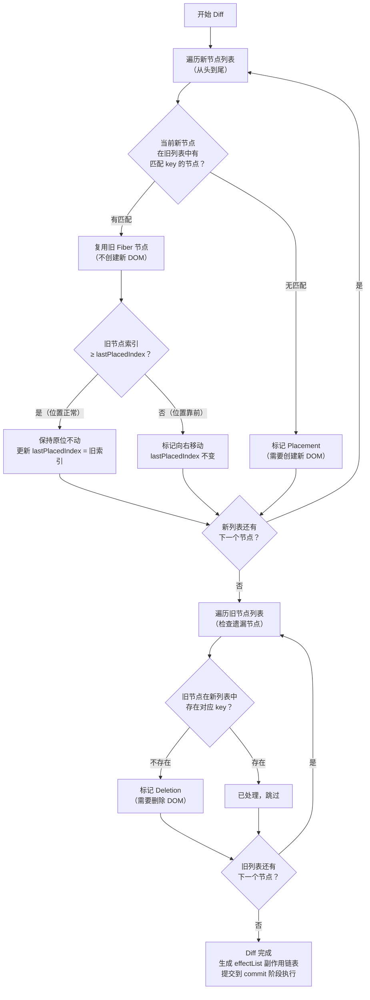

# Diff 算法与性能优化

> 模块：06-react（第6周 React 19/20 生态）
> 本文深入解析 React Diff 算法三大策略、调和过程（Reconciliation）以及全方位的性能优化手段。

---

## 一、核心概念

### 1.1 什么是 Diff 算法

React 在进行 UI 更新时，需要对比新旧虚拟 DOM 树的差异，找出最小的 DOM 操作。如果使用传统的树 Diff 算法（O(n^3) 复杂度），性能开销不可接受。React 基于三个前提假设，设计了 **O(n)** 复杂度的启发式 Diff 算法。

**三个前提假设**：
1. 同级比较：只对**同一层级**的节点进行比较，跨层级的移动视为删除+重建
2. 类型决定：不同类型的组件产生不同的树结构，直接替换
3. key 标识：通过 `key` 属性标识同一层级的子节点，判断是否可复用

### 1.2 调和（Reconciliation）

调和是 React 中"确定哪些部分需要更新"的过程。当组件的 state 或 props 变化时，React 会调用 `render` 方法生成新的虚拟 DOM 树，然后通过 Diff 算法与旧树对比，计算出需要执行的最小 DOM 操作。

---

## 二、底层原理

### 2.1 Diff 算法三大策略

**策略一：Tree Diff（树层级比较）**

React 只对**同一层级**的节点进行比较。如果发现节点跨层级移动，不会尝试复用，而是直接**删除原节点并在新位置创建新节点**。

```
旧树：                    新树：
  A                        A
 / \                      / \
B   C                    D   B
   / \                      / \
  D   E                    C   E

React 的做法：
- 层级2：B 没了，D 出现了 → 删除 B，创建 D（而非移动）
- 层级2：D 移走 → 删除 D；C 保留
- 跨层级移动代价高，开发时应避免
```

**开发建议**：避免频繁的节点跨层级移动，使用 CSS 的 `visibility` / `display` 控制显示隐藏，而非移除/添加 DOM 节点。

**策略二：Component Diff（组件比较）**

根据组件类型决定比较策略：
- **同类型组件**：继续比较子组件（即进行 Tree Diff）
- **不同类型组件**：直接删除旧组件，创建新组件（组件内部状态全部丢失）

```jsx
// 类型从 div 变为 span → 整个子树重建
{condition ? <div><Counter /></div> : <span><Counter /></span>}

// 开发建议：同类型组件切换时，内部状态会保留
{condition ? <Counter type="A" /> : <Counter type="B" />}
```

**策略三：Element Diff（元素比较）**

对于同一层级的子节点列表，React 通过 `key` 属性来识别节点是否可复用，执行移动、插入、删除操作。

**没有 key 的 Diff 过程**（简单遍历比较）：

```
旧列表：[A, B, C, D]
新列表：[B, A, D, C]

React 逐个比较：
index=0: A→B, 类型相同 → 原地更新 A 的内容为 B
index=1: B→A, 类型相同 → 原地更新 B 的内容为 A
index=2: C→D, 类型相同 → 原地更新 C 的内容为 D
index=3: D→C, 类型相同 → 原地更新 D 的内容为 C
结果：4次原地更新 = 4次操作（无法复用 DOM，性能不佳）
```

**有 key 的 Diff 过程**（三步骤：lastPlacedIndex 判断）：

```
旧列表：[{key:'A'}, {key:'B'}, {key:'C'}, {key:'D'}]
新列表：[{key:'B'}, {key:'A'}, {key:'D'}, {key:'C'}]

React 遍历新列表，在旧列表中查找匹配 key 的节点：
B: 旧索引=1, lastPlacedIndex=0, 1>=0 → 位置不动, lastPlacedIndex=1
A: 旧索引=0, lastPlacedIndex=1, 0<1   → 向右移动
D: 旧索引=3, lastPlacedIndex=1, 3>=1 → 位置不动, lastPlacedIndex=3
C: 旧索引=2, lastPlacedIndex=3, 2<3   → 向右移动
结果：2次移动操作（大幅优化！）

**React Diff 单次遍历流程图**：



> **生活类比**：
> - **Tree Diff（层级比较）**：就像搬家时只比较同一楼层的房间布局，不会跨楼层去找东西——React 只比较同一层级的节点，发现不同就直接替换整个子树，不做跨层级匹配。
> - **Component Diff（组件比较）**：就像公司换部门——如果直接换到另一个部门（不同组件类型），整个团队重建（重新渲染）；如果只是在同部门内调岗（同类型组件），保留人事档案（复用 DOM）继续用。
> - **Element Diff（元素比较，key 的作用）**：就像给每个员工发工牌——工位调整时凭工牌认人，不需要重新面试（重新渲染）。如果没发工牌（没有 key），就只能按顺序一个个对号入座，效率低还容易对错人。

> 📖 **参考链接**：
> - [React官方文档 - Render and Commit](https://react.dev/learn/render-and-commit)
> - [React官方文档 - memo](https://react.dev/reference/react/memo)

### 2.2 key 的作用和最佳实践

**key 的核心作用**：帮助 React 识别列表中的每个元素，判断元素是新增、删除还是移动。

**为什么不能用 index 作为 key？**

```jsx
// ❌ 使用 index 作为 key
const list = ['a', 'b', 'c'];

// 渲染为：
// <li key="0">a</li>
// <li key="1">b</li>
// <li key="2">c</li>

// 在头部插入一项：
const list = ['x', 'a', 'b', 'c'];

// 渲染为：
// <li key="0">x</li>  ← key=0 从 'a' 变成 'x'，React 认为内容变了
// <li key="1">a</li>  ← key=1 从 'b' 变成 'a'，React 认为内容变了
// <li key="2">b</li>  ← key=2 从 'c' 变成 'b'，React 认为内容变了
// <li key="3">c</li>  ← 新增

// 结果：3个节点被更新 + 1个新节点（而非 1次插入 + 3次不变）
```

**key 的最佳实践**：

| 场景 | 推荐的 key | 不推荐的 key |
|------|-----------|-------------|
| 数据有唯一 ID | `item.id` | `index` |
| 无唯一 ID | 生成全局唯一 ID（如 nanoid） | `index` |
| 静态列表（不会重排） | `index` 可接受 | 随机数 |
| 展示顺序不变的列表 | `index` 可接受 | `Math.random()` |

```jsx
// ✅ 正确做法
{items.map(item => (
  <ListItem key={item.id} data={item} />
))}

// ⚠️ 可接受（列表不会重排、增删、过滤）
{staticItems.map((item, index) => (
  <ListItem key={index} data={item} />
))}

// ❌ 绝对禁止
{items.map(item => (
  <ListItem key={Math.random()} /> // 每次渲染都生成新 key，全部重建
))}
```

### 2.3 调和（Reconciliation）工作流程

整个调和过程分为两个阶段，基于 Fiber 架构执行：

**render 阶段（可中断）**：

```
beginWork: 进入节点 → 对比新旧 props → 标记副作用 flags
  ↓
completeWork: 离开节点 → 创建/更新 DOM 节点
  ↓
  ... 遍历整棵 Fiber 树 ...
  ↓
生成 effectList（副作用链表，包含所有需要操作的节点）

**Fiber 树的链表结构**：

```
Fiber Node 节点结构：
┌──────────────────────────────────────────┐
│  Fiber Node                               │
│  ├─ tag: HostComponent (标识节点类型)       │
│  ├─ type: 'div' (对应的组件类型)            │
│  ├─ stateNode: 关联的真实 DOM 节点          │
│  ├─ return: 指向父 Fiber                    │
│  ├─ child: 指向第一个子 Fiber               │
│  ├─ sibling: 指向下一个兄弟 Fiber           │
│  ├─ alternate: 指向对应的旧 Fiber (双缓冲)   │
│  ├─ flags: 副作用标记 (Placement/Update/...) │
│  ├─ memoizedProps: 已生效的 props           │
│  └─ memoizedState: 已生效的 state           │
└──────────────────────────────────────────┘

Fiber 树形结构（通过 child → sibling 链表遍历）：

          App (Root Fiber)
            │
            └─ child ──→ Header
            │               │
            │               └─ sibling ──→ Main
            │               │                │
            │               │                └─ child ──→ Sidebar
            │               │                │               │
            │               │                │               └─ sibling ──→ Content
            │               │                │
            │               │                └─ sibling ──→ Footer
            │
            └─ 遍历规则：
               • 每个节点通过 child 指针进入子树
               • 通过 sibling 指针遍历同级节点
               • 通过 return 指针返回父节点
               • 深度优先遍历（先 child，再无 child 时 sibling，都无时 return）
```

> **生活化类比：整理书架** —— 把 Fiber 的时间切片想象成一个人整理书架：你有一个超大的书架需要重新排列（render 阶段）。你不能一口气整理完，否则累到没法做其他事（阻塞主线程）。所以你规定自己每次只整理 5 分钟（时间切片），然后起身看看有没有人敲门（检查是否有更高优先级任务，如用户点击响应）。如果没人敲门，就继续整理下一个 5 分钟。当书架全部整理完毕，你一次性把书搬到新位置（commit 阶段，不可中断）。这个过程中，你始终只有一个人（单线程），但通过"干一会儿歇一会儿"的方式，你不会错过任何敲门声。

副作用标记（flags）：
- `Placement`：需要插入新节点
- `Update`：需要更新节点属性
- `Deletion`：需要删除节点
- `ChildDeletion`：需要删除子节点

**commit 阶段（不可中断）**：

```
beforeMutation 子阶段：
  - 执行 getSnapshotBeforeUpdate 生命周期
  - 处理 DOM 节点删除前的清理工作

mutation 子阶段：
  - 根据 effectList 执行真实的 DOM 操作
  - 插入、更新、删除 DOM 节点

layout 子阶段：
  - 执行 componentDidMount / componentDidUpdate
  - 执行 useLayoutEffect 回调
  - DOM 更新完成，浏览器可以绘制
```

> 📖 **参考链接**：
> - [React官方文档 - Render and Commit](https://react.dev/learn/render-and-commit)

---

## 三、实战应用

### 3.1 性能优化手段

**（1）React.memo 浅比较跳过渲染**

```jsx
const ExpensiveChild = React.memo(function ExpensiveChild({ data }) {
  // 仅当 props.data 浅比较变化时才重新渲染
  return <div>{/* 复杂渲染 */}</div>;
});

// 自定义比较函数
const MemoChild = React.memo(Child, (prevProps, nextProps) => {
  return prevProps.id === nextProps.id; // 返回 true 表示相等，跳过渲染
});
```

**（2）useMemo 缓存计算结果**

```jsx
function ProductList({ products, filter }) {
  const filteredProducts = useMemo(() => {
    return products.filter(p => p.category === filter);
  }, [products, filter]); // 只有依赖变化才重新计算

  return filteredProducts.map(p => <ProductCard key={p.id} product={p} />);
}
```

**（3）useCallback 缓存函数引用**

```jsx
function Parent() {
  const [count, setCount] = useState(0);

  // 函数引用稳定，不会导致子组件不必要的重渲染
  const handleIncrement = useCallback(() => {
    setCount(c => c + 1);
  }, []);

  return <MemoChild onIncrement={handleIncrement} />;
}
```

**（4）React.lazy + Suspense 代码分割**

```jsx
import { lazy, Suspense } from 'react';

const HeavyComponent = lazy(() => import('./HeavyComponent'));

function App() {
  return (
    <Suspense fallback={<div>加载中...</div>}>
      <HeavyComponent />
    </Suspense>
  );
}
```

**（5）虚拟列表处理长列表**

```jsx
import { FixedSizeList } from 'react-window';

function LongList({ items }) {
  return (
    <FixedSizeList
      height={600}
      width="100%"
      itemCount={items.length}
      itemSize={50}
    >
      {({ index, style }) => (
        <div style={style}>{items[index].name}</div>
      )}
    </FixedSizeList>
  );
}
```

**（6）避免在 render 中创建新引用**

```jsx
// ❌ 不好：每次渲染都创建新对象/函数
function BadComponent() {
  return (
    <Child
      style={{ color: 'red' }}         // 新对象
      onClick={() => doSomething()}     // 新函数
      items={[1, 2, 3]}                // 新数组
    />
  );
}

// ✅ 好：使用 useMemo/useCallback 缓存
function GoodComponent() {
  const style = useMemo(() => ({ color: 'red' }), []);
  const onClick = useCallback(() => doSomething(), []);
  const items = useMemo(() => [1, 2, 3], []);

  return <Child style={style} onClick={onClick} items={items} />;
}
```

> 📖 **参考链接**：
> - [React官方文档 - Profiler](https://react.dev/reference/react/Profiler)

### 3.2 常见性能问题与解决

**问题一：Context 值变化导致所有消费者重渲染**

```jsx
// ❌ 问题：theme 或 user 任一变化，所有消费者都重渲染
const AppContext = createContext();

function AppProvider({ children }) {
  const [theme, setTheme] = useState('light');
  const [user, setUser] = useState(null);
  return (
    <AppContext.Provider value={{ theme, setTheme, user, setUser }}>
      {children}
    </AppContext.Provider>
  );
}

// ✅ 解决：拆分 Context
const ThemeContext = createContext();
const UserContext = createContext();

// 或者使用 useMemo 包裹 value
function AppProvider({ children }) {
  const [theme, setTheme] = useState('light');
  const [user, setUser] = useState(null);
  const value = useMemo(() => ({ theme, setTheme, user, setUser }), [theme, user]);
  return <AppContext.Provider value={value}>{children}</AppContext.Provider>;
}
```

**问题二：useEffect 依赖数组问题**

```jsx
// ❌ 死循环：每次渲染后 setCount 触发新渲染 → 无限循环
useEffect(() => {
  setCount(count + 1);
}, [count]);

// ✅ 使用函数式更新
useEffect(() => {
  setCount(c => c + 1);
}, []);

// ❌ 遗漏依赖：effect 中使用了 prop 但未加入依赖数组
useEffect(() => {
  console.log(props.name);
}, []); // 缺少 props.name

// ✅ 使用 ESLint 规则自动检测
useEffect(() => {
  console.log(props.name);
}, [props.name]);
```

> 📖 **参考链接**：
> - [React官方文档 - useTransition](https://react.dev/reference/react/useTransition)

### 3.3 性能优化检查清单

- [ ] 列表渲染是否使用了稳定的 key
- [ ] 是否对纯展示组件使用 React.memo
- [ ] 是否对传递给子组件的回调函数使用 useCallback
- [ ] 是否对昂贵的计算使用 useMemo
- [ ] 是否对大体积组件使用 React.lazy 懒加载
- [ ] 长列表是否使用虚拟滚动
- [ ] Context 是否拆分为多个独立的 Context
- [ ] 是否在 render 中创建了新的对象/函数/数组引用
- [ ] 是否使用 React DevTools Profiler 分析性能瓶颈

---

## 四、常见面试题

**Q1：React 的 Diff 算法为什么是 O(n) 复杂度？**

传统树 Diff 算法是 O(n^3)，React 通过三个前提假设将其优化为 O(n)：
1. 只比较同级节点（Tree Diff）
2. 不同类型组件直接替换（Component Diff）
3. 通过 key 标识节点复用（Element Diff）

**Q2：为什么列表渲染需要 key，且不能用 index？**

key 帮助 React 识别节点是否可复用。使用 index 作为 key 时，列表顺序变化会导致错误的 Diff 结果（如头部插入导致所有节点都"变化"），引发不必要的 DOM 更新和组件状态错乱。

**Q3：React.memo 和 useMemo 有什么区别？**

React.memo 是**高阶组件**，包裹整个组件，对 props 进行浅比较，控制是否跳过渲染。useMemo 是 **Hook**，在组件内部缓存计算结果，避免重复计算。

---

## 五、避坑指南

| 常见错误 | 现象 | 原因 | 解决方案 |
|---------|------|------|---------|
| 使用 index 作为 key | 列表重排时大量 DOM 更新，输入框内容错乱 | index 不稳定，顺序变化导致 key 对应关系错乱 | 使用数据唯一 ID 作为 key |
| 使用随机数作为 key | 每次渲染全部节点重建，性能极差 | key 每次变化，React 无法复用节点 | 使用稳定的唯一标识 |
| 在 render 中创建新对象/函数 | React.memo 子组件仍然重渲染 | 浅比较判断为新引用，始终认为 props 变化 | 使用 useMemo/useCallback 包裹 |
| 滥用 useMemo/useCallback | 代码可读性下降，内存开销增加 | 每个 memo 都需要存储缓存和比较依赖 | 仅在确实需要优化时使用 |
| Context 未拆分 | 全局状态中任一字段变化，所有消费者重渲染 | 所有消费者订阅同一个 Context | 按业务领域拆分多个 Context |
| useEffect 依赖数组不完整 | 闭包引用过期值，导致逻辑错误 | 内部使用的变量未声明为依赖 | 开启 ESLint 规则，诚实填写依赖 |
| 将整个组件树用 React.memo 包裹 | 比较开销超过渲染开销，得不偿失 | 浅比较本身也有开销 | 仅对渲染开销大的子组件使用 |
| 未使用生产模式构建 | 开发模式下 React 额外检查开销大 | 开发模式有额外的警告和严格模式 | 生产环境使用 `NODE_ENV=production` |

---

> **学习导航**：
> - 返回 [学习路线总览](../README.md)
> - 本模块原理文件：[01-React核心与Hooks](./01-React核心与Hooks.md) | [03-路由与状态管理](./03-路由与状态管理.md)
> - 实战应用：[企业后台管理系统](../10-project/01-企业后台管理系统实战.md)
> - 笔面试题集：[04-React笔面试题集](./04-React笔面试题集.md)

---

## 本章学习自检

- [ ] 理解 React Diff 算法的三大策略（Tree Diff / Component Diff / Element Diff）
- [ ] 能解释 key 的作用和为什么不能用 index 作为 key
- [ ] 能用 lastPlacedIndex 逻辑手推 Element Diff 过程
- [ ] 理解调和过程 render 阶段和 commit 阶段的区别
- [ ] 掌握 React.memo / useMemo / useCallback 的使用场景和区别
- [ ] 会使用 React.lazy + Suspense 实现代码分割
- [ ] 了解虚拟列表（react-window）的原理和使用
- [ ] 能识别并解决 Context 全局重渲染问题
- [ ] 能识别并解决 useEffect 依赖数组导致的死循环问题
- [ ] 掌握性能优化的检查清单