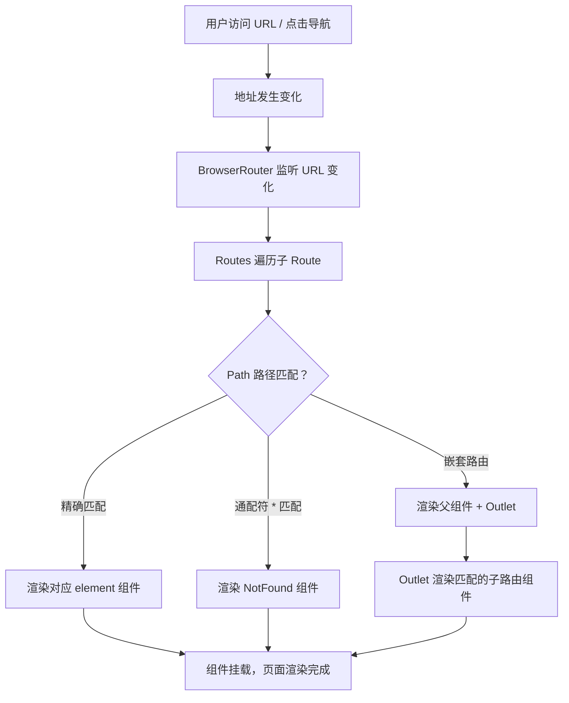

# 路由与状态管理

> 模块：06-react（第6周 React 19/20 生态）
> 本文涵盖 React Router v6 路由方案和 Redux / Zustand 等主流状态管理方案，帮助你选择合适的架构方案。

---

## 一、核心概念

### 1.1 前端路由的本质

前端路由的核心是**在不刷新页面的前提下，根据 URL 变化切换显示不同的页面内容**。这依赖于两个关键能力：

- **监听 URL 变化**：通过 History API 或 hashchange 事件
- **匹配路由规则**：根据 URL 路径渲染对应的组件

### 1.2 状态管理的必要性

当应用规模增长，组件间的状态共享变得越来越复杂。状态管理库提供：
- **单一数据源**：全局状态集中管理，避免 prop drilling
- **可预测的状态变化**：通过明确的 action/reducer 控制状态变更
- **状态与 UI 分离**：业务逻辑与视图解耦

---

## 二、底层原理

### 2.1 React Router v6 核心变化

React Router v6 带来了显著的 API 变化：

| v5 写法 | v6 写法 | 说明 |
|---------|---------|------|
| `<Switch>` | `<Routes>` | 路由匹配容器 |
| `<Route component={Home}>` | `<Route element={<Home />}>` | 使用 element 属性 |
| `useHistory()` | `useNavigate()` | 编程式导航 |
| `<Route children>` | 嵌套路由 + `<Outlet>` | 嵌套路由渲染 |
| `useRouteMatch()` | `useMatch()` | 路由匹配 Hook |
| `<Redirect>` | `<Navigate>` | 重定向组件 |
| `<Prompt>` | `useBlocker` | 路由拦截 |

**React Router 路由匹配流程图**：



> React Router v6 的路由匹配基于**路径模式匹配**算法，Routes 组件会遍历所有子 Route 并选择第一个匹配的路径。与 v5 的 Switch 不同，v6 的匹配顺序不再依赖书写顺序，而是智能选择最精确的匹配项，避免了因路由顺序不当导致的匹配错误。

**基本使用示例**：

```jsx
import { BrowserRouter, Routes, Route, Outlet, useNavigate, useParams } from 'react-router-dom';

function App() {
  return (
    <BrowserRouter>
      <Routes>
        <Route path="/" element={<Layout />}>
          {/* 嵌套路由 */}
          <Route index element={<Home />} />
          <Route path="about" element={<About />} />
          <Route path="users/:id" element={<UserDetail />} />
          <Route path="*" element={<NotFound />} />
        </Route>
      </Routes>
    </BrowserRouter>
  );
}

// Layout 组件使用 Outlet 渲染子路由
function Layout() {
  return (
    <div>
      <nav>导航栏</nav>
      <Outlet /> {/* 子路由在此渲染 */}
    </div>
  );
}

// 获取路由参数
function UserDetail() {
  const { id } = useParams();
  const navigate = useNavigate();

  return (
    <div>
      <p>用户 ID：{id}</p>
      <button onClick={() => navigate('/')}>返回首页</button>
    </div>
  );
}
```

**useRoutes 配置式路由**：

```jsx
import { useRoutes } from 'react-router-dom';

const routes = [
  {
    path: '/',
    element: <Layout />,
    children: [
      { index: true, element: <Home /> },
      { path: 'about', element: <About /> },
      { path: 'users/:id', element: <UserDetail /> },
      { path: '*', element: <NotFound /> },
    ],
  },
];

// 注意：useRoutes 必须用在 Router 组件内部（如 <BrowserRouter>）
function App() {
  return useRoutes(routes);
}
```

### 2.2 路由模式

**BrowserRouter（HTML5 History API）**：

```jsx
import { BrowserRouter } from 'react-router-dom';

// URL 形式：http://example.com/users/123
// 原理：使用 history.pushState / replaceState API
// 要求：服务器需要配置 fallback（所有路由返回 index.html）

// Nginx 配置示例：
// location / {
//   try_files $uri $uri/ /index.html;
// }
```

**HashRouter（Hash 模式）**：

```jsx
import { HashRouter } from 'react-router-dom';

// URL 形式：http://example.com/#/users/123
// 原理：监听 window.onhashchange 事件
// 优势：不需要服务器配置，兼容性好
// 缺点：URL 不美观，SEO 不友好
```

**两种模式对比**：

| 特性 | BrowserRouter | HashRouter |
|------|--------------|------------|
| URL 形式 | `/users/123` | `/#/users/123` |
| 实现原理 | History API | hashchange 事件 |
| 服务器配置 | 需要 | 不需要 |
| SEO | 友好 | 差（hash 部分不会被搜索引擎抓取） |
| 兼容性 | IE10+ | 全兼容 |

### 2.3 路由守卫实现

**高阶组件方式**：

```jsx
import { Navigate } from 'react-router-dom';

// 路由守卫：需要登录才能访问
function ProtectedRoute({ children }) {
  const isAuthenticated = useAuth(); // 自定义 Hook，检查登录状态

  if (!isAuthenticated) {
    // 未登录，重定向到登录页
    return <Navigate to="/login" replace />;
  }

  return children;
}

// 使用
function App() {
  return (
    <Routes>
      <Route path="/login" element={<Login />} />
      <Route
        path="/dashboard"
        element={
          <ProtectedRoute>
            <Dashboard />
          </ProtectedRoute>
        }
      />
    </Routes>
  );
}
```

**Hook 方式**：

```jsx
function useAuthGuard() {
  const navigate = useNavigate();
  const isAuthenticated = useAuth();

  useEffect(() => {
    if (!isAuthenticated) {
      navigate('/login', { replace: true });
    }
  }, [isAuthenticated, navigate]);
}
```

> 📖 **参考链接**：
> - [React Router 官方文档](https://reactrouter.com/)

### 2.4 Redux 工作流程

Redux 遵循严格的**单向数据流**：

```
┌─────────┐    dispatch(action)    ┌──────────┐
│  View   │ ─────────────────────→ │  Store   │
│  (UI)   │                        │          │
└─────────┘                        │  ┌─────┐ │
     ↑                             │  │Reducer│← 纯函数，生成新 state
     │  subscribe                  │  └─────┘ │
     │  重新渲染                   └──────────┘
```

**核心概念**：

| 概念 | 说明 | 示例 |
|------|------|------|
| Store | 全局唯一的状态容器 | `createStore(rootReducer)` |
| Action | 描述"发生了什么"的普通对象 | `{ type: 'ADD_TODO', payload: '学习' }` |
| Reducer | 纯函数，根据 action 返回新 state | `(state, action) => newState` |
| Dispatch | 发送 action 的唯一方式 | `store.dispatch(action)` |

**Redux 三大原则**：
1. **单一数据源**：整个应用只有一个 Store
2. **State 只读**：唯一改变 state 的方式是 dispatch action
3. **纯函数修改**：Reducer 必须是纯函数

### 2.5 Redux Toolkit（RTK）

Redux Toolkit 是 Redux 官方推荐的工具集，大幅简化了 Redux 的使用：

**createSlice**：

```javascript
import { createSlice } from '@reduxjs/toolkit';

const counterSlice = createSlice({
  name: 'counter',
  initialState: { value: 0 },
  reducers: {
    increment: (state) => {
      // 可以直接"修改" state（得益于 immer 集成）
      state.value += 1;
    },
    decrement: (state) => {
      state.value -= 1;
    },
    incrementByAmount: (state, action) => {
      state.value += action.payload;
    },
  },
});

// 自动生成 action creators
export const { increment, decrement, incrementByAmount } = counterSlice.actions;
export default counterSlice.reducer;
```

**configureStore**：

```javascript
import { configureStore } from '@reduxjs/toolkit';
import counterReducer from './counterSlice';

const store = configureStore({
  reducer: {
    counter: counterReducer,
    // ... 其他 slice reducers
  },
  // 默认集成 Redux DevTools 和 redux-thunk
});

export default store;
```

**createAsyncThunk 处理异步**：

```javascript
import { createAsyncThunk, createSlice } from '@reduxjs/toolkit';

// 创建异步 thunk
export const fetchUsers = createAsyncThunk(
  'users/fetchUsers',
  async (userId, thunkAPI) => {
    const response = await fetch(`/api/users/${userId}`);
    return response.json();
  }
);

const usersSlice = createSlice({
  name: 'users',
  initialState: { list: [], status: 'idle', error: null },
  reducers: {},
  extraReducers: (builder) => {
    builder
      .addCase(fetchUsers.pending, (state) => {
        state.status = 'loading';
      })
      .addCase(fetchUsers.fulfilled, (state, action) => {
        state.status = 'succeeded';
        state.list = action.payload;
      })
      .addCase(fetchUsers.rejected, (state, action) => {
        state.status = 'failed';
        state.error = action.error.message;
      });
  },
});
```

**在 React 组件中使用**：

```jsx
import { useSelector, useDispatch } from 'react-redux';
import { increment, fetchUsers } from './store';

function Counter() {
  const count = useSelector((state) => state.counter.value);
  const dispatch = useDispatch();

  return (
    <div>
      <span>{count}</span>
      <button onClick={() => dispatch(increment())}>+1</button>
    </div>
  );
}
```

> 📖 **参考链接**：
> - [Redux 官方文档 - Getting Started](https://redux.js.org/introduction/getting-started)

### 2.6 Zustand 轻量状态管理

Zustand 是一个极简的状态管理库，API 简洁，无需 Provider 包裹：

```javascript
import { create } from 'zustand';

// 创建 store
const useStore = create((set) => ({
  count: 0,
  increment: () => set((state) => ({ count: state.count + 1 })),
  decrement: () => set((state) => ({ count: state.count - 1 })),
  reset: () => set({ count: 0 }),
}));

// 在组件中使用
function Counter() {
  const count = useStore((state) => state.count); // 精确订阅
  const increment = useStore((state) => state.increment);

  return (
    <div>
      <span>{count}</span>
      <button onClick={increment}>+1</button>
    </div>
  );
}
```

**Zustand 高级特性**：

```javascript
// 中间件支持
import { persist, devtools } from 'zustand/middleware';

const useStore = create(
  devtools(
    persist(
      (set) => ({
        count: 0,
        increment: () => set((state) => ({ count: state.count + 1 })),
      }),
      { name: 'counter-storage' } // 自动同步到 localStorage
    )
  )
);

// 异步操作
const useStore = create((set) => ({
  users: [],
  fetchUsers: async () => {
    const response = await fetch('/api/users');
    const users = await response.json();
    set({ users });
  },
}));
```

> 📖 **参考链接**：
> - [Zustand GitHub 仓库](https://github.com/pmndrs/zustand)

### 2.7 状态管理方案对比

| 特性 | Redux | MobX | Zustand | Jotai |
|------|-------|------|---------|-------|
| 包体积 | ~12KB | ~16KB | ~1KB | ~2KB |
| 学习曲线 | 陡峭 | 中等 | 低 | 低 |
| 样板代码 | 多（RTK 减少） | 少 | 极少 | 极少 |
| 不可变数据 | 是 | 可变 | 不可变 | 不可变 |
| 中间件生态 | 丰富 | 一般 | 支持 | 支持 |
| DevTools | 完善 | 支持 | 支持 | 支持 |
| Provider | 需要 | 需要 | 不需要 | 需要 |
| 适用场景 | 大型应用 | 数据密集型 | 中小型应用 | 细粒度状态 |

**选择建议**：
- **Redux Toolkit**：大型企业应用，需要丰富的中间件和可预测的状态管理
- **Zustand**：中小型应用，追求简洁 API 和极小的包体积
- **Jotai**：需要细粒度状态更新，避免不必要的重渲染
- **MobX**：数据密集型应用，习惯面向对象编程风格

> 📖 **参考链接**：
> - [React官方文档 - Managing State](https://react.dev/learn/managing-state)

---

## 三、实战应用

### 3.1 多层级路由配置

```jsx
const routes = [
  {
    path: '/',
    element: <Layout />,
    children: [
      { index: true, element: <Home /> },
      {
        path: 'dashboard',
        element: <ProtectedRoute><Dashboard /></ProtectedRoute>,
        children: [
          { index: true, element: <Overview /> },
          { path: 'analytics', element: <Analytics /> },
          { path: 'settings', element: <Settings /> },
        ],
      },
      { path: 'login', element: <Login /> },
      { path: '*', element: <NotFound /> },
    ],
  },
];
```

### 3.2 全局 Loading 状态管理

```javascript
// store/loadingSlice.js
import { createSlice } from '@reduxjs/toolkit';

const loadingSlice = createSlice({
  name: 'loading',
  initialState: { global: false, requests: {} },
  reducers: {
    startLoading: (state, action) => {
      state.requests[action.payload] = true;
      state.global = true;
    },
    stopLoading: (state, action) => {
      delete state.requests[action.payload];
      state.global = Object.keys(state.requests).length > 0;
    },
  },
});
```

---

## 四、常见面试题

**Q1：React Router v5 和 v6 的主要区别？**

v6 使用 `<Routes>` 替代 `<Switch>`，`element` 替代 `component/render`，`useNavigate` 替代 `useHistory`，嵌套路由通过 `<Outlet>` 实现，移除了 `<Redirect>` 和 `<Prompt>`。

**Q2：Redux 的数据流是怎样的？**

单向数据流：View dispatch Action → Store 将 Action 交给 Reducer → Reducer 生成新的 State → Store 更新 → View 通过 subscribe 重新渲染。

**Q3：Zustand 相比 Redux 有什么优势？**

无需 Provider 包裹、API 极简（一个 create 函数）、不需要 action creator 和 reducer 样板代码、支持 selector 精确订阅避免不必要的重渲染、包体积仅约 1KB。

---

## 五、避坑指南

| 常见错误 | 现象 | 原因 | 解决方案 |
|---------|------|------|---------|
| BrowserRouter 刷新后 404 | 非首页路径刷新后页面 404 | 服务器未配置 fallback，找不到对应 HTML | Nginx 配置 `try_files $uri /index.html` |
| Redux state 直接修改 | state 被修改但 UI 不更新 | 直接修改破坏了不可变性，React 无法检测变化 | 始终返回新对象，或使用 RTK 的 immer 集成 |
| selector 返回整个 state | 任何字段变化都触发重渲染 | useSelector 默认使用严格相等比较 | 精确选择需要的字段，使用 shallowEqual |
| 路由守卫未处理异步状态 | 未登录时短暂显示受保护页面 | 异步检查登录状态，初始状态为 null | 添加 loading 状态判断 |
| Zustand selector 返回新引用 | 组件频繁重渲染 | selector 每次返回新对象，浅比较判定为变化 | 选择基本类型值，或使用 shallow 比较 |
| 嵌套路由忘记 Outlet | 子路由不显示 | 缺少 Outlet 作为子路由渲染出口 | 在父组件中放置 `<Outlet />` |
| createAsyncThunk 未处理错误 | 异常未被捕获，应用崩溃 | thunk 内部抛出异常未处理 | 使用 extraReducers 处理 rejected 状态 |

---

> **学习导航**：
> - 返回 [学习路线总览](../README.md)
> - 本模块原理文件：[01-React核心与Hooks](./01-React核心与Hooks.md) | [02-Diff算法与性能优化](./02-Diff算法与性能优化.md)
> - 实战应用：[企业后台管理系统](../10-project/01-企业后台管理系统实战.md)
> - 笔面试题集：[04-React笔面试题集](./04-React笔面试题集.md)

---

## 本章学习自检

- [ ] 掌握 React Router v6 的核心 API 变化（Routes / element / useNavigate / Outlet）
- [ ] 理解 BrowserRouter 和 HashRouter 的区别及适用场景
- [ ] 能实现路由守卫（登录鉴权、权限控制）
- [ ] 理解 Redux 的单向数据流（Store / Reducer / Action / Dispatch）
- [ ] 能使用 Redux Toolkit 的 createSlice 和 createAsyncThunk
- [ ] 掌握 Zustand 的基本用法和与 Redux 的对比
- [ ] 了解主流状态管理方案的适用场景和选型建议
- [ ] 能处理嵌套路由和多层级路由配置