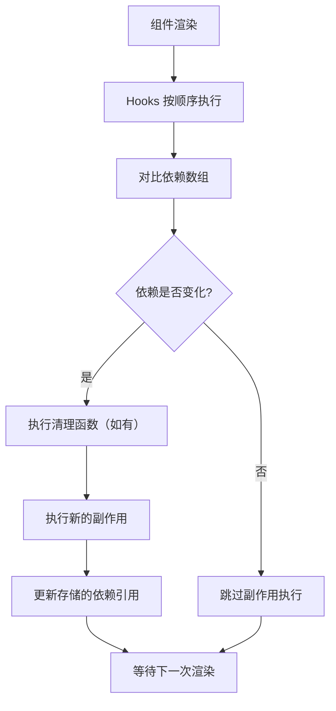

# React 笔面试题集（涵盖 React 18 / 19 / 20）

> 模块：06-react（第6周 React 19/20 生态）
> 覆盖：JSX、虚拟 DOM、Fiber 架构、Hooks、Diff 算法、状态管理
> 题量：16 道选择题 + 12 道简答题 + 3 道编程题 + 2 道场景设计题
> 难度标注：★基础  ★★中档  ★★★拔高

---

## 一、选择题（16 题，每题附解析）

**1. ★ JSX 的本质是什么？**

A. 一种模板语言，在运行时解析
B. React.createElement 的语法糖，由 Babel 编译为 JavaScript 函数调用
C. 直接操作 DOM 的 API
D. 一种新的编程语言

**答案：B**

**解析**：JSX 是 `React.createElement(component, props, ...children)` 的语法糖。Babel 在编译阶段将 JSX 转换为标准的 JavaScript 函数调用。React 17+ 引入了新的 JSX 转换（`react/jsx-runtime`），不再需要手动引入 React。

---

**2. ★ React 中，以下哪个 Hook 用于在函数组件中管理状态？**

A. useEffect
B. useContext
C. useState
D. useReducer

**答案：C**

**解析**：`useState` 是 React 中最基础的状态管理 Hook，返回一个状态值和更新该状态的函数。`useReducer` 也可以管理状态，但它是 useState 的替代方案，适用于复杂状态逻辑。`useEffect` 用于处理副作用，`useContext` 用于订阅 Context。

---

**3. ★ 以下关于 React 虚拟 DOM 的说法正确的是？**

A. 虚拟 DOM 比真实 DOM 操作更快
B. 虚拟 DOM 是真实 DOM 的 JavaScript 对象表示，配合 Diff 算法最小化 DOM 操作
C. 虚拟 DOM 是浏览器内置的 API
D. 使用虚拟 DOM 后不再需要操作真实 DOM

**答案：B**

**解析**：虚拟 DOM 是真实 DOM 的 JavaScript 对象表示。它本身操作并不比真实 DOM 快，其价值在于配合 Diff 算法计算出最小的 DOM 变更，从而减少昂贵的真实 DOM 操作次数。虚拟 DOM 不是浏览器 API，最终仍需操作真实 DOM。

---

**4. ★★ React 18 中新增的并发特性不包括？**

A. useTransition
B. useDeferredValue
C. Server Components
D. Automatic Batching

**答案：C**

**解析**：Server Components（服务端组件）是 React 18 之后才正式推出的特性（React 19 中稳定），不属于 React 18 的并发特性。React 18 的并发特性包括：useTransition、useDeferredValue、Automatic Batching（自动批处理）、Suspense 改进等。

---

**5. ★★ React Fiber 架构主要解决什么问题？**

A. 组件间通信问题
B. 长任务阻塞主线程，导致页面掉帧和卡顿
C. 状态管理复杂问题
D. 路由跳转问题

**答案：B**

**解析**：React 15 的 Stack Reconciler 使用递归遍历，整个过程不可中断。当组件树庞大时，一次 Diff 可能超过 16ms，阻塞主线程，导致动画掉帧和页面卡顿。Fiber 架构通过时间分片（Time Slicing）和任务优先级调度，使渲染过程可中断，解决了这一问题。

---

**Hooks 依赖更新流程图：**



> React Hooks 通过链表按调用顺序存储状态，依赖变化时先执行清理函数再执行新副作用，确保状态一致性。

**6. ★★ 为什么 Hooks 不能在条件语句中使用？**

A. React 官方限制，没有技术原因
B. Hooks 依赖调用顺序，使用链表存储状态，条件调用会破坏顺序，导致状态错乱
C. 条件语句中的 Hooks 性能较差
D. 条件语句中的 Hooks 无法被 TypeScript 正确推断类型

**答案：B**

**解析**：React 内部通过**链表**按调用顺序存储 Hooks 状态。每次渲染时，React 按顺序读取链表中的状态。如果某个 Hook 在条件语句中调用，调用顺序可能变化，导致 Hook 读取到错误的状态，引发不可预测的 bug。

---

**7. ★★ useEffect 的第二个参数为空数组 [] 表示什么？**

A. 每次渲染后都执行
B. 仅在组件挂载时执行一次
C. 仅在组件卸载时执行
D. 永远不会执行

**答案：B**

**解析**：空数组 `[]` 表示依赖项从未变化，因此副作用仅在组件首次渲染后执行一次，类似类组件的 `componentDidMount`。如果省略第二个参数，则每次渲染后都执行；如果依赖数组中有值，则仅在依赖值变化时执行。

---

**8. ★★ useMemo 和 useCallback 的区别？**

A. 没有区别，功能完全相同
B. useMemo 缓存计算结果，useCallback 缓存函数引用
C. useMemo 用于类组件，useCallback 用于函数组件
D. useMemo 缓存函数引用，useCallback 缓存计算结果

**答案：B**

**解析**：`useMemo(() => value, deps)` 缓存**计算结果**，返回缓存的值；`useCallback(fn, deps)` 是 `useMemo(() => fn, deps)` 的语法糖，专门用于缓存**函数引用**。

---

**9. ★★ React.memo 的作用是什么？**

A. 缓存函数组件的计算结果
B. 对组件的 props 进行浅比较，避免不必要的重渲染
C. 记忆组件的状态
D. 缓存组件的副作用

**答案：B**

**解析**：`React.memo` 是一个高阶组件，它包裹函数组件后，会对 props 进行浅比较。如果 props 没有变化，则跳过渲染，复用上一次的结果。注意它只比较 props，不比较 state 或 context。

---

**10. ★★ 以下关于 setState 的说法正确的是？**

A. React 18 中 setState 在事件处理函数中自动批处理，但在 setTimeout 中不会批处理
B. React 18 中 setState 在异步回调中不会批处理
C. React 18 中 setState 在所有场景下都自动批处理
D. React 18 中 setState 不再支持批处理

**答案：C**

**解析**：React 18 引入了**自动批处理**（Automatic Batching），在事件处理函数、setTimeout、Promise、原生事件等所有场景下，多次 setState 都会被自动合并为一次更新。这是 React 18 相比 React 17 的重要改进。

---

**11. ★★★ React Diff 算法中，key 的作用是什么？**

A. 作为组件的唯一标识，用于 React DevTools 调试
B. 标识同一层级节点，帮助 React 识别哪些元素发生了变化、可复用或需要移动
C. 用于 CSS 样式选择器
D. 作为 DOM 元素的 id 属性

**答案：B**

**解析**：key 帮助 React 识别同一层级列表中的每个元素。Diff 算法通过 key 判断节点是否可复用，从而决定是移动、插入还是删除节点。key 不会作为 id 属性传递给 DOM，除非手动传递。

---

**12. ★★★ useLayoutEffect 和 useEffect 的区别？**

A. 没有区别，只是命名不同
B. useLayoutEffect 在 DOM 变更后异步执行，useEffect 在 DOM 变更后同步执行
C. useLayoutEffect 在 DOM 变更后同步执行，会阻塞渲染；useEffect 在渲染完成后异步执行
D. useLayoutEffect 在服务端渲染时执行，useEffect 不执行

**答案：C**

**解析**：`useLayoutEffect` 在 DOM 变更后、浏览器绘制前**同步**执行，会阻塞渲染，适用于需要同步读取 DOM 尺寸并避免闪烁的场景。`useEffect` 在浏览器绘制完成后**异步**执行，不会阻塞渲染，适用于数据请求、订阅等场景。

---

**13. ★★ React Router v6 中，以下哪个组件用于替代 v5 的 Switch？**

A. Switch
B. Router
C. Routes
D. Route

**答案：C**

**解析**：React Router v6 使用 `<Routes>` 替代 v5 的 `<Switch>`。`<Routes>` 提供更智能的路由匹配（默认匹配最佳路由而非第一个匹配的路由），并支持嵌套路由和相对路径。

---

**14. ★★ 以下关于 Redux 的说法正确的是？**

A. Redux 可以有多个 Store，state 可以直接修改
B. Redux 是单一数据源，state 不可变，通过 dispatch action 触发 reducer 生成新 state
C. Redux 的 state 是可变的数据结构
D. Redux 不需要 Action，直接修改 state

**答案：B**

**解析**：Redux 的三大原则是：(1) 单一数据源——整个应用只有一个 Store；(2) State 只读——唯一改变 state 的方式是 dispatch action；(3) 纯函数修改——Reducer 必须是纯函数，返回新 state 而非修改旧 state。

---

**15. ★★★ useTransition 的作用是什么？**

A. 实现组件间的过渡动画
B. 将某些状态更新标记为非紧急更新，保持 UI 在耗时更新期间仍然响应
C. 实现页面间的路由过渡
D. 替代 useEffect 处理副作用

**答案：B**

**解析**：`useTransition` 是 React 18 的并发特性之一。它返回 `[isPending, startTransition]`，`startTransition` 用于包裹非紧急的耗时更新，React 会在后台处理这些更新，优先保证紧急更新（如输入框输入）的响应速度。

---

### 16. ★★ React 19 中 `use()` API 的特点是什么？

A. `use()` 是一个新的 Hook，可以替代 `useState` 和 `useEffect`
B. `use()` 可以在条件语句和循环中使用，且能读取 Promise 和 Context 的值
C. `use()` 只能在服务端组件中使用，客户端组件不可用
D. `use()` 与 `useEffect` 功能完全相同，只是语法更简洁

**答案：B**

**解析**：`use()` 是 React 19 引入的特殊 Hook，用于在渲染期间读取资源（Promise 或 Context）。与普通 Hooks 最大的区别在于：`use()` 可以在条件语句、循环以及 `return` 之后调用，不受传统 Hooks 调用规则的限制。当 `use()` 接收一个 Promise 时，它会暂停当前组件的渲染，直到 Promise resolve，然后返回结果（配合 Suspense 使用）；当接收 Context 时，行为与 `useContext` 类似。需要注意的是，`use()` 是一个特殊的 Hook——虽然它打破了常规 Hooks 的调用规则，但仍属于 Hook 体系，由 React 内部特殊处理。A 错误是因为 `use()` 不能替代 `useState`（它不管理状态）；C 错误是因为客户端组件同样可以使用 `use()`；D 错误是因为 `use()` 与 `useEffect` 的用途完全不同。

---

## 二、简答题（12 题）

**1. ★★ React 虚拟 DOM 的原理和优势**

**参考答案**：

虚拟 DOM 是真实 DOM 的 JavaScript 对象表示。当状态变化时，React 生成新的虚拟 DOM 树，通过 Diff 算法与旧树比较，计算出最小 DOM 变更，最后批量更新真实 DOM。

优势：(1) 减少真实 DOM 操作次数，提升性能；(2) 跨平台——虚拟 DOM 是抽象层，可渲染到不同平台（Web、Native、Canvas）；(3) 声明式编程——开发者只需描述 UI 状态，无需手动操作 DOM。

> 📖 **参考链接**：
> - [React官方文档 - Render and Commit](https://react.dev/learn/render-and-commit)
> - [React官方文档 - Thinking in React](https://react.dev/learn/thinking-in-react)

---

**2. ★★ 类组件和函数组件的区别**

**参考答案**：

| 维度 | 类组件 | 函数组件 |
|------|--------|---------|
| 定义方式 | `class Comp extends React.Component` | `function Comp(props)` |
| 状态管理 | `this.state` + `this.setState` | `useState` Hook |
| 生命周期 | `componentDidMount` 等 | `useEffect` 模拟 |
| this 绑定 | 需要 bind 或箭头函数 | 无 this |
| 代码量 | 较多 | 较少 |
| 性能 | 略重（实例化开销） | 更轻量 |
| 逻辑复用 | HOC / Render Props | 自定义 Hooks |

---

**3. ★★★ React Fiber 架构的设计目标和工作原理**

**参考答案**：

设计目标：解决 React 15 Stack Reconciler 递归不可中断导致的长时间阻塞主线程问题。

工作原理：
- 将渲染任务拆分为多个小的工作单元（Fiber 节点）
- 通过链表结构（child/sibling/return）支持遍历中断和恢复
- 使用双缓冲机制（current 树和 workInProgress 树交替）
- 工作循环分为 render 阶段（可中断，标记副作用）和 commit 阶段（不可中断，应用 DOM 变更）
- 基于优先级调度，紧急更新优先处理

> 📖 **参考链接**：
> - [React官方文档 - React Reference](https://react.dev/reference/react)

---

**4. ★★ Hooks 的使用规则和原理**

**参考答案**：

使用规则：(1) 只在函数组件顶层调用，不在条件/循环/嵌套函数中调用；(2) 只在函数组件或自定义 Hook 中调用。

原理：React 内部使用链表按调用顺序存储 Hooks 状态。每次渲染时按顺序读取，条件调用会破坏顺序导致状态错乱。

> 📖 **参考链接**：
> - [React官方文档 - Hooks](https://react.dev/reference/react/hooks)
> - [React官方文档 - State: A Component's Memory](https://react.dev/learn/state-a-components-memory)

---

**5. ★★ useEffect 的依赖数组和清理函数**

**参考答案**：

依赖数组：决定 effect 何时重新执行。React 使用 `Object.is` 比较每个依赖值，有变化则重新执行 effect。

清理函数：effect 返回的函数，在下一次 effect 执行前或组件卸载时调用，用于清理副作用（如取消订阅、清除定时器）。

```jsx
useEffect(() => {
  const subscription = subscribe();
  return () => {
    subscription.unsubscribe(); // 清理函数
  };
}, [userId]); // 依赖数组
```

---

**6. ★★★ React Diff 算法的三大策略**

**参考答案**：

1. **Tree Diff**：只比较同级节点，跨层级移动视为删除+重建。复杂度 O(n)。
2. **Component Diff**：同类型组件继续比较子树，不同类型直接替换。O(n)。
3. **Element Diff**：通过 key 标识同一层级子节点，判断移动/插入/删除。O(n)。

> 📖 **参考链接**：
> - [React官方文档 - Render and Commit](https://react.dev/learn/render-and-commit)
> - [React官方文档 - memo](https://react.dev/reference/react/memo)

---

**7. ★★ React 性能优化手段有哪些**

**参考答案**：

- React.memo 避免不必要的子组件重渲染
- useMemo 缓存昂贵的计算结果
- useCallback 缓存函数引用，配合 React.memo 使用
- React.lazy + Suspense 实现代码分割
- 虚拟列表处理长列表（react-window）
- 避免在 render 中创建新对象/函数/数组
- 拆分 Context 避免全局重渲染
- 使用生产模式构建

---

**8. ★★ setState 是同步还是异步的**

**参考答案**：

React 18 中，setState 在**所有场景下都是异步批处理**的。React 将多次 setState 合并为一次更新，异步执行。如果需要同步获取最新状态，可以使用 `flushSync` 或在 `useEffect` 中读取更新后的 state。

---

**9. ★★ Redux 的工作流程**

**参考答案**：

单向数据流：View 通过 `dispatch(action)` 发送 action → Store 将 action 和当前 state 交给 Reducer → Reducer 纯函数返回新 state → Store 更新状态 → View 通过 `subscribe` 或 `useSelector` 获取新状态并重新渲染。

> 📖 **参考链接**：
> - [React官方文档 - Managing State](https://react.dev/learn/managing-state)

---

**10. ★★★ React 18 并发特性（Concurrent Features）有哪些**

**参考答案**：

1. **useTransition**：标记非紧急更新，保持 UI 在耗时更新期间响应
2. **useDeferredValue**：延迟更新某个值，让出主线程给紧急更新
3. **Automatic Batching**：所有场景下自动批处理 setState
4. **Suspense 改进**：支持 SSR 流式渲染和选择性注水
5. **startTransition**：与 useTransition 类似，可在非组件中使用

> 📖 **参考链接**：
> - [React官方文档 - useTransition](https://react.dev/reference/react/useTransition)
> - [React官方文档 - useDeferredValue](https://react.dev/reference/react/useDeferredValue)

---

### 11. ★★ useOptimistic() 乐观更新的工作原理

**参考答案**：

`useOptimistic` 是 React 19 引入的 Hook，用于实现乐观更新（Optimistic UI）模式。即在服务器响应之前，先在 UI 上展示预期的操作结果，提升用户体验的即时反馈感。

**工作原理**：

1. **初始状态**：`useOptimistic` 接收一个初始状态值和一个 reducer 函数，返回乐观状态和更新函数
2. **触发更新**：当用户执行操作时（如提交表单），立即调用更新函数，传入当前状态和乐观值，通过 reducer 计算出新的乐观状态并立即渲染
3. **后台同步**：同时向服务器发送实际请求
4. **结果处理**：
   - 如果请求成功，乐观状态即为最终状态，无需额外操作
   - 如果请求失败，通过重置状态或重新获取数据来回滚到实际状态

**代码示例**：

```jsx
import { useOptimistic } from 'react';

function MessageList({ messages, sendMessage }) {
  // messages 为服务端返回的实际消息列表
  const [optimisticMessages, addOptimisticMessage] = useOptimistic(
    messages,
    (prevMessages, newMessage) => [...prevMessages, newMessage]
  );

  async function handleSubmit(formData) {
    const message = formData.get('message');
    // 立即在 UI 上显示新消息（乐观更新）
    addOptimisticMessage({ id: Date.now(), text: message, pending: true });
    // 异步发送到服务器
    await sendMessage(message);
    // 请求成功后，服务器返回的新消息会通过 messages prop 自动同步
  }

  return (
    <>
      <ul>
        {optimisticMessages.map(msg => (
          <li key={msg.id} style={{ opacity: msg.pending ? 0.5 : 1 }}>
            {msg.text}
          </li>
        ))}
      </ul>
      <form action={handleSubmit}>
        <input name="message" />
        <button type="submit">发送</button>
      </form>
    </>
  );
}
```

**与手动实现乐观更新的对比**：

- 传统方式需要手动管理临时状态、处理回滚逻辑，代码复杂且容易出错
- `useOptimistic` 将乐观更新逻辑封装在 reducer 中，失败时自动回退到原始状态，代码更简洁可靠

---

### 12. ★★★ Server Actions 的用法和与传统 API 调用的对比

**参考答案**：

Server Actions 是 React 19 正式推出的功能，允许在客户端组件中直接调用定义在服务端的异步函数，无需手动创建 API 路由和处理请求/响应。

**基本用法**：

```tsx
// 服务端：使用 "use server" 指令标记
// app/actions.ts
"use server";

import { revalidatePath } from "next/cache";
import { db } from "@/lib/db";

export async function createPost(formData: FormData) {
  const title = formData.get("title") as string;
  const content = formData.get("content") as string;
  await db.post.create({ data: { title, content } });
  revalidatePath("/posts"); // 重新验证缓存
}

// 客户端组件中直接使用
// app/page.tsx
"use client";
import { createPost } from "./actions";

export default function NewPostForm() {
  return (
    <form action={createPost}>
      <input name="title" />
      <textarea name="content" />
      <button type="submit">发布</button>
    </form>
  );
}
```

**与传统的 API 调用对比**：

| 维度 | Server Actions | 传统 API 调用（REST/GraphQL） |
|------|---------------|------|
| **路由定义** | 无需手动定义 API 路由 | 需要显式创建 API 路由文件 |
| **类型安全** | 天然支持 TypeScript 端到端类型安全 | 需要额外的类型生成工具（如 tRPC） |
| **表单处理** | 原生支持 `<form action>`，支持渐进增强 | 需要手动处理 `onSubmit` + `fetch` |
| **序列化** | 自动处理参数序列化，支持 FormData | 需手动 JSON.stringify / FormData |
| **无 JS 支持** | 即使 JS 未加载，表单仍可提交 | 完全依赖 JavaScript |
| **错误处理** | 返回错误对象，客户端通过 `useActionState` 获取 | 需检查 HTTP 状态码和解析响应体 |
| **缓存控制** | 与服务端紧密集成，可使用 `revalidatePath` | 需要手动管理缓存策略 |
| **安全** | 参数自动在服务端校验，不暴露 API 端点 | 需要手动实现鉴权和输入校验 |

**核心优势**：Server Actions 消除了客户端与服务端之间的样板代码（API 路由定义、序列化/反序列化、错误处理），使开发者可以像调用本地函数一样调用服务端逻辑，同时享受端到端的类型安全。配合 `<form action>` 原生支持，即使 JavaScript 未加载，表单也能正常工作（渐进增强）。

> 📖 **参考链接**：
> - [React官方文档 - Server Components](https://react.dev/reference/rsc/server-components)

---

## 三、编程题（3 题）

**1. ★★ 实现一个自定义 Hook：useDebounce**

```javascript
import { useState, useEffect } from 'react';

/**
 * 自定义 Hook：防抖
 * @param {*} value - 需要防抖的值
 * @param {number} delay - 防抖延迟时间（毫秒）
 * @returns 防抖后的值
 */
function useDebounce(value, delay = 300) {
  const [debouncedValue, setDebouncedValue] = useState(value);

  useEffect(() => {
    // 设置定时器，延迟更新值
    const timer = setTimeout(() => {
      setDebouncedValue(value);
    }, delay);

    // 清理函数：下次 value 变化时取消前一次定时器
    return () => {
      clearTimeout(timer);
    };
  }, [value, delay]);

  return debouncedValue;
}

// 使用示例
function SearchInput() {
  const [query, setQuery] = useState('');
  const debouncedQuery = useDebounce(query, 500);

  useEffect(() => {
    if (debouncedQuery) {
      // 在 debouncedQuery 变化时发起搜索请求
      fetchSearchResults(debouncedQuery);
    }
  }, [debouncedQuery]);

  return (
    <input
      value={query}
      onChange={(e) => setQuery(e.target.value)}
      placeholder="搜索..."
    />
  );
}
```

---

**2. ★★★ 实现一个简单的 useState Hook（基于闭包）**

```javascript
// 简化版 React 运行时模拟
function createReact() {
  let hooks = [];          // 存储所有 Hook 的状态
  let hookIndex = 0;       // 当前 Hook 的索引
  let currentComponent;    // 当前正在渲染的组件
  let rootElement;         // 根 DOM 元素

  function useState(initialValue) {
    const index = hookIndex; // 保存当前 Hook 的索引（闭包捕获）

    // 首次渲染时初始化状态
    if (hooks[index] === undefined) {
      hooks[index] = initialValue;
    }

    const setState = (newValue) => {
      // 支持函数式更新
      hooks[index] = typeof newValue === 'function'
        ? newValue(hooks[index])
        : newValue;
      // 重新渲染组件
      render();
    };

    hookIndex++;
    return [hooks[index], setState];
  }

  function render() {
    hookIndex = 0; // 重置 Hook 索引
    const element = currentComponent(); // 执行组件函数
    // 更新 DOM（简化处理）
    rootElement.innerHTML = '';
    rootElement.appendChild(element);
  }

  return { useState, render };
}

// 使用示例
const { useState, render } = createReact();

function Counter() {
  const [count, setCount] = useState(0);
  const [name, setName] = useState('匿名');

  const div = document.createElement('div');
  div.innerHTML = `
    <p>计数：${count}</p>
    <p>名称：${name}</p>
  `;
  return div;
}
```

---

**3. ★★ 实现一个带防抖的搜索输入组件**

```jsx
import React, { useState, useEffect, useCallback } from 'react';

// 自定义 useDebounce Hook
function useDebounce(value, delay) {
  const [debouncedValue, setDebouncedValue] = useState(value);

  useEffect(() => {
    const timer = setTimeout(() => setDebouncedValue(value), delay);
    return () => clearTimeout(timer);
  }, [value, delay]);

  return debouncedValue;
}

// 搜索输入组件
function SearchBox() {
  const [keyword, setKeyword] = useState('');
  const [results, setResults] = useState([]);
  const [loading, setLoading] = useState(false);
  const debouncedKeyword = useDebounce(keyword, 500);

  // 使用 useCallback 避免不必要的函数重建
  const search = useCallback(async (query) => {
    if (!query.trim()) {
      setResults([]);
      return;
    }

    setLoading(true);
    try {
      const response = await fetch(`/api/search?q=${encodeURIComponent(query)}`);
      const data = await response.json();
      setResults(data);
    } catch (error) {
      console.error('搜索失败：', error);
      setResults([]);
    } finally {
      setLoading(false);
    }
  }, []);

  useEffect(() => {
    search(debouncedKeyword);
  }, [debouncedKeyword, search]);

  return (
    <div className="search-box">
      <input
        type="text"
        value={keyword}
        onChange={(e) => setKeyword(e.target.value)}
        placeholder="请输入搜索关键词..."
      />
      {loading && <span className="loading">搜索中...</span>}
      <ul className="results">
        {results.map((item) => (
          <li key={item.id}>{item.title}</li>
        ))}
      </ul>
    </div>
  );
}

export default SearchBox;
```

---

### 编程题扩展：完整代码实现

### 补充1：手写简化版 useState

```javascript
/**
 * 手写简化版 useState：基于闭包和链表实现
 * 模拟 React 的 Hook 状态管理机制
 */

// 全局状态存储
let hooks = [];            // 存储所有 Hook 的状态
let hookIndex = 0;         // 当前 Hook 的索引
let currentComponent = null; // 当前正在渲染的组件
let rootElement = null;    // 根 DOM 元素
let isFirstRender = true;  // 是否是首次渲染

function useState(initialValue) {
  // 保存当前 Hook 的索引（闭包捕获）
  const index = hookIndex;

  // 首次渲染时初始化状态
  if (hooks[index] === undefined) {
    hooks[index] = typeof initialValue === 'function'
      ? initialValue()
      : initialValue;
  }

  const setState = (newValue) => {
    // 支持函数式更新：setState(prev => prev + 1)
    const nextValue = typeof newValue === 'function'
      ? newValue(hooks[index])
      : newValue;

    // 值没有变化则跳过渲染
    if (Object.is(hooks[index], nextValue)) {
      return;
    }

    hooks[index] = nextValue;
    render(); // 触发重新渲染
  };

  hookIndex++;
  return [hooks[index], setState];
}

function useEffect(callback, deps) {
  const index = hookIndex;
  const prevDeps = hooks[index];

  // 检查依赖是否变化
  const hasChanged = !prevDeps || !deps
    || deps.some((dep, i) => !Object.is(dep, prevDeps[i]));

  if (hasChanged) {
    // 执行清理函数
    if (hooks[index] && hooks[index].cleanup) {
      hooks[index].cleanup();
    }

    // 执行副作用并保存清理函数
    const cleanup = callback();
    hooks[index] = { deps, cleanup };
  }

  hookIndex++;
}

function useMemo(factory, deps) {
  const index = hookIndex;
  const prevDeps = hooks[index]?.deps;

  const hasChanged = !prevDeps
    || deps.some((dep, i) => !Object.is(dep, prevDeps[i]));

  if (hasChanged) {
    hooks[index] = { deps, value: factory() };
  }

  hookIndex++;
  return hooks[index].value;
}

function useCallback(fn, deps) {
  return useMemo(() => fn, deps);
}

function useRef(initialValue) {
  const index = hookIndex;

  if (hooks[index] === undefined) {
    hooks[index] = { current: initialValue };
  }

  hookIndex++;
  return hooks[index];
}

function render() {
  hookIndex = 0; // 重置 Hook 索引
  const element = currentComponent(); // 执行组件函数
  // 更新 DOM（简化处理）
  rootElement.innerHTML = '';
  rootElement.appendChild(element);
}

// 创建 React 运行时
function createReact() {
  return {
    useState,
    useEffect,
    useMemo,
    useCallback,
    useRef,
    render,
    setRoot: (el) => { rootElement = el; },
    setComponent: (comp) => { currentComponent = comp; },
  };
}

// ========== 使用示例 ==========
const { useState, useEffect, render, setRoot, setComponent } = createReact();

function Counter() {
  const [count, setCount] = useState(0);
  const [name, setName] = useState('匿名');

  useEffect(() => {
    console.log(`count 变化为: ${count}`);
    return () => console.log('清理上一次副作用');
  }, [count]);

  const div = document.createElement('div');
  div.innerHTML = `
    <h2>计数器</h2>
    <p>计数：${count}</p>
    <p>名称：${name}</p>
    <button id="inc">+1</button>
    <button id="change-name">改名</button>
  `;

  // 绑定事件（简化处理）
  setTimeout(() => {
    document.getElementById('inc')?.addEventListener('click', () => {
      setCount((prev) => prev + 1);
    });
    document.getElementById('change-name')?.addEventListener('click', () => {
      setName(`用户${Math.random().toString(36).slice(2, 6)}`);
    });
  }, 0);

  return div;
}

// 初始化
// setRoot(document.getElementById('root'));
// setComponent(Counter);
// render();
```

### 补充2：手写简化版 useEffect

```javascript
/**
 * 增强版 useEffect 实现
 * 完整模拟 React useEffect 的行为：
 * - 依赖数组比较
 * - 清理函数机制
 * - 空依赖数组（仅执行一次）
 * - 无依赖数组（每次渲染都执行）
 */

// 在同一个 Hook 系统中扩展

let hooksV2 = [];
let hookIndexV2 = 0;
let pendingEffects = [];  // 待执行的副作用队列

function useEffect(create, deps) {
  const index = hookIndexV2;
  const hook = hooksV2[index];

  if (hook === undefined) {
    // 首次渲染：记录依赖并调度副作用
    hooksV2[index] = { deps, cleanup: null };
    pendingEffects.push({ index, create });
  } else {
    // 后续渲染：检查依赖是否变化
    const prevDeps = hook.deps;

    if (deps === undefined) {
      // 无依赖数组：每次渲染都执行
      pendingEffects.push({ index, create });
    } else if (deps.length === 0) {
      // 空依赖数组：仅首次执行（hook 已存在，跳过）
    } else {
      // 有依赖数组：逐项比较
      const hasChanged = deps.some((dep, i) => !Object.is(dep, prevDeps[i]));
      if (hasChanged) {
        hooksV2[index].deps = deps;
        pendingEffects.push({ index, create });
      }
    }
  }

  hookIndexV2++;
}

function flushEffects() {
  // 先执行清理函数
  pendingEffects.forEach(({ index }) => {
    if (hooksV2[index]?.cleanup) {
      hooksV2[index].cleanup();
    }
  });

  // 执行新的副作用
  pendingEffects.forEach(({ index, create }) => {
    hooksV2[index].cleanup = create();
  });

  pendingEffects = [];
}

/**
 * useLayoutEffect：同步执行的副作用
 * 在 DOM 更新后、浏览器绘制前同步执行
 */
function useLayoutEffect(create, deps) {
  const index = hookIndexV2;
  const hook = hooksV2[index];

  if (hook === undefined) {
    hooksV2[index] = { deps, cleanup: null };
    // 同步执行（不加入 pendingEffects 队列）
    if (hooksV2[index].cleanup) {
      hooksV2[index].cleanup();
    }
    hooksV2[index].cleanup = create();
  } else {
    const prevDeps = hook.deps;
    if (deps === undefined) {
      if (hooksV2[index].cleanup) {
        hooksV2[index].cleanup();
      }
      hooksV2[index].cleanup = create();
    } else if (deps.length === 0) {
      // 空数组：不重新执行
    } else {
      const hasChanged = deps.some((dep, i) => !Object.is(dep, prevDeps[i]));
      if (hasChanged) {
        hooksV2[index].deps = deps;
        if (hooksV2[index].cleanup) {
          hooksV2[index].cleanup();
        }
        hooksV2[index].cleanup = create();
      }
    }
  }

  hookIndexV2++;
}

// ========== 使用示例 ==========

function TimerComponent() {
  const [seconds, setSeconds] = useState(0);
  const [isRunning, setIsRunning] = useState(false);

  useEffect(() => {
    if (!isRunning) return;

    console.log('定时器启动');
    const timer = setInterval(() => {
      setSeconds((prev) => prev + 1);
    }, 1000);

    // 清理函数：组件卸载或依赖变化时清除定时器
    return () => {
      console.log('定时器清理');
      clearInterval(timer);
    };
  }, [isRunning]); // 依赖 isRunning

  useEffect(() => {
    document.title = `已运行 ${seconds} 秒`;
  }, [seconds]);

  return { seconds, isRunning, toggle: () => setIsRunning(!isRunning) };
}
```

### 补充3：自定义 Hook 封装

```javascript
// ========== 1. useDebounce：防抖 Hook ==========
import { useState, useEffect } from 'react';

/**
 * 对值进行防抖处理
 * @param {*} value - 需要防抖的值
 * @param {number} delay - 防抖延迟（毫秒）
 * @returns {*} 防抖后的值
 */
function useDebounce(value, delay = 300) {
  const [debouncedValue, setDebouncedValue] = useState(value);

  useEffect(() => {
    // 设置定时器延迟更新
    const timer = setTimeout(() => {
      setDebouncedValue(value);
    }, delay);

    // 清理函数：value 变化时取消上一次的定时器
    return () => {
      clearTimeout(timer);
    };
  }, [value, delay]);

  return debouncedValue;
}

// 使用示例
function SearchInput() {
  const [query, setQuery] = useState('');
  const debouncedQuery = useDebounce(query, 500);

  useEffect(() => {
    if (debouncedQuery) {
      fetchSearchResults(debouncedQuery);
    }
  }, [debouncedQuery]);

  return (
    <input
      value={query}
      onChange={(e) => setQuery(e.target.value)}
      placeholder="搜索..."
    />
  );
}

// ========== 2. useLocalStorage：本地存储 Hook ==========
import { useState, useEffect, useCallback } from 'react';

/**
 * 将状态同步到 localStorage
 * @param {string} key - localStorage 的 key
 * @param {*} initialValue - 初始值
 * @returns {[*, Function]} 状态值和更新函数
 */
function useLocalStorage(key, initialValue) {
  // 初始化：从 localStorage 读取或使用默认值
  const [storedValue, setStoredValue] = useState(() => {
    try {
      const item = window.localStorage.getItem(key);
      return item !== null ? JSON.parse(item) : initialValue;
    } catch (error) {
      console.error(`读取 localStorage key "${key}" 失败:`, error);
      return initialValue;
    }
  });

  // 封装 setValue，同时更新 localStorage
  // 使用函数式更新避免依赖 storedValue，减少 useCallback 的依赖项
  const setValue = useCallback((value) => {
    try {
      setStoredValue(prev => {
        // 支持函数式更新
        const valueToStore = value instanceof Function
          ? value(prev)
          : value;
        window.localStorage.setItem(key, JSON.stringify(valueToStore));
        return valueToStore;
      });
    } catch (error) {
      console.error(`写入 localStorage key "${key}" 失败:`, error);
    }
  }, [key]);

  // 监听其他标签页的 storage 变化
  useEffect(() => {
    function handleStorageChange(event) {
      if (event.key === key && event.newValue !== null) {
        try {
          setStoredValue(JSON.parse(event.newValue));
        } catch (error) {
          setStoredValue(event.newValue);
        }
      }
    }

    window.addEventListener('storage', handleStorageChange);
    return () => window.removeEventListener('storage', handleStorageChange);
  }, [key]);

  return [storedValue, setValue];
}

// 使用示例
function ThemeSwitcher() {
  const [theme, setTheme] = useLocalStorage('app-theme', 'light');

  return (
    <div>
      <p>当前主题：{theme}</p>
      <button onClick={() => setTheme(theme === 'light' ? 'dark' : 'light')}>
        切换主题
      </button>
    </div>
  );
}

// ========== 3. useThrottle：节流 Hook ==========
import { useState, useEffect, useRef } from 'react';

/**
 * 对值进行节流处理
 * @param {*} value - 需要节流的值
 * @param {number} interval - 节流间隔（毫秒）
 * @returns {*} 节流后的值
 */
function useThrottle(value, interval = 300) {
  const [throttledValue, setThrottledValue] = useState(value);
  const lastUpdated = useRef(Date.now());

  useEffect(() => {
    const now = Date.now();
    const elapsed = now - lastUpdated.current;

    if (elapsed >= interval) {
      // 超过间隔，立即更新
      lastUpdated.current = now;
      setThrottledValue(value);
    } else {
      // 未超过间隔，设置定时器延迟更新
      const timer = setTimeout(() => {
        lastUpdated.current = Date.now();
        setThrottledValue(value);
      }, interval - elapsed);

      return () => clearTimeout(timer);
    }
  }, [value, interval]);

  return throttledValue;
}

// 使用示例
function ScrollTracker() {
  const [scrollY, setScrollY] = useState(0);
  const throttledScrollY = useThrottle(scrollY, 200);

  useEffect(() => {
    const handleScroll = () => setScrollY(window.scrollY);
    window.addEventListener('scroll', handleScroll);
    return () => window.removeEventListener('scroll', handleScroll);
  }, []);

  return <p>滚动位置（节流）: {throttledScrollY}px</p>;
}

// ========== 4. useFetch：数据请求 Hook ==========
import { useState, useEffect, useCallback } from 'react';

/**
 * 封装数据请求逻辑
 * @param {string} url - 请求地址
 * @param {Object} options - fetch 配置项
 * @returns {{ data, loading, error, refetch }}
 */
function useFetch(url, options = {}) {
  const [data, setData] = useState(null);
  const [loading, setLoading] = useState(true);
  const [error, setError] = useState(null);

  const fetchData = useCallback(async () => {
    setLoading(true);
    setError(null);

    try {
      const response = await fetch(url, options);
      if (!response.ok) {
        throw new Error(`HTTP ${response.status}: ${response.statusText}`);
      }
      const result = await response.json();
      setData(result);
    } catch (err) {
      setError(err.message);
    } finally {
      setLoading(false);
    }
  }, [url, JSON.stringify(options)]);

  useEffect(() => {
    fetchData();
  }, [fetchData]);

  return { data, loading, error, refetch: fetchData };
}

// 使用示例
function UserProfile({ userId }) {
  const { data: user, loading, error } = useFetch(
    `https://api.example.com/users/${userId}`
  );

  if (loading) return <div>加载中...</div>;
  if (error) return <div>错误: {error}</div>;
  return <div>{user?.name}</div>;
}

// ========== 5. usePrevious：获取上一次的值 ==========
import { useRef, useEffect } from 'react';

/**
 * 获取上一次渲染时的值
 * @param {*} value - 当前值
 * @returns {*} 上一次渲染时的值
 */
function usePrevious(value) {
  const ref = useRef();

  useEffect(() => {
    ref.current = value;
  });

  return ref.current;
}

// 使用示例
function Counter() {
  const [count, setCount] = useState(0);
  const prevCount = usePrevious(count);

  return (
    <div>
      <p>当前: {count}, 之前: {prevCount ?? '无'}</p>
      <button onClick={() => setCount((c) => c + 1)}>+1</button>
    </div>
  );
}

// ========== 6. useToggle：开关状态 Hook ==========
import { useState, useCallback } from 'react';

/**
 * 切换布尔值状态
 * @param {boolean} initialValue - 初始值，默认 false
 * @returns {[boolean, Function, Object]}
 */
function useToggle(initialValue = false) {
  const [value, setValue] = useState(initialValue);

  const toggle = useCallback(() => {
    setValue((prev) => !prev);
  }, []);

  const setTrue = useCallback(() => setValue(true), []);
  const setFalse = useCallback(() => setValue(false), []);

  return [value, { toggle, setTrue, setFalse }];
}

// 使用示例
function Modal() {
  const [isOpen, { toggle, setTrue: open, setFalse: close }] = useToggle(false);

  return (
    <div>
      <button onClick={open}>打开弹窗</button>
      {isOpen && (
        <div className="modal">
          <p>弹窗内容</p>
          <button onClick={close}>关闭</button>
        </div>
      )}
    </div>
  );
}
```

---

## 四、场景设计题（2 题）

**1. ★★ 设计一个全局状态管理方案（Context + useReducer）**

```jsx
import React, { createContext, useContext, useReducer, useMemo } from 'react';

// ============= 1. 定义 Action 类型 =============
const ActionTypes = {
  SET_USER: 'SET_USER',
  LOGOUT: 'LOGOUT',
  ADD_TO_CART: 'ADD_TO_CART',
  REMOVE_FROM_CART: 'REMOVE_FROM_CART',
};

// ============= 2. 定义初始状态 =============
const initialState = {
  user: null,
  isAuthenticated: false,
  cart: [],
  theme: 'light',
};

// ============= 3. 实现 Reducer =============
function appReducer(state, action) {
  switch (action.type) {
    case ActionTypes.SET_USER:
      return { ...state, user: action.payload, isAuthenticated: true };

    case ActionTypes.LOGOUT:
      return { ...state, user: null, isAuthenticated: false, cart: [] };

    case ActionTypes.ADD_TO_CART:
      return { ...state, cart: [...state.cart, action.payload] };

    case ActionTypes.REMOVE_FROM_CART:
      return {
        ...state,
        cart: state.cart.filter((item) => item.id !== action.payload),
      };

    default:
      return state;
  }
}

// ============= 4. 创建 Context =============
const AppContext = createContext(null);

// ============= 5. Provider 组件 =============
function AppProvider({ children }) {
  const [state, dispatch] = useReducer(appReducer, initialState);

  // 使用 useMemo 缓存 value，避免不必要的重渲染
  const value = useMemo(() => ({ state, dispatch }), [state]);

  return <AppContext.Provider value={value}>{children}</AppContext.Provider>;
}

// ============= 6. 自定义 Hook（封装 useContext） =============
function useAppContext() {
  const context = useContext(AppContext);
  if (!context) {
    throw new Error('useAppContext 必须在 AppProvider 内部使用');
  }
  return context;
}

// ============= 7. Action Creator 辅助函数 =============
function useActions() {
  const { dispatch } = useAppContext();

  return {
    login: (user) => dispatch({ type: ActionTypes.SET_USER, payload: user }),
    logout: () => dispatch({ type: ActionTypes.LOGOUT }),
    addToCart: (item) => dispatch({ type: ActionTypes.ADD_TO_CART, payload: item }),
    removeFromCart: (id) => dispatch({ type: ActionTypes.REMOVE_FROM_CART, payload: id }),
  };
}

// ============= 8. 使用示例 =============
function App() {
  return (
    <AppProvider>
      <Header />
      <CartPage />
    </AppProvider>
  );
}

function Header() {
  const { state } = useAppContext();
  const { logout } = useActions();

  return (
    <header>
      {state.isAuthenticated ? (
        <>
          <span>欢迎，{state.user.name}</span>
          <button onClick={logout}>退出</button>
        </>
      ) : (
        <span>请登录</span>
      )}
    </header>
  );
}

function CartPage() {
  const { state } = useAppContext();
  const { removeFromCart } = useActions();

  return (
    <div>
      <h2>购物车 ({state.cart.length})</h2>
      {state.cart.map((item) => (
        <div key={item.id}>
          <span>{item.name}</span>
          <button onClick={() => removeFromCart(item.id)}>删除</button>
        </div>
      ))}
    </div>
  );
}

export { AppProvider, useAppContext, useActions };
```

---

**2. ★★★ 设计一个大型列表的虚拟滚动方案**

```jsx
import React, { useState, useRef, useEffect, useCallback, useMemo } from 'react';

/**
 * 虚拟滚动组件
 *
 * 核心原理：
 * 1. 只渲染可视区域内的列表项
 * 2. 通过 transform 偏移模拟滚动位置
 * 3. 上方和下方用占位元素撑开滚动条
 *
 * @param {number} itemHeight - 每项固定高度
 * @param {number} containerHeight - 容器高度
 * @param {number} overscan - 预渲染的额外项数（上下各多渲染几项，避免滚动时闪烁）
 * @param {Array} data - 数据源
 * @param {Function} renderItem - 渲染函数
 */
function VirtualList({
  itemHeight = 50,
  containerHeight = 600,
  overscan = 3,
  data = [],
  renderItem,
}) {
  const containerRef = useRef(null);
  const [scrollTop, setScrollTop] = useState(0);

  // 滚动事件处理
  const handleScroll = useCallback((e) => {
    setScrollTop(e.target.scrollTop);
  }, []);

  // 计算可视范围
  const visibleRange = useMemo(() => {
    const startIndex = Math.max(0, Math.floor(scrollTop / itemHeight) - overscan);
    const endIndex = Math.min(
      data.length - 1,
      Math.ceil((scrollTop + containerHeight) / itemHeight) + overscan
    );
    return { startIndex, endIndex };
  }, [scrollTop, itemHeight, containerHeight, data.length, overscan]);

  // 可见数据项
  const visibleItems = useMemo(() => {
    return data.slice(visibleRange.startIndex, visibleRange.endIndex + 1);
  }, [data, visibleRange]);

  // 总高度（用于撑开滚动条）
  const totalHeight = data.length * itemHeight;

  // 偏移量（将可见项放在正确的位置）
  const offsetY = visibleRange.startIndex * itemHeight;

  return (
    <div
      ref={containerRef}
      onScroll={handleScroll}
      style={{
        height: containerHeight,
        overflow: 'auto',
        position: 'relative',
        border: '1px solid #e0e0e0',
      }}
    >
      {/* 撑开滚动条的内层容器 */}
      <div style={{ height: totalHeight, position: 'relative' }}>
        {/* 可见项容器，通过 transform 偏移到正确位置 */}
        <div
          style={{
            position: 'absolute',
            top: 0,
            left: 0,
            right: 0,
            transform: `translateY(${offsetY}px)`,
          }}
        >
          {visibleItems.map((item, index) => (
            <div
              key={item.id}
              style={{ height: itemHeight }}
            >
              {renderItem(item, visibleRange.startIndex + index)}
            </div>
          ))}
        </div>
      </div>
    </div>
  );
}

// ============= 使用示例 =============
function App() {
  // 生成 10000 条测试数据
  const data = useMemo(() => {
    return Array.from({ length: 10000 }, (_, i) => ({
      id: i,
      name: `用户 ${i + 1}`,
      email: `user${i + 1}@example.com`,
    }));
  }, []);

  const renderItem = useCallback((item, index) => {
    return (
      <div style={{ padding: '10px', borderBottom: '1px solid #f0f0f0' }}>
        <strong>{index + 1}. {item.name}</strong>
        <span style={{ marginLeft: 10, color: '#666' }}>{item.email}</span>
      </div>
    );
  }, []);

  return (
    <div>
      <h2>虚拟滚动示例（10000 条数据）</h2>
      <VirtualList
        itemHeight={50}
        containerHeight={600}
        data={data}
        renderItem={renderItem}
      />
    </div>
  );
}

export default App;
```

**设计要点**：
1. 只渲染可视区域 + 上下预渲染（overscan）的数据项，DOM 节点数量可控
2. 使用 `transform: translateY` 偏移，GPU 加速，避免重排
3. 上方和下方通过撑开容器高度模拟原生滚动条
4. 固定高度场景下计算简单，动态高度场景需要额外维护高度缓存

---

> **学习导航**：
> - 返回 [学习路线总览](../README.md)
> - 本模块原理文件：[01-React核心与Hooks](./01-React核心与Hooks.md) | [02-Diff算法与性能优化](./02-Diff算法与性能优化.md) | [03-路由与状态管理](./03-路由与状态管理.md)
> - 实战应用：[企业后台管理系统](../10-project/01-企业后台管理系统实战.md)

---

---

## React 19 新特性速览

> React 19 于 2024 年 12 月 5 日正式发布，是 React 近年来最重要的版本更新。

| 特性 | 说明 | 示例 |
|------|------|------|
| **`use()`** | 在渲染中读取 Promise 和 Context | `const data = use(promise)` |
| **`useActionState()`** | 管理表单 Action 状态（替代 `useFormState`） | `const [state, formAction] = useActionState(fn, initialState)` |
| **`useOptimistic()`** | 乐观更新，UI 即时反馈 | `const [optimistic, addOptimistic] = useOptimistic(state, updater)` |
| **`useFormStatus()`** | 读取父表单提交状态 | `const { pending } = useFormStatus()` |
| **`ref` 作为普通 prop** | 不再需要 `forwardRef` | `<Child ref={ref} />` |
| **Document Metadata** | 组件中直接使用 `<title>`、`<meta>` | `<title>页面标题</title>` |
| **Server Components** | RSC 正式稳定 | 服务端组件默认可使用 async/await |
| **React Compiler** | 自动 memoization（Forget） | 无需手动 `useMemo`/`useCallback`/`React.memo` |

```tsx
// use() 示例 — 在渲染中读取 Promise
async function fetchUser(id: string) {
  const res = await fetch(`/api/users/${id}`);
  return res.json();
}

function UserProfile({ userId }: { userId: string }) {
  // use() 暂停组件渲染直到 Promise 完成
  const user = use(fetchUser(userId));
  return <div>{user.name}</div>;
}

// useOptimistic() 示例 — 乐观更新
function TodoList({ todos }: { todos: Todo[] }) {
  const [optimisticTodos, addOptimistic] = useOptimistic(todos, (state, newTodo) => [...state, newTodo]);

  async function handleAdd(formData: FormData) {
    addOptimistic({ id: 'pending', text: formData.get('text') as string, done: false });
    await addTodo(formData); // 实际提交
  }
  // ...
}

// ref 作为普通 prop — 不再需要 forwardRef
function MyInput({ ref, ...props }: { ref: React.Ref<HTMLInputElement> } & React.InputHTMLAttributes<HTMLInputElement>) {
  return <input ref={ref} {...props} />;
}
```

> **面试提示**：React 19 的 `use()`、`useOptimistic()` 和 `ref` 作为普通 prop 是最高频考点。Server Components 和 React Compiler 是架构层面的重要变化。

---

## 本章学习自检

- [ ] 完成 16 道选择题，理解每道题背后的原理
- [ ] 能独立回答 12 道简答题，覆盖核心知识点
- [ ] 能手写 useDebounce 自定义 Hook
- [ ] 理解 useState 的闭包实现原理
- [ ] 能实现带防抖的搜索输入组件
- [ ] 理解 Context + useReducer 的全局状态管理方案设计
- [ ] 掌握虚拟滚动（Virtual Scroll）的核心原理和实现方式
- [ ] 理解 React 19 新特性：`use()` API、`useOptimistic()` 乐观更新、Server Actions
- [ ] 能根据业务场景选择合适的状态管理方案