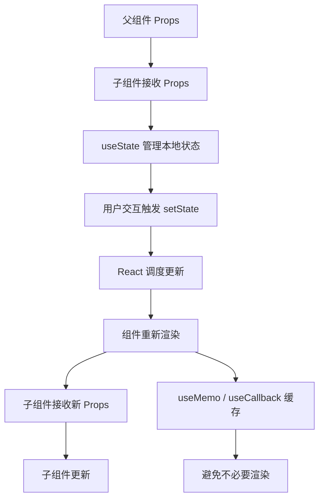

# React - 综合场景串联

---

## 场景一：React Todo 应用完整实现

### 场景描述
使用 React Hooks 实现一个功能完善的 Todo 应用，支持添加、删除、切换完成状态、过滤（全部/未完成/已完成）、本地持久化存储。要求使用函数组件和 Hooks，不依赖任何第三方状态管理库。

**React 状态管理数据流图：**



> React 遵循单向数据流：父组件通过 props 向子组件传递数据，状态更新通过 setState 触发重新渲染，配合 useMemo 和 useCallback 可优化渲染性能。

### 涉及知识点
- [React核心与Hooks](./01-React核心与Hooks.md)：useState、useEffect、useCallback、自定义 Hook、组件通信
- [Diff算法与性能优化](./02-Diff算法与性能优化.md)：React.memo、useMemo、key 最佳实践

### 协作流程
1. 使用 `useState` 管理 todos 列表和 filter 过滤状态
2. 实现 `useLocalStorage` 自定义 Hook，将 todos 持久化到 localStorage，组件挂载时读取
3. 使用 `useCallback` 缓存 addTodo、toggleTodo、deleteTodo 回调函数，避免子组件不必要的重渲染
4. 使用 `useMemo` 计算 filteredTodos，根据 filter 状态过滤显示列表
5. 使用 `useMemo` 计算统计信息（总数、已完成数、未完成数）
6. 将 TodoItem 用 `React.memo` 包裹，配合 `useCallback` 缓存回调，避免列表项不必要的重渲染
7. 为每个 TodoItem 使用 `todo.id` 作为稳定的 key
8. 使用 `useEffect` 在 todos 变化时同步到 localStorage

### 关键要点
- 自定义 Hook（useLocalStorage）封装持久化逻辑，保持组件代码简洁
- useCallback 配合 React.memo 是避免子组件重渲染的关键组合，缓存回调函数确保引用稳定
- useMemo 缓存过滤结果和统计信息，避免每次渲染都重新计算
- 使用稳定且唯一的 key（todo.id）而非数组索引，确保列表 Diff 正确
- 状态提升：将 todos 状态放在父组件，通过 props 和回调传递给子组件，遵循单向数据流

> **生活类比**：useMemo 就像便利贴——你把计算结果写在便利贴上，下次需要时直接看便利贴（从缓存读取），不用重新计算。但便利贴本身也占地方（内存），如果计算的成本很低，贴便利贴反而多此一举。

---

## 场景二：电商商品列表页面

### 场景描述
构建一个电商商品列表页面，包含商品搜索、分类筛选、价格排序、购物车功能。使用 Zustand 管理全局状态，React Router 实现页面路由，React.memo 和 useMemo 优化列表渲染性能。

### 涉及知识点
- [React核心与Hooks](./01-React核心与Hooks.md)：useState、useEffect、useMemo、useCallback、自定义 Hook
- [Diff算法与性能优化](./02-Diff算法与性能优化.md)：React.memo、useMemo、虚拟列表、Context 拆分
- [路由与状态管理](./03-路由与状态管理.md)：Zustand 状态管理、React Router v6 路由配置

### 协作流程
1. 使用 React Router v6 配置路由：首页 `/`、商品列表 `/products`、商品详情 `/products/:id`、购物车 `/cart`
2. 使用 Zustand 创建 `useCartStore`：管理购物车商品列表、添加/删除/清空操作，使用 `persist` 中间件持久化到 localStorage
3. 使用 Zustand 创建 `useProductStore`：管理商品列表、搜索关键词、分类筛选、排序方式
4. 商品列表页使用 `useMemo` 对商品数据进行过滤和排序，避免每次渲染重复计算
5. 将 ProductCard 组件用 `React.memo` 包裹，配合 `useCallback` 缓存添加购物车回调
6. 使用 `useDeferredValue` 延迟搜索关键词更新，保证输入框响应流畅，搜索结果渲染不阻塞输入
7. 购物车页面使用 Zustand selector 精确订阅购物车数量和总价，避免不必要的重渲染
8. 使用 `useMemo` 计算购物车总价，仅在购物车内容变化时重新计算
9. 长列表场景（商品超过 200 条）使用 `react-window` 虚拟列表，仅渲染可视区域

### 关键要点
- Zustand 无需 Provider 包裹，store 在模块层级创建，组件通过 selector 精确订阅所需字段
- persist 中间件将购物车状态自动同步到 localStorage，刷新页面不丢失
- useDeferredValue 是 React 18 并发特性，让搜索输入保持流畅，搜索结果渲染可延迟
- React.memo + useCallback 组合避免商品卡片组件在无关状态变化时重渲染
- 虚拟列表将 DOM 节点数从数千降到数十，确保长列表滚动流畅
- 路由使用配置式 `useRoutes`，嵌套路由通过 `<Outlet />` 渲染子页面

### 完整可运行示例：Zustand 购物车 + 商品列表

```tsx
import { create } from 'zustand';
import { persist } from 'zustand/middleware';
import React, { useState, useMemo, useCallback } from 'react';

// ==================== 类型定义 ====================

interface Product {
  id: number;
  name: string;
  price: number;
  category: string;
}

interface CartItem {
  product: Product;
  quantity: number;
}

// ==================== Zustand Store：购物车 ====================

interface CartStore {
  items: CartItem[];
  addItem: (product: Product) => void;
  removeItem: (productId: number) => void;
  clearCart: () => void;
  totalPrice: () => number;
}

const useCartStore = create<CartStore>()(
  persist(
    (set, get) => ({
      items: [],
      addItem: (product) =>
        set((state) => {
          const existing = state.items.find((i) => i.product.id === product.id);
          if (existing) {
            return {
              items: state.items.map((i) =>
                i.product.id === product.id
                  ? { ...i, quantity: i.quantity + 1 }
                  : i
              ),
            };
          }
          return { items: [...state.items, { product, quantity: 1 }] };
        }),
      removeItem: (productId) =>
        set((state) => ({
          items: state.items.filter((i) => i.product.id !== productId),
        })),
      clearCart: () => set({ items: [] }),
      totalPrice: () =>
        get().items.reduce((sum, i) => sum + i.product.price * i.quantity, 0),
    }),
    { name: 'cart-storage' }
  )
);

// ==================== ProductCard 组件（React.memo 优化） ====================

const ProductCard = React.memo<{
  product: Product;
  onAddToCart: (product: Product) => void;
}>(({ product, onAddToCart }) => {
  console.log(`渲染 ProductCard: ${product.name}`);
  return (
    <div style={{ border: '1px solid #eee', padding: 12, borderRadius: 8 }}>
      <h4>{product.name}</h4>
      <p>分类：{product.category}</p>
      <p style={{ color: '#ff4757', fontWeight: 'bold' }}>
        ¥{product.price.toFixed(2)}
      </p>
      <button onClick={() => onAddToCart(product)}>加入购物车</button>
    </div>
  );
});

// ==================== 商品列表组件 ====================

const mockProducts: Product[] = [
  { id: 1, name: '无线蓝牙耳机', price: 299, category: '数码' },
  { id: 2, name: '机械键盘', price: 599, category: '数码' },
  { id: 3, name: '运动跑鞋', price: 459, category: '运动' },
  { id: 4, name: '双肩背包', price: 189, category: '配件' },
];

function ProductList() {
  const [search, setSearch] = useState('');
  const [category, setCategory] = useState('全部');
  const addItem = useCartStore((s) => s.addItem);
  const cartItemCount = useCartStore((s) => s.items.length);

  // useMemo 过滤 + 搜索
  const filteredProducts = useMemo(() => {
    return mockProducts.filter((p) => {
      const matchSearch = p.name.includes(search);
      const matchCategory = category === '全部' || p.category === category;
      return matchSearch && matchCategory;
    });
  }, [search, category]);

  // useCallback 缓存回调，确保传给 React.memo 的引用稳定
  const handleAddToCart = useCallback(
    (product: Product) => addItem(product),
    [addItem]
  );

  const categories = ['全部', ...new Set(mockProducts.map((p) => p.category))];

  return (
    <div>
      <h2>商品列表（购物车：{cartItemCount} 件）</h2>
      <input
        value={search}
        onChange={(e) => setSearch(e.target.value)}
        placeholder="搜索商品..."
      />
      <div>
        {categories.map((c) => (
          <button
            key={c}
            onClick={() => setCategory(c)}
            style={{ fontWeight: category === c ? 'bold' : 'normal' }}
          >
            {c}
          </button>
        ))}
      </div>
      <div style={{ display: 'grid', gridTemplateColumns: 'repeat(2, 1fr)', gap: 12 }}>
        {filteredProducts.map((p) => (
          <ProductCard key={p.id} product={p} onAddToCart={handleAddToCart} />
        ))}
      </div>
    </div>
  );
}

export { useCartStore, ProductList };
export type { Product, CartItem };
```

---

## 完整可运行示例：Todo 应用实现

```tsx
import React, { useState, useMemo, useCallback } from 'react';

// ==================== 类型定义 ====================

interface Todo {
  id: number;
  text: string;
  completed: boolean;
}

type FilterType = 'all' | 'active' | 'completed';

// ==================== TodoItem 组件（React.memo 优化） ====================

const TodoItem = React.memo<{
  todo: Todo;
  onToggle: (id: number) => void;
  onDelete: (id: number) => void;
}>(({ todo, onToggle, onDelete }) => {
  console.log(`渲染 TodoItem: ${todo.text}`);
  return (
    <li style={{ textDecoration: todo.completed ? 'line-through' : 'none' }}>
      <input
        type="checkbox"
        checked={todo.completed}
        onChange={() => onToggle(todo.id)}
      />
      <span>{todo.text}</span>
      <button onClick={() => onDelete(todo.id)}>删除</button>
    </li>
  );
});

// ==================== TodoApp 主组件 ====================

function TodoApp() {
  const [todos, setTodos] = useState<Todo[]>([]);
  const [filter, setFilter] = useState<FilterType>('all');
  const [inputValue, setInputValue] = useState('');

  // useMemo 缓存过滤后的列表
  const filteredTodos = useMemo(() => {
    console.log('重新计算 filteredTodos');
    switch (filter) {
      case 'active':
        return todos.filter((t) => !t.completed);
      case 'completed':
        return todos.filter((t) => t.completed);
      default:
        return todos;
    }
  }, [todos, filter]);

  // useMemo 缓存统计信息
  const stats = useMemo(() => ({
    total: todos.length,
    active: todos.filter((t) => !t.completed).length,
    completed: todos.filter((t) => t.completed).length,
  }), [todos]);

  // useCallback 缓存回调，确保传给 React.memo 子组件的引用稳定
  const handleToggle = useCallback((id: number) => {
    setTodos((prev) =>
      prev.map((t) => (t.id === id ? { ...t, completed: !t.completed } : t))
    );
  }, []);

  const handleDelete = useCallback((id: number) => {
    setTodos((prev) => prev.filter((t) => t.id !== id));
  }, []);

  const handleAdd = useCallback(() => {
    const text = inputValue.trim();
    if (!text) return;
    setTodos((prev) => [...prev, { id: Date.now(), text, completed: false }]);
    setInputValue('');
  }, [inputValue]);

  return (
    <div>
      <h1>Todo 列表</h1>
      <div>
        <input
          value={inputValue}
          onChange={(e) => setInputValue(e.target.value)}
          onKeyDown={(e) => e.key === 'Enter' && handleAdd()}
          placeholder="添加新任务..."
        />
        <button onClick={handleAdd}>添加</button>
      </div>

      <div>
        {(['all', 'active', 'completed'] as FilterType[]).map((f) => (
          <button
            key={f}
            onClick={() => setFilter(f)}
            style={{ fontWeight: filter === f ? 'bold' : 'normal' }}
          >
            {f === 'all' ? '全部' : f === 'active' ? '未完成' : '已完成'}
          </button>
        ))}
      </div>

      <ul>
        {filteredTodos.map((todo) => (
          <TodoItem
            key={todo.id}
            todo={todo}
            onToggle={handleToggle}
            onDelete={handleDelete}
          />
        ))}
      </ul>

      <div>
        总计 {stats.total} | 未完成 {stats.active} | 已完成 {stats.completed}
      </div>
    </div>
  );
}

export default TodoApp;
```

---

---

## 常见错误

### 1. 在 React.memo 子组件中使用内联函数作为 props

```tsx
// 错误：每次父组件渲染都创建新的箭头函数，React.memo 失效
{items.map((item) => (
  <TodoItem
    key={item.id}
    todo={item}
    onToggle={() => handleToggle(item.id)}  // 每次渲染都是新引用
  />
))}

// 正确：使用 useCallback 缓存回调，结合传参避免内联函数
const handleToggle = useCallback((id: number) => {
  setTodos((prev) => prev.map((t) =>
    t.id === id ? { ...t, completed: !t.completed } : t
  ));
}, []);

<TodoItem key={item.id} todo={item} onToggle={handleToggle} />
```

### 2. useMemo / useCallback 缺少依赖项

```tsx
// 错误：依赖项为空数组，但内部使用了外部变量
const filteredTodos = useMemo(() => {
  return todos.filter((t) => t.text.includes(searchKeyword));
}, []); // 缺少 searchKeyword 和 todos 依赖

// 正确：列出所有在回调中使用的外部变量
const filteredTodos = useMemo(() => {
  return todos.filter((t) => t.text.includes(searchKeyword));
}, [todos, searchKeyword]);
```

### 3. 在 Zustand selector 中返回新对象导致不必要重渲染

```tsx
// 错误：每次返回新对象，引用始终变化，组件总是重渲染
const { name, price } = useCartStore((s) => ({
  name: s.items[0]?.product.name,
  price: s.items[0]?.product.price,
}));

// 正确：使用 shallow 比较（zustand 内置），或单独订阅每个字段
import { shallow } from 'zustand/shallow';

const { name, price } = useCartStore(
  (s) => ({
    name: s.items[0]?.product.name,
    price: s.items[0]?.product.price,
  }),
  shallow
);
```

### 4. 使用数组索引作为 key

```tsx
// 错误：使用 index 作为 key，列表重排时 Diff 算法无法正确识别
{todos.map((todo, index) => (
  <TodoItem key={index} todo={todo} />
))}

// 正确：使用稳定且唯一的 ID 作为 key
{todos.map((todo) => (
  <TodoItem key={todo.id} todo={todo} />
))}
```

---

> [返回模块目录](../README.md) | [返回知识导览](../知识导览.md)