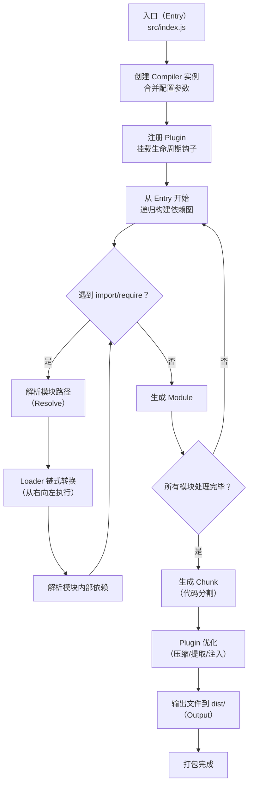

# 构建工具原理

> 模块：07-engineering（第7周 前端工程化）
> 定位：核心基础原理篇

---

## 一、核心概念

前端构建工具是前端工程化的核心基础设施，它解决了现代前端开发中"源码无法直接在浏览器中运行"的问题。随着前端项目规模从几 KB 增长到几百 MB，构建工具也从简单的文件合并演化为复杂的编译流水线。

### 前端构建工具演进

| 阶段 | 代表工具 | 解决的问题 | 局限性 |
|------|---------|-----------|--------|
| 无构建时代 | 无 | 直接编写 HTML/CSS/JS | 模块化用全局变量，文件依赖靠手动排序，无压缩混淆 |
| 任务流时代 | Grunt / Gulp | 自动化执行重复任务（压缩、合并、检查） | 只是任务编排，不具备模块打包能力，配置繁琐 |
| 打包时代 | Webpack / Rollup / Parcel | 模块化打包，资源统一管理，Tree Shaking，代码分割 | 配置复杂，大型项目构建慢 |
| 原生 ESM 时代 | Vite / Snowpack | 开发时零打包，按需编译，极速启动和 HMR | 浏览器兼容性要求高，生态不如 Webpack 成熟 |

**各阶段详细说明**：

1. **无构建时代**：使用 `<script>` 标签引入 JS 文件，依赖顺序靠手动维护，全局变量污染严重，代码无法压缩和混淆
2. **Grunt/Gulp 时代**：通过配置文件定义任务流水线，自动化执行压缩、合并、检查等操作。Gulp 基于 Node.js Stream，比 Grunt 基于文件 I/O 更快，但它们本质上只是任务编排器，不具备模块打包能力
3. **Webpack 时代**：以模块为核心理念，将一切资源（JS、CSS、图片、字体）都视为模块，通过 Loader 和 Plugin 构建出完整的依赖图，最终输出优化后的静态资源
4. **Vite 时代**：利用浏览器原生 ES Module 能力，开发时无需打包，按需编译，生产环境使用 Rollup 打包，实现了极致的开发体验

---

## 二、底层原理

### Webpack 核心概念

```javascript
// webpack.config.js 基础结构
const path = require('path')
const HtmlWebpackPlugin = require('html-webpack-plugin')

module.exports = {
  // 入口：打包的起点，Webpack 从这里开始构建依赖图
  entry: './src/index.js',

  // 输出：打包后的文件输出位置
  output: {
    path: path.resolve(__dirname, 'dist'),
    filename: 'js/[name].[contenthash:8].js',
    clean: true // 每次构建前清空 dist 目录
  },

  // 模式：development(开发) / production(生产) / none
  mode: 'production',

  // Loader：转换非 JavaScript 文件
  module: {
    rules: [
      {
        test: /\.js$/,
        exclude: /node_modules/,
        use: 'babel-loader'
      }
    ]
  },

  // Plugin：扩展 Webpack 功能
  plugins: [
    new HtmlWebpackPlugin({
      template: './public/index.html'
    })
  ],

  // 解析配置
  resolve: {
    extensions: ['.js', '.jsx', '.ts', '.tsx', '.json'],
    alias: {
      // 注意：Vite 配置文件内部支持 __dirname，但 ESM 中默认不可用
      '@': path.resolve(__dirname, 'src')
    }
  }
}
```

**核心概念解析**：

| 概念 | 说明 | 示例 |
|------|------|------|
| Entry（入口） | Webpack 打包的起点，可以是一个或多个文件 | `entry: './src/index.js'` |
| Output（输出） | 打包后的文件放在哪里，如何命名 | `output: { path: 'dist', filename: '[name].js' }` |
| Loader（转换器） | 将非 JS 文件转换为 Webpack 能识别的模块 | `babel-loader` 转换 ES6+ → ES5 |
| Plugin（插件） | 扩展 Webpack 功能，在打包生命周期中执行各种任务 | `HtmlWebpackPlugin` 生成 HTML |
| Mode（模式） | 设置 `development` / `production` / `none`，启用对应内置优化 | production 模式下自动启用压缩 |
| Chunk | 代码块，Webpack 打包过程中的中间产物，由多个 Module 组成 | 一个入口文件对应一个 Chunk |
| Bundle | 最终输出的文件，是 Chunk 经过处理和优化后的产物 | `dist/main.js` |
| Module（模块） | Webpack 中的最小单位，每个文件都是一个 Module | `./src/utils.js` |

**Chunk、Bundle、Module 的区别**：
- **Module**：源码中的每个文件都是 Module，包括 JS、CSS、图片等
- **Chunk**：Webpack 内部处理时的代码块，由多个 Module 组成。一个 Chunk 可能对应一个 Bundle，也可能多个 Chunk 合并为一个 Bundle（通过 SplitChunksPlugin）
- **Bundle**：最终构建输出的文件，是用户可以引入的、经过压缩优化的最终产物

### Webpack 打包流程

Webpack 的完整打包流程分为以下几个阶段：

```
初始化参数 → 开始编译 → 确定入口 → 编译模块 → 完成编译 → 输出资源 → 输出完成
```

**详细步骤**：

1. **初始化参数**：从 `webpack.config.js` 和命令行参数中读取配置，合并为最终配置对象
2. **创建 Compiler**：用合并后的配置初始化 Compiler 对象，它是 Webpack 的核心引擎，负责控制整个编译流程
3. **加载插件**：依次调用所有 Plugin 的 `apply` 方法，将 Compiler 对象传入，让 Plugin 注册到编译生命周期钩子上
4. **run 开始编译**：调用 Compiler 的 `run` 方法，正式启动编译
5. **从 Entry 开始递归构建依赖图**：从入口文件开始，通过 Loader 转换模块，解析模块依赖（`import` / `require`），递归处理所有依赖的模块，形成依赖图（Module Graph）
6. **Loader 转换模块**：对于每个 Module，按照配置的 rules 匹配对应 Loader，从右向左（或从下向上）链式调用 Loader 进行转换
7. **生成 Chunk**：将 Module 按照入口和代码分割策略，组合成不同的 Chunk
8. **输出文件**：将 Chunk 写入文件系统，生成最终 Bundle

> **生活化类比**：搬家打包——把所有东西（模块）分门别类打包进箱子（bundle），贴上标签（hash），搬到新家（部署）。Loader 是把非标准物品（图片、CSS）变成标准包装，Plugin 是搬家公司的项目经理——Loader 负责打包每个物品（文件转换），Plugin 负责统筹全局：决定什么时候开始打包、打包完要不要贴标签（hash）、要不要生成物品清单（HTML 文件）、要不要把重物分开放（代码分割）。没有项目经理，搬家照样能进行，但效率和质量会大打折扣。

**Webpack 打包完整流程图**：



> Webpack 的打包流程以**入口文件**为起点，通过 import/require 递归构建模块依赖图。每个模块经过 Resolve 解析和 Loader 链式转换后，最终被组合为 Chunk 并通过 Plugin 优化输出。Loader 负责"翻译"不同类型的文件，Plugin 则在整个生命周期中通过钩子机制介入，二者协作完成从源码到部署包的完整构建。

```javascript
// 简化版的 Webpack 打包流程伪代码
class Compiler {
  constructor(config) {
    this.config = config
    this.hooks = {
      run: new SyncHook(),
      compile: new SyncHook(),
      emit: new AsyncSeriesHook(),
      done: new SyncHook()
    }
  }

  run() {
    this.hooks.run.call()
    this.compile()
  }

  compile() {
    this.hooks.compile.call()
    // 1. 从 entry 开始解析
    const entryModule = this.parseModule(this.config.entry)
    // 2. 递归构建依赖图
    const moduleGraph = this.buildModuleGraph(entryModule)
    // 3. 生成 Chunk
    const chunks = this.emitChunks(moduleGraph)
    // 4. 输出文件
    this.emitAssets(chunks)
    this.hooks.done.call()
  }

  parseModule(filePath) {
    // 读取文件内容
    const source = fs.readFileSync(filePath, 'utf-8')
    // 通过 Loader 链转换
    const transformed = this.applyLoaders(filePath, source)
    // 解析 AST，提取依赖
    const dependencies = this.parseDependencies(transformed)
    return { filePath, source: transformed, dependencies }
  }
}
```

> 📖 **参考链接**：
> - [Webpack官方文档 - 核心概念](https://webpack.docschina.org/concepts/)

### Loader 和 Plugin 的区别

这是 Webpack 面试中最核心的问题之一。

| 维度 | Loader | Plugin |
|------|--------|--------|
| 作用 | 文件转换器，将非 JS 文件转换为 Webpack 能处理的模块 | 扩展 Webpack 功能，在打包生命周期中执行各种任务 |
| 处理对象 | 单个文件（模块） | 整个打包流程 |
| 执行时机 | 在模块加载时，对模块源码进行转换 | 在 Webpack 生命周期的各个钩子中执行 |
| 调用方式 | 链式调用，从右向左（或从下向上） | 通过 hooks 注册，按照 tap 的顺序执行 |
| 典型示例 | `babel-loader`、`css-loader`、`style-loader` | `HtmlWebpackPlugin`、`MiniCssExtractPlugin` |
| 编写方式 | 导出一个函数，接收 source，返回转换后的内容 | 导出一个类，包含 `apply` 方法，接收 Compiler 对象 |

**Loader 链式调用原理**：

```javascript
// 配置：use: ['style-loader', 'css-loader', 'sass-loader']
// 执行顺序：sass-loader → css-loader → style-loader（从右向左）

// 简化版 Loader 实现
function myLoader(source) {
  // source 是上一个 loader 处理后的结果（或原始文件内容）
  const result = transform(source)
  return result
}

// 每个 Loader 就是一个函数：source => transformedSource
```

**Plugin 钩子机制**：

```javascript
// 简化版 Plugin 实现
class MyPlugin {
  apply(compiler) {
    // 在 emit 阶段（输出资源之前）执行
    compiler.hooks.emit.tap('MyPlugin', (compilation) => {
      // compilation 包含所有模块和资源信息
      console.log('即将输出资源...')
    })
  }
}
```

### 常用 Loader

| Loader | 作用 | 使用场景 |
|--------|------|----------|
| `babel-loader` | 将 ES6+ 代码转换为 ES5，兼容旧浏览器 | 处理 JS/JSX 文件 |
| `ts-loader` | 编译 TypeScript 为 JavaScript | TypeScript 项目 |
| `css-loader` | 解析 CSS 中的 `@import` 和 `url()` | 处理 CSS 文件 |
| `style-loader` | 将 CSS 以 `<style>` 标签注入 DOM | 开发环境 |
| `sass-loader` / `less-loader` | 编译 Sass/Less 为 CSS | 使用预处理器 |
| `postcss-loader` | 通过 PostCSS 插件处理 CSS（如 autoprefixer） | 自动添加浏览器前缀 |
| `file-loader` | 将文件复制到输出目录，返回文件路径 | 处理图片、字体等静态资源 |
| `url-loader` | 类似 file-loader，但小于阈值时转为 base64 内联 | 减少小文件 HTTP 请求 |
| `vue-loader` | 解析 `.vue` 单文件组件 | Vue 项目 |
| `eslint-webpack-plugin` | 在构建时执行 ESLint 检查（替代已废弃的 eslint-loader） | 代码质量检查 |

```javascript
// Webpack 5 中，file-loader 和 url-loader 已被内置 Asset Modules 替代
module.exports = {
  module: {
    rules: [
      {
        test: /\.(png|jpg|gif|svg)$/,
        type: 'asset', // asset/resource(file-loader) / asset/inline(url-loader)
        parser: {
          dataUrlCondition: {
            maxSize: 8 * 1024 // 8KB 以下转为 base64
          }
        }
      }
    ]
  }
}
```

### 常用 Plugin

| Plugin | 作用 | 使用场景 |
|--------|------|----------|
| `HtmlWebpackPlugin` | 自动生成 HTML 文件，注入打包后的 JS/CSS | 所有项目 |
| `MiniCssExtractPlugin` | 将 CSS 提取为独立的 `.css` 文件 | 生产环境 |
| `TerserWebpackPlugin` | 压缩和混淆 JavaScript 代码 | 生产环境 |
| `CssMinimizerWebpackPlugin` | 压缩 CSS 代码 | 生产环境 |
| `DefinePlugin` | 在编译时定义全局常量，替代环境变量 | 区分开发/生产环境 |
| `CopyWebpackPlugin` | 将静态文件从源目录复制到输出目录 | 复制 public 目录下的文件 |
| `BundleAnalyzerPlugin` | 可视化分析打包后的文件大小和组成 | 优化打包体积 |
| `CompressionWebpackPlugin` | 生成 gzip 压缩版本的文件 | 生产环境，配合 Nginx 使用 |
| `ForkTsCheckerWebpackPlugin` | 在单独的进程中进行 TypeScript 类型检查 | 加速构建 |

```javascript
// 常用 Plugin 配置示例
const MiniCssExtractPlugin = require('mini-css-extract-plugin')
const { DefinePlugin } = require('webpack')
const { BundleAnalyzerPlugin } = require('webpack-bundle-analyzer')

module.exports = {
  plugins: [
    new MiniCssExtractPlugin({
      filename: 'css/[name].[contenthash:8].css'
    }),
    new DefinePlugin({
      'process.env.API_BASE': JSON.stringify('https://api.example.com')
    }),
    new BundleAnalyzerPlugin({
      analyzerMode: 'static', // 生成静态 HTML 报告
      openAnalyzer: false
    })
  ]
}
```

### Vite 原理

Vite（法语"快"的意思）由 Vue.js 作者尤雨溪开发，利用浏览器原生 ES Module 能力，实现了开发环境下的零打包。

**开发环境原理**：

```
浏览器请求 → Vite Dev Server → 拦截请求 → 按需编译 → 返回 ES Module
```

1. **利用浏览器原生 ESM**：Vite 在开发环境下直接将源码作为 ES Module 提供给浏览器，不需要打包整个应用
2. **esbuild 预构建依赖**：使用 Go 语言编写的 esbuild 对 `node_modules` 中的依赖进行预构建，速度比 Webpack 快 10-100 倍
3. **按需编译**：只编译浏览器当前请求的模块，而不是一次性编译所有文件
4. **热更新（HMR）**：基于 ES Module 的 HMR 实现，只更新变更的模块，不需要重新打包

**生产环境原理**：

Vite 生产环境使用 Rollup 打包（Vite 7-）/ Rolldown 打包（Vite 8+），保证兼容性和优化效果。esbuild 用于代码压缩。

```javascript
// vite.config.js 示例
import { defineConfig } from 'vite'
import vue from '@vitejs/plugin-vue'
import path from 'path'

export default defineConfig({
  plugins: [vue()],
  resolve: {
    alias: {
      '@': path.resolve(__dirname, 'src')
    }
  },
  server: {
    port: 3000,
    proxy: {
      '/api': {
        target: 'http://localhost:8080',
        changeOrigin: true
      }
    }
  },
  build: {
    // 生产环境 Rollup 配置
    rollupOptions: {
      output: {
        manualChunks: {
          vendor: ['vue', 'vue-router', 'pinia']
        }
      }
    }
  }
})
```

> 📖 **参考链接**：
> - [Vite官方文档](https://cn.vitejs.dev/guide/)
> - [Vite官方文档 - 为什么选Vite](https://cn.vitejs.dev/guide/why)
> - [esbuild官方文档](https://esbuild.github.io/)

### Vite 热更新（HMR）原理

Vite 的 HMR 基于 WebSocket 和原生 ESM 实现，流程如下：

```
文件变更 → chokidar 文件监听 → 模块图更新 → WebSocket 推送 → 浏览器接收更新 → 请求更新模块 → HMR 热替换
```

**详细步骤**：

1. **文件监听**：Vite 使用 `chokidar` 监听文件系统的变化
2. **模块图更新**：当文件发生变化时，Vite 在模块图中标记该模块及其所有依赖方为"已失效"
3. **WebSocket 推送**：Vite Dev Server 通过 WebSocket 连接向浏览器发送更新消息，消息包含变更模块的路径
4. **浏览器接收更新**：浏览器中的 HMR Runtime 接收 WebSocket 消息
5. **请求更新模块**：浏览器向 Dev Server 重新请求变更的模块，同时在请求 URL 上添加时间戳避免缓存
6. **HMR 热替换**：HMR Runtime 调用对应框架的 HMR API（如 `import.meta.hot.accept()`），执行热替换逻辑

```javascript
// 在模块中使用 HMR API
if (import.meta.hot) {
  import.meta.hot.accept((newModule) => {
    // 接受自身更新，执行热替换
    console.log('模块热更新完成', newModule)
  })

  import.meta.hot.dispose(() => {
    // 在模块被替换前清理副作用
    clearInterval(timer)
  })
}
```

> **生活类比**：
> - **Webpack vs Vite 开发模式**：传统自助餐（Webpack）是一次性把所有菜端上来，你吃不吃都摆着（全量打包）；Vite 是你点什么菜后厨现做（按需编译），所以启动极快。等正式上菜（生产构建）时大家菜单都一样，再用 Rollup 统一打包。
> - **esbuild 预构建**：就像预制菜——把常用依赖（React、Vue、Lodash）提前处理成半成品放冰箱，用时直接加热（ESM 导入），不用每次从头洗菜切菜（CommonJS 转 ESM）。
> - **HMR 热更新**：就像换灯泡——只换坏的那个灯泡（修改的模块），不需要重新装修整个房间（全量刷新页面）。Vite 只重新请求修改过的模块，其他模块保持原样。

### Webpack vs Vite 对比

| 维度 | Webpack | Vite |
|------|---------|------|
| 开发启动速度 | 几十秒到几分钟（大型项目），需要先打包整个应用 | 秒级启动，利用原生 ESM 按需编译 |
| HMR 速度 | 秒级，随着项目增大而变慢 | 毫秒级，只更新变更模块 |
| 构建速度 | 较慢，但生态成熟，优化手段丰富 | 开发阶段极快，生产构建使用 Rollup |
| 生态成熟度 | 成熟，插件和 Loader 极其丰富 | 快速成长，基本覆盖主流场景 |
| 浏览器兼容性 | 通过配置可支持所有浏览器，包括 IE11（需 Babel 转译） | 开发环境需要支持 ESM 的现代浏览器 |
| 生产构建 | 成熟的代码分割和 Tree Shaking | 基于 Rollup，输出优化好 |
| 配置复杂度 | 较复杂，但有大量文档和社区支持 | 简洁，开箱即用 |
| TypeScript 支持 | 需要配置 ts-loader 或 babel | 内置支持，esbuild 直接编译 |
| CSS 处理 | 需要配置 css-loader + style-loader | 内置支持 CSS、Less、Sass |

### Vite 6：Environment API 与 Rolldown（2024 年 11 月发布）

Vite 6 于 2024 年 11 月 26 日正式发布，引入了 Environment API 这一重大架构变化。Environment API 允许为不同的运行环境（客户端、SSR、Workers 等）创建独立的构建配置和插件管道。同时，Vite 团队正在开发 **Rolldown**——一个用 Rust 编写的高性能打包器，计划在未来替代 Vite 生产构建中的 Rollup 和 esbuild。

**Rolldown 简介**：

Rolldown 由 Vite 团队（尤雨溪主导）开发，是用 Rust 编写的新一代 JavaScript 打包器，目标是兼容 Rollup 的插件 API 和配置方式，同时利用 Rust 的性能优势。Rolldown 在 Vite 6 中以 `rolldown-vite` 包形式提供实验性预览，Vite 7 进一步集成，Vite 8（2025 年 12 月 Beta）起作为默认生产构建引擎，全面替代 Rollup 和 esbuild。

| 维度 | Rollup（旧） | Rolldown（当前） |
|------|-------------|---------------|
| 开发语言 | JavaScript | Rust |
| 构建速度 | 中等 | 接近 esbuild 级别 |
| 插件兼容性 | 原生 Rollup 插件 | 兼容 Rollup 插件 API |
| 与 Vite 关系 | Vite 5 生产构建引擎 | Vite 8+ 默认生产构建引擎 |
| 状态 | 成熟稳定 | Beta（Vite 8，2025-12） |

**核心变化**：

| 维度 | Vite 5 | Vite 6 |
|------|--------|--------|
| 环境抽象 | 隐式的客户端 + SSR 双环境 | 显式的多环境 API（Environment API） |
| 插件兼容性 | 插件需判断环境 | 插件可声明目标环境 |
| 构建配置 | 统一配置 | 按环境独立配置 |
| HMR | 仅客户端 | 可为任意环境启用 HMR |
| Node.js 要求 | 18+ | 18+（推荐 20+） |

```javascript
// vite.config.js - Vite 6 Environment API 示例
import { defineConfig } from 'vite'

export default defineConfig({
  environments: {
    client: {
      // 浏览器环境配置
      build: {
        outDir: 'dist/client',
        rollupOptions: {
          input: 'src/client-entry.js'
        }
      },
      dev: {
        hmr: true
      }
    },
    server: {
      // SSR 环境配置
      build: {
        outDir: 'dist/server',
        rollupOptions: {
          input: 'src/server-entry.js'
        }
      },
      resolve: {
        // 服务端专用条件导出
        conditions: ['node']
      }
    },
    worker: {
      // Web Worker 环境配置
      build: {
        outDir: 'dist/worker',
        target: 'esnext'
      }
    }
  }
})
```

**Vite 5 → Vite 6 迁移要点**：
- Environment API 为可选特性，Vite 5 配置仍可正常工作
- 废弃了部分旧 API（如 `server.ssr` 配置，改用 `environments.server`）
- CSS 处理引擎升级，支持更快的 CSS 编译
- 内置支持 `@import` 中 `url()` 的自动重写

> 📖 **参考链接**：
> - [Rolldown官方文档](https://rolldown.rs/)

---

## 三、新一代构建工具

随着前端项目规模持续增长，传统的 JavaScript 构建工具在性能上逐渐遇到瓶颈。新一代构建工具利用 Rust、Go 等高性能语言重写核心模块，大幅提升了构建速度。

### 1. Rspack 核心原理

Rspack 是由字节跳动团队开发的高性能 JavaScript 打包工具，核心用 Rust 语言编写，设计目标是与 Webpack 保持高度兼容。

**核心特性**：

- **Rust 实现**：核心模块（解析、转换、代码生成）全部用 Rust 编写，利用 Rust 的零成本抽象和内存安全特性，实现比 JavaScript 快 5-10 倍的构建性能
- **Webpack 兼容性**：API 和配置项与 Webpack 高度一致，支持绝大多数 Webpack Loader 和 Plugin，迁移成本极低
- **并行编译**：利用 Rust 的并发模型，在模块解析、代码生成阶段实现真正的并行处理

```javascript
// rspack.config.js —— 与 Webpack 配置几乎一致
const rspack = require('@rspack/core');

module.exports = {
  entry: './src/index.js',
  output: {
    path: path.resolve(__dirname, 'dist'),
    filename: '[name].[contenthash:8].js',
  },
  module: {
    rules: [
      {
        test: /\.jsx?$/,
        use: 'builtin:swc-loader', // Rspack 内置的 SWC loader
      },
      {
        test: /\.css$/,
        use: ['style-loader', 'css-loader'],
      },
    ],
  },
  plugins: [
    new rspack.HtmlRspackPlugin({
      template: './public/index.html',
    }),
  ],
  resolve: {
    extensions: ['.js', '.jsx', '.ts', '.tsx'],
    alias: { '@': path.resolve(__dirname, 'src') },
  },
};
```

**性能对比**（大型项目约 1000 个模块基准测试）：

| 指标 | Webpack 5 | Rspack |
|------|-----------|--------|
| 冷启动 | ~25s | ~2s |
| 热启动 | ~10s | ~0.8s |
| HMR | ~2s | ~0.1s |
| 生产构建 | ~45s | ~5s |
| 内存占用 | ~1.2GB | ~400MB |

### 2. Turbopack 核心原理

Turbopack 是 Vercel 团队开发的增量打包工具，由 Webpack 作者 Tobias Koppers 主导设计，使用 Rust 编写，是 Next.js 的默认开发构建工具。

**核心特性**：

- **增量计算**：Turbopack 核心创新在于函数级别的缓存和增量计算。当文件发生变化时，只有受影响的部分重新计算，而非整个模块
- **请求级编译**：开发模式下只编译浏览器请求的页面所需模块，而非一次性编译整个应用
- **内存缓存**：在内存中维护模块依赖图，避免重复的文件 I/O 操作

```javascript
// next.config.js —— Turbopack 通过 Next.js 配置
module.exports = {
  // Next.js 14+ 使用 --turbo 标志启用 Turbopack
  // pnpm dev --turbo
  experimental: {
    turbo: {
      rules: {
        // 自定义 Turbopack 规则
        // 注意：Turbopack 使用独立 loader 系统，Webpack loader 不直接兼容
        '*.svg': {
          loaders: ['@svgr/webpack'],
          as: '*.js',
        },
      },
      resolveAlias: {
        '@': './src',
      },
    },
  },
};
```

**Turbopack 的增量计算机制**：

```
文件变更 → 定位受影响模块 → 仅重新计算这些模块 → 更新模块图 → 推送变更
```

传统打包工具需要重新构建整个依赖图或大量模块，而 Turbopack 通过函数级缓存，只重新计算变更模块及其直接依赖，做到了 O(变更模块数) 的复杂度。

### 3. 构建工具全面对比

| 维度 | Webpack 5 | Vite | Rspack | Turbopack | esbuild | Farm | Rolldown |
|------|-----------|------|--------|-----------|---------|------|---------|
| 开发语言 | JavaScript | TypeScript (Go/esbuild) | Rust | Rust | Go | Rust | Rust |
| 开发启动速度 | 慢（全量打包） | 快（按需 ESM） | 快（Rust 编译） | 极快（增量计算） | 极快（Go 编译） | 快（Rust 编译） | 极快（Rust 编译） |
| 生产构建速度 | 中等 | 快（Rolldown，Vite 8+） | 快（Rust） | 快（Rust） | 极快（Go） | 快（Rust） | 极快（Rust） |
| HMR 速度 | 秒级 | 毫秒级 | 毫秒级 | 毫秒级 | 不内置（仅打包器） | 毫秒级 | 不内置（仅打包器） |
| Webpack 兼容性 | 完全兼容 | 不兼容 | 高度兼容 | 部分兼容 | 不兼容 | 部分兼容 | 不兼容 |
| Rollup 兼容性 | 不兼容 | 兼容 | 不兼容 | 不兼容 | 不兼容 | 不兼容 | 兼容 Rollup 插件 API |
| 生态成熟度 | 极高 | 高 | 中等 | 中低 | 低 | 低 | 中（Vite 8 Beta，快速增长） |
| 插件系统 | 极其丰富 | 兼容 Rollup | Webpack 兼容 | 自有系统 | 极简 | 自有系统 | 兼容 Rollup |
| 学习曲线 | 陡峭 | 平缓 | 中等（类 Webpack） | 中等 | 平缓 | 中等 | 平缓（类 Rollup） |
| 框架支持 | 全部 | Vue/React 优先 | 全部 | Next.js 专属 | 通用 | 全部 | 通用（面向 Vite 生态） |
| Code Splitting | 完善 | 完善 | 完善 | 完善 | 有限 | 完善 | 完善 |
| Tree Shaking | 完善 | 完善 | 完善 | 完善 | 基本 | 完善 | 完善 |
| CSS 处理 | 需配置 | 内置 | 需配置 | 内置 | 需配置 | 需配置 | 内置 |
| TypeScript | 需配置 | 内置 | 需配置 | 内置 | 内置 | 需配置 | 内置 |
| 浏览器兼容 | 全部 | 现代浏览器 | 全部 | 现代浏览器 | 全部 | 现代浏览器 | 现代浏览器 |
| 社区活跃度 | 极高 | 极高 | 高 | 高 | 高 | 中等 | 中（快速增长） |
| 生产可用性 | 成熟 | 成熟 | 成熟 | 成熟（Next.js） | 成熟 | 实验阶段 | Beta（Vite 8） |

### 4. 选型建议

**场景一：存量 Webpack 项目优化**

如果你的项目已经使用 Webpack，且构建速度成为瓶颈，推荐迁移到 **Rspack**。Rspack 与 Webpack 的配置高度兼容，迁移成本极低，通常只需将 `webpack.config.js` 重命名为 `rspack.config.js` 并微调少量配置即可。

```javascript
// 迁移示例：Webpack → Rspack
// 1. 安装依赖
// pnpm add @rspack/core @rspack/cli -D
// 2. 将 webpack.config.js 重命名为 rspack.config.js
// 3. 调整 loader 配置（使用 Rspack 内置 loader）
// 4. 替换 Webpack 专属 Plugin 为 Rspack 版本
```

**场景二：新项目选型**

| 项目类型 | 推荐工具 | 理由 |
|---------|---------|------|
| React/Vue 单页应用 | Vite | 开发体验极致，生态成熟，社区活跃 |
| Next.js 项目 | Turbopack（内置） | 深度集成，增量计算优势明显 |
| 大型企业级项目 | Rspack | Webpack 兼容，迁移成本低，性能优秀 |
| 工具库 / 组件库 | esbuild 或 Rollup | 轻量快速，输出干净 |
| 追求极致性能 | Rspack 或 Farm | Rust 底层，大型项目优势明显 |

**场景三：从 Webpack 迁移到 Vite**

如果选择 Vite，需要注意：
- 开发环境依赖浏览器 ESM 支持，生产环境使用 Rollup
- Webpack 的 `require.context` 等特性不支持
- 环境变量使用 `import.meta.env.VITE_*` 而非 `process.env`
- CSS Modules 的文件名需改为 `*.module.css`
- 静态资源引用方式不同（`new URL('./img.png', import.meta.url)`）

**总结建议**：

1. **新项目优先考虑 Vite**：开发体验最好，社区最活跃，插件生态完善
2. **Webpack 项目迁移首选 Rspack**：几乎零成本获得 5-10 倍性能提升
3. **Next.js 项目使用 Turbopack**：官方集成，无需额外配置
4. **构建性能极致追求者**：关注 Rspack 和 Farm 的发展，两者都在快速迭代
5. **esbuild 适合工具链中的特定环节**：如 Vite 的预构建和代码压缩，而非完整打包方案

---

## 四、CSS 工具链

### Tailwind CSS v4：Oxide 引擎与 @theme 配置

Tailwind CSS v4 引入 Oxide 引擎（Rust 重写），性能提升 10 倍以上；同时引入 `@theme` 指令替代 `tailwind.config.js` 配置。

**核心变化**：

| 维度 | v3 | v4 |
|------|------|------|
| 引擎 | JavaScript（PostCSS 插件） | Rust 原生引擎（Oxide），速度提升 10 倍+ |
| 配置方式 | `tailwind.config.js` | CSS `@theme` 指令 |
| 框架集成 | 通过 PostCSS 插件 | 原生 Vite 插件（`@tailwindcss/vite`） |
| 暗色模式 | `darkMode: 'class'` | 原生支持 `light-dark()` 和 `color-scheme` |
| CSS 层级 | 手动管理 | 自动使用 CSS `@layer` 管理优先级 |

```css
/* Tailwind CSS v4 配置：使用 CSS @theme 替代 tailwind.config.js */
@import "tailwindcss";

@theme {
  --color-primary: #4f46e5;
  --color-primary-light: #818cf8;
  --color-secondary: #ec4899;
  --font-size-xxl: 2rem;
  --breakpoint-tablet: 768px;
  --spacing-section: 4rem;
}
```

```javascript
// vite.config.js - Vite 中使用 Tailwind CSS v4
import { defineConfig } from 'vite'
import tailwindcss from '@tailwindcss/vite'

export default defineConfig({
  plugins: [
    tailwindcss(), // 原生 Vite 插件，无需 PostCSS 配置
  ]
})
```

**v3 → v4 迁移要点**：
- 安装 `@tailwindcss/vite` 替代 `tailwindcss` PostCSS 插件
- 将 `tailwind.config.js` 中的配置迁移到 CSS 的 `@theme` 块
- 颜色类名语法不变（`bg-primary` 等），向后兼容

---

## 五、实战应用

### 1. Webpack 多页面应用配置

```javascript
// webpack.config.js - 多入口配置
const path = require('path')
const HtmlWebpackPlugin = require('html-webpack-plugin')

const pages = ['index', 'about', 'admin']

module.exports = {
  entry: pages.reduce((entries, page) => {
    entries[page] = `./src/pages/${page}/index.js`
    return entries
  }, {}),

  plugins: pages.map(page =>
    new HtmlWebpackPlugin({
      template: `./src/pages/${page}/index.html`,
      filename: `${page}.html`,
      chunks: [page] // 只注入该页面相关的 chunk
    })
  )
}
```

### 2. Vite 项目从零搭建

```bash
# 创建项目
pnpm create vite my-app --template vue-ts

# 目录结构
# my-app/
#   ├── index.html         # 入口 HTML（Vite 不会自动生成）
#   ├── src/
#   │   ├── main.ts        # 应用入口
#   │   ├── App.vue
#   │   └── components/
#   ├── vite.config.ts     # Vite 配置
#   ├── tsconfig.json
#   └── package.json
```

### 3. 生产环境构建优化

```javascript
// Webpack 生产环境优化配置
module.exports = {
  mode: 'production',
  optimization: {
    // 代码分割
    splitChunks: {
      chunks: 'all',
      cacheGroups: {
        vendor: {
          test: /[\\/]node_modules[\\/]/,
          name: 'vendor',
          priority: 10
        },
        common: {
          minChunks: 2,
          priority: 5,
          reuseExistingChunk: true
        }
      }
    },
    // 运行时单独提取
    runtimeChunk: 'single',
    // 压缩
    minimizer: [
      new TerserPlugin({
        terserOptions: {
          compress: { drop_console: true }
        }
      }),
      new CssMinimizerPlugin()
    ]
  }
}
```

### 4. Vite 环境变量配置

```typescript
// .env.development
VITE_API_BASE=http://localhost:3000/api
VITE_APP_TITLE=开发环境

// .env.production
VITE_API_BASE=https://api.example.com
VITE_APP_TITLE=生产环境

// 代码中使用
console.log(import.meta.env.VITE_API_BASE)
console.log(import.meta.env.MODE) // 'development' | 'production'
```

---

## 六、常见面试题

### 1. Webpack 的打包流程是什么？

**回答要点**：初始化参数（合并配置）→ 创建 Compiler → 加载 Plugin → run 开始编译 → 从 Entry 入口递归构建依赖图 → Loader 转换每个 Module → 生成 Chunk → 输出文件到 dist。要强调 Loader 是从右向左链式执行，Plugin 是在生命周期钩子中执行。

### 2. Loader 和 Plugin 有什么区别？

**回答要点**：Loader 是文件转换器，处理单个文件，将非 JS 文件转换为 Webpack 能识别的模块，链式调用从右向左。Plugin 是功能扩展器，在 Webpack 整个打包生命周期中执行，通过 hooks 机制介入打包流程，可以做 Loader 做不到的事情（如生成 HTML、提取 CSS、压缩代码）。

### 3. Vite 为什么快？

**回答要点**：开发环境利用浏览器原生 ESM 能力，不需要打包整个应用，按需编译；使用 esbuild 预构建依赖（Go 语言编写，速度极快）；HMR 基于 ES Module，只更新变更的模块；生产环境使用 Rollup 打包（Vite 7-）/ Rolldown 打包（Vite 8+），保证兼容性和优化效果。

### 4. Tree Shaking 的原理和实现条件？

**回答要点**：Tree Shaking 基于 ES Module 的静态导入特性（`import` 和 `export`），在编译时分析模块之间的依赖关系，移除未被引用的代码（dead code）。实现条件：必须使用 ES Module（不能是 CommonJS），在 `package.json` 中设置 `"sideEffects": false` 或指定副作用文件，生产模式下 Webpack 会自动开启。

> 📖 **参考链接**：
> - [Webpack官方文档 - Tree Shaking](https://webpack.docschina.org/guides/tree-shaking/)

### 5. Webpack 的热更新（HMR）原理是什么？

**回答要点**：Webpack 通过 WebSocket 在浏览器和 Dev Server 之间建立连接。文件变更时，Webpack 重新编译变更模块，通过 WebSocket 推送 hash 事件和更新清单到浏览器，浏览器请求变更模块的增量更新，HMR Runtime 执行 `module.hot.accept()` 完成热替换。

---

## 七、避坑指南

| 常见错误 | 现象 | 原因 | 解决方案 |
|---------|------|------|----------|
| 开发环境使用 style-loader 生产环境未提取 CSS | 生产环境 CSS 通过 JS 注入，闪屏 | style-loader 将 CSS 注入 DOM，不是独立文件 | 生产环境使用 MiniCssExtractPlugin 提取 CSS |
| Loader 配置顺序错误 | 构建报错或样式不生效 | Loader 从右向左执行，顺序错误导致转换失败 | 确保 use 数组顺序正确，如 `['style-loader', 'css-loader', 'sass-loader']` |
| 开发环境正常，生产环境报错 | 构建产物在浏览器中运行报错 | 生产构建时某些 polyfill 或配置缺失 | 检查 babel 配置和 browserslist，确保兼容目标浏览器 |
| Vite 项目中 import 图片路径报错 | 页面无法加载图片 | Vite 的静态资源处理方式与 Webpack 不同 | 使用 `new URL('./img.png', import.meta.url).href` 或直接 import |
| Webpack 打包后文件过大 | 首屏加载慢，bundle 超过 1MB | 未启用代码分割和 Tree Shaking | 配置 splitChunks，使用动态 import，启用 BundleAnalyzerPlugin 分析 |
| Vite 项目兼容性问题 | 老浏览器无法运行 | Vite 默认不处理 ES6+ 语法和 API polyfill | 使用 @vitejs/plugin-legacy 插件 |
| 开发环境 proxy 配置不当 | 接口请求 404 或跨域 | 代理配置路径或目标地址不正确 | 检查 proxy 配置的 path 和 target，注意路径重写 |
| 忽略 .gitignore 中的 dist 目录 | dist 被提交到 Git 仓库 | 未在 .gitignore 中忽略构建产物 | 在 .gitignore 中添加 `/dist` 或 `/build` |

---

> **学习导航**：
> - 返回 [学习路线总览](../README.md)
> - 本模块其他原理文件：[02-工程规范与流程](./02-工程规范与流程.md) | [03-前端工程化笔面试题集](./03-前端工程化笔面试题集.md)
> - 实战应用：[企业后台管理系统](../10-project/01-企业后台管理系统实战.md)

## 八、本章学习自检

- [ ] 我能说出前端构建工具的演进历程（无构建→Grunt/Gulp→Webpack→Vite）
- [ ] 我理解 Webpack 的六个核心概念：Entry、Output、Loader、Plugin、Mode、Chunk
- [ ] 我能清晰区分 Chunk、Bundle、Module 三者的区别
- [ ] 我能完整描述 Webpack 的打包流程（初始化→编译→输出）
- [ ] 我能说出 Loader 和 Plugin 的核心区别，以及各自的使用场景
- [ ] 我能列举至少 5 个常用 Loader 和 5 个常用 Plugin
- [ ] 我理解 Vite 的开发环境原理（浏览器原生 ESM + esbuild 预构建 + 按需编译）
- [ ] 我能描述 Vite 热更新（HMR）的完整流程
- [ ] 我能从启动速度、HMR、生态、兼容性等维度对比 Webpack 和 Vite
- [ ] 我能描述 Rspack 的核心原理（Rust 实现、Webpack 兼容性、性能对比）
- [ ] 我能解释 Turbopack 的增量计算机制和与 Next.js 的集成方式
- [ ] 我能从 16 个维度对比 Webpack、Vite、Rspack、Turbopack、esbuild、Farm 六大构建工具
- [ ] 我能根据项目类型（新项目、存量迁移、Next.js、工具库）做出合理的构建工具选型
- [ ] 我能处理构建工具相关的常见坑（Loader 顺序、CSS 提取、代码分割等）