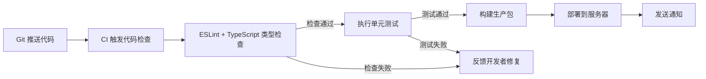

# 前端工程化 - 综合场景串联

---

## 场景一：从零搭建 React 项目工程化体系

### 场景描述
从零搭建一个 React + TypeScript 项目的完整工程化体系，包含 Vite 构建配置、ESLint + Prettier 代码规范、Husky + lint-staged + commitlint 提交拦截、GitHub Actions CI/CD 流水线，实现从代码编写到自动部署的全链路工程化覆盖。

**前端 CI/CD 全链路流程图：**



> 前端 CI/CD 流程从 Git 推送开始，经过代码检查、单元测试、构建和部署，最终通知相关人员。任一环节失败则立即反馈，确保只有通过全部检查的代码才能进入生产环境。

### 涉及知识点
- [构建工具原理](./01-构建工具原理.md)：Vite 配置、环境变量、代理、构建优化
- [工程规范与流程](./02-工程规范与流程.md)：ESLint + Prettier 配置、Husky + lint-staged、commitlint、Git 工作流、CI/CD 流水线、Nginx 部署

### 协作流程
1. 使用 `pnpm create vite my-app --template react-ts` 创建项目骨架
2. 配置 Vite：设置路径别名 `@` 指向 `src`、配置开发代理解决跨域、配置 manualChunks 拆分 react 和 react-dom 为独立 vendor chunk
3. 安装 ESLint + Prettier：安装 eslint、prettier、eslint-config-prettier、@typescript-eslint/parser、@typescript-eslint/eslint-plugin
4. 配置 ESLint：extends 序列为 `eslint:recommended` -> `plugin:@typescript-eslint/recommended` -> `prettier`（必须放最后关闭冲突规则）
5. 配置 Prettier：.prettierrc.js 中设置 singleQuote、semi、trailingComma、printWidth 等选项
6. 安装 Husky + lint-staged：`pnpm add -D husky lint-staged`，`pnpm exec husky init`，.husky/pre-commit 写入 `pnpm lint-staged`
7. 配置 lint-staged：package.json 中配置 `"*.{js,ts,tsx}": ["eslint --fix", "prettier --write"]`
8. 安装 commitlint：`pnpm add -D @commitlint/cli @commitlint/config-conventional`，.husky/commit-msg 写入 `pnpm exec commitlint --edit $1`
9. 配置 commitlint.config.js：定义 type-enum 包含 feat/fix/docs/style/refactor/perf/test/chore/ci/revert
10. 编写 GitHub Actions 流水线：创建 .github/workflows/ci-cd.yml，配置 push 到 main 分支触发 lint -> test -> build -> deploy 串行执行
11. Nginx 部署配置：SPA 路由 fallback `try_files $uri $uri/ /index.html`、gzip 压缩、静态资源强缓存 `expires 1y`、API 反向代理

### 关键要点
- 构建工具选型：新项目优先选择 Vite，开发体验极致，只在生态插件强依赖 Webpack 时考虑 Webpack
- ESLint 与 Prettier 分工：ESLint 管代码质量（"对不对"），Prettier 管代码格式（"好不好看"），通过 eslint-config-prettier 协调两者
- 提交拦截链：pre-commit 钩子触发 lint-staged 对暂存文件执行 ESLint --fix 和 Prettier --write，commit-msg 钩子触发 commitlint 校验提交信息，两层拦截确保入库代码质量
- CI/CD 流水线：使用 --frozen-lockfile 锁定依赖版本避免环境差异，敏感信息通过 GitHub Secrets 管理，lint 和 test 通过后才执行 build 和 deploy
- 缓存策略：HTML 入口文件使用协商缓存（Cache-Control: no-cache），JS/CSS 使用文件名哈希 + 强缓存（Cache-Control: max-age=31536000, immutable），内容更新时哈希变化自动触发新请求

---

## 场景二：Monorepo 架构下的多应用工程化管理

### 场景描述
使用 pnpm workspaces 搭建 Monorepo 项目，包含共享工具库（shared）、公共 UI 组件库（ui）、主站 Web 应用和后台管理 Admin 应用，统一 ESLint/Prettier/TypeScript 配置，通过 Turborepo 管理构建流水线，实现代码共享和原子提交。

### 涉及知识点
- [构建工具原理](./01-构建工具原理.md)：Vite 多应用配置
- [工程规范与流程](./02-工程规范与流程.md)：pnpm workspaces、Monorepo 架构、Turborepo 构建加速、统一配置管理

### 协作流程
1. 创建根目录结构：pnpm-workspace.yaml 定义 `packages: ['packages/*', 'apps/*']`
2. 创建 packages/shared：存放公共类型定义和工具函数，package.json 中 name 为 `@my-app/shared`
3. 创建 packages/ui：存放公共 UI 组件库，package.json 中 name 为 `@my-app/ui`
4. 创建 apps/web 和 apps/admin：两个独立应用，各自配置 Vite
5. 子包引用：在 apps/web/package.json 中添加 `"@my-app/shared": "workspace:*"` 和 `"@my-app/ui": "workspace:*"`
6. 统一配置：根目录放置 tsconfig.base.json、eslint.config.mjs（ESLint 9+ Flat Config）、.prettierrc.cjs，各子包通过 extends 继承
7. 配置 turbo.json：build 任务 dependsOn `["^build"]`（先构建依赖包），lint 和 test 无依赖可并行，dev 任务 cache: false + persistent: true
8. 根 package.json 脚本：`"dev:web": "pnpm --filter @my-app/web dev"`、`"build:all": "pnpm -r build"`、`"lint": "pnpm -r lint"`
9. CI/CD 适配：GitHub Actions 中先执行 lint 和 test，再通过 Turborepo 执行构建，利用远程缓存加速

### 关键要点
- 包边界划分：shared 放纯类型定义和工具函数（无 UI 依赖），ui 放通用组件（依赖 shared），apps 放业务应用（依赖 shared 和 ui），避免循环依赖
- 依赖版本统一：在根 package.json 的 pnpm.overrides 中统一管理公共依赖版本，避免多版本冲突
- 构建加速：Turborepo 增量构建只构建变更包及其依赖方，远程缓存团队共享构建结果，并行执行无依赖任务
- 幽灵依赖防护：pnpm 的非扁平化结构确保包只能访问自身声明的依赖，避免因幽灵依赖导致的"在我机器上能跑"问题

---

## 完整可运行示例：Webpack 配置分离（开发/生产）

```javascript
// webpack.common.js - 公共配置
const path = require('path');
const HtmlWebpackPlugin = require('html-webpack-plugin');
const { DefinePlugin } = require('webpack');

module.exports = {
  entry: path.resolve(__dirname, 'src/index.tsx'),

  resolve: {
    extensions: ['.ts', '.tsx', '.js', '.jsx', '.json'],
    alias: {
      '@': path.resolve(__dirname, 'src'),
      '@components': path.resolve(__dirname, 'src/components'),
      '@utils': path.resolve(__dirname, 'src/utils'),
      '@hooks': path.resolve(__dirname, 'src/hooks'),
      '@assets': path.resolve(__dirname, 'src/assets'),
    },
  },

  module: {
    rules: [
      {
        test: /\.(ts|tsx)$/,
        exclude: /node_modules/,
        use: {
          loader: 'babel-loader',
          options: {
            presets: [
              ['@babel/preset-env', { targets: '> 0.25%, not dead', useBuiltIns: 'usage', corejs: 3 }],
              ['@babel/preset-react', { runtime: 'automatic' }],
              '@babel/preset-typescript',
            ],
          },
        },
      },
      {
        test: /\.css$/,
        use: ['style-loader', 'css-loader', 'postcss-loader'],
      },
      {
        test: /\.less$/,
        use: ['style-loader', 'css-loader', 'postcss-loader', 'less-loader'],
      },
      {
        test: /\.(png|jpe?g|gif|webp)$/i,
        type: 'asset',
        parser: {
          dataUrlCondition: {
            maxSize: 8 * 1024, // 8KB 以下转 base64
          },
        },
        generator: {
          filename: 'images/[name].[hash:8][ext]',
        },
      },
      {
        test: /\.(woff|woff2|eot|ttf|otf)$/,
        type: 'asset/resource',
        generator: {
          filename: 'fonts/[name].[hash:8][ext]',
        },
      },
      {
        test: /\.svg$/,
        use: ['@svgr/webpack'],
      },
    ],
  },

  plugins: [
    new HtmlWebpackPlugin({
      template: path.resolve(__dirname, 'public/index.html'),
      favicon: path.resolve(__dirname, 'public/favicon.ico'),
      inject: true,
    }),
    new DefinePlugin({
      'process.env.APP_VERSION': JSON.stringify(require('./package.json').version),
    }),
  ],
};
```

```javascript
// webpack.dev.js - 开发环境配置
const { merge } = require('webpack-merge');
const common = require('./webpack.common.js');
const path = require('path');
const ReactRefreshWebpackPlugin = require('@pmmmwh/react-refresh-webpack-plugin');
const ForkTsCheckerWebpackPlugin = require('fork-ts-checker-webpack-plugin');

module.exports = merge(common, {
  mode: 'development',
  devtool: 'eval-cheap-module-source-map',

  output: {
    path: path.resolve(__dirname, 'dist'),
    filename: 'js/[name].js',
    chunkFilename: 'js/[name].chunk.js',
    publicPath: '/',
    clean: true,
  },

  devServer: {
    port: 3000,
    hot: true,
    open: false,
    historyApiFallback: true,
    compress: true,
    client: {
      overlay: {
        errors: true,
        warnings: false,
      },
    },
    proxy: [
      {
        context: ['/api'],
        target: 'http://localhost:8080',
        changeOrigin: true,
        pathRewrite: { '^/api': '' },
      },
    ],
  },

  module: {
    rules: [
      {
        test: /\.(ts|tsx)$/,
        exclude: /node_modules/,
        use: {
          loader: 'babel-loader',
          options: {
            plugins: [require.resolve('react-refresh/babel')],
          },
        },
      },
    ],
  },

  plugins: [
    new ReactRefreshWebpackPlugin(),
    new ForkTsCheckerWebpackPlugin({
      async: true,
      typescript: {
        diagnosticOptions: {
          semantic: true,
          syntactic: true,
        },
      },
    }),
  ],

  optimization: {
    runtimeChunk: 'single',
    removeAvailableModules: false,
    removeEmptyChunks: false,
    splitChunks: false,
  },

  stats: 'errors-warnings',
});
```

```javascript
// webpack.prod.js - 生产环境配置
const { merge } = require('webpack-merge');
const common = require('./webpack.common.js');
const path = require('path');
const MiniCssExtractPlugin = require('mini-css-extract-plugin');
const CssMinimizerPlugin = require('css-minimizer-webpack-plugin');
const TerserPlugin = require('terser-webpack-plugin');
const { BundleAnalyzerPlugin } = require('webpack-bundle-analyzer');
const CompressionPlugin = require('compression-webpack-plugin');
const CopyWebpackPlugin = require('copy-webpack-plugin');

module.exports = merge(common, {
  mode: 'production',
  devtool: 'source-map',

  output: {
    path: path.resolve(__dirname, 'dist'),
    filename: 'js/[name].[contenthash:8].js',
    chunkFilename: 'js/[name].[contenthash:8].chunk.js',
    publicPath: '/',
    clean: true,
  },

  module: {
    rules: [
      {
        test: /\.css$/,
        use: [MiniCssExtractPlugin.loader, 'css-loader', 'postcss-loader'],
      },
      {
        test: /\.less$/,
        use: [MiniCssExtractPlugin.loader, 'css-loader', 'postcss-loader', 'less-loader'],
      },
    ],
  },

  plugins: [
    // 提取 CSS 为独立文件
    new MiniCssExtractPlugin({
      filename: 'css/[name].[contenthash:8].css',
      chunkFilename: 'css/[name].[contenthash:8].chunk.css',
    }),
    // 复制静态资源
    new CopyWebpackPlugin({
      patterns: [
        {
          from: path.resolve(__dirname, 'public'),
          to: path.resolve(__dirname, 'dist'),
          globOptions: {
            ignore: ['**/index.html', '**/favicon.ico'],
          },
        },
      ],
    }),
    // Gzip 压缩
    new CompressionPlugin({
      algorithm: 'gzip',
      test: /\.(js|css|html|svg)$/,
      threshold: 10240, // 大于 10KB 才压缩
      minRatio: 0.8,
    }),
    // 打包分析（按需开启）
    ...(process.env.ANALYZE === 'true'
      ? [new BundleAnalyzerPlugin()]
      : []),
  ],

  optimization: {
    minimize: true,
    minimizer: [
      // JS 压缩
      new TerserPlugin({
        terserOptions: {
          compress: {
            drop_console: true,
            drop_debugger: true,
            pure_funcs: ['console.log'],
          },
          format: {
            comments: false,
          },
        },
        extractComments: false,
      }),
      // CSS 压缩
      new CssMinimizerPlugin({
        minimizerOptions: {
          preset: ['default', { discardComments: { removeAll: true } }],
        },
      }),
    ],
    // 代码分割
    splitChunks: {
      chunks: 'all',
      cacheGroups: {
        // React 全家桶单独打包
        react: {
          test: /[\\/]node_modules[\\/](react|react-dom|react-router-dom)[\\/]/,
          name: 'vendor-react',
          priority: 20,
          chunks: 'all',
        },
        // 通用 UI 库
        antd: {
          test: /[\\/]node_modules[\\/]antd[\\/]/,
          name: 'vendor-antd',
          priority: 20,
          chunks: 'all',
        },
        // 其他第三方库
        vendors: {
          test: /[\\/]node_modules[\\/]/,
          name: 'vendors',
          priority: 10,
          chunks: 'all',
          minChunks: 2,
        },
        // 公共组件
        common: {
          name: 'common',
          minChunks: 2,
          priority: 5,
          reuseExistingChunk: true,
        },
      },
    },
    // 运行时代码单独提取
    runtimeChunk: {
      name: 'runtime',
    },
  },

  performance: {
    hints: 'warning',
    maxEntrypointSize: 512000,
    maxAssetSize: 256000,
  },
});
```

```javascript
// webpack.config.js - 入口配置（根据环境自动选择）
module.exports = (env, argv) => {
  const isProduction = argv.mode === 'production';
  const config = isProduction
    ? require('./webpack.prod.js')
    : require('./webpack.dev.js');

  console.log(
    `[Webpack] 当前环境: ${isProduction ? '生产环境' : '开发环境'}`
  );

  return config;
};
```

```json
// package.json - 脚本配置
{
  "scripts": {
    "dev": "webpack serve --mode development --config webpack.config.js",
    "build": "webpack --mode production --config webpack.config.js",
    "build:analyze": "cross-env ANALYZE=true webpack --mode production --config webpack.config.js",
    "build:stats": "webpack --mode production --config webpack.config.js --profile --json > stats.json"
  }
}
```

---

> [返回模块目录](../README.md) | [返回知识导览](../知识导览.md)